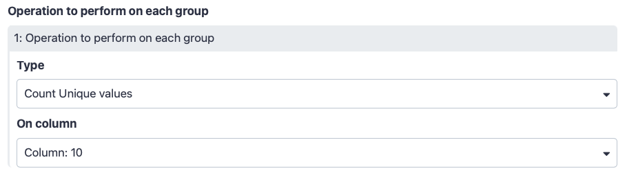
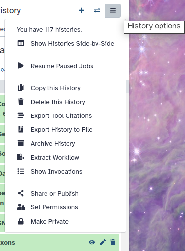
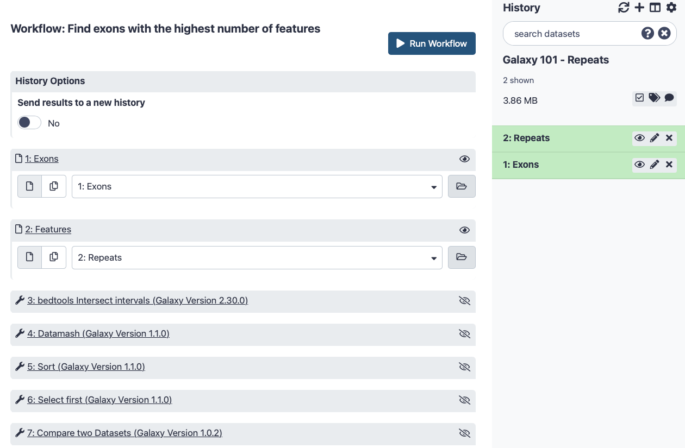

# Introduction


This tutorial aims to familiarize you with the Galaxy user interface. It will teach you how to perform basic tasks such as importing data, running tools, working with histories, creating workflows, and sharing your work.



> <agenda-title></agenda-title>
>
> In this tutorial, we will:
>
> 1. TOC
> {:toc}
>
{: .agenda}

# Setting the stage: Exons and SNPs

We start with the question: In human chromosome 22, which exon has the highest number of single nucleotide polymorphisms (SNPs)?

> <comment-title>Background</comment-title>
> Not everyone has the same background and that's ok! You may have studied different organisms with different gene models, or you may not be familiar with the biological aspect at all. The biological background is not necessary for following this tutorial, we just like to provide research context for any tutorial. Here are brief explanations of some of the concepts mentioned in this tutorial:
>
> - **Nucleotides** are the A, C, T, and Gs that make up DNA.
> - **Chromosomes** can be thought of as a very long piece of DNA (string of A, C, T, Gs) Some organisms have chromosomes, in this tutorial we will use Human chromosome number 22.
> - **Features** are regions of the chromosome that are interesting for one reason or another. Some examples of features include genes, terminators, transcription start sites, and repeat regions.
> - **Genes** are one kind of interesting feature, a region that will be [transcribed](https://en.wikipedia.org/wiki/Transcription_(biology)) into RNA before being [translated](https://en.wikipedia.org/wiki/Translation_(biology)) into proteins.
> - **Exons** are fundamental components of [eukaryotic](https://en.wikipedia.org/wiki/Eukaryote) [genes](https://en.wikipedia.org/wiki/Gene#Structure_and_function). A typical eukaryotic gene contains numerous *exons* separated by *introns*. An entire gene containing both exons and introns is *transcribed* into a pre-messenger RNA or pre-mRNA. During maturation introns are excised from the pre-mRNA in a process called *[splicing](https://www.nature.com/scitable/topicpage/rna-splicing-introns-exons-and-spliceosome-12375/)*.  A mature messenger RNA, or simply mRNA, is then *translated* into protein during the process of *translation*.
>
>
>   ")
>
> **SNP** is an abbreviation for [single-nucleotide polymorphism](https://en.wikipedia.org/wiki/Single-nucleotide_polymorphism). It is pronounced as "snip". SNPs are single nucleotide differences between a sequenced individual compared to some reference sequence; where one individual might have an A, another could have a C in that position. Databases of SNPs have been created for many organisms and they include any single nucleotide deviation from the reference sequence which appears in some percentage of the population (e.g. >1%). These are often especially interesting to geneticists as the causes of certain inheritable diseases.
{: .comment}

You may be familiar with the [UCSC Genome Browser](https://genome.ucsc.edu/) or another resource like it, and know that you can find the data there.
But even with your data in hand, you still have the question: "how do I actually compute this?" There is really a straightforward answer: **Galaxy**. So let's try it...

Browse to your favorite [Galaxy instance](https://galaxyproject.org/use/) and log in or register.



The Galaxy interface consists of three main parts:

1. The available **Tools** are listed on the left
2. The **Central Panel** will let you run analyses and view outputs
3. Your analysis **History** is recorded on the right


> 
{: .comment}

When you start Galaxy for very first time, your history will be empty. Let's add some data to it.

> <hands-on-title>Create history</hands-on-title>
>
> 1. Make sure you start from an empty analysis history.
>
>    
>
> 2. **Rename your history** to be meaningful and easy to find. You can do this by clicking on the title of the history (which by default is *Unnamed history*) and typing **Galaxy 101** as the name. Do  not forget to hit the <kbd>Enter</kbd> key on your keyboard to save it.
>
>    
>
{: .hands_on}

## Locating Exons

First we need to get some data into our history. You can upload files from your computer, or Galaxy can also fetch data directly from external sources. We know UCSC has exon locations for humans and we can use Galaxy to import the data for chromosome 22, directly from the UCSC table browser.

> <hands-on-title>Upload SNPs and Exons</hands-on-title>
> 1. At the top of the **Tools** panel (on the left), click  **Upload Data**
>
>    
>
>    This brings up a box:
>
>    
>
> 2. Click **Paste/Fetch data** and paste in the following URLs in the box that appears.
>
>    ```
>    https://zenodo.org/record/4104428/files/UCSC-hg38-chr22-Coding-Exons.bed
>    https://zenodo.org/record/4104428/files/UCSC-hg38-chr22-dbSNP153-Whole-Gene-SNPs.bed
>    ````
>
> 3. Click **Start**, and then **Close**
>
> 4. When they are ready, **rename**  the datasets to `Exons` and `SNPs`, respectively.
>
>    
>
{: .hands_on}

For this tutorial, we made the input datasets available on Zenodo for you. However, these datasets can also obtained directly from UCSC, without leaving Galaxy.
Below we describe how you can do this, but it is not necessary for this tutorial. Note that since the data in UCSC is updated frequently, you might get slightly different results in the rest of this tutorial if you use these files.

> <comment-title></comment-title>
> In order to get the datasets from the UCSC server, you need to have an account in an instance.
{: .comment}


> <tip-title>Optional: Obtaining the Data directly from UCSC</tip-title>
>
> This tool works a bit differently than most Galaxy tools, but if you wish to obtain the newest data from UCSC, you can do that as follows:
>
> > <hands-on-title>Obtaining Exons from UCSC</hands-on-title>
> >
> > 1. **UCSC Main**  table browser:
> >
> >     In the tool menu, navigate to `Get Data -> UCSC Main table browser`
> >
> >     
> >
> >     You will be taken to the **UCSC table browser**, which looks something like this:
> >
> >     
> >
> >     Now set the following parameters:
> >     - *"clade"*: `Mammal`
> >     - *"genome"*: `Human`
> >     - *"assembly"*: `Dec. 2013 (GRCh38/hg38)`
> >     - *"group"*: `Genes and Gene Predictions`
> >     - *"track"*: `GENCODE v36` (or a more recent version)
> >     - *"table"*: `knownGene`
> >     -  *"region"* should be changed to `position` with value `chr22`
> >     - *"output format"* should be changed to `BED - browser extensible data`
> >     -  *"Send output to"* should have the option `Galaxy` checked
> >
> >     > <comment-title></comment-title>
> >     > If the *"table"* drop down menu does not show the `knownGene` option. Set *"group"* to `All tables` and scroll down.
> >     {: .comment}
> >
> > 2. Click on the **get output** button and you will see the next screen:
> >
> >    
> >
> >    Change **Create one BED record per** to `Coding Exons` and then click on the **Send query to Galaxy** button.
> >
> >     > <comment-title></comment-title>
> >     > After this you will see your first history item in Galaxy's right panel. It will go through
> >     > the gray (preparing/queued) and yellow (running) states to become green (success):
> >     >
> >     > 
> >     >
> >     > You might need to login to Galaxy again.
> >     {: .comment}
> >
> > 3. When the dataset is green, click on the  (eye) icon to **view the contents** of the file. It should look something like this:
> >
> >    
> >
> >    Each line represents an exon, the first three columns are the genomic location, and the fourth column contains the name of the exon.
> >
> > 4. Let's rename our dataset to something more recognizable.
> >    - Click on the  **pencil icon** for the dataset to edit its attributes
> >    - In the central panel, change the **Name** field to `Exons`
> >    - Click the **Save** button
> >
> >    Your history should now look something like this:
> >
> >    
> {: .hands_on}
>
> We now have information about the exon locations, but our original question was which exon contains the largest number of SNPs, so let's get some information about SNP locations from UCSC as well:
>
> > <hands-on-title>Obtaining SNPs from UCSC</hands-on-title>
> > Again open the `UCSC Main table browser` tool and set the following parameters
> >
> > 1. **UCSC Main**  table browser:
> >    - *"group"* should be changed to `Variation`
> >    -  *"region"* should be changed again to `position` with value `chr22`
> >    - *"output format"* should be changed again to `BED - browser extensible data`
> >
> >    
> >
> >    The *"track"* setting shows the version of the SNP database to get. In this example it is version 151, but you may select the latest one. Your results may vary slightly from the ones in this tutorial when you select a different version, but in general it is a good idea to select the latest version, as this will contain the most up-to-date SNP information.
> >
> > 2. Click on the **get output** button to find a form similar to this:
> >
> >    
> >
> >    Make sure that *"Create one BED record per"* is set to `Whole Gene` (Whole Gene here really means Whole Feature), and click on **Send query to Galaxy**. A second item will appear in your analysis history.
> >
> > 3. Now **rename**  your new dataset to `SNPs` so we can easily remember what the file contains.
> >
> {: .hands_on}
>
{: .tip}

# Analysis

## Find exons with the most SNPs

Our objective is to find which exon contains the most SNPs. Therefore we have to intersect the file with the exon locations with the file containing the SNP locations (here "intersect" is just a fancy word for printing SNPs and exons that overlap side-by-side).

> <comment-title>Search bar</comment-title>
>
> Different Galaxy servers may have tools available under different sections, therefore it is often useful to use the **search bar** at the top of the tool panel to find your tool.
>
> Additionally different servers may have multiple, similarly named tools which accomplish similar functions. For these tutorials, you should select precisely the one that is described. However, in your real analyses, you'll need to search among the various options to find the one that works for you.
>
{: .comment}

> <hands-on-title>Finding Exons</hands-on-title>
>
> To find intersection we will be using `intersect intervals` tool from [BEDTools](https://bedtools.readthedocs.io/en/latest/content/overview.html) package.
>
> 1.  the intervals of two datasets side-by-side:
>
>    Enter the word `intersect` in the search bar of the tool panel, and select the
>    tool named `bedtools Intersect intervals`
>
>    - *"File A to intersect with B"*: Select `Exons`
>    - *"Combined or separate output files"*: Select `One output file per 'input B' file"`
>    - *"File B to intersect with A"*: `SNPs`
>    - *"What should be written to the output file?"*: `Write the original entry in B for each overlap...`, which means that only matches are included in the output (i.e. only exons with SNPs in it and only SNPs that fall in exons)
>
>  The interface of the tool should look like this:
>
>    
>
>    > <tip-title>How do I use this tool?</tip-title>
>    > All Galaxy tools include documentation. If you scroll down on this page, you will find the help of the tool.
>    {: .tip}
>
>
> 2. Click **Execute**
> 3. Wait for the job to finish
> 4. View the resulting file (with the  (eye) icon). If everything went okay, you should see a file that looks similar to this:
>
>    
>
>    Here column 4 contains exon IDs (e.g., `ENST00000252835.5_cds_0_0_chr22_15528159_f`) and column 10 lists SNP IDs (e.g., `rs9617249`) Remember that variations are possible due to using different versions of UCSC databases: as long as you have similar looking columns you did everything right!
>
> > <comment-title>If things didn't work...</comment-title>
> >
> > Did the Intersect tool error with a memory failure? Or is this step executing for a long time? Most likely a setting was missed when extracting the data from the UCSC Table Browser. Try again, double checking that:
> >
> >  * For both SNP and EXON: *"region"* is actually changed to `position` with value `chr22`
> >  * For EXON: *"Create one BED record per"* `Coding Exons` is selected (*not* `Whole Gene` as for the SNP data)
> >  * Carefully inspect the remaining Table Browser settings if these two most common reasons for problems were correct in your tool executions
> {: .comment}
>
{: .hands_on}

Let's take a look at this dataset. The first six columns correspond to the exons, and the last six columns correspond to the SNPs. Column 4 contains the exon IDs, and column 10 contains the SNP IDs. In our screenshot you see that the first lines in the file all have the same exon ID but different SNP IDs, meaning these lines represent different SNPs that all overlap the same exon.

> <question-title></question-title>
> For the first 3 exons in your file, what is the number of SNPs that fall into that exon?
>
> > <solution-title></solution-title>
> > At the time of writing, for hg38/GENCODE v29, joined with "Common dbSNPs(153)", using <kbd>ctrl-f</kbd> (<kbd>cmd-f</kbd> on Mac OS) to look for how many times each is used:
> >
> > Gene | Occurences
> > ---- | ----------
> > `ENST00000252835.5_cds_0_0_chr22_15528159_f` | 2
> > `ENST00000643195.1_cds_0_0_chr22_15528192_f` | 2
> > `ENST00000343518.11_cds_0_0_chr22_15690078_f` | 4
> {: .solution}
{: .question}


## Count the number of SNPs per exon

Since each line in our file represents a single overlap between SNP and exon, we can find the total number of SNPs in an exon, simply by counting the number of lines that have the same exon ID. However, to be more "proper" we will instead count the number of unique SNP IDs per exon. So let's do this for all the exons in our file:

> <hands-on-title>Counting SNPs</hands-on-title>
>
> 1.  (operations on tabular data):
>
>    - *"Input tabular dataset"*: select the output dataset from **bedtools intersect intervals** 
>    - *"Group by fields"*: `Column: 4` (the column with the exon IDs)
>
>    
>
>    - Scroll tool interface down to *"Operation to perform on each group"*
>      - *"Type"*: `Count Unique values`
>      - *"On column"*: `Column: 10` (this column contains SNPs ids like `rs2236639`. This we will count occurrences of unique SNP ids for each exon)
>
>    
>
> 2. Click **Execute**. Your new output dataset will look something like this:
>
>    
>
{: .hands_on}

This file contains only two columns. The first contains the exon IDs, and the second the number of times that exon ID appeared in the file - in other words, how many SNPs were present in that exon.

> <question-title></question-title>
> How many exons are there in total in your file?
>
> > <solution-title></solution-title>
> > Each line now represents a different exon, so you can see the answer to this when you expand the history item, as in the image above. The exact number you see for your dataset may be slightly different due to the updates to the exon and SNPs information in UCSC. In our case the dataset contains 4,242 lines, which is equal to the number of exons overlapped by at least one SNP.
> >
> {: .solution }
{: .question}

## Sort the exons by SNPs count

Now that we have a list of all exons, and the number of SNPs they contain, we would like to know which exon has the *highest number* of SNPs. We can do this by sorting the file on the second column.

> <hands-on-title>Sorting</hands-on-title>
>
> 1.  data in ascending or descending order:
>
>    - *"Sort Dataset"*: Output from **Datamash** 
>    - *"on column"*: `Column: 2`
>    - *"with flavor"*: `Numerical sort`
>    - *"everything in"*: `Descending order`
>
> 2. Click **Execute**
>
> 3. Examine the output file.
>
>    
>
>    The file should look similar to before sorting, but now the exons with the highest number of SNPs are at the top.
{: .hands_on}


> <question-title></question-title>
> Which exon has the highest number of SNPs in your file?
>
> > <solution-title></solution-title>
> > When this tutorial was last updated, `ENST00000253255.7_cds_0_0_chr22_46256561_r` had 27 SNPs.
> > Keep in mind this may depend on your settings when getting the data from UCSC.
> {: .solution}
{: .question}

## Select the top five exons

Let's say we want a list with just the top-5 exons with highest number of SNPs.

> <hands-on-title>Select first</hands-on-title>
>
> 1.  lines from a dataset (head):
>
>    - *"File to select"*: The output from **Sort** 
>    - "*Operation*": `Keep first lines`
>    - *"Number of lines"*: `5`
>
> 2. Click **Execute**
>
> 3. Examine the output file, this should contain only the first 5 lines of the previous dataset.
>
{: .hands_on}

## Recovering exon info

Congratulations! You have now determined which exons on chromosome 22 have the highest number of SNPs, but what else can we learn about them? One way to learn more about a genetic location is to view it in a genome browser. However, in the process of getting our answer, we have lost information about the location of these exons on the chromosome. But fear not, Galaxy saves all of your data, so we can recover this information quite easily.

> <hands-on-title>Compare two Datasets</hands-on-title>
>
> 1.  to find common or distinct rows:
>
>    - *"Compare"*: `Exons`
>    - *"Using column"*: `Column: 4`
>    - *"against"*: the output from **Select first** 
>    - *"and column"*: `Column: 1`
>    - *"to find"*: `Matching rows of 1st dataset`
>
> 2. Click **Execute**
> 3. Examine your output file. It should contain the locations of your top 5 exons:
>
>    
{: .hands_on}

## Displaying data in UCSC genome browser

A good way to learn about these exons is to look at their genomic surrounding. This can be done by using genome browsers. Galaxy can launch a genome browser such as IGV on your local machine, and it can connect to online genome browsers as well. An example of such an online genome browser is the UCSC genome browser.

> <hands-on-title>UCSC genome browser</hands-on-title>
>
> 1. First, check that the **database** of your latest history dataset is `hg38`. If not, click on the  pencil icon and modify the **Database/Build:** field to `Human Dec. 2013 (GRCh38/hg38) (hg38)`.
>
>    
>
> 2. Second, check that the **format** of your latest history dataset is `bed`. If not, click on the  pencil icon and modify the **Datatype** field to `bed`.
>
>    
>
> 3. To **visualize the data in UCSC genome browser**, click on `display at UCSC main` option visible when you expand the history item.
>
>    
>
>    This will upload the data to UCSC as custom track. To see your data look at the `User Track` near the top. You can enter the coordinates of one of your exons at the top to jump to that location.
>
>    
{: .hands_on}

UCSC provides a large number of tracks that can help you get a sense of your genomic area, it contains common SNPs, repeats, genes, and much more (scroll down to find all possible tracks).

# Galaxy management

In Galaxy your analyses live in histories such as your current one. Histories can be very large, and you can have as many histories as you want. You can control your histories (switching, copying, sharing, creating a fresh history, etc.) in the  **History Options** menu on the top of the history panel:



If you create a new history, your current history does not disappear. If you would like to list all of your histories just use the  Multi-history view:


Here you can:
- switch between different histories,
- delete a history,
- purge it (i.e. permanently delete it, this action cannot be reversed)
- copy histories
- copy datasets between histories (by dragging and dropping)

You can always return to your analysis view by clicking on Home icon  (**Analyze Data** on older versions of Galaxy) in the top menu bar.

## Convert your analysis history into a workflow

When you look carefully at your history, you can see that it contains all the steps of our analysis, from the beginning to the end. By building this history we have actually built a complete record of our analysis with Galaxy preserving all parameter settings applied at every step. But when you receive new data, or a new report is requested, it would be tedious to do each step over again. Wouldn't it be nice to just convert this history into a workflow that we will be able to execute again and again?

Galaxy makes this very easy with the `Extract workflow` option. This means any time you want to build a workflow, you can just perform the steps once manually, and then convert it to a workflow, so that next time it will be a lot less work to do the same analysis.

> <hands-on-title>Extract workflow</hands-on-title>
>
> 1. **Clean up** your history: remove any failed (red) jobs from your history by clicking on the  button.
>
>    This will make the creation of the workflow easier.
>
> 2. Click on  (**History options**) at the top of your history panel and select **Extract workflow**.
>
>    
>
>    The central panel will show the content of the history in reverse order (oldest on top), and you will be able to choose which steps to include in the workflow.
>
>    
>
> 3. Replace the **Workflow name** to something more descriptive, for example `Find exons with the highest number of features`.
>
>    While we created this workflow initially to analyse SNPs, if we had similarly formatted datasets we could use this workflow to find different features.
>
> 4. If there are any steps that shouldn't be included in the workflow, you can **uncheck** them in the first column of boxes.
>
> 5. Click on the **Create Workflow** button near the top.
>
>    You will get a message that the workflow was created. But where did it go?
>
> 6. Click on **Workflow** in the top menu of Galaxy. Here you have a list of all your workflows. Your newly created workflow should be listed at the top:
>
>    
{: .hands_on}

## The workflow editor

We can examine the workflow in Galaxy's workflow editor. Here you can view/change the parameter settings of each step, add and remove tools, and connect an output from one tool to the input of another, all in an easy and graphical manner. You can also use this editor to build workflows from scratch.

> <hands-on-title>Extract workflow</hands-on-title>
>
> 1. Click on the triangle to the right of your workflow name.
>
>    
>
> 2. Select **Edit** to launch the workflow editor. You should see something like this:
>
>    
>
>    When you click on a workflow step, you will get a view of all the parameter settings for that tool on the right-hand side of your screen.
>
>    
>
> 3. Re-arrange the boxes so you can clearly see the data flow. The default automatic layout hides some of the connections due to overlapping and box placement.
>
> 4. Make sure the  **check boxes** for `out_file1` in the `Select First` and `Compare two Datasets` tools are selected. Make sure that everything else is not selected.
>
>    Now, when we run the workflow, we will only see the final two outputs, i.e. the table with the top-5 exons and their SNP counts, and the file with exons ready for viewing in a genome browser.
>
> 5. The box named `Exons` is named ok, but we want to change `SNPs` since this workflow is not specific to SNPs
>
>    - **Click** on the box corresponding to the `SNPs` input dataset
>    - change the **Label** to `Features` on the right-hand side of your screen.
>
> 6. Let's also **rename the outputs**:
>
>    - Click on the `Select first` tool in the workflow editor
>    - In the menu on the right click on `Configure Output: 'out_file1'`
>        - Under `Rename dataset`, and enter a descriptive name for the output dataset like `Top 5 exon IDs`
>
>    
>
> 7. **Repeat** this for the output of the `Compare two Datasets` tool, naming it `Top 5 exons`
>
> 8. **Save your workflow** (important!) by clicking on the  icon at the top right of the screen.
>
> 9. **Return** to the analysis view by clicking on the Home icon  (or **Analyze Data** on older versions of Galaxy) at the top menu bar.
>
{: .hands_on}

> <comment-title></comment-title>
> We could **validate** our newly built workflow by running it on the same input datasets that we used at the start of this tutorial, in order to make sure we do obtain the same results.
{: .comment}

## Run workflow on different data

Now that we have built our workflow, let's use it on some different data. For example, let's find out which exons have the highest number of repeat elements.

> <hands-on-title>Run workflow</hands-on-title>
>
> 1. Create a **new history** and give it a name.
>
>    
>
> 2. We will need the list of exons again. We don't have to get this from UCSC again, we can just **copy** it from our previous history. The easiest way to do this is to go to the  history overview. Here you can just drag and drop datasets from one history to another.
>
>    
>
> 3. Click the Home icon  (or **Analyze Data** on older Galaxy versions) at the top to return to the main analysis window
>
> 4.  the Repeats file from [Zenodo](https://doi.org/10.5281/zenodo.4104428)
>
>    ```
>    https://zenodo.org/record/4104428/files/UCSC-hg38-chr22-Repeats.bed
>    ```
>
>    
>
>    > <tip-title>Obtaining the Data from UCSC</tip-title>
>    >
>    > Again, for reproducibility we obtain the data from Zenodo ensuring that the results will never change, allowing us to do good science! However if you wish to obtain UCSC data:
>    >
>    > > <hands-on-title>Obtaining Exons from UCSC</hands-on-title>
>    > >
>    > > 1. **UCSC Main**  table browser:
>    > >
>    > >     In the tool menu, navigate to `Get Data -> UCSC Main - table browser`
>    > >
>    > >     Now set the following parameters:
>    > >     - *"clade"*: `Mammal`
>    > >     - *"genome"*: `Human`
>    > >     - *"assembly"*: `Dec. 2013 (GRCh38/hg38)`
>    > >     - *"group"*: `Repeats`
>    > >     -  *"region"* should be changed to `position` with value `chr22`
>    > >     - *"output format"* should be changed to `BED - browser extensible data`
>    > >     -  *"Send output to"* should have the option `Galaxy` checked
>    > >
>    > >   Click on **get output** and then **Send query to Galaxy** on the next screen.
>    > {: .hands_on}
>    {: .tip}
>
> 5. **Rename**  the dataset to `Repeats`
>
> 6. Open the **workflow menu** (top menu bar). Find the workflow you made in the previous section, and select the option `Run`.
>
>    
>
>    
>
>    The central panel will change to allow you to configure and launch the workflow.
>
> 7. Select appropriate datasets for the inputs as shown below, then scroll down and click `Run workflow`.
>    - Select `Expand to full workflow form`
>    -  *"Exons"*: the `Exons` file you copied from our previous history
>    -  *"Features"*: the `Repeats` file we downloaded from UCSC
>
>    
>
>    > <comment-title>Potential workflow issues</comment-title>
>    >
>    >  * Galaxy validates the workflow inputs to ensure they're correct. It may show a validation error at the start, until you select `Exons` for the Exons input, and your repeats for the Features input.
>    >  * If you see an "Invalid column choice" error, you need to specify which column you want to use. If you have to type the column number, you need to type just the number e.g. `4` (not `Column 4` or anything else).
>    {: .comment}
>
> 8. Once the workflow has started, you will initially be able to see all its steps, but the unimportant intermediates will disappear after they complete successfully:
>
>    
{: .hands_on}

> <comment-title>Unhiding hidden datasets</comment-title>
> Because most intermediate steps of the workflow were hidden, once it is finished you will only see the final two datasets. If we want to view the intermediate files after all, you can click the "## hidden" just below the history's name.
{: .comment}

> <question-title></question-title>
> Which exon had the highest number of repeats? How many repeats were there?
{: .question}

## Share your work

One of the most important features of Galaxy comes at the end of an analysis. When you have published striking findings, it is important that other researchers are able to reproduce your in-silico experiment. Galaxy enables users to easily share their workflows and histories with others.

To share a history, click on the  icon in the history panel and select `Share or Publish`. On this page you can do 3 things:

1. **Make History Accessible via Link**. This generates a link that you can give out to others. Anybody with this link will be able to view your history.
2. **Make History Accessible and Publish**. This will not only create a link, but will also publish your history. This means your history will be listed under `Shared Data → Histories` in the top menu.
3. **Share with a user**. This will share the history only with specific users on the Galaxy instance.

> <comment-title>Permissions</comment-title>
> Different servers have different default permission settings. Some servers create all of your datasets completely private to you, while others make them accessible if you know the secret ID.
>
> Be sure to select **Also make all objects within the History accessible** whenever you make a history accessible via link, otherwise whomever you send your link to might not be able to see your history.
{: .comment}

> <hands-on-title>Share history and workflow</hands-on-title>
>
> 1. Share one of your histories with your neighbour.
> 2. See if you can do the same with your workflow!
> 3. Find the history and/or workflow shared by your neighbour. Histories shared with specific users can be accessed by those users in their  history menu under `Histories shared with me`.
{: .hands_on}

# Conclusion


 Well done! You have just performed your first analysis in Galaxy. You also created a workflow from your analysis so you can easily repeat the exact same analysis on other datasets. Additionally you shared your results and methods with others.
