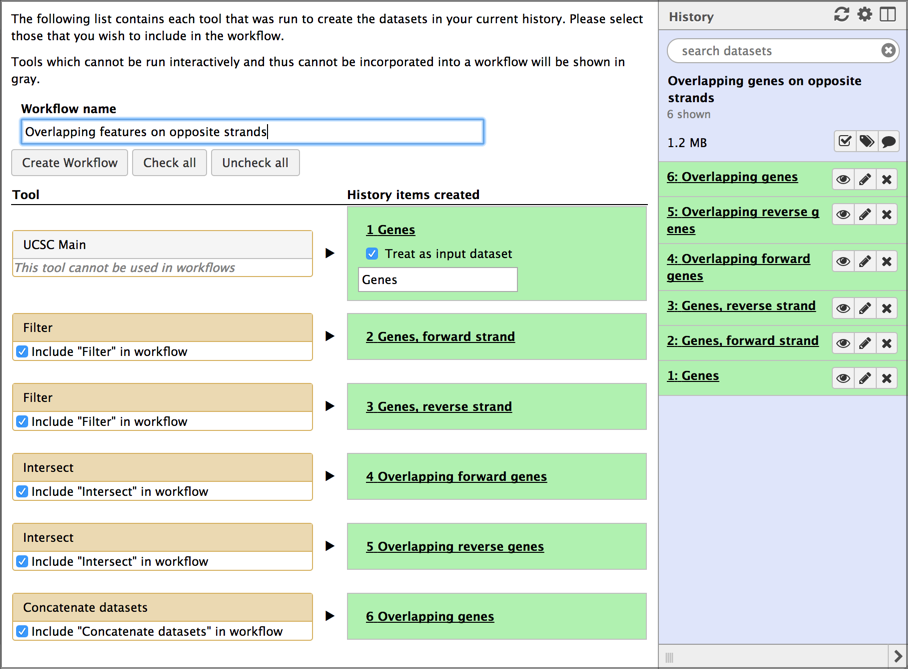
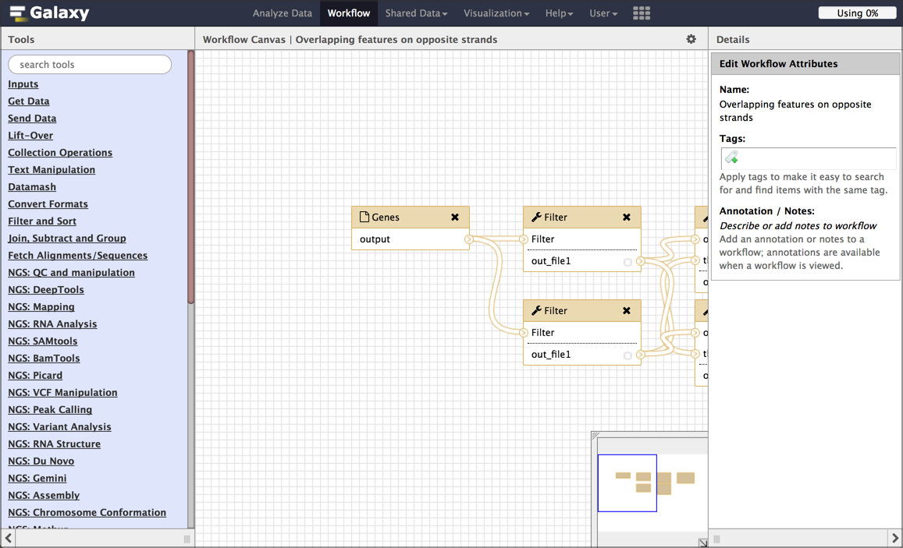
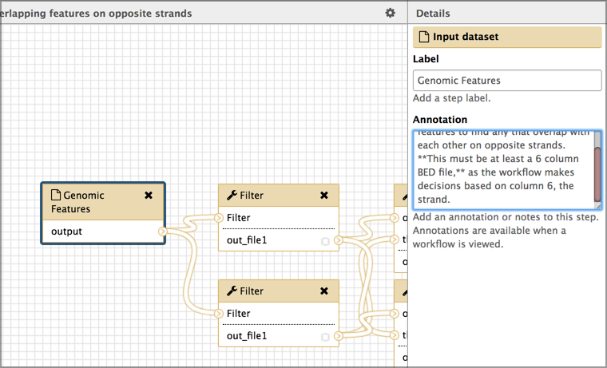

# Create a reusable workflow from a history
{:.no_toc}

This practical shows how to create a reusable analysis pipeline, called a *workflow* in Galaxy, from an analysis that you have already run in Galaxy, called a *history*.

> ###   Audience
> This tutorial is intended for those who are new to Galaxy.
{: .comment}

> ### Agenda
>
> In this tutorial, we will cover:
>
> 1. TOC
> {:toc}
>
{: .agenda}

# Pretreatments

> ###  Requirements
>
> To run this practical you will need
>
> 1. Previous experience running at least one analysis in Galaxy.
> 1. An internet-connected computer.  Galaxy can run on your laptop without an internet connection, but this practical requires access to resources on the web.
> 1. A web browser. [Firefox](https://www.mozilla.org/firefox) and [Google Chrome](https://www.google.com/chrome/) work well, as does [Safari](https://www.apple.com/safari/).  Internet Explorer is known to have issues with Galaxy so avoid using that.
> 1. Access to a Galaxy instance, and an account on that instance. Galaxy is available in many ways. If you are doing this practical as part of a workshop, the instructor will tell you which instance to use. If you are doing this on your own, you can use [usegalaxy.org](https://usegalaxy.org).
> 1. A Galaxy *history* from an analysis that you have already run.  If you don't have one handy, you can use this history on usegalaxy.org.  Click **Import History** to bring that history into your workspace on usegalaxy.org. Any history will work with this tutorial, but that's the one used in the examples.
{: .comment}

This tutorial is a good second step after running your first analysis on Galaxy.

## Motivation

Galaxy excels at helping researchers figure out how to do analyses.  It's easy to try different tools and settings, and if your first result isn't quite what you want, you can just keep trying until you get what you want.  What you may end up with is a slightly (or very) messy analysis *history* under your account.  If this is the only time you'll run that particular analysis then it's fine to just hang on to that history.   It might be handy to look at the next time you want to do something in Galaxy.

But what if you want to run that analysis again, maybe on updated datasets, or maybe even on entirely different datasets?  You could manually rerun all the steps in your first analysis, using the new datasets instead of the old.  But that is tedious, and error-prone. What you want is the ability to easily run exactly the same tools, with the same settings, in the same order as the first time you ran the analysis.

Galaxy *workflows* enable this, and this tutorial shows how you can create one from the analysis you have already done, and then run the analysis exactly as you did before, but on the new datasets.

> ###  Tip: Confused about *Histories* and *Workflows?*
>
> Well, you are not alone.  This analogy may help.
>
> * A *history* is a record of analysis that you have done, or of the analysis you are currently working on.  **Think of a history as a baked cake.**  It's something that been done.  It has input datasets, possibly intermediate datasets, and output datasets.  Think of the input datasets as the basic ingredients used to make the cake, like eggs and flour, and the output datasets are the cake.
>
> * A *workflow* is a **recipe** for running an analysis.  It doesn't contain any of the ingredients or the cake.  It does specify what you'll need to run the recipe: input datasets (the eggs and fllour), and all of the steps you'll need to do to create the cake (beat the eggs, mix the flour, sugar and baking powder, ...).
>
> In this tutorial we will take a fully baked cake (a history), *ask it to tell us the recipe that was used to create it,* and then create a recipe (a workflow) based on what the cake tells us.
>
> Happy baking.
{: .tip}

## Set your current history

By this time, you may have multiple histories under your Galaxy account.  You'll need to make the history that you want create a recipe/workflow for be your *current* history.  Your current history is the one shown in the History panel on the right.

> ###  Hands-on: Managing your histories
>
> To create a workflow, *you need to log in*.  If you haven't yet created an account, now is an ideal time to that.  Your current history will be saved as your first history under your new account.
>
> * At the top right of your history panel is an icon that looks like a table.  *Click* on that **table icon** to switch to your *histories* view.
>    > This lists your histories, from left to right in reverse chronological order, based on the last time each history was your current history.
> * If the history that you want to create a repeatable workflow for is *not* your *current* history (the left-most one), then find the history you want and then *click* the **Switch to** button at the top of the history.
>    > This makes that history the current history and moves it to the very left.
> * *Click* the **Done** button at the top upper left of your histories view.
>    > This returns you to the Galaxy home page with the selected history as your current history.
{: .hands_on}

> ###  Tip: Always name your histories
>
>If you just saw multiple `Unnamed history` entries in your histories view, then now you know why.
>
> **Bonus tip:** You can name your histories in your histories view.
{: .tip}

## Extract the recipe from your history

Now that we have the history we want, let's use Galaxy to create a reusable workflow from it.  To do this we'll use the history's **cog / history options** pull-down list.

> ###  Hands-on: Extract workflow
>
> * *Click* on the **cog icon** at the top of your history.
>    > This opens a pull-down menu showing lots of actions that you can perform on this history.  Right now, we are interested in only one of them:
> * *Click* on **Extract Workflow**.  It's about half-way down the menu.
>    > This launches a form to create a workflow.
> * *Give* your workflow a meaningful name.
>    > Think about giving it a more general name than what your history has. The example history is about looking for overlapping genes on opposite strands in human on chromosome 22.  That's pretty specific.  We want to create a workflow that can be used to detect any type of overlapping features, not just genes, and in any species and on any chromosome (or on all chromosomes).  The name should reflect this goal.
>    > For this example we'll name it `Overlapping features on opposite strands`
> * If there were any missteps or dead-ends in your history, uncheck those steps here.  Don't worry if you miss one - we can drop it in a subsequent step.
> * Once you have named your workflow, click the **Create Workflow** button.
>    
>
>    * This replaces the workflow creation form with a box that says:
>       * Workflow *`whatever name you entered`* created from current history. You can edit or run the workflow.
> * *Click* on the **edit** link in the box.
>
{: .hands_on}

This launches the workflow editor and shows a graphical representation of the inputs and steps taken during the analysis.  Each box is either an input dataset, or a tool that was run.  Boxes are connected by lines that show the flow of data from input datasets, through intermediate tools, to the tools that produce the final output(s).  Each tool box show a list of inputs (at the top) and a list of outputs (at the bottom).  The flow of data is generally from left to right.

While we could run this workflow right now, here are a few cleanup items we should do first.

### Rename input datasets

The *extract workflow* step assigns the name of input datasets in your history to the corresponding inputs in your workflow.  This is very helpful in the short term because it makes it clear which of the boxes are which datasets.  But, for a workflow, we want a more general (but still helpful) name for input datasets.

> ###  Hands-on: Rename inputs
>
> * *Click* on the first input dataset.
>    > This changes the right panel to show informtion about the seclected dataset.  In this example, this dataset is a set of genomic features (like genes or exons or repeats) that exist in an orgramism.
> * *Set* the **Label** field to something more general, yet still informative.  In the example workflow, we'll name this `Genome features` about as general as you can get.
> * To help make your general input dataset name more informative, *add* a description of the dataset in the **Annotation** box. For the example, we'll use `Workflow checks this set of genomic features to find any that overlap with each other on opposite strands.  **This must be at least a 6 column BED file,** as the workflow makes decisions based on column 6, the strand.`
>      
{: .hands_on}

There are several other things we could do in the workflow editor, but let's focus on just two of them.

First, your history might contain several false starts or tool runs where the parameters weren't quite right. Lets get rid of those now.

> ###  Hands-on: Drop unused input datasets and tool boxes
>
> * If your history contained any false starts or tool runs that didn't contribute to your final result, then *delete* them from the workflow by clicking the black **x** in the corner of those datasets/tools' boxes.
>    > This will remove them from the workflow.
{: .hands_on}

> ###  Tip
> You can also delete these steps when you are first extracting the workflow from your history, by unchecking them.  However, it is often easier to identify the steps to drop in the workflow view, where connections and dead-ends are more obvious.
{: .tip}

Second, you might want to give your output datasets meaningful names too.

> ###  Hands-on: Name output datasets
>
> * *Click* on a step that produces an output file.
>    > This brings up information about that step in the right panel.
> * *Scroll* down in the right panel until you see a **Configure Output** link.  *Click* on it.
> * *Enter* a meaningful name in the **Rename dataset** field.
>    > In the exmple, we'll enter `Features that overlap another feature on opposite strand.`
> * Repeat for all your output datasets.
{: .hands_on}

We could add annotation to each step in the process as well, and if this workflow is going to be published in a paper, or shared with others, then that is definitely worth doing.

Now that our edits are done, let's save our work and run the workflow.

> ###  Hands-on: Save workflow edits
>
> * To save our changes, *click* on the **cog icon** at the top right of the center panel, and *select* **Save** from the pull-down menu.
> * Once your changes are saved, again *click* on the **cog icon** but this time select **Run**.  We are ready to go.
{: .hands_on}

You should now see the workflow run form.  This form lists all the inputs and steps in the workflow also asks if you want to run this workflow in a new history, of just add it to your existing history.

In this form you can also change the run-time parameters of any of the steps.  We aren't going to do that, but it can be useful when are experimenting with different parameters in different steps.

Let's test the workflow by running it on the same input datasets we used in the current history.  If we created the workflow correctly, we should get the same results as in the history.

> ###  Hands-on: Test the workflow
>
> * In this case we recommend *selecting* **Yes** under **Send results to a new history**.
>    > Sometimes you'll be building analyses out of component workflows and you will want to run them all in the same history.  Here we want a new history because the results will be cleaner and easier to understand.
>    > Give the new history a meaningful name.
> * *Set* your first input dataset using the pull-down menu.
> * *Repeat* until all input datasets are set.
> * *Click* the **Run workflow** button.
{: .hands_on}

And Galaxy launches the workflow, running in a new history.  It says (in a nice big green box) something like:

> You can check the status of queued jobs and view the resulting data *by refreshing the History pane.* When the job has been run the status will change from 'running' to 'finished' if completed successfully or 'error' if problems were encountered.

But, *that's a lie*.  In our case we sent the results to a new history, and the history panel is still showing us the old history.  To get to the new history, open the histories view (*click* the **table icon** at top of history) and then make the newly created history be the current history.

Depending on your workflow and datasets, your analysis may already be done by the time you make it the current history and go back to the standard view.

At this point it's worth doing a little cleanup.  In particular think about updating the output dataset names to be more specific to the data we actually used.

## Final thoughts

* Workflows can also be created from scratch
* If you ever work on large studies or even if you have just a few samples, workflows are critical to
  1. Running the same analysis on each dataset.
  1. Not going insane.
