In this section we will look at practical aspects of manipulation of next-generation sequencing data. We will start with Fastq format produced by most sequencing machines and will finish with SAM/BAM format representing mapped reads. The cover image above shows a screen dump of a SAM dataset.

# Getting NGS data in

You can data in Galaxy using one of five ways:

## From your computer

This works well for small files because web browser do not like lengthy file transfers:

<div class="embed-responsive embed-responsive-16by9"><iframe src="https://player.vimeo.com/video/120901536?portrait=0" webkitallowfullscreen mozallowfullscreen allowfullscreen></iframe></div>

## Using FTP

FTP ([file transfer protocol](https://en.wikipedia.org/wiki/File_Transfer_Protocol)) allows transferring large collection of files:

<div class="embed-responsive embed-responsive-16by9"><iframe src="https://player.vimeo.com/video/120972739?portrait=0" webkitallowfullscreen mozallowfullscreen allowfullscreen></iframe></div>

## From the Web

Upload from the web works when URL (addresses) of data files are known:

<div class="embed-responsive embed-responsive-16by9"><iframe src="https://player.vimeo.com/video/120973708?portrait=0" webkitallowfullscreen mozallowfullscreen allowfullscreen></iframe></div>

## From EBI short read archive

This is the best way to upload published datasets deposited to EBI SRA. The problem is that not all datasets are available from EBI. Next option (below) explain how to deal with NCBI SRA datasets:

<div class="embed-responsive embed-responsive-16by9"><iframe src="https://player.vimeo.com/video/121187220?portrait=0" webkitallowfullscreen mozallowfullscreen allowfullscreen></iframe></div>

## From NCBI short read archive

Finally, datasets can be uploaded directly from NCBI's short read archive:

<div class="embed-responsive embed-responsive-16by9"><iframe src="https://player.vimeo.com/video/121190377?portrait=0" webkitallowfullscreen mozallowfullscreen allowfullscreen></iframe></div>

### Try it yourself

- Create a new Galaxy history at https://usegalaxy.org (don't forget to log in).
- Import the following two datasets (for help see the above video):
  - [A set of Forward reads](https://www.bx.psu.edu/~anton/share/ng_test_data/var/raw_mother-ds-1.fq.gz)
  - [A set of Reverse reads](https://www.bx.psu.edu/~anton/share/ng_test_data/var/raw_mother-ds-2.fq.gz)

These are paired end data (see below for explanation of what paired-end is) for a single Illumina run. Keep Galaxy history for later. We will need it again in a few minutes.

# Fastq manipulation and quality control

## What is Fastq?

[FastQ](https://en.wikipedia.org/wiki/FASTQ_format) is not a very well defined format. In the beginning various manufacturers of sequencing instruments were free to interpret fastq as they saw fit, resulting in a multitude of fastq flavors. This variation stemmed primarily from different ways of encoding quality values as described [here](https://en.wikipedia.org/wiki/FASTQ_format) (below you will explanation of quality scores and their meaning). Today, [fastq Sanger](https://www.ncbi.nlm.nih.gov/pubmed/20015970) version of the format is considered to be the standard form of fastq. Galaxy is using fastq sanger as the only legitimate input for downstream processing tools and provides [a number of utilities for converting fastq files](https://www.ncbi.nlm.nih.gov/pubmed/20562416) into this form (see **NGS: QC and manipulation** section of Galaxy tools).

Fastq format looks like this:


```

@M02286:19:000000000-AA549:1:1101:12677:1273 1:N:0:23
CCTACGGGTGGCAGCAGTGAGGAATATTGGTCAATGGACGGAAGTCTGAACCAGCCAAGTAGCGTGCAG
+
ABC8C,:@F:CE8,B-,C,-6-9-C,CE9-CC--C-<-C++,,+;CE<,,CD,CEFC,@E9<FCFCF?9
@M02286:19:000000000-AA549:1:1101:15048:1299 1:N:0:23
CCTACGGGTGGCTGCAGTGAGGAATATTGGACAATGGTCGGAAGACTGATCCAGCCATGCCGCGTGCAG
+
ABC@CC77CFCEG;F9<F89<9--C,CE,--C-6C-,CE:++7:,CF<,CEF,CFGGD8FFCFCFEGCF
@M02286:19:000000000-AA549:1:1101:11116:1322 1:N:0:23
CCTACGGGAGGCAGCAGTAGGGAATCTTCGGCAATGGACGGAAGTCTGACCGAGCAACGCCGCGTGAGT
+
AAC<CCF+@@>CC,C9,F9C9@9-CFFFE@7@:+CC8-C@:7,@EFE,6CF:+8F7EFEEF@EGGGEEE

```

Each sequencing read is represented by four lines:

1. `@` followed by read ID and optional information about sequencing run
2. sequenced bases
3. `+` (optionally followed by the read ID and some additional info)
4. quality scores for each base of the sequence encoded as [ASCII symbols](https://en.wikipedia.org/wiki/ASCII)

## Paired end data

It is common to prepare pair-end and mate-pair sequencing libraries. This is highly beneficial for a number of applications discussed in subsequent topics. For now let's just briefly discuss what these are and how they manifest themselves in fastq form.

|   |
|----|
| 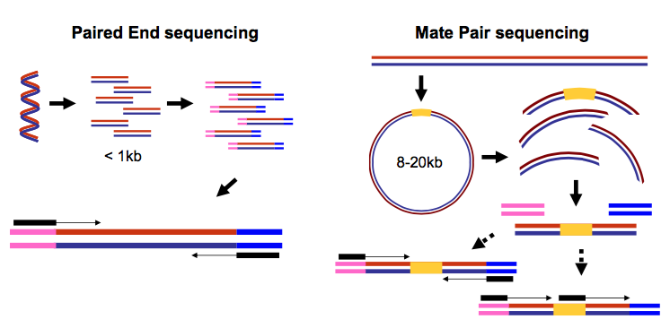 |
|<small>**Paired-end and mate-pair reads**. In paired end sequencing (left) the actual ends of rather short DNA molecules (less than 1kb) are determined, while for mate pair sequencing (right) the ends of long molecules are joined and prepared in special sequencing libraries. In these mate pair protocols, the ends of long, size-selected molecules are connected with an internal adapter sequence (i.e. linker, yellow) in a circularization reaction. The circular molecule is then processed using restriction enzymes or fragmentation. Fragments are enriched for the linker and outer library adapters are added around the two combined molecule ends. The internal adapter can then be used as a second priming site for an additional sequencing reaction in the same orientation or sequencing can be performed from the second adapter, from the reverse strand. (From Ph.D. dissertation by [Martin Kircher](https://core.ac.uk/download/pdf/35186947.pdf))</small>|


Thus in both cases (paired-end and mate-pair) a single physical piece of DNA (or RNA in the case of RNA-seq) is sequenced from two ends and so generates two reads. These can be represented as separate files (two fastq files with first and second reads) or a single file were reads for each end are interleaved. Here are examples:

#### Two single files

**File 1**

```
 @M02286:19:000000000-AA549:1:1101:12677:1273 1:N:0:23
 CCTACGGGTGGCAGCAGTGAGGAATATTGGTCAATGGACGGAAGTCT
 +
 ABC8C,:@F:CE8,B-,C,-6-9-C,CE9-CC--C-<-C++,,+;CE
 @M02286:19:000000000-AA549:1:1101:15048:1299 1:N:0:23
 CCTACGGGTGGCTGCAGTGAGGAATATTGGACAATGGTCGGAAGACT
 +
 ABC@CC77CFCEG;F9<F89<9--C,CE,--C-6C-,CE:++7:,CF
```

 **File 2**

```
@M02286:19:000000000-AA549:1:1101:12677:1273 2:N:0:23
CACTACCCGTGTATCTAATCCTGTTTGATACCCGCACCTTCGAGCTTA
+
--8A,CCE+,,;,<CC,,<CE@,CFD,,C,CFF+@+@CCEF,,,B+C,
@M02286:19:000000000-AA549:1:1101:15048:1299 2:N:0:23
CACTACCGGGGTATCTAATCCTGTTCGCTCCCCACGCTTTCGTCCATC
+
-6AC,EE@::CF7CFF<<FFGGDFFF,@FGGGG?F7FEGGGDEFF>FF
```

<div class="alert alert-info" role="alert">

**Note** that read IDs are **identical** in two files and they are listed in **the same** order. In some cases read IDs in the first and second file may be appended with `/1` and `/2` tags, respectively.

</div>

#### Interleaved file

```
@1/1
AGGGATGTGTTAGGGTTAGGGTTAGGGTTAGGGTTAGGGTTAGGGTTA
+
EGGEGGGDFGEEEAEECGDEGGFEEGEFGBEEDDECFEFDD@CDD<ED
@1/2
CCTAACCCTAACCCTAACCCTAACCCTAACCCTAACCCTAACCCTAAC
+
GHHHDFDFGFGEGFBGEGGEGEGGGHGFGHFHFHHHHHHHEF?EFEFF
@2/1
AGGGATGTGTTAGGGTTAGGGTTAGGGTTAGGGTTAGGGTTAGGGTTA
+
HHHHHHEGFHEEFEEHEEHHGGEGGGGEFGFGGGGHHHHFBEEEEEFG
@2/2
CCTAACCCTAACCCTAACCCTAACCCTAACCCTAACCCTAACCCTAAC
+
HHHHHHHHHHHHHGHHHHHHGHHHHHHHHHHHFHHHFHHHHHHHHHHH
```

Here the first and the second reads are identified with `/1` and `/2` tags.

<div class="alert alert-warning" role="alert">

**Note**: Fastq format is not strictly defined and its variations will always cause headache for you. See [this page](https://www.ncbi.nlm.nih.gov/books/NBK242622/) for more information.

</div>

## What are base qualities?

As we've seen above, fastq datasets contain two types of information:

- *sequence of the read*
- *base qualities* for each nucleotide in the read.

The base qualities allow us to judge how trustworthy each base in a sequencing read is. The following excerpt from an excellent [tutorial](http://chagall.med.cornell.edu/RNASEQcourse/Intro2RNAseq.pdf) by Friederike D&uuml;ndar, Luce Skrabanek, Paul Zumbo explains what base qualities are:

<div class="well well-lg">

Illumina sequencing is based on identifying the individual nucleotides by the fluorescence signal emitted upon their incorporation into the growing sequencing read. Once the fluorescence intensities are extracted and translated into the four letter code. The deduction of nucleotide sequences from the images acquired during sequencing is commonly referred to as base calling. Due to the imperfect nature of the sequencing process and limitations of the optical instruments, base calling will always have inherent uncertainty. This is the reason why FASTQ files store the DNA sequence of each read together with a position-specific quality score that represents the error probability, i.e., how likely it is that an individual base call may be incorrect. The score is called [Phred score](http://www.phrap.com/phred/), $Q$, which is proportional to the probability $p$ that a base call is incorrect, where $Q = −10lg(p)$. For example, a Phred score of 10 corresponds to one error in every ten base calls ($Q = −10lg(0.1)$), or 90% accuracy; a Phred score of 20 corresponds to one error in every 100 base calls, or 99% accuracy. A higher Phred score thus reflects higher confidence in the reported base. To assign each base a unique score identifier (instead of numbers of varying character length), Phred scores are typically represented as ASCII characters. At http://ascii-code.com/ you can see which characters are assigned to what number. For raw reads, the range of scores will depend on the sequencing technology and the base caller used (Illumina, for example, used a tool called Bustard, or, more recently, RTA). Unfortunately, Illumina has been anything but consistent in how they calculated and ASCII-encoded the Phred score (see below)! In addition, Illumina now allows Phred scores for base calls with as high as 45, while 41 used to be the maximum score until the HiSeq X. This may cause issues with downstream sapplications that expect an upper limit of 41.

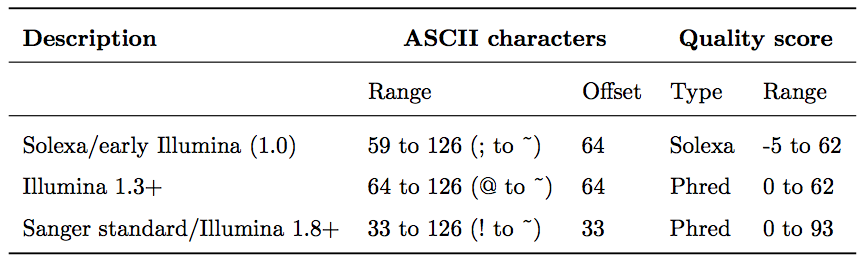

</div>

Base call quality scores are represented with the Phred range. Different Illumina (formerly Solexa) versions
used different scores and ASCII offsets. Starting with Illumina format 1.8, the score now represents the standard
Sanger/Phred format that is also used by other sequencing platforms and the sequencing archives.

|                                                              |
|--------------------------------------------------------------|
| 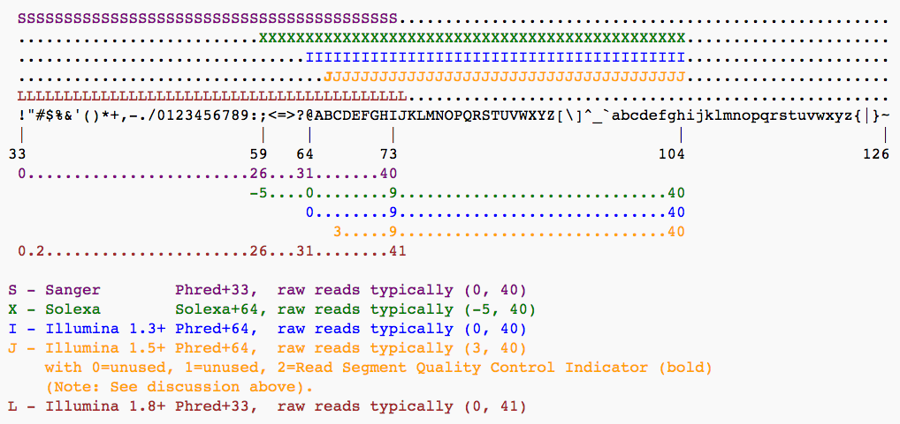 |
| <small>The ASCII interpretation and ranges of the different Phred score notations used by Illumina and the original Sanger interpretation. Although the Sanger format allows a theoretical score of 93, raw sequencing reads typically do not exceed a Phred score of 60. In fact, most Illumina-based sequencing will result in maximum scores of 41 to 45 (image from [Wikipedia](https://en.wikipedia.org/wiki/FASTQ_format)</small> |

## Assessing data quality

One of the first steps in the analysis of NGS data is seeing how good the data actually is. [FastqQC](https://www.bioinformatics.babraham.ac.uk/projects/fastqc/) is a fantastic tool allowing you to gauge the quality of fastq datasets (and deciding whether to blame or not to blame whoever has done sequencing for you).

|                                        |                                    |
|:---------------------------------------|:-----------------------------------|
| 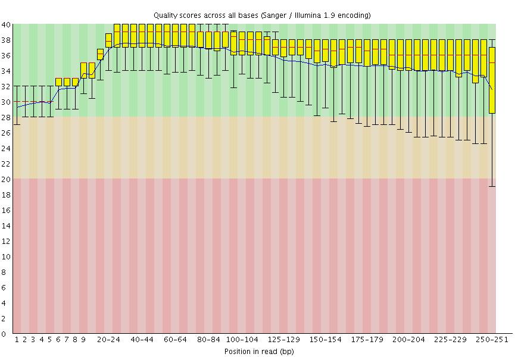    | 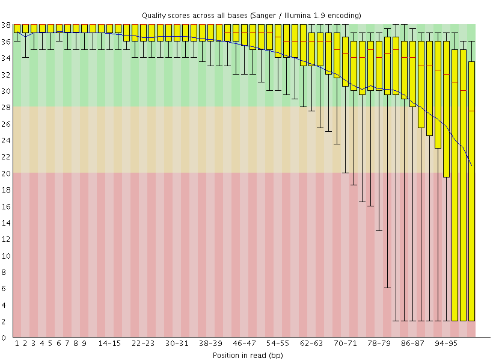 |    
|<small>**A.** Excellent quality</small> | <small>**B.** Hmmm...OK</small>    |

Here you can see FastQC base quality reports (the tools gives you many other types of data) for two datasets: **A** and **B**. The **A** dataset has long reads (250 bp) and very good quality profile with no qualities dropping below [phred score](http://www.phrap.com/phred/) of 30. The **B** dataset is significantly worse with ends of the reads dipping below phred score of 20. The **B** reads may need to be trimmed for further processing.

<div class="embed-responsive embed-responsive-16by9"><iframe src="https://player.vimeo.com/video/123453134?portrait=0" webkitallowfullscreen mozallowfullscreen allowfullscreen></iframe></div>

### Try it yourself

QC datasets you have uploaded before.

# Mapping your data

Mapping of NGS reads against reference sequences is one of the key steps of the analysis. Now it is time to see how this is done in practice. Below is a list of key publications highlighting mainstream mapping tools:

- 2009 Bowtie 1 - [Langmead et al.](http://genomebiology.com/content/10/3/R25)
- 2012 Bowtie 2 - [Langmead and Salzberg](https://www.ncbi.nlm.nih.gov/pmc/articles/PMC3322381/)
- 2009 BWA - [Li and Durbin](https://academic.oup.com/bioinformatics/article/25/14/1754/225615/Fast-and-accurate-short-read-alignment-with)
- 2010 BWA - [Li and Durbin](https://academic.oup.com/bioinformatics/article/26/5/589/211735/Fast-and-accurate-long-read-alignment-with-Burrows)
- 2013 BWA-MEM - [Li](https://arxiv.org/abs/1303.3997)

## Mapping against a pre-computed genome index

Mappers usually compare reads against a reference sequence that has been transformed into a highly accessible data structure called genome index. Such indexes should be generated before mapping begins. Galaxy instances typically store indexes for a number of publicly available genome builds.

|                                                              |
|--------------------------------------------------------------|
| 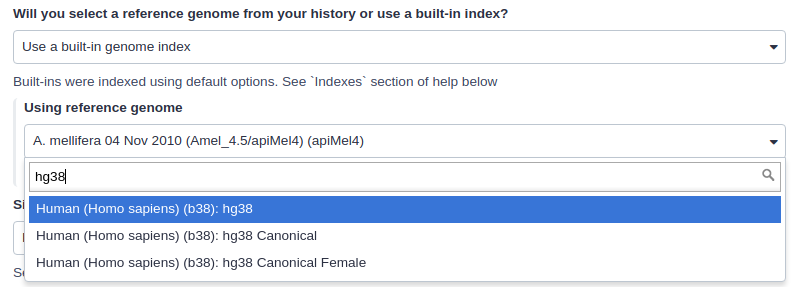                    |
|<small>Mapping against a pre-computed index in Galaxy.</small>|

For example, the image above shows indexes for `hg38` version of the human genome. You can see that there are actually three choices: (1) `hg38`, (2) `hg38 canonical` and (3) `hg38 canonical female`. The `hg38` contains all chromosomes as well as all unplaced contigs. The `hg38 canonical` does not contain unplaced sequences and only consists of chromosomes 1 through 22, X, Y, and mitochondria. The
`hg38 canonical female` contains everything from the canonical set with the exception of chromosome Y.

The following video show mapping using BWA:

<div class="embed-responsive embed-responsive-16by9"><iframe src="https://player.vimeo.com/video/123102338?portrait=0" webkitallowfullscreen mozallowfullscreen allowfullscreen></iframe></div>

### Try it yourself

Map datasets uploaded before using BWA against `hg38` version of the human genome.

## What if pre-computed index does not exist?

If Galaxy does not have a genome you need to map against, you can upload your genome sequence as a FASTA file and use it in the mapper directly as shown below (**Load reference genome** is set to `History`).

|                                                              |
|--------------------------------------------------------------|
| 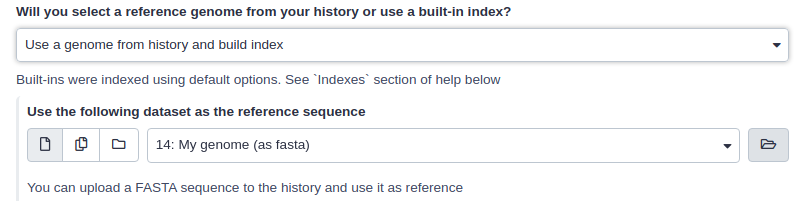 |
|<small>Mapping against a pre-computed index in Galaxy </small>|

In this case Galaxy will first create an index from this dataset and then run mapping analysis against it. The following video shows how this works in practice:

<div class="embed-responsive embed-responsive-16by9"><iframe src="https://player.vimeo.com/video/123108417?portrait=0" webkitallowfullscreen mozallowfullscreen allowfullscreen></iframe></div>

# SAM/BAM datasets

The [SAM/BAM](https://samtools.github.io/hts-specs/SAMv1.pdf) format is an accepted standard for storing aligned reads (it can also store unaligned reads and some mappers such as BWA are accepting unaligned BAM as input). The binary form of the format (BAM) is compact and can be rapidly searched (if indexed). In Galaxy BAM datasets are always indexed (accompanies by a .bai file) and sorted in coordinate order. In the following duscussion I once again rely on [tutorial](http://chagall.med.cornell.edu/RNASEQcourse/Intro2RNAseq.pdf) by Friederike D&uuml;ndar, Luce Skrabanek, and Paul Zumbo.

The Sequence Alignment/Map (SAM) format is, in fact, a generic nucleotide alignment format that describes the alignment of sequencing reads (or query sequences) to a reference. The human readable, TABdelimited SAM files can be compressed into the Binary Alignment/Map format. These BAM files are bigger than simply gzipped SAM files, because they have been optimized for fast random access rather than size reduction. Position-sorted BAM files can be indexed so that all reads aligning to a locus can be efficiently retrieved without loading the entire file into memory.

As shown below, SAM files typically contain a short header section and a very long alignment section where each row represents a single read alignment. The following sections will explain the SAM format in a bit more detail. For the most comprehensive and updated information go to https://github.com/samtools/hts-specs.

|                                                              |
|--------------------------------------------------------------|
| 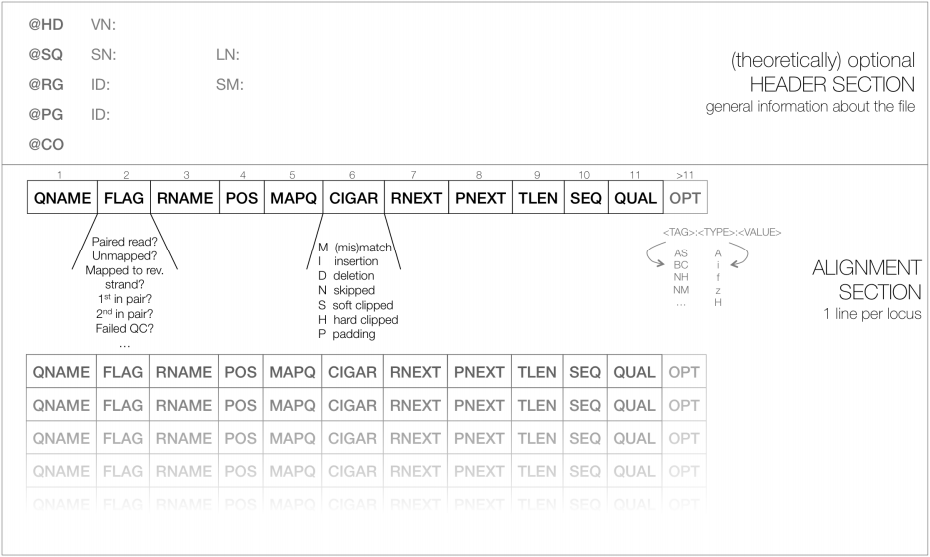   |
|<small>**Schematic representation of a SAM file**. Each line of the optional header section starts with “@”, followed by the appropriate abbreviation (e.g., SQ for sequence dictionary which lists all chromosomes names (SN) and their lengths (LN)). The vast majority of lines within a SAM file typically correspond to read alignments where each read is described by the 11 mandatory entries (black font) and a variable number of optional fields (grey font). From [tutorial](http://chagall.med.cornell.edu/RNASEQcourse/Intro2RNAseq.pdf) by Friederike D&uuml;ndar, Luce Skrabanek, and Paul Zumbo.</small>|

## SAM Header

The header section includes information about how the alignment was generated and stored. All lines in the header section are tab-delimited and begin with the “@” character, followed by tag:value pairs, where tag is a two-letter string that defines the content and the format of value. For example, the “@SQ” line in the header section contains the information about the names and lengths of the *reference sequences to which the reads were aligned. For a hypothetical organism with three chromosomes of length 1,000 bp, the SAM header should contain the following three lines:

```
@SQ SN:chr1 LN:1000
@SQ SN:chr2 LN:1000
@SQ SN:chr3 LN:1000
```

## SAM alignment section

The optional header section is followed by the alignment section where each line corresponds to one sequenced read. For each read, there are 11 mandatory fields that always appear in the same order:

```
<QNAME> <FLAG> <RNAME> <POS> <MAPQ> <CIGAR> <MRNM> <MPOS> <ISIZE> <SEQ> <QUAL>
```

If the corresponding information is unavailable or irrelevant, field values can be ‘0’ or ‘*’ (depending on the field, see below), but they cannot be missing! After the 11 mandatory fields, a variable number of optional fields can be present. Here’s an example of one single line of a real-life SAM file (you may need to scroll sideways):

```
ERR458493 .552967 16 chrI 140 255 12 M61232N37M2S * 0 0 CCACTCGTTCACCAGGGCCGGCGGGCTGATCACTTTATCGTGCATCTTGGC BB?HHJJIGHHJIGIIJJIJGIJIJJIIIGHBJJJJJJHHHHFFDDDA1+B NH:i:1 HI:i:1 AS:i:41 nM:i:2
```

The following table explains the format and content of each field. The `FLAG`, `CIGAR`, and the optional fields (marked in blue) are explained in more detail below. The number of optional fields can vary widely between different SAM files and even between reads within in the same file. The field types marked in blue are explained in more detail in the main text below.

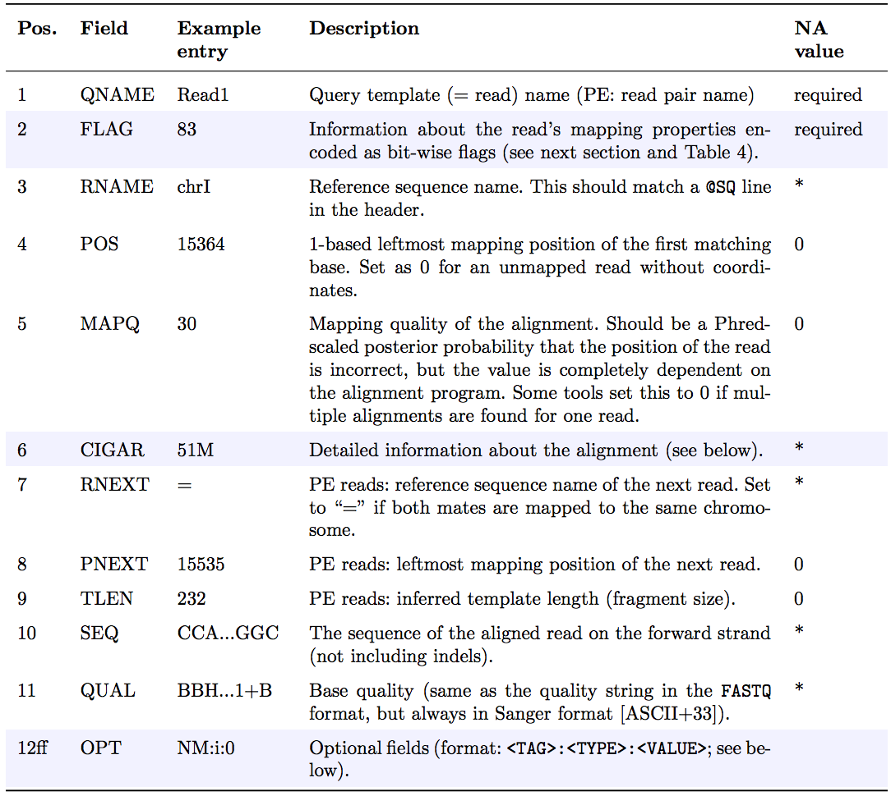

### `FLAG` field

The FLAG field encodes various pieces of information about the individual read, which is particularly important for PE reads. It contains an integer that is generated from a sequence of Boolean bits (0, 1). This way, answers to multiple binary (Yes/No) questions can be compactly stored as a series of bits, where each of the single bits can be addressed and assigned separately.

The following table gives an overview of the different properties that can be encoded in the FLAG field. The developers of the SAM format and samtools tend to use the hexadecimal encoding as a means to refer to the different bits in their documentation. The value of the FLAG field in a given SAM file, however, will always be the decimal representation of the sum of the underlying binary values (as shown in Table below, row 2).

|                                                              |
|--------------------------------------------------------------|
| 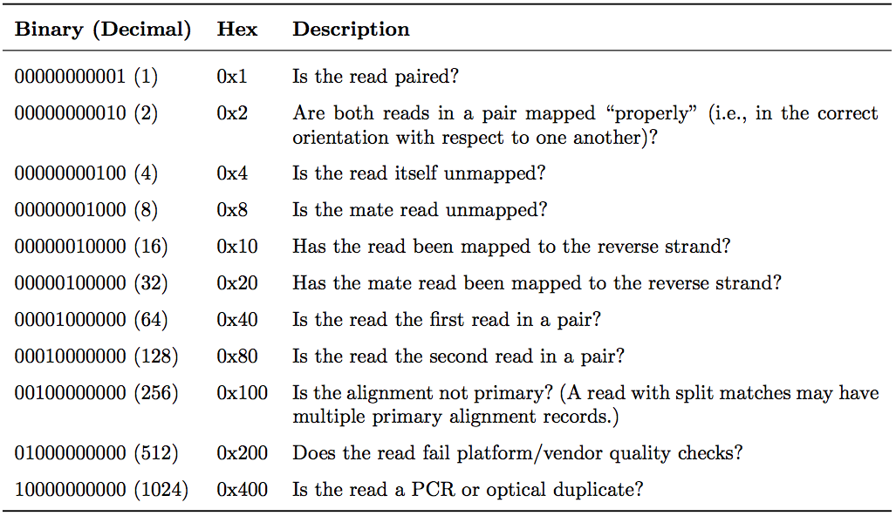 |
|<small>The `FLAG` field of SAM files stores information about the respective read alignment in one single decimal number. The decimal number is the sum of all the answers to the Yes/No questions associated with each binary bit. The hexadecimal representation is used to refer to the individual bits (questions). A bit is set if the corresponding state is true. For example, if a read is paired, `0x1` will be set, returning the decimal value of 1. Therefore, all `FLAG` values associated with paired reads must be uneven decimal numbers. Conversely, if the `0x1` bit is unset (= read is not paired), no assumptions can be made about `0x2`, `0x8`, `0x20`, `0x40` and `0x80` because they refer to paired reads. From [tutorial](http://chagall.med.cornell.edu/RNASEQcourse/Intro2RNAseq.pdf) by Friederike D&uuml;ndar, Luce Skrabanek, and Paul Zumbo</small>|

In a run with single reads, the flags you most commonly see are:

- 0: This read has been mapped to the forward strand. (None of the bit-wise flags have been set.)
- 4: The read is unmapped (`0x4` is set).
- 16: The read is mapped to the reverse strand (`0x10` is set)

(`0x100`, `0x200` and `0x400` are not used by most aligners/mappers, but could, in principle be set for single reads.) Some common `FLAG` values that you may see in a PE experiment include:


|                     |                                      |
----------------------|---------------------------------------
|**69** (= 1 + 4 + 64) | The read is paired, is the first read in the pair, and is unmapped.|
|**77** (= 1 + 4 + 8 + 64) | The read is paired, is the first read in the pair, both are unmapped.|
|**83** (= 1 + 2 + 16 + 64) | The read is paired, mapped in a proper pair, is the first read in the pair, and it is mapped to the reverse strand.|
|**99** (= 1 + 2 + 32 + 64) | The read is paired, mapped in a proper pair, is the first read in the pair, and its mate is mapped to the reverse strand.|
|**133** (= 1 + 4 + 128) | The read is paired, is the second read in the pair, and it is unmapped.|
|**137** (= 1 + 8 + 128) | The read is paired, is the second read in the pair, and it is mapped while its mate is not.|
|**141** (= 1 + 4 + 8 + 128) | The read is paired, is the second read in the pair, but both are unmapped.|
|**147** (= 1 + 2 + 16 + 128) | The read is paired, mapped in a proper pair, is the second read in the pair, and mapped to the reverse strand.|
|**163** (= 1 + 2 + 32 + 128) | The read is paired, mapped in a proper pair, is the second read in the pair, and its mate is mapped to the reverse strand.|

A useful website for quickly translating the FLAG integers into plain English explanations like the ones shown above is: https://broadinstitute.github.io/picard/explain-flags.html

### `CIGAR` string

`CIGAR` stands for *Concise Idiosyncratic Gapped Alignment Report*. This sixth field of a SAM file
contains a so-called CIGAR string indicating which operations were necessary to map the read to the reference sequence at that particular locus.

The following operations are defined in CIGAR format (also see figure below):

- **M** - Alignment (can be a sequence match or mismatch!)
- **I** - Insertion in the read compared to the reference
- **D** - Deletion in the read compared to the reference
- **N** - Skipped region from the reference. For mRNA-to-genome alignments, an N operation represents an intron. For other types of alignments, the interpretation of N is not defined.
- **S** - Soft clipping (clipped sequences are present in read); S may only have H operations between them and the ends of the string
- **H** - Hard clipping (clipped sequences are NOT present in the alignment record); can only be present as the first and/or last operation
- **P** - Padding (silent deletion from padded reference)
- **=** - Sequence match (not widely used)
- **X** - Sequence mismatch (not widely used)

The sum of lengths of the **M**, **I**, **S**, **=**, **X** operations must equal the length of the read. Here are some examples:

|                                 |
|---------------------------------|
|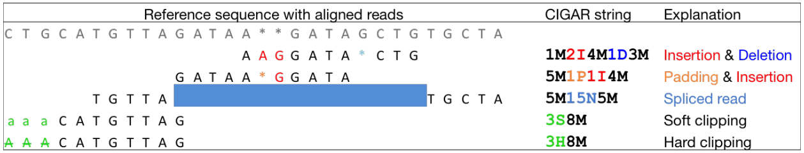|
|<small>From [tutorial](http://chagall.med.cornell.edu/RNASEQcourse/Intro2RNAseq.pdf) by Friederike D&uuml;ndar, Luce Skrabanek, and Paul Zumbo.</small>|

### Optional fields

Following the eleven mandatory SAM file fields, the optional fields are presented as key-value
pairs in the format of `<TAG>:<TYPE>:<VALUE>`, where `TYPE` is one of:

- `A` - Character
- `i` - Integer
- `f` - Float number
- `Z` - String
- `H` - Hex string

The information stored in these optional fields will vary widely depending on the mapper and new tags can be added freely. In addition, reads within the same SAM file may have different numbers of optional fields, depending on the program that generated the SAM file. Commonly used optional tags include:

- `AS:i` - Alignment score
- `BC:Z` - Barcode sequence
- `HI:i` - Match is i-th hit to the read
- `NH:i` - Number of reported alignments for the query sequence
- `NM:i` - Edit distance of the query to the reference
- `MD:Z` - String that contains the exact positions of mismatches (should complement the CIGAR string)
- `RG:Z` - Read group (should match the entry after ID if @RG is present in the header.

Thus, for example, we can use the NM:i:0 tag to select only those reads which map perfectly to the reference(i.e., have no mismatches). While the optional fields listed above are fairly standardized, tags that begin with `X`, `Y`, and `Z` are reserved for particularly free usage and will never be part of the official SAM file format specifications. `XS`, for example, is used by TopHat (an RNA-seq analysis tool we will discuss later) to encode the strand information (e.g., `XS:A:+`) while Bowtie2 and BWA use `XS:i:` for reads with multiple alignments to store the alignment score for the next-best-scoring alignment (e.g., `XS:i:30`).

## Read Groups

One of the key features of SAM/BAM format is the ability to label individual reads with readgroup tags. This allows pooling results of multiple experiments into a single BAM dataset. This significantly simplifies downstream logistics: instead of dealing with multiple datasets one can handle just one. Many downstream analysis tools such as variant callers are designed to recognize readgroup data and output results on per-readgroup basis.

One of the best descriptions of BAM readgroups is on [GATK support site](https://gatkforums.broadinstitute.org/discussion/1317/collected-faqs-about-bam-files). We have gratefully stolen two tables describing the most important readgroup tags - `ID`, `SM`, `LB`, and `PL` - from GATK forum and provide them here:

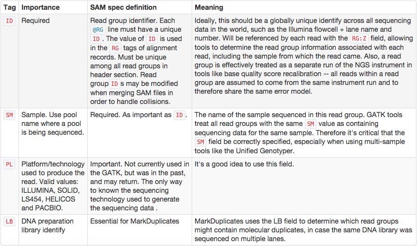

GATK forum also provides the following example:

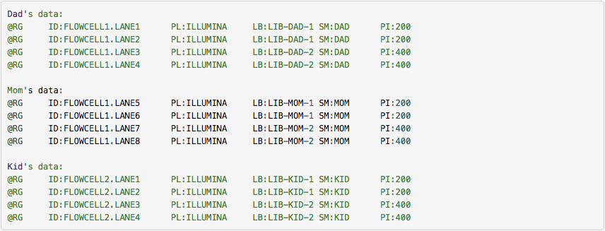

To see an example of read group manipulation in Galaxy see the following video:

<div class="embed-responsive embed-responsive-16by9"><iframe src="https://player.vimeo.com/video/123102338#t=1:40?portrait=0" webkitallowfullscreen mozallowfullscreen allowfullscreen></iframe></div>

# Manipulating SAM/BAM datasets

We support four major toolsets for processing of SAM/BAM datasets:

 * [DeepTools](https://deeptools.readthedocs.io) - a suite of user-friendly tools for the visualization, quality control and normalization of data from deep-sequencing DNA sequencing experiments.
 * [SAMtools](http://www.htslib.org/) - various utilities for manipulating alignments in the SAM/BAM format, including sorting, merging, indexing and generating alignments in a per-position format.
 * [BAMtools](https://github.com/pezmaster31/bamtools/wiki/Tutorial_Toolkit_BamTools-1.0.pdf) - a toolkit for reading, writing, and manipulating BAM (genome alignment) files.
 * [Picard](https://broadinstitute.github.io/picard/) - a set of Java tools for manipulating high-throughput sequencing data (HTS) data and formats.

 The following video highlights de-duplication, filtering, and cleaning of a BAM dataset using BAMtools and Picard tools:

 <div class="embed-responsive embed-responsive-16by9"><iframe src="https://player.vimeo.com/video/123113197?portrait=0" webkitallowfullscreen mozallowfullscreen allowfullscreen></iframe></div>

### Try it yourself

Perform a similar analyses with your own data.

# The challenge of read duplicates

## PCR duplicates

Preparation of sequencing libraries (at least at the time of writing) for technologies such as Illumina (used in this examples) involves PCR amplification. It is required to generate sufficient number of sequencing templates so that a reliable detection can be performed by base callers. Yet PCR has it's biases, which are especially profound in cases of multitemplate PCR used for construction of sequencing libraries (Kanagawa et al. [2003](https://www.ncbi.nlm.nih.gov/entrez/query.fcgi?cmd=Retrieve&db=PubMed&dopt=Abstract&list_uids=16233530)).

|                                              |
|----------------------------------------------|
| 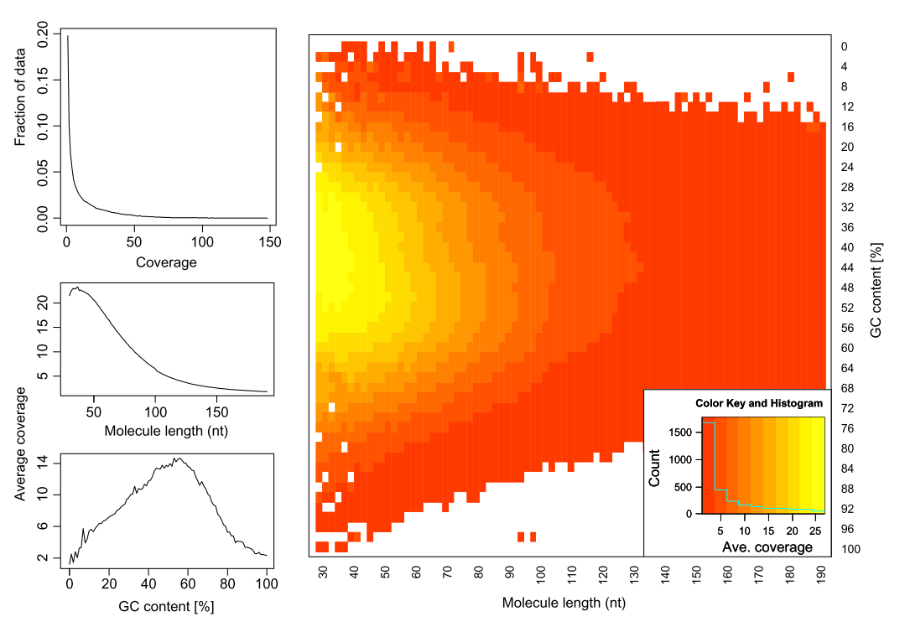 |
|<small>Analyzing molecules aligning with the same outer coordinates, a mapping quality of at least 30 and a length of at least 30nt, resulted in an average coverage of 12.9 per PCR duplicate and an empirical coverage distribution similar to an exponential/power law distribution (left upper panel). This indicates that many molecules are only observed for deeper sequencing while other molecules are available at higher frequencies. Analyzing length (left middle panel) and GC content (left lower panel) patterns as well as the combination (right panel) shows higher PCR duplicate counts for a GC content between 30% to 70% as well as for shorter molecules compared to longer molecules. This effect may be due to an amplification bias from the polymerase or the cluster generation process necessary for Illumina sequencing. From Ph.D. dissertation of [Martin Kircher](https://www.qucosa.de/fileadmin/data/qucosa/documents/7110/pflichtexemplar_final.pdf)).</small>|

Duplicates can be identified based on their outer alignment coordinates or using sequence-based clustering. One of the common ways for identification of duplicate reads is the `MarkDuplicates` utility from [Picard](https://broadinstitute.github.io/picard/command-line-overview.html) package. It is designed to identify both PCR and optical duplicates:

<div class="well well-lg">

Duplicates are identified as read pairs having identical 5' positions (coordinate and strand) for both reads in a mate pair (and optionally, matching unique molecular identifier reads; see BARCODE_TAG option). Optical, or more broadly Sequencing, duplicates are duplicates that appear clustered together spatially during sequencing and can arise from optical/imagine-processing artifacts or from bio-chemical processes during clonal amplification and sequencing; they are identified using the READ_NAME_REGEX and the OPTICAL_DUPLICATE_PIXEL_DISTANCE options. The tool's main output is a new SAM or BAM file in which duplicates have been identified in the SAM flags field, or optionally removed (see REMOVE_DUPLICATE and REMOVE_SEQUENCING_DUPLICATES), and optionally marked with a duplicate type in the 'DT' optional attribute. In addition, it also outputs a metrics file containing the numbers of READ_PAIRS_EXAMINED, UNMAPPED_READS, UNPAIRED_READS, UNPAIRED_READ DUPLICATES, READ_PAIR_DUPLICATES, and READ_PAIR_OPTICAL_DUPLICATES. Usage example: java -jar picard.jar MarkDuplicates I=input.bam \ O=marked_duplicates.bam M=marked_dup_metrics.txt.`

</div>

## Sampling coincidence duplicates

However, one has to be careful when removing duplicates in cases when the sequencing targets are small (e.g., sequencing of bacterial, viral, or organellar genomes as well as amplicons). This is because when sequencing target is small reads will have the same coordinates by chance and not because of PCR amplification issues. The figure below illustrates the fine balance between estimates allele frequency, coverage, and variation in insert size:

|                                              |
|----------------------------------------------|
| 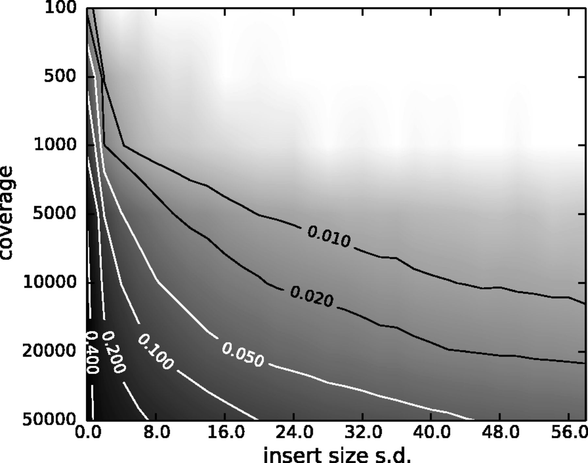 |
| <small>The Variant Allele Frequency (VAF) bias determined by coverage and insert size variance. Reads are paired-end and read length is 76. The insert size distribution is modeled as a Gaussian distribution with mean at 200 and standard deviation shown on the x-axis. The true VAF is 0.05. The darkness at each position indicates the magnitude of the bias in the VAF. (From Zhou et al. [2013](https://bioinformatics.oxfordjournals.org/content/30/8/1073)).</small> |
