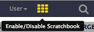

# イントロダクション
{:.no_toc}

先日、Cell Stem Cellに2012年にLi氏らが投稿した論文で、マウスにある興味深いタンパク質の標的遺伝子を解析することに成功したという内容を読みました[(Li et al., Cell Stem Cell 2012)](https://www.ncbi.nlm.nih.gov/pubmed/22862943)。この標的遺伝子の解析にはChIP-seqが用いられていて、結果のデータは [GEO](https://www.ncbi.nlm.nih.gov/geo/query/acc.cgi?acc=GSE37268)にて手に入れることができるのですが、この入手できるデータは論文の補足でも、GEOに提出された形にもなっておらず、シグナルが顕著な部分を表した（いわゆるピークの）データでした。

1 | 3660676 | 3661050 | 375 | 210 | 62.0876250438913 | -2.00329386666667
1 | 3661326 | 3661500 | 175 | 102 | 28.2950833625942 | -0.695557142857143
1 | 3661976 | 3662325 | 350 | 275 | 48.3062708406486 | -1.29391285714286
1 | 3984926 | 3985075 | 150 | 93 | 34.1879823073944 | -0.816992
1 | 4424801 | 4424900 | 100 | 70 | 26.8023246007435 | -0.66282

**表1** 入手できるデータのサブサンプル

というわけで、今回は**このゲノム領域のリストを、標的遺伝子が何か分かるような形に変える**ことを目標としてやっていきたいと思います。

> ### テーマ
>
> 今回のチュートリアルでは以下のものを扱います。
>
> 1. TOC
> {:toc}
>
{: .agenda}

# はじめに

まずはGalaxyを開いて、ログインしましょう（まだの方は登録しましょう）。

Galaxyのインタフェースは以下のような3つの部分によって主に構成されていて、左側が使用出来るツールを並べたリストで、右側が解析した結果がヒストリーとして記録される場所、そして中央がツールやデータセットを操作する場所となっています。

それでは、新しいヒストリーを使ってチュートリアルを始めましょう。

> ###  ハンズオン:ヒストリーを作成する
>
> 1. 何も解析していない空のヒストリーがあることを確認する
>
>    > ###  Starting a new history
>    >
>    > * Click the **Gear** icon at the top of the history panel
>    > * Select the option **Create New** from the menu
>    {: .tip}
>
> 2. ヒストリーの名前を分かりやすいものに変える
>
>    > ###  Rename a history
>    >
>    > * Click on the title of the history (by default the title is *Unnamed history*)
>    >
>    >   
>    >
>    > * Type **Galaxy Introduction** as the name
>    >
>    {: .tip}
>
{: .hands_on}

## データをアップロードする

> ###  ハンズオン:データをアップロードする
>
> 1.  [GEO](https://www.ncbi.nlm.nih.gov/geo/query/acc.cgi?acc=GSE37268)からピーク領域のリスト(ファイルはこちら [`GSE37268_mof3.out.hpeak.txt.gz`](https://www.ncbi.nlm.nih.gov/geo/download/?acc=GSE37268&format=file&file=GSE37268%5Fmof3%2Eout%2Ehpeak%2Etxt%2Egz))をPCにダウンロードする 
> 2. インタフェースの左上にあるアップロードボタンをクリックする
>
>    
>
>
> 3. **Choose local file** を選択し、ダウンロードしたファイルを探す
>
> 4. **Type** を `interval`にする
>
> 5. **Start** を押し、アップロードが完了するのを待つ    
>    
>     Galaxy が自動でファイルを展開する。
>
>     > ###  Comment
>     > After this you will see your first history item in Galaxy’s right pane. It will go through
>     > the gray (preparing/queued) and yellow (running) states to become green (success):
>     >
>     > 
>     {: .comment}
>
>    > ###  Tip: Importing data via links
>    >
>    > * Copy the link location
>    > * Open the Galaxy Upload Manager
>    > * Select **Paste/Fetch Data**
>    > * Paste the link into the text field
>    > * As **Type** select `interval`
>    > * Press **Start**
>    {: .tip}
>
>    > ###  Tip: Changing the file type once the data file is in your history
>    >
>    > * Click on the pencil button displayed in your dataset in the history
>    > * Choose **Datatype** on the top
>    > * Select `interval` in this case
>    > * Press **Save**
>    {: .tip}
>
>    デフォルトでは、Galaxyはリンクを名前にします。また、データセットをデータベースや参照ゲノムにリンクしません。
>
>    > ###  Comments
>    > - Check that the database of your uploaded dataset is mm9. If not, click on the pencil icon and modify the Database/Build: field to Mouse July 2007 (NCBI37/mm9) (mm9).
>    > - Rename the datasets according to the samples
>    {: .comment}
>
{: .hands_on}

ピーク領域に関連する遺伝子を見つけるためには、
UCSCから手に入る、マウスの遺伝子のリストが他に必要となります。

> ###  ハンズオン: UCSCからデータをアップロードする
>
> 1. ツールのメニューから、 `Get Data -> UCSC Main - table browser` へと移動する。
>
>     
>
>     You will be taken to the **UCSC table browser**, which looks something like this:
>
>     
>
> 2. 以下のようにオプションを設定する:
>     - **clade** to `Mammal`
>     - **genome** to `Mouse`
>     - **assembly** to `July 2007 (NCBI37/mm9)`
>     - **group** to `Genes and Gene Predictions`
>     - **track** to `RefSeq Genes`
>     - **table** to `refGene`
>     - **region** to `genome`
>     - **output format** to `BED - browser extensible data`
>     - **Send output to** to `Galaxy` checked
>
> 3. **get output** ボタンをクリックする
>
>    ボタンをクリックすると以下のようなスクリーンが表示される:
>
>    
>
> 4. **Create one BED record per** の欄を見て、 `Whole Gene` がチェックされているかを確認した後、 **Send Query to Galaxy** ボタンをクリックする
>
> 5. Rename our dataset to something more recognizable
>    - Click on the **pencil icon** to edit a file's attributes.
>      
>    - In the next screen change the name of the dataset to `Genes`.
>    - Click the **Save** button at the bottom of the screen.
>
{: .hands_on}

> ###  BEDファイル形式について
> **BED - Browser Extensible Data** 形式は遺伝子をコード化する領域を上手く表示する形式です。BEDラインには以下の3つの位置情報が必要です。:
> - 染色体のID
> - 染色体や足場での塩基の開始地点 (最初の塩基を0とする)
> - 終了地点 (最後の塩基を除く)
>
> この3つの必須な位置情報に加えて最大9つのオプションの位置情報がありますが、1行あたりの位置情報の数は1つのデータセット全体を通して統一しなければなりません。
>
> オプションの位置情報の内容も含めたBEDのより詳しい情報は[UCSC](https://genome.ucsc.edu/FAQ/FAQformat#format1) で得ることができます。
{: .comment}

これで、解析を開始するために必要なすべてのデータを揃えることができました。

# Part 1: 基本的なやり方

## ファイルの準備

それでは、実際にどのような内容のデータを持っているか見るためにファイルを見てみましょう。

> ###  ハンズオン: ファイルの内容を表示する
>
> 1. ピーク領域のファイルを表示するには、 **目のアイコン**をクリックする。クリックすると以下の図が現れる。:
>
>    
>
> 2. UCSCから得た遺伝子領域のデータの内容が表示される。
>
>    
>
{: .hands_on}

> ###  問題
>
> UCSCのファイルには列のラベルが付いていますが、ピークのファイルにはラベルが付いてありません。どうすればラベルなしの状態でそれぞれの列が何の列か推測できるでしょうか。
>
{: .question}

このピークのファイルは一般的な形式ではなく、このファイルを見るだけではそれぞれの列が何を表しているか判断できません。今回挙げた論文の著者は [HPeak](https://www.ncbi.nlm.nih.gov/pubmed/20598134) と呼ばれるピークを用いていると述べています。

HPeakのマニュアルを見ると、列に以下のような情報が含まれていることがわかります。:

 - 番号で表されている染色体の名前
 - 開始座標
 - 終了座標
 - 染色体の長さ
 - 最も高い仮説的なDNAフラグメント（頂上）の範囲を含むピーク内の位置。

2つのファイルを比べるには、染色体の名前が同じ形式で表されていることを確認する必要があります。
見てわかるように、ピークのファイルでは染色体番号の前に `chr` が欠けています。しかし、20番染色体と21番染色体ではどのように判断すればよいでしょうか。またはX染色体とY染色体では？確認してみましょう。:

> ###  ハンズオン: ファイルの末尾を表示する
>
> 1. **末尾を選択する** : 以下の設定を行った上で **Select last lines from a dataset (tail)** を走らせる:
>     - **Text file** to our peak file `GSE37268_mof3.out.hpeak.txt`
>     - **Operation**: `Keep last lines`
>     - **Number of lines**: Choose a value, e.g. `100`
> 2. **Execute** をクリックする
> 3. 作業が終了するまで待機する
> 4. **目のアイコン** をクリックしてファイルを見る
>
>    > ###  問題
>    >
>    > 1. Are the chromosomes 20 and 21 named X and Y?
>    >
>    >    

>    >    
Click to view answers

>    >    <ol type="1">
>    >    <li>Not at all. One more thing to fix.</li>
>    >    </ol>
>    >    

>    {: .question}
{: .hands_on}

したがって、染色体の名前を変換するには以下の2つの工程を踏む必要があります。:

 - `chr` を加える
 - 20 と 21 を X と Y に変える

> ###  ハンズオン: 染色体の名前を調整する
>
> 1. **テキストを置き換える** : 以下の設定を行った上で **Replace Text in a specific column** を走らせる:
>     - **File to process** to our peak file `GSE37268_mof3.out.hpeak.txt`
>     - **in column**: `Column:1`
>     - **Find pattern**: `[0-9]+` (this will look for numerical digits)
>     - **Replace with**: `chr&` (`&` is a placeholder for the find result)
> 3. **テキストを置き換える** : 上で使ったツールをもう一度走らせてみよう
>    - **File to process** to the output from the last run, e.g. something like `Replace Text on data ...`
>    - **in column**: `Column:1`
>    - **Find pattern**: `chr20`
>    - **Replace with**: `chrX`
>
>    > ###  Tip: Rerunning a tool
>    >
>    > * Press the **rerun icon** in the history
>    {: .tip}
>
> 4. **Replace Text** : Rerun this tool accordingly for chromosome Y
> 5. Inspect the latest file through the **eye icon**
>
>    Have we been successful?
>
{: .hands_on}

現段階でGalaxyに沢山のファイルがあるため、それぞれのファイルが区別できなくならないように注意しなければなりません。なので、最新の結果のファイルを例えば `Peak regions` などといった分かりやすい名前に変えておきましょう。

## 解析

今回の目標は、2つの遺伝子領域のファイル(遺伝子のファイルと出版物のファイル)を比較して、どのピークがどの遺伝子に関連しているかを知ることです。
もしあなたが、遺伝子**内**にどのようなピークがあるのかを知りたいだけであれば、このステップをスキップすることができます。
もしそうでなければ、ChIP-seqの実験で転写因子を入れる必要があるなどの理由があるため、このステップを通してプロモーター領域を比較に加えた方が良いでしょう。

> ###  ハンズオン: 遺伝子レコードにプロモーター領域を加える
>
> 1. **Get Flanks** : 以下の設定を行った上で**Get flanks returns flanking region/s for every gene** を走らせる:
>     - **Select data** to the file from UCSC
>     - **Region** to `Around Start`
>     - **Location of the flanking region/s** to `Upstream`
>     - **Offset** to `10000`
>     - **Length of the flanking region(s)** to `12000`
>
>     This tool returns flanking regions for every gene
>
> 2. BEDファイルの結果の行とインプットを比べて、開始地点と終了地点の変更方法を見つける
>
>    > ###  Tip: Inspecting several files using the scratchbook
>    >
>    > * Click **Enable/Disable Scratchbook** on the top panel
>    >
>    >    
>    >
>    > * Click on the **eye** icon of the files to inspect
>    > * Click on **Show/Hide Scratchbook**
>    >
>    >    
>    {: .tip}
>
> 3. データセットの名前を変更して結果を反映させる
{: .hands_on}

そろそろUCSCのファイルが `BED` 形式であり、それに関連したデータベースを持っていることに気付いたかもしれません。このファイルこそがピークファイルのために必要になっているのです。

> ###  ハンズオン: 形式とデータベースを変更する
>
> 1. ピーク領域のファイルにある **鉛筆アイコン** をクリックする:
>      
> 2. Switch to the `Convert Format` tab
> 3. Select `Convert Genomic Intervals To BED` and press **Convert**
> 4. Edit the "Database/Build" to select "mm9", the database build for mice used in the paper
{: .hands_on}

これで重複している部分を探す段階に来ました (ついに!)。そのためには、ピークと重複している遺伝子や交差している遺伝子を抽出する必要があります。

> ###  ハンズオン: 重複部分を探す
>
> 1. **Intersect** : 以下の設定を行った上で **Intersect the intervals of two datasets** を走らせる:
>     - **Return** to `Overlapping Intervals`
>     - **of**: the UCSC file with promoter regions
>     - **that intersect**: our converted peak region file
>     - **for at least**: `1`
>
>    > ###  Comments
>    > 入力する順番はとても大事です！今回の目標としては遺伝子のリストで終わりたいので、対応するデータセットを最初に入力する必要があります。
>    {: .comment}
{: .hands_on}

今私たちは、ピーク領域に重複している遺伝子のリスト（4列目）を持っています。
得られた遺伝子のより良い概観を得るために、異なる複数の染色体上での遺伝子の分布を見たいので、
染色体ごとに表を作り直して、各染色体上でピークをもつ遺伝子の数を数えてみましょう。

> ###  ハンズオン: 異なる染色体上の遺伝子の数を数える。
>
> 1. **Group** : Run **Group data by a column and perform aggregate operation on other columns** with the following settings:
>     - **Select data** to the result of the intersection
>     - **Group by column**:`Column 1`
>     - Press **Insert Operation** and choose:
>     - **Type**: `Count`
>     - **On column**: `Column 1`
>     - **Round result to nearest integer?**: `No`
>
>    > ###  問題
>    >
>    > Which chromosome contained the highest number of target genes?
>    >
>    >    

>    >    
Click to view answers

>    >    <ol type="1">
>    >    <li>The result varies with different settings. If you followed step by step, it should be chromosome 7 with 1675 genes.</li>
>    >    </ol>
>    >    

>    {: .question}
>
{: .hands_on}

## 可視化

これまでの操作から、良いデータがいくつか得られたので、これらのデータから棒グラフを作成してみましょう!

> ###  ハンズオン: 棒グラフを作る
>
> 1. Select the **Visualize icon** at the latest history item and select `Charts`
> 2. Choose a title at **Provide a title**, e.g. `Gene counts per chromosome`
> 3. Switch to the **Select data** tab and play around with the settings
> 4. Press **Visualize** and the top right to inspect your result
> 5. Click on **Editor** and repeat with different settings
>
{: .hands_on}

## ワークフローの抽出

これまでのヒストリーを注意深く見てみると、最初から最後までで解析の全てのステップが含まれていることが分かります。これらのヒストリーから、全てのステップで適用される全てのパラメーター設定を保存したGalaxyにおける解析の、非常に完成された記録を構築することができます。それならばこれらのヒストリーを、何度も何度も繰り返し実行することができるワークフローに変換したくありませんか？

Galaxyでは `ワークフローを抽出` というオプションを利用することで、ワークフローを非常に簡単に作ることができます。これはつまり、ワークフローを作成するには、一度だけ手動で実行してからワークフローに変換するだけで作成に時間がかからず、そして次回同じ解析をする際に行う作業が少なくて済むようになります。これにより、行った解析を簡単に共有したり公開することもできるようになります。

> ###  ハンズオン: ワークフローの抽出
>
> 1. ヒストリーを **クリーンアップ** する
>
>    If you had any failed jobs (red), please remove those datasets from your history by clicking on the `x` button. This will make the creation of a workflow easier.
>
> 2. ヒストリーの **Options menu** (歯車アイコン)を開き、 `ワークフローを抽出` を選択する。
>
>    
>
>    The center panel will change and you will be able to choose which steps to include/exclude and how to name the newly created workflow.
>
> 3. ワークフローに加えるべきでない全てのステップの**チェックを外す** 
>
>    Since we did some steps which where specific to our custom peak file, we might want to exclude:
>    - **Select last**
>    - all **Replace Text** steps
>    - **Convert Genomic Intervals to strict BED**
>    - **Get flanks**
>
> 4. ワークフローの名前を例えば `From peaks to genes` といった分かりやすい名前に変更する
>
> 5. 上部付近にある **Create Workflow** ボタンをクリックする
>
>    You will get a message that the workflow was created. But where did it go?
>
> 6. Galaxyのトップメニューにある **ワークフロー** をクリックする
>
>    Here you have a list of all your workflows
>
> 7. 新しく生成されたワークフローを選んで **Edit** をクリックする
>
>    You should see something similar to this:
>
>    
>
>    > ###  ワークフローの編集について
>    > Galaxyのワークフローの編集画面でワークフローを調べることができます。この画面では各ステップでのパラメーター設定を見たり変更したり、ツールを加えたり除外したり、ツールのアウトプットを別のツールのインプットに接続することができて、これらはすべてグラフィカルな方法で簡単に行うことができます。また、この編集画面でワークフローを一から作成することもできます。
>    {: .comment}
>
>     ワークフローには今2つインプットがありますが、最初のツール（Intersect）への接続が切断されています。これは間のステップをいくつか外したために起こっています。
>
> 8. それぞれのインプットしたデータセットを **Intersect** ツールに接続するために、インプットしたデータセットのボックスの右側にある矢印（これはアウトプットを示している）を、 **Intersect** のボックスの左側にある矢印（これはインプットを示している）にドラッグする
> 9. インプットしたデータセットをそれぞれ `Reference regions` と `Peak regions` に改名する
> 10. 右上にある **歯車アイコン** をクリックした後、 **Auto Re-layout** を押し、表示されているワークフローのレイアウトを整える:
>    
> 11. 同様に右上の **歯車アイコン** をクリックし、 **Save** を押して変更を保存する
>
>    > ###  Tip: 中間のステップを非表示にする
>    > ワークフローが実行されると、ユーザーは基本的に最後に得られた結果のみに関心を持ち、中間にあるすべてのステップには関心がありません。デフォルトではワークフローのすべてのアウトプットが表示されますが、Galaxyではワークフローで表示したいアウトプットと隠したいアウトプットをはっきりと分けることができます。この動作はアウトプットのデータセットの横にある小さなアスタリスクによってコントロールされます。:
>    >
>    > 
>    >
>    > アウトプットのデータセットのどれかでアスタリスクをクリックすると、アスタリスクがついたファイル*のみ*が表示され、アスタリスクのないファイルはすべて非表示になります(*すべての*アウトプットのアスタリスクをクリックすると、*すべての*アウトプットをクリックしない場合と同じ効果となり、どちらの場合でもすべてのデータセットが表示されます)。
>    {: .tip}
>
{: .hands_on}

それではワークフローをもう一度使ってより応用的な方法で解析してみましょう。

# Part 2: 応用的なやり方

Part 1では1 bp単位で重複を見ていました（デフォルトの設定）。より意味のある結果を得るために、ピークの頂上の位置の情報を利用してピーク頂上と遺伝子との重複を調べようと思います。

## 準備

ヒストリーを新規作成し名前を付けます。やり方を忘れた場合は、このチュートリアルの冒頭を確認してください。
ヒストリーは空の状態ですが、ピークのファイルが再度必要です。二度目のアップロードをする前に、以前のヒストリーからコピーしてみましょう。:

> ###  ハンズオン: ヒストリーのファイルをコピーする
>
> 1. ヒストリー上部にある **View all histories icon** をクリックする
>
>       両方のヒストリーが並んで表示されていると思います
>
> 2. マウスのドラッグアンドドロップを利用して、編集したピークのファイル（置換のステップを終えた後のもの）コピーしますが、頂上の情報を含んだインターバル形式で新しいヒストリーにコピーします。
> 3. **Done** を押して解析画面に戻る
>
{: .hands_on}

## ピーク頂上のファイルを作成する

ピーク頂上の位置を含んだ元のピークファイルから新しいBEDファイルを生成する必要があります。ピークの頂上の始まりはピーク（第2列）の開始点で最も高い仮説的なDNAフラグメントカバレッジ（第5列）を有する位置です。終わりは `start + 1` をシンプルに定義します。

> ###  ハンズオン: ピークの頂上のファイルを作成する
>
> 1. **計算する** : 以下の設定を行った上で **Compute an expression on every row** を走らせる:
>   - **Add expression**: `c2+c5`
>   - **as a new column to**: ピークのファイル
>   - **Round result?**: `YES`
> 2. **Compute an expression on every row** : このツールを上の結果を用いて再度走らせる:
>   - **Add expression**: `c8+1`
>   - **as a new column to**: step 1の結果
>   - **Round result?**: `YES`
>
{: .hands_on}

そして、染色体に加えてピークの頂上の始まりと終わりを切り取ります。:

> ###  ハンズオン: 列を切り取る
> 1. **切り取る** : 以下の設定を行った上で **Cut columns from a table** を走らせる:
>   - **Cut columns**: `c1,c8,c9`
>   - **Delimited by Tab**: `Tab`
>   - **From**: 最新のファイル
>
>    **Cut** のアウトプットは `tabular` 形式になります。
>
> 2. **Intersect** のツールを想定して形式を `interval` に変えておきます。
{: .hands_on}

## 遺伝子名を取得する

UCSCからダウンロードしたRefSeq遺伝子には、RefSeq識別子のみが含まれていましたが、遺伝子名は含まれていませんでした。最終的に遺伝子名のリストを得るために、データライブラリから別のBEDファイルを利用しましょう。

> ###  コメント
> 自分自身で遺伝子名を所得するにはいくつかの方法があります。1つの方法としてはBiomartを通してマッピングを取り戻し、2つのファイルを結合する方法です ( **Join two Datasets side by side on a specified field** )。もう1つの方法は、UCSCから完全なRefSeqの表を取得し、手動でBED形式に変換する方法です。
{: .comment}

> ###  ハンズオン: データをアップロードする
>
> 1. [Zenodo](https://zenodo.org/record/1025586)もしくはデータライブラリ(in "Introduction - From peaks to genes")からファイルをインポートする
>    - `mm9.RefSeq_genes_from_UCSC.bed`
>
>    > ###  Tip: リンクからデータをインポートする
>    >
>    > * リンクをコピーする
>    > * Galaxy Upload Managerを開く
>    > * **Paste/Fetch Data** を選択する
>    > * リンクをペーストする
>    > * **Start** を押す
>    {: .tip}
>
>    > ###  Tip: データライブラリからデータをインポートする
>    >
>    > * "共有データ" (パネル上)から"データライブラリ"を選択する
>    > * "Training data" をクリックし "Introduction - From peaks to genes" をクリックする
>    > * インポートしたいファイルを選択する
>    > * "Import selected datasets into history" をクリックする
>    > * 新しいヒストリーにインポートする
>    {: .tip}
>
>    デフォルトでは、Galaxyはリンクを名前にするため、ファイル名がリンクになります。
>
> 2. 遺伝子名が含まれているか調べるためにファイルの内容を調べる
>
{: .hands_on}

## ワークフローを繰り返す

先ほど作成したワークフローを再実行してみましょう。

> ###  ハンズオン: ワークフローを走らせる
> 1. ワークフローのメニューを開く(上部にあるメニュー)
> 2. 上のセクションで作成したワークフローを見つけて **Run** を選択する
> 3. インポートされた遺伝子のBEDファイルと **Cut** ツールの結果をインプットとして選択する
> 4. **Run workflow** をクリックする
>
>    アウトプットはヒストリーに表示されますが、ワークフローが完了するまで時間がかかることがあります。
>
{: .hands_on}

ワークフローを再実行することでピークの頂上を解析し始めました。また**Group** ツールで、各染色体にある遺伝子の量の情報を含んだリストを再び作成しました。 
しかし、様々な特殊な遺伝子のピークの量を調べることは面白くないでしょうか？色々な設定でワークフローを再実行してみましょう!

> ###  ハンズオン: ワークフローを設定を変えて実行する
> 1. ワークフローのメニューを開く（上部にあるメニュー）
> 2. Find the workflow you made in the previous section, and select the option **Run**
> 2. Choose as inputs our imported gene BED file and the result of the **Cut** tool
> 3. Click on the title of the Group tool to expand the options.
> 4. Change the following settings by clicking at the **edit icon** on the left:
>   - **Group by column**: `7`
>   - **Operation -> On column**: `7`
> 5. Click **Run workflow**
{: .hands_on}

おめでとうございます!すべての特殊な遺伝子の名前とそれらの遺伝子にあるピークの数の情報が含まれたファイルを取得しました。

> ###  Questions
>
> The list of unique genes is not sorted. Try to sort it on your own!
>
>    

>    
Click to view answers

>    You can use the tool "Sort data in ascending or descending order" on column 2 and a numerical sort.
>    

{: .question}

# 成果を共有する

Galaxyの最も重要な機能の1つは解析の終わりにあります。When you have published striking findings, it is important that other researchers are able to reproduce your in-silico experiment. Galaxy enables users to easily share their workflows and histories with others.

To share a history, click on the gear symbol in the history pane and select `Share or Publish`. On this page you can do 3 things:

1. **Make accessible via Link**

    This generates a link that you can give out to others. Anybody with this link will be able to view your history.

2. **Publish History**

    This will not only create a link, but will also publish your history. This means your history will be listed under `Shared Data → Published Histories` in the top menu.

3. **Share with Individual Users**

    This will share the history only with specific users on the Galaxy instance.

> ###  Hands-on: Share history and workflow
>
> 1. Share one of your histories with your neighbour.
> 2. See if you can do the same with your workflow!
> 3. Find the history and/or workflow shared by your neighbour
>
>    Histories shared with specific users can be accessed by those users in their history menu (gear icon) under `Histories shared with me`.
>
{: .hands_on}

# Conclusion
{:.no_toc}

 You have just performed your first analysis in Galaxy. You also created a workflow from your analysis so you can easily repeat the exact same analysis on other datasets. Additionally you shared your results and methods with others.
