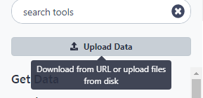

# イントロダクション
{:.no_toc}

先日、Cell Stem Cell に2012年に Li 氏らが投稿した論文 [(Li et al., Cell Stem Cell 2012)](https://www.ncbi.nlm.nih.gov/pubmed/22862943) で、マウスの興味深いタンパク質の標的遺伝子の解析に関する内容を読みました。この標的遺伝子の解析にはChIP-seqが用いられていて、結果のデータは [GEO](https://www.ncbi.nlm.nih.gov/geo/query/acc.cgi?acc=GSE37268)にて手に入れることができます。しかし、この遺伝子のリストは論文のサプリメントにも GEO に提出されたものの中にもありません。私たちが見つけられるものの中で最も近いのは、シグナルが顕著にエンリッチしている領域（いわゆるピーク）のリストでした。

1 | 3660676 | 3661050 | 375 | 210 | 62.0876250438913 | -2.00329386666667
1 | 3661326 | 3661500 | 175 | 102 | 28.2950833625942 | -0.695557142857143
1 | 3661976 | 3662325 | 350 | 275 | 48.3062708406486 | -1.29391285714286
1 | 3984926 | 3985075 | 150 | 93 | 34.1879823073944 | -0.816992
1 | 4424801 | 4424900 | 100 | 70 | 26.8023246007435 | -0.66282

**表1** 入手できるファイルのサブサンプル

このチュートリアルの目標は**このゲノム領域のリストを標的遺伝子のリストに変換する**ことです。

> ### アジェンダ
>
> 今回のチュートリアルでは以下のものを扱います。
>
> 1. TOC
> {:toc} 
>
{: .agenda}

# 前準備

まずは Galaxy を開いてログインまたは登録しましょう。

Galaxyのインタフェースは以下のような3つの部分によって主に構成されています。左側が使用できるツールを並べたリストで、解析のヒストリーが右側に記録され、そして中央の枠がツールやデータセットを表示します。

それでは、新しいヒストリーを使って始めましょう。

> ###  ハンズオン:ヒストリーを作成する
>
> 1. 空の解析ヒストリーがあることを確認する
>
>    > ###  ヒストリーを新規作成する
>    >
>    > * ヒストリーパネルの上部にある**歯車**アイコンをクリックする
>    > * メニューにある**新しく作成**を選択する
>    {: .tip}
>
> 2. ヒストリーの名前を分かりやすいものに変える
>
>    > ###  ヒストリーの名前を変更する
>    >
>    > * ヒストリーのタイトルをクリックする(デフォルトでは *Unnamed history* となっています)
>    >
>    >   
>    >
>    > * **Galaxy Introduction** という名前に変更します
>    >
>    {: .tip}
>
{: .hands_on}

## データをアップロードする

> ###  ハンズオン:データをアップロードする
>
> 1.  [GEO](https://www.ncbi.nlm.nih.gov/geo/query/acc.cgi?acc=GSE37268)からピーク領域のリスト(ファイルはこちら [`GSE37268_mof3.out.hpeak.txt.gz`](https://www.ncbi.nlm.nih.gov/geo/download/?acc=GSE37268&format=file&file=GSE37268%5Fmof3%2Eout%2Ehpeak%2Etxt%2Egz))をコンピュータにダウンロードする 
> 2. インタフェースの左上にあるアップロードボタンをクリックする
>
>    
>
>
> 3. **Choose local file** を押し、ダウンロードしたファイルを探す
>
> 4. **Type** で `interval` を選択する
>
> 5. **Start** を押し、アップロードが完了するのを待つ    
>    
>     Galaxy が自動でファイルを展開する。
>
>     > ###  コメント
>     > アップロードするとGalaxyの右枠に以下のようにヒストリーの項目が表示されます。このヒストリーは、
>     > 灰色(準備中)→黄色(実行中)→緑色(完了)と色が変わります。:
>     >
>     > 
>     {: .comment}
>
>    > ###  Tip: リンクからデータをインポートする
>    >
>    > * リンク部分をコピーする
>    > * Galaxy Upload Manager を開く
>    > * **Paste/Fetch Data** を選択する
>    > * テキスト部分にリンクをペーストする
>    > * **Type** で `interval` を選択する
>    > * **Start** を押す
>    {: .tip}
>
>    > ###  Tip: ヒストリーにあるデータファイルのタイプを変更する
>    >
>    > * ヒストリーのデータセットにある鉛筆ボタンをクリックする
>    > * トップにある**Datatype** を選択する
>    > * 今回では`interval` を選択する
>    > * **Change datatype** を押す
>    {: .tip}
>
>    デフォルトでは、Galaxyはリンクを名前にします。また、データセットをデータベースや参照ゲノムにリンクしません。
>
>    > ###  コメント
>    > - アップロードしたデータセットのデータベースが mm9 であることを確認してください。そうでなければ、鉛筆アイコンをクリックして Database/BuildCheck の欄で Mouse July 2007 (NCBI37/mm9)(mm9) に変更してください。
>    > - サンプルによってデータセットの名前を変更しましょう。
>    {: .comment}
>
{: .hands_on}

ピーク領域に関連する遺伝子を見つけるためには、
UCSCから手に入る、マウスの遺伝子のリストも必要となります。

> ###  ハンズオン: UCSCからデータをアップロードする
>
> 1. ツールのメニューから、 `Get Data -> UCSC Main - table browser` へと移動する。
>
>     
>
>     **UCSC table browser** に進むと、以下のような画面が表示される:
>
>     
>
> 2. 以下のようにオプションを設定する:
>     - **clade** → `Mammal`
>     - **genome** → `Mouse`
>     - **assembly** → `July 2007 (NCBI37/mm9)`
>     - **group** → `Genes and Gene Predictions`
>     - **track** → `RefSeq Genes`
>     - **table** → `refGene`
>     - **region** → `genome`
>     - **output format** → `BED - browser extensible data`
>     - **Send output to** → `Galaxy` にチェックを入れる
>
> 3. **get output** ボタンをクリックする
>
>    ボタンをクリックすると以下のようなスクリーンが表示される:
>
>    
>
> 4. **Create one BED record per** の欄で `Whole Gene` がチェックされているかを確認した後、 **Send Query to Galaxy** ボタンをクリックする。
>
> 5. データセットの名前をより分かりやすいものに変更する
>    - ファイルの属性を編集するには**鉛筆アイコン**をクリックする
>      
>    - 次のスクリーンでデータセットの名前を `Genes` に変える
>    - 画面下にある **Save** ボタンをクリックする
>
{: .hands_on}

> ###  BEDファイル形式について
> **BED - Browser Extensible Data** 形式は遺伝子領域をコード化する柔軟な方法を提供します。BEDラインには以下の3つの位置情報が必要です:
> - 染色体のID
> - 開始地点 (最初の塩基を0とする)
> - 終了地点 (最後の塩基を除く)
>
> これらの位置情報に加えて最大9つのオプションの位置情報がありますが、1行あたりの位置情報の数は1つのデータセット全体を通して統一しなければなりません。
>
> オプションの位置情報の内容も含めたより詳しい情報は[UCSC](https://genome.ucsc.edu/FAQ/FAQformat#format1) で得ることができます。
{: .comment}

これで、解析を開始するために必要なすべてのデータを揃えることができました。

# Part 1: 基本的なアプローチ

## ファイルの前準備

それでは、実際にどのような内容のデータを持っているかファイルを見てみましょう。

> ###  ハンズオン: ファイルの内容を表示する
>
> 1. ピーク領域のファイル内容を表示するには、**目のアイコン**をクリックする。クリックすると以下の表が表示される:
>
>    
>
> 2. UCSCから得た遺伝子領域のデータの内容が表示される。
>
>    
>
{: .hands_on}

> ###  問題
>
> UCSCのファイルには列のラベルが付いていますが、ピークのファイルにはラベルが付いてありません。どうすればラベルなしの状態でそれぞれの列が何を表しているか推測できるでしょうか。
>
{: .question}

このピークファイルは一般的な形式ではなく単にこのファイルを見るだけでは、それぞれの列が何を表しているか判断できません。今回挙げた論文の著者は [HPeak](https://www.ncbi.nlm.nih.gov/pubmed/20598134) と呼ばれるピークを用いていると述べています。

HPeakのマニュアルを見ると、列に以下のような情報が含まれていることがわかります。:

 - 番号で表されている染色体の名前
 - 開始座標
 - 終了座標
 - 染色体の長さ
 - 最も高い仮説的なDNAフラグメント（頂上）の範囲を含むピーク内の位置。

2つのファイルを比べるには、染色体の名前が同じ形式で表されていることを確認する必要があります。
見てわかるように、ピークのファイルでは染色体番号の前に `chr` が欠けています。しかし、20番染色体と21番染色体ではどのように判断すればよいでしょうか。またはX染色体とY染色体では？確認してみましょう:

> ###  ハンズオン: ファイルの末尾を表示する
>
> 1. **末尾を選択する** : 以下の設定を行った上で **Select last lines from a dataset (tail)** を実行する:
>     - **Text file** でピークファイルである `GSE37268_mof3.out.hpeak.txt` を選択する
>     - **Operation** → `Keep last lines`
>     - **Number of lines** → 数値を選択しますが、例えば `100` とします
> 2. **Execute** をクリックする
> 3. 作業が終了するまで待機する
> 4. **目のアイコン** をクリックしてファイルを見る
>
>    > ###  問題
>    >
>    > 1. 20番染色体と21番染色体はXやYと命名されていますか?
>    >
>    >    

>    >    
クリックで答えを表示

>    >    <ol type="1">
>    >    <li>命名されていません。もう一つ修正することがあります。</li>
>    >    </ol>
>    >    

>    {: .question}
{: .hands_on}

したがって、染色体の名前を変換するには2つの工程を踏む必要があります:

 - `chr` を加える
 - 20 と 21 を X と Y に変える

> ###  ハンズオン: 染色体の名前を調整する
>
> 1. **テキストを置き換える** : 以下の設定を行った上で **Replace Text in a specific column** を実行する:
>     - **File to process** でピークファイルである `GSE37268_mof3.out.hpeak.txt` を選択する
>     - **in column** → `Column:1`
>     - **Find pattern** → `[0-9]+` (これで数字が検索される)
>     - **Replace with** → `chr&` (`&` は検索した結果のプレースホルダです)
> 3. **テキストを置き換える** : 上で使ったツールを再実行してみましょう
>    - **File to process** 最後に実行した操作によるアウトプットで、例えば `Replace Text on data ...` といった名前のファイル
>    - **in column** → `Column:1`
>    - **Find pattern** → `chr20`
>    - **Replace with** → `chrX`
>
>    > ###  Tip: ツールを再実行する
>    >
>    > * ヒストリーにある**もう一度このジョブを実行する**を押す
>    {: .tip}
>
> 4. **テキストを置き換える** : Y染色体についてこのツールを再実行する
> 5. **目のアイコン**で直近のファイルを確認する
>
>    出来ましたか?
>
{: .hands_on}

現段階でGalaxyに沢山のファイルがあるためそれぞれのファイルが区別できなくならないように注意しなければなりません。なので最新の結果を例えば `Peak regions` といった分かりやすい名前に変えておきましょう。

## 解析

今回の目標は2つの領域のファイル(遺伝子のファイルと公開されているピークファイル)を比較してどのピークがどの遺伝子に関連しているかを知ることです。
もしあなたが遺伝子**内**にどのようなピークがあるのかを知りたいだけであればこのステップをスキップすることができます。
もしそうでなければ、ChIP-seqの実験で転写因子を入れる必要があるなどの理由があるため、このステップを通してプロモーター領域を比較に加えた方が良いでしょう。

> ###  ハンズオン: 遺伝子レコードにプロモーター領域を加える
>
> 1. **Get Flanks** : 以下の設定を行った上で**Get flanks returns flanking region/s for every gene** を実行する:
>     - **Select data** でUCSCからのファイルを選択する
>     - **Region** → `Around Start`
>     - **Location of the flanking region/s** → `Upstream`
>     - **Offset** → `10000`
>     - **Length of the flanking region(s)** → `12000`
>
>     このツールは全ての遺伝子でのフランキング領域をリターンします
>
> 2. BEDファイルの結果の行とインプットを比べて開始地点と終了地点の変更方法を見つける
>
>    > ###  Tip: scratchbookを利用して複数のファイルを確認する
>    >
>    > * トップパネルにある **Enable/Disable Scratchbook** をクリックする
>    >
>    >    
>    >
>    > * ファイルを見るために**目のアイコン**をクリックする
>    > * **Show/Hide Scratchbook** をクリックする
>    >
>    >    
>    {: .tip}
>
> 3. データセットの名前を変更して結果を反映させる
{: .hands_on}

そろそろUCSCのファイルが `BED` 形式でありそれに関連したデータベースを持っていることに気付いたかもしれません。このファイルこそがピークファイルのために必要になっているのです。

> ###  ハンズオン: 形式とデータベースを変更する
>
> 1. ピーク領域のファイルにある **鉛筆アイコン** をクリックする:
>      
> 2. `Convert` タブに移動する
> 3. `Convert Genomic Intervals To BED`を選択し **Convert datatype** を押す
> 4. "Database/Build" で "mm9" を選択する, これは論文で使用されているマウスで構築されたデータベースです。
{: .hands_on}

これで重複している部分を探す段階に来ました (ついに!)。そのためには、ピークと重複している遺伝子や交差している遺伝子を抽出する必要があります。

> ###  ハンズオン: 重複部分を探す
>
> 1. **Intersect** : 以下の設定を行った上で **Intersect the intervals of two datasets** を実行する:
>     - **Return** → `Overlapping Intervals`
>     - **of** でプロモーター領域を含んだUCSCファイルを選択する
>     - **that intersect** で変換したピーク領域のファイルを選択する
>     - **for at least** → `1`
>
>    > ###  コメント
>    > 入力する順番はとても大事です！今回の目標としては遺伝子のリストで終わりたいので、対応するデータセットを最初に入力する必要があります。
>    {: .comment}
{: .hands_on}

今私たちは、ピーク領域に重複している遺伝子のリスト（4列目）を持っています。
得られた遺伝子のより良い概観を得るために、異なる複数の染色体上での遺伝子の分布を見たいので、
染色体ごとに表を作り直して、各染色体上でピークをもつ遺伝子の数を数えてみましょう。

> ###  ハンズオン: 異なる染色体上の遺伝子の数を数える。
>
> 1. **Group** : 以下の設定を行った上で **Group data by a column and perform aggregate operation on other columns** を実行する:
>     - **Select data** で intersection の結果を選択する
>     - **Group by column** → `Column 1`
>     - **Insert Operation** を押して選択する:
>     - **Type** → `Count`
>     - **On column** → `Column 1`
>     - **Round result to nearest integer?** → `No`
>
>    > ###  問題
>    >
>    > どの染色体に最も多くの標的遺伝子が含まれていましたか?
>    >
>    >    

>    >    
クリックで答えを表示

>    >    <ol type="1">
>    >    <li>結果は設定によって異なります。もし、あなたがこれまでのステップを順々に行っていた場合は、最も多くの標的遺伝子をもつのは1675の遺伝子を
 持つ7番染色体になるはずです。</li>
>    >    </ol>
>    >    

>    {: .question}
>
{: .hands_on}

## 可視化

これまでの操作から、良いデータがいくつか得られたので、これらのデータから棒グラフを作成してみましょう!

> ###  ハンズオン: 棒グラフを作る
>
> 1. 直近のヒストリーでの**可視化する**のアイコンを選択し、 `Charts` を選択する
> 2. **Provide a title**を選択し、例えば `Gene counts per chromosome` とします
> 3. **Select data** タブに移動し設定を色々変えて遊んでみる
> 4. **Visualize** を押して右上に出る結果を確認する
> 5. **Editor** をクリックし設定を変えてみながら繰り返し棒グラフを作成する
>
{: .hands_on}

## ワークフローの抽出

これまでのヒストリーを注意深く見てみると、最初から最後までで解析の全てのステップが含まれていることが分かります。これらのヒストリーから、全てのステップで適用される全てのパラメーター設定を保存したGalaxyにおける解析の、非常に完成された記録を構築することができます。それならばこれらのヒストリーを、何度も何度も繰り返し実行することができるワークフローに変換したくありませんか？

Galaxyでは `ワークフローを抽出` というオプションを利用することで、ワークフローを非常に簡単に作ることができます。これはつまり、ワークフローを作成するには、一度だけ手動で実行してからワークフローに変換するだけで作成に時間がかからず、そして次回同じ解析をする際に行う作業が少なくて済むようになります。これにより、行った解析を簡単に共有したり公開することもできるようになります。

> ###  ハンズオン: ワークフローの抽出
>
> 1. ヒストリーを **クリーンアップ** する
>
>    もし、操作が失敗している赤色のデータセットがありましたら、ヒストリーにある `x` ボタンをクリックしてそのデータセットを削除してください。このように整理することでワークフローの作製が容易になります。
>
> 2. ヒストリーの **Options menu** (歯車アイコン)を開き、 `ワークフローを抽出` を選択する。
>
>    
>
>    中央のパネルが変わり、ワークフローにどのステップを入れるかの選択や、新しく作るワークフローの名前を決める画面が現れます。
>
> 3. ワークフローに加えるべきでない全てのステップの**チェックを外す** 
>
>    これまでのステップでピークファイルをいくつか改変したので、そのような改変をした以下のステップは除外しましょう。:
>    - **Select last**
>    - 全ての **Replace Text** のステップ
>    - **Convert Genomic Intervals to strict BED**
>    - **Get flanks**
>
> 4. ワークフローの名前を例えば `From peaks to genes` といった分かりやすい名前に変更する
>
> 5. 上部付近にある **Create Workflow** ボタンをクリックする
>
>    ワークフローが作成されましたというメッセージが表示されたと思いますが、作成されたワークフローはどこでみられるのでしょうか。
>
> 6. Galaxyのトップメニューにある **ワークフロー** をクリックする
>
>    ここにはあなたのワークフローが全てリストで表示されます。
>
> 7. 新しく生成されたワークフローを選んで **Edit** をクリックする
>
>    以下のようなものが確認できると思います。:
>
>    
>
>    > ###  ワークフローの編集について
>    > Galaxyのワークフローの編集画面でワークフローを調べることができます。この画面では各ステップでのパラメーター設定を見たり変更したり、ツールを加えたり除外したり、ツールのアウトプットを別のツールのインプットに接続することができて、これらはすべてグラフィカルな方法で簡単に行うことができます。また、この編集画面でワークフローを一から作成することもできます。
>    {: .comment}
>
>     ワークフローには今2つインプットがありますが、最初のツール（Intersect）への接続が切断されています。これは間のステップをいくつか外したために起こっています。
>
> 8. それぞれのインプットしたデータセットを **Intersect** ツールに接続するために、インプットしたデータセットのボックスの右側にある矢印（これはアウトプットを示している）を、 **Intersect** のボックスの左側にある矢印（これはインプットを示している）にドラッグする
> 9. インプットしたデータセットをそれぞれ `Reference regions` と `Peak regions` に改名する
> 10. 右上にある **歯車アイコン** をクリックした後、 **Auto Re-layout** を押し、表示されているワークフローのレイアウトを整える:
>    
> 11. 同様に右上の **歯車アイコン** をクリックし、 **Save** を押して変更を保存する
>
>    > ###  Tip: 中間のステップを非表示にする
>    > ワークフローが実行されると、ユーザーは基本的に最後に得られた結果のみに関心を持ち、中間にあるすべてのステップには関心がありません。デフォルトではワークフローのすべてのアウトプットが表示されますが、Galaxyではワークフローで表示したいアウトプットと隠したいアウトプットをはっきりと分けることができます。この動作はアウトプットのデータセットの横にある小さなアスタリスクによってコントロールされます:
>    >
>    > 
>    >
>    > アウトプットのデータセットのどれかでアスタリスクをクリックすると、アスタリスクがついたファイル*のみ*が表示され、アスタリスクのないファイルはすべて非表示になります(*すべての*アウトプットのアスタリスクをクリックすると、*すべての*アウトプットをクリックしない場合と同じ効果となり、どちらの場合でもすべてのデータセットが表示されます)。
>    {: .tip}
>
{: .hands_on}

それではワークフローをもう一度使ってより応用的な方法で解析してみましょう。

# Part 2: 応用的なアプローチ

Part 1では1 bpで重複を見ていました（デフォルトの設定）。より意味のある結果を得るために、ここではピーク頂上の位置情報を利用してピーク頂上と遺伝子との重複を調べてみようと思います。

## 前準備

ヒストリーを新規作成し名前を付けます。やり方を忘れた場合は、このチュートリアルの冒頭を確認してください。
ヒストリーは空の状態ですが、ピークのファイルが再度必要です。二度目のアップロードをする前に、以前のヒストリーからコピーしてみましょう:

> ###  ハンズオン: ヒストリーのファイルをコピーする
>
> 1. ヒストリー上部にある **View all histories icon** をクリックする
>
>       両方のヒストリーが並んで表示されていると思います
>
> 2. マウスのドラッグアンドドロップを利用して、編集したピークのファイル（置換のステップを終えた後のもの）をコピーしますが、頂上の情報を含んだインターバル形式で新しいヒストリーにコピーします。
> 3. 左上にある **Done** を押して解析画面に戻る
>
{: .hands_on}

## ピーク頂上のファイルを作成する

ピーク頂上の位置を含んだ元のピークファイルから新しいBEDファイルを生成する必要があります。ピークの頂上の始まりはピーク（第2列）の開始点で最も高い仮説的なDNAフラグメントカバレッジ（第5列）を有する位置です。終わりは `start + 1` をシンプルに定義します。

> ###  ハンズオン: ピーク頂上のファイルを作成する
>
> 1. **計算** : 以下の設定を行った上で **Compute an expression on every row** を実行する:
>   - **Add expression** → `c2+c5`
>   - **as a new column to** → ピークのファイル
>   - **Round result?** → `YES`
> 2. **Compute an expression on every row** : このツールを上の結果を用いて再実行する:
>   - **Add expression** → `c8+1`
>   - **as a new column to** → step 1の結果
>   - **Round result?** → `YES`
>
{: .hands_on}

そして、染色体に加えてピーク頂上の始まりと終わりを切り取ります。:

> ###  ハンズオン: 列を切り取る
> 1. **Cut** : 以下の設定を行った上で **Cut columns from a table** を実行する:
>   - **Cut columns** → `c1,c8,c9`
>   - **Delimited by Tab** → `Tab`
>   - **From** → 最新のヒストリーファイル
>
>    **Cut** のアウトプットは `tabular` 形式になります。
>
> 2. **Intersect** のツールを想定して形式を `interval` に変えておきます。
{: .hands_on}

## 遺伝子名を取得する

UCSCからダウンロードしたRefSeq遺伝子には、RefSeq識別子のみが含まれていましたが、遺伝子名は含まれていませんでした。最終的に遺伝子名のリストを得るために、データライブラリから別のBEDファイルを利用しましょう。

> ###  コメント
> 自分自身で遺伝子名を所得するにはいくつかの方法があります。1つの方法としてはBiomartを通してマッピングを取り戻し、2つのファイルを結合する方法です ( **Join two Datasets side by side on a specified field** )。もう1つの方法は、UCSCから完全なRefSeqの表を取得し、手動でBED形式に変換する方法です。
{: .comment}

> ###  ハンズオン: データをアップロードする
>
> 1. [Zenodo](https://zenodo.org/record/1025586)もしくはデータライブラリ(in "Introduction - From peaks to genes")からファイルをインポートする
>    - `mm9.RefSeq_genes_from_UCSC.bed`
>
>    > ###  Tip: リンクからデータをインポートする
>    >
>    > * リンクをコピーする
>    > * Galaxy Upload Managerを開く
>    > * **Paste/Fetch Data** を選択する
>    > * リンクをペーストする
>    > * **Start** を押す
>    {: .tip}
>
>    > ###  Tip: データライブラリからデータをインポートする
>    >
>    > * "共有データ" (パネル上)から"データライブラリ"を選択する
>    > * "Training data" をクリックし "Introduction - From peaks to genes" をクリックする
>    > * インポートしたいファイルを選択する
>    > * "Import selected datasets into history" をクリックする
>    > * 新しいヒストリーにインポートする
>    {: .tip}
>
>    デフォルトでは、Galaxyはリンクを名前にするため、ファイル名がリンクになります。
>
> 2. 遺伝子名が含まれているか調べるためにファイルの内容を調べる
>
{: .hands_on}

## ワークフローを繰り返す

先ほど作成したワークフローを再実行してみましょう。

> ###  ハンズオン: ワークフローを実行する
> 1. ワークフローのメニューを開く(上部にあるメニュー)
> 2. 上のセクションで作成したワークフローを見つけて **Run** を選択する
> 3. インポートされた遺伝子のBEDファイルと **Cut** ツールの結果をインプットとして選択する
> 4. **Run workflow** をクリックする
>
>    アウトプットはヒストリーに表示されますが、ワークフローが完了するまで時間がかかることがあります。
>
{: .hands_on}

ワークフローを再実行することでピークの頂上を解析し始めました。また**Group** ツールで、各染色体にある遺伝子の量の情報を含んだリストを再び作成しました。 
しかし、様々な特殊な遺伝子のピークの量を調べるのはもっと面白くないでしょうか？色々な設定でワークフローを再実行してみましょう!

> ###  ハンズオン: ワークフローを設定を変えて実行する
> 1. ワークフローのメニューを開く（上部にあるメニュー）
> 2. 前のセクションで作成したワークフローを探し、 **Run** を選択する
> 2. インプットとしてインポートした遺伝子のBEDファイルと **Cut** ツールの結果を選択する
> 3. the title of the Group tool to expand the optionsをクリックする
> 4. Change the following settings by clicking at the **edit icon** on the left:
>   - **Group by column** → `7`
>   - **Operation -> On column** → `7`
> 5. **Run workflow** をクリックする
{: .hands_on}

おめでとうございます!すべての特殊な遺伝子の名前とそれらの遺伝子にあるピークの数の情報が含まれたファイルを取得しました。

> ###  問題
>
> 特殊な遺伝子のリストはソートされていません。あなた自身でソートしてみましょう!
>
>    

>    
クリックで答えを表示

>    "Sort data in ascending or descending order" というツールを使用することができて、 column 2 と Numerical sort でソートすることができます。
>    

{: .question}

# 成果を共有する

Galaxyの最も重要な機能の1つは解析の終わりにあります。素晴らしい発見を発表した際には、他の実験者がコンピューターを用いて実験を再現できることが重要です。Galaxyではユーザーは、ワークフローやヒストリーを他のユーザーと簡単に共有することができます。

ヒストリーを共有するには、ヒストリーパネルにある歯車アイコンをクリックして`共有またはパブリッシュ`を選択します。ここでは3つの方法を紹介します。:

1. **Make accessible via Link**

    他の人に教えることができるリンクを生成します。このリンクを持つ人は誰しもあなたのヒストリーを見ることができます。

2. **Publish History**

    リンクのみを生成するのではなく、ヒストリーも公開します。つまり、トップメニューの`共有データ → ヒストリー`にあなたのヒストリーが表示されます。

3. **Share with Individual Users**

    Galaxy上の特定のユーザーにのみヒストリーが共有されます。

> ###  ハンズオン: ヒストリーやワークフローを共有する
>
> 1. あなたの周りの人にヒストリーを1つ共有します。
> 2. ワークフローで同じことができるかどうか確認しましょう!
> 3. あなたの周りの人が共有しているヒストリーやワークフローを見つける
>
>    特定のユーザーと共有しているヒストリーには、歯車アイコンにある`Histories shared with me`にいるユーザーだけがアクセスすることができます。
>
{: .hands_on}

# まとめ
{:.no_toc}

 あなたはGalaxyで最初の解析を行いました。また、解析からワークフローを作成して他のデータセットから同じ解析を繰り返し簡単に行うことができるようになりました。そして、解析結果や方法を他の人と共有することもできるようになりました。
