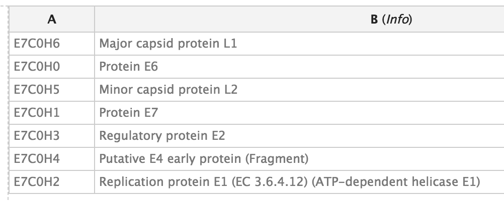

# Introduction
{:.no_toc}

Through a series of examples, this tutorial aims to familiarize the reader with building Galaxy collections from tabular data containing URLs, sample sheets, list of accessions or identifiers, etc..

> ###   Audience
> This tutorial assumes a basic knowledge of using dataset collections in Galaxy but doesn't assume any particular knowledge of biology or bioinformatics. If you have not used collections with Galaxy previously, please check out the [using dataset collections]({{ site.baseurl }}/topics/introduction/tutorials/galaxy-intro-collections/tutorial.html) tutorial.

> ### Agenda
>
> In this tutorial, we will:
>
> 1. TOC
> {:toc}
>
{: .agenda}

# Uploading Datasets with Rules


This approach could be used to manipulate lists of uploads coming from many different formats, but we will start with a tabular description of files for a study from the [European Nucleotide Archive](https://www.ebi.ac.uk/ena). We will be using the data from a study of [16s ribosomal RNA](https://www.ebi.ac.uk/ena/data/view/PRJDA60709).

> ###  Hands-on: Downloading Data from ENA
> To start, navigate to the above study and click the option to "Select columns". Here we will narrow the set of columns we consider to just a few relevant to uploading these files to Galaxy.
>
> Select only:
>
> - Study accession
> - Experiment accession
> - FASTQ files (FTP)
> - Sample accession
>
> The table should look like:
>
> Study accession | Sample accession | Experiment accession | FASTQ files (FTP)
> --------------- | ---------------- | -------------------- | -----------------
> PRJDA60709      | SAMD00016379     | DRX000475            | File 1
> PRJDA60709      | SAMD00016383     | DRX000476            | File 1
> PRJDA60709      | SAMD00016380     | DRX000477            | File 1
> PRJDA60709      | SAMD00016378     | DRX000478            | File 1
> PRJDA60709      | SAMD00016381     | DRX000479            | File 1
> PRJDA60709      | SAMD00016382     | DRX000480            | File 1
>
> Download the resulting tabular data describing the files by clicking the "TEXT" link at the top of the page. Alternatively, the resulting sample sheet can be downloaded directly [here](https://www.ebi.ac.uk/ena/data/warehouse/filereport?accession=PRJDA60709&result=read_run&fields=study_accession,sample_accession,experiment_accession,fastq_ftp&download=txt). The number and size of the files for this example are relatively small for sequencing data but larger files and larger numbers of files should work as well - Galaxy will just need more time to download and process the files.
{: .hands_on}

You can now open the resulting spreadsheet in your local spreadsheet program, a text editor, or in your web browser and select all the data and copy to your clipboard.

```
study_accession	sample_accession	experiment_accession	fastq_ftp
PRJDA60709	SAMD00016379	DRX000475	ftp.sra.ebi.ac.uk/vol1/fastq/DRR000/DRR000770/DRR000770.fastq.gz
PRJDA60709	SAMD00016383	DRX000476	ftp.sra.ebi.ac.uk/vol1/fastq/DRR000/DRR000771/DRR000771.fastq.gz
PRJDA60709	SAMD00016380	DRX000477	ftp.sra.ebi.ac.uk/vol1/fastq/DRR000/DRR000772/DRR000772.fastq.gz
PRJDA60709	SAMD00016378	DRX000478	ftp.sra.ebi.ac.uk/vol1/fastq/DRR000/DRR000773/DRR000773.fastq.gz
PRJDA60709	SAMD00016381	DRX000479	ftp.sra.ebi.ac.uk/vol1/fastq/DRR000/DRR000774/DRR000774.fastq.gz
PRJDA60709	SAMD00016382	DRX000480	ftp.sra.ebi.ac.uk/vol1/fastq/DRR000/DRR000775/DRR000775.fastq.gz
```
{:#example-1-metadata}

> ###  Hands-on: Accessing the Rule Based Uploader
> Next navigate to Galaxy, and click the upload icon toward the top left corner. By default the familiar simple upload dialog should appear. This dialog has more advanced options as different tabs across the top of this dialog though. Click "Rule-based" as shown below.
>
> 
>
> As you can see in this dialog, data can be selected from a history dataset or pasted in directly. If Galaxy is configured to allow FTP uploads, the contents of your FTP directory may be loaded directly as well. For this example, simply paste your tabular data right into the textbox on this page as shown below and then click the "Build" button.
>
> 
>
> This should bring you to the "rules" editor.
>
> 
{: .hands_on}

At first glance, this may be feel like Excel or another spreadsheet program and you may feel the urge to start editing cells but we strongly encourage defining rules for manipulating the data instead. There are a few reasons for this:

* Manually modifying this metadata is not reproducible - we will not belabor the point here but check out [Why not use excel for this?]({{ site.baseurl }}/topics/introduction/tutorials/galaxy-intro-strands/tutorial.html#why-not-use-excel-for-this) for more context. Building up rules for modifying this metadata will allow Galaxy to track and report your manipulations (providing tracibility) and apply them to new sets of files (providing reproducibility).
* Manually modifying this metadata is error prone - we believe defining rules and treating the metadata in a systematic way minimizes the possibility to manual errors. These errors can be very hard to detect for large sets of data.
* Manually modifying data is not scalable - this rule-based technique potentially scales to importing tens of thousands of datasets.

So rather than modifying the data, we will define rules for manipulating it and setting up "column definitions" that tell Galaxy how to use the metadata during upload or collection creation.

In order to get these files into Galaxy, we will want to do a few things.

* Strip that header out of the data (it doesn't contain a URL Galaxy can download).
* Define column "C" as the dataset name.
* Define column "D" as the dataset URL (this is the location Galaxy can download the data from).
* Tell Galaxy to treat these files as "fastqsanger.gz" files.

> ###  Hands-on: Using Tabular Inputs to the Rule Builder
>
> 1. We will start by stripping that header out of the table. We call rules that strip rows out the table "Filter" rules in this dialog. Click on the **Filter** popup menu button to bring up a list of filters to apply and select **First or Last N Rows**.
>   
>
> 2. Fill in **1** as the number of rows to filter out as shown above and click "Apply".
>
> 3. Next we will define these columns for Galaxy. Click on the **Rules** popup menu button and select **Add / Modify Column Definitions**.
>
> 4. Here we will add two column definitions. Click on the **Add Definition** button and select **Name**. Repeat this again and select **URL** instead. Then use the resulting dropdown selection box to define column "C" as "Name" and column "D" as "URL".
>   
>
> 5. Now click **Apply**, and you should see your new column definitions listed as in the following screenshot.
>   
>
> 6. Click the **Type** selection box at the bottom left of the upload dialog, and change the datatype from "Auto-detect" to **fastqsanger**.
>   
>
> 7. You are now ready to start the upload, click the **Upload** button and wait for the upload job to complete.
>    After some time, the result in this case will be six datasets in your history. The next example will show to use the rule builder to create a collection.
{: .hands_on}

# Creating a Simple Dataset List

This example will demonstrate using such history datasets as the source for collection uploads - this can be handy when you'd like to apply existing Galaxy tabular manipulation tools to the metadata before processing for instance.

> ###  Hands-on: Creating a Simple Dataset List
>
>    > ###  Tip: Create a new history
>    > Before we start uploading, it may be a good idea to create a new history for this example to keep things simple and match the following screenshots.
>    {: .tip}
>
> For our second example, we will use the same initial metadata.
>
>    > ###  Tip: Loading Metadata from a History Element
>    > In addition to directly pasting data into the Rule Based Uploader, you can also load the metadata from a dataset in your Galaxy History, or from a file in your FTP directory if the admin has enabled FTP upload
>    {: .tip}
>
> 1. Upload the metadata from the [first example](#example-1-metadata) to your Galaxy
> 2. Next open the "Rule-based" upload tab again, but this time:
>
>    - **Upload data as** Collection(s)
>    - **Load tabular data from** a History Dataset
>    - **Select dataset to load** selecting the dataset you have just uploaded
>    
> 3. Now click **Build** to bring up the rule builder.
>    
> 4. Repeat the steps from last time, except define column C as a "List Identifier" instead of Name.
>
>    - **Filter** menu, select First or Last N Rows
>        - Filter 1 Row
>    - **Rules** menu, select Add / Modify Column Definitions
>        - Add Definition, URL, Select Column D
>        - Add Definition, List Identifier(s), Column C
>    - **Type**, change "Auto-detect" to "fastqsanger"
>
>    Rather than assigning column "C" as "Name" in this example we will assign it as a "List Identifier". This is the description of the element in the resulting dataset collection. This identifier is preserved in mapped outputs as you map tools over collections and is useful for tracking sample names, replicate numbers, conditions, etc..
>    
> 5. Unlike the last example, this time we need to give the resulting collection a name before the "Upload" button becomes clickable. Enter the ENA study identifier as shown below, PRJDA60709.
>    
> 6. Finally, click "Upload" and wait for the collection to be created. This time a single new entry will appear in your history panel corresponding to all the files gathered together in a simple list named **PRJDA60709**.
{: .hands_on}


# Creating a List of Dataset Pairs

For this next example we will again use ENA data, this time corresponding to the study [PRJDB3920](https://www.ebi.ac.uk/ena/data/view/PRJDB3920) instead. Again you can build the spreadsheet from the ENA website link or copy it from below:

```
study_accession	sample_accession	experiment_accession	fastq_ftp
PRJDB3920	SAMD00034150	DRX036147	ftp.sra.ebi.ac.uk/vol1/fastq/DRR039/DRR039919/DRR039919_1.fastq.gz;ftp.sra.ebi.ac.uk/vol1/fastq/DRR039/DRR039919/DRR039919_2.fastq.gz
PRJDB3920	SAMD00034150	DRX036148	ftp.sra.ebi.ac.uk/vol1/fastq/DRR039/DRR039920/DRR039920_1.fastq.gz;ftp.sra.ebi.ac.uk/vol1/fastq/DRR039/DRR039920/DRR039920_2.fastq.gz
PRJDB3920	SAMD00034150	DRX036149	ftp.sra.ebi.ac.uk/vol1/fastq/DRR039/DRR039921/DRR039921_1.fastq.gz;ftp.sra.ebi.ac.uk/vol1/fastq/DRR039/DRR039921/DRR039921_2.fastq.gz
PRJDB3920	SAMD00034150	DRX036150	ftp.sra.ebi.ac.uk/vol1/fastq/DRR039/DRR039922/DRR039922_1.fastq.gz;ftp.sra.ebi.ac.uk/vol1/fastq/DRR039/DRR039922/DRR039922_2.fastq.gz
PRJDB3920	SAMD00034150	DRX036151	ftp.sra.ebi.ac.uk/vol1/fastq/DRR039/DRR039923/DRR039923_1.fastq.gz;ftp.sra.ebi.ac.uk/vol1/fastq/DRR039/DRR039923/DRR039923_2.fastq.gz
PRJDB3920	SAMD00034153	DRX036152	ftp.sra.ebi.ac.uk/vol1/fastq/DRR039/DRR039924/DRR039924_1.fastq.gz;ftp.sra.ebi.ac.uk/vol1/fastq/DRR039/DRR039924/DRR039924_2.fastq.gz
PRJDB3920	SAMD00034152	DRX036164	ftp.sra.ebi.ac.uk/vol1/fastq/DRR039/DRR039936/DRR039936_1.fastq.gz;ftp.sra.ebi.ac.uk/vol1/fastq/DRR039/DRR039936/DRR039936_2.fastq.gz
```

> ###  Hands-on: Creating a List of Dataset Pair
>
> 1. Open the Rule Builder
>
> 2. Next open the "Rule-based" upload tab again, but this time:
>
>    - **Upload data as** Collection(s)
>    - **Load tabular data from** a "Pasted Table"
>    - Paste the table from above
>
> 3. Click **Build** and proceed to the rule builder.
>    
>
> 4. Like in the last example:
>    - **Filter**, select First or Last N Rows
>        - Filter 1 Row
>    - **Rules**, select Add / Modify Column Definitions
>        - Add Definition, List Identifier(s), Column C
>    - **Type**, change "Auto-detect" to "fastqsanger"
>
> 5. In this dataset, column D contains two URLs, separated by a semicolon `;`. So we cannot define that column as the URL directly, we will need to split it into two columns first.
>    We will build a regular expression that captures two "groups" from this column with two URLs - one group for everything before the `;` and one group for everything after.
>    - **Column**, select **Using a Regular Expression**
>        - **Column** `D`
>        - Select the option for **Create columns matching expression groups**
>        - Provide the **Regular Expression** `(.*);(.*)`. Here `.*` means match any number of any character - so basically match anything. The parentheses around `.*` means form a "group" from whatever is matched. The `;` will match with the actual `;` in the target cells.
>        - We have defined two matching groups (the `(.*)` in the regex), so set **Number of Groups** to 2
>    - The completed form should look like:
>    
>
> 6. Click **Apply** to apply the regular expression to the metadata table
>
> 7. Column `D` is no longer needed, so we can remove it. Select **Rules** and **Remove Column(s)**, and then select column **D** to remove.
>    
>
> 8. We now have two columns containing URLs - but we can only have one URL per row. So we will split each row into two (one for the forward reads and one for the reverse). Do this by opening the **Rules** menu and selecting **Split Column(s)**.
>    - **Odd Row Column(s)** select `D`
>    - **Even Row Column(s)** selecte `E`
>    - Click **Apply**
>   For every row before the transformation with columns `ABCDE`, this will produce two rows, `ABCD` and `ABCE`. Thus you will have twice as many rows as before.
>   
>
> 9. Now we need to inform Galaxy which of these rows are "forward" reads and which are "reverse" reads. We will do this by adding a new column again using a regular expression. Here we will match on the _1 or _2 in the filename at the end of the URLs. We can use the regular expression wildcard ``\d`` that matches any digit to do this.
>    - Click **Column**, select **Using a Regular Expression**
>        - **Column** `D`
>        - Select the option for **Create columns matching expression groups**
>        - Provide the **Regular Expression** `.*_(\d).fastq.gz`. This will use a capturing group to select only the `1` or `2` part of the URL that appears before the extension.
>        - We have defined one matching group (the `(\d)` in the regex), so set **Number of Groups** to 1
>    - The completed form should look like:
>    
>
> 10. At this point, you can swap the last two columns to bring this new paired indicator column toward the beginning of the table. This is not nessecary but it makes the screenshots more informative. To do this, use the **Rule** menu to select **Swap Columns**, and swap columns **D** and **E**.
>    
>
> 1. Finally open the column definitions back up (**Rules** Menu, **Add / Modify Column Definitions**) and set the **paired indicator** to column **D** and the **URL** to column **E**.
>
>    > ###  Tip: Paired Indicator Column Definition
>    > The column selector for paired indicator is a bit less obvious and a bit more picky than the other ones we have used. The row value of the paired indicator column must be one of the following to indicate "forward" or "reverse" reads.
>    >
>    > Column  | Acceptable Indicators
>    > ------  | ---------------------
>    > Forward | `1`, `R1`, `forward`, `f`, or `F`
>    > Reverse | `2`, `R2`, `reverse`, `r`, or `R`
>    {: .tip}
>
> 12. Finally, supply a Name to your collection and click **Upload**
> 
>
{: .hands_on}

# Building URLs from Accession Information

In the previous examples the metadata we started with already contained URLs. In some cases such URLs will not be present in the available metadata and may need to be constructed dynamically from identifiers.

For this multiomics example, we will start with a uniprot query and build URLs from accession numbers contained within the supplied tabular data. Consider the uniprot query [https://uniprot.org/uniprot/?query=proteome:UP000052092+AND+proteomecomponent:"Genome"](https://uniprot.org/uniprot/?query=proteome:UP000052092+AND+proteomecomponent:%22Genome%22), pictured below.


Lets describe how to turn these accession IDs into URLs. If you:

1. Click on one of the entries in the table (e.g. `E7C0H6`) in your [web browser](https://www.uniprot.org/uniprot/E7C0H6)
2. Select "Format" from the top menu
3. Click "FASTA (canonical)"

   

4. Your browser will redirect to the fasta file

   

5. We can deduce that the FASTA files for the other entires in our table will be available from URLs of the form `https://www.uniprot.org/uniprot/{identifier}.fasta`

We can use that to build a collection of FASTA files for this query. The following metadata will be used for this example

```
Entry	Entry name	Status	Protein names	Gene names	Organism	Length
E7C0H6	E7C0H6_9PAPI	unreviewed	Major capsid protein L1	L1	Equus caballus papillomavirus 3	498
E7C0H0	E7C0H0_9PAPI	unreviewed	Protein E6	E6	Equus caballus papillomavirus 3	150
E7C0H5	E7C0H5_9PAPI	unreviewed	Minor capsid protein L2	L2	Equus caballus papillomavirus 3	498
E7C0H1	E7C0H1_9PAPI	unreviewed	Protein E7		Equus caballus papillomavirus 3	93
E7C0H3	E7C0H3_9PAPI	unreviewed	Regulatory protein E2	E2	Equus caballus papillomavirus 3	421
E7C0H4	E7C0H4_9PAPI	unreviewed	Putative E4 early protein (Fragment)		Equus caballus papillomavirus 3	175
E7C0H2	E7C0H2_9PAPI	unreviewed	Replication protein E1 (EC 3.6.4.12) (ATP-dependent helicase E1)	E1	Equus caballus papillomavirus 3	621
```
{:#example-3-metadata}

> ###  Hands-on: Create history
>
> 1. Open the Rule Builder
>
> 2. Next open the "Rule-based" upload tab again, but this time:
>
>    - **Upload data as** Collection(s)
>    - **Load tabular data from** a "Pasted Table"
>    - Paste the table from above
>
> 3. Click **Build** and proceed to the rule builder.
>   
>
> 4. Let's apply some initial filtering to our data:
>    - **Filter** menu, select  **First or Last N Rows**
>        - Filter 1 Row
>    - **Rules** menu, select  **Remove Columns**
>        - Remove columns B, C, E, F, and G.
>    - **Rules** menu, select  **Add / Modify Column Definitions**
>        - Add Definition, "Info", Column B. This is a block of text that appears in the history panel when the dataset is expanded.
>    
>
> 5. These datasets appear in a seemingly random order, it will be easier to manage things in the history panel if we sort this data first.
>   
>    - **Rules** menu, select **Sort**
>        - **From Column**: A
>
> 6. Next is the key step, we will build a URL from the pattern we described above using the accession ID in column A. Click to add a new column "Using a Regular Expression" from the "Column" popup menu.
>    - **Column** menu, select **Using a Regular Expression**
>        - **From Column** select A
>        - **Create column from expression replacement**
>        - **Regular Expression** set to a value of `.*`. This will capture the entire accession ID.
>        - **Replacement Expression** set to `https://www.uniprot.org/uniprot/\0.fasta`. The `\0` will be replaced by the captured regular expression in the resulting column values.
>    - The final screen should look like:
>
>      
>
> 7. After clicking "Okay", the new column C with the URL we built should appear as shown below.
>   
>
> 8. Finally let us set our column definitions
>
>    - **Rules** menu, select Add / Modify Column Definitions
>        - Add Definition, List Identifier(s), Select Column A
>        - Add Definition, URL, Column C
>    - **Type**, change "Auto-detect" to "fasta"
>
> 9. Give the collection a name, such as "UP000052092" and finally "Upload"
>   
>
>    > ###  Tip: JSON Rule Definitions
>    > This example is ready to go, but before clicking "Build" it may be interesting to check out the rules Galaxy is following to clean and import your data. Click the little Wrench icon at the top of the list of rules. The result is a bunch of JavaScript object notation (JSON) text that you should never need to worry about but that you can build or modify by hand if you find it useful. We will use it the next example to quickly restore the list builder back to this state.
>    >
>    > 
>    >
>    > This could additionally be copied and pasted if you need to do the same set of operations on multiple metadata inputs that are similarly formatted.
>    {: .tip}
> 10. Click "Build" and wait for your list of FASTA files to appear.
{: .hands_on}


# Building Matched Collections

This example will demonstrate creating multiple collections at the same time. We will use the same metadata generated from UniProt as the last example but we will build two collections with matching list identifiers - one collection of FASTA files and one collection of GFF files. This will also demonstrate reading the collection name and the target datatype from the metadata itself - important techniques if generating multiple collections with different names and datatypes.

For this example we will re-use the metadata from the [previous example](#example-3-metadata).

> ###  Hands-on: Create history
>
> 1. Open the Rule Builder
>
> 2. Next open the "Rule-based" upload tab again, but this time:
>
>    - **Upload data as** Collection(s)
>    - **Load tabular data from** a "Pasted Table"
>    - Paste the table from above
>
> 3. Click **Build** and proceed to the rule builder.
>   
>
> 4. Instead of manually creating the rules this time, we will import an existing set of rules from some JSON. Copy the following text into your clipboard. These are the same rules as used in the ["Building URLs from Accession Information"](#building-urls-from-accession-information) tutorial.
>
>    ```json
>    {"rules":[{"type":"add_filter_count","count":"1","which":"first","invert":false},{"type":"remove_columns","target_columns":[1,2,4,5,6]},{"type":"sort","target_column":0,"numeric":false},{"type":"add_column_regex","target_column":0,"expression":".*","replacement":"http://www.uniprot.org/uniprot/\\0.fasta"}],"mapping":[{"type":"info","columns":[1]},{"type":"list_identifiers","columns":[0],"editing":false},{"type":"url","columns":[2]}],"extension":"csfasta"}
>    ```
>
> 5. In the ruler builder interface, select the wrench icon next to the world "Rules" and paste the rules into the textbox. Click **Apply**
>   
>
> 6. You should now see the rules you created in the last example.
>   
>
> 7. This part may seem a bit silly at first but we are going to add some columns with fixed values into the builder. When we split up the columns at a later step this will make sense. So click "Fixed Value" under the "Column" value. Enter "fasta" for the column type.
>    - **Column** menu, select  **Fixed Value**
>        - Enter **fasta** and click Apply. This value will eventually be used for the datatype of the file.
>    - Repeat this process with the value:
>        - **UP000052092 FASTA**
>
> 8. Next we will repeat the process of adding URL, name, and datatype columns but for GFF files.
>
>    - **Column**, select **Using a Regular Expression**
>        - **From Column** select A
>        - **Create column from expression replacement**
>        - **Regular Expression** set to a value of `.*`
>        - **Replacement Expression** set to `https://www.uniprot.org/uniprot/\0.gff`. The `\0` will be replaced by the captured regular expression in the resulting column values.
>    - This mirrors exactly what we did for FASTA files earlier on.
>      
>
> 9. Next add two more columns
>    - **Column** menu, select  **Fixed Value**
>        - Enter **gff3** and click Apply. This value will eventually be used for the datatype of the file.
>    - Repeat this process with the value:
>        - **UP000052092 GFF3**
>    - Your very large list of rules should now look like the following screenshot.
>      
>
> 10. Notice we have two URLs, two collection names, and two datatype extensions for each accession ID we started with. Like in the example where we split the columns, here we will split these up to describe multiple collections.
>    - **Rules** menu, select  **Split Columns**
>        - **Odd Number Column(s)** specify C, D, and E (the fasta columns)
>        - **Even Number Column(s)** specify F, G, and H (the gff3 columns)
>    - This will take the row consisting of the columns `ABCDEFGH` and build two rows, one with `ABCDEF` and the other with `ABFGH`
>      
>
> 11. Click "Apply" and you should be returned the list of rules.
>    
>
> 12. Finally, we need to add some more column definitions for these new columns we just created:
>    - **Rules** menu, select Add / Modify Column Definitions
>        - Add Definition, List Identifier, Select Column A
>        - Add Definition, Info, Column B
>        - Add Definition, URL, Column C
>        - Add Definition, Type, Column D
>        - Add Definition, Collection Name, Column E
>    -  Notice when these values are being generated from the metadata the option to specify them manually from the **type** and **collection name** boxes from the bottom of the form disappear.
>      
>
> 13. Click "Upload" and Galaxy should make two collections - one containing FASTA files and one containing GFF3 files.
>
{: .hands_on}


# Building Nested Lists

In this example, we will be building a nested list using data from [SRA](https://www.ncbi.nlm.nih.gov/sra). This is a more sophisticated structure for organizing datasets in Galaxy. In the above examples we organized datasets into simple lists with a single "list identifier" describing the files in the collection. Galaxy allows lists to be organized into nested lists - where each level of the list has an identifier.

If two such identifiers are present, this is a list of lists (called ``list:list`` in the workflow editor). In such a structure the outer identifiers (or first level of identifiers) may describe sample names and the inner identifiers (or second level) may describe replicates. Alternative the outer identifiers may describe conditions and the inner identifiers may describe individual samples. The structure of such collections should ideally be dictated by the study design.

If certain parts of your analysis require benefit from datasets being nested this way while other parts require feeding you data to a Galaxy tool all together without such a structure, then it is probably best to go ahead and build nested lists at the start of your analysis and then use the "Flatten Collection" tool on the resulting collection or a derivative collection to get the flat structure needed by certain tools in certain parts of your analysis.

For this example, we will describe analyzing the metadata of the [SRA project PRJNA355367](https://www.ncbi.nlm.nih.gov/sra?term=PRJNA355367&cmd=DetailsSearch). Unlike the other examples, these SRA files are relatively large and not ideal for training purposes. So we've pre-downloaded the project metadata and replaced all the links with simple text files that should download really quickly - the [result is here](./PRJNA355367.tsv).

So use either the SRA exporter tool or download the CSV file with fake URLs. If you download the data from the SRA exporter tool, select only the first 12 columns from the data (up to the column labeled "Library Name") and copy the resulting data to your clipboard.


> ###  Hands-on: Building Nested Lists
>
> 1. Open the Rule Builder
>
> 2. Next open the "Rule-based" upload tab again, but this time:
>
>    - **Upload data as** Collection(s)
>    - **Load tabular data from** a "Pasted Table"
>    - Paste the table from above
>   
>
> 3. The resulting table should look something like the following:
>   
>
> 4. Like in other examples, strip the header row. Navigate to the end of the table and notice that column J is the URL target we are hoping to download for each file. Set this column definition accordingly.
>    - **Filter** menu, select  **First or Last N Rows**
>        - Filter 1 Row
>    - **Rules** menu, select  **Add / Modify Column Definitions**
>        - Add Definition, "URL", Column J.
>    
>
> 5. For the analysis we wish to do, we want to group these files based on the type indicated in column L (LibraryName) shown below. The source data though adds numbers to the library type to to generate the LibraryName, we need to strip those out to use the type as an identifier for grouping the datasets. To do this, use the regex column adder rule again.
>    - **Column** menu, select **Using a Regular Expression**
>        - **From Column** select L
>        - **Create column from regular expression groups**
>        - **Regular Expression** set to a value of `([^\d]+)\d+`. Here `\d` means any digit, so `[^...]` means match anything that is not inside the brackets. So together `[^\d]+` means match one or more, non digits at the start of the column and the `()` around that means capture them into a group. We've add `\d+` at the end of the expression but it isn't groupped so we are effectively ignoring the digits at the end as we had hoped.
>        - **Number of Groups**: 1
>    - The result looks like:
>     
>
> 6. Now we have two columns we need to assign list identifiers for, the new column "M" for the first, outer identifier and the first column "A" for the inner, second identifier. Do this by adding a list identifier column definition as before, but after the first ("M") is set, click "Assign Another Column" under "List Identifier(s)" to assign a second column.
>    - **Rules** menu, select  **Add / Modify Column Definitions**
>        - Add Definition, "List Identifier(s)". Select column "M"
>        - Assign another column: Select column "A"
>
>        > ###  Tip: Re-ordering columns
>        > If you make a mistake in the order you select columns in you can simple use the up and down arrows to re-arrange the list
>        {: .tip}
>
>    - The result should look something like this:
>     
>
> 7. Click "Apply" to return to the rule preview screen and notice there are two column listed for the list identifier definition
>   
>
> 8. Finally, set the datatype for this collection ("txt" if you used the dummy data above or "sra" if you are really using data from the SRA). Give your collection a name.
>   
>
> 9. Click "Upload" to tell Galaxy to proceed to building the collection.
>
{: .hands_on}

# Apply Rules to Existing Collections

To start this example, we will first upload a simple, flat collection of data. The data files we will use
will be the same as those used by the [DESeq2 Vignette](https://bioconductor.org/packages/devel/bioc/vignettes/DESeq2/inst/doc/DESeq2.html)
from the [Pasilla Bioconductor Package](https://bioconductor.org/packages/release/data/experiment/html/pasilla.html).

Here is the metadata we'll be using for this

```
https://raw.githubusercontent.com/jmchilton/galaxy/apply_rules_tutorials/test-data/rules/treated1fb.txt treated_single_1
https://raw.githubusercontent.com/jmchilton/galaxy/apply_rules_tutorials/test-data/rules/treated2fb.txt treated_paired_2
https://raw.githubusercontent.com/jmchilton/galaxy/apply_rules_tutorials/test-data/rules/treated3fb.txt treated_paired_3
https://raw.githubusercontent.com/jmchilton/galaxy/apply_rules_tutorials/test-data/rules/untreated1fb.txt untreated_single_4
https://raw.githubusercontent.com/jmchilton/galaxy/apply_rules_tutorials/test-data/rules/untreated2fb.txt untreated_single_5
https://raw.githubusercontent.com/jmchilton/galaxy/apply_rules_tutorials/test-data/rules/untreated3fb.txt untreated_paired_6
https://raw.githubusercontent.com/jmchilton/galaxy/apply_rules_tutorials/test-data/rules/untreated4fb.txt untreated_paired_7
```


> ###  Hands-on: Applying Rules to Existing Collections
>
> 1. Open the Rule Builder
>
> 2. Next open the "Rule-based" upload tab again, but this time:
>
>    - **Upload data as** Collection(s)
>    - **Load tabular data from** a "Pasted Table"
>    - Paste the table from above
>
> 3. Setup the column types
>
>    - **Rules** menu, select  **Add / Modify Column Definitions**
>        - Add Definition, "URL", column A
>        - Add Definition, "List Identifier(s)", column B
>   
>
> 4. Select "txt" as the datatype and give the collection a name.
> 5. Click "Build" and Wait for your list to be created properly.
>   
>
> 6. The first thing we will do to this new collection is add some levels or depth to its structure. Lets assume we want to group it into "treated" and "untreated" lists and "paired" and "single" sublists below that. We can do this with the "Apply Rules" collection operation tool, which will likely be under the "Collection Operations" tool menu in your Galaxy interface. Click the tool and the very simple interface should look something like this:
>   
>
> 7. This interface simply lets one pick a collection to operate on and then launch the rule builder window to work to describe and preview manipulating the metadata of that collection. Be sure your uploaded collection is selected and then click the "Edit" button to build rules to apply to the collection.
>   
>
> 8. When a flat collection is used with this tool, the rule builder will initialize a default rule to pull the list identifier out for each item of the collection as shown above. Next we will use regular expressions to build two new columns, these columns will group the datasets into "treated" and "untreated" sublists and then "single" and "paired" sublists of that. This rule is found under the "Column" menu, in this example we chose
>
> 9. We'll transform column A into some more useful columns
>
>    - **Column**, select **Using a Regular Expression**
>        - **Column** `A`
>        - Select the option for **Create columns matching expression groups**
>        - Provide the **Regular Expression** `(.*)_(.*)_.*`. Here ``.*`` means match any number of any character - so basically match anything. The parentheses around ``.*`` means form a "group" from whatever is matched. The ``_`` describes the literal ``_`` values in the identifier we are matching. The result is that everything before the first ``_`` will be matched as the first group and everything between the ``_`` characters will be matched as the second group. Click to apply this rule and two new columns should be created.
>        - We have defined two matching groups (the `(.*)` in the regex), so set **Number of Groups** to 2
>    - **Rules**, select Add / Modify Column Definitions
>        - Add Definition, List Identifier(s), Column B
>        - Assign another column: Select column "C"
>        - Assign another column: Select column "A"
>        
>
> 10. Click the "Save" button and run the tool. The resulting collection should have two new levels of depth for "untreated" vs "treated" and "paired" vs "single" as shown below.
>    
>
> 11. Placing the "single" and "paired" sublists inside the "treated" and "untreated" lists was a bit arbitrary and depending on the workflow these may need to be inverted at different parts of an analysis. The Apply Rules tool can be used to invert these levels if that is needed. Click to open the tool again and this time ensure the new nested list is selected before clicking "Edit".
>    
>    Notice when loading a nested collection into the rule builder, there is a column for each layer of the list for each element.
>    One can pretty easily invert the outer two layers of the list by simply assigning the list identifiers in a new order. So select to assign "List Identifiers" and this time assign them to columns "B", "A", and "C" - in that order.
>    - **Rules**, select Add / Modify Column Definitions
>        - Add Definition, List Identifier(s), Column B
>        - Assign another column: Select column "A"
>        - Assign another column: Select column "C"
>        
>
> 12. Click "Save" and then execute the tool. The resulting collection should be inverted.
>    
> 13. In addition to structural re-organizations of a collection, the Apply Rules tool can be used to filter elements out of the collection. To demonstrate this, reopen the original flat list created for this example in the rule builder of the Apply Rules tool. This time use a regular expression to just keep the single end data as show below.
>    
> 14. Click "Save" and then execute the tool. The resulting collection should be a filtered version of the original list.
>    
> 15. Structural re-organizations of collections can also be combined with filtering. To demonstrate this, reopen the original flat list created for this example again in the rule builder of the Apply Rules tool. Use the same regular expression as last time to filter the result but also add a column for "treated" and "untreated" list identifiers.
>
>     Select the new column and the original column in that order as the "List Identifiers" of the new collection to be built as below:
>
>    - **Filter** menu, select **Using a Regular Expression**
>        - From Column **A**
>        - **Regular Expression**: `.*_single_.*`
>        - Apply
>    - **Column** menu, select **Using a Regular Expression**
>        - **From Column** select A
>        - **Create column from regular expression groups**
>        - **Regular Expression** set to a value of `(.*)_single_.*`
>        - **Number of Groups**: 1
>    - **Rules** menu, select  **Add / Modify Column Definitions**
>        - Add Definition, "List Identifier(s)". Select column "B"
>        - Assign another column: Select column "A"
>    
>
> 16. Click "Save" and then execute the tool. The resulting collection should be a filtered to only include the "single" data and broken into "treated" and "untreated" sublists.
>    
{: .hands_on}
