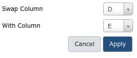

# Building and Manipulating Collections with Rules
{:.no_toc}

Through a series of examples, this tutorial aims to familiarize the reader with building Galaxy collections from tabular data containing URLs, sample sheets, list of accessions or identifiers, etc.. 

> ###   Audience
> This tutorial assumes a basic knowledge of using dataset collections in Galaxy but doesn't assume any particular knowledge of biology or bioinformatics. If you have not used collections with Galaxy previously, please check out the [processing many sample at once]({{ site.baseurl }}/topics/introduction/processing-many-samples-at-once/tutorial.html) tutorial.

> ### Agenda
>
> In this tutorial, we will:
>
> 1. TOC
> {:toc}
>
{: .agenda}

# Example: Uploading Datasets with Rules

This approach could be used to manipulate lists of uploads coming from many different formats, but we will start with a tabular description of files for a study from the [European Nucleotide Archive](https://www.ebi.ac.uk/ena). The study can be found [here](https://www.ebi.ac.uk/ena/data/view/PRJDA60709).

To start, navigate to the above study and click the option to "Select columns". Here we will narrow the set of columns we consider to just a few relevant to uploading these files to Galaxy.


Download the resulting tabular data describing the files by clicking the "TEXT" link at the top of the page. Alternatively, the resulting sample sheet can be found [here](https://raw.githubusercontent.com/jmchilton/galaxy-examples/master/ena_PRJDA60709/PRJDA60709.txt). The number and size of the files for this example are relatively small for sequencing data but larger files and larger numbers of files should work as well - Galaxy will just need more time to download and process the files.

Open the resulting spreadsheet in your local spreadsheet program, a text editor, or in your web browser and select all the data and copy to your clipboard.

Next navigate to Galaxy, and click the upload icon toward the top left corner. By default the familiar simple upload dialog should appear. This dialog has more advanced options as different tabs across the top of this dialog though. Click "Rule-based" as shown below.


As you can see in this dialog, data can be selected from a history dataset or pasted in directly. If Galaxy is configured to allow FTP uploads, the contents of your FTP directory may be loaded directly as well. For this example, simply paste your tabular data right into the textbox on this page as shown below and then click the "Build" button.


This should bring you to the "rules" editor.


At first glance, this may be feel like Excel or another spreadsheet program and you may feel the urge to start editing cells but we strongly encourage defining rules for manipulating the data instead. There are a few reasons for this:

* Manually modifying this metadata is not reproducible - we will not belabor the point here but check out [Why not use excel for this?]({{ site.baseurl }}/topics/introduction/tutorials/galaxy-intro-strands/tutorial.html#why-not-use-excel-for-this) for more context. Building up rules for modifying this metadata will allow Galaxy to track and report your manipulations (providing tracibility) and apply them to new sets of files (providing reproducibility).
* Manually modifying this metadata is error prone - we believe defining rules and treating the metadata in a systematic way minimizes the possibility to manual errors. These errors can be very hard to detect for large sets of data.
* Manually modifying data is not scalable - this rule-based technique potentailly scales to importing tens of thousands of datasets.

So rather than modifying the data you see, we will define rules for manipulating it and setting up "column definitions" that tell Galaxy how to use the metadata during upload or collection creation.

In order to get these files into Galaxy, we will want to do a few things.

* Strip that header out of the data (it doesn't contain a URL Galaxy can download).
* Define column "C" as the dataset name.
* Define column "D" as the dataset URL (this is the location Galaxy can download the data from).
* Tell Galaxy to treat these files as "fastqsanger.gz" files.

We will start by stripping that header out of the table. We call rules that strip rows out the table "Filter" rules in this dialog. Click on the "Filter" popup menu button to bring up a list of filters to apply and select "First or Last N Rows".


Fill in "1" as the number of rows to filter out as shown above and click "Okay".

Next we will define these columns for Galaxy. Click on the "Rules" popup menu button and select "Add / Modify Column Definitions".

Here we will add two column definitions. Click on the "Add Definition" button and select "Name". Repeat this again and select "URL" instead. Then use the resulting dropdown selection box to define column "C" as "Name" and column "D" as "URL".


Now click "Okay", and you should see your new column definitions listed as in the following screenshot.


Click the "Type" selection box toward the button of this screen and search for "fastqsanger.gz" and select this.


You are now ready to start the upload, click the "Upload" button and wait for the upload job to complete.

After some time, the result in this case will be six datasets in your history. The next example will show to use the rule builder to create a collection.

# Example: Creating a Simple Dataset List

For our second example, we will use the same initial metadata. Before we start uploading, it may be a good idea to create a new history for this example to keep things simple and match the following screenshots.

This time upload the metadata file containing URLs and identifiers as a "tabular" file to Galaxy so it shows up in your history. This example will demonstrate using such history datasets as the source for collection uploads - this can be handy when you'd like to apply existing Galaxy tabular manipulation tools to the metadata before processing for instance.

Next open the "Rule-based" upload tab again but select "Collection(s)" for "Upload data as" instead of the "Datasets" default used in the last example. Also select "History Dataset" for "Load tabular data from" instead of the default "Pasted Table" used in the last example. Finally, select the history dataset you just uploaded.


Now click "Build" to bring up the rule builder.


Repeat the last steps we did in the last example of stripping the header, assigning the "fastqsanger.gz" extension type, and defining column D as the target "URL". Rather than assiging column "C" as "Name" in this example we will assign it as a "List Identifier". This is the description of the element in the resulting dataset collection. This identifier is preserved in mapped outputs as you map tools over collections and is useful for tracking sample names, replicate numbers, conditions, etc..


Unlike the last example, this time we need to give the resulting collection a name before the "Upload" button becomes clickable. Enter the ENA study identifier as shown below.


Finally, click "Upload" and wait for the collection to be created. This time a single new entry will appear in your history panel corresponding to all the files gathered together in a simple list named PRJDA60709.

# Example: Creating a List of Dataset Pairs

For this next example we will again use ENA data, this time corresponding to the study [PRJDB3920](https://www.ebi.ac.uk/ena/data/view/PRJDB3920) instead. Again you can build the spreadsheet from the ENA website link or download it from [here](https://raw.githubusercontent.com/jmchilton/galaxy-examples/master/ena_PRJDB3920/PRJDB3920.txt).


Upload this file or paste it into the upload dialog for rules directly as you did for the last example.


Hit "Build" and to proceed to the rule builder.


Like in the last example, filter out the header, set column C as the list identifier, and set the extension to "fastqsanger.gz".


Notice that column D contains two URLs, so we cannot define that column as the URL directly. We need to split it into two columns first. To do this, click the "Column" popup menu and select "Using a Regular Expression".

Next we will build a regular expression that captures two "groups" from this combination of URLs - one group for everything before the ``;`` that seperates the two URLs and one group for everything after. So select column ``D`` and the second option for creating columns from regular expression groups.

The regular expression we will use is ``(.*);(.*)``. Here ``.*`` means match any number of any character - so basically match anything. The parentheses around ``.*`` means form a "group" from whatever is matched. The ``;`` will match with the actual ``;`` in the target cells.

Taken all together we are creating two groups and so two columns, one for everything before the ``;`` and one for everything after. The resulting form should look like this:


Click 'Okay' to apply this regular expression to the metadata.


We will remove the "unsplit" column D that we no longer need. Do this by selecting "Remove Column(s)" from the "Rules" popup menu, entering column "D" in the resulting form, and finally hitting "Okay".


We now have two columns containing URLs - but we can only have one URL per row. So we will split each row into two (one for the forward reads and one for the reverse). Do this by opening the "Rules" menu and selecting "Split Column(s)".

Next split column D and column E into alternate rows.


Click "Okay" and now you should have twice as many rows.


We will want to inform Galaxy which of these rows are "forward" reads and which are "reverse" reads.

We will do this by adding a new column again using a regular expression. Here we will match on the _1 or _2 in the filename at the end of the URLs. We can use the regular expression wildcard ``\d`` that matches any digit to do this.


At this point, you can swap the last two columns to bring this new paired indicator column toward the beginning of the table. This isn't nessecary but it makes the screenshots more informative. To do this, select "Swap Columns" from the "Rule" menu and swap columns "D" and "E".



Now we can see both a column with the single URL (E) and the paired indicator number it corresponds to (D).


Finally open the column definitions back up and assign column "D" to be the paired indicator and column "E" to be the URL and set the name of the collection.

The column selector is a bit less obvious and a bit more picky than the other ones we have used. The row value of the paired indicator column must be one of '1', 'R1', 'forward', 'f', or 'F' to indicate "forward" reads and '2', 'r', 'reverse', 'R2', 'R', or 'R2' to indicate "reverse" reads.


If you now click build, this should create a list of dataset pairs in your history.

# Example: Building URLs from Accession Information

In the previous examples the metadata we started with already contained URLs. In some cases
such URLs will not be present in the target metadata and may need to be constructed.

For this multiomics example, we will start with a uniprot query and build URLs from 
accession numbers contained within the supplied tabular data. Consider the uniprot query [http://uniprot.org/uniprot/?query=proteome:UP000052092+AND+proteomecomponent:"Genome"](http://uniprot.org/uniprot/?query=proteome:UP000052092+AND+proteomecomponent:"Genome"), pictured
below.


Lets describe how to turn these accession IDs into URLs. If you click on an example
Entry from that table in your web browser on UniProt you can find the download links
for different data types corresponding to that entry. In the following screenshot you can
see when "FASTA" if hovered over a URL for that FASTA file appears in the status bar of the
web browser. We can deduce that we can download the FASTA file corresponding to "E7C0H3" by
creating a URL of the form http://www.uniprot.org/uniprot/E7C0H3.fasta.


We can use that to build a collection of FASTA files for this query. Download the spreadsheet
from UniProt or [use this link](https://raw.githubusercontent.com/jmchilton/galaxy-examples/master/uniprot/uniprot.tsv). Like in the previous example, upload this data to Galaxy and 
select it in the rule builder upload page.


Now click "Build" to continue, the landing page should look like the following screenshot.


Repeat similar initial steps as before:

- Filter out the header using the "First or Last N Rows" filter.
- Remove columns B, C, E, F, and G using the "Remove Column(s)" from the "Rules" menu.
- Define column C as the target "info" - this is free text that appears in the history panel when the dataset is expanded.

After these steps are complete, the screen should look like the following screenshot.


These datasets appear in a seemingly random order, it will be easier to manage things in the
history panel if we sort this data first. Do this by selecting "Sort" from the "Rules" popup
menu.


Sorting on column A is perfect, so stick with the default here and click "Okay".

Next is the key step, we will build a URL from the pattern we described above using the
accession ID in column A. Click to add a new column "Using a Regular Expression" from the
"Column" popup menu.

Previously we used this form to match capture groups using the second option, this time we
will select the third option "Create column from expression replacement". This variant will
only create one new column and it allows the regular expression to be modified before creating
the collection.

Be sure column "A" is selected and specify a "Regular Expression" value of ".\*" - this
captures the whole accession ID. Next paste in the value ``http://www.uniprot.org/uniprot/$&.fasta`` for the replacement expression. Note that ``$&`` will be replaced by
the captured regular expression in the resulting column values.


After clicking "Okay", the new column C with the URL we built should appear as shown below.


We can finish off the example by:

- Specifying column A as the "List Identifier" for the resulting datasets.
- Specifying column C as the "URL" to use.
- Picking a name for the collection - such as "UP000052092".
- Select "fasta" for the file type to use.


This example is ready to go, but before clicking "Build" it may be interesting to check out 
the rules Galaxy is following to clean and import your data. Click the little Wrench icon at
the top of the list of rules. The result is a bunch of JavaScript object notation (JSON) text
that you should never need to worry about but that you can build or modify by hand if you find
it useful. We will use it the next example to quickly restore the list builder back to this
state.


Click "Build" and wait for your list of FASTA files to appear.

# Example: Building Matched Collections

This example will demonstrate creating multiple collections at the same time. We will use
the same metadata generated from UniProt as the last example but we will build two collections
with matching list identifiers - one collection of FASTA files and one collection of GFF files. This will also demonstrate reading the collection name and the target datatype from
the metadata itself - important techniques if generating multiple collections with different
names and datatypes.

To start this example, create a new history an re-upload the [uniprot.tsv](https://raw.githubusercontent.com/jmchilton/galaxy-examples/master/uniprot/uniprot.tsv) file from
the last example and open it in the rule builder.


Click "Build" to continue to the rule builder. Now in another browser tab, open [this link](../../images/rules/rules_example_4_8_text.txt) for the JSON that we
just demonstrated. Select it all and copy it to your clipboard. These are the rules from the
last example.

Back in Galaxy, select the wrench icon again and paste these rules into the resulting textbox
as show below.


Hit "Okay" and you should staring at the rules you created with the last example.


This part may seem a bit silly at first but we are going to add some columns with fixed
values into the builder. Hopefully when we split up the columns at a later step this will
make sense. So click "Fixed Value" under the "Column" value. Enter "fasta" for the column
type.


And click "Okay" - this will eventually be the datatype corresponding to the FASTA files
we are uploading. Repeat this process and add another column for the name - this time enter 
the fixed value "UP000052092 FASTA".

Next we will repeat the process of adding URL, name, and datatype columns but for GFF files.

So opt to add a column using "Regular Expression" again. Be sure column "A" is selected and
specify a "Regular Expression" value of ".\*". Next paste in the value
``http://www.uniprot.org/uniprot/$&.gff`` for the replacement expression. This mirrors
exactly what we did for FASTA files earlier on.


Next add two more columns using the "Fixed Value" option - one column containing "gff3" and 
one containing "UP000052092 GFF3".

You very large list of rules should now look like the following screenshot.


Notice we have two URLs, two collection names, and two datatype extensions for each accession
ID we started with. Like in the example where we split the columns, here we will split these
up to describe multiple collections.

Select "Split Columns" from the "Rules" menu. In the first list of columns, enter "C", "D", and "E" corresponding the FASTA columns. In the second list of columns enter "F", "G", and
"H" corresponding to the GFF3 columns.


Click "Okay" and you should be returned the list of rules.


Finally, we need to add some more column definitions for these new columns we just created. 
Make sure that column A is still the "List Identifier", B the "Info", C the "URL". Now make 
column D the "type" and column E the "Collection Name". Notice when these values are being
generated from the metadata the option to specify them manually from the form at the bottom
disappears.


Click "Upload" and Galaxy should make two collections - one containing FASTA files and one containing GFF3 files.

# Example: Building Nested Lists

For our next example we build a nested list using data from the [SRA](https://www.ncbi.nlm.nih.gov/sra).

In this example, we will be building a nested list. This is a more sophisticated structure for
organizing datasets in Galaxy. In the above examples we organized datasets into simple lists with a single
"list identifier" describing the files in the collection. Galaxy allows lists to be organized into
nested lists - where each level of the list has an identifier.

If two such identifiers are present, this is a list of lists (called ``list:list`` in the workflow editor).
In such a structure the outer identifiers (or first level of identifiers) may describe sample names and the
inner identifiers (or second level) may describe replicates. Alternative the outer identifiers may describe
conditions and the inner identifiers may describe individual samples. The structure of such collections should
ideally be dictated by the study design.

If certain parts of your analysis require benefit from datasets being nested this way while other parts require
feeding you data to a Galaxy tool all together without such a structure,it is probably best to go ahead and build
nested lists at the start of your analysis and then use the "Flatten Collection" tool on the resulting collection
or a derivative collection to get the flat structure needed by certain tools in certain parts of your analysis.

For this example, we will describe analyzing the metadata of the [SRA project
PRJNA355367](https://www.ncbi.nlm.nih.gov/sra?term=PRJNA355367&cmd=DetailsSearch). Unlike the other examples,
these SRA files are relatively large and not ideal for training purposes. So we've pre-downloaded the
project metadata and replaced all the links with simple text files that should download really quickly -
the [result is here](https://raw.githubusercontent.com/jmchilton/galaxy-examples/master/sra_PRJNA355367/PRJNA355367.csv).

So use either the SRA exporter tool or download the CSV file with fake URLs, and open the resulting file
in your favorite spreadsheet application. The Mac OS X application "Number" is pictured below:


To simplify things, just select the first 12 columns from the data as pictured below and copy the resulting
columns to your clipboard.

Next navigate to Galaxy, and click the upload icon toward the top left corner, select "Rule-based" again,
and choose "Collection(s)" and "Pasted Entry". Paste the data into the resulting box, and click "Build" as
in the previous examples.


TODO: This screenshot is off...

The resulting table should look something like the following:


Like in other examples, strip the header row. Navigate to the end of the table and notice that column J is the URL
target we are hoping to download for each file. Set this column definition accordingly.


For the analysis we wish to do, we want to group these files based on the type indicated in column L (LibraryName) 
shown below. The source data though adds numbers to the library type to to generate the LibraryName, we need to strip
those out to use the type as an identifier for grouping the datasets.

To do this, use the regex column adder rule again. We will capture the type into a group again. So select the Regular Expression option from the Column rule menu, and select column ``L``, and then select second option for creating columns from regular expression groups.

The regular expression we will use is ``([^\d]+)\d+``. Here ``\d`` means any digit, so ``[^...]`` means match 
anything that is not inside the brackets. So together ``[^\d]+`` means match one or more, non digits at the start of the column and the ``()`` around that means capture them into a group. We've add ``\d+`` at the end of the expression
but it isn't groupped so we are effectively ignoring the digits at the end as we had hoped.

The result looks like:


Now we have two columns we need to assign list identifiers for, the new column "M" for the first, outer identifier 
and the first column "A" for the inner, second identifier. Do this by adding a list identifier column definition as 
before, but after the first ("M") is set, click "Assign Another Column" under "List Identifier(s)" to assign a 
second column.

The result should look something like this:


Click "Apply" to return to the rule preview screen and notice there are two column listed for the list identifier 
definition.


Finally, set a name and datatype for this collection (probably "txt" if you used the dummy data above or "sra" if 
you are really using data from the SRA).


Click "Upload" to tell Galaxy to proceed to building the collection.

# Example: Apply Rules to Existing Collections

To start this example, we will first upload a simple, flat collection of data. The data files we will use
will be the same as those used by the [DESeq2 Vignette](http://bioconductor.org/packages/devel/bioc/vignettes/DESeq2/inst/doc/DESeq2.html)
from the [Pasilla Biooconductor Package](http://bioconductor.org/packages/release/data/experiment/html/pasilla.html).

To get this data into Galaxy, click on the upload button and select to upload data via rules as we have been doing.


Select to upload a "Collection", and paste the following table into the textbox:

```
https://raw.githubusercontent.com/jmchilton/galaxy/apply_rules_tutorials/test-data/rules/treated1fb.txt treated_single_1
https://raw.githubusercontent.com/jmchilton/galaxy/apply_rules_tutorials/test-data/rules/treated2fb.txt treated_paired_2
https://raw.githubusercontent.com/jmchilton/galaxy/apply_rules_tutorials/test-data/rules/treated3fb.txt treated_paired_3
https://raw.githubusercontent.com/jmchilton/galaxy/apply_rules_tutorials/test-data/rules/untreated1fb.txt untreated_single_4
https://raw.githubusercontent.com/jmchilton/galaxy/apply_rules_tutorials/test-data/rules/untreated2fb.txt untreated_single_5
https://raw.githubusercontent.com/jmchilton/galaxy/apply_rules_tutorials/test-data/rules/untreated3fb.txt untreated_paired_6
https://raw.githubusercontent.com/jmchilton/galaxy/apply_rules_tutorials/test-data/rules/untreated4fb.txt untreated_paired_7
```


There are 7 data files that are each either "treated" or "untreated" and from "paired-end" or "single-read" data.
Annotate the first column as a URL to download and the second column as the list identifier to use. Select "txt" as 
the datatype and give the collection a name.

When this has all been done, your upload rule preview will look something like this:


Click "Upload" and wait for your list to be created properly.


The first thing we will do to this new collection is add some levels or depth to its structure. Lets assume we want
to group it into "treated" and "untreated" lists and "paired" and "single" sublists below that. We can do this with
the "Apply Rules" collection operation tool, which will likely be under the "Collection Operations" tool menu in your
Galaxy interface.

Click the tool and the very simple interface should look something like this:


This interface simply lets one pick a collection to operate on and then launch the rule builder window to work to 
describe and preview manipulating the metadata of that collection. Be sure your uploaded collection is selected
and then click the "Edit" button to build rules to apply to the collection.


When a flat collection is used with this tool, the rule builder will initialize a default rule to pull the list
identifier out for each item of the collection as shown above.

Next we will use regular expressions to build two new columns, these columns will group the datasets into "treated" 
and "untreated" sublists and then "single" and "paired" sublists of that. This rule is found under the "Column" 
menu, in this example we chose 

Select column ``A`` and the second option for creating columns from regular expression groups.

The regular expression we will use is ``(.*)_(.*)_.*``. Here ``.*`` means match any number of any character - so 
basically match anything. The parentheses around ``.*`` means form a "group" from whatever is matched.
The ``_`` describes the literal ``_`` values in the identifier we are matching. The result is that everything before
the first ``_`` will be matched as the first group and everything between the ``_`` characters will be matched
as the second group. Clik to apply this rule and two new columns should be created.

Finally, assign columns "B", "C", and "A" to be list identifiers in that order.


Click the "Save" button and run the tool. The resulting collection should have two new levels of depth for 
"untreated" vs "treated" and "paired" vs "single" as shown below.


Placing the "single" and "paired" sublists inside the "treated" and "untreated" lists was a bit arbitrary and
depending on the workflow these may need to be inverted at different parts of an analysis. The Apply Rules
tool can be used to invert these levels if that is needed.

Click to open the tool again and this time ensure the new nested list is selected before clicking "Edit".


Notice when loading a nested collection into the rule builder, there is a column for each layer of the list
for each element.

One can pretty easily invert the outer two layers of the list by simply assigning the list identifiers in a new
order. So select to assign "List Identifiers" and this time assign them to columns "B", "A", and "C" - in that
order.


Click "Save" and then execute the tool. The resulting collection should be inverted.


In addition to structural re-organizations of a collection, the Apply Rules tool can be used to filter
elements out of the collection. To demonstrate this, reopen the original flat list created for this example
in the rule builder of the Apply Rules tool. This time use a regular expression to just keep the single end
data as show below.


Click "Save" and then execute the tool. The resulting collection should be a filtered version of the original list.


Structural re-organizations of collections can also be combined with filtering. To demonstrate this, reopen the
original flat list created for this example again in the rule builder of the Apply Rules tool. Use the same regular
expression as last time to filter the result but also add a column for "treated" and "untreated" list identifiers.

Select the new column and the original column in that order as the "List Identifiers" of the new collection to be
built as pictured below.


Click "Save" and then execute the tool. The resulting collection should be a filtered to only include the "single" 
data and broken into "treated" and "untreated" sublists.


