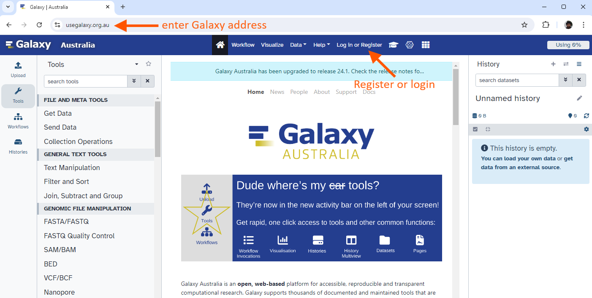
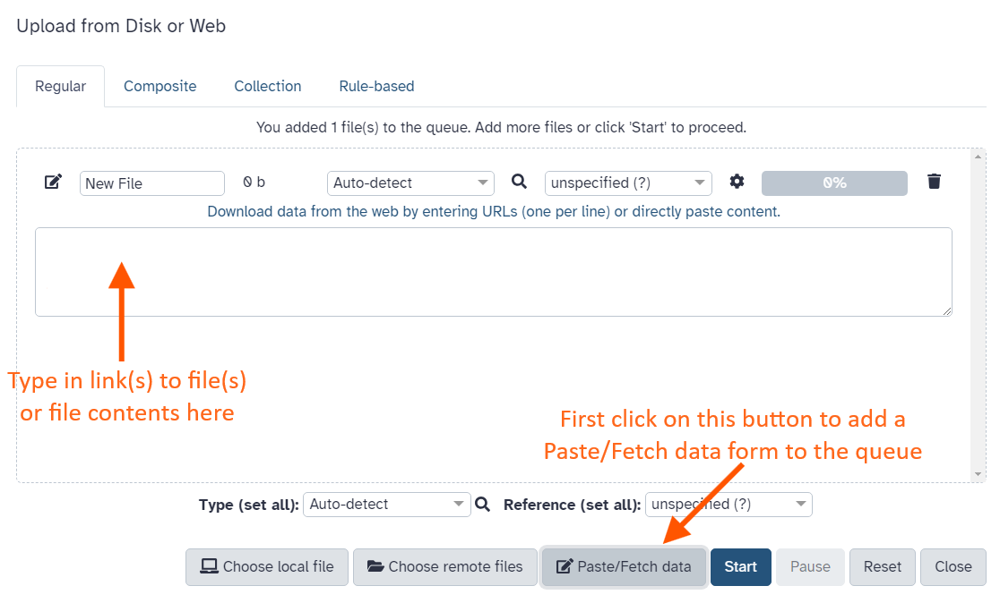
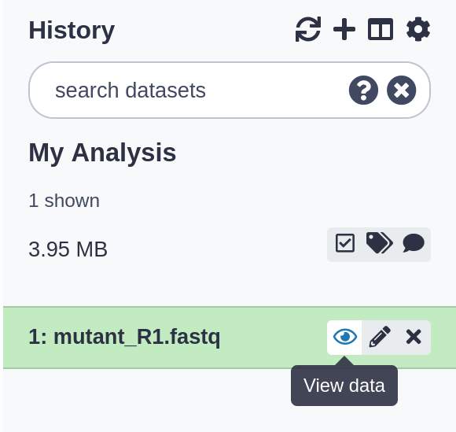
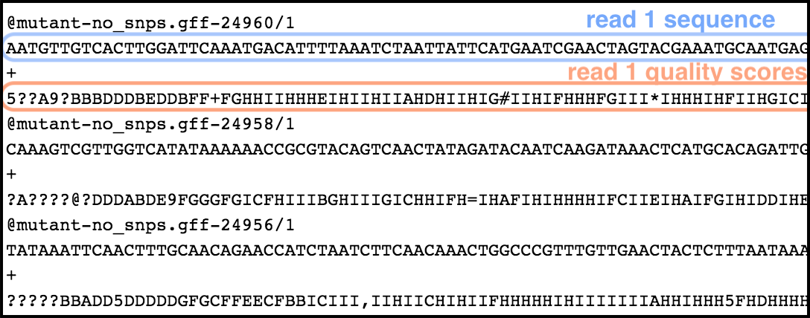
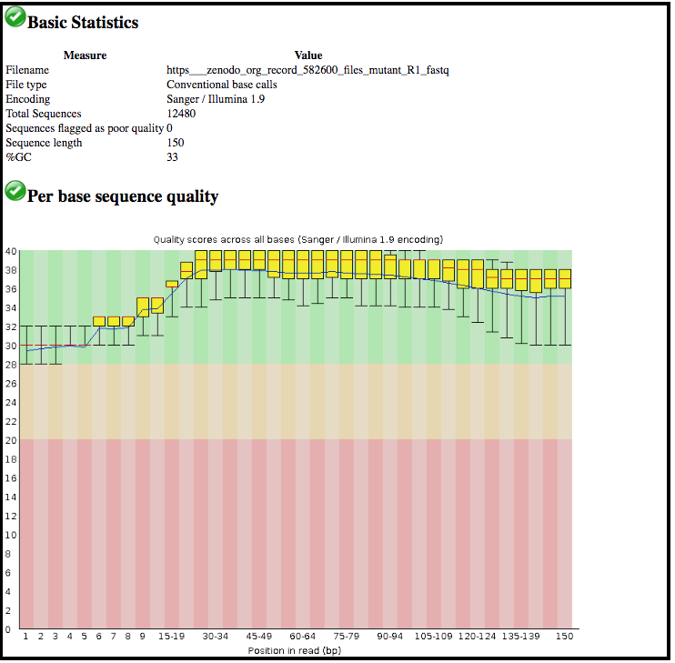
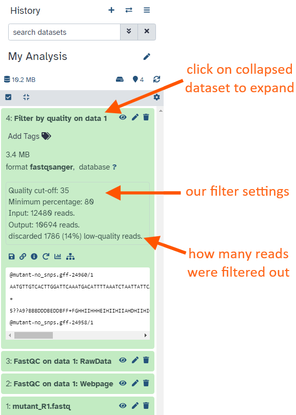
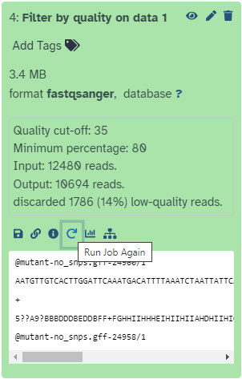
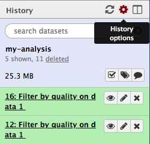
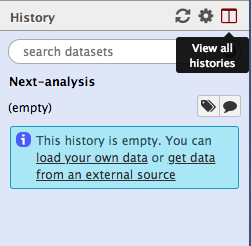
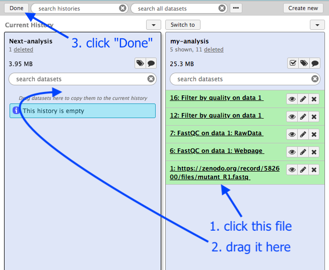

# Overview
{:.no_toc}

* This is a short introduction to the Galaxy user interface - the web page that you interact with.
* We will cover key tasks in Galaxy: uploading files, using tools, and viewing histories.

> ### Agenda
> 1. TOC
> {:toc}
>
{: .agenda}

## What does Galaxy look like?


> ###  Hands-on: Log in to Galaxy
> 1. Open your favorite browser (Chrome, Safari or Firefox as your browser, not Internet Explorer!)
> 2. Browse to your Galaxy instance
> 3. Log in or register
>
> 
>
>   > ###  Different Galaxy servers
>   >  This is an image of Galaxy Australia, located at [usegalaxy.org.au](https://usegalaxy.org.au/)
>   >
>   > The particular Galaxy server that you are using may look slightly different and have a different web address:
>   > - The main Galaxy server is [usegalaxy.org](https://usegalaxy.org/)
>   > - The European Galaxy server is [usegalaxy.eu](https://usegalaxy.eu/)
>   >
>   > You can also find more possible Galaxy servers at the top of this tutorial in **Galaxy instances**
>   {: .comment}
{: .hands_on}

The Galaxy homepage is divided into three panels:
* Tools on the left
* Viewing panel in the middle
* History of analysis and files on the right


The first time you use Galaxy, there will be no files in your history panel.

# Key Galaxy actions

## Name your current history

Your "History" is in the panel at the right.

> ###  Hands-on: Name history
> 1. Go to the **History** panel (on the right)
> 2. Click on the history name (which by default is "Unnamed history")
>
>    {:width="320px"}
>
> 3. Type in a new name, for example, "My-Analysis"
> 4. Press <kbd>Enter</kbd> on your keyboard to save it
>
{: .hands_on}

## Upload a file

Your "Tools" are in the panel at the left.

> ###  Hands-on: Upload a file from URL
> 1. Go to the **Tools** panel (on the left)
> 2. Click **Get Data** (at the top of the list)
> 3. Click **Upload File**
>
>    This brings up a box:
>
>    {:width="500px"}
>
> 3. Click **Paste/Fetch data**
> 4. Paste in the address of a file:
>
>    ```
>    https://zenodo.org/record/582600/files/mutant_R1.fastq
>    ````
>
> 5. Click **Start**
> 6. Click **Close**
>
{: .hands_on}

Your uploaded file is now in your current history.
When the file has uploaded to Galaxy, it will turn green.

> ###  Comment
> After this you will see your first history item in Galaxy's right panel. It will go through
> the gray (preparing/queued) and yellow (running) states to become green (success).
>
{: .comment}

What is this file?

> ###  Hands-on: View the file content
> 1. Click on the  (eye) icon next to the file name, to look at the file content
>
>    {:width="320px"}
{: .hands_on}

The contents of the file will be displayed in the central Galaxy panel.

This file contains DNA sequencing reads from a bacteria, in FASTQ format:

   {:width="620px"}

## Use a tool

Let's look at the quality of the reads in this file.

> ###  Hands-on: Use a tool
> 1. Type **FastQC** in the tools panel search box (top)
> 2. Click on the **FastQC**  tool
>
>    The tool will be displayed in the central Galaxy panel.
>
> 3. Select the following parameters:
>    -  *"Short read data from your current history"*: the FASTQ file that we uploaded
>    - No change in the other parameters
> 4. Click **Execute**
>
{: .hands_on}

This tool will run and the two output files will appear at the top of your history panel.

## View results

We will look at the output file called *FastQC on data 1: Webpage*.

> ###  Comment
> * Note that Galaxy has given this file a name according to both the tool name ("FastQC") and the dataset ("data 1") that it used.
> * The name "data 1" means the dataset number 1 in Galaxy's current history (our FASTQ file).
>
{: .comment}


> ###  Hands-on: View results
> * Click on the  (eye) icon next to the output file.
>
>    The information is displayed in the central panel
>
>    {:width="620px"}
{: .hands_on}

This tool has summarised information about all of the reads in our FASTQ file.

> ###  Questions
>
> 1. What was the length of the reads in the input FASTQ file?
> 2. Do these reads have higher quality scores in the centre or at the ends?
>
>   > ###  Solutions
>   > 1. 150 bp
>   > 2. In the center
>   {: .solution}
{: .question}


## Run another tool

Let's run a tool to filter out lower-quality reads from our FASTQ file.


> ###  Hands-on: Run another tool
> 1. Type **Filter by quality**
> 2. Click on the tool **Filter by quality** 
> 3. Set the following parameters:
>    -  *"Library to filter"*: the input FASTQ file
>    - *"Quality cut-off value"*: 35
>    - *"Percent of bases in sequence that must have quality equal to / higher than cut-off value"*: 80
> 4. Click **Execute**
{: .hands_on}

After the tool has run, the output file will appear at the top of your History panel.
* This file will be called "Filter by quality on data 1".
* Remember that Galaxy has named this file according to the tool it used ("Filter by quality") and the data file ("data 1").
* The actual numbers in front of the files in the history are not important.

What are the results from this filtering tool?

We could click on the eye icon to view the contents of this output file, but it will not be very informative - we will just see a list of reads.

> ###  Hands-on: Get metadata about a file
> 1. Click on the output file name in the History panel
>
>    This expands the information about the file.
>
>    
>
{: .hands_on}

> ###  Questions
>
> How many read has been discarded
>
>   > ###  Solutions
>   > 1786 low-quality reads were discarded
>   {: .solution}
{: .question}

## Re-run that tool with changed settings

We have now decided that our input reads have to be filtered to an even higher standard. We will change the filter settings and re-run the tool.

> ###  Hands-on: Re-run the tool
> 1. Click on the  icon (**Run this job again**) for the output dataset of **Filter by quality** 
>
>    
>
>    This brings up the tool interface in the central panel with the parameters set to the values used previously to generate this dataset.
>
> 2. Change the settings to something even stricter
>
>    For example, you might decide you want 80 percent of bases to have a quality of 36 or higher, instead of 35.
>
> 3. Click **Execute**
> 4. View the results: Click on the output file name to expand the information. (*Note*: not the  (eye) icon.)
{: .hands_on}

> ###  Questions
>
> How many reads were discarded under these new filtering conditions?
>
{: .question}

You can re-run a tool many times with different settings. Each time you re-run the tool, the new output file will appear at the top of your current history.

## Create a new history

Let's create a new history.

> ###  Hands-on: New history
> 1. Click on the  (gear) icon (**History options**) in the History panel
>
>    
>
> 2. Select **Create New**
> 3. Name your history, *e.g.* "Next-analysis"
> 4. Press <kbd>Enter</kbd>
{: .hands_on}

This new history does not have any files in it yet.

## Look at all your histories

Where is your first history, called "my-analysis"?

> ###  Hands-on: View histories
> 1. Click on the **View all histories** ( icon) at the top right of your history
>
>    
>
>    A new page will appear with all your histories displayed here.
>
> 2. Copy a dataset into your new history
>    1. Click on the FASTQ file in "my-analysis" history
>    2. Drag it into the "Next-analysis" history
>
>    This makes a copy of the dataset in the new history (without actually using additional disk space).
>
> 3. Click on **Analyze Data** in the top panel to go back to your analysis window
>
> 
>
{: .hands_on}

Your main Galaxy window will now show the current history as "Next-analysis", and it will have one dataset in it.

At any time, you can go back into the "View all histories" page and "Switch to" a different history.

# Conclusion
{:.no_toc}

 Well done! You have completed the short introduction to Galaxy, where you named the history, uploaded a file, used a tool, and viewed results. Additional tutorials are available for a more in-depth introduction to Galaxy's features.
