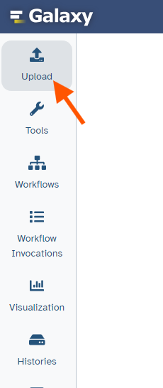
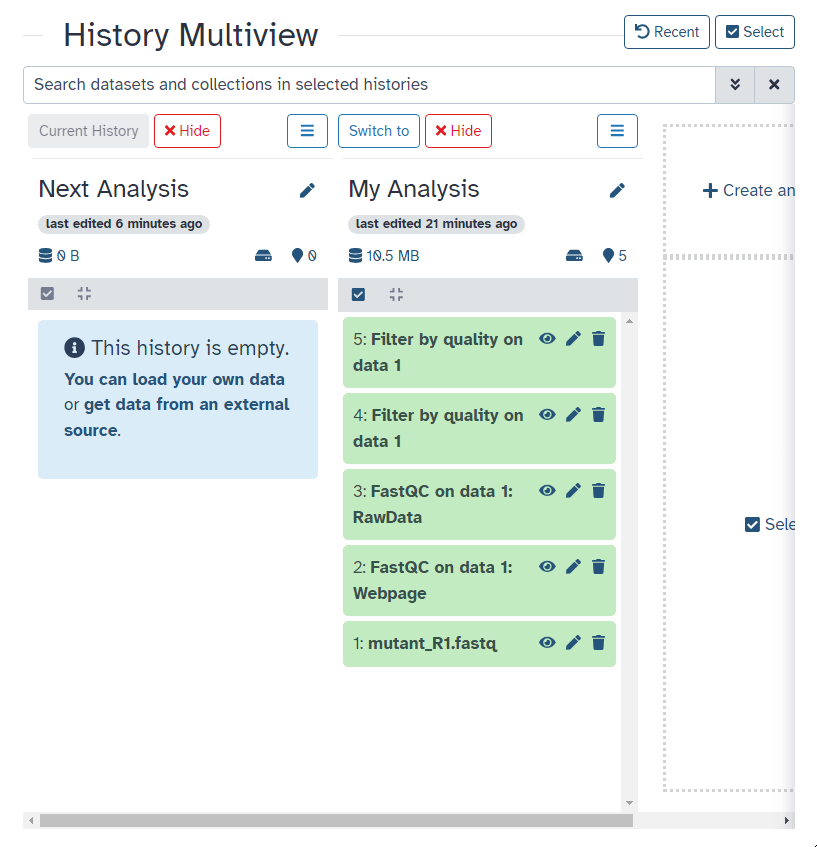
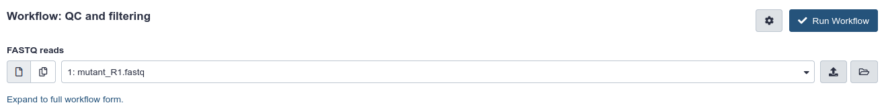

# Overview
{:.no_toc}

* This is a short introduction to the Galaxy user interface - the web page that you interact with.
* We will cover key tasks in Galaxy: uploading files, using tools, viewing histories, and running workflows.

> ### Agenda
> 1. TOC
> {:toc}
>
{: .agenda}

## What does Galaxy look like?


> ###  Hands-on: Log in to Galaxy
> 1. Open your favorite browser (Chrome, Safari or Firefox as your browser, not Internet Explorer!)
> 2. Browse to your Galaxy instance
> 3. Log in or register
>
> 
>
>   > ###  Different Galaxy servers
>   >  This is an image of Galaxy Australia, located at [usegalaxy.org.au](https://usegalaxy.org.au/)
>   >
>   > The particular Galaxy server that you are using may look slightly different and have a different web address:
>   > - The main Galaxy server is [usegalaxy.org](https://usegalaxy.org/)
>   > - The European Galaxy server is [usegalaxy.eu](https://usegalaxy.eu/)
>   >
>   > You can also find more possible Galaxy servers at the top of this tutorial in **Available on these Galaxies**
>   {: .comment}
{: .hands_on}

The Galaxy homepage is divided into three panels:
* Tools on the left
* Viewing panel in the middle
* History of analysis and files on the right


The first time you use Galaxy, there will be no files in your history panel.

# Key Galaxy actions

## Name your current history

Your "History" is in the panel at the right.

> ###  Hands-on: Name history
> 1. Go to the **History** panel (on the right)
> 2. Click on the history name (which by default is "Unnamed history")
>
>    {:width="320px"}
>
> 3. Type in a new name, for example, "My Analysis"
> 4. Press <kbd>Enter</kbd> on your keyboard to save it
>
> > ###  Renaming not an option?
> > If renaming does not work, it is possible you aren't logged in, so try logging in to Galaxy first. Anonymous users are only permitted to have one history, and they cannot rename it.
> {: .comment}
>
{: .hands_on}

## Upload a file

Your "Tools" are in the panel at the left.

> ###  Hands-on: Upload a file from URL
> 1. At the top of the **Tools** panel (on the left), click  **Upload**
>
>    
>
>    This brings up a box:
>
>    {:width="500px"}
>
> 3. Click **Paste/Fetch data**
> 4. Paste in the address of a file:
>
>    ```
>    https://zenodo.org/record/582600/files/mutant_R1.fastq
>    ````
>
> 5. Click **Start**
> 6. Click **Close**
>
{: .hands_on}

Your uploaded file is now in your current history.
When the file has uploaded to Galaxy, it will turn green.

> ###  Comment
> After this you will see your first history item (called a "dataset") in Galaxy's right panel. It will go through
> the gray (preparing/queued) and yellow (running) states to become green (success).
>
{: .comment}

What is this file?

> ###  Hands-on: View the dataset content
> 1. Click on the  (eye) icon next to the dataset name, to look at the file content
>
>    {:width="320px"}
{: .hands_on}

The contents of the file will be displayed in the central Galaxy panel.

This file contains DNA sequencing reads from a bacteria, in FASTQ format:

   {:width="620px"}

## Use a tool

Let's look at the quality of the reads in this file.

> ###  Hands-on: Use a tool
> 1. Type **FastQC** in the tools panel search box (top)
> 2. Click on the  tool
>
>    The tool will be displayed in the central Galaxy panel.
>
> 3. Select the following parameters:
>    -  *"Raw read data from your current history"*: the FASTQ dataset that we uploaded
>    - No change in the other parameters
> 4. Click **Execute**
>
{: .hands_on}

This tool will run and two new output datasets will appear at the top of your history panel.

## View results

We will now look at the output dataset called *FastQC on data 1: Webpage*.

> ###  Comment
> * Note that Galaxy has given this dataset a name according to both the tool name ("FastQC") and the input ("data 1") that it used.
> * The name "data 1" means the dataset number 1 in Galaxy's current history (our FASTQ file).
>
{: .comment}


> ###  Hands-on: View results
> * Once it's green, click on the  (eye) icon next to the "Webpage" output dataset.
>
>    The information is displayed in the central panel
>
>    {:width="620px"}
{: .hands_on}

This tool has summarised information about all of the reads in our FASTQ file.

> ###  Questions
>
> 1. What was the length of the reads in the input FASTQ file?
> 2. Do these reads have higher quality scores in the centre or at the ends?
>
>   > ###  Solutions
>   > 1. 150 bp
>   > 2. In the center
>   {: .solution}
{: .question}


## Run another tool

Let's run a tool to filter out lower-quality reads from our FASTQ file.


> ###  Hands-on: Run another tool
> 1. Type **Filter by quality** in the tools panel search box (top)
> 2. Click on the tool 
> 3. Set the following parameters:
>    -  *"Input FASTQ file"*: our initial FASTQ dataset
>    - *"Quality cut-off value"*: 35
>    - *"Percent of bases in sequence that must have quality equal to / higher than cut-off value"*: 80
> 4. Click **Execute**
{: .hands_on}

After the tool has run, its output dataset will appear at the top of your History panel.
* This dataset will be called "Filter by quality on data 1".
* Remember that Galaxy has named this file according to the tool it used ("Filter by quality") and the input dataset ("data 1").
* The actual numbers in front of the datasets in the history are not important.

What are the results from this filtering tool?

We could click on the eye icon to view the contents of this output file, but it will not be very informative - we will just see a list of reads.

> ###  Hands-on: Get metadata about a file
> 1. Click on the output dataset name in the History panel.
>
>    This expands the information about the file.
>
>    
>
{: .hands_on}

> ###  Questions
>
> How many read has been discarded
>
>   > ###  Solutions
>   > 1786 low-quality reads were discarded
>   {: .solution}
{: .question}

## Re-run that tool with changed settings

We can now try to filter our input reads to an even higher standard, and see how this changes the resulting output (an exploratory analysis). We will change the filter settings and re-run the tool.

> ###  Hands-on: Re-run the tool
> 1. Click on the  icon (**Run this job again**) for the output dataset of **Filter by quality** 
>
>    
>
>    This brings up the tool interface in the central panel with the parameters set to the values used previously to generate this dataset.
>
> 2. Change the settings to something even stricter
>
>    For example, you might decide you want 80 percent of bases to have a quality of 36 or higher, instead of 35.
>
> 3. Click **Execute**
> 4. View the results: Click on the output dataset name to expand the information. (*Note*: not the  (eye) icon.)
{: .hands_on}

> ###  Questions
>
> How many reads were discarded under these new filtering conditions?
>
{: .question}

You can re-run a tool many times with different settings. Each time you re-run the tool, its new output datasets will appear at the top of your current history.


## Convert your analysis history into a workflow

When you look carefully at your history, you can see that it contains all the steps of our analysis, from the beginning to the end. By building this history we have actually built a complete record of our analysis with Galaxy preserving all parameter settings applied at every step. But when you need to analyze new data, it would be tedious to do each step over again. Wouldn't it be nice to just convert this history into a workflow that we will be able to execute again and again?

Galaxy makes this very easy with the `Extract workflow` option. This means any time you want to build a workflow, you can just perform the steps once manually, and then convert it to a workflow, so that next time it will be a lot less work to do the same analysis.

> ###  Hands-on: Extract workflow
>
> 1. **Clean up** your history: remove any failed (red) jobs from your history by clicking on the  button.
>
>    This will make the creation of the workflow easier.
>
> 2. Click on  (**History options**) at the top of your history panel and select **Extract workflow**.
>
>    
>
>    The central panel will show the content of the history in reverse order (oldest on top), and you will be able to choose which steps to include in the workflow.
>
>    
>
> 3. Replace the **Workflow name** to something more descriptive, for example: `QC and filtering`.
>
> 4. **Rename** the workflow input in the box at the top of second column to: `FASTQ reads`
>
> 5. If there are any steps that shouldn't be included in the workflow, you can **uncheck** them in the first column of boxes. In this case, uncheck the second **Filter by quality** tool at the bottom, where we used a too high quality cut-off.
>
> 6. Click on the **Create Workflow** button near the top.
>
>    You will get a message that the workflow was created.
>
{: .hands_on}

In a minute we will see how to find the extracted workflow and how to use it.

## Create a new history

Let's create a new history.

> ###  Hands-on: New history
> 1. Create a new history
>
>    
>
> 2. Rename your history, *e.g.* "Next Analysis"
>
>    
>
{: .hands_on}

This new history does not have any datasets in it yet.

## Look at all your histories

Where is your first history, called "My Analysis"?

> ###  Hands-on: View histories
> 1. Click on the **View all histories** ( icon) at the top right of your history
>
>    {:width="320px"}
>
>    A new page will appear with all your histories displayed here.
>
> 2. Copy a dataset into your new history
>    1. Click on the FASTQ dataset in "My Analysis" history
>    2. Drag it into the "Next Analysis" history
>
>    This makes a copy of the dataset in the new history (without actually using additional disk space).
>
> 3. Click on the Home icon  (or **Analyze Data** on older versions of Galaxy) in the top panel to go back to your analysis window
>
> 
>
{: .hands_on}

Your main Galaxy window will now show "Next Analysis" as the current history, and it will have one dataset in it.

At any time, you can go back into the "View all histories" page and "Switch to" a different history.


## Run workflow in the new history

Now that we have built our workflow, let's use it to re-create our small analysis in a single step. The same workflow could also be used on some new FASTQ data to quickly repeat the same analysis on different inputs.

> ###  Hands-on: Run workflow
>
> 1. Click on **Workflow** in the top menu bar of Galaxy.
>    - Here you have a list of all your workflows.
>    - Your newly created workflow should be listed at the top:
>
>    
>
>    If you click on a workflow name, you can see all available actions for the workflow, e.g. edit, copy, rename, delete.
>
> 2. Click on the  (*Run workflow*) button next to your workflow.
>    - The central panel will change to allow you to configure and launch the workflow.
>
>    
>
> 3. Check that the *"FASTQ reads"* input is set to the FASTQ dataset we have copied to the new history.
     - In this page we could change any parameter for the tools composing the workflow as we would do when running them one by one.
>
> 4. Click the **Run Workflow** button at the top-right of the screen.
>
> 5. You should see a message that the workflow was successfully invoked. Then jobs will start to run and datasets appear in your "Next Analysis" history, replicating the steps of your previous history.
>
{: .hands_on}


# Conclusion
{:.no_toc}

 Well done! You have completed the short introduction to Galaxy, where you named the history, uploaded a file, used a tool, viewed results and run a workflow. Additional tutorials are available for a more in-depth introduction to Galaxy's features.
