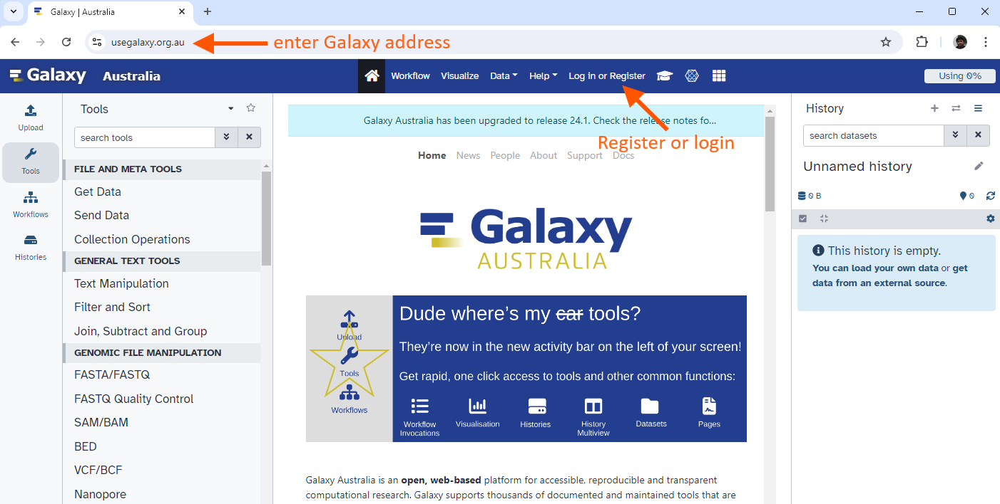

# Descripción General
{:.no_toc}
* Esta es una breve introducción a la interfaz de usuario de Galaxy -  La página web con la que vas a interactuar.
* En este tutorial vamos a cubrir tareas clave en Galaxy: cargar archivos, uso de herramientas y visualización de historiales.

> <agenda-title></agenda-title>
> 1. TOC
> {:toc}
>
{: .agenda}

## ¿Qué aspecto tiene Galaxy?

> <hands-on-title>Iniciar sesión en Galaxy</hands-on-title>
> 1. Abre tu navegador favorito (usa Chrome, Safari o Firefox, pero no Internet Explorer!)
> 2. Navega hasta tu instancia de Galaxy
> 3. Inicia sesión o regístrate
>
> 
>
>   > <comment-title>Diferentes servidores Galaxy</comment-title>
>   >  Esta es una imagen de Galaxy Australia, situado en [usegalaxy.org.au](https://usegalaxy.org.au/)
>   >
>   > El servidor de Galaxy que estás usando podría lucir un poco distinto y tener otra dirección web:
>   > - El servidor principal de Galaxy es [usegalaxy.org](https://usegalaxy.org/)
>   > - El servidor europeo de Galaxy es [usegalaxy.eu](https://usegalaxy.eu/)
>   >
>   > También puedes encontrar otros servidores de Galaxy en la parte superior de este tutorial en **Available on these Galaxies**
>   {: .comment}
{: .hands_on}

La página de inicio de Galaxy está dividida en tres paneles:
* Herramientas a la izquierda
* Panel de visualización en el centro
* Historial de análisis y archivos a la derecha


La primera vez que uses Galaxy, no encontrarás archivos en tu panel de historial.

# Acciones clave en Galaxy

## Nombra tu historial actual

Tu “Historial” está en el panel de la derecha.

> <hands-on-title>Nombrar historial</hands-on-title>
> 1. Ve al panel **History** (a la derecha)
> 2. Haz clic en el nombre del historial (que por defecto es "Unnamed history")
>
>	{:width="320px"}
>
> 3. Teclea el nuevo nombre, por ejemplo, "Mi-Analisis"
> 4. Presiona <kbd>Enter</kbd> en tu teclado para guardar
>
> > <comment-title>¿Cambiar el nombre no funciona?</comment-title>
> > Si cambiar el nombre no funciona, es posible que no hayas iniciado sesión, trata de iniciar sesión en Galaxy primero. Los usuarios anónimos tienen permitido tener un solo historial y no pueden cambiarle el nombre.
> {: .comment}
>
{: .hands_on}

## Cargar un archivo

Tus herramientas están en el panel de la izquierda.

> <hands-on-title>Cargar un archivo desde una dirección URL</hands-on-title>
> 1. En la parte superior del panel **Tools** (a la derecha), haz clic en  **Upload**
>
>	
>
>	Se desplegará el siguiente cuadro:
>
>	{:width="500px"}
>
> 3. Haz clic en **Paste/Fetch data**
> 4. Pega la dirección de un archivo:
>
>	```
>	https://zenodo.org/record/582600/files/mutant_R1.fastq
>	````
>
> 5. Haz clic en **Start**
> 6. Haz clic en **Close**
>
{: .hands_on}

Tu archivo aparece ahora en tu historial actual.
Cuando el archivo se haya cargado en Galaxy, aparecerá en color verde.

> <comment-title>Comentario</comment-title>
> Después de esto, podrás ver tu primer elemento del historial (llamado "dataset") en el panel derecho de Galaxy. Pasará de color gris (preparando/en cola) a amarillo (ejecutando) y luego a verde (cargado exitosamente)
>
{: .comment}

¿Qué es un archivo?

> <hands-on-title>Visualizar el contenido de un conjunto de datos</hands-on-title>
> 1. Haz clic en el icono  (ojo) junto al nombre del conjunto de datos para visualizar su contenido
>
>	{:width="320px"}
{: .hands_on}

El contenido del archivo se desplegará en el panel central de Galaxy.

Este archivo contiene lecturas de secuenciación de ADN bacteriano en formato FASTQ:

   {:width="620px"}

## Utilizar una herramienta

Echemos un vistazo a la calidad de las lecturas de este archivo

> <hands-on-title>Utilizar una herramienta</hands-on-title>
> 1. Teclea **FastQC** en el cuadro de búsqueda del panel de herramientas (parte superior)
> 2. Haz clic en la herramienta 
>
>	La herramienta se desplegará en el panel central de Galaxy.
>
> 3. Selecciona los siguientes parámetros:
>	-  *"Short read data from your current history"*: el archivo en formato FASTQ que cargamos
>	- Deja sin cambios el resto de los parámetros
> 4. Haz clic en **Execute**
>
{: .hands_on}

La herramienta se ejecutará y dos nuevos archivos de salida aparecerán en la parte superior de tu panel de historial.

## Visualización de resultados

Vamos a ver el archivo de salida llamado *FastQC on data 1: Webpage*.

> <comment-title>Comentario</comment-title>
> * Observa que Galaxy ha nombrado este conjunto de datos usando como base el nombre de la herramienta con que se generó (“FastQC”) y el archivo de entrada (“data 1”)
> * El nombre "data 1" significa que la salida corresponde al conjunto de datos número 1 en el historial actual de Galaxy (nuestro archivo FASTQ).
>
{: .comment}


> <hands-on-title>Visualización de resultados</hands-on-title>
> * Haz clic en el icono  (ojo) junto a la salida "Webpage".
>
>	La información se desplegará en el panel central
>
>	{:width="620px"}
{: .hands_on}

Esta herramienta resume la información de calidad de todas las lecturas en nuestro archivo FASTQ.

> <question-title>Preguntas</question-title>
>
> 1. ¿Cuál es la longitud de las lecturas en nuestro archivo FASTQ?
> 2. ¿Estas lecturas tienen valores de calidad más altos en el la región central de la secuencia o en los extremos?
>
>   > <solution-title>Respuestas</solution-title>
>   > 1. 150 bp
>   > 2. En el centro
>   {: .solution}
{: .question}


## Ejecutar otra herramienta

Vamos a ejecutar otra herramienta para filtrar las lecturas de baja calidad de nuestro archivo FASTQ.


> <hands-on-title>Ejecutar otra herramienta</hands-on-title>
> 1. Teclea **Filter by quality** en el cuadro de búsqueda del panel de herramientas (parte superior)
> 2. Haz clic en la herramienta 
> 3. Selecciona los siguientes parámetros:
>	-  *"Input FASTQ file"*: Nuestro archivo inicial el formato FASTQ
>	- *"Quality cut-off"*: valor de corte de calidad = 35
>	- *"Minimum percentage"*:  Porcentaje de bases en la secuencia que debe tener calidad mayor o igual al valor de corte de calidad = 80
> 4. Haz clic en **Execute**
{: .hands_on}

Una vez que la herramienta se ha ejecutado, los archivos de salida aparecerán en la parte superior de tu panel de historial.

* El conjunto de datos de salida se llamará "Filter by quality on data 1".
* Recuerda que Galaxy nombra el archivo de salida de acuerdo a la herramienta utilizada ("Filter by quality") y al conjunto de datos de entrada ("data 1").
* Los números que aparecen frente a los conjuntos de datos en el historial no son importantes.

¿Cuáles son los resultados de esta herramienta de filtrado?

Podríamos hacer clic en el icono del ojo para ver el contenido de este archivo de salida, pero no será muy informativo, solo veremos una lista de lecturas.

> <hands-on-title>Obtener metadatos de un archivo</hands-on-title>
> 1. Haz clic en el nombre de un conjunto de datos de salida en el panel de historial.
>
>	Esta acción expandirá la información que se tenga sobre el archivo.
>
>	
>
{: .hands_on}

> <question-title>Pregunta</question-title>
>
> ¿Cuántas lecturas han sido descartadas?
>
>   > <solution-title>Respuesta</solution-title>
>   > Se descartaron 1786 lecturas de baja calidad
>   {: .solution}
{: .question}

## Volver a ejecutar la herramienta con otros parámetros

Ahora hemos decidido que nuestro conjunto de datos de entrada tiene que ser filtrado usando un criterio de calidad aún más estricto. Vamos a cambiar los parámetros de filtrado y volveremos a ejecutar la herramienta.

> <hands-on-title>Volver a ejecutar la herramienta</hands-on-title>
> 1. Haz clic en el icono  (**Run this job again**) para el set de datos de salida **Filter by quality** 
>
>	
>
>	La interfaz de la herramienta aparecerá en el panel central con los valores de parámetros que utilizamos previamente para generar este set de datos
>
> 2. Cambia los parámetros para un filtrado más estricto
>
>	Por ejemplo, podrías decidir que el 80 por ciento de las bases tengan una calidad de 36 o superior, en lugar de 35.
>
> 3. Haz clic en **Execute**
> 4. Visualiza los resultados: Haz clic en el nombre del conjunto de datos de salida para expandir la información. (*Nota*: No uses el icono  (ojo))
{: .hands_on}

> <question-title>Preguntas</question-title>
>
> ¿Cuántas lecturas fueron descartadas bajo estas nuevas condiciones de filtrado?
>
{: .question}

Puedes volver a ejecutar la herramienta varias veces cambiando los parámetros. Cada vez que vuelvas a ejecutar la herramienta, el nuevo conjunto de datos de salida aparecerá en la parte superior de tu historial actual.

## Crear un nuevo historial

Vamos a crear un historial nuevo.

> <hands-on-title>Nuevo historial</hands-on-title>
> 1. Crear un nuevo historial
>
>    
>
> 2. Cambiar el nombre de tu historial, *e.g.* "Nuevo-Analisis"
>
>    
>
{: .hands_on}

Este nuevo historial todavía no tiene datos.

## Visualiza todos tus historiales

¿Dónde está tu primer historial llamado “Mi-Analisis”?

> <hands-on-title>Visualizar historiales</hands-on-title>
> 1. Haz clic en el icono **View all histories** () en la parte superior derecha de tu historial
>
>	{:width="320px"}
>
>	Aparecerá una nueva página donde se desplegarán todos tus historiales.
>
> 2. Copia un conjunto de datos a tu historial nuevo
>	1. Haz clic en el archivo FASTQ en el historial "Mi-Analisis"
>	2. Arrastralo al historial "Nuevo-Analisis"
>
>	Esto generará una copia del conjunto de datos en tu historial nuevo (sin utilizar espacio de disco adicional)
>
> 3. Haz clic en el icono  (o en **Analyze Data** en versiones anteriores de Galaxy) en la parte superior para regresar a la ventana de análisis
>
> 
>
{: .hands_on}

Tu ventana principal de Galaxy mostrará el historia actual como "Nuevo-Analisis" y contendrá un conjunto de datos.

Puedes regresar a la página "View all histories" en cualquier momento para cambiar de historial.

# Conclusión
{:.no_toc}

 ¡Bien hecho! Has completado el tutorial de Breve introducción a Galaxy, donde aprendiste a nombrar un historial, cargar un archivo, utilizar una herramienta y visualizar los resultados. Hay tutoriales adicionales disponibles para una introducción más detallada a las funciones de Galaxy.
