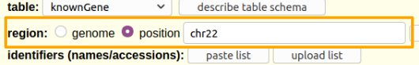
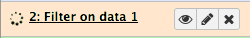
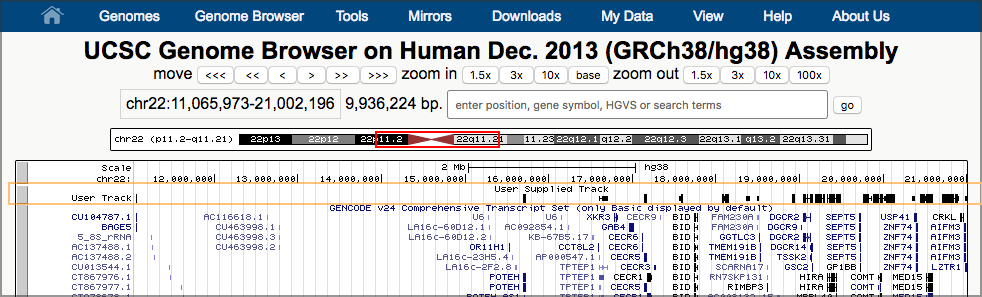

# Galaxy の紹介
{:.no_toc}

このチュートリアルでの目的はGalaxyのユーザーインターフェースに慣れることです。ここではデータのインポートや、ツールの実行、ヒストリーの操作、ワークフローの作成、作業の共有といった基本的なタスクのやり方を教えます。

> ###   Audience
> このチュートリアルはGalaxyや、ゲノミクス、バイオインフォマティクスを初めて学ぶ人のためのものです。もしバイオインフォマティクスが初めてではなければハンズオンボックスに記載されている項目を実行するか、[他の入門チュートリアル]({{ site.baseurl }}/topics/introduction/)を試してみて下さい。
>
> このチュートリアルでは [Galaxy 101]({{ site.baseurl }}//topics/introduction/tutorials/galaxy-intro-101/tutorial.html) と同じく基本的な内容を教えていますが、このチュートリアルで問われる問題を理解するために必要な生物学の知識は少なくて済みます。
{: .comment}

> ### アジェンダ
>
> このチュートリアルでは、以下のことを行います:
>
> 1. TOC
> {:toc}
>
{: .agenda}

# 前準備

> ###  必要条件
>
> このチュートリアルを実行するには、
>
> 1. インターネットに接続しているコンピュータが必要です。Galaxy はインターネットに接続していないラップトップで実行できますが、実際にはウェブ上リソースにアクセスする必要があります。
> 1. ウェブブラウザが必要です。 [Firefox](https://www.mozilla.org/firefox) と  [Google Chrome](https://www.google.com/chrome/)  は [Safari](https://www.apple.com/safari/)と同様にうまく動作します。 Internet Explorer は Galaxy に問題があることが知られているため使用しないで下さい。
> 1. Galaxy にアクセスする必要があります。 Galaxy  は様々な方法で利用できます。ワークショップの一環としてこれを利用するのであれば、インストラクターが使用するGalaxyを教えてもらえるでしょう。もしあなた自身でGalaxyを利用するなら、 [usegalaxy.org](https://usegalaxy.org) を使うことができます。
{: .comment}

> ###  Our Motivating Question
> *私は反対の鎖の遺伝子がお互いに重なるのではないかと思いますが、もしそうだとして、どのように解明しましょうか?*
{: .question}

この質問を調べるには *ゲノムや、染色体、鎖、そして遺伝子* についての基本的な理解が必要です。

> ###  定義 1
>
> * **ゲノム**
>> ゲノムは生物に固有なすべてのDNAのまとまりを指します。ヒトの場合、ゲノムはすべてヒトの染色体となります。
>
> * **染色体**
>> 生物におけるDNA組織の最大単位を指します。ヒトは23本の染色体を2対持っています。ヒトや、すべての動物や植物の染色体は*線状*です。（細菌は*環状*の染色体を持っています。）
>
> * **鎖**
>> 染色体は*二本鎖*です。一本はフォワード鎖で、一般的に上に描かれて、左から右に進行します。もう一方は、リバース鎖で、一般的に下に描かれて右から左に進行します。遺伝子はどちらの鎖にも存在することができます。 A single gene will have parts on only one stand.
>
> * **遺伝子**
>> "遺伝子とは何ですか？"これは議論がとても白熱した質問です。私たちとしては、遺伝子は生物によって使用される分子を作りだす染色体鎖上のDNAの部分を指します。
>
> 図形的には、ヒトゲノムはその中にある染色体として表すことができます:
>
> 
>
> そして、染色体、鎖、染色体上の遺伝子の表現です。
>
> 
{: .comment}

私たちが求めている質問は以下のようになります:

*重複していない遺伝子は共通している。重複している遺伝子はどの程度共通していますか？*

## ヒトの遺伝子定義を取得する

この質問に答えるためには遺伝子がヒト染色体上のどこで開始してどこで停止するかを知る必要があります。それは簡単な質問のようですが、あなたがバイオインフォマティクスを初めて学ぶようでしたらこの質問に答えるのはとても難しいです。ウェブ検索はウェブ上の様々な役に立つ場所に連れていきますが、多くの背景知識がなければ知りたいことを知るのは難しいです: *シーケンスとアノテーションの違いは何でしょうか？ FASTA や、BED 、GTF 、GFF3 そして VCF とは何でしょうか？ GRCh37 や、GRCh38、hg19、そして hg38 とは何でしょうか（また、hg20 から hg37 で何が起こったか...大丈夫ですか）？*

この特定の質問（および他の多くの質問）においては、多くの **Galaxy** が情報を見つけるのに役に立つことが分かります。

> ###  ハンズオン: Galaxy にログインする
> ウェブブラウザーで、 *go to* **[your Galaxy instance](#-requirements)** and *log in or register*.
{: .hands_on}

Galaxyインターフェースは主に3つの部分から構成されています。左側に利用できるツールのリストがあり、解析したヒストリーは右に記録され、中央のパネルではホームページや、ツールフォーム、そしてデータセットの内容を表示します。

> ###  ハンズオン:空のヒストリーを用いて始める
>
> * Galaxyサーバーを初めて利用した場合、あなたのヒストリーパネルは上記の画像のようになります。
>
> * ヒストリーにデータセットがある場合（ヒストリーに1つ以上の緑色のボックスである*データセット*がある場合）新しいヒストリーを作成します:
>     1. ヒストリーパネルのトップにある**歯車アイコン**をクリックする
>     2. メニューにあるオプションの**新しく作成**を選択する
{: .hands_on}

## Galaxyにデータを取得する

 [Galaxyにデータを取得する方法は沢山あります]({{ site.baseurl }}//topics/introduction/tutorials/galaxy-intro-get-data/slides.html)。左側にある**ツール**パネルの **Get Data** というツールボックスを使いましょう。

> ###  ハンズオン: **Get Data** ツールボックスを使用する
>
> 1. **Get Data** ツールボックスを*クリックして*展開する。
>  > 
>
{: .hands_on}

**Get Data** ツールボックスにはGalaxyが直接データを取得できるデータソースのリストが含まれています。 **Upload file** はコンピュータやウェブからデータを取得するのに非常に便利です（以下のスライドを見ましょう [Getting data into Galaxy]({{ site.baseurl }}//topics/introduction/tutorials/galaxy-intro-get-data/slides.html)）。今回は **UCSC Main table browser** を使用します。

### 遺伝子を取得する

> ###  ハンズオン: UCSC に移動する
>
> 1. ツール **UCSC Main table browser** を*クリック*し UCSC に移動する。
>  > 
{: .hands_on}

これによって UCSC Table Browser に移動します:

 

The [UCSC Table Browser](https://genome.ucsc.edu/cgi-bin/hgTables) では [UCSC Genome Browser](https://genome.ucsc.edu/cgi-bin/hgGateway)（下のボックスを参照）に表示されるすべてのデータへのアクセスを提供します。あなたがUCSCの対応している（ヒトのような）種を研究しているのであれば Table Browser はゲノムデータを取得するのに最適な場所です。

Table Browser には数多くのオプションがあります。幸運にも、これらはすべてよく使われるデフォルトに設定されていて、作業が大幅に簡略化されており、そしてほとんどのオプションが私たちが欲しい形に設定されています:

* **clade:** `Mammal`
* **genome:** `Human`
* **assembly:** `Dec. 2013 (GRCh38/hg38)`
* **group:** `Genes and Gene Predictions`
* **track:** `GENCODE v24`

**clade** と **genome** はとても明確でしょう。  **assembly** は私たちが使いたいヒトゲノムのバージョンや定義を選択します。（いかなる選択にも対応しますが、UCSCは `hg38` を提案しています、これは最近から提案されています。） **group** は私たちが使いたい `Genes and Gene Predictions` を選択します。ここまでは良いですね。

**track** にはおびただしい量のリストがあります。 UCSC では `GENCODE v24` を提案しています。ウェブ検索では [GENCODE のウェブサイト](https://www.gencodegenes.org/)にアクセスできますwhich prominently states:

> GENCODE プロジェクトは高品質なリファレンス遺伝子のアノテーションを手掛けていて、そして...

さらにいくつかの定義について話しましょう。

> ###  定義 2
>
> * **リファレンスゲノム**
>> リファレンスゲノムは完全に研究された*単一個体のゲノム*であり、その個体のDNAの大部分が正確に解明されている。実際にはリファレンスゲノムはその生物を研究している研究者によってゲノムマップとして共有されています。リファレンスゲノムは技術が向上するにつれて定期的に更新されます。
>
> * **シーケンス**
>> ゲノムのシーケンスでは、A, C, T, そして G （単一ヌクレオチド）のレベルまで、それぞれの存在する正確な位置を含むゲノム中のDNAを表記します。リファレンスゲノムが与えられていると、あなたはこのような質問をするでしょう、「2番染色体上のDNAは1,678,901位から1.688,322位の間にあるのですか？」
>
> * **ゲノム/遺伝子 アノテーション**
>> シーケンスではどのようなDNAがどこにあるかを教えてくれますが、そのDNAの機能については何も教えてくれません。*アノテーション*ではゲノム上の特定の領域について、リピート、プロモーター、そして動原体といった遺伝子がどこにあるのか、または特定の遺伝子がどのような活性を示すかに関する情報を追加します。
{: .comment}

**track** オプションではどのアノテーションのセットを取得したいかを尋ねられています。アノテーションは解析と解釈の結果であるため選択肢が非常に多くあり、実行する方法も沢山あります。（そしてこの場合、多くのオプションは遺伝子や遺伝子の予測ですらありません。）

GENCODE は"高品質"な"遺伝子アノテーション"です。それは使用するのにとても良いように思えます。デフォルトのままにしておきましょう: `GENCODE V24`。

ここまでのところ*何も*デフォルトから変更していません。何かを変更してみましょう。 **region** のデフォルトは whole genome で、実行することが出来ますが、情報がとても多いです。このチュートリアルでは1つの（小さな）染色体を使用してみましょう。

> ###  ハンズオン: region を限定してデータを取得する。
>
> 1. 22番染色体を欲しがりましょう
>   * **region** で `position` を選択する.
>   * `position` の隣にあるテキストボックスに `chr22` (case matters) と入力する。
>     > 
>
> 2. **get output** ボタンを*クリック*する。
>   * ですが、これは実際にアウトプットを取得することはありません。このボタンをクリックすると私たちが欲しいものに正確に応えてくれる2つ目のUCSCのページに移動します。
> &nbsp;
>     > 
>
> 3. **Create one BED record per** の下にある **Whole Gene** が選択されているか確認する。
>
> 4. フォームの下部にある **Send query to Galaxy** ボタンをクリックする。
{: .hands_on}

これでGalaxyに戻り、緑色の大きなボックスが初めて表示されています（いい感じです！）、そして Galaxy を始めたときの画面に戻っています。ただし今ヒストリーに1つ項目が入っており、これは UCSC からのデータセットです。

### ヒストリーのステータスについて

新しいヒストリーの項目を見てください。それは完了までに3つのステータスを経るでしょう。

| 色 | アイコン | 意味 | |
| ---- | ---- | ---- |
| **灰色** | 時計 | 項目が開始待ちです（データ転送の開始を待っています）。 |  |
| **黄色** | スピナー | 項目が実行中です（データが能動的に転送されています）。 |  |
| **緑色** | なし | 項目が正常に終了しました（データ転送が完了しました）。 |  |

場合によっては4番目のステータスも表示されます

* **赤色**: 項目が正常に完了しませんでした。

詳細については *Galaxy History Item Status* を参照してください。 [TODO]

## データを調べる

> ###  ハンズオン: データを見る
> データセットが緑色になったら、データセット名（ **UCSC Main on Human...** のようなもの）を*クリック*する
{: .hands_on}

これによりデータセットが展開されてその情報とその内容のプレビューが表示されます。

1. プレビューではいくつかのことがわかります:
1. このデータセットには4000以上の領域があり、これは22番染色体上に4000を超える遺伝子が存在することを意味しています。
1. データセットは **bed** 形式です。BED はゲノムアノテーションを表現するためのいくつかの標準フォーマットの1つです。BED は表の形式であり下記で展開します。 BED は UCSC table browser のアウトプット形式として事前に選択されていたので BED 形式を取得しました。
1. データセットの"データベース"は **hg38** です。 これはこのデータマップのどのリファレンスゲノムのリビジョンも示しています。hg38 は最新のヒトリファレンスゲノムです。UCSCでは hg38 もデフォルトで選択されていました。
1. 最後に、データセットの最初の5行を示します。

データセットのプレビューは有益ですが、実際のデータセットの多くを見ることはできません。データセットアイコンを1つを使用してデータセットの全体を表示しましょう。

> ###  ハンズオン: データ全体を見る
> * **目のアイコン**を*クリック*してデータセットの内容を表示する。
>   > これにより、すべてのデータが表示されます
>     &nbsp;
>   > 
{: .hands_on}

### BED 形式

[BED](https://genome.ucsc.edu/FAQ/FAQformat.html#format1) はゲノムデータのためのいくつかの定評のある表形式の1つです。その他のフォーマットには GFF3 と GTF があります。今回行っている解析のタイプとしては、BED 形式が最も簡単に操作できます。BED は UCSC Genome Browser を動かすために作成されました。BED ファイルには3～15列が含まれています。私たちの BED ファイルの例は遺伝子を記述し、12の列を含んでいます。

私たちは1、2、3列目、および6列目を注目します:

| # | 列名 | 意味 |
| ---- | ---- | ---- |
| 1 | 染色体 | 遺伝子が存在する染色体の名前です。 |
| 2 | 開始 | 染色体上で遺伝子が始まる地点（訳をどうにかしたい） |
| 3 | 終了 | 染色体上で遺伝子が終わる地点 （上と同じ）|
| 6 | 鎖 | どの鎖に遺伝子が存在するか。`+`はフォワード鎖（上、左から右）を意味していて、`-`はリバース鎖（下、右から左）を意味しています。 |

すべての列の詳細については、[UCSC の BED 形式の説明](https://genome.ucsc.edu/FAQ/FAQformat.html#format1)を参照してください。

## 命名

Galaxyでは解析（ヒストリー）とデータセットに名前をつけることができます。これまでのところ1つのヒストリー（"Unnamed history"）と1つのデータセット（"UCSC Main on Human:..."）がありますが、これは以下にとって良いアイデアです

1. ヒストリーに常に名前をつける
2. インプットと最終アウトプットのデータセット、そして重要な中間データセットに名前をつける。

あなたはこれを行う必要はありません。Galaxy は幸いなことにいくらでも "Unnamed history" のヒストリーを持つことができ、そしてすべてのデータセットに曖昧な名前をつけることができます。しかしながら、始めてから5つ目まで名前をつけずに、データセットの名前も曖昧なままに解析を実行していたならば、すべてに名前をつけたほうが良いでしょう。

> ###  ハンズオン: あなたのものに名前をつける
>
> 1. **ヒストリーに**意味が分かり見つけやすい**名前をつける**。
>    - ヒストリーのタイトルを*クリック*して **Intro - Strands** のような名前をつけます。キーボードの `enter` キーを押して保存する。
>   
> 1. **データセットの名前を変える**
>    - データセットの属性を編集するには**鉛筆アイコン**を*クリック*する。
>    - 次の画面でデータセットを `Genes` や `Genes chr22` のような名前に変更する。
>    - 画面下部（上部では？）の **Save** ボタンを*クリック*する。
>
>    今、ヒストリーは以下のように表示されています:
>
>    
{: .hands_on}

## 私たちはデータを持っています - どのような計画で質問に答えましょうか？

計画を立てる前に、できることを知る必要があります。データ解析の経験がなければ質問にどのように答えればいいのか分かりません。特定の解決法をなぞる前に、この質問をどのように解決するかを考えましょう。ツールを使った経験がない場合は、鉛筆と紙を用いて、手を動かしながらどのように解決するか考えましょう（鉛筆と紙による作業ならいくらでも行うことができます）。

このような質問にどのように答えましょうか。

1. 遺伝子のデータセットを2つに分割する:1つはフォワード鎖上の遺伝子で、もう1つはリバース鎖上の遺伝子です。
1. 2つのデータセットを比較して、重複しているかどうかを確認する。
1. どれだけの数の（またはどれくらいの割合の）遺伝子が他の遺伝子と重複しているかどうかを確認する。

Galaxy ではこれらのステップはすべて簡単に行うことができます。

### 遺伝子をフォワード鎖とリバース鎖のデータセットに分割する

どのすれば良いでしょうか？6列目には鎖の情報が載っています。6列目の値に基づいて遺伝子を2つのデータセットに分割できますか？どのように？利用できるツールを見てみましょう。「わあ！40個以上のツールボックスと、数百個のツールがあるじゃないか。」どうやって分割を行うことができるツールを見つけるつもりですか？

> ###  ツールの検索と実行
>
> 1. **ツールの検索ボックス**を試してみましょう。私たちが何を行いたいかを表した用語を考えて検索ボックスに入力します。使えそうな何かは見つかりましたか？少し探してみて下さい。
> 2. まだ検索していない場合は、**ツールの検索ボックス**に `split` と*入力*してください。結果の上部近くに、
>    - **Filter** data on any column using simple expressions というツールがあります。
>    - このツールは使えるかもしれません。
> 3.  **Filter** を*クリック*して Filter ツールを中央のパネルで開く。
> 4. **Syntax** と **Example** のセクションを見てツールが何をするかを理解する。
>
> 
{: .hands_on}

Filter ツールがファイルを複数のファイルに分割できることについては何も言及していません。フォワード鎖上の遺伝子のみか、リバース鎖上の遺伝子のみを取得する目的で Filter が使用できると述べているように見えます。私たちは、フォワード鎖の遺伝子で1回、リバース鎖の遺伝子で1回の、計2回 Filter を実行しなければならないようです。やってみましょう。

（ツールを検索している間に *all* ツールのルック＆フィールが Filter のそれと似ていることに気付いたかもしれません。）

> ###  ハンズオン: フォワード鎖上の遺伝子を取得するために Filter ツールを実行する。
>
> * filter ツールは3つのフィールドからなります:
>
>   1. **Dataset**: このプルダウンではこのツールで作業ができるヒストリーからすべてのデータセットがリストされます。あなたの場合はデータセットはおそらく1つだけです。ここに `Genes` というデータセットが設定されていることを確認してください。
>   1. **Condition**: このフリーテキストフィールドはアウトプットデータセットでどのレコードを使用したいか指定します。テキストボックスに `c6 == "+"` と *入力*しましょう。
>    * これは6列目（鎖）がプラス記号と等しくならなければならない（`==` は Python での*等しい*を指します）ことを指定しています。
>   1. **Header lines to skip**: これは`0`のままにしておきましょう。私たちのデータセットにはヘッダーの行はありません。
> * 最後に、**Execute** ボタンを*クリック*する。
>   > 
{: .hands_on}

これによりヒストリーに別のデータセットが追加されます。これはフォワード鎖上の遺伝子のみを含まれるべきです。データセットが緑色になったら、**目のアイコン**を*クリック*して確認しましょう。また、このデータセットの名前を `Genes, forward strand` のように変更することをお勧めします（どのようにやるか覚えていますか？）。

今私たちはリバース鎖上の遺伝子を取得しようとしています。実際に取得する方法はたくさんあります。ここでは2つ紹介します。

> ###  ハンズオン: リバース鎖上の遺伝子を取得する
>
> **方法 1**
>
> 1. `Genes, forward strand` データセットの名前を*クリック*してデータセットのプレビューを開く。ここではアップロードされている `Genes` データセットでは表示されなかったアイコンが表示されています: ループ矢印。
> 1. **ループ矢印**のアイコン（"このジョブをもう一度実行する"）を*クリック*する。これは実際にはジョブを再実行するわけではありません。ループ矢印を押すことで行われるのは*このデータセットを生成するために使用されたものとまったく同じ設定を持つ* Filter ツールのフォームを呼び出すことです。
> 1. 同じ設定で Filter を再実行するのではなく、**Condition** の欄を `c6 == "-"` に*変更*します。
> 1. **Execute** ボタンを*クリック*する。
>
> **方法 2**
> 1. ツールパネルの **Filter** を*クリック*して中央パネルで Filter ツールを開く。
> 1. 前と同じようにフォームを*入力*しますが、*ただし*:
>    * **Dataset** のプルダウンに `Genes` データセットが設定されていることを確認してください。
>    * **Condition** で `c6 == "-"` と*入力*してください。
> 1. **Execute** ボタンを*クリック*する。
>
> **両方の方法で**
> 1. 新しいデータセットの名前を `Genes, reverse strand` のように変更しましょう。
{: .hands_on}

再実行のボタンはより複雑なツールを実行する際に大きな助けになります。

> ###  Tip: 結果が出ない？
>
> 方法2を使用してデータセットをはっきりと設定しなかった場合は、`Genes, forward strand` のデータセットで Filter を実行していました。フォワード鎖のデータセット上の遺伝子で6列目が "-" のものがないため、それらすべてが結果から除外されていたために結果が出なかったのです。
>
> もう一度実行してデータセットを `Genes` データセットに設定してください。
{: .tip}

あなたのヒストリーには（少なくとも）3つのデータセットがあり、以下のような名前になっているはずです:

* `Genes`
* `Genes, forward strand`
* `Genes, reverse strand`

`forward` と `reverse` データセットの遺伝子の総数が `Genes` データセットの遺伝子数と同じでなければなりません。もしそのようになっていない場合、何故だかわかりますか？

### 重複をチェックする

Genes は *genomic interval* の一例です。

> ###  定義 3
>
> * **genomic interval**
>> Galaxy では、*genomic interval* は染色体の一部（またはコンティグのような別の線状フレームのリファレンス）にまたがるものです。Genes は genomic interval の一般的な例です。たとえ染色体であっても、非常に長いですが、genomic interval です。
{: .comment}

Galaxy は genomic intervals に関する質問に答えることに優れており、そして異なる genomic intervals のセットは互いに関係しています。見てみましょう。

> ###  ハンズオン: Genomic Interval のツール
>
> * In the tool panel, *open* the **Operate on Genomic Intervals** toolbox.  It's typically past the **NGS** toolboxes.
> * *Explore* the tools in this toolbox, looking for something that we can use to see which genes on opposite strands overlap.
{: .hands_on}

Of the tools in the **Operate on Genomic Intervals** toolbox, **Join** and particularly **Intersect** have the most promise.  Let's try **Intersect**.

> ###  Hands-on: Genomic Interval Tools
>
> 1. In the tool panel, *click* **Intersect** in the **Operate on Genomic Intervals** toolbox.
> 2. **Intersect**  with the following parameters:
>     - **Return** to `Overlapping Intervals`.
>       - This looks like it might return whole genes, while `Overlapping pieces` may return only the parts that overlap.  We suspect that whole genes might be more useful.
>     - **of** (the first dataset) to `Genes, forward strand`
>     - **that intersect** (the second dataset) to `Genes, reverse strand`
>     - **for at least** to `1`
>       - This will return genes with even just one position overlapping.
>     - *Click* **Execute**.
>     > 
>
> 3. Now repeat the intersect, but make the first dataset be the reverse genes, and the second be the forward genes.
>
> 4. Finally give both of the new datasets meaningful names, like `Overlapping forward genes` and `Overlapping reverse genes`
{: .hands_on}

## Results and final steps.

At this point we *could* say that we have answered our question. Using dataset previews in the history panel, we can compare the number of genes in the `Overlapping forward` and `Overlapping reverse` datasets with the number of genes in the full `Genes` dataset, and *conclude that overlapping genes on opposite strands are actually pretty common.*

However, before we rush off to publish our conclusions, let's

1. Get both the forward and reverse overlapping genes into a single dataset (one link will look better in our publication), and
2. *Visualize* our new dataset, just to double-check our results.

### Combine forward and reverse overlapping genes into one dataset.

What tool can we use to combine the two datasets into one?  Try *searching* for `combine` or `join` or `stack` in the tool search box.  You'll find lots of tools, but none of them do what we want to do. *Some times you just have to manually look through toolboxes to find what you need.*  Where should we look?  It's probably not **Get Data** or **Send Data**, but it could easily be in any of the next 4 toolboxes: **Lift-Over, Collection Operations, Text Manipulation, or Datamash**.

It turns out that **Lift-Over** and **Collection Operations** are not what we want.  (But, take a look at them: if you are going to work with genomic data it won't take long before you'll need both.)

> ###  Hands-on: *Concatenate* two datasets
>
> 1. *Open* the **Text Manipulation** toolbox.
> 2. Near the top of the toolbox is **Concatenate datasets tail-to-head**. *Click* on it.  Lets try that tool.
> 3. **Concatenate**  with the following parameters:
>   * *Set* **Concatenate Dataset** to `Overlapping reverse genes`.
>   * *Click* **+ Insert Dataset**.  This adds a second dataset pull-down menu to the form.
>   * *Select* `Overlapping forward genes` as the second dataset.
> 4. *Click* **Execute**
> 5. *Rename* the resulting dataset something informative like `Overlapping genes`
{: .hands_on}

Once the concatenate operation is finished, preview the dataset in your history panel.  Does it have the expected number of genes in it?  If not, see if you can figure out what happened.

### Visualize the overlapping genes

Galaxy knows about several visualization options for lots of different dataset types, including BED.  Whenever you preview a dataset in the history panel, Galaxy provides links to these visualizations.  For BED files (which is the format we have), options include **IGB, IGV,** and **UCSC main.**  IGB and IGV are widely used desktop applications and eventually you may want to install one or both of them.  For now, let's visualize the data at UCSC, using the UCSC *Genome* Browser.

> ###  Hands-on: Display data in Genome Browser
>
> 1. *Click* on your `Overlapping genes` dataset in your history panel. This will show the dataset preview in the history panel.
> 2. *Click* on the **display at UCSC main** link.
>
> This will launch a new window, showing UCSC's Genome Browser with our dataset shown right at the top.  UCSC figures out that our first overlapping gene is ~11 million bases into chromosome 22, and it has landed us there.
>
>   
{: .hands_on}

> ###  Background: UCSC Genome Browser
>
> * *Genome browsers* are software for viewing genomic information graphically.  The [UCSC Genome Browser](https://genome.ucsc.edu/cgi-bin/hgGateway) (and most genome browsers) typically display different types of *annotation* about a region of a genome.  This is displayed as a stack of *tracks* and each track contains a different type of information.
>
> * Genome browsers are useful for seeing information in context and for seeing (and discovering) correlations between different types of information.  (They are also useful for visually checking results, which is what we are doing now.)
>
> * The UCSC Genome Browser has information on over 100 animals, and their [Archaeal Genome Browser](http://archaea.ucsc.edu/cgi-bin/hgGateway?db=pyrFur2) has genomic information on well over 100 microbial species.
{: .comment}

Now, take a look at one of our results.  (Any pair of overlapping genes will do.)  Our data is in the second to top track (**User Track / User Supplied Track**). That track shows a line of small black boxes, sometimes connected with a line.

> ###  Zoom in on an area of the chromosome that shows a set of *linked* black boxes
> To zoom in,
> * *Click* on the **Scale** track (the top track) just to the left of the start of the black boxes.
> * Now *drag* the mouse across the Scale track to just to the right of the  black boxes and let go.
>    > 
> * A window pops up describing several ways to interact with the browser.  Just *click* the **Zoom In** button at the bottom.
> * This redraws the window, this time zoomed in to what you highlighted.
> * Continue to zoom in until you have the set of linked black boxes you picked centered on the screen.
> * Once you are as zoomed as you want to be, click on one of the linked boxes.  This will expand the track:
>    > 
{: .hands_on}

The black boxes connected by lines represent genes, and each set of connected boxes is a single gene (actually, a single transcript of a gene).  Take a close look at the top several tracks.

* It looks like we preserved the gene definitions just fine.
* It looks like, sure enough, there are overlapping genes here, and they are on opposite sides.  The arrows on the connecting lines tell us which strand the gene is on.

Um, *what's up with the boxes and the lines connecting them?*

> ###  Definitions 4
>
> * **Exon**
>> In humans (and in all plants and animals) the molecules that are built from genes are often only built from a part of the DNA in the gene. The sections of DNA that can produce the molecules are called *exons*.
{: .comment}

As you may have guessed (or already knew): The black boxes are exons.  *Genes* are defined as *covering the entire area from the first black box to the last connected black box.*

## Do we have a problem?

*Maybe.*

Our *ad hoc* review of identified overlapping genes in the UCSC Genome Browser has *(or should have!)* confirmed that every gene we said has an overlapping gene on the opposite strand does in fact have that.  So, our conclusion appears solid: A significant percentage of genes *do* overlap with other genes on the opposite strand.

But, our conclusion may not be as *significant* as we had hoped. If only parts of genes, the exons, make stuff in our bodies, then should we have run this analysis on just the exons rather then the entire genes?  Probably.

Let's refine our question slightly

> ###  Our Revised Motivating Question
> *I wonder if **exons** on opposite strands ever overlap with each other, and if so, how common is that?*
{: .question}

### So, I have to do this all over again, but with exons?

*Well, yes and no.*  We will have to run the analysis again, this time on exons instead of whole genes. But we won't have to manually recreate every step of our analysis. Galaxy enables us to create a reusable *workflow* from the analysis we just did, and then we can rerun the analysis, as one step, anytime we want to, and on any dataset.

## Walk through the workflow tutorial

Run the [Create a reusable workflow from a history](../galaxy-intro-history-to-workflow/tutorial.html) tutorial for how to do this, *and then come back here to run your newly created workflow with the exon data.*

## Rerun analysis with exon data

We want to run the same analysis, but this time only look for overlaps that happen in *exons*, the parts of genes that produce stuff our body uses.  Before we start looking at exons, let's start a new history, one that contains only the genes file we got from UCSC. We could go back to UCSC and refetch the file, but there is an easier way.

> ###  Hands-on: Create a new history that contains some data from current history
>
> 1. *Click* on the **gear icon** at the top of the current history.
> 2. *Select* the **Copy Datasets** option from the pull down menu.  This launches the copy datasets form.
> 3. Under **Source History:**, *select* the dataset(s) you want to copy to the new history.
>    - In our case, we only want the `Genes` dataset.
> 4. Under **Destination History** enter an informative history name in the **New history named:** box.
>    - For example, `Exon overlaps on opposite strands`
>    > 
> 5. *Click* the **Copy History Items** button to create your new history.
>    - This creates a new history (with the copied dataset) and throws up a green box saying:
>    >  1 dataset copied to 1 history: `name you gave your new history`.
> 6. The history name is a link.  *Click* on it.
{: .hands_on}

### Get the exon data

And your new history appears in the history panel with the copied *genes* dataset.  What we need is *exons.* How can we get the exon information?  There are two relatively easy ways to get this information, one of which will be very familiar.

The first method involves going back to the UCSC Table Browser.  Everything on the first form would stay the same: We still want human, hg38, GENCODE v24, and just `chr22`. The second form is what changes.  Instead of getting the **Whole Gene**, we need to retrieve the **Coding Exons** only.

The second method is to use the **Gene BED To Exon/Intron/Codon BED expander** tool in the **Operate on Genomic Intervals** toolbox to extract the exon information from the genes BED file we already have. (*Of course!* you say.  Umm, there is no way that you should have known that you already had this information in the genes file, or that this tool existed.)

> ###  Get the exon data
>
> 1. Get the exon information, either by revisiting UCSC, or by using the **Gene BED To Exon/Intron/Codon BED expander** tool.  If you use the expander tool select **Coding Exons only** from the **Extract** pull-down.
> 2. Give the resulting dataset a meaningful name.
{: .hands_on}

If you got the data from UCSC it will look something like this:

Your history should now have two datasets: one describing entire genes, and one describing just the exons.

### Rerun the analysis, this time on exons.

When you did the *History to Workflow* tutorial you created a new workflow that was then added to your list of defined workflows.  

> ###  Run the workflow on the exon data.
>
> 1. *Click* the **Workflow** tab in the menu at the top of the Galaxy page.
>    - This lists all of your defined workflows, including the one you just created.
> 2. *Click* on the newly created workflow and select **Run** from the pull-down menu.
>    - This launches the workflow run form (which you also saw when testing this workflow)
> 3. *Select* **No** under **Send results to a new history**
> 4. *Set* the first (and only) input dataset to the `Exons` dataset, using the pull-down menu.
> 5. *Click* the **Run workflow** button.
{: .hands_on}

And Galaxy launches the workflow and says (in a nice big green box) something like:

> You can check the status of queued jobs and view the resulting data by refreshing the History pane.

Which in this case *is the truth*.  You can refresh the history panel by either reloading the whole page, of by clicking the looping arrow icon at the top of the history panel.  What you'll see is a stack of history steps that will go from queued to running to done as you watch them.

All steps in the history will be green when the workflow is done. Once that happens compare your output dataset with your input dataset?  What percentage of exons overlap with other exons on the opposite strand, and is it common or rare?  Is is a smaller percentage than we saw for whole genes?  

## Are we done?

Probably.  Note that we can no longer say what percentage of *genes* overlap.  We *can* say what percentage of exons overlap, and that is probably close enough for our goals.  If it isn't and we actually need to say what percentage of genes overlap, then we will have to do some extra work.  This can be done is several ways, but the Galaxy 101 tutorial may give you some ideas on how to follow this question all the way to genes.

# Conclusion
{: .no_toc}

:tada: Well done! :clap: You have just performed your first analysis in Galaxy.

# What next?

Sharing tutorial

# Final thoughts

## Why not use Excel for this?

You could use Excel or another spreadsheet program to do this analysis.  Here, we learned how to use Galaxy by answering a question.  You could just as easily learn Excel by answering the same question, and if the goal is to learn how to use a tool, then either tool would be great. But what if you are working on a question where your analysis matters?  Maybe you are working with human clinical data trying to diagnose a set of symptoms, or you are working on research that will eventually be published and maybe earn you a Nobel Prize?

In these cases your analysis, *and the ability to reproduce it exactly*, is vitally important, and Excel won't help you here. It doesn't track changes and it offers very little insight to others on how you got from your initial data to your conclusions.

Galaxy, on the other hand, *automatically records every step of your analysis.*  And when you are done, you can share your analysis with anyone.  You can even include a link to it in a paper (or your acceptance speech).  In addition, you can create a reusable workflow from your analysis that others (or yourself) can use on other datasets.

Another challenge with spreadsheet programs is that they don't scale to support *next generation sequencing (NGS)* datasets, a common type of data in genomics, and which often reach gigabytes or even terabytes in size.
