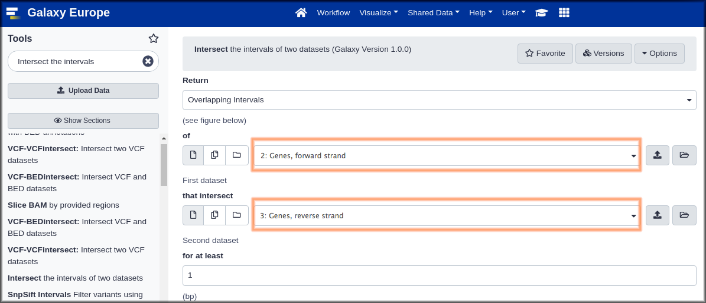
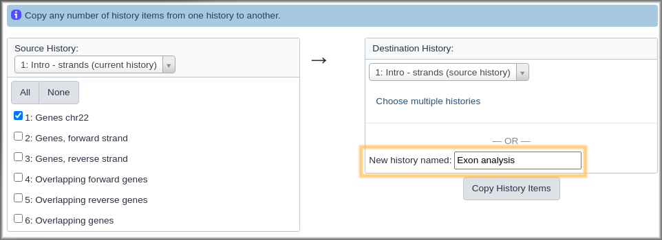

# Galaxy の紹介
{:.no_toc}

このチュートリアルでの目的はGalaxyのユーザーインターフェースに慣れることです。ここではデータのインポートや、ツールの実行、ヒストリーの操作、ワークフローの作成、作業の共有といった基本的なタスクのやり方を教えます。

> ###   Audience
> このチュートリアルはGalaxyや、ゲノミクス、バイオインフォマティクスを初めて学ぶ人のためのものです。もしバイオインフォマティクスが初めてではなければハンズオンボックスに記載されている項目を実行するか、[他の入門チュートリアル]({{ site.baseurl }}/topics/introduction/)を試してみて下さい。
>
> このチュートリアルでは [Galaxy 101]({{ site.baseurl }}//topics/introduction/tutorials/galaxy-intro-101/tutorial.html) と同じく基本的な内容を教えていますが、このチュートリアルで問われる問題を理解するために必要な生物学の知識は少なくて済みます。
{: .comment}

> ### アジェンダ
>
> このチュートリアルでは、以下のことを行います:
>
> 1. TOC
> {:toc}
>
{: .agenda}

# 前準備

> ###  必要条件
>
> このチュートリアルを実行するには、
>
> 1. インターネットに接続しているコンピュータが必要です。Galaxy はインターネットに接続していないラップトップで実行できますが、実際にはウェブ上リソースにアクセスする必要があります。
> 1. ウェブブラウザが必要です。 [Firefox](https://www.mozilla.org/firefox) と  [Google Chrome](https://www.google.com/chrome/)  は [Safari](https://www.apple.com/safari/)と同様にうまく動作します。 Internet Explorer は Galaxy に問題があることが知られているため使用しないで下さい。
> 1. Galaxy にアクセスする必要があります。 Galaxy  は様々な方法で利用できます。ワークショップの一環としてこれを利用するのであれば、インストラクターが使用するGalaxyを教えてもらえるでしょう。もしあなた自身でGalaxyを利用するなら、 [usegalaxy.org](https://usegalaxy.org) を使うことができます。
{: .comment}

> ###  Our Motivating Question
> *私は反対のストランドの遺伝子がお互いに重なるのではないかと思いますが、もしそうだとして、どのように解明しましょうか?*
{: .question}

この質問を調べるには *ゲノムや、染色体、ストランド、そして遺伝子* についての基本的な理解が必要です。

> ###  定義 1
>
> * **ゲノム**
>> ゲノムは生物に固有なすべてのDNAのまとまりを指します。ヒトの場合、ゲノムはすべてヒトの染色体となります。
>
> * **染色体**
>> 生物におけるDNA組織の最大単位を指します。ヒトは23本の染色体を2対持っています。ヒトや、すべての動物や植物の染色体は*線状*です。（細菌は*環状*の染色体を持っています。）
>
> * **ストランド**
>> 染色体は*二本鎖*です。一本はフォワード鎖で、一般的に上に描かれて、左から右に進行します。もう一方は、リバース鎖で、一般的に下に描かれて右から左に進行します。遺伝子はどちらのストランドにも存在することができます。 A single gene will have parts on only one stand.
>
> * **遺伝子**
>> "遺伝子とは何ですか？"これは議論がとても白熱した質問です。私たちとしては、遺伝子は生物によって使用される分子を作りだす染色体鎖上のDNAの部分を指します。
>
> 図形的には、ヒトゲノムはその中にある染色体として表すことができます:
>
> 
>
> そして、染色体、ストランド、染色体上の遺伝子の表現です。
>
> 
{: .comment}

私たちが求めている質問は以下のようになります:

*重複していない遺伝子は共通している。重複している遺伝子はどの程度共通していますか？*

## ヒトの遺伝子定義を取得する

この質問に答えるためには遺伝子がヒト染色体上のどこで開始してどこで停止するかを知る必要があります。それは簡単な質問のようですが、あなたがバイオインフォマティクスを初めて学ぶようでしたらこの質問に答えるのはとても難しいです。ウェブ検索はウェブ上の様々な役に立つ場所に連れていきますが、多くの背景知識がなければ知りたいことを知るのは難しいです: *シーケンスとアノテーションの違いは何でしょうか？ FASTA や、BED 、GTF 、GFF3 そして VCF とは何でしょうか？ GRCh37 や、GRCh38、hg19、そして hg38 とは何でしょうか（また、hg20 から hg37 で何が起こったか...大丈夫ですか）？*

この特定の質問（および他の多くの質問）においては、多くの **Galaxy** が情報を見つけるのに役に立つことが分かります。

> ###  ハンズオン: Galaxy にログインする
> ウェブブラウザーで、 *go to* **[your Galaxy instance](#-requirements)** and *log in or register*.
{: .hands_on}

Galaxyインターフェースは主に3つの部分から構成されています。左側に利用できるツールのリストがあり、解析したヒストリーは右に記録され、中央のパネルではホームページや、ツールフォーム、そしてデータセットの内容を表示します。

> ###  ハンズオン:空のヒストリーを用いて始める
>
> * Galaxyサーバーを初めて利用した場合、あなたのヒストリーパネルは上記の画像のようになります。
>
> * ヒストリーにデータセットがある場合（ヒストリーに1つ以上の緑色のボックスである*データセット*がある場合）新しいヒストリーを作成します:
>     1. ヒストリーパネルのトップにある**歯車アイコン**をクリックする
>     2. メニューにあるオプションの**新しく作成**を選択する
{: .hands_on}

## Galaxyにデータを取得する

 [Galaxyにデータを取得する方法は沢山あります]({{ site.baseurl }}//topics/introduction/tutorials/galaxy-intro-get-data/slides.html)。左側にある**ツール**パネルの **Get Data** というツールボックスを使いましょう。

> ###  ハンズオン: **Get Data** ツールボックスを使用する
>
> 1. **Get Data** ツールボックスを*クリックして*展開する。
>  > 
>
{: .hands_on}

**Get Data** ツールボックスにはGalaxyが直接データを取得できるデータソースのリストが含まれています。 **Upload file** はコンピュータやウェブからデータを取得するのに非常に便利です（以下のスライドを見ましょう [Getting data into Galaxy]({{ site.baseurl }}//topics/introduction/tutorials/galaxy-intro-get-data/slides.html)）。今回は **UCSC Main table browser** を使用します。

### 遺伝子を取得する

> ###  ハンズオン: UCSC に移動する
>
> 1. ツール **UCSC Main table browser** を*クリック*し UCSC に移動する。
>  > 
{: .hands_on}

これによって UCSC Table Browser に移動します:

 

The [UCSC Table Browser](https://genome.ucsc.edu/cgi-bin/hgTables) では [UCSC Genome Browser](https://genome.ucsc.edu/cgi-bin/hgGateway)（下のボックスを参照）に表示されるすべてのデータへのアクセスを提供します。あなたがUCSCの対応している（ヒトのような）種を研究しているのであれば Table Browser はゲノムデータを取得するのに最適な場所です。

Table Browser には数多くのオプションがあります。幸運にも、これらはすべてよく使われるデフォルトに設定されていて、作業が大幅に簡略化されており、そしてほとんどのオプションが私たちが欲しい形に設定されています:

* **clade:** `Mammal`
* **genome:** `Human`
* **assembly:** `Dec. 2013 (GRCh38/hg38)`
* **group:** `Genes and Gene Predictions`
* **track:** `GENCODE v24`

**clade** と **genome** はとても明確でしょう。  **assembly** は私たちが使いたいヒトゲノムのバージョンや定義を選択します。（いかなる選択にも対応しますが、UCSCは `hg38` を提案しています、これは最近から提案されています。） **group** は私たちが使いたい `Genes and Gene Predictions` を選択します。ここまでは良いですね。

**track** にはおびただしい量のリストがあります。 UCSC では `GENCODE v24` を提案しています。ウェブ検索では [GENCODE のウェブサイト](https://www.gencodegenes.org/)にアクセスできますwhich prominently states:

> GENCODE プロジェクトは高品質なリファレンス遺伝子のアノテーションを手掛けていて、そして...

さらにいくつかの定義について話しましょう。

> ###  定義 2
>
> * **リファレンスゲノム**
>> リファレンスゲノムは完全に研究された*単一個体のゲノム*であり、その個体のDNAの大部分が正確に解明されている。実際にはリファレンスゲノムはその生物を研究している研究者によってゲノムマップとして共有されています。リファレンスゲノムは技術が向上するにつれて定期的に更新されます。
>
> * **シーケンス**
>> ゲノムのシーケンスでは、A, C, T, そして G （単一ヌクレオチド）のレベルまで、それぞれの存在する正確な位置を含むゲノム中のDNAを表記します。リファレンスゲノムが与えられていると、あなたはこのような質問をするでしょう、「2番染色体上のDNAは1,678,901位から1.688,322位の間にあるのですか？」
>
> * **ゲノム/遺伝子 アノテーション**
>> シーケンスではどのようなDNAがどこにあるかを教えてくれますが、そのDNAの機能については何も教えてくれません。*アノテーション*では、遺伝子やリピートやプロモーターやセントロメアなど、特定のゲノム領域についての追加の情報です。
{: .comment}

**track** オプションではどのアノテーションのセットを取得したいかを尋ねられています。アノテーションは解析と解釈の結果であるため選択肢が非常に多くあり、アノテーションの方法も沢山あります。（そしてこの場合、多くのオプションは遺伝子や遺伝子の予測ですらありません。）

GENCODE は"高品質"な"遺伝子アノテーション"です。それは使用するのにとても良いように思えます。デフォルトのままにしておきましょう: `GENCODE V24`。

ここまでのところ*何も*デフォルトから変更していません。何かを変更してみましょう。 **region** のデフォルトは whole genome で、実行することが出来ますが、情報がとても多いです。このチュートリアルでは1つの（小さな）染色体を使用してみましょう。

> ###  ハンズオン: region を限定してデータを取得する。
>
> 1. 22番染色体を欲しがりましょう
>   * **region** で `position` を選択する.
>   * `position` の隣にあるテキストボックスに `chr22` (case matters) と入力する。
>     > 
>
> 2. **get output** ボタンを*クリック*する。
>   * ですが、これは実際にアウトプットを取得することはありません。このボタンをクリックすると私たちが欲しいものに正確に応えてくれる2つ目のUCSCのページに移動します。
> &nbsp;
>     > 
>
> 3. **Create one BED record per** の下にある **Whole Gene** が選択されているか確認する。
>
> 4. フォームの下部にある **Send query to Galaxy** ボタンをクリックする。
{: .hands_on}

これでGalaxyに戻り、緑色の大きなボックスが初めて表示されています（いい感じです！）、そして Galaxy を始めたときの画面に戻っています。ただし今ヒストリーに1つ項目が入っており、これは UCSC からのデータセットです。

### ヒストリーのステータスについて

新しいヒストリーの項目を見てください。それは完了までに3つのステータスを経るでしょう。

| 色 | アイコン | 意味 | |
| ---- | ---- | ---- |
| **灰色** | 時計 | 項目が開始待ちです（データ転送の開始を待っています）。 |  |
| **黄色** | スピナー | 項目が実行中です（データが能動的に転送されています）。 |  |
| **緑色** | なし | 項目が正常に終了しました（データ転送が完了しました）。 |  |

場合によっては4番目のステータスも表示されます

* **赤色**: 項目が正常に完了しませんでした。

詳細については *Galaxy History Item Status* を参照してください。 [TODO]

## データを調べる

> ###  ハンズオン: データを見る
> データセットが緑色になったら、データセット名（ **UCSC Main on Human...** のようなもの）を*クリック*する
{: .hands_on}

これによりデータセットが展開されてその情報とその内容のプレビューが表示されます。

1. プレビューではいくつかのことがわかります:
1. このデータセットには4000以上の領域があり、これは22番染色体上に4000を超える遺伝子が存在することを意味しています。
1. データセットは **bed** 形式です。BED はゲノムアノテーションを表現するためのいくつかの標準フォーマットの1つです。BED は表の形式であり下記で展開します。 BED は UCSC table browser のアウトプット形式として事前に選択されていたので BED 形式を取得しました。
1. データセットの"データベース"は **hg38** です。 これはこのデータマップのどのリファレンスゲノムのリビジョンも示しています。hg38 は最新のヒトリファレンスゲノムです。UCSCでは hg38 もデフォルトで選択されていました。
1. 最後に、データセットの最初の5行を示します。

データセットのプレビューは有益ですが、実際のデータセットの多くを見ることはできません。データセットアイコンを1つを使用してデータセットの全体を表示しましょう。

> ###  ハンズオン: データ全体を見る
> * **目のアイコン**を*クリック*してデータセットの内容を表示する。
>   > これにより、すべてのデータが表示されます
>     &nbsp;
>   > 
{: .hands_on}

### BED 形式

[BED](https://genome.ucsc.edu/FAQ/FAQformat.html#format1) はゲノムデータのためのいくつかの定評のある表形式の1つです。その他のフォーマットには GFF3 と GTF があります。今回行っている解析のタイプとしては、BED 形式が最も簡単に操作できます。BED は UCSC Genome Browser を動かすために作成されました。BED ファイルには3～15列が含まれています。私たちの BED ファイルの例は遺伝子を記述し、12の列を含んでいます。

私たちは1、2、3列目、および6列目を注目します:

| # | 列名 | 意味 |
| ---- | ---- | ---- |
| 1 | 染色体 | 遺伝子が存在する染色体の名前です。 |
| 2 | 開始 | 染色体上で遺伝子が始まる地点 |
| 3 | 終了 | 染色体上で遺伝子が終わる地点 |
| 6 | ストランド | どのストランドに遺伝子が存在するか。`+`はフォワード鎖（上、左から右）を意味していて、`-`はリバース鎖（下、右から左）を意味しています。 |

すべての列の詳細については、[UCSC の BED 形式の説明](https://genome.ucsc.edu/FAQ/FAQformat.html#format1)を参照してください。

## 命名

Galaxyでは解析（ヒストリー）とデータセットに名前をつけることができます。これまでのところ1つのヒストリー（"Unnamed history"）と1つのデータセット（"UCSC Main on Human:..."）がありますが、これは以下にとって良いアイデアです

1. ヒストリーに常に名前をつける
2. インプットと最終アウトプットのデータセット、そして重要な中間データセットに名前をつける。

あなたはこれを行う必要はありません。Galaxy は幸いなことにいくらでも "Unnamed history" のヒストリーを持つことができ、そしてすべてのデータセットに曖昧な名前をつけることができます。しかしながら、曖昧な名前のデータセットで、名前のない分析を5つほど実行すると、すべてに名前をつけたくなるかもしれません。

> ###  ハンズオン: あなたのものに名前をつける
>
> 1. **ヒストリーに**意味が分かり見つけやすい**名前をつける**。
>    - ヒストリーのタイトルを*クリック*して **Intro - Strands** のような名前をつけます。キーボードの `enter` キーを押して保存する。
>   
> 1. **データセットの名前を変える**
>    - データセットの属性を編集するには**鉛筆アイコン**を*クリック*する。
>    - 次の画面でデータセットを `Genes` や `Genes chr22` のような名前に変更する。
>    - 画面下部（上部では？）の **Save** ボタンを*クリック*する。
>
>    今、ヒストリーは以下のように表示されています:
>
>    
{: .hands_on}

## 私たちはデータを持っています - どのような計画で質問に答えましょうか？

計画を立てる前に、できることを知る必要があります。データ解析の経験がなければ質問にどのように答えればいいのか分かりません。特定の解決法をなぞる前に、この質問をどのように解決するかを考えましょう。ツールを使った経験がない場合は、鉛筆と紙を用いて、手を動かしながらどのように解決するか考えましょう（鉛筆と紙による作業ならいくらでも行うことができます）。

このような質問にどのように答えましょうか。

1. 遺伝子のデータセットを2つに分割する:1つはフォワード鎖上の遺伝子で、もう1つはリバース鎖上の遺伝子です。
1. 2つのデータセットを比較して、重複しているかどうかを確認する。
1. どれだけの数の（またはどれくらいの割合の）遺伝子が他の遺伝子と重複しているかどうかを確認する。

Galaxy ではこれらのステップはすべて簡単に行うことができます。

### 遺伝子をフォワード鎖とリバース鎖のデータセットに分割する

どのすれば良いでしょうか？6列目にはストランドの情報が載っています。6列目の値に基づいて遺伝子を2つのデータセットに分割できますか？どのように？利用できるツールを見てみましょう。「わあ！40個以上のツールボックスと、数百個のツールがあるじゃないか。」どうやって分割を行うことができるツールを見つけるつもりですか？

> ###  ツールの検索と実行
>
> 1. **ツールの検索ボックス**を試してみましょう。私たちが何を行いたいかを表した用語を考えて検索ボックスに入力します。使えそうな何かは見つかりましたか？少し探してみて下さい。
> 2. まだ検索していない場合は、**ツールの検索ボックス**に `split` と*入力*してください。結果の上部近くに、
>    - **Filter** data on any column using simple expressions というツールがあります。
>    - このツールは使えるかもしれません。
> 3.  **Filter** を*クリック*して Filter ツールを中央のパネルで開く。
> 4. **Syntax** と **Example** のセクションを見てツールが何をするかを理解する。
>
> 
{: .hands_on}

Filter ツールがファイルを複数のファイルに分割できることについては何も言及していません。フォワード鎖上の遺伝子のみか、リバース鎖上の遺伝子のみを取得する目的で Filter が使用できると述べているように見えます。私たちは、フォワード鎖の遺伝子で1回、リバース鎖の遺伝子で1回の、計2回 Filter を実行しなければならないようです。やってみましょう。

（ツールを検索している間に *all* ツールのルック＆フィールが Filter のそれと似ていることに気付いたかもしれません。）

> ###  ハンズオン: フォワード鎖上の遺伝子を取得するために Filter ツールを実行する。
>
> * filter ツールは3つのフィールドからなります:
>
>   1. **Dataset**: このプルダウンではこのツールで作業ができるヒストリーからすべてのデータセットがリストされます。あなたの場合はデータセットはおそらく1つだけです。ここに `Genes` というデータセットが設定されていることを確認してください。
>   1. **Condition**: このフリーテキストフィールドはアウトプットデータセットでどのレコードを使用したいか指定します。テキストボックスに `c6 == "+"` と *入力*しましょう。
>    * これは6列目（ストランド）がプラス記号と等しくならなければならない（`==` は Python での*等しい*を指します）ことを指定しています。
>   1. **Header lines to skip**: これは`0`のままにしておきましょう。私たちのデータセットにはヘッダーの行はありません。
> * 最後に、**Execute** ボタンを*クリック*する。
>   > 
{: .hands_on}

これによりヒストリーに別のデータセットが追加されます。これはフォワード鎖上の遺伝子のみを含まれるべきです。データセットが緑色になったら、**目のアイコン**を*クリック*して確認しましょう。また、このデータセットの名前を `Genes, forward strand` のように変更することをお勧めします（どのようにやるか覚えていますか？）。

今私たちはリバース鎖上の遺伝子を取得しようとしています。実際に取得する方法はたくさんあります。ここでは2つ紹介します。

> ###  ハンズオン: リバース鎖上の遺伝子を取得する
>
> **方法 1**
>
> 1. `Genes, forward strand` データセットの名前を*クリック*してデータセットのプレビューを開く。ここではアップロードされている `Genes` データセットでは表示されなかったアイコンが表示されています: ループ矢印。
> 1. **ループ矢印**のアイコン（"このジョブをもう一度実行する"）を*クリック*する。これは実際にはジョブを再実行するわけではありません。ループ矢印を押すことで行われるのは*このデータセットを生成するために使用されたものとまったく同じ設定を持つ* Filter ツールのフォームを呼び出すことです。
> 1. 同じ設定で Filter を再実行するのではなく、**Condition** の欄を `c6 == "-"` に*変更*します。
> 1. **Execute** ボタンを*クリック*する。
>
> **方法 2**
> 1. ツールパネルの **Filter** を*クリック*して中央パネルで Filter ツールを開く。
> 1. 前と同じようにフォームを*入力*しますが、*ただし*:
>    * **Dataset** のプルダウンに `Genes` データセットが設定されていることを確認してください。
>    * **Condition** で `c6 == "-"` と*入力*してください。
> 1. **Execute** ボタンを*クリック*する。
>
> **両方の方法で**
> 1. 新しいデータセットの名前を `Genes, reverse strand` のように変更しましょう。
{: .hands_on}

再実行のボタンはより複雑なツールを実行する際に大きな助けになります。

> ###  Tip: 結果が出ない？
>
> 方法2を使用してデータセットをはっきりと設定しなかった場合は、`Genes, forward strand` のデータセットで Filter を実行していました。フォワード鎖のデータセット上の遺伝子で6列目が "-" のものがないため、それらすべてが結果から除外されていたために結果が出なかったのです。
>
> もう一度実行してデータセットを `Genes` データセットに設定してください。
{: .tip}

あなたのヒストリーには（少なくとも）3つのデータセットがあり、以下のような名前になっているはずです:

* `Genes`
* `Genes, forward strand`
* `Genes, reverse strand`

`forward` と `reverse` データセットの遺伝子の総数が `Genes` データセットの遺伝子数と同じでなければなりません。もしそのようになっていない場合、何故だかわかりますか？

### 重複をチェックする

Genes は *genomic interval* の一例です。

> ###  定義 3
>
> * **genomic interval**
>> Galaxy では、*genomic interval* は染色体の一部（またはコンティグのような別の線状フレームのリファレンス）にまたがるものです。Genes は genomic interval の一般的な例です。たとえ染色体であっても、非常に長いですが、genomic interval です。
{: .comment}

Galaxy は genomic intervals に関する質問に答えることに優れており、そして異なる genomic intervals のセットは互いに関係しています。見てみましょう。

> ###  ハンズオン: Genomic Interval のツール
>
> * ツールパネルで、**Operate on Genomic Intervals** のツールボックスを*開きましょう*。これは通常 **NGS** のツールボックスの後にあります。
> * このツールボックスのツールを*調べて*、もう一方のストランドのどの遺伝子と重複しているかを見るために使用できるようなものを探しましょう。
{: .hands_on}

 **Operate on Genomic Intervals** のツールボックスの中で、**Join** そして特に **Intersect** は最も使えそうです。 **Intersect** を試してみましょう。

> ###  ハンズオン: Genomic Interval のツール
>
> 1. ツールパネルで、 **Operate on Genomic Intervals** のツールボックスにある **Intersect** を*クリック*する。
> 2. **Intersect**  には以下のパラメーターがあります:
>     - **Return** → `Overlapping Intervals`
>       - これは遺伝子全体を結果として返すように見えますが、 `Overlapping pieces` では重なっている部分のみを返すことがあります。私たちは遺伝子全体での方がより有用であるのではないかと考えています。
>     - **of** （1つ目のデータセット）→ `Genes, forward strand`
>     - **that intersect** （2つ目のデータセット）→ `Genes, reverse strand`
>     - **for at least** → `1`
>       - これは1つの配列が重なっている遺伝子だけをリターンします。
>     - **Execute** を*クリック*する。
>     > 
>
> 3. 今から intersect を再実行しますが、今度は1つ目のデータセットをリバース鎖の遺伝子のものにして、そして2つ目のデータセットをフォワード鎖の遺伝子のものにします。
>
> 4. 最後に新しいデータセットの両方に意味のある名前を、例えば `Overlapping forward genes` と `Overlapping reverse genes` のような名前をつける。
{: .hands_on}

## 結果と最後のステップ

この時点で私たちは問いに答えることが*できた*と言えるでしょう。ヒストリーパネルでデータセットのプレビューを見ると、 `Overlapping forward` や `Overlapping reverse` のデータセットの遺伝子数を大本の `Genes` データセットと比較すると、*反対のストランドと重なっている遺伝子は実際にはかなり一般的であると結論付けることができます。*

しかし、結論をすぐに発表しようとする前に、次のことをやりましょう。

1. フォワード鎖とリバース鎖の両方の重複している遺伝子を1つのデータセットにまとめ（発表においてはリンクを1つにした方が見栄えが良いです）、そして、
2. 新たなデータセットを*可視化*して、結果を再確認しましょう。

### フォワード鎖とリバース鎖の重なっている遺伝子を1つのデータセットにまとめる。

2つのデータセットを1つにまとめるにはどんなツールを使うことができるでしょうか？ツールの検索ボックスで `combine` や `join` や `stack` と*検索*してみましょう。たくさんのツールがありますが、私たちがやりたいことに合うものはありません。*必要とするツールを見つけるためにツールボックスを手動で見なければならない時もあります。*どこを見るべきでしょうか？おそらく **Get Data** や **Send Data** にはありませんが、次の4つのツールボックスのいずれかで簡単に見つかるかもしれません: **Lift-Over か Collection Operations か Text Manipulation 、または Datamash のいずれかです。**

**Lift-Over** や **Collection Operations** は私たちが使いたいものではないということが分かりました。（しかし、それらを見てください:ゲノムデータを扱う場合はすぐに両方が必要になるでしょう。）

> ###  ハンズオン: 2つのデータセットを*連結する*
>
> 1. **Text Manipulation** ツールボックスを*開く*。
> 2. ツールボックス最上部の近くに **Concatenate datasets tail-to-head** があります。これを*クリック*してください。このツールを試しましょう。
> 3. **Concatenate**  以下のパラメーターにしましょう:
>   * **Concatenate Dataset** に `Overlapping reverse genes` を*設定*する。
>   * **+ Insert Dataset** を*クリック*する。これにより、フォームに2番目のデータセットのプルダウンメニューが追加されます。
>   * 2番目のデータセットとして `Overlapping forward genes` を*選択*する。
> 4. **Execute** を*クリック*する
> 5. 結果のデータセットに `Overlapping genes` のような内容が分かるものに*名前を変える*
{: .hands_on}

連結の操作が完了したので、ヒストリーパネルでデータセットをプレビューしましょう。そのデータセットには期待している遺伝子数がありましたか？もしなければ、何が起きたか把握することができます。

### 重なっている遺伝子を視覚化する

GalaxyはBEDを含めた、様々な種類のデータセットの様々な視覚化オプションについて認識しています。ヒストリーパネルでデータセットをプレビューすると、Galaxyはこれらの視覚化へのリンクを表示します。BED ファイル（私たちの持っている形式のファイルです）には、 **IGB と IGV 、** そして **UCSC main ** があります。IGB と IGV は広く使われているデスクトップアプリケーションで最終的にはどちらか一方または両方をインストールしたくなるかもしれません。ここでは、 UCSC *Genome* Browser を利用して、UCSCでデータを視覚化しましょう。

> ###  ハンズオン: ゲノムブラウザーでデータを表示する
>
> 1. ヒストリーパネルの `Overlapping genes` のデータセットを*クリック*する。ヒストリーパネルにデータセットのプレビューが表示されます。
> 2. **display at UCSC main** のリンクを*クリック*する。
>
> これにより新しいウィンドウが開き、UCSCのゲノムブラウザーにデータセットが上部に表示されます。UCSCは、私たちの1つ目の重複する遺伝子が第22染色体でおよそ1100万塩基あり、私たちがそこまで調べたことを理解しています。
>
>   
{: .hands_on}

> ###  背景: UCSC ゲノムブラウザー
>
> * *ゲノムブラウザー*はゲノム情報をグラフィカルに表示するためのソフトウェアです。 [UCSC ゲノムブラウザー](https://genome.ucsc.edu/cgi-bin/hgGateway) （および大部分のゲノムブラウザー）は通常ゲノム領域について異なる種類の*アノテーション*を表示します。これは *tracks* のスタックとして表示されていて各トラックには異なる種類の情報が含まれています。
>
> * ゲノムブラウザーは配列の中の情報を見ることや異なる種類の情報間の相関関係を見たり（発見したり）するのに役立ちます。（これらは視覚的に結果を確認することにも役立ちますし、これは私たちが現在行っていることです。）
>
> * UCSC ゲノムブラウザーには100種を超える動物に関する情報があり、それらの[古細菌ゲノムブラウザー](http://archaea.ucsc.edu/cgi-bin/hgGateway?db=pyrFur2)は100以上の微生物種に関するゲノム情報を持っています。
{: .comment}

それでは、結果の1つを見てみましょう。（遺伝子が重なっているペアがあれば。）私たちのデータを2番目のトラック (**User Track / User Supplied Track**) にあります。そのトラックには小さな黒いボックスのラインが表示され、時にはラインで接続されています。

> ###  *連結している*黒いボックスのセットが示している染色体の領域にズームする
> 拡大するには、
> * 黒いボックスの開始部分である左側の **Scale** トラック（トップにあるトラック）を*クリック*する。
> * そのまま Scale トラック上をマウスでドラッグして黒いボックスのすぐ右まで移動させる。
>    > 
> * ブラウザで操作するいくつかの方法を説明するポップアップウィンドウが表示されます。ちょうど下にある **Zoom In** ボタンを*クリック*してください。
> * これによりウィンドウが再描画されて、強調した部分が拡大されて表示されます。
> * 連結している黒いボックスのセットが画面の中央に配置されるまでズームインの操作を続ける。
> * 拡大したいところまで拡大したら、連結しているボックスの1つをクリックしてください。これでトラックが拡張されます:
>    > 
{: .hands_on}

線で結ばれた黒いボックスは遺伝子を表し、連結しているボックスの各セットは単一の遺伝子（実際には、遺伝子の単一の転写物）を指しています。上のいくつかのトラックをよく見てください。

* それは遺伝子の定義をそのまま保存しているようです。
* それは、案の定、ここには重複している遺伝子があり、それらは反対側にあるように見えます。接続された線上の矢印は遺伝子がどのストランドにあるのかを示しています。

ええと、*ボックスとそれらを結ぶ線はなんですか？*

> ###  定義 4
>
> * **エキソン**
>> ヒト（やすべての植物および動物）において遺伝子から作られた分子は遺伝子中の DNA の一部からのみで作られることが多い。分子を作ることができる DNA の部分は*エキソン*と呼ばれています。
{: .comment}

あなたは推測している（またはすでに知っていた）かもしれませんが: 黒いボックスはエキソンです。*Genes* は*最初の黒いボックスから最後に接続された黒いボックスまでの全領域をカバーするもの*として定義されています。

## 問題はあるでしょうか？

*多分あります。*

UCSC ゲノムブラウザーで重なり合う遺伝子を確認するという*特定の目的のための*見直しはすべての遺伝子が実際に向かい合っているストランドに重なっている遺伝子を持っていることを裏付けられています（または裏付けられるべきです！）。したがって、結論がはっきりと出ます:遺伝子のかなりの割合は反対鎖上の他の遺伝子と重なっています。

しかし、この結論は私たちが望んでいたものほど*重要*ではないかもしれません。もし遺伝子の一部、エキソンだけが、私たちの身体中の物質を作るならば、遺伝子全体ではなくエキソン上でこの分析を行うべきでしょうか？多分そうです。

私たちの質問を少し洗練させましょう

> ###  Our Motivating Question を改良する
> *向かい合ったストランド上の**エキソン**が互いに重なり合っているのではないでしょうか、そしてもしそうだった場合、どのように解き明かしましょうか？*
{: .question}

### したがって、解析を全てやり直さなければならないのですが、エキソンはどうしましょうか？

*そうですね、はいでありいいえでもあります。*  解析をもう一度やり直す必要がありますが、今回は遺伝子全体ではなくエキソンで解析を行います。しかし解析の全てのステップを手動で再構成する必要はありません。Galaxyを使用すると先ほど行った解析から再利用可能な*ワークフロー*を作成でき、その後、ワークフロー中の1ステップだけでも、解析を行いたいときはいつでも、そしてどんなデータセットを用いても、解析を再実行することができます。

## ワークフローのチュートリアルを一通り見直す

[Create a reusable workflow from a history](../galaxy-intro-history-to-workflow/tutorial.html) というチュートリアルを行ってこれを行う方法を学び、*そしてここに戻って新しく作成したワークフローをエキソンのデータで実行します。*

## エキソンのデータで解析を再実行する

私たちは同じ解析を実行しようと思いますが、今度は、身体が使う原料を作る遺伝子の一部である*エキソン*で起こる重なりのみを探します。エキソンを見始める前に、UCSCから取得した遺伝子ファイルのみを含む新しいヒストリーで始めましょう。UCSCに戻りファイルを再取得することができますが、より簡単な方法があります。

> ###  ハンズオン: 現在のヒストリーからいくつかのデータを含む新しいヒストリーを作成する
>
> 1. 現在のヒストリーの上部にある**歯車アイコン**を*クリック*する。
> 2. プルダウンメニューから**データセットをコピー**を*選択*する。これによりデータセットをコピーするためのフォームが起動されます。
> 3. **Source History:** の下から、新しいヒストリーにコピーしたいデータセットを*選択*する。
>    - 私たちの場合は、`Genes` のデータセットだけが必要です。
> 4. **Destination History** の下にある **New history named:** のテキストボックスに内容がわかるヒストリー名を入力する。
>    - 例えば、`Exon overlaps on opposite strands` とする。
>    > 
> 5. **Copy History Items** ボタンを*クリック*して新しいヒストリーを作成する。
>    - これにより（コピーされたデータセットで）新しいヒストリーが作成されて緑色のボックスが現れて次のようなメッセージが表示されます:
>    >  1 dataset copied to 1 history: `name you gave your new history`.
> 6. ヒストリー名はリンクです。*クリック*しましょう。
{: .hands_on}

### エキソンのデータを取得する

そして今新しいヒストリーのヒストリーパネルには *genes* のデータセットのコピーが表示されています。私たちが必要としているのは*エキソン*です。どのようにしてエキソンの情報を取得することができるでしょうか？この情報を取得するには比較的簡単な方法が2つありますが、そのうちの1つは非常に良く知られています。

1つ目の方法は UCSC テーブルブラウザーに戻ることです。最初の形式はすべて同じままです:私たちはまだ、human、hg38、GENCODE v24、そして `chr22` を要求します。続いての形式は変更します。**Whole Gene** を取得する代わりに、**Coding Exons** のみを取得する必要があります。

2つ目の方法は **Operate on Genomic Intervals** のツールボックスにある **Gene BED To Exon/Intron/Codon BED expander** というツールを使用してすでに持っている遺伝子 BED ファイルからエキソン情報を抽出するというものです。（*もちろん！*あなたは言うでしょう。うーん、すでに持っている遺伝子ファイルにこの情報が入っていることや、こんなツールがあったことなんて知っているわけないじゃないか。）

> ###  エキソンのデータを取得する
>
> 1. エキソンの情報を所得するには、UCSCにもう一度アクセスするか、**Gene BED To Exon/Intron/Codon BED expander** というツールを使うかで入手します。expander のツールを使う場合は **Extract** のプルダウンから **Coding Exons only** を選択します。
> 2. 結果のデータセットに意味のある名前をつける。
{: .hands_on}

UCSC からデータを取得した場合、以下のように表示されます:

現在ヒストリーには2つのデータセットはあるはずです: 1つは遺伝子全体を記したもので、もう1つはエキソンを記したものです。

### 今度はエキソンで、解析を再実行する。

 *History to Workflow* のチュートリアルを行うことで、定義したワークフローのリストに追加した新しいワークフローを作成しました。

> ###  エキソンのデータでワークフローを実行する。
>
> 1. Galaxy のページ上部にあるメニューの**ワークフロー**タブを*クリック*する。
>    - ここには、作成したばかりのワークフローを含めた、定義済みのワークフローがすべて一覧表示されます。
> 2. 新しく作成したワークフローを*クリック*してプルダウンメニューから **Run** を選択する。
>    - これによりワークフローの実行フォームが起動されます（ワークフローをテストする際にも表示されました）
> 3. **Send results to a new history** の下の **No** を*選択*する
> 4. プルダウンメニューを使用して、最初の（そして唯一の）インプットのデータセットに `Exons` のデータセットを*設定*します。
> 5. **Run workflow** ボタンを*クリック*する。
{: .hands_on}

そして Galaxy はワークフローを実行し（素敵な緑色のボックスで）次のようなメッセージを表示します:

> You can check the status of queued jobs and view the resulting data by refreshing the History pane.

これは*正しいです*。ヒストリーパネルを更新するにはページ全体を再読み込みするか、ヒストリーパネルの上部にあるループ矢印のアイコンをクリックします。表示されるのはキューを入れた時から実行中の際に経るヒストリーの各ステップでスタックされて表示されています。

ワークフローが完了するとヒストリーのすべてのステップが緑色になります。ワークフローが完了したらアウトプットのデータセットとインプットのデータセットを比較しますか？エキソンの何％が反対鎖上の他のエキソンと重なっており、それは一般的か稀かのどちらですか？すべての遺伝子に対して見たものより小さい割合でしょうか？   

## 終わったのでしょうか？

多分終わりました。*遺伝子*の何％が重なっているかはもう分かりません。エキソンの何％が重なっているのかを言うことはできて、それはおそらく私たちの目標に十分な到達点となるでしょう。そうではなく実際に何％の遺伝子が重なっているのかを言う必要がある場合、私たちは追加で作業をしなければならないでしょう。これはいくつかの方法で行うことができますが、Galaxy 101 のチュートリアルではこの質問を全ての遺伝子で解き明かす方法についてのいくつかのアイデアを提示しています。

# 結論
{: .no_toc}

:tada: よくできました！:拍手！: あなたは Galaxy で最初の解析を行ったばかりです。

# 次は何を行いましょうか？

Sharing tutorial

# 最後に

## どうしてこのために Excel を使用しないのでしょうか？

Excel や別のスプレッドシートプログラムを使ってこの解析を行うことはできます。ここでは、質問に答えることで Galaxy を使う方法を学びました。同じ質問に答えるだけでも Excel を簡単に学ぶことができますし、ツールの使い方を学ぶことが目的であれば、どちらのツールも素晴らしいかもしれません。しかしあなたの解析が問題に取り組むうえで重要であればどうでしょうか？例えばあなたが一連の症状を診断しようとするためにヒトの臨床データを扱っているとしたら、または最終的に発表されておそらくノーベル賞が授与されるような研究をしているとしたらどうでしょうか？

このような場合の解析では、*解析とそれを正確に再現する能力*は、非常に重要であり、Excel はこの場面では助けてくれません。Excel は、変更を追跡せず、あなたが最初のデータから結論となるものをどのように取得したのかを他の人にはほとんど伝わらないようになっています。

一方で、Galaxy は、*解析のすべてのステップを自動的に記録します。*解析が終わったら、誰とでも解析を共有することができます。論文（または受賞スピーチ）の中にリンクを入れることもできます。加えて、他の人（またはあなた自身）が他のデータセットを使うことができるように、解析から再実行可能なワークフローを作成することができます。

スプレッドシートプログラムのもう1つの課題は*次世代シーケンサー（NGS）*のデータセットや、ゲノミクスの標準的な種類のデータ、そしてギガバイトまたはテラバイトのサイズに到達するようなデータに対応できるように拡張できないことです。
