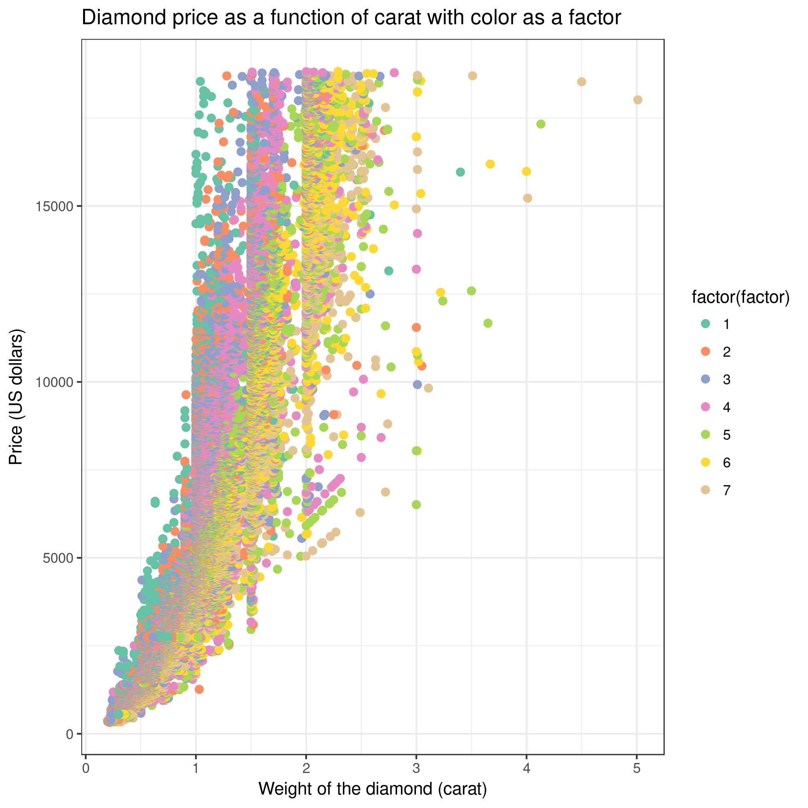

# Introduction


This training will demonstrate how to reproduce analyses performed in the Galaxy framework. Before we start with the hands-on part, we would like to give you some information about Galaxy.

Galaxy is a scientific workflow, data integration and data analysis and publishing platform. Galaxy is an open-source platform for accessible, reproducible, and transparent computational research. While Galaxy was started to allow non-bioinformaticians to analyze DNA sequencing data, it nowadays enables analysis tasks of many different domains including machine learning, ecology, climate science and  omics-type of analyses. Galaxy is easy to use because it is accessible via a web-browser and provides a graphical user interface which enables access to pre-installed tools and large computational resources. In Galaxy, all analyses are stored in so-called histories. The history keeps track of all the tools, tool versions and parameters that were used in the analysis. From such a history, a workflow can be extracted; this workflow can be used to easily repeat the analysis on different data. Both, histories and workflows, can either be shared privately with colleagues or publicly, for example as part of a published manuscript.

For more background information about Galaxy, have a look into the Galaxy publication (). In depth technical details about technologies that enable reproducible analyses within Galaxy are described in .

> <agenda-title></agenda-title>
>
> In this tutorial, we will cover:
>
> 1. TOC
> {:toc}
>
{: .agenda}


# What does Galaxy look like?

Many different Galaxy servers exist. Some are public, some are private, some focus on a specific topic and others like the usegalaxy.\* servers cover a broad range of tools. To reproduce published results it is highly recommended to use the same Galaxy server that was used in the original study. In the case that this was a private server that is not accessible to you, you might want to use one of the main Galaxy servers: [usegalaxy.org](https://usegalaxy.org), [usegalaxy.eu](https://usegalaxy.eu), [usegalaxy.org.au](https://usegalaxy.org.au). To learn more about the different Galaxy servers visit the [slides: options for using Galaxy]({{site.baseurl}}/topics/introduction/tutorials/options-for-using-galaxy/slides.html#1). The particular Galaxy server that you are using may look slightly different than the one shown in this training. Galaxy instance administrators can choose the exact version of Galaxy they would like to offer and can customize its look to some extent. The basic functionality will be rather similar across instances, so don’t worry! In this training we will use the European Galaxy server on which the original analysis was performed and shared.


> <hands-on-title>Log in or register</hands-on-title>
> 1. Open your favorite browser (Chrome/Chromium, Safari or Firefox, but not Internet Explorer/Edge!)
> 2. Browse to the [Galaxy Europe instance](https://usegalaxy.eu/) (recommended) or to a Galaxy instance of your choosing
> 3. Choose *Login or Register* from the navigation bar at the top of the page
> 4. If you have previously registered an account with this particular instance of Galaxy (user accounts are *not* shared between public servers!), proceed by logging in with your registered *public name*, or email address, and your password.
>
>    If you need to create a new account, click on *Register here* instead.
>
{: .hands_on}


The Galaxy interface consists of three main parts:

1. The available tools are listed on the left
2. Your analysis history is recorded on the right
3. The central panel will let you run analyses and view outputs


# Create a history and load data into it

Each analysis in Galaxy starts by creating a new analysis history and loading data into it. Galaxy supports a huge variety of data types and data sources. Different ways of bringing data into Galaxy are explained [here]({{site.baseurl}}/topics/galaxy-interface/tutorials/get-data/slides.html#1). To reproduce published results, the data needs to be loaded from the public repository where the authors have deposited the data. This is most often done by importing data via a web link.


> <hands-on-title>Create history</hands-on-title>
>
> 1. Make sure you start from an empty analysis history.
>
>    
>
> 2. **Rename your history** to be meaningful and easy to find. For instance, you can choose **Reproduction of published Galaxy results** as the name of your new history.
>
>    
>
{: .hands_on}


> <comment-title>Background about the dataset</comment-title>
> The Iris flower data set, also known as Fisher’s or Anderson's Iris data set, is a multivariate dataset introduced by the British statistician and biologist Ronald Fisher in his 1936 paper ().
> Each row of the table represents an iris flower sample, describing its species and the dimensions in centimeters of its botanical parts, the sepals and petals.
> You can find more detailed information about this dataset on its dedicated [Wikipedia page](https://en.wikipedia.org/wiki/Iris_flower_data_set).
{: .comment}


> <hands-on-title>Data upload</hands-on-title>
>
> 1.  the file `iris.csv` from [Zenodo](https://zenodo.org/record/1319069/files/iris.csv) or from the data library (ask your instructor)
>
>    ```
>    https://zenodo.org/record/1319069/files/iris.csv
>    ```
>
>    
>
> 2. **Rename**  the dataset to `iris`
>
>    
>
> 3. Check the **datatype**
>    - Click on the history item to expand it to get more information.
>    - The datatype of the iris dataset should be `csv`.
>    - **Change**  the datatype *if* it is different than `csv`.
>      - Option 1: Datatypes can be **autodetected**
>      - Option 2: Datatypes can be **manually set**
>
>    
>    
>
> 4. Add an `#iris` tag  to the dataset
>
>    
>
>    Make sure the tag starts with a hash symbol (`#`), which will make the tag stick not only to this dataset, but also to any results derived from it.
>    This will help you make sense of your history.
>
{: .hands_on}

> <details-title>Working with different types of datasets</details-title>
> Some input datasets might need more specialized treatment than explained here.
> A few data types contain more than one subfile. These are uploaded via the composite data function, which is a new tab on the right of regular upload. Then at the bottom set "composite type" to your file format. For each subfile a select box will appear with a description next to it, about which subfile has to be selected where.
> Some workflows require input files as dataset collections, in such cases "Input dataset collection" are shown as input when editing or viewing the workflow in the workflow menu. Collections contain several single dataset of the same type tied together. In case a workflow input requires a collection, you’ll need to build a collection out of your files after uploading them.
> [A specialized training explains how to use collections]({{site.baseurl}}/topics/galaxy-interface/tutorials/collections/tutorial.html).
>
> 
>
> In case you want to run a published Galaxy workflow on your own data, you can find explanations about the options to upload your own data [here](https://training.galaxyproject.org/training-material/topics/galaxy-interface/tutorials/get-data/slides.html#1).
{: .details}


# Import and run a Galaxy workflow

Galaxy workflows may be published either directly via the Galaxy server or on public workflow repositories such as [WorkflowHub](https://workflowhub.eu/). Thus the workflow may be present in one of the three ways:

1. As a .ga file or url link, which needs to be imported into Galaxy
2. As a link from a personal Galaxy server account that needs to be added to the own Galaxy account
3. as a link that directly starts running the workflow in a specific Galaxy server, which is possible via the WorkflowHub website.

This tutorial follows option 1, but options 2 and 3 are no more difficult

> <tip-title>How to run workflows via options 2 and 3</tip-title>
> This is not part of the training, but information in case you received a workflow of interest via way 2) or 3).
>
> **Link from a personal Galaxy**:
> In case you received a link from a personal Galaxy user account
> 1. you need to log into exactly the same Galaxy server from where the workflow link is shared, which should be clear from the start of the link, e.g. "https://usegalaxy.eu/..."
> 2. Click on the link and on the upper right on to the plus symbol (import workflow)
> 3. Continue with Step 2 of the following hands-on box
>
> **Link from WorkflowHub**:
> In WorkflowHub there is an option to directly run a workflow.
> 1. Make sure that you prepared your input data on the same server as specified in the run button.
> 2. Click on "Run on usegalaxy.eu"
> 3. select inputs
> 4. "Run workflow"
{: .tip}

> <hands-on-title>Import and run workflow available as .ga file or link</hands-on-title>
>
> 1. **Import** the workflow either via url directly from [Zenodo](https://doi.org/10.5281/zenodo.5090049) or by uploading the .ga file
>
>    ```
>    https://zenodo.org/record/5090049/files/main_workflow.ga
>    ```
>    
>
> 2. **Start** the workflow by clicking on the run symbol on the last column in the workflow overview list
>
> 3. Select the `iris` dataset as the input dataset.
>
> 4. **Run** the workflow by clicking on `run workflow`
>
>    > <question-title></question-title>
>    >
>    > How many history items do you have after running the workflow?
>    >
>    > > <solution-title></solution-title>
>    > >
>    > > 12, out of which 4 are shown and 8 hidden (at top of history right ander the history name)
>    > {: .solution}
>    {: .question}
>
{: .hands_on}

> <comment-title>Hidden datasets in history</comment-title>
> Some workflow outputs might be considered as not very important intermediate results and are thus marked as getting hidden in the analysis history after they turned green. This makes the history easier to navigate through the main results which are visible in the history. Hidden datasets can be made visible individually by clicking on "hidden" on top of the history and then clicking "unhide" for the individual datasets. To unhide many dataset at once, click "operations on multiple datasets" at the top right of the history; then select all hidden datasets that you would like to unhide, then click "For all selected... unhide dataset".
{: .comment}

By starting the workflow all jobs are sent to the Galaxy cluster for analysis. Sometimes it can take a bit until the datasets show up in your history. The jobs are processed one after the other or in parallel if the same input is used for several steps. Grey means waiting to run, yellow means running and green means finished. Red means there was an error.



> <comment-title>The tool stays grey</comment-title>
> This scenario will likely not happen with this training analysis, but might happen with a real workflow. The tool runs are scheduled on the computing infrastructures according to their consumption of cores and memory. Thus, tools that are assigned lots of cores and/or memory need to wait until an appropriate computing spot is available. Several Galaxy server display the current computational load which gives you an idea how busy it currently is.
{: .comment}

Each dataset that turns green can already be inspected even though later datasets are still running. The second part of the training will focus on how to inspect datasets in a history.


# Inspecting the analysis history

Each history item represents one file or dataset, except when collections are used. History items are numbered, duplicates are not possible because any type of dataset manipulation will automatically generate a separate dataset in the history. Some tools produce several output files and therefore the number of history items can be larger than the number of steps in a workflow. Dataset names in the analysis history are not relevant for the tool run, therefore they can be adjusted in order to make the history easier to understand. The default name of a history item is composed of the tool name that was run and the history item number(s) of the input file(s), e.g. 'Unique on data 5'

> <hands-on-title>Inspect history</hands-on-title>
>
> 1. **Vizualize** the two scatter plots by clicking on their eye icons (view data)
>
>    
>
> 2. **Show** all datasets by clicking on `hidden` on top of your history, right below the history name
>
> 3. **Compare** the `Convert csv to tabular` file with the `Datamash` file side by side using the scratchbook
>
> 4. **Track** how the `Datamash` results where obtained by clicking on the `Datamash` item in the history and then on its `i` icon (view details). The performed operations can be found in the section `Tool parameters`
>
>    > <question-title></question-title>
>    >
>    > 1. What are the different Iris species?
>    > 2. How many lines has the `Convert csv to tabular` file?
>    > 3. Which column was grouped in during the Datamash operation?
>    > 4. Which column of the `Remove beginning` file contains sepal length and which petal length?
>    >
>    > > <solution-title></solution-title>
>    > >
>    > > 1.  The 3 different Iris species are:
>    > >     - setosa
>    > >     - versicolor
>    > >     - virginica
>    > >
>    > > 2. 151 lines (by clicking on the file one can see the line count under its name)
>    > >
>    > > 3. Column 5 (details of Datamash tool: Group by fields - 5)
>    > >
>    > > 4. Column 1 and 3 (the dataset was generated by removing the header line from data 2, thus the content of the columns is the same as in data file 2)
>    > >
>    > {: .solution}
>    {: .question}
>
{: .hands_on}

If you got the same answers as written in the above solution box, then congratulations! You have imported and fully reproduced the results of a previous analysis.

However, sometimes you may wish to do more, like...

# Manipulating the analysis

Maybe you are interested in changing some of the original tool parameters and see how this changes the result. The parameter changes can be either done inside the workflow editor, which makes it easy to change many parameters at once (training on [Using Workflow Parameters](https://training.galaxyproject.org/training-material/topics/galaxy-interface/tutorials/workflow-parameters/tutorial.html)) or directly in the history. To repeat a single analysis step with new parameters this can be done directly in the Galaxy history with the `re-run` option.

> <hands-on-title>Manipulate the analysis steps</hands-on-title>
>
> 1. **Rerun** the Scatterplot to plot Sepal length vs. Petal length
>
>    
>
>   - *"Column to plot on x-axis"*: `1`
>   - *"Column to plot on y-axis"*: `3`
>
{: .hands_on}


# Additional Exercise: Import a published analysis history and explore it

Often not only workflows and raw data are published, but also the full Galaxy histories. These histories can either be inspected via their provided link, or imported in order to enable manipulating them in your own Galaxy account.

> <hands-on-title>Importing a history</hands-on-title>
>
>
> 1.  a published history shared via an EU Server account
>
>    ```
>    https://usegalaxy.eu/u/annefou/h/galaxy101-for-everyone-diamond-dataset
>    ```
>
>    
>
{: .hands_on}

The `diamonds` dataset comes from the well-known [ggplot2](https://ggplot2.tidyverse.org/reference/diamonds.html) package developed by Hadley Wickham and was initially collected from the Diamond Search Engine in 2008.
The original dataset consists of 53940 specimen of diamonds, for which it lists the prices and various properties.
For this training, we have created a simpler dataset from the original, in which only the five columns relating to the price and the so-called 4 Cs (carat, cut, color and clarity) of diamond characteristics have been retained. The same workflow as before was used to re-analysis this second dataset and create the analysis history, which highlights the re-usability of workflows across inputs.

> <comment-title>The 4 Cs of diamond grading</comment-title>
> According to the [GIA's (Gemological Institute of America) diamond grading system](https://4cs.gia.edu/wp-content/uploads/2013/03/All-Scales.jpg)
> - **Carat** refers to the weight of the diamond when measured on a scale
> - **Cut** refers to the quality of the cut and can take the grades *Fair*, *Good*, *Very Good*, *Premium* and *Ideal*
> - **Color** describes the overall tint, or lack thereof, of the diamond from colorless/white to yellow and is given on a letter scale ranging from D to Z (D being the best, known as colorless).
> - **Clarity** describes the amount and location of naturally occuring "inclusions" found in nearly all diamonds on a scale of eleven grades ranging from *Flawless* (the ideal situation) to *I3* (Included level 3, the worst quality).
{:.comment}

> <question-title></question-title>
>
> 1. What are the different Cut categories?
> 2. How many lines has the `diamonds.csv` file?
> 3. Is the color an important factor for the Diamond price?
>
> > <solution-title></solution-title>
> >
> > 1.  The 5 different Cut categories are:
> >     - Fair
> >     - Good
> >     - Ideal
> >     - Premium
> >     - Very Good
> >
> > 2. 53940 lines (by clicking on the file one can see the line count under its name)
> >
> > 3. We can create a new scatter plot and use color as a factor (Advanced, column differentiating the different groups: 3). Then, holding carat weight constant, we see on
> > the scatter plot that color is linked to the price of the diamond. So color also explains a lot of the variance found in price!
> > 
> >
> {: .solution}
{: .question}

# Conclusion


 Well done! You have just reproduced your first analysis in Galaxy.
