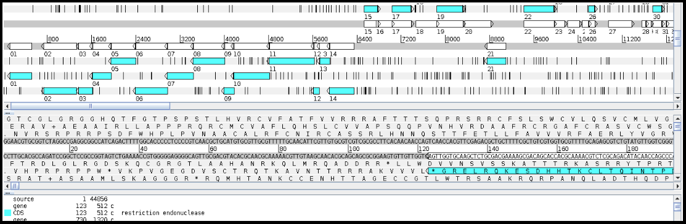
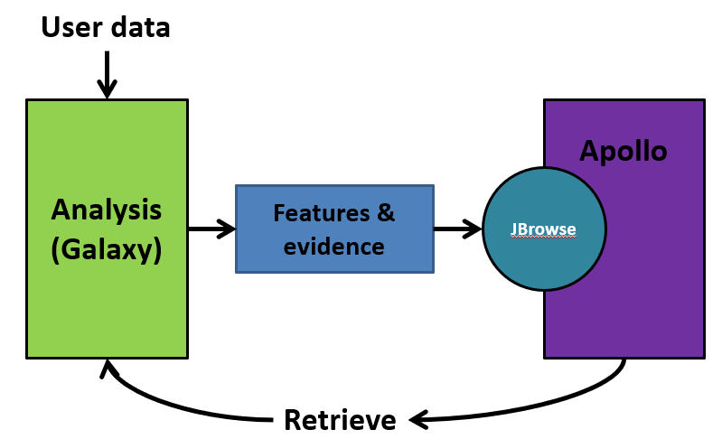
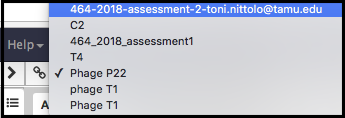
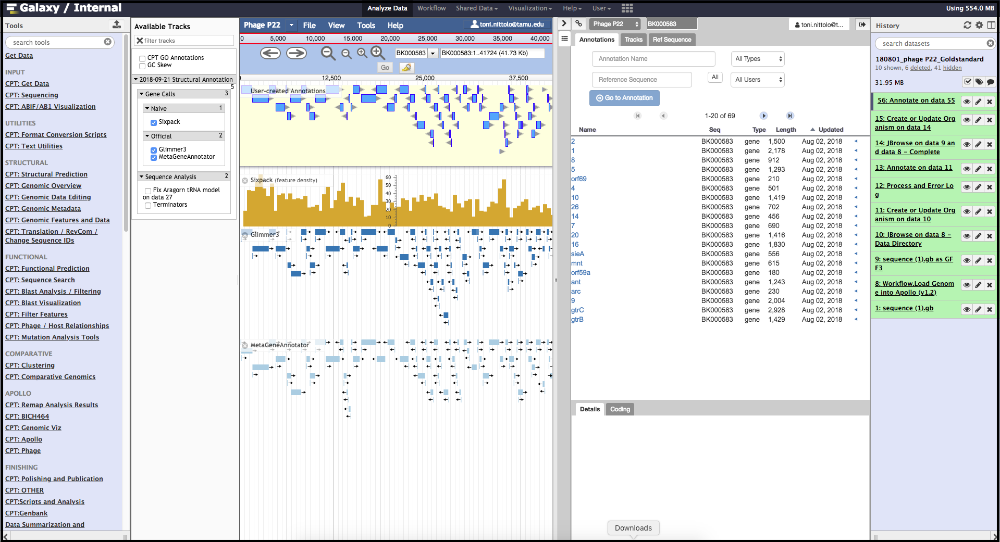

# Getting Started With Apollo
{:.no_toc}

The Center for Phage Technology Galaxy program is an instance of the Galaxy Project, and provides a web interface for bioinformatics tools. Apollo, a genome browser, can be accessed through Galaxy to view, edit, and annotate genomes.

> ### Agenda
>
> In this tutorial, you will find:
>
> * Background Information
>    > * History of Genome Browsers
>    >    > 1. GBrowse
>    >    > 2. JBrowse
>    >    > 3. Apollo
>    >    > 4. Stand-alone browsers: Artemis
> * Annotation Within Apollo
>    > * The Galaxy-Apollo Bridge 
>    > * Navigating Through Apollo
{: .agenda}

# Background Information

Although it is not the first genome browser, Apollo is the first collaborative genomic annotation editor available solely on the Internet. Apollo is still under development and new features are being added all the time.

## Important Definitions 
> * **Static:** Unmodifiable, specifically in the context of a computer resource that you are accessing. The website that you see cannot be modified by you, the user accessing them. This is opposed to “dynamic” where you can interact with the files or service, and your interactions can persist.
> * **Instance:** A specific copy of a web service made available over the internet. Given that the administrators can run many copies of the same web service, we use the term “instance” to refer to a specific copy of a service.
> * **Tracks:** In Apollo, a track is a set of analysis results that can be shown or hidden depending on the annotator’s needs. All tracks are stored in a file format that allows them to be aligned to the organisms's DNA sequence.
> * **Evidence:** Tracks contain evidence; these are results of specific computer methods (which are documented and citable), which we use to make annotations. Annotations should not be made without evidence. Evidence allows us to move the annotation process from an art to a science.
> * **Feature:** Conceptually, a feature is any defined and named region of a genome. Features could be genes, conserved domains, promoter binding sites, terminators, intron splice sites, or any other region of interest. Visually, a features appear as rectangular boxes in Apollo.
> * **Annotations:** Annotation is the addition of descriptive features to a DNA sequence, such as a protein’s function, or locating tRNAs, and terminators. The annotation process we do is 100% computer based, so keep in mind that until an annotation is experimentally tested in the lab, it is putative or assumed based on an educated hypothesis.

## History of Genome Browsers

This section will cover a bit of history about Genome Browsers. While not useful to the annotation process, it is important to know what the terms mean and how the parts all fit together, so that the developers and annotators can have a common language.

We use a lot of software under the umbrella term of GMOD, the [Generic Model Organism Database.](http://www.gmod.org/wiki/Main_Page “Generic Model Organism Database”)

GMOD is a collection of open source software for maintaining Model Organism Databases (MODs). Having a common platform for MODs is important, as historically individual labs spent effort building their own, custom organism databases, and then faced challenges trying to interoperate with other databases. With GMOD and the associated tools, software that talks to one MOD can be re-used when talking to another MOD. We can use the same tools to work with the CPT’s Phage Database as people use to access data in Yeast genome databases.

### 1. GBrowse

One of the earlier genome browsers, GBrowse did *not* support annotation. Think of it like the old Yahoo-maps. Instead of just clicking and dragging the map, you had to click where you wanted to go, wait a few seconds, and the new map would be displayed. It makes the process tedious.

### 2. JBrowse

JBrowse is used in Galaxy workflows for genome visualization. JBrowse is a more modern re-implementation of GBrowse. JBrowse is much more like Google Maps (or any other current web map service); you click and drag and can quickly browse around the genome, turning evidence tracks on and off where relevant. Many labs have deployed JBrowse instances to help showcase their annotation efforts to the community, and to make their data accessible. FlyBase has produced a demo in JBrowse, displaying *Drosophila melanogaster*. Note that JBrowse is a **_static_** visualization tool. You cannot make any changes to the data, and you cannot make annotations and save them. It is a “Read Only” view of genomes and annotations.

### 3. Apollo

Apollo takes JBrowse one step further and adds support for community annotation; it provides a “Read+Write” view of genomes. You can create new annotations on new gene features, and these are shared with everyone who has access to the Apollo server. From a computer perspective, Apollo embeds a copy of JBrowse. For the annotation workflow, we will use both Apollo and JBrowse.

### 4. Stand-alone tools: Artemis

Many genome browsers and annotators are installed and store thier data on your local computer. Artemis, produced by the Sanger Institute, is a powerful and freely-available desktop-based genome browser and annotation tool. Artemis is written in Java and so it can be run on Windows, Mac, and Linux-based systems.  Artemis provides a three-pane view consisting of a high-level overview of the genome, a DNA-level view, and a list of all the features in the genome. Unlike Apollo, all data is only stored on your local device. 

Artemis is capable of adding, deleting and editing genome features and annotations, and also has limited ability to edit DNA sequence directly. Features are not added from evidence tracks but may be entered by the user directly, which allows for great flexibility but also means that evidence for each annotation is not tied to the record itself. 

In BICH 464, we will not be using Artemis for the annotation of your genomes.  However, Artemis is useful for viewing genomes retrieved from the public databases such as NCBI GenBank. Artemis is able to directly read GenBank-formatted files downloaded from the internet.  As needed, Artemis may be used on an individual basis later in the course. Our primary tool in BICH 464 is the Apollo interface.

# Annotation Within Apollo

Continuing on to Apollo, this section will cover the relationship between Galaxy and Apollo and the general layout of the Apollo window. 

## The Galaxy-Apollo Bridge

We will be using Galaxy and Apollo extensively in this course and it is important to understand the relationship between these platforms. Apollo is *not* just another tool or workflow in Galaxy. Apollo is a separate, stand-alone program that specializes in the display and editing of JBrowse datasets. The CPT has developed a tool called JBrowse-in-Galaxy (JiG), which can build JBrowse instances within Galaxy and then export them into Apollo where they can be accessed by the user. The conversion of your genome and its associated data into an Apollo-compatible JBrowse instance is carried out by several tools in the provided annotation workflows. 

JiG essentially sends a "snapshot" of your organism to Apollo, where you can add, remove or edit feature annotations. The changes you make in Apollo are maintained within a separate database and will not appear in Galaxy until you intentionally retrieve your data. The retrieved data can then be used to conduct further analyses in Galaxy, and then sent *back* into Apollo using the same JiG tools; as the course progresses, your organism's JBrowse instance will accumulate more and more data via this process.

Apollo uses the concept of *Organisms* with each organism having one or more *reference sequences* below it. Some organisms such as eukaryotes might have multiple reference sequences associated with them, which would correspond to multiple chromosomes. For your phage annotation project, **each organism will only have a single reference sequence.** 

## Navigating Through Apollo

As depicted above, Apollo will present a two-pane display, surrounded by the Galaxy Tools and History columns on the left and right, respectively. On the left is an embedded JBrowse instance, and on the right is the Apollo annotator panel. JBrowse as embedded in Apollo is *slightly* different than a normal JBrowse; however, the movement controls are all the same:
> * the magnifying glasses will zoom in (+)/out (-) of the genome and its data.
> * the arrow icons will move upstream/downstream along the genome.
> * clicking/dragging on the red outlined box on the genome ruler (light grey box toward the top of the page, 0bp; 12,500 bp; 25,000 bp; etc.) will move to specific regions.
> * clicking/dragging anywhere else on the genome ruler will allow movement and zooming into that specific region.

> ###  Maximizing Screen Space
> Having the gene tracks on in combination with the Apollo panel and the Galaxy columns can be overwhelming and distracting from the annotation. 
> * Small arrows in the bottom right corner of the History column and in the bottom left corner of the Tools column can be toggled to collapse the Galaxy columns and further expand the Apollo annotation screen. 
> * Clicking the arrow near the top right corner of the Apollo panel will close the right pane. 
> Display of the Available Tracks column on the left can be toggled by clicking the menu/hamburger icon on the right upper side.
> * The width for both side panels in Apollo can be adjusted by clicking and dragging the edge of the panel. 
> * Additionally, zooming down to the single gene level can greatly assist in focusing on annotation. 
{: .tip}

### Genome Selector
In the Apollo panel on the right, there is a drop-down menu called the Genome Selector, and it will list all organisms available to the account in use.

### User Created Annotations Track
The pale yellow track that is visible across the screen below the navigation controls is the *User Created Annotations* track. The called genes and other features exist here, so this is where you will be spending much of your time. This track (and the entire annotator panel) is a linear representation of the organism reference sequence, starting with the first base on the left and the last base on the right. Since gene features will be added to this track and edited, this track will *always* be visible. When you export data from Apollo back into Galaxy, only the features and data in this track will be retrieved. All changes you make to this track are automatically and immediately saved in Apollo.

### Track Selector
On the left side of the embedded JBrowse instance is a checklist-like column titled “Available Tracks”. Here the evidence tracks currently available for the genome being analyzed are listed. Evidence tracks will appear upon the execution of structural and functional workflows, as well as other custom analyses.

The evidence tracks shown below are from a version of the structural workflow: *SixPack*, *Glimmer3* and *MetaGeneAnnotator* are tools that locate the positions of potential protein-coding genes. Selecting these tracks will display predicted genes below the User-Created Annotations track. These tools were run in Galaxy and their outputs were exported to Apollo via JiG. As you can see, Apollo alows the user to directly view where on the genome features are predicted, and allows a stacked comparison of the outputs of different tools.  

Zooming in below, fine comparison of the evidence tracks is possible. Both the *Glimmer3* and *MetaGeneAnnotatar* evidence tracks have suggested the same feature, and this feature has already been promoted to the yellow User-Created Annotations track. We will cover how to evaluate and make annotations in another tutorial.

> ###  Note that…
> The examples above already have genes called in the User Created Annotations track. This *will not* be the case for your novel phage genome, which will start out with an empty User-Created Annotations track.
{: .tip}

> ###  Enhance Viewing Experience
> The menu bar at the top has useful options, some that aren’t available in “standard” JBrowse. **View** offers helpful adjustments to observing the genome within Apollo
> * “Color by CDS frame” is a popular option during annotation. It colors each coding sequence based on which reading frame it is in.
> * “Show Track label” facilitates annotation by removing the track’s labeling at the far left of the embedded JBrowse window. This allows for annotation of small features near the end of the genome, which would otherwise be hidden by the track label (e.g. “User-created annotations).
> * Once you have created an organism in Apollo, you do not need to go through Galaxy every time you want to view it. Navigate to the main Galaxy page by clicking *Analyze Data* on the top menu par and then click the *Apollo* logo in the top right. This will take you to an all-Apollo window outside of Galaxy. 
{: .tip}

