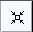

# Using the Integrative Genomics Viewer

**Bioinformatics Galaxy Course**

**MPI-IE & University of Freiburg**

To start IGV, go to the IGV downloads page: https://www.broadinstitute.org/software/igv/download.

## User Interface

## Main Window

**Tool bar** 

- The [tool bar](https://www.broadinstitute.org/software/igv/?q=ToolBar) provides access to commonly used functions. The [menu bar](https://www.broadinstitute.org/software/igv/?q=MenuBar) and [pop-up menus](http://www.broadinstitute.org/software/igv/?q=PopupMenus) (not shown) provide access to all other functions.

**Chromosome** 

- The red box on the chromosome ideogram indicates which portion of the chromosome is displayed. When zoomed out to display the full chromosome, the red box disappears from the ideogram.

**Ruler** 

- The ruler reflects the visible portion of the chromosome. The tick marks indicate chromosome locations. The span lists the number of bases currently displayed.

**Tracks** 

- IGV displays data in horizontal rows called tracks. Typically, each track represents one sample or experiment. This example shows methylation, gene expression, copy number and mutation data.

**Features** 

- IGV also displays features, such as genes, in tracks. By default, IGV displays data in one panel and features in another, as shown here. Drag-and-drop a track name to move a track from one panel to another. Combine data and feature panels by selecting that option on the General tab of the [Preferences window](https://www.broadinstitute.org/software/igv/?q=Preferences).

**Track names** 

- Track names are listed in the far left panel. Legibility of the names depends on the height of the tracks; i.e., the smaller the track the less legible the name.

**Attributes** 

- Attribute names are listed at the top of the attribute panel. Colored blocks represent attribute values, where each unique value is assigned a unique color. Hover over a colored block to see the attribute value. Click an attribute name to sort tracks based on that attribute value.

## Menu Bar

**File**

- Load from File - Displays genomic data from one or more files.

- Load from URL - Displays genomic data from a file identified by URL.

- Load from Server - Displays genomic data from the IGV data server.

- Load from DAS - Displays genomic data from a Distributed Annotation Server (DAS)

- New Session - Unloads all currently loaded data, as if you exited and restarted IGV

- Open Session - Opens a previously saved session file.

- Save Session - Saves your current settings to a named session file

- Save Image - Saves a snapshot of the IGV window to a graphics file, omitting the menu bar and tool bar.  Can save in .png, .jpg, or .svg format.

- Exit - Closes IGV.

**Genomes**

- Load Genome from File - Loads a genome into IGV from your file system.

- Load Genome from URL - Loads a genome into IGV from a web URL.

- Load Genome from Server - Loads a genome into IGV from the IGV data server.

- Create .genome File - Save your genome file in .genome format.

- Manage Genome List - Choose which genomes to display in the genome drop-down menu in the tool bar.

**View**

- Preferences - Opens a tabbed menu of data display preferences.

- Color Legends - Displays color legends for track data, which may be modified.

- Show Name Panel - Shows/hides the track name panel.

- Set Name Panel Width - Resets the track name panel width.

- Show Attribute Display - Shows/hides attributes and attribute values.

- Select Attributes to Show - Shows/hides selected attributes and attribute values.

- Show Header Panel - Shows/hides the chromosome location header panel.

- Reorder Panels - Allows the user to reorder the display panels.

- Go to - View and select loci visited in your navigation history.

**Tracks**

- Sort Tracks - Sorts track data.

- Group Tracks - Groups track data.

- Filter Tracks - Filters track data.

- Fit Data to Window - Sets the track height to display all of the data, or as much data as possible.

- Set Track Height - Sets the track height to a specified value.

**Regions**

- Region Navigator - Opens the region navigator.

- Gene Lists - Opens the gene lists window.

- Export Regions - Saves currently defined regions of interest to a BED file. If no regions of interest are defined, no BED file is created.

- Import Regions - Imports regions of interest from a BED file.

**Tools**

- Run Batch Script - Executes a series of sequential tasks.  Users can load at .txt file that contains a list of commands, one per line, that will be run by IGV.  The accepted commands are the same as the [IGV Port Commands](https://www.broadinstitute.org/software/igv/batch).

- Run igvtools - Launches the igvtools interface window.

- Find Motif - Search for a particular nucleotide sequence in the reference genome.

- Gitools Heatmaps - Data and results are represented as browsable heatmaps. Data can be exported from IGV in gitools format, or loaded directly into a running gitools session. See http://www.gitools.org for details.

- BEDTools - A fast, flexible suite of tools used to compare sets of genomic features. IGV uses BEDTools to compare features in loaded tracks, and view the results as a new track. See more details under [Third Party Tools Integration](https://www.broadinstitute.org/software/igv/third_party_tools#_blank).

**GenomeSpace**

- Load File from GenomeSpace - Load a file into IGV from your GenomeSpace directory.

- Load Genome from GenomeSpace - Load a genome into IGV from your GenomeSpace directory.

- Save Session to GenomeSpace - Save current IGV session to your GenomeSpace directory.

- Load Session from GenomeSpace - Load a previous session from your GenomeSpace directory.

- Logout - Log out of GenomeSpace

- Register - Register a new account at [GenomeSpace](http://www.genomespace.org/)

**Help**

- User Guide... - Displays the IGV [User Guide](https://www.broadinstitute.org/software/igv/UserGuide).

- Help Forum... - In your default web browser, opens the home page for the [igv-help forum](https://groups.google.com/forum/#!forum/igv-help).

- About IGV - Displays IGV version and build number.

## Tool Bar

**Genome drop-down box** 

- Loads a genome.

**Chromosome drop-down box** 

- Zooms to a chromosome.

**Search box** 

- Displays the chromosome location being shown.
To scroll to a different location, enter the gene name, locus, or track name and click Go.

**Whole genome view** 

- Zooms to whole genome view.

- Moves backward and forward through views of the genome like the back and forward buttons in a web browser.

**Refresh** 

- Refreshes the display.

**Define a region** 

- Defines a region of interest on the chromosome.

- Reduces the row height on all tracks to fit all data for the region in view into the window; will also expand tracks (to their maximum preferred size) to fill the view, if needed.

- Toggles the pop-up information windows in IGV on or off.

**Zoom slider** 

- Zooms in and out on a chromosome.

## Pop-up Menus

To select tracks and display the pop-up menu, do one of the following:

- Right-click a track to select it and display the pop-up menu.

- Right-click an attribute value to select all tracks with that attribute value and display the pop-up menu. Tip: Keep in mind that right-clicking an attribute may select tracks that are not visible in the data panel. Scroll down the data panel to view all the selected tracks.

- Control-click track names (Mac: Command-click) to select the tracks, then right-click one of the selections to display the pop-up menu.

Commands in the track pop-up menu change the display options for the selected tracks. Most changes made via the pop-up menu are lost when you exit IGV unless you [save the session](https://www.broadinstitute.org/software/igv/Sessions). In a few cases, changing the pop-up menu also changes an option in the Preferences window; these changes are persistent.

## Using IGV: Examples

### LOOKING AT ENCODE RNA-SEQ DATA

- Open IGV (.igv.sh from command line)

- Load the human genome :  In the toolbar, Click Genome > Load Genome from Server > Search and select Human (hg19)

- Load the encode RNA-Seq BAM files: Go to File > Load from ENCODE > Select C2C12 RNA-Seq BAM files (See image in the Pdf)

- Go to your favorite location in the genome by entering the location in the Search box, zoom in to the reads by using Zoom button.

- You can change the track properties by right-click on the track. Select View as pairs to see the left and right pairs of paired-end reads.

- You can make a sashimi plot to see reads aligning to each junction. Right-click > Sashimi plot.

- Save what you see by going to File > Save Image.

### LOOKING AT ENCODE ChIP-Seq DATA

- Go to File > Load from ENCODE > Select C2C12 ChIP-Seq bigwig files

- Reset the track heights to make them comparable. Right click on the track > Set data range. Then change the scale.

- You can also change the track colors, name and chart type (line,bar,heatmap).

- Save the image (File > Save Image)

## POPULAR FILE FORMATS THAT YOU CAN LOAD IN TO IGV

-  BAM

-  BED

-  BedGraph

-  bigBed

-  bigwig

-  FASTA

-  GFF/GTF

-  MAF

-  SAM/BAM

-  VCF

-  PSL

-  Narrowpeak

-  Many more

## SOME OTHER THINGS YOU CAN DO
 - Take multiple images from regions in a bed file. First make a batch file from the bed file using bedtools (bedtoIgv). Then load the script in Tools > Run Batch Script.

- Find a given motif. Tools > Find Motif.

- Set startup preferences. View > preferences.

- For more, have a look at the IGV documentation.

## FOR IGV HELP AND DOCUMENTATION

**GOTO: https://www.broadinstitute.org/igv/ or Click on Help in IGV menu.**
