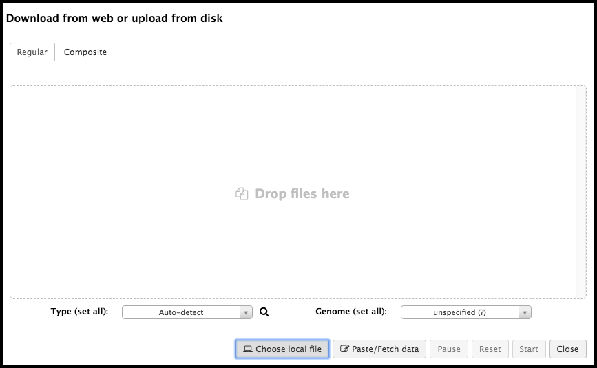
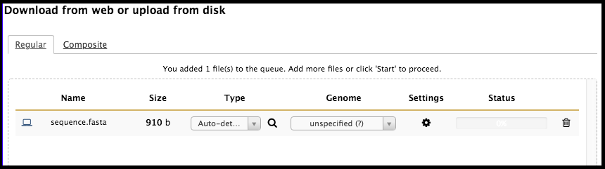
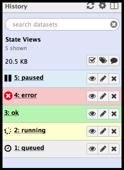
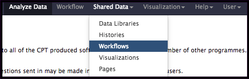

# Galaxy at the Center for Phage Technology

Galaxy is a platform for doing reproducible bioinformatics research. It provides a friendly interface to a vast number of complex command line tools, and it encourages consistent science by using identical software and interfaces across all Galaxy instances. Galaxy aims to make computational biology accessible to research scientists that may not have computer programming or system administration experience. The [Center for Phage Technology (CPT)](https://cpt.tamu.edu/) utilizes Galaxy for most computer-based analysis. Long-running jobs can be launched while a scientist returns to their lab work; meanwhile, Galaxy keeps track of the progress of the analysis and automatically saves the work done up until that point.

The Galaxy interface consists of three panels; on the left (boxed in blue) is a column containing all available tools. In the center (boxed in purple) is where analysis will occur and results displayed. On the right (boxed in red) is where the current history resides.

> ###  Note that…
> If the user is lost within the browser interface, clicking **Analyze Data** in the blue bar at the top will return the user to the Galaxy home page. Refreshing the page will also return one to the home page without losing any work done up until that point. Galaxy automatically saves all progress.
{: .tip}

> ### Agenda
>
> In this tutorial, the following Galaxy characteristics will be reviewed:
>
> 1. Tools
>    > * Uploading Data
>    > * Choosing and Executing a Tool
> 2. Histories
>    > * The Current History
>    > * History Information
>    > * Datasets
>    > * Managing Datasets Individually
>    > * Switching Histories
> 3. Workflows
>    > * Importing a Workflow
>    > * Running a Workflow
>
{: .agenda}

# Tools

> ###  What is a Galaxy Tool?
>    > ###  A Galaxy tool is…
>    > … a bioinformatic program (usually a script) that generates/transforms data. Within Galaxy, tools are simple interfaces to the complex software behind them. Some examples of a tool would be Gene Caller, which reads the genome and produces a list of possible gene locations, or BLAST, which searches protein sequences in the genome against a database.
>    {: .solution}
{: .question}

## Obtaining Data

### Uploading data from external sources

Nearly all Galaxy tools process input files and produce output files. To upload data from the user’s local device, click on the upload symbol in the top right-hand corner of the Tools column on the left side of the screen.

This will bring up an upload menu that will allow the import of data into Galaxy. Files can be dragged and dropped into this box; alternatively, clicking on **Choose local file** in the bottom menu enables the browsing of files on the local device for upload.

> ###  Advanced Users…
> * **Choose FTP file** allows one to select a file that has been previously uploaded via FTP. *This is required for files >2GB*.
> * **Paste/Fetch data** allows one to paste in a bit of text or a URL. Galaxy will import that into the history panel on the right.
> * [This tutorial](https://galaxyproject.github.io/training-material/topics/introduction/tutorials/galaxy-intro-ngs-data-managment/tutorial.html) offers many different examples of various means of uploading data into Galaxy.
{: .comment}

Once the file has been detected by Galaxy, it will appear in the upload window.

> ###  File Format Issues?
> If Galaxy does not detect the file type properly, the user can set the file type. Although it is a rare occurrence, be sure to double check the file is formatted properly before overriding Galaxy.
{: .tip}

When all of the files desired to be uploaded have been selected, click **Start** in the bottom right of the upload menu. The dataset will indicate to you that it is uploaded in the upload window by yielding a 100% status; at this time, the window can be closed. In the history column, the freshly uploaded dataset will be grey with a clock symbol…

… followed by green when it is ready.

> ###  Getting data from other places in Galaxy

>Sometimes, the data you want to use has already been uploaded to Galaxy by another user or by one of the administrators. In this case, you can move data directly into your active histroy from within Galaxy, rather than downloading it to your own computer and then re-uploading it to Galaxy.

>**Data libraries** are stored files that are accessible to users of a Galaxy instance. These are usually set up as "one-way" data storage: users can download data to their computer or import data into a Galaxy history, but cannot upload data to a data library without administrator permission. These are useful for storing and sharing data that many users may want to access, such as raw sequencing data or assembled genomes.

>Data libraries are accessible under the *Shared Data* menu on the Galaxy top menu bar. Data libraries are arranged as directories (folders) that contain subdirectories (subfolders) and/or files. Entire folders or individual files may be imported by checking the box(es) to the left of the desired file(s) and clicking on the *To History* or *Download* buttons at the top of the screen.

>**Published histories** are regular Galaxy histories that a user has decided to share with other Galaxy users. Published histories are accessible under the *Shared Data* menu on the Galaxy top menu bar, and are presented as simply a flat list of all published histores and the user that created them. Clicking on a history will allow the user to view it. To actually use the datasets in the published history, click on *Import history* at the top right of the screen. Importing the history creates a *copy* of the history under your own account; any changes you make will not be visible to other users (unless you decide to publish them), and you will not be able to see any changes the original publisher makes to the history (unless you re-import it).
{: .tip}

## Choosing and Executing a Tool

There is now data in Galaxy that is ready to be processed by one of many available tools! At the top of the tool panel is a search bar. Alternatively, clicking one of the bold, underlined selections will reveal multiple tools of a certain type which the user can choose from. When selecting the tool, be sure to read the *What it does* text at the bottom of the tool interface page that appears; it will give the user important information regarding running the tool and its output format.

Review the options in the tool interface. Keep in mind that many options are set to default values. Uploaded files or other datasets in the current history can be used as inputs. When configuration of the tool is complete, **execute it**, and it will appear as a set of output files in the history on the right.

# Histories

When data is uploaded from your computer or analysis is done on existing data using Galaxy, each output from those steps
generates a dataset. These datasets (and the output datasets from later analysis on them) are stored by Galaxy in
**Histories**.

## The Current History

All users have one 'current' history, which can be thought of as **a workspace or a current working directory** in
bioinformatics terms. Your current history is displayed on the right hand side of the main 'Analyze Data' Galaxy page in
what is called the history panel.

The history panel displays output datasets in the order in which they were created with the oldest/first shown on the
bottom. As new analyses are done and new output datasets are generated, the newest datasets are added to the top of the
the history panel. In this way, the history panel displays the history of your **analysis over time**.

**Users that have registered an account and logged in can have many histories** and the history panel allows switching
between them and creating new ones. This can be useful to organize different analyses.

### Current history controls

Above the current history panel are three buttons: the refresh, history options, and 'view all histories' button.

> * The refresh button  will entirely reload the history being viewed. This can be helpful if you believe the history
interface needs to be updated or isn't updating properly.

> * The history options button  opens the history options menu which allows you to perform history-related tasks.

> * The 'view all histories' button sends you to the interface for managing multiple histories

## History Information

Histories also store information apart from the datasets they contain. They can be named/re-named, tagged, and
annotated. It’s good scientific practice to maintain organized records; this translates to Galaxy histories and datasets. Imagine yourself in three years looking at this history, or sharing it with another user: is it clear what the history contains?

### Renaming a history

All histories begin with the name 'Unnamed history'. Users can re-name histories to provide relevant details on the work they contain, such as the name of the organism and the date of the work:

1. Click the existing name. A text input field will appear with the current name.
2. Entered a new name or edit the existing one the way you'd like.
3. Press 'Enter' to save the new name. The input field will disappear and the new name will display.
4. To cancel renaming, press 'Esc' or **click outside the input field.** If your name is not saving, make sure you press 'Enter' before clicking anywhere outside the box.

### Tagging a history

Tags are short pieces of text used to describe the thing they're attached to and many things in Galaxy can be tagged.
Each item can have many tags and you can add new tags or remove them at any time. Think of them as keywords, as they are searchable. Tags can be another useful way to organize and search your data. For instance, you might tag a history with the type of analysis you did in it: 'assembly' or 'variants'. Or you may tag them according to data sources or some other metadata.

To tag a history:

1. Click the tag button at the top of the history panel. An input field showing existing tags (if any) will appear.
2. Begin typing your new tag in the field. Any tags that you've used previously will show below your partial entry -
  allowing you to use this 'autocomplete' data to re-use your previous tags without typing them in full.
3. Press enter or select one of the previous tags with your arrow keys or mouse.
4. To remove an existing tag, click the small 'X' on the tag or use the backspace key while in the input field.

### Annotating a history

Sometimes tags and names are not enough to describe the work done within a history. Galaxy allows you to create history
annotations: longer text entries that allow more formatting options. Newlines and whitespace are preserved. Later, if
you publish or share the history, the annotation will be displayed automatically - allowing you to share additional
notes about the analysis.

To annotate a history:

1. Click the annotation button at the top of the history panel. A larger text section will appear displaying any
  existing annotation (or, if there's none, italic text saying you can click on the control to create an annotation).
2. Click the annotation section. Then a larger input field will appear.
3. Add any annotations you desire. 'Return'/'Enter' will create a line break and white space is preserved. (Tabs cannot be
  entered since the 'Tab' button is used to switch between controls on the page - tabs can be pasted in however).
4. To save the annotation, click the 'Done' button.

### History size

As datasets are added to a history, Galaxy will store them in files on its file system. The total size of these files
for all the datasets in a history is displayed underneath the history name. For example, if a history has 200 megabytes
of dataset data on Galaxy's filesystem, '200 MB' will be displayed underneath the name.

The CPT Galaxy does not currently set a maximum quota size for users.

## Datasets

Each numbered entry within a history is called a *dataset*. Tool/workflow outputs and data uploads appear as datasets in the current history.

There are several different 'states' a dataset can be in:

1. When you first upload a file or run a tool, the dataset will be in the **queued** state. This indicates that the
  job that will create this dataset has not yet started and is in line to begin.
1. When the job starts the dataset will be in the **running** state. The job that created these datasets is now
  running on Galaxy's cluster.
1. When the job has completed successfully, the datasets will be in the **ok** state.
1. If there's been an error while running the tool, the datasets will be in the **error** state.
1. If a previously running or queued job has been paused by Galaxy, the dataset will be in the **paused** state.
  You can re-start/resume paused jobs using the options menu above the history panel and selecting 'Resume Paused Jobs'.

Datasets can be one of four colors:
> * Grey = the tool has been submitted but has not yet begun processing.
> * Yellow = the tool is currently running
> * Light Blue = the tool is paused
> * Green = a successful execution of the tool
> * Red = a failed execution of the tool

Each dataset entry includes useful metadata. Clicking on the name of a collapsed dataset will open the expanded view.

Near the top, the format is listed as *tabular*. At the bottom of the expanded datasets is a preview of this table. Galaxy keeps track of file formats to ensure only correctly-formatted data is used for tools.

> *  views the dataset in the main window
> *  modifies the metadata
> * **X** deletes a dataset (these can be recovered! See below.)
> *  downloads the dataset to the local device; note that Galaxy will always have a digital copy.
> *  views details about the tool that was run, and how the job was configured.
> *  is commonly used, as it re-runs the tool with the same parameters configured. Additionally, these parameters may be tweaked before re-running.
> *   presents the dataset in different ways. Charts allow the user to build graphs from a tabular dataset, and a Multiple Sequence Alignment (MSA) visualization plugin in Galaxy allows for interactive exploration of MSAs. Note that not all datasets are compatible with this function.
> *  allows for the annotation of datasets with tags. Extremely useful as they are searchable.
> *   allows the user to comment on a dataset; this could be a reminder of why it was executed, or perhaps to annotate interesting results found in the output. Also a searchable field.

> ###  Failed Datasets
> Sometimes tools fail and the output dataset turns red. A red dataset means that the tool has terminated with an error of some kind. If it was part of a **Workflow** (see below) and downstream steps were waiting on the failed dataset, the workflow will not continue, and you may see one or more of the queued datasets remain in the paused (light bue) state.

> Tools may return errors for a number of reasons, some of which the user can correct. Clicking on the name of the failed dataset will open details about the job.
>
> 
>
> A common reason that tools fail is that the user specified an incorrect input dataset or tool parameters. Click on the circular arrow "re-run" button to bring up the tool's original run paramters. Double-check that you selected the correct dataset(s) as input, and that you set any other parameters approriately, and try executing the tool again.
>
> If your inputs are all correct and the tool still fails, there may be a bug in the tool. Selecting the bug icon in the bottom left-hand corner will bring up a page in the main Galaxy interface that provides the error text and a form for reporting the error as a bug. There, a message can be typed and a report submitted to CPT IT. It is always recommended to submit bug reports when jobs fail because it improves the system for all users.
{: .comment}

## Managing Datasets Individually

### Hiding and unhiding datasets

Some procedures in Galaxy such as workflows will often **hide** history datasets in order to simplify the history
and hide intermediate steps of an automated analysis. These hidden datasets won't normally appear in the history panel
but they are still mentioned in the history subtitle (the smaller, grey text that appears below the history name). If your
history has hidden datasets, the number will appear there (e.g. '95 hidden') as a clickable link. If you click this link,
the hidden datasets are shown. Each hidden dataset has a link in the top of the summary view that allows you to unhide
it. You can click that link again (which will now be 'hide hidden') to make them not shown again.

### Deleting and undeleting datasets

You can **delete** any dataset in your history by clicking the delete button. This does not immediately remove the
dataset's data from Galaxy and **it is reversible**. When you delete a dataset from the history, it will be removed
from the panel but (like hidden datasets) the total number of deleted datasets is shown in the history subtitle as a
link. Clicking this link (e.g. '33 deleted') will make the deleted datasets visible and each deleted dataset will have a
link for manually undeleting it above its title. You can click that link again (which will now be 'hide deleted') to
make them not shown again.

### Re-naming Datasets

Click on the  symbol in a dataset. This will bring up some editable fields in the main Galaxy interface.

There, the name of the dataset can be changed, and this new name will appear on the dataset in the history window. It is not recommended to rename every dataset; reserve this attention for key datasets that you will want to return to repeatedly. Additional notes may also be added here. Make sure to click *Save* at the bottom of the window to keep your changes.

## Switching Histories

There are three icons in the top right-hand corner of the History panel. The  will refresh the current history. The  shows advanced history options. The two-panel icon allow you to view and switch between different histories. Clicking on this reveals the different histories.

> ###  Note that…
> Newly created or edited histories are sometimes not displayed in the all histories page after clicking on the two-panel icon. In this case, it is still possible to find them and switch to them by clicking the  icon and selecting Saved Histories. This will display a list of all the user's saved histories.
{: .tip}

On the left is the current history, and all histories on the right are other histories. The **switch to** button will set that history as the current history. At the top left-hand corner is a **done** button, which will exit this view when complete. Any analyses run will be saved in that history.

> ###  Pro tip …
> In the histories view, it is possible to copy datasets between histories.
{: .tip}

> ###  Further Reading
> To learn more about what a user can do with histories and datasets in Galaxy, please reference [this tutorial.](https://galaxyproject.github.io/training-material/topics/galaxy-ui/tutorials/history/tutorial.html)
{: .comment}

# Workflows

> ###  What is a Workflow?
>    > ###  Workflows are…
>    > … merely collections of jobs, where some jobs depend on the outputs of *other* jobs. Workflows solve numerous problems, such as:
>    > * **Running tools immediately.** The next step can begin as soon as data is available; a human does not have to manually start it.
>    > * **Discarding useless data.** In the example below, most likely only the output BLASTp results are desired, and not the storing of intermediate files forever.
>    > * **Simplification of interfaces.** Workflows hide the complexity of many Galaxy tools. The users are often less interested in the extraction of features from a GFF3 file, than they are in the translation of those to protein sequences.
>    {: .solution}
{: .question}

Say a task has been presented, such as follows:
> * Loading data from Apollo
> * Extract all of the genes as DNA sequences
> * Translate said DNA sequences to protein sequences
> * Run those protein sequences through BLASTp

Doing these tasks one by one would mean keeping track of *at least* 4 files. The user would have to wait for one tool to finish before executing the next one. This is where workflows come in handy:

## Importing a Workflow

Often times, a workflow will need to be imported for it to be used. Select the *Shared Data* drop-down menu at the top of the galaxy interface, and Select *Workflows.* This will bring up a page of all of the available workflows in [CPT](https://cpt.tamu.edu) Galaxy.

Find the workflow of interest, select the down arrow, and click *Import.* Each workflow has a short description of what it does on the right, as well as the owner and date of last update. It is advised to use the most recent version of the desired workflow.

The imported workflow will then become available for use under the *Workflow* menu at the top of Galaxy (to the right of *Shared Data.*)

> ###  Advanced Users…
> Unable to find a specific workflow for the project/genome at hand? Read [this tutorial](https://galaxyproject.github.io/training-material/topics/galaxy-ui/tutorials/history-to-workflow/tutorial.html) for more information on building a new workflow.
{: .comment}

## Running a Workflow

In the collection of workflows, click on the down arrow of the desired workflow, and select *Run.*

The workflow interface page will appear; this can feel a little overwhelming, especially as a beginner. For the most part, the parameters are pre-configured. Some inputs may need to be manually adjusted by the user. Ask the [CPT](https://cpt.tamu.edu) staff and IT management (cpt@tamu.edu) if there is confusion about the necessary inputs.

When ready, click the *Run workflow* button at the top to launch the workflow.
