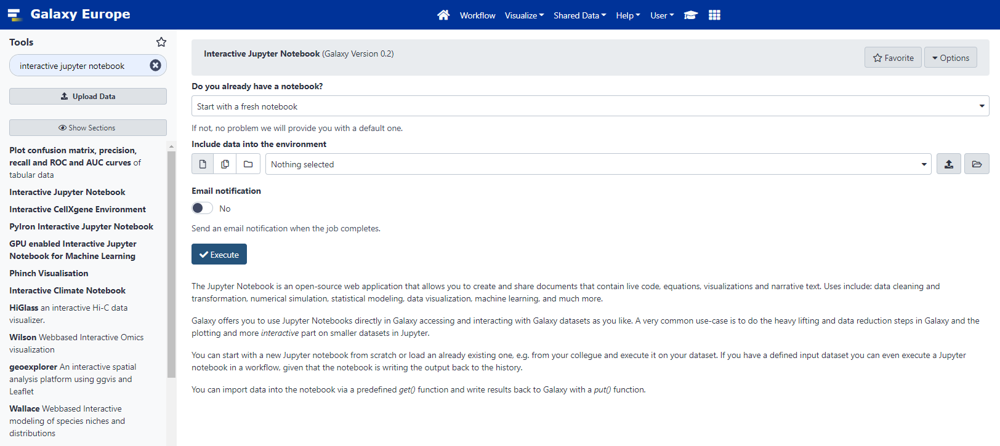
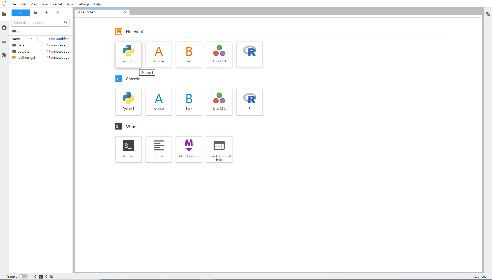
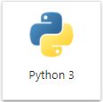
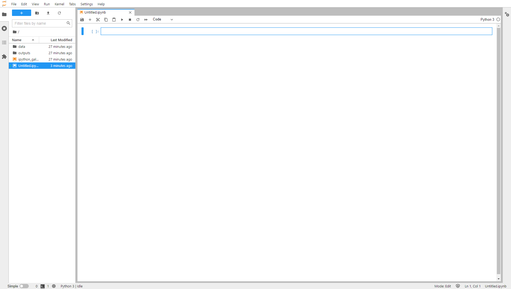
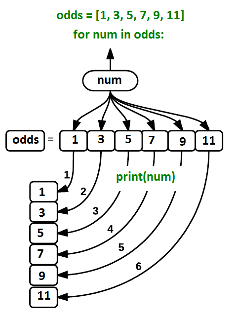
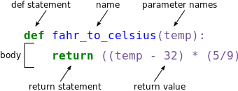
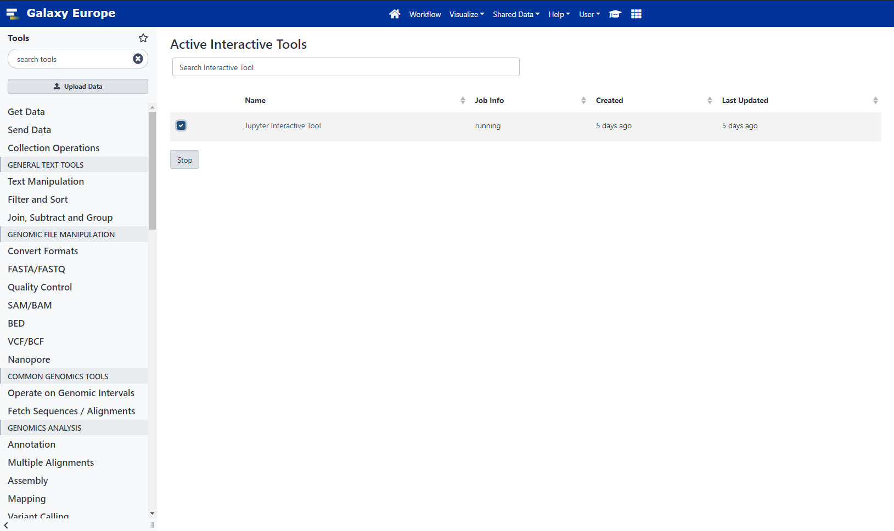

# Introduction

## Comment 
This tutorial is significantly based on the Carpentries courses [Programming with Python](https://swcarpentry.github.io/python-novice-inflammation/) and [Plotting and Programming in Python](https://swcarpentry.github.io/python-novice-gapminder/). 

## Overview
In this lesson, we will be using Python 3 with some of its most popular scientific libraries. We will be using JupyterNotebook, a Python interpreter that comes with everything we need for the lesson. 

Python was developed by Guido van Rossum. Guido van Rossum started implementing Python in 1989. Python is a very simple programming language so even if you are new to programming, you can learn python without facing any issues.

Features of Python language:
1. **Readable**: Python is a very readable language.

2. **Easy to Learn**: Learning python is easy as this is a expressive and high level programming language, which means it is easy to understand the language and thus easy to learn.

3. **Cross platform**: Python is available and can run on various operating systems such as Mac, Windows, Linux, Unix etc. This makes it a cross platform and portable language.

4. **Open Source**: Python is a open source programming language.

5. **Large standard library**: Python comes with a large standard library that has some handy codes and functions which we can use while writing code in Python.

6. **Free**: Python is free to download and use. This means you can download it for free and use it in your application. 

7. **Supports exception handling**: Python supports exception handling which means we can write less error prone code and can test various scenarios that can cause an exception later on.

8. **Automatic memory management**: Python supports automatic memory management which means the memory is cleared and freed automatically. You do not have to bother clearing the memory.


# Launch Jupyter in Galaxy

JupyterLab is a User Interface including notebooks. A user can open several notebooks or files as tabs in the same window, like an IDE. JupyterNotebook is a web-based interactive computational environment for creating Jupyter notebook documents. It supports several languages like Python (IPython), Julia, R etc. and is largely used for data analysis, data visualization and further interactive, exploratory computing. 

JupyterNotebook has several advantages:

- You can easily type, edit, and copy and paste blocks of code.
- Tab complete allows you to easily access the names of things you are using and learn more about them.
- It allows you to annotate your code with links, different sized text, bullets, etc. to make it more accessible to you and your collaborators.
- It allows you to display figures next to the code that produces them to tell a complete story of the analysis.

Each notebook contains one or more cells that contain code, text, or images. Each notebook can be exported (File, Export as, Executable script) as Python script that can be run from the command line.

We will be using JupyterNotebook in Galaxy and as a result you need to frequently save the notebook in the workspace. This is both for good practice and to protect you in case you accidentally close the browser. Your environment will still run, so it will contain the last saved notebook you have.  Furthermore, you need to download a notebook, before you delete or close a notebook in your history or you will lose it. 

Alternatively, you can download Anaconda, that includes JupyterNotebook, following the instructions of the [Anaconda installation page](https://docs.anaconda.com/anaconda/install/) for various operating systems.  

### Hands-on: Launching Jupyter and Creating a notebook

This section describes the steps to launch JupyterLab using Galaxy and is based on the corresponding part of the [Trajectory Analysis using Python (Jupyter Notebook) in Galaxy](https://training.galaxyproject.org/training-material/topics/transcriptomics/tutorials/scrna-JUPYTER-trajectories/tutorial.html) course. Please note: this is only currently available on the [usegalaxy.eu](https://usegalaxy.eu/) and [usegalaxy.org](https://usegalaxy.org/) sites.

1. Type "Interactive Jupyter Notebook Tool" in the tools search bar.  
2. With the default parameters, press Execute.

3. Click on the blue User menu, or go to the top of the screen and choose User and then Active InteractiveTools.
4. Click on the newest Jupyter Interactive Tool. This will launch the Jupyter Lab interface in a new Tab. 

6. Click on the Python3 icon under the Notebook section. 
  
7. A new jupyter notebook is ready and you can continue with the rest of this tutorial.
 
8. Save your file (Click File, then Save, or click the Save icon at the top left).
9. Click on the file in the folder window at the left and rename your file whateveryoulike.ipynb


# Python Fundamentals

## Variables

Any Python interpreter can be used as a calculator:

```python
3 + 5 * 4
```

```Output
23
```
This is great but not very interesting. To do anything useful with data, we need to assign its value to a variable. In Python, we can assign a value to a variable, using the equals sign ```=```. For example, we can track the weight of a patient who weighs 60 kilograms by assigning the value 60 to a variable ```weight_kg```:

```Python
weight_kg = 60
```

From now on, whenever we use `weight_kg`, Python will substitute the value we assigned to it. 

In Python, variable names:

- can include letters, digits, and underscores
- cannot start with a digit
- are case sensitive

This means that, for example:

- `weight0` is a valid variable name, whereas `0weight` is not
- `weight` and `Weight` are different variables


### Types of data

Python knows various types of data. Three common ones are:

- integer numbers
- floating point numbers, and
- strings.

In the example above, variable `weight_kg` has an integer value of `60`. If we want to more precisely track the weight of our patient, we can use a floating point value by executing:

```python
weight_kg = 60.3
```

To create a string, we add single or double quotes around some text. To identify and track a patient throughout our study, we can assign each person a unique identifier by storing it in a string:

```python
patient_id = '001'
```

### Using Variables in Python

Once we have data stored with variable names, we can make use of it in calculations. We may want to store our patient’s weight in pounds as well as kilograms:

```python
weight_lb = 2.2 * weight_kg
```

We might decide to add a prefix to our patient identifier:

```python
patient_id = 'inflam_' + patient_id
```

### Variables Persist Between Cells
Be aware that it is the order of execution of cells that is important in a Jupyter notebook, not the order in which they appear. Python will remember all the code that was run previously, including any variables you have defined, irrespective of the order in the notebook. Therefore if you define variables lower down the notebook and then (re)run cells further up, those defined further down will still be present. As an example, create two cells with the following content, in this order:

```python
print(myval)
myval = 1
```
If you execute this in order, the first cell will give an error. However, if you run the first cell after the second cell, it will print out 1. To prevent confusion, it can be helpful to use the Kernel -> Restart & Run All option which clears the interpreter and runs everything from a clean slate going top to bottom.

### Exercises

1.  What values do the variables `mass` and `age` have after each of the following statements? Test your answer by executing the lines.

    ```python
    mass = 47.5
    age = 122
    mass = mass * 2.0
    age = age - 20
    ```

2.  Python allows you to assign multiple values to multiple variables in one line by separating the variables and values with commas. What does the following program print out?

   ```python
   first, second = 'Grace', 'Hopper'
   third, fourth = second, first
   print(third, fourth)
   ```

3. What are the data types of the following variables?

   ```python
   planet = 'Earth'
   apples = 5
   distance = 10.5
   ```

### Solutions

1. ```Output
   `mass` holds a value of 47.5, `age` does not exist
   `mass` still holds a value of 47.5, `age` holds a value of 122
   `mass` now has a value of 95.0, `age`'s value is still 122
   `mass` still has a value of 95.0, `age` now holds 102
   ```

2. ```Output
   Hopper Grace
   ```

3. ```python
   type(planet)
   type(apples)
   type(distance)
	```
	```Output
   <class 'str'>
   <class 'int'>
   <class 'float'>
   ```


## Lists

Lists are built into the language so we do not have to load a library to use them. We create a list by putting values inside square brackets and separating the values with commas:

```python
odds = [1, 3, 5, 7]
print('odds are:', odds)
```

```Output
odds are: [1, 3, 5, 7]
```

We can access elements of a list using indices – numbered positions of elements in the list. These positions are numbered starting at 0, so the first element has an index of 0.

```python
print('first element:', odds[0])
print('last element:', odds[3])
print('"-1" element:', odds[-1])
```
```Output
first element: 1
last element: 7
"-1" element: 7
```
Yes, we can use negative numbers as indices in Python. When we do so, the index `-1` gives us the last element in the list, `-2` the second to last, and so on. Because of this, `odds[3]` and `odds[-1]` point to the same element here.

There is one important difference between lists and strings: we can change the values in a list, but we cannot change individual characters in a string. For example:

```python
names = ['Curie', 'Darwing', 'Turing']  # typo in Darwin's name
print('names is originally:', names)
names[1] = 'Darwin'  # correct the name
print('final value of names:', names)
```
```Output
names is originally: ['Curie', 'Darwing', 'Turing']
final value of names: ['Curie', 'Darwin', 'Turing']
```

works, but the following does not:

```python
name = 'Darwin'
name[0] = 'd'
```

Lists in Python can contain elements of different types. Example:

```python
sample_ages = [10, 12.5, 'Unknown']
```

There are many ways to change the contents of lists besides assigning new values to individual elements:

```python
odds.append(11)
print('odds after adding a value:', odds)
```
```Output
odds after adding a value: [1, 3, 5, 7, 11]
```
```python
removed_element = odds.pop(0)
print('odds after removing the first element:', odds)
print('removed_element:', removed_element)
```
```Output
odds after removing the first element: [3, 5, 7, 11]
removed_element: 1
```
```python
odds.reverse()
print('odds after reversing:', odds)
```
```Output
odds after reversing: [11, 7, 5, 3]
```

### Mutable vs Immutable data
Data which can be modified in place is called mutable, while data which cannot be modified is called immutable. Strings and numbers are immutable. This does not mean that variables with string or number values are constants, but when we want to change the value of a string or number variable, we can only replace the old value with a completely new value.

Lists and arrays, on the other hand, are mutable: we can modify them after they have been created. We can change individual elements, append new elements, or reorder the whole list. For some operations, like sorting, we can choose whether to use a function that modifies the data in-place or a function that returns a modified copy and leaves the original unchanged.

Be careful when modifying data in-place. If two variables refer to the same list, and you modify the list value, it will change for both variables!

```python
salsa = ['peppers', 'onions', 'cilantro', 'tomatoes']
my_salsa = salsa        # <-- my_salsa and salsa point to the *same* list data in memory
salsa[0] = 'hot peppers'
print('Ingredients in my salsa:', my_salsa)
```
```Output
Ingredients in my salsa: ['hot peppers', 'onions', 'cilantro', 'tomatoes']
```

If you want variables with mutable values to be independent, you must make a copy of the value when you assign it.

```python
salsa = ['peppers', 'onions', 'cilantro', 'tomatoes']
my_salsa = salsa.copy()        # <-- makes a *copy* of the list
salsa[0] = 'hot peppers'
print('Ingredients in my salsa:', my_salsa)
```
```Output
Ingredients in my salsa: ['peppers', 'onions', 'cilantro', 'tomatoes']
```

Because of pitfalls like this, code which modifies data in place can be more difficult to understand. However, it is often far more efficient to modify a large data structure in place than to create a modified copy for every small change. You should consider both of these aspects when writing your code.

### Nested lists
Since a list can contain any Python variables, it can even contain other lists.

For example, we could represent the products in the shelves of a small grocery shop:

```python
x = [['pepper', 'zucchini', 'onion'],
   ['cabbage', 'lettuce', 'garlic'],
   ['apple', 'pear', 'banana']]
```

Here is an example of how indexing a list of lists `x` works:

```python
print([x[0]])
```
```Output
[['pepper', 'zucchini', 'onion']]
```
```python
print(x[0])
```
```Output
['pepper', 'zucchini', 'onion']
```
```python
print(x[0][0])
```
```Output
'pepper'
```

### Slicing
Subsets of lists can be accessed by specifying ranges of values in brackets. This is commonly referred to as “slicing” the list.

```python
chromosomes = ['X', 'Y', '2', '3', '4']
autosomes = chromosomes[2:5]
print('autosomes:', autosomes)
last = chromosomes[-1]
print('last:', last)
```
```Output
autosomes: ['2', '3', '4']
last: 4
```

### Exercises

1. Use slicing to access only the last four characters of a string or entries of a list.
    ```python
    string_for_slicing = 'Observation date: 02-Feb-2013'
    list_for_slicing = [['fluorine', 'F'],
                 ['chlorine', 'Cl'],
                 ['bromine', 'Br'],
                 ['iodine', 'I'],
                 ['astatine', 'At']]
    ```
    ```Output
    '2013'
    [['chlorine', 'Cl'], ['bromine', 'Br'], ['iodine', 'I'], ['astatine', 'At']]
    ```
    Would your solution work regardless of whether you knew beforehand the length of the string or list (e.g. if you wanted to apply the solution to a set of lists of different lengths)? If not, try to change your approach to make it more robust.

    Hint: Remember that indices can be negative as well as positive.

2. So far we’ve seen how to use slicing to take single blocks of successive entries from a sequence. But what if we want to take a subset of entries that aren’t next to each other in the sequence?

    You can achieve this by providing a third argument to the range within the brackets, called the step size. The example below shows how you can take every third entry in a list:

    ```python
    primes = [2, 3, 5, 7, 11, 13, 17, 19, 23, 29, 31, 37]
    subset = primes[0:12:3]
    print('subset', subset)
    ```
    ```Output
    subset [2, 7, 17, 29]
    ```
    Notice that the slice taken begins with the first entry in the range, followed by entries taken at equally-spaced intervals (the steps) thereafter. What if you wanted to begin the subset with the third entry? Use the previous example to write your solution that gives the following output.
    ```Output
    subset [5, 13, 23, 37]
    ```

### Solutions
1. Use negative indices to count elements from the end of a container (such as list or string):

    ```python
    string_for_slicing[-4:]
    list_for_slicing[-4:]
    ```
2. You would need to specify that as the starting point of the sliced range:

    ```python
    subset = primes[2:12:3]
    print('subset', subset)
    ```


## Strings

### Use an index to get a single character from a string.

The characters (individual letters, numbers,and so on) in a string are ordered. For example, the string 'AB' is not the same as 'BA'. Because of this ordering, we can treat the string as a list of characters. Each position in the string (first, second, etc.) is given a number. This number is called an index or sometimes a subscript. Indices are numbered from 0.You can use the position’s index in square brackets to get the character at that position.

```python
atom_name = 'helium'
print(atom_name[0])
```
```Output
h
```
### Use a slice to get a substring.
A part of a string is called a substring. A substring can be as short as a single character. An item in a list is called an element. Whenever we treat a string as if it were a list, the string’s elements are its individual characters. A slice is a part of a string (or, more generally, any list-like thing). We take a slice by using [start:stop], where start is replaced with the index of the first element we want and stop is replaced with the index of the element just after the last element we want. Mathematically, you might say that a slice selects [start:stop). The difference between stop and start is the slice’s length. Taking a slice does not change the contents of the original string. Instead, the slice is a copy of part of the original string.
```python
atom_name = 'sodium'
print(atom_name[0:3])
```
```Output
sod
```
You can use the built-in function `len` to find the length of a string.
```python
print(len('helium'))
```
```Output
6
```
Nested functions are evaluated from the inside out, like in mathematics.

### Exercises
1. What does the following program print?
	```python
	atom_name = 'carbon'
	print('atom_name[1:3] is:', atom_name[1:3])
	```
2. What does `thing[low:high]` do?
3. What does `thing[low:]` (without a value after the colon) do?
4. What does `thing[:high]` (without a value before the colon) do?
5. What does `thing[:]` (just a colon) do?
6. What does `thing[number:some-negative-number]` do?
7. What happens when you choose a high value which is out of range? (i.e., try `atom_name[0:15]`)

### Solutions
1.	```Output
	atom_name[1:3] is: ar
	```
2. `thing[low:high]` returns a slice from low to the value before high
3. `thing[low:]` returns a slice from low all the way to the end of thing
4. `thing[:high]` returns a slice from the beginning of thing to the value before high
5. `thing[:]` returns all of thing
6. `thing[number:some-negative-number]` returns a slice from number to some-negative-number values from the end of thing
7. If a part of the slice is out of range, the operation does not fail. `atom_name[0:15]` gives the same result as `atom_name[0:]`.


### You can use the “+” and “*” operators on strings/lists.

“Adding” character strings concatenates them.

```python
full_name = 'Ahmed' + ' ' + 'Walsh'
print(full_name)
```
```output
Ahmed Walsh
```

Multiplying a character string by an integer "N" creates a new string that consists of that character string repeated N times.

Since multiplication is repeated addition.
```python
separator = '=' * 10
print(separator)
```
```Output
==========
```

The same rules apply for lists. Consider the following example:

```python
counts = [2, 4, 6, 8, 10]
repeats = counts * 2
print(repeats)
```
```Output
[2, 4, 6, 8, 10, 2, 4, 6, 8, 10]
```

It’s equivalent to:

```python
counts + counts
```

Strings have a length (but numbers don’t).The built-in function `len` counts the number of characters in a string.

```python
print(len(full_name))
```
```Output
11
```

But numbers don’t have a length (not even zero). For example, the following command returns an error message.

```python
print(len(52))
```


## Type conversion

Python converts automatically integers to floats, when needed, but you must convert numbers to strings or vice versa when operating on them.
It is not allowed to add numbers and strings. For example `print(1 + '2')` is ambiguous: should `1 + '2'` be `3` or `'12'`?

Some types can be converted to other types by using the type name as a function.

```python
print(1 + int('2'))
print(str(1) + '2')
```

```Output
3
12
```

### Exercises

1. What type of value is 3.25 + 4?

2. In Python 3, the `//` operator performs integer (whole-number) floor division, the `/` operator performs floating-point division, and the `%` (or *modulo*) operator calculates and returns the remainder from integer division:

   ```python
   print('5 // 3:', 5 // 3)
   print('5 / 3:', 5 / 3)
   print('5 % 3:', 5 % 3)
   ```

   ```Output
   5 // 3: 1
   5 / 3: 1.6666666666666667
   5 % 3: 2
   ```

   If `num_subjects` is the number of subjects taking part in a study, and `num_per_survey` is the number that can take part in a single survey, write an expression that calculates the number of surveys needed to reach everyone once.

3. Where reasonable, `float()` will convert a string to a floating point number, and `int()` will convert a floating point number to an integer:
      ```python
      print("string to float:", float("3.4"))
      print("float to int:", int(3.4))
      ```
      ```Output
      string to float: 3.4
      float to int: 3
      ```

      If the conversion doesn’t make sense, however, an error message will occur.
	Given this information, what do you expect the following program to do?

	What does it actually do?

	Why do you think it does that?

	```python
	print("fractional string to int:", int("3.4"))
	```
4. Which of the following will return the floating point number `2.0`? Note: there may be more than one right answer.

    ```python
    first = 1.0
    second = "1"
    third = "1.1"
    ```
    1. `first + float(second)`
    2. `float(second) + float(third)`
    3. `first + int(third)`
    4. `first + int(float(third))`
    5. `int(first) + int(float(third))`
    6. `2.0 * second`
5. Python provides complex numbers, which are written as `1.0+2.0j`. If `val` is a complex number, its real and imaginary parts can be accessed using dot notation as `val.real` and `val.imag`.

    ```python
    complex = 6 + 2j
    print(complex.real)
    print(complex.imag)
    ```
    ```Output
    6.0
    2.0
    ```
	1. Why do you think Python uses `j` instead of i for the imaginary part?
	2. What do you expect `1+2j + 3` to produce?
	3. What do you expect `4j` to be? What about `4 j` or `4 + j`?

### Solutions

1. It is a float: integers are automatically converted to floats as necessary.

2. We want the minimum number of surveys that reaches everyone once, which is the rounded up value of `num_subjects/ num_per_survey`. This is equivalent to performing a floor division with `//` and adding 1. Before the division we need to subtract 1 from the number of subjects to deal with the case where `num_subjects` is evenly divisible by `num_per_survey`.

   ```python
   num_subjects = 600
   num_per_survey = 42
   num_surveys = (num_subjects - 1) // num_per_survey + 1
   
   print(num_subjects, 'subjects,', num_per_survey, 'per survey:', num_surveys)
   ```

   ```Output
   600 subjects, 42 per survey: 15
   ```

3. Python 3 throws an error. If you ask Python to perform two consecutive typecasts, you must convert it explicitly in code.

	```python
	int(float("3.4"))
	```
	```Output
	3
	```
4. Answer: 1 and 4
5. 	1. Standard mathematics treatments typically use i to denote an imaginary number. However, from media reports it was an early convention established from electrical engineering that now presents a technically expensive area to change. 
	2. `(4+2j)`
	3. `4j` and Syntax Error: invalid syntax. In the latter cases, `j` is considered a variable and the statement depends on if `j` is defined and if so, its assigned value.


## Built-in Python functions

To carry out common tasks with data and variables in Python, the language provides us with several built-in functions. To display information to the screen, we use the `print` function:

```python
print(weight_lb)
print(patient_id)
```

```Output
132.66
inflam_001
```

When we want to make use of a function, referred to as calling the function, we follow its name by parentheses. The parentheses are important: if you leave them off, the function doesn’t actually run! Sometimes you will include values or variables inside the parentheses for the function to use. In the case of `print`, we use the parentheses to tell the function what value we want to display. `print` automatically puts a single space between outputs to separate them and wraps around to a new line at the end.

We can display multiple things at once using only one `print` call:

```python
print(patient_id, 'weight in kilograms:', weight_kg)
```

```Output
inflam_001 weight in kilograms: 60.3
```

We can also call a function inside of another function call. For example, Python has a built-in function called `type` that tells you a value’s data type:

```python
print(type(60.3))
print(type(patient_id))
```

```Output
<class 'float'>
<class 'str'>
```

Moreover, we can do arithmetic with variables right inside the `print` function:

```python
print('weight in pounds:', 2.2 * weight_kg)
```

```Output
weight in pounds: 132.66
```

The above command, however, did not change the value of `weight_kg`:

```python
print(weight_kg)
```

```Output
60.3
```

To change the value of the `weight_kg` variable, we have to assign `weight_kg` a new value using the equals `=` sign:

```python
weight_kg = 65.0
print('weight in kilograms is now:', weight_kg)
```

```Output
weight in kilograms is now: 65.0
```


A function may take zero or more arguments.  An *argument* is a value passed into a function. You must always use parentheses, even if they’re empty, so that Python knows a function is being called.

Every function call produces some result. If the function doesn’t have a useful result to return, it usually returns the special value `None`. `None` is a Python object that stands in anytime there is no value.

```python
result = print('example')
print('result of print is', result)
```

```Output
example
result of print is None
```

Commonly-used built-in functions include `max`, `min`, and `round`. `max` and `min` work on character strings as well as numbers. From “larger” and “smaller”, they use the order: (0-9, A-Z, a-z) to compare letters.
```python
print(max(1, 2, 3))
print(min('a', 'A', '0'))
```
```Output
3
0
```
Functions may have default values for some arguments. `round` will round off a floating-point number. By default, it rounds to zero decimal places.
```python
round(3.712)
```
```Output
4
```
We can specify the number of decimal places we want.
```python
round(3.712, 1)
```
```Output
3.7
```

### Functions attached to objects are called methods

Methods have parentheses like functions, but come after the variable. Some methods are used for internal Python operations, and are marked with double underlines.

```python
my_string = 'Hello world!'  # creation of a string object 

print(len(my_string))       # the len function takes a string as an argument and returns the length of the string

print(my_string.swapcase()) # calling the swapcase method on the my_string object

print(my_string.__len__())  # calling the internal __len__ method on the my_string object, used by len(my_string)
```
```output
12
hELLO WORLD!
12
```

You might even see them chained together. They operate left to right.

```python
print(my_string.isupper())          # Not all the letters are uppercase
print(my_string.upper())            # This capitalizes all the letters

print(my_string.upper().isupper())  # Now all the letters are uppercase
```
```output
False
HELLO WORLD
True
```

### Use the built-in function `help` to get help for a function.
Every built-in function has online documentation.
```python
help(round)
```
```Output
Help on built-in function round in module builtins:

round(number, ndigits=None)
    Round a number to a given precision in decimal digits.
    
    The return value is an integer if ndigits is omitted or None.  Otherwise
    the return value has the same type as the number.  ndigits may be negative.
```


## Conditionals

An if statement (more properly called a conditional statement) controls whether some block of code is executed or not.
The first line opens with if and ends with a colon and the block of code to be executed is indented. An example is showed below.

```python
num = 37
if num > 100:
    print('greater')
else:
    print('not greater')
print('done')
```
```Output
not greater
done
```
If the expression that follows the if statement is true, the body of the `if` (i.e., the set of lines indented underneath it) is executed, and `“greater”` is printed. If it is false, the body of the `else` is executed instead, and `“not greater”` is printed. Only one or the other is ever executed before continuing on with program execution to print `“done”`:


Conditional statements don’t have to include an `else`.  If there isn’t one, Python simply does nothing if the expression is false:

```python
num = 53
print('before conditional...')
if num > 100:
    print(num, 'is greater than 100')
print('...after conditional')
```
```Output
before conditional...
...after conditional
```

We can also chain several expressions together using `elif`, which is short for “else if”. The following Python code uses `elif` to print the sign of a number.

```python
num = -3

if num > 0:
    print(num, 'is positive')
elif num == 0:
    print(num, 'is zero')
else:
    print(num, 'is negative')
```
```Output
-3 is negative
```

### Comparison operators in Python
The operators used for comparing values in conditionals are the following:

- `>` : greater than
- `<` : less than
- `==` : equal to
- `!=` : does not equal
- `>=` : greater than or equal to
- `<=` : less than or equal to


### Logical operators in Python
We can also combine expressions using `and` and `or`. `and` is only true if both parts are true:

```python
if (1 > 0) and (-1 >= 0):
    print('both parts are true')
else:
    print('at least one part is false')
```
```Output
at least one part is false
```

while `or` is true if at least one part is true:

```python
if (1 < 0) or (1 >= 0):
    print('at least one test is true')
```
```Output
at least one test is true
```

### True and False
`True` and `False` are special words in Python called booleans, which represent truth values. A statement such as `1 < 0` returns the value `False`, while `-1 < 0` returns the value `True`.


### Exercises
1. What does this program print?

    ```python
    pressure = 71.9
    if pressure > 50.0:
        pressure = 25.0
    elif pressure <= 50.0:
        pressure = 0.0
    print(pressure)
    ```
2. Write some conditions that print `True` if the variable `a` is within 10% of the variable `b` and `False` otherwise. Compare your implementation with your partner’s: do you get the same answer for all possible pairs of numbers?

    Hint: There is a built-in function `abs()` that returns the absolute value of a number.

### Solutions

1. ```Output
   25
   ```
2. ```python
   a = 5
   b = 5.1
   
   if abs(a - b) <= 0.1 * abs(b):
       print('True')
   else:
       print('False')
   ```


## For loops

Doing calculations on the values in a list one by one is very time consuming. 

```python
odds = [1, 3, 5, 7, 9, 11]
print(odds[0])
print(odds[1])
print(odds[2])
print(odds[3])
print(odds[4])
print(odds[5])

```
```Output
1
3
5
7
9
11
```

A for loop tells Python to execute some statements once for each value in a list, a character string, or some other collection.
“for each thing in this group, do these operations”. The for loop equivalent to the previous code is:

```python
for num in odds:
    print(num)
```
The improved version uses a for loop to repeat an operation — in this case, printing — once for each thing in a sequence. The general form of a loop is:

```python
for variable in collection:
    # do things using variable, such as print
```

Using the odds example above, the loop might look like this:


where each number (`num`) in the variable odds is looped through and printed one number after another. The other numbers in the diagram denote which loop cycle the number was printed in (1 being the first loop cycle, and 6 being the final loop cycle).

We can call the loop variable anything we like, but there must be a colon at the end of the line starting the loop, and we must indent anything we want to run inside the loop. Unlike many other languages, there is no command to signify the end of the loop body (e.g. end for); what is indented after the for statement belongs to the loop. Python uses indentation to show nesting. Any consistent indentation is legal, but almost everyone uses four spaces.

When looping through a list, the position index and corresponding value can be retrieved at the same time using the `enumerate()` function.

```python
for i, v in enumerate(['tic', 'tac', 'toe']):
... print(i, v)
```
```Output
0 tic
1 tac
2 toe
```

To loop over two or more lists at the same time, the entries can be paired with the `zip()` function.

```python
questions = ['name', 'quest', 'favorite color']
answers = ['lancelot', 'the holy grail', 'blue']
for q, a in zip(questions, answers):
   print('What is your {0}?  It is {1}.'.format(q, a))
```
```Output
What is your name?  It is lancelot.
What is your quest?  It is the holy grail.
What is your favorite color?  It is blue.
```

We can choose any name we want for variables. It is a good idea to choose variable names that are meaningful, otherwise it would be more difficult to understand what the loop is doing.

Here’s another loop that repeatedly updates a variable:

```python
length = 0
names = ['Curie', 'Darwin', 'Turing']
for value in names:
    length = length + 1
print('There are', length, 'names in the list.')
print('After the loop, name is', name)
```
```Output
There are 3 names in the list.
After the loop, name is Turing
```
It is worth tracing the execution of this little program step by step. Since there are three names in `names`, the statement on line 4 will be executed three times. The first time around, `length` is `0` (the value assigned to it on line 1) and `value` is `Curie`. The statement adds 1 to the old value of `length`, producing 1, and updates `length` to refer to that new value. The next time around, `value` is `Darwin` and `length` is `1`, so `length` is updated to be `2`. After one more update, `length` is `3`; since there is nothing left in `names` for Python to process, the loop finishes and the print function on line 5 tells us our final answer.

Note that a loop variable is a variable that is being used to record progress in a loop. It still exists after the loop is over, stores the value assigned to it last, and we can re-use variables previously defined as loop variables as well.

### Exercises
1. Python has a built-in function called `range()` that generates a sequence of numbers. `range` can accept 1, 2, or 3 parameters.

    If one parameter is given, `range` generates a sequence of that length, starting at zero and incrementing by 1. For example, `range(3)` produces the numbers `0, 1, 2`.
    If two parameters are given, `range` starts at the first and ends just before the second, incrementing by one. For example, `range(2, 5)` produces `2, 3, 4`.
    If `range` is given 3 parameters, it starts at the first one, ends just before the second one, and increments by the third one. For example, `range(3, 10, 2)` produces `3, 5, 7, 9`.
    Using `range`, write a loop that uses `range` to print the first 3 natural numbers:
    ```
    1
    2
    3
    ```
2. Given the following loop:

    ```python
    word = 'oxygen'
    for char in word:
        print(char)
    ```
3. Exponentiation is built into Python:

    ```python
    print(5 ** 3)
    ```
    ```Output
    125
    ```

    Write a loop that calculates the same result as `5 ** 3` using multiplication (and without exponentiation).
    How many times is the body of the loop executed?

4. Write a loop that calculates the sum of elements in a list by adding each element and printing the final value, so `[124, 402, 36]` prints `562`

5. Suppose you have encoded a polynomial as a list of coefficients in the following way: the first element is the constant term, the second element is the coefficient of the linear term, the third is the coefficient of the quadratic term, etc.

    ```python
    x = 5
    coefs = [2, 4, 3]
    y = coefs[0] * x**0 + coefs[1] * x**1 + coefs[2] * x**2
    print(y)
    ```
    ```Output
    97
    ```
    Write a loop using `enumerate(coefs)` which computes the value `y` of any polynomial, given `x` and `coefs`.

6. Fill in the blanks so that this program creates a new list containing zeroes where the original list’s values were negative and ones where the original list’s values were positive.

    ```python
    original = [-1.5, 0.2, 0.4, 0.0, -1.3, 0.4]
    result = ____
    for value in original:
        if ____:
            result.append(0)
        else:
            ____
    print(result)
    ```
    ```Output
    [0, 1, 1, 1, 0, 1]
    ```


### Solutions
1.   ```python
    for i in range(1, 4):
        print(i)
    ```

2. The body of the loop is executed 6 times.

3.   ```python
     result = 1
     for number in range(0, 3):
         result = result * 5
     print(result)
     ```
4.  ```python
    numbers = [124, 402, 36]
    summed = 0
    for num in numbers:
        summed = summed + num
    print(summed)
    ```
5.  ```python
    y = 0
    for idx, coef in enumerate(coefs):
        y = y + coef * x**idx
    ```
6. ```python
   original = [-1.5, 0.2, 0.4, 0.0, -1.3, 0.4]
   result = []
   for value in original:
       if value < 0:
           result.append(0)
       else:
           result.append(1)
   print(result)
   ```


## While loops
With the while loop we can execute a set of statements as long as an expression is true. The following example prints `i` as long as `i` is less than 6:

```python
odds = [1, 3, 5, 7, 9, 11]
i = 0
while odds[i] < 6:
  print(odds[i])
  i = i + 1
```
```Output
1
3
5
```

Remember to increment `i`, or else the loop will continue forever. The while loop requires relevant variables to be ready, in this example we need to define an indexing variable, `i`, which we set to 0.

With the `break` statement we can stop the loop even if the while condition is true:

```python
odds = [1, 3, 5, 7, 9, 11]
i = 0
while odds[i] < 6:
  print(odds[i])
  if odds[i] == 3:
    break
  i = i + 1
```
```Output
1
3
```

With the `continue` statement we can stop the current iteration, and continue with the next:

```python
odds = [1, 3, 5, 7, 9, 11]
i = 0
while odds[i] < 6:
  i = i + 1
  if odds[i] == 3:
    continue
  print(odds[i])
  
```
```Output
5
7
```

With the `else` statement we can run a block of code once when the condition no longer is true:

```python
odds = [1, 3, 5, 7, 9, 11]
i = 0
while odds[i] < 6:
  print(odds[i])
  i = i + 1
else:
  print("condition is no longer True")
```
```Output
1
3
5
condition is no longer True
```


## Create Functions
Human beings can only keep a few items in working memory at a time. Breaking down larger/more complicated pieces of code in functions helps in understanding and using it. A function can be re-used. Write one time, use many times.

```python
def fahr_to_celsius(temp):
    return ((temp - 32) * (5/9))
```



The function definition opens with the keyword `def` followed by the name of the function `fahr_to_celsius` and a parenthesized list of parameter names `temp`. The body of the function — the statements that are executed when it runs — is indented below the definition line. The body concludes with a `return` keyword followed by the return value.

When we call the function, the values we pass to it are assigned to those variables so that we can use them inside the function. Inside the function, we use a return statement to send a result back to whoever asked for it.

Let’s try running our function.

```python
fahr_to_celsius(32)
print('freezing point of water:', fahr_to_celsius(32), 'C')
print('boiling point of water:', fahr_to_celsius(212), 'C')
```
```Output
freezing point of water: 0.0 C
boiling point of water: 100.0 C
```

We’ve successfully called the function that we defined, and we have access to the value that we returned.

Now that we’ve seen how to turn Fahrenheit into Celsius, we can also write the function to turn Celsius into Kelvin:

```python
def celsius_to_kelvin(temp_c):
    return temp_c + 273.15

print('freezing point of water in Kelvin:', celsius_to_kelvin(0.))
```
```Output
freezing point of water in Kelvin: 273.15
```

What about converting Fahrenheit to Kelvin? We could write out the formula, but we don’t need to. Instead, we can compose the two functions we have already created:

```python
def fahr_to_kelvin(temp_f):
    temp_c = fahr_to_celsius(temp_f)
    temp_k = celsius_to_kelvin(temp_c)
    return temp_k

print('boiling point of water in Kelvin:', fahr_to_kelvin(212.0))
```
```Output
boiling point of water in Kelvin: 373.15
```

This is our first taste of how larger programs are built: we define basic operations, then combine them in ever-larger chunks to get the effect we want. Real-life functions will usually be larger than the ones shown here — typically half a dozen to a few dozen lines — but they shouldn’t ever be much longer than that, or the next person who reads it won’t be able to understand what’s going on.

### Variable Scope
In composing our temperature conversion functions, we created variables inside of those functions, `temp`, `temp_c`, `temp_f`, and `temp_k`. We refer to these variables as local variables because they no longer exist once the function is done executing. If we try to access their values outside of the function, we will encounter an error:

```python
print('Again, temperature in Kelvin was:', temp_k)
```

If you want to reuse the temperature in Kelvin after you have calculated it with fahr_to_kelvin, you can store the result of the function call in a variable:

```python
temp_kelvin = fahr_to_kelvin(212.0)
print('temperature in Kelvin was:', temp_kelvin)
```
```Output
temperature in Kelvin was: 373.15
```

### Defining Default parameters
If we usually want a function to work one way, but occasionally need it to do something else, we can allow people to pass a parameter when they need to but provide a default to make the normal case easier. The example below shows how Python matches values to parameters:

```python
def display(a=1, b=2, c=3):
    print('a:', a, 'b:', b, 'c:', c)

print('no parameters:')
display()
print('one parameter:')
display(55)
print('two parameters:')
display(55, 66)
```
```Output
no parameters:
a: 1 b: 2 c: 3
one parameter:
a: 55 b: 2 c: 3
two parameters:
a: 55 b: 66 c: 3
```

As this example shows, parameters are matched up from left to right, and any that haven’t been given a value explicitly get their default value. We can override this behavior by naming the value as we pass it in:

```python
print('only setting the value of c')
display(c=77)
```
```Output
only setting the value of c
a: 1 b: 2 c: 77
```

### Exercises
1. What does the following piece of code display when run — and why?

   ```python
   f = 0
   k = 0
   
   def f2k(f):
       k = ((f - 32) * (5.0 / 9.0)) + 273.15
       return k
   
   print(f2k(8))
   print(f2k(41))
   print(f2k(32))
   
   print(k)
   ```

### Solutions
1. ```Output
   259.81666666666666
   278.15
   273.15
   0
   ```

    `k` is 0 because the `k` inside the function `f2k` doesn’t know about the `k` defined outside the function. When the `f2k` function is called, it creates a local variable `k`. The function does not return any values and does not alter `k` outside of its local copy. Therefore the original value of `k` remains unchanged.


## Libraries

A library is a collection of files (called modules) that contains functions for use by other programs. It may also contain data values (e.g., numerical constants) and other things. A library’s contents are supposed to be related, but there’s no way to enforce that. The Python standard library is an extensive suite of modules that comes with Python itself. Many additional libraries are available from PyPI (the Python Package Index).

### Libraries and modules
A library is a collection of modules, but the terms are often used interchangeably, especially since many libraries only consist of a single module, so don’t worry if you mix them.

### A program must import a library module before using it.
You can use `import` to load a library module into a program’s memory, then refer to things from the `module as module_name.thing_name`. Python uses `.` to mean “part of”. For example, using `math`, one of the modules in the standard library:

```python
import math

print('pi is', math.pi)
print('cos(pi) is', math.cos(math.pi))
```
```Output
pi is 3.141592653589793
cos(pi) is -1.0
```

You can use `help` to learn about the contents of a library module. it works just like help for a function.
```python
help(math)
```
You can import specific items from a library module to shorten programs. You can use `from ... import ...` to load only specific items from a library module. Then refer to them directly without library name as prefix.

```python
from math import cos, pi

print('cos(pi) is', cos(pi))
```
```Output
cos(pi) is -1.0
```

You can create an alias for a library module when importing it to shorten programs. Use `import ... as ...` to give a library a short alias while importing it. Then refer to items in the library using that shortened name.

```python
import math as m

print('cos(pi) is', m.cos(m.pi))
```
```Output
cos(pi) is -1.0
```


# Analyze data using numpy
NumPy is a python library and it stands for Numerical Python. In general, you should use this library when you want to perform operations and manipulate numerical data, especially if you have matrices or arrays. To tell Python that we’d like to start using NumPy, we need to import it:

```python
import numpy as np
```
A Numpy array contains one or more elements of the same type. To examine the basic functions of the library, we will create an array of random data. These data will correspond to arthritis patients’ inflammation. The rows are the individual patients, and the columns are their daily inflammation measurements. We will use the `random.randint()` function. It has 4 arguments as inputs `randint(low, high=None, size=None, dtype=int)`. `low` nad `high` specify the limits of the random number generator. `size` determines the shape of the array and it can be an integer or a tuple.

```python
np.random.seed(2021)  #create reproducible work
random_data = np.random.randint(1, 25, size=(50,70))
```
If we want to check the data have been loaded, we can print the variable’s value:

```python
print(random_data)
```
```output
[[21 22  1 ...  8 21 12]
 [20 19 15 ...  5 10  7]
 [ 7 24 14 ... 24 19 12]
 ...
 [22 16  3 ...  2 18 21]
 [22 14 23 ...  7 13  4]
 [ 7  7  8 ... 15  8  9]]
```
Now that the data are in memory, we can manipulate them. First, let’s ask what type of thing data refers to:

```python
print(type(random_data))
```
```Output
<class 'numpy.ndarray'>
```

The output tells us that data currently refers to an N-dimensional array, the functionality for which is provided by the NumPy library. These data correspond to arthritis patients’ inflammation. The rows are the individual patients, and the columns are their daily inflammation measurements.

The `type` function will only tell you that a variable is a NumPy array but won’t tell you the type of thing inside the array. We can find out the type of the data contained in the NumPy array.

```python
print(random_data.dtype)
```
```Output
int64
```
This tells us that the NumPy array’s elements are integer numbers.

With the following command, we can see the array’s shape:

```python
print(random_data.shape)
```
```Output
(50, 70)
```
The output tells us that the data array variable contains 50 rows and 70 columns. When we created the variable `random_data` to store our arthritis data, we did not only create the array; we also created information about the array, called members or attributes. This extra information describes `random_data` in the same way an adjective describes a noun. `random_data.shape` is an attribute of `random_data` which describes the dimensions of `random_data`.

If we want to get a single number from the array, we must provide an index in square brackets after the variable name, just as we do in math when referring to an element of a matrix. Our data has two dimensions, so we will need to use two indices to refer to one specific value:

```python
print('first value in data:', random_data[0, 0])
```
```output
first value in data: 21
```

```python
print('middle value in data:', random_data[25, 35])
```
```output
middle value in data: 11
```

The expression random_data[25, 35] accesses the element at row 25, column 35. While this expression may not surprise you, random_data[0, 0] might. Programming languages like Fortran, MATLAB and R start counting at 1 because that’s what human beings have done for thousands of years. Languages in the C family (including C++, Java, Perl, and Python) count from 0 because it represents an offset from the first value in the array (the second value is offset by one index from the first value). As a result, if we have an M×N array in Python, its indices go from 0 to M-1 on the first axis and 0 to N-1 on the second. 

Slicing data
An index like [25, 35] selects a single element of an array, but we can select whole sections as well, using slicing the same way as previously with the strings. For example, we can select the first ten days (columns) of values for the first four patients (rows) like this:

```python
print(random_data[0:4, 0:10])
```
```output
[[21 22  1 14 23 13 22 13 23  7]
 [20 19 15 19 22 19  1 21 24  4]
 [ 7 24 14 11  5  6  3  4  3 17]
 [24  9  4 17 10  4 11  4 13 20]]
```

We don’t have to include the upper and lower bound on the slice. If we don’t include the lower bound, Python uses 0 by default; if we don’t include the upper, the slice runs to the end of the axis, and if we don’t include either (i.e., if we use ‘:’ on its own), the slice includes everything:

```python
small = random_data[:3, 36:]
print('small is:')
print(small)
```
```output
small is:
[[22 23 19 11  5 14 11 20 19 16  9 11 13 22 12 20  2 15 18 19  8 22 20 13
  24 20 10  5 10  8  8  8 21 12]
 [ 7 15 12 10 20  2 12 20 16  7 18 12  1  6 12 17 24  1 18  4  7 13 12 21
   8 10  5  2  8 18 16  5 10  7]
 [23 23  8  5 20 14  3  9 17 13 22  9  2 11 14 23  7 20  8 22  5 21 20  2
  11  4 24 19  2 14 22 24 19 12]]
```

The above example selects rows 0 through 2 and columns 36 through to the end of the array.

## Process the data
NumPy has several useful functions that take an array as input to perform operations on its values. If we want to find the average inflammation for all patients on all days, for example, we can ask NumPy to compute random_data’s mean value:

```python
print(np.mean(random_data))
```
```output
12.567142857142857
```

Let’s use three other NumPy functions to get some descriptive values about the dataset. We’ll also use multiple assignment, a convenient Python feature that will enable us to do this all in one line.

```python
maxval, minval, stdval = np.max(random_data), np.min(random_data), np.std(random_data)

print('maximum inflammation:', maxval)
print('minimum inflammation:', minval)
print('standard deviation:', stdval)
```
```output
maximum inflammation: 24
minimum inflammation: 1
standard deviation: 6.966639309258527
```

How did we know what functions NumPy has and how to use them? If you are working in IPython or in a Jupyter Notebook, there is an easy way to find out. If you type the name of something followed by a dot, then you can use tab completion (e.g. type `np.` and then press Tab) to see a list of all functions and attributes that you can use. After selecting one, you can also add a question mark (e.g. `np.cumprod?`), and IPython will return an explanation of the method! This is the same as doing `help(np.cumprod)`.

When analyzing data, though, we often want to look at variations in statistical values, such as the maximum inflammation per patient or the average inflammation per day. One way to do this is to create a new temporary array of the data we want, then ask it to do the calculation:

```python
patient_0 = random_data[0, :] # 0 on the first axis (rows), everything on the second (columns)
print('maximum inflammation for patient 0:', np.max(patient_0))
```
```output
maximum inflammation for patient 0: 24
```

What if we need the maximum inflammation for each patient over all days (as in the next diagram on the left) or the average for each day (as in the diagram on the right)? As the diagram below shows, we want to perform the operation across an axis:


To support this functionality, most array functions allow us to specify the axis we want to work on. If we ask for the average across axis 0 (rows in our 2D example), we get:

```python
print(np.mean(random_data, axis=0))
```
```output
[12.9  13.4  12.66 12.54 12.76 12.22 10.84 12.32 12.56 13.5  11.36 14.62
 12.18 13.02 13.3  10.6  11.36 10.26 10.22 13.14 14.12 12.5  12.3  12.78
 12.4  12.08 13.42 12.64 11.5  12.08 14.28 13.2  12.48 13.4  12.54 13.84
 12.88 13.74 10.88 11.38 11.7  11.7  12.62 13.8  14.02 12.92 12.98 12.5
 11.52 13.96 11.98 14.5  12.16 11.04 13.96 12.48 11.98 12.32 12.2  13.88
 10.96 13.44 12.26 12.98 11.46 12.52 13.9  13.   12.4  12.36]
```

As a quick check, we can ask this array what its shape is:

```python
print(np.mean(random_data, axis=0).shape)
```
```Output
(70,)
```

The expression (70,) tells us we have an N×1 vector, so this is the average inflammation per day for all patients. If we average across axis 1 (columns in our 2D example), we get the average inflammation per patient across all days.:

```python
print(np.mean(random_data, axis=1))
```
```output
[13.28571429 12.37142857 13.31428571 12.21428571 14.24285714 13.58571429
 11.55714286 13.02857143 12.44285714 12.37142857 13.15714286 12.32857143
 11.37142857 11.94285714 12.37142857 11.81428571 12.48571429 12.47142857
 13.14285714 13.05714286 12.4        13.7        13.28571429 13.01428571
 12.8        12.05714286 11.57142857 12.25714286 12.62857143 12.12857143
 13.94285714 11.88571429 12.02857143 12.98571429 12.15714286 12.24285714
 12.48571429 13.87142857 12.27142857 13.77142857 12.04285714 12.34285714
 13.58571429 13.04285714 12.28571429 11.35714286 10.3        12.72857143
 11.81428571 12.81428571]
```

### Stacking arrays
Arrays can be concatenated and stacked on top of one another, using NumPy’s `vstack` and `hstack` functions for vertical and horizontal stacking, respectively.

```python
import numpy as np

A = np.array([[1,2,3], [4,5,6], [7, 8, 9]])
print('A = ')
print(A)

B = np.hstack([A, A])
print('B = ')
print(B)

C = np.vstack([A, A])
print('C = ')
print(C)
```
```Output
A =
[[1 2 3]
 [4 5 6]
 [7 8 9]]
B =
[[1 2 3 1 2 3]
 [4 5 6 4 5 6]
 [7 8 9 7 8 9]]
C =
[[1 2 3]
 [4 5 6]
 [7 8 9]
 [1 2 3]
 [4 5 6]
 [7 8 9]]
```


### Remove NaN values

Sometimes there are missing values in an array, that could make it difficult to perform operations on it. To remove the `NaN` you must first find their indexes and then replace them. The following example replaces them with `0`.

```python
a = array([[1, 2, 3], [0, 3, NaN]])
print(a)
a[np.isnan(a)] = 0
print(a)
```
```Output
[[ 1.  2.  3.]
 [ 0.  3. nan]]
 
[[1. 2. 3.]
 [0. 3. 0.]]
```


 ### Exercises

1. Write some additional code that slices the first and last columns of A, and stacks them into a 3x2 array. Make sure to print the results to verify your solution.

2. Given the followind array `A`, keep only the elements that are lower that `0.05`.

   ```python
   A = np.array([0.81, 0.025, 0.15, 0.67, 0.01])
   ```


 ### Solutions
1. A ‘gotcha’ with array indexing is that singleton dimensions are dropped by default. That means `A[:, 0]` is a one dimensional array, which won’t stack as desired. To preserve singleton dimensions, the index itself can be a slice or array. For example, `A[:, :1]` returns a two dimensional array with one singleton dimension (i.e. a column vector).

   ```python
   D = np.hstack((A[:, :1], A[:, -1:]))
   print('D = ')
   print(D)
   ```
   ```Output
   D =
   [[1 3]
    [4 6]
    [7 9]]
   ```

2. ```python
   A = A[A<0.05]
   ```

# Use pandas to work with dataframes

Pandas is a widely-used Python library for statistics, particularly on tabular data. If you are familiar with R dataframes, then this is the library that integrates this functionality. A dataframe is a 2-dimensional table with indexes and column names. The indexes indicate the difference in rows, while the column names indicate the difference in columns. You will see later that these two features are useful when you’re manipulating your data. Each column can contain different data types.

Load it with import pandas as `pd`. The alias `pd` is commonly used for pandas.

```python
import pandas as pd
```

There are many ways to create a pandas dataframe. For example you can use a numpy array as input.

```python
data = np.array([['','Col1','Col2'],
                ['Row1',1,2],
                ['Row2',3,4]])
                
print(pd.DataFrame(data=data[1:,1:],
                  index=data[1:,0],
                  columns=data[0,1:]))
```
```output
     Col1 Col2
Row1    1    2
Row2    3    4
```


For the purposes of this tutorial, we will use a file with the annotated differentially expressed genes that was produced in the [Reference-based RNA-Seq data analysis](https://training.galaxyproject.org/training-material/topics/transcriptomics/tutorials/ref-based/tutorial.html) tutorial.

We can read a tabular file with `pd.read_csv`. The first argument is the filepath of the file to be read. The `sep` argument refers to the symbol used to separate the data into different columns. You can check the rest of the arguments using the `help()` function.

```python
data = pd.read_csv("https://zenodo.org/record/3477564/files/annotatedDEgenes.tabular", sep = "\t")
print(data)
```
```output
          GeneID     Base mean  log2(FC)    StdErr  Wald-Stats        P-value  \
0    FBgn0039155   1086.974295 -4.148450  0.134949  -30.740913  1.617357e-207   
1    FBgn0003360   6409.577128 -2.999777  0.104345  -28.748637  9.419922e-182   
2    FBgn0026562  65114.840564 -2.380164  0.084327  -28.225437  2.850430e-175   
3    FBgn0025111   2192.322369  2.699939  0.097945   27.565978  2.847517e-167   
4    FBgn0029167   5430.067277 -2.105062  0.092547  -22.745964  1.573284e-114   
..           ...           ...       ...       ...         ...            ...   
125  FBgn0035710     26.161771  1.048979  0.232922    4.503559   6.682473e-06   
126  FBgn0035523     70.998197  1.004819  0.223763    4.490561   7.103599e-06   
127  FBgn0038261     44.270577  1.006264  0.224124    4.489756   7.130487e-06   
128  FBgn0039178     23.550056  1.040917  0.232626    4.474631   7.654328e-06   
129  FBgn0034636     24.770519 -1.028531  0.232168   -4.430118   9.418135e-06   

             P-adj Chromosome     Start       End Strand         Feature  \
0    1.387207e-203      chr3R  24141394  24147490      +  protein_coding   
1    4.039734e-178       chrX  10780892  10786958      -  protein_coding   
2    8.149380e-172      chr3R  26869237  26871995      -  protein_coding   
3    6.105789e-164       chrX  10778953  10786907      -  protein_coding   
4    2.698811e-111      chr3L  13846053  13860001      +  protein_coding   
..             ...        ...       ...       ...    ...             ...   
125   1.436480e-04      chr3L   6689326   6703521      -  protein_coding   
126   1.523189e-04      chr3L   4277961   4281585      +  protein_coding   
127   1.525142e-04      chr3R  14798985  14801163      +  protein_coding   
128   1.629061e-04      chr3R  24283954  24288617      +  protein_coding   
129   1.951192e-04      chr2R  21560245  21576035      -  protein_coding   

       Gene name  
0           Kal1  
1           sesB  
2    BM-40-SPARC  
3           Ant2  
4            Hml  
..           ...  
125       SP1173  
126       CG1311  
127      CG14856  
128       CG6356  
129      CG10440  

[130 rows x 13 columns]
```
The columns in a dataframe are the observed variables, and the rows are the observations. Pandas uses backslash `\` to show wrapped lines when output is too wide to fit the screen.

## Explore the data

You can use `index_col` to specify that a column’s values should be used as row headings.

By default row indexes are numbers, but we could use a column of the data. To pass the name of the column to `read_csv`, you can use its `index_col` parameter. Be careful though, because the row indexes must be unique for each row.

```python
data = pd.read_csv("https://zenodo.org/record/3477564/files/annotatedDEgenes.tabular", sep = "\t", index_col = 'GeneID')
print(data)
```
```output
                Base mean  log2(FC)    StdErr  Wald-Stats        P-value  \
GeneID                                                                     
FBgn0039155   1086.974295 -4.148450  0.134949  -30.740913  1.617357e-207   
FBgn0003360   6409.577128 -2.999777  0.104345  -28.748637  9.419922e-182   
FBgn0026562  65114.840564 -2.380164  0.084327  -28.225437  2.850430e-175   
FBgn0025111   2192.322369  2.699939  0.097945   27.565978  2.847517e-167   
FBgn0029167   5430.067277 -2.105062  0.092547  -22.745964  1.573284e-114   
...                   ...       ...       ...         ...            ...   
FBgn0035710     26.161771  1.048979  0.232922    4.503559   6.682473e-06   
FBgn0035523     70.998197  1.004819  0.223763    4.490561   7.103599e-06   
FBgn0038261     44.270577  1.006264  0.224124    4.489756   7.130487e-06   
FBgn0039178     23.550056  1.040917  0.232626    4.474631   7.654328e-06   
FBgn0034636     24.770519 -1.028531  0.232168   -4.430118   9.418135e-06   

                     P-adj Chromosome     Start       End Strand  \
GeneID                                                             
FBgn0039155  1.387207e-203      chr3R  24141394  24147490      +   
FBgn0003360  4.039734e-178       chrX  10780892  10786958      -   
FBgn0026562  8.149380e-172      chr3R  26869237  26871995      -   
FBgn0025111  6.105789e-164       chrX  10778953  10786907      -   
FBgn0029167  2.698811e-111      chr3L  13846053  13860001      +   
...                    ...        ...       ...       ...    ...   
FBgn0035710   1.436480e-04      chr3L   6689326   6703521      -   
FBgn0035523   1.523189e-04      chr3L   4277961   4281585      +   
FBgn0038261   1.525142e-04      chr3R  14798985  14801163      +   
FBgn0039178   1.629061e-04      chr3R  24283954  24288617      +   
FBgn0034636   1.951192e-04      chr2R  21560245  21576035      -   

                    Feature    Gene name  
GeneID                                    
FBgn0039155  protein_coding         Kal1  
FBgn0003360  protein_coding         sesB  
FBgn0026562  protein_coding  BM-40-SPARC  
FBgn0025111  protein_coding         Ant2  
FBgn0029167  protein_coding          Hml  
...                     ...          ...  
FBgn0035710  protein_coding       SP1173  
FBgn0035523  protein_coding       CG1311  
FBgn0038261  protein_coding      CG14856  
FBgn0039178  protein_coding       CG6356  
FBgn0034636  protein_coding      CG10440  

[130 rows x 12 columns]
```

You can use the `DataFrame.info()` method to find out more about a dataframe.

```python
data.info()
```
```output
<class 'pandas.core.frame.DataFrame'>
Index: 130 entries, FBgn0039155 to FBgn0034636
Data columns (total 12 columns):
 #   Column      Non-Null Count  Dtype  
---  ------      --------------  -----  
 0   Base mean   130 non-null    float64
 1   log2(FC)    130 non-null    float64
 2   StdErr      130 non-null    float64
 3   Wald-Stats  130 non-null    float64
 4   P-value     130 non-null    float64
 5   P-adj       130 non-null    float64
 6   Chromosome  130 non-null    object 
 7   Start       130 non-null    int64  
 8   End         130 non-null    int64  
 9   Strand      130 non-null    object 
 10  Feature     130 non-null    object 
 11  Gene name   130 non-null    object 
dtypes: float64(6), int64(2), object(4)
memory usage: 13.2+ KB
```


We learn that this is a DataFrame. It consists of 130 rows and 12 columns. None of the columns contains any missing values. 6 columns contain 64-bit floating point `float64` values, 2 contain 64-bit integer `int64` values and 4 contain character `object` values. It uses 13.2KB of memory.

The `DataFrame.columns` variable stores information about the dataframe’s columns.

Note that this is an attribute, not a method. (It doesn’t have parentheses.) Called a member variable, or just member.

```python
print(data.columns)
```
```output
Index(['Base mean', 'log2(FC)', 'StdErr', 'Wald-Stats', 'P-value', 
	   'P-adj', 'Chromosome', 'Start', 'End', 'Strand', 'Feature', 'Gene name'],
      dtype='object')
```


You could use `DataFrame.T` to transpose a dataframe. The `Transpose` (written `.T`) doesn’t copy the data, just changes the program’s view of it. Like columns, it is a member variable.

```python
print(data.T)
```
```output
GeneID         FBgn0039155     FBgn0003360     FBgn0026562     FBgn0025111  \
Base mean      1086.974295     6409.577128    65114.840564     2192.322369   
log2(FC)          -4.14845       -2.999777       -2.380164        2.699939   
StdErr            0.134949        0.104345        0.084327        0.097945   
Wald-Stats      -30.740913      -28.748637      -28.225437       27.565978   
P-value                0.0             0.0             0.0             0.0   
P-adj                  0.0             0.0             0.0             0.0   
Chromosome           chr3R            chrX           chr3R            chrX   
Start             24141394        10780892        26869237        10778953   
End               24147490        10786958        26871995        10786907   
Strand                   +               -               -               -   
Feature     protein_coding  protein_coding  protein_coding  protein_coding   
Gene name             Kal1            sesB     BM-40-SPARC            Ant2   

GeneID         FBgn0029167     FBgn0039827     FBgn0035085     FBgn0034736  \
Base mean      5430.067277      390.901782      928.263812      330.383023   
log2(FC)         -2.105062       -3.503013       -2.414074       -3.018179   
StdErr            0.092547         0.16003        0.115185        0.158154   
Wald-Stats      -22.745964      -21.889756      -20.958204      -19.083791   
P-value                0.0             0.0             0.0             0.0   
P-adj                  0.0             0.0             0.0             0.0   
Chromosome           chr3L           chr3R           chr2R           chr2R   
Start             13846053        31196915        24945138        22550093   
End               13860001        31203722        24946636        22552113   
Strand                   +               +               +               +   
Feature     protein_coding  protein_coding  protein_coding  protein_coding   
Gene name              Hml          CG1544          CG3770          CG6018   

GeneID     FBgn0264475     FBgn0000071  ...     FBgn0264343     FBgn0038237  \
Base mean   955.454454      468.057926  ...       57.156629       43.409588   
log2(FC)     -2.334486        2.360017  ...        1.036055       -1.105893   
StdErr         0.12423        0.135644  ...        0.216472        0.232871   
Wald-Stats  -18.791643       17.398617  ...        4.786091       -4.748945   
P-value            0.0             0.0  ...        0.000002        0.000002   
P-adj              0.0             0.0  ...        0.000042        0.000049   
Chromosome       chr3L           chr3R  ...           chr2L           chr3R   
Start           820758         6762592  ...         7227733        14513900   
End             821512         6765261  ...         7228641        14558304   
Strand               +               +  ...               +               -   
Feature        lincRNA  protein_coding  ...  protein_coding  protein_coding   
Gene name      CR43883             Ama  ...         CG43799            Pde6   

GeneID         FBgn0020376     FBgn0028939     FBgn0036560     FBgn0035710  \
Base mean         61.54154       31.587685       27.714241       26.161771   
log2(FC)         -1.038158       -1.091024           1.089        1.048979   
StdErr            0.219867        0.232324        0.232753        0.232922   
Wald-Stats       -4.721761       -4.696136        4.678786        4.503559   
P-value           0.000002        0.000003        0.000003        0.000007   
P-adj             0.000055        0.000062        0.000067        0.000144   
Chromosome           chr2L           chr2L           chr3L           chr3L   
Start              4120342        13980125        16035484         6689326   
End                4121627        13983269        16037227         6703521   
Strand                   +               +               +               -   
Feature     protein_coding  protein_coding  protein_coding  protein_coding   
Gene name          Sr-CIII           NimC2          CG5895          SP1173   

GeneID         FBgn0035523     FBgn0038261     FBgn0039178     FBgn0034636  
Base mean        70.998197       44.270577       23.550056       24.770519  
log2(FC)          1.004819        1.006264        1.040917       -1.028531  
StdErr            0.223763        0.224124        0.232626        0.232168  
Wald-Stats        4.490561        4.489756        4.474631       -4.430118  
P-value           0.000007        0.000007        0.000008        0.000009  
P-adj             0.000152        0.000153        0.000163        0.000195  
Chromosome           chr3L           chr3R           chr3R           chr2R  
Start              4277961        14798985        24283954        21560245  
End                4281585        14801163        24288617        21576035  
Strand                   +               +               +               -  
Feature     protein_coding  protein_coding  protein_coding  protein_coding  
Gene name           CG1311         CG14856          CG6356         CG10440  

[12 rows x 130 columns]
```


You can use `DataFrame.describe()` to get summary statistics about the data. `DataFrame.describe()` returns the summary statistics of only the columns that have numerical data.  All other columns are ignored, unless you use the argument `include='all'`. Depending on the data type of each column, the statistics that can't be calculated are replaced with  the value `NaN`.

```python
print(data.describe(include='all'))
```
```output
           Base mean    log2(FC)      StdErr  Wald-Stats        P-value  \
count     130.000000  130.000000  130.000000  130.000000   1.300000e+02   
unique           NaN         NaN         NaN         NaN            NaN   
top              NaN         NaN         NaN         NaN            NaN   
freq             NaN         NaN         NaN         NaN            NaN   
mean     1911.266780   -0.207426    0.164324   -1.901479   4.200552e-07   
std      6888.074171    1.612615    0.042358   11.037352   1.531253e-06   
min        19.150759   -4.148450    0.084327  -30.740913  1.617357e-207   
25%       100.286324   -1.336283    0.128488  -10.004594   4.952408e-31   
50%       237.986359   -1.027150    0.163704   -4.981688   2.109219e-19   
75%       948.656793    1.220304    0.198655    7.692073   6.731953e-12   
max     65114.840564    2.699939    0.232922   27.565978   9.418135e-06   

                P-adj Chromosome         Start           End Strand  \
count    1.300000e+02        130  1.300000e+02  1.300000e+02    130   
unique            NaN          5           NaN           NaN      2   
top               NaN      chr3R           NaN           NaN      +   
freq              NaN         32           NaN           NaN     72   
mean     9.321175e-06        NaN  1.343684e+07  1.344644e+07    NaN   
std      3.278527e-05        NaN  7.970664e+06  7.973420e+06    NaN   
min     1.387207e-203        NaN  1.274480e+05  1.403400e+05    NaN   
25%      1.275950e-28        NaN  7.277516e+06  7.279063e+06    NaN   
50%      2.563262e-17        NaN  1.316155e+07  1.316625e+07    NaN   
75%      3.706020e-10        NaN  1.925043e+07  1.928464e+07    NaN   
max      1.951192e-04        NaN  3.119692e+07  3.120372e+07    NaN   

               Feature Gene name  
count              130       130  
unique               3       130  
top     protein_coding      Sesn  
freq               126         1  
mean               NaN       NaN  
std                NaN       NaN  
min                NaN       NaN  
25%                NaN       NaN  
50%                NaN       NaN  
75%                NaN       NaN  
max                NaN       NaN  
```


### Exercises

1. After reading the data, use `help(data.head)` and `help(data.tail)` to find out what `DataFrame.head` and `DataFrame.tail` do.
   a. What method call will display the first three rows of the data?
   b. What method call will display the last three columns of this data? (Hint: you may need to change your view of the data.)
   
2. As well as the `read_csv` function for reading data from a file, Pandas provides a `to_csv` function to write dataframes to files. Applying what you’ve learned about reading from files, write one of your dataframes to a file called `processed.csv`. You can use `help` to get information on how to use `to_csv`.

### Solutions

1. a. We can check out the first five rows of the data by executing `data.head()` (allowing us to view the head of the DataFrame). We can specify the number of rows we wish to see by specifying the parameter `n` in our call to `data.head()`. To view the first three rows, execute:

    ```python
    data.head(n=3)
    ```

|  | Base mean | log2(FC) | StdErr | Wald-Stats | P-value | P-adj | Chromosome | Start | End | Strand | Feature | Gene name | GeneID |
| ---- | ---- | ---- | ---- | ---- | ---- | ---- | ---- | ---- | ---- | ---- | ---- | ---- | ---- | 
| FBgn0039155 | 1086.974295 | -4.148450 | 0.134949 | -30.740913 | 1.617357e-207 | 1.387207e-203 | chr3R | 24141394 | 24147490 | + | protein_coding | Kal1 |
| FBgn0003360 | 6409.577128 | -2.999777 | 0.104345 | -28.748637 | 9.419922e-182 | 4.039734e-178 | chrX | 10780892 | 10786958 | - | protein_coding | sesB |
| FBgn0026562 | 65114.840564 | -2.380164 | 0.084327 | -28.225437 | 2.850430e-175 | 8.149380e-172 | chr3R | 26869237 | 26871995 | - | protein_coding | BM-40-SPARC |

​     b. To check out the last three rows, we would use the command, `data.tail(n=3)`, analogous to `head()` used above. However, here we want to look 	at the last three columns so we need to change our view and then use `tail()`. To do so, we create a new DataFrame in which rows and columns are 	switched:


    data_flipped = data.T

​	We can then view the last three columns of the data by viewing the last three rows of data_flipped:

    data_flipped.tail(n=3)

| GeneID | FBgn0039155 | FBgn0003360 | FBgn0026562 | FBgn0025111 | FBgn0029167 | FBgn0039827 | FBgn0035085 | FBgn0034736 | FBgn0264475 | FBgn0000071 | ... | FBgn0264343 | FBgn0038237 | FBgn0020376 | FBgn0028939 | FBgn0036560 | FBgn0035710 | FBgn0035523 | FBgn0038261 | FBgn0039178 | FBgn0034636 |
| ---- | ---- | ---- | ---- | ---- | ---- | ---- | ---- | ---- | ---- | ---- | ---- | ---- | ---- | ---- | ---- | ---- | ---- | ---- | ---- | ---- | ---- | 
| Strand | + | - | - | - | + | + | + | + | + | + | ... | + | - | + | + | + | - | + | + | + | - | 
| Feature | protein_coding | protein_coding | protein_coding | protein_coding | protein_coding | protein_coding | protein_coding | protein_coding | lincRNA | protein_coding | ... | protein_coding | protein_coding | protein_coding | protein_coding | protein_coding | protein_coding | protein_coding | protein_coding | protein_coding | protein_coding |
| Gene name | Kal1 | sesB | BM-40-SPARC | Ant2 | Hml | CG1544 | CG3770 | CG6018 | CR43883 | Ama | ... | CG43799 | Pde6 | Sr-CIII | NimC2 | CG5895 | SP1173 | CG1311 | CG14856 | CG6356 | CG10440 |

* Note about Pandas DataFrames/Series

A [DataFrame](https://pandas.pydata.org/pandas-docs/stable/reference/api/pandas.DataFrame.html) is a collection of [Series](https://pandas.pydata.org/pandas-docs/stable/reference/api/pandas.Series.html); The DataFrame is the way Pandas represents a table, and Series is the data-structure Pandas use to represent a column.

Pandas is built on top of the Numpy library, which in practice means that most of the methods defined for Numpy Arrays apply to Pandas Series/DataFrames.

What makes Pandas so attractive is the powerful interface to access individual records of the table, proper handling of missing values, and relational-databases operations between DataFrames.

## Select data
To access a value at the position `[i,j]` of a DataFrame, we have two options, depending on what is the meaning of i in use. Remember that a DataFrame provides an index as a way to identify the rows of the table; a row, then, has a position inside the table as well as a label, which uniquely identifies its entry in the DataFrame.

You can use `DataFrame.iloc[..., ...]` to select values by their (entry) position and basically specify location by numerical index analogously to 2D version of character selection in strings.

```python
print(data.iloc[0, 0])
```
```output
1086.974295204891087
```
You can also use `DataFrame.loc[..., ...]` to select values by their (entry) label and basically specify location by row name analogously to 2D version of dictionary keys.

```python
print(data.loc["FBgn0039155", "Base mean"])
```
```output
1086.97429520489
```
You can use Python's usual slicing notation, to select all or a subset of rows and/or columns. For example, the following code selects all the columns of the row `"FBgn0039155"`.

```python
print(data.loc["FBgn0039155", :])
```
```output
Base mean        1086.974295
log2(FC)            -4.14845
StdErr              0.134949
Wald-Stats        -30.740913
P-value                  0.0
P-adj                    0.0
Chromosome             chr3R
Start               24141394
End                 24147490
Strand                     +
Feature       protein_coding
Gene name               Kal1
Name: FBgn0039155, dtype: object 
```
Which would get the same result as printing `data.loc["FBgn0039155"]` (without a second index).

You can select multiple columns or rows using `DataFrame.loc` and a named slice or `Dataframe.iloc` and the numbers corresponding to the rows and columns.

```python
print(data.loc['FBgn0003360':'FBgn0029167', 'Base mean':'Wald-Stats'])
print(data.iloc[1:4 , 0:3])
```
```output
                Base mean  log2(FC)    StdErr  Wald-Stats
GeneID                                                   
FBgn0003360   6409.577128 -2.999777  0.104345  -28.748637
FBgn0026562  65114.840564 -2.380164  0.084327  -28.225437
FBgn0025111   2192.322369  2.699939  0.097945   27.565978
FBgn0029167   5430.067277 -2.105062  0.092547  -22.745964

                Base mean  log2(FC)    StdErr
GeneID                                       
FBgn0003360   6409.577128 -2.999777  0.104345
FBgn0026562  65114.840564 -2.380164  0.084327
FBgn0025111   2192.322369  2.699939  0.097945
```

* Note the difference between the 2 outputs.

When choosing or transitioning between `loc` and `iloc`, you should keep in mind that the two methods use slightly different indexing schemes.

`iloc` uses the Python stdlib indexing scheme, where the first element of the range is included and the last one excluded. So `0:10` will select entries `0,...,9`. `loc`, meanwhile, indexes inclusively. So `0:10` will select entries `0,...,10`.

This is particularly confusing when the DataFrame index is a simple numerical list, e.g. `0,...,1000`. In this case `df.iloc[0:1000]` will return 1000 entries, while `df.loc[0:1000]` return 1001 of them! To get 1000 elements using `loc`, you will need to go one lower and ask for `df.loc[0:999]`.

The result of slicing is a new dataframe and can be used in further operations. All the statistical operators that work on entire dataframes work the same way on slices. E.g., calculate max of a slice.

```python
print(data.loc['FBgn0003360':'FBgn0029167', 'Base mean'].max())
```
```output
65114.8405637953
```

## Use conditionals to select data

You can use conditionals to select data. A comparison is applied element by element and returns a similarly-shaped dataframe of `True` and `False`. The last one can be used as a mask to subset the original dataframe. The following example creates a new dataframe consisting only of the columns 'P-adj' and 'Gene name', then keeps the rows that comply with the expression `'P-adj' < 0.000005`

```python
subset = data.loc[:, ['P-adj', 'Gene name']]
print(subset)
```
```output
                     P-adj    Gene name
GeneID                                 
FBgn0039155  1.387207e-203         Kal1
FBgn0003360  4.039734e-178         sesB
FBgn0026562  8.149380e-172  BM-40-SPARC
FBgn0025111  6.105789e-164         Ant2
FBgn0029167  2.698811e-111          Hml
...                    ...          ...
FBgn0035710   1.436480e-04       SP1173
FBgn0035523   1.523189e-04       CG1311
FBgn0038261   1.525142e-04      CG14856
FBgn0039178   1.629061e-04       CG6356
FBgn0034636   1.951192e-04      CG10440

[130 rows x 2 columns]
```
```python
mask = subset.loc[:, 'P-adj'] < 0.000005
new_data = subset[mask]
print(new_data)
```
```output

                     P-adj    Gene name
GeneID                                 
FBgn0039155  1.387207e-203         Kal1
FBgn0003360  4.039734e-178         sesB
FBgn0026562  8.149380e-172  BM-40-SPARC
FBgn0025111  6.105789e-164         Ant2
FBgn0029167  2.698811e-111          Hml
...                    ...          ...
FBgn0039593   1.544012e-07       CG9989
FBgn0265512   3.413938e-07          mlt
FBgn0030326   3.625857e-07       CG2444
FBgn0039485   7.174821e-07      CG17189
FBgn0025836   1.071884e-06     RhoGAP1A

[113 rows x 2 columns]
```

If we have not had specified the column, that the expression should be applied to, then it would have been applied to the entire dataframe. But the dataframe contains different type of data. In that case, an error would occur. 

Consider the following example of a dataframe consisting only of numerical data. The expression and the mask would be normally applied to the data and the mask would return `NaN` for the data that don't comply with the expression. 

```python
subset = data.loc[:, ['StdErr',	'Wald-Stats', 'P-value', 'P-adj']]
mask = subset < 0.05
new_data = subset[mask]
print(new_data)
```
```output
             StdErr  Wald-Stats        P-value          P-adj
GeneID                                                       
FBgn0039155     NaN  -30.740913  1.617357e-207  1.387207e-203
FBgn0003360     NaN  -28.748637  9.419922e-182  4.039734e-178
FBgn0026562     NaN  -28.225437  2.850430e-175  8.149380e-172
FBgn0025111     NaN         NaN  2.847517e-167  6.105789e-164
FBgn0029167     NaN  -22.745964  1.573284e-114  2.698811e-111
...             ...         ...            ...            ...
FBgn0035710     NaN         NaN   6.682473e-06   1.436480e-04
FBgn0035523     NaN         NaN   7.103599e-06   1.523189e-04
FBgn0038261     NaN         NaN   7.130487e-06   1.525142e-04
FBgn0039178     NaN         NaN   7.654328e-06   1.629061e-04
FBgn0034636     NaN   -4.430118   9.418135e-06   1.951192e-04

[130 rows x 4 columns]
```
This is very useful because NaNs are ignored by operations like max, min, average, etc.

```python
print(new_data.describe())
```
```output
       StdErr  Wald-Stats        P-value          P-adj
count     0.0   70.000000   1.300000e+02   1.300000e+02
mean      NaN  -11.035514   4.200552e-07   9.321175e-06
std       NaN    5.695077   1.531253e-06   3.278527e-05
min       NaN  -30.740913  1.617357e-207  1.387207e-203
25%       NaN  -13.059226   4.952408e-31   1.275950e-28
50%       NaN   -9.971703   2.109219e-19   2.563262e-17
75%       NaN   -6.963977   6.731953e-12   3.706020e-10
max       NaN   -4.430118   9.418135e-06   1.951192e-04
```

### Exercises
1. Explain what each line in the following short program does: what is in first, second, etc.?

    ```python
    first = pd.read_csv("https://zenodo.org/record/3477564/files/annotatedDEgenes.tabular", sep = "\t", index_col = 'GeneID')
    second = first[first['log2(FC)'] > 0 ]
    third = second.drop('FBgn0025111')
    fourth = third.drop('StdErr', axis = 1)
    fourth.to_csv('result.csv')
    ```
2.  Explain in simple terms what `idxmin` and `idxmax` do in the short program below. When would you use these methods?

    ```python
    data = pd.read_csv("https://zenodo.org/record/3477564/files/annotatedDEgenes.tabular", sep = "\t", index_col = 'GeneID')
    
    print(data['Base mean'].idxmin())
    print(data['Base mean'].idxmax())
    
    ```
3. Assume Pandas has been imported and the previous dataset has been loaded. Write an expression to select each of the following:

   a. P-value of each gene
   b. all the information of gene `FBgn0039178`
   c. the information of all genes that belong to chromosome `chr3R`

### Solutions
1. Let’s go through this piece of code line by line.

    ```python
    first = pd.read_csv("https://zenodo.org/record/3477564/files/annotatedDEgenes.tabular", sep = "\t", index_col = 'GeneID')
    ```
    This line loads the data into a dataframe called first. The `index_col='GeneID'` parameter selects which column to use as the row labels in the dataframe.

    ```python
    second = first[first['log2(FC)'] > 0 ]
    ```
    This line makes a selection: only those rows of first for which the ‘log2(FC)’ column contains a positive value are extracted. Notice how the Boolean expression inside the brackets is used to select only those rows where the expression is true. 

    ```python
    third = second.drop('FBgn0025111')
    ```
    As the syntax suggests, this line drops the row from second where the label is ‘FBgn0025111’. The resulting dataframe third has one row less than the original dataframe second.

    ```python
    fourth = third.drop('StdErr', axis = 1)
    ```
    Again we apply the drop function, but in this case we are dropping not a row but a whole column. To accomplish this, we need to specify also the axis parameter.

    ```python
    fourth.to_csv('result.csv')
    ```
    The final step is to write the data that we have been working on to a csv file. Pandas makes this easy with the `to_csv()` function. The only required argument to the function is the filename. Note that the file will be written in the directory from which you started the Jupyter or Python session.

2. `idxmin` will return the index value corresponding to the minimum; idxmax will do the same for the maximum value.

    You can use these functions whenever you want to get the row index of the minimum/maximum value and not the actual minimum/maximum value.

    ```output
    FBgn0063667
    FBgn0026562
	```
3. 
    a. 

    ```python
     data['P-value']
	```
    b.
    ```python
       data.loc['FBgn0039178', :]
    ```
    c. 
    ```python
       data[data['Chromosome'] == 'chr3R']
    ```

## Group-by and analyze the data

Many data analysis tasks can be approached using the “split-apply-combine” paradigm: split the data into groups, apply some analysis to each group, and then combine the results.

Pandas makes this very easy through the use of the `groupby()` method, which splits the data into groups. When the data is grouped in this way, the aggregate method `agg()` can be used to apply an aggregating or summary function to each group.

```python
summarised_data = data.groupby('Chromosome').agg({'Base mean':'first', 
                             'log2(FC)': 'max'})
print(summarised_data)
```
```output
              Base mean  log2(FC)
Chromosome                       
chr2L       1269.362573  2.145440
chr2R        928.263812  2.407986
chr3L       5430.067277  2.428607
chr3R       1086.974295  2.360017
chrX        6409.577128  2.699939
```

There are a couple of things that should be noted. The `agg()` method accepts a dictionary as input that specifies the function to be applied to each column. The output is a new dataframe, that each row corresponds to one group. The output dataframe uses the grouping column as index. We could change the last one by simply using the `reset_index()` method.

```python
summarised_data = data.groupby('Chromosome').agg({'Base mean':'first', 
                                                  'log2(FC)': 'max'}).reset_index() 
print(summarised_data)
```
```output
  Chromosome    Base mean  log2(FC)
0      chr2L  1269.362573  2.145440
1      chr2R   928.263812  2.407986
2      chr3L  5430.067277  2.428607
3      chr3R  1086.974295  2.360017
4       chrX  6409.577128  2.699939
```
### Exercises

1. Import the tabular data from the "https://zenodo.org/record/3477564/files/annotatedDEgenes.tabular" link. What are the longest genes in each chromosome?
2. Using the same dataset,  try to find how many genes are found on each strand of each chromosome.


### Solutions
1. 
    ```python
    data = pd.read_csv("https://zenodo.org/record/3477564/files/annotatedDEgenes.tabular", sep = "\t", index_col = 'GeneID')
    
    data['Gene Length'] = data['End'] - data['Start']
    data.groupby('Chromosome').agg(max_length = ('Gene Length', 'max'))
    ```
2. You can group the data according to more than one column.
    ```python
    data.groupby(['Chromosome', 'Strand']).size()
    ```


# Plot data using matplotlib

`matplotlib` is the most widely used scientific plotting library in Python, especially the `matplotlib.pyplot` module.

```python
import matplotlib.pyplot as plt
```
Simple plots are then (fairly) simple to create. You can use the `plot()` method and simply specify the data to be displayed in the x and y axis, by passing the data as the first and second argument. In the following example, we select a subset of the dataset and plot the P-value of each gene, using a lineplot. At the 

```python
subset = data.iloc[121:, :]

x = subset['P-value']
y = subset['Gene name']

plt.plot(x, y)
plt.xlabel('P-value')
plt.ylabel('Gene name')
```


We use Jupyter Notebook and so running the cell generates the figure directly below the code. The figure is also included in the Notebook document for future viewing. However, other Python environments like an interactive Python session started from a terminal or a Python script executed via the command line require an additional command to display the figure.

Instruct matplotlib to show a figure:

```python
plt.show()
```
This command can also be used within a Notebook - for instance, to display multiple figures if several are created by a single cell.

If you want to save and download the image to your local machine, you can use the `plt.savefig()` command with the name of the file (png, pdf etc) as the argument. The file is saved in the Jupyter Notebook session and then you can download it. For example:

```python
plt.tight_layout()
plt.savefig('foo.png')
```

`plt.tight_layout()` is used to make sure that no part of the image is cut off during saving.

When using dataframes, data is often generated and plotted to screen in one line, and `plt.savefig()` seems not to be a possible approach. One possibility to save the figure to file is then to save a reference to the current figure in a local variable (with `plt.gcf()`) and then call the savefig class method from that variable. For example, the previous plot:

```python
subset = data.iloc[121:, :]

x = subset['P-value']
y = subset['Gene name']

fig = plt.gcf() 
plt.plot(x, y)
fig.savefig('my_figure.png')
```


## More about plots

You can use the `plot()` method directly on a dataframe. You can plot multiple lines in the same plot. Just specify more columns in the x or y axis argument. For example:

```python
new_subset = data.iloc[0:10, :]
new_subset.loc[:, ['P-value', 'P-adj']].plot()
plt.xticks(range(0,len(new_subset.index)), new_subset['Gene name'], rotation=60)
plt.xlabel('Gene name')
```


In this example, we select a new subset of the dataset, but plot only the two columns `P-value` and `P-adj`. Then we use the `plt.xticks()` method to change the text and the rotation of the x axis.

Another useful plot type is the barplot. In the following example we plot the number of genes that belong to the different chromosomes of the dataset. 

```python
bar_data = data.groupby('Chromosome').size()
bar_data.plot(kind='bar')
plt.xticks(rotation=60)
plt.ylabel('N')
```


`matplotlib` supports also different plot styles from ather popular plotting libraries such as ggplot and seaborn. For example, the previous plot in ggplot style.

```python
plt.style.use('ggplot')
bar_data = data.groupby('Chromosome').size()
bar_data.plot(kind='bar')
plt.xticks(rotation=60)
plt.ylabel('N')
```


You can also change different parameters and customize the plot. 

```python
plt.style.use('default')
bar_data = data.groupby('Chromosome').size()
bar_data.plot(kind='bar', color = 'red', edgecolor = 'black')
plt.xticks(rotation=60)
plt.ylabel('N')
```


Another useful type of plot is a scatter plot. In the following example we plot the Base mean of a subset of genes.

```python
scatter_data = data[['Base mean', 'Gene name']].head(n = 15)

plt.scatter(scatter_data['Gene name'], scatter_data['Base mean'])
plt.xticks(rotation = 60)
plt.ylabel('Base mean')
plt.xlabel('Gene name')
```


### Exercise
1. Using the same dataset, create a scatterplot of the average P-value for every chromosome for the "+" and the "-" strand. 

### Solution
1. First find the data and save it in a new dataframe. Then create the scatterplot. You can even go one step further and assign different colors for the different strands.Note the use of the `map` method that assigns the different colors using a dictionary as an input.

    ```python
    exercise_data = data.groupby(['Chromosome', 'Strand']).agg(mean_pvalue = ('P-value', 'mean')).reset_index()
    
    colors = {'+':'red', '-':'blue'}
    plt.scatter(x = exercise_data['Chromosome'], y = exercise_data['mean_pvalue'], c = exercise_data['Strand'].map(colors))
    plt.ylabel('Average P-value')
    plt.xlabel('Chromosome')
    ```


## Making your plots accessible
Whenever you are generating plots to go into a paper or a presentation, there are a few things you can do to make sure that everyone can understand your plots.

Always make sure your text is large enough to read. Use the `fontsize` parameter in `xlabel`, `ylabel`, `title`, and `legend`, and `tick_params` with `labelsize` to increase the text size of the numbers on your axes.
Similarly, you should make your graph elements easy to see. Use `s` to increase the size of your scatterplot markers and `linewidth` to increase the sizes of your plot lines.
Using `color` (and nothing else) to distinguish between different plot elements will make your plots unreadable to anyone who is colorblind, or who happens to have a black-and-white office printer. For lines, the `linestyle` parameter lets you use different types of lines. For scatterplots, `marker` lets you change the shape of your points.


# Programming style
A consistent coding style helps others (including our future selves) read and understand code more easily. Code is read much more often than it is written, and as the [Zen of Python](https://www.python.org/dev/peps/pep-0020/) states, “Readability counts”. Python proposed a standard style through one of its first Python Enhancement Proposals (PEP), [PEP8](https://www.python.org/dev/peps/pep-0008/).

Some points worth highlighting:

* document your code and ensure that assumptions, internal algorithms, expected inputs, expected outputs, etc., are clear
* use clear, semantically meaningful variable names
* use white-space, not tabs, to indent lines (tabs can cause problems across different text editors, operating systems, and version control systems)


# Python community

Python supports a large and diverse community across academia and industry.

* The [Python 3 documentation](https://docs.python.org/3/) covers the core language and the standard library.
* [PyCon](https://pycon.org/) is the largest annual conference for the Python community.
* [SciPy](https://scipy.org/) is a rich collection of scientific utilities. It is also the name of [a series of annual conferences](https://conference.scipy.org/).
* [Jupyter](https://jupyter.org/) is the home of Project Jupyter.
* [Pandas](https://pandas.pydata.org/) is the home of the Pandas data library.
* [Stack Overflow’s](https://stackoverflow.com/questions/tagged/python?tab=Votes) general Python section can be helpful, as well as the sections on [NumPy](https://stackoverflow.com/questions/tagged/numpy?tab=Votes), [SciPy](https://stackoverflow.com/questions/tagged/scipy?tab=Votes), and [Pandas](https://stackoverflow.com/questions/tagged/pandas?tab=Votes).


# Closing JupyterLab

1. Click User: Active Interactive Tools
2. Tick the box of your Jupyter Interactive Tool, and click Stop



If you want to run this notebook again, or share it with others, it now exists in your history. 


# Conclusion

This tutorial aims to serve as an introduction to the Python programming language.

## Key points
* Python is a fairly easy programming language to learn and use, but be mindful of the indexing.

* Python has many libraries offering a variety of capabilities, which makes it popular for beginners, as well as, more experienced users

* You can use scientific libraries like Numpy, Pandas and Matplotlib to perform data analysis.


# References

1. Wendi Bacon, Mehmet Tekman, 2021, Trajectory Analysis using Python (Jupyter Notebook) in Galaxy (Galaxy Training Materials). https://training.galaxyproject.org/training-material/topics/transcriptomics/tutorials/scrna-JUPYTER-trajectories/tutorial.html Online; accessed Wed Sep 01 2021
2. Batut et al., 2018, Community-Driven Data Analysis Training for Biology Cell Systems [10.1016/j.cels.2018.05.012
3.  Azalee Bostroem, Trevor Bekolay, and Valentina Staneva (eds): "Software Carpentry: Programming with Python."  Version 2016.06, June
2016, https://github.com/swcarpentry/python-novice-inflammation, 10.5281/zenodo.57492.
4. Allen Lee, Nathan Moore, Sourav Singh, Olav Vahtras (eds). Software Carpentry: Plotting and Programming in Python. http://github.com/swcarpentry/python-novice-plotting, 2018.
5. Chaitanya Singh, Introduction to Python Programming language, BeginnersBook. https://beginnersbook.com/2018/01/introduction-to-python-programming/ Online; accessed Wed Sep 01 2021
6. Python 3.9.7 Documentation, https://docs.python.org/3/tutorial/datastructures.html Online; accessed Wed Sep 01 2021
7. Karlijn Willems, Pandas Tutorial: DataFrames in Python. https://www.datacamp.com/community/tutorials/pandas-tutorial-dataframe-python Online; accessed Wed Sep 01 2021
8. Bérénice Batut, Mallory Freeberg, Mo Heydarian, Anika Erxleben, Pavankumar Videm, Clemens Blank, Maria Doyle, Nicola Soranzo, Peter van Heusden, 2021 Reference-based RNA-Seq data analysis (Galaxy Training Materials). https://training.galaxyproject.org/training-material/topics/transcriptomics/tutorials/ref-based/tutorial.html Online; accessed Wed Sep 01 2021
9. Bérénice Batut, Fotis E. Psomopoulos, Toby Hodges, 2021 Advanced R in Galaxy (Galaxy Training Materials). https://training.galaxyproject.org/training-material/topics/introduction/tutorials/r-advanced/tutorial.html Online; accessed Wed Sep 01 2021

