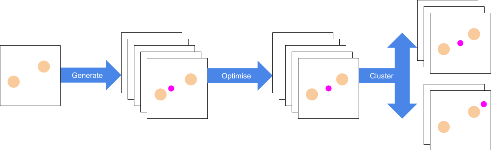

# Introduction

The problem of identifying the stopping site of a muon is often key in the
interpretation of experimental results, and also one of those that computational
tools are most commonly used to solve. Roughly, one can imagine that at the
atomic level, muon spectroscopy experiments go something like this:

- the polarized muon beam is fired at the sample, and the muons travel a certain
  depth inside the target;
- through inelastic collisions with the atoms of the lattice, muons shed their
  kinetic energy, which turns into heat or causes small amounts of damage to the
  crystal, until it becomes low enough that it is comparable to their potential
  energy in the electrostatic fields generated by electrons and nuclei alike;
- at that point, Coulomb forces start driving the muon, and eventually, it loses
  as much energy as possible and comes to a stop in a position that represents a
  global, or at least local, minimum for its electrostatic potential energy,
  where it spends the rest of its time until it decays.


Where these minima of the potential actually are isn't always obvious. In some
cases, it's trivial - for example in organic molecules the mechanism is often
the same as for regular hydrogenation, and so the muon, having captured an
electron and formed a muonium pseudo-atom, ends up breaking a double or triple
bond and attaching itself to the molecule by using one of the unpaired
electrons. However in other crystalline structures it can be a lot harder. A
reliable atomistic simulation that accurately predicted the potential through
which the atoms interact, though, can identify these possible sites. In order to
find them, however, one generally needs to use a brute force approach to explore
all the possible positions in which the muon may end up. {AIRSS} is one such
method .

In this workflow, we use the {UEP} Method: a method that requires only {DFT}
calculation, which is used to compute the electronic density of the host
material . This, in turn, is used to calculate the
minima of the host material’s electrostatic potential and to estimate the
stopping site of the diamagnetic muon, relying on the approximation that the
muon’s presence does not significantly affect its surroundings.


> ### Agenda
>
> In this tutorial, we will cover:
>
> 1. TOC
> {:toc}
>
{: .agenda}

# Preparation steps
First, we need to download some simple example data and a workflow for finding
possible stopping sites. For this, we use a CASTEP `.cell` file containing two
Silicon atoms. In order to run this workflow, we also need the output files from
calculating the electronic density with CASTEP and a parameter file for our tools.
These have all been pre-generated for this tutorial, but in general you would
need to create these yourself outside of Galaxy.

## Get data

> <hands-on-title>Data upload</hands-on-title>
>
> 1. Create a new history for this tutorial
> 2. Import the files from [Zenodo]({{ page.zenodo_link }}) or from
>    the shared data library (`GTN - Material` -> `{{ page.topic_name }}`
>     -> `{{ page.title }}`):
>
>    ```
>    https://sandbox.zenodo.org/record/1031546/files/Si-muairss-uep.yaml
>    https://sandbox.zenodo.org/record/1031546/files/Si-out.cell
>    https://sandbox.zenodo.org/record/1031546/files/Si.castep
>    https://sandbox.zenodo.org/record/1031546/files/Si.den_fmt
>    ```
>
>    
>
>    
>
> 3. Rename the datasets to match their file names, if needed.
> 4. Check that the datatype is correct for each dataset.
>
>    
>
{: .hands_on}

## Import workflow

> <hands-on-title>Import workflow</hands-on-title>
>
> 1. Import the workflow for this tutorial using [these instructions](workflows/).
> 2. Open the editor for the workflow, and verify that all the required tools
>    are installed on your Galaxy instance, and have the same version(s) as the
>    tools in workflow. If this is not the case a dialogue box will warn you.
>
{: .hands_on}
# Finding stopping sites

We can execute the entire workflow in one go, which will generate stopping sites
based on our four input files. Alternatively, we can run the three tools that
comprise the workflow one by one. The steps below describe each one in detail:
what parameters they take and what exactly they do.

## Generate muonated structures (pm-muairss)

First, we must randomly generate a batch possible locations for the muon using
the {AIRSS} method using the following parameters.

> <hands-on-title>Tool details</hands-on-title>
>
> 1.  with the following parameters:
>    -  *"Structure file"*: `Si-out.cell` (Input dataset)
>    -  *"YAML parameter file"*: `Si-muairss-uep.yaml` (Input dataset)
>    - *"Does your configuration use the CASTEP calculator?"*: `No`
> 2. Should generate the following output(s):
>    -  `Muonated Si-out.cell using Si-muairss-uep.yaml` (Output dataset)
>
>    > <comment-title>CASTEP calculator</comment-title>
>    >
>    > In our example we have not used the CASTEP calculator. If we had, we
>    > would have the option of providing a CASTEP parameter file as well.
>    > However, we would not be able to use the `pm-uep-opt` tool for the next
>    > step in the workflow, and would have to manually run CASTEP on these
>    > structures outside of Galaxy, then zip and upload the results to use as
>    > the input to step 3.
>    {: .comment}
>
{: .hands_on}

The output of this tool is a zipped folder containing muon positions. We can
then use this with the next tool in our workflow.

## Run UEP optimisation (pm-uep-opt)

Now we have some muonated structures, we have to optimise the position of the
muon in each. This tool minimises the classical electrostatic forces with
respect to the muon position, using the {UEP} generated for the original
structure.

> <hands-on-title>Task description</hands-on-title>
>
> 1.  with the following parameters:
>    -  *"Muonated structures (.zip)"*: `Muonated Si-out.cell using Si-muairss-uep.yaml` (output of **Generate muonated structures (pm-muairss)** )
>    -  *"Charge density file (.den_fmt)"*: `Si.den_fmt` (Input dataset)
>    -  *"CASTEP log (.castep)"*: `Si.castep` (Input dataset)
> 2. Should generate the following output(s):
>    -  `UEP results for Muonated Si-out.cell using Si-muairss-uep.yaml` (Output dataset)
>
{: .hands_on}

The output of this tool is a zipped folder containing the optimised structures.
We can then use this with the next tool in our workflow.

## Run clustering for optimised structures (pm-muairss read)

Finally, we can cluster the optimised positions in order to generate a short
list of potential stopping sites.

> <hands-on-title>Task description</hands-on-title>
>
> 1.  with the following parameters:
>    -  *"optimised muonated structures (.zip)"*: `UEP results for Muonated Si-out.cell using Si-muairss-uep.yaml` (output of **Run UEP optimisation (pm-uep-opt)** )
> 2. Should generate the following output(s):
>    -  `Cluster Report` (Output dataset)
>    -  `Cluster Data` (Output dataset)
>
{: .hands_on}

The report will contain a human readable summary of the clustering, with the
underlying raw data also provided. While we may have generated 10s of random
positions, we should now see only a few potential stopping sites as during the
optimisation stage the muons migrate to minimise the forces acting on them.
These new positions are likely to overlap, corresponding to local energy minima.
In addition to listing the number of muons that arrived at each stopping site,
we also report the energy corresponding to that site. This can help inform which
site(s) are most favourable for the muon.

# Conclusion



We have used tools from PyMuonSuite to determine possible locations of implanted
muons in a simple structure. In reality, the structure of interest will likely
be more complex, but the workflow will remain the same. It is also possible to
modify the settings used by PyMuonSuite with

and then use that file in our input, or alternatively modify the workflow to
include this tool directly. The Galaxy implementation has explanations of the
various settings, and sensible values set by default.
