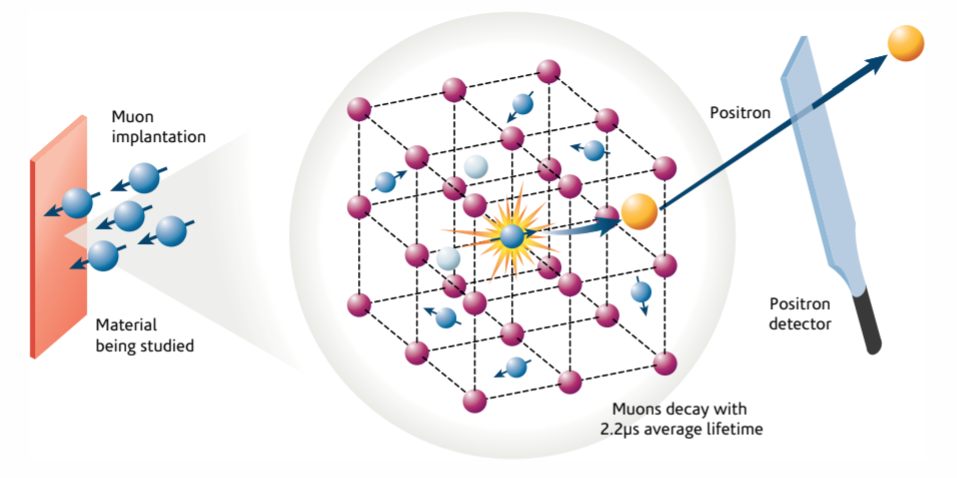

# Introduction

The problem of identifying the stopping site of a muon is often key in the
interpretation of experimental results, and such problem has been commonly tackled by using computational
tools. 

At the atomic level, muon spectroscopy experiments go something like this:

- The polarized muon beam is fired at the sample, and the muons travel a certain
  depth inside the target
- Through inelastic collisions with the atoms of the lattice, muons shed their
  kinetic energy, which turns into heat or causes small amounts of damage to the
  crystal. This continues until the muons' kinetic energy becomes low enough
  that it is comparable to their potential energy in the electrostatic fields
  generated by electrons and nuclei alike.
- At that point, Coulomb forces start driving the muon, until it eventually loses
  as much energy as possible and comes to a stop in a position that sometimes represents a
  local (and possibly global) minimum for the sample's electrostatic potential energy.  It may also 
  be the case that the muon grabs an electron, becomes neutral muonium, and stops at a local or global 
  minimum for the sample's full potential energy. Once it stopped, the muon may spend the rest of its time in that 
  position until it decays.



Where these minima of the potential actually are isn't always obvious.
For example, in organic molecules the mechanism is often the
same as for regular hydrogenation. The muon, having captured an electron and
formed a muonium pseudo-atom, ends up breaking a high electronic density site, 
such as a double or triple bond,
attaching itself to the molecule and creating an organic radical with its corresponding
unpaired electron. However,
There are certain crystalline structures where predicting the potential minima can
be a lot harder.  In  lithium fluoride , the potential's minima are 
flat and wide and current computer simulations fail to predict the muon stopping site. 

In this workflow, we show a basic example of to find some potential stopping sites in a 
crystalline silicon sample using the {UEP} method.  This method requires only a single
{DFT} calculation, which is used to relax the structure and compute the electronic density of the host
material .  In this example, we used the CASTEP code for running our 
DFT calculations. The electronic structure, in turn, is used to calculate the
minima of the host material’s electrostatic potential and to estimate potential
stopping sites for the diamagnetic muon, relying on the approximation that the
muon’s presence does not significantly affect its surroundings.


> ### Agenda
>
> In this tutorial, we will cover:
>
> 1. TOC
> {:toc}
>
{: .agenda}

# Preparation steps
First, we need to load into Galaxy the necessary files for running a 
stopping site calculation on crystalline silicon. First, we need the files from the CASTEP DFT simulation. 
These are the CASTEP structural file `*.cell`, the charge density file `*.den_fmt` 
and the CASTEP output file. `*.castep`.  And then, we need the file containing the 
parameters that all of the pymuon-suite tools will use for running: `*.yaml`.

Then we can run the workflow to estimate the muon stopping site either by hand, 
running each pymuon-suite tool individually, or automatically, running the whole
workflow in one go. 

The CASTEP files for this example have all been pre-generated for this tutorial, 
but in general you would need to create these yourself outside of Galaxy.

## Get data

> <hands-on-title>Data upload</hands-on-title>
>
> 1. Create a new history for this tutorial
> 2. Import the files from [Zenodo]({{ page.zenodo_link }}), form you computer, or from
>    the shared data library (`GTN - Material` -> `{{ page.topic_name }}`
>     -> `{{ page.title }}`):
>
>    ```
>    https://zenodo.org/record/6344385/files/Si.cell
>    https://zenodo.org/record/6344385/files/Si.castep
>    https://zenodo.org/record/6344385/files/Si.den_fmt
>    ```
>
>    
>
>    
>
> 3. Rename the datasets to match their file names, if needed.
> 4. Check that the datatype is correct for each dataset.
>
>    
>
{: .hands_on}

## Import workflow

> <hands-on-title>Import workflow</hands-on-title>
>
> 1. Import the workflow for this tutorial using [these instructions](workflows/).
> 2. Open the editor for the workflow, and verify that all the required tools
>    are installed on your Galaxy instance, and have the same version(s) as the
>    tools in workflow. If this is not the case a dialogue box will warn you.
>
{: .hands_on}
# Finding stopping sites

As we mentioned before, we can execute the entire workflow in one go, which will generate stopping sites
based on our four input files. Or, alternatively, the four tools that comprise the
workflow can be run one by one, or be included in other workflows. To aid
understanding, the steps below describe how to run each tool in detail: what parameters they
take and what exactly they do.

## UEP Stage 1: Create configuration file 

The first tool in the workflow,  PyMuonSuite AIRSS configure, handles the configuration of all the subsequent
tools in one go. When used outside a workflow, MuonGalaxy provides a UI with default
values and help for the possible parameters used by the various PyMuonSuite
operations . For this example many of these are either left to their default
values or are not specifically relevant to the {UEP} use case. Those that are
important have some further explanation.

> <hands-on-title>Tool details</hands-on-title>
>
> 1.  with the following parameters:
>    - *"General Parameters"*:
>      - *"Poisson radius"*: `0.8` Sets the minimum spacing between the muons that are randomly implanted in the sample
>      - *"Name"*: `si` Name for this simulation
>      - *"Charged muon"*: `true` Treat the muon as a diamagnetic muon with positive charge
>      - *"Geometry optimization steps"*: `300` Maximum number of geometry optimisation steps in the UEP method
>      - *"Van der Waals scale"*: `0.25` Sets the minimum spacing between randomly implanted  muons and existing atoms
>      - *"Output folder name"*: `muon-airss-out` Name to call the output folder, only relevant when using the zipped intermediary outputs of the tools
>      - *"Geometry optimization tolerance"*: `0.02` Tolerance on geometry optimisation in eV/AA
>    - *"Calculator parameters"*:
>      - *"Optimization calculator"*: `UEP` Method to use for optimisation
>      - *"Gaussian width factor"*: `4.0` Adjusts how atom potentials are modelled
>    - *"Clustering Parameters"*:
>      - *"Clustering method"*: `hierarchical` Perform hierarchical clustering (other option is k-means)
>      - *"t parameter for hierarchical clustering"*: `0.2` Threshold value for clusters
>      - *"Supercell"*: `1` Supercell size and shape to use
>      - *"K-points grid"*: `[1,1,1]` List of k-points for the Monkhorst-Pack integrals in a DFT simulation
>      - *"Max SCC steps"*: `200` If applicable, max number of SCC steps to perform in the associated DFT simulation
> 2. Should generate the following output(s):
>    -  `Configuration for si` (Output dataset)
>
>    > <comment-title>Optimization calculator</comment-title>
>    >
>    > Here we chose {UEP} as our method for the optimisation (step 3), as
>    > described earlier. The other alternatives are CASTEP and DFTB+ Each
>    > calculator will have different settings associated with it. DFTB+ has a 
>    > corresponding tool, 
>    > that could be used for stage 3, however CASTEP does not. Instead,
>    > if we had used CASTEP we would have to manually run CASTEP on these
>    > structures outside of Galaxy, then zip and upload the results to use as
>    > the input to step 4.  But this is not art of the UEP method.
>    {: .comment}
>
>    > <comment-title>Clustering method</comment-title>
>    >
>    > The choice here is between `hierarchical` and `k-means`. `hierarchical`
>    > clustering builds a tree branching progressively from a single "trunk"
>    > containing all the stopping sites to multiple "leaves" of each individual
>    > site. The number of clusters is determined by the t parameter: `0`
>    > corresponds to individual sites, with the number of clusters decreasing
>    > as t increases towards `1`. `k-means` attempts to create clusters which
>    > have equal variance within them. In this case the number of clusters to
>    > (attempt to) form is the available parameter.
>    {: .comment}
>
{: .hands_on}

The output of this tool is the `*.yaml` file containing all the parameters we
set, formatted for PyMuonSuite. As an alternative to running this step, an
existing configuration file (either from an earlier use of the tool or uploaded
directly) can be used as the input for the other PyMuonSuite tools.

## UEP Stage 2: Generate muonated structures

Given an input structural file, `*.cell`, and a parameter file `*.yaml`, this tool generates 
a set of duplicate structures, each with a single muon added in a random location on the `*.cell` structural 
file. These are known as "muonated" structures.

> <hands-on-title>Tool details</hands-on-title>
>
> 1.  with the following parameters:
>    -  *"Structure file"*: `Si.cell` (Input dataset)
>    -  *"YAML parameter file"*: `Configuration for si` (Input dataset)
>    - *"Does your configuration use the CASTEP calculator?"*: `No`
> 2. Should generate the following output(s):
>    -  `Muonated `*.cell` files, which use the parameters from the `*.yaml` Configuration file for si` (Output dataset)
>
>    > <comment-title>CASTEP calculator</comment-title>
>    >
>    > In our example we have not used the CASTEP calculator. If we had, we
>    > would have the option of providing a CASTEP parameter file as well.
>    > This file would be included in the output which, as described earlier,
>    > would need to be run outside of Galaxy instead of following step 3.
>    {: .comment}
>
{: .hands_on}

The output of this tool is a zipped folder containing `*.cell` files with muons in random positions. We can
then use this with the next tool in our workflow.

## UEP Stage 3: Optimisation using UEP

Now that we have those structures with muons in random positions, we have to 
displace those muons in each structure to minimise the electrostratic force on each one of them.
The PyMuonSuite AIRSS UEP Optimise tool minimises those analitical classical electrostatic forces with
respect to the muon position, using the Unperturbed Electrostatic Potential calculated for the original
`*.cell` structure with the CASTEP calculation.

> <hands-on-title>Task description</hands-on-title>
>
> 1.  with the following parameters:
>    -  *"Muonated structures (.zip)"*: `Muonated Si.cell using Configuration for si` (output of **PyMuonSuite AIRSS Generate** )
>    -  *"Charge density file (.den_fmt)"*: `Si.den_fmt` (Input dataset)
>    -  *"CASTEP log (.castep)"*: `Si.castep` (Input dataset)
> 2. Should generate the following output(s):
>    -  `UEP results for Muonated Si.cell using Configuration for si` (Output dataset)
>
{: .hands_on}

The output of this tool is a zipped folder containing the optimised muonated structures.
We can then use this with the next tool in our workflow.

## UEP Stage 4: Clustering

Finally, we can cluster the optimised positions: each one of the cluster founds becomes part of 
a list of potential stopping sites.

> <hands-on-title>Task description</hands-on-title>
>
> 1.  with the following parameters:
>    -  *"optimised muonated structures (.zip)"*: `UEP results for Muonated Si.cell using Configuration for si` (output of **PyMuonSuite AIRSS UEP Optimise** )
> 2. Should generate the following output(s):
>    -  `Cluster Report` (Output dataset)
>    -  `Cluster Data` (Output dataset)
>
{: .hands_on}

The final `Cluster report` will contain a human readable summary of the clustering results,
with the underlying raw data also provided.

> <details-title>`Cluster report` header and settings</details-title>
>
> ```
> ****************************
> |                          |
> |       PYMUON-SUITE       |
> |  MuAirss Clusters report |
> |                          |
> ****************************
> 
> Name: si
> Date: 2023-01-09 17:16:54.379024
> Structure file(s): input_structure.cell
> Parameter file: params.yaml
> 
> Clustering method: Hierarchical
>     t = 0.2
> 
> *******************
> ```
> 
> The top of the report contains a summary of the settings used to run the
> clustering, and when it was run.
>
{: .details}

> <details-title>`Cluster report` content</details-title>
>
> ```
> Clusters for si:
> CALCULATOR: uep
> 	2 clusters found
> 
> 
> 	-----------
> 	Cluster 1
> 	-----------
> 	Structures: 39
> 
> 	Energy (eV):
> 	Minimum		Average		StDev
> 	-8.61		-8.61		0.00
> 
> 	Minimum energy structure: si_28
> 
> 
> 	Structure list:
> 	si_1	si_2	si_3	si_4	
> 	si_5	si_7	si_8	si_10	
> 	si_11	si_12	si_14	si_15	
> 	si_16	si_17	si_19	si_20	
> 	si_21	si_22	si_23	si_25	
> 	si_26	si_27	si_28	si_29	
> 	si_30	si_31	si_32	si_33	
> 	si_34	si_35	si_36	si_37	
> 	si_38	si_39	si_40	si_41	
> 	si_42	si_43	si_45	
> 
> 	-----------
> 	Cluster 2
> 	-----------
> 	Structures: 7
> 
> 	Energy (eV):
> 	Minimum		Average		StDev
> 	-8.52		-8.52		0.00
> 
> 	Minimum energy structure: si_18
> 
> 
> 	Structure list:
> 	si_6	si_9	si_13	si_18	
> 	si_24	si_44	si_46	
> 
> 	----------
> 
> 	Similarity (ranked):
> 	1 <--> 2 (distance = 0.225)
> 
> --------------------------
> 
> 
> ==========================
> ```
> 
> The remainder of the report details the clusters (each of which represents a
> stopping site) that the individual muonated structures were assigned to. In
> addition to showing the relative numbers of structures forming each cluster, we also report the
> average energy corresponding to that cluster and which is the strucuture, within that cluster, 
with the minimum energy. This can help inform which site(s) are most
> favourable for the muon.
>
{: .details}

While we may have generated tens of strucutres with muons in random positions, we should now see only a
few potential stopping sites. This is because the optimisation procedure to cluster the muons while 
 minimising the forces acting on them. These new positions are likely to
overlap, corresponding to local energy minima.

The `Cluster data` output contains a machine-readable summary of the stopping
sites, including their location and energy.

# Conclusion


We have used tools from PyMuonSuite to determine the possible stopping sites of implanted
muons in a simple structure. It is also possible to
modify the settings used by PyMuonSuite with

and then use that file in our input, or alternatively modify the workflow to
include this tool directly. The Galaxy implementation has explanations of the
various settings, and sensible values set by default.
