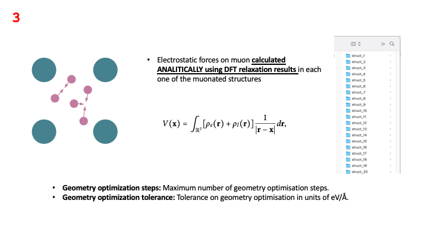
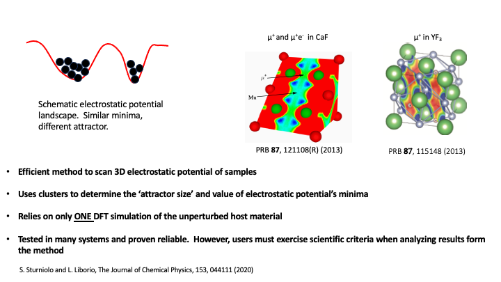

The problem of identifying the stopping site of the muon is often key in the
interpretation of muon experimental results. As it was mentioned in the lecture,
the problem of finding the muon stopping site has been previously
tackled using computational tools, and one of the most common methods is the so-called
{UEP} method, which identifies proposes that
the muon stops at the minima of the {UEP} of a crystalline host material.

pymuon-suite in Galaxy implements a variant of the {UEP}, that allows the
users to efficiently scan the {UEP} of the host material and use a clustering procedure
to classify those minima as potential stopping sites. But, before moving into the details
of how the method works, it is useful to revisit some of the key assumptions
behind what happens in a muon experiment.

At the atomic level, muon spectroscopy experiments go something like this:

- A spin-polarized muon beam of positive muons is fired at the sample
- Through inelastic collisions with the atoms of the crystalline host material,
 muons shed their kinetic energy, which turns into heat or causes small amounts
 of damage to the crystal. This continues until the muons' kinetic energy becomes low enough
that it is comparable to their potential energy in the electrostatic potential
generated by electrons and nuclei alike.
- At that point, Coulomb forces start driving the muon, until it eventually
  loses as much energy as possible and comes to a stop in a position that
  sometimes represents a local (and possibly global) minimum for the sample's
  {UEP} energy. Once it stopped, the muon may spend
  the rest of its time in that position until it decays.


Where these minima of the potential actually are isn't always obvious and,
although the our version of the {UEP} method has proven to be quite efficient and useful,
 there are certain crystalline materials where predicting the minima of the {UEP}
 potential can be a lot harder. For instance, in lithium fluoride ,
 the potential's minima are flat and
wide and current computer simulations fail to predict the muon stopping site.
Hence, users must exercise scientific criteria when analyzing results form the method

This tutorial goes into the details of how to estimate the muon stopping
site in crystalline copper, as described in the lecture, and it assumes
 that some basic Galaxy concepts such as: how to upload a file;
how to use a Galaxy tool; how to create, view and share a history and how to extract
 and run a Galaxy workflow, are known. Hence,
as stated in the requirements at the beginning of this tutorial please, before starting
 have a look at this: [A short introduction to Galaxy]()

> <agenda-title></agenda-title>
>
> In this tutorial, we will cover:
>
> 1. TOC
> {:toc}
>
{: .agenda}


# Workflow for Finding the µ+ stopping site
As described in the lecture, the full workflow associated with finding
potential muon stopping sites in crystalline copper is shown in the figure below:


It comprises 6 steps that will be described in detail in the next sections.  Steps 1 and 6
are performed outside of the Galaxy platform, usually in an external computer cluster that can
run the necessary {DFT} simulations. Steps 2, 3, 4, and 5 of this workflow are are carried out
in Galaxy using two Galaxy tools: `PyMuonSuite AIRSS UEP Optimise` and `PyMuonSuite AIRSS Cluster`.


Hence, there is a difference between the full workflow and the specific Galaxy part of this workflow, which can be
saved, shared and edited in the Galaxy platform. For the case of finding potential muon stopping sites in
crystalline Cu, the components of Galaxy workflow are shown below:


And this is the workflow that can be imported for this tutorial.

## Import workflow

> <hands-on-title>Import workflow</hands-on-title>
>
> 1. Import the workflow for this tutorial using [these instructions](workflows/).
> 2. Open the editor for the workflow, and verify that all the required tools
>    are installed on your Galaxy instance, and have the same version(s) as the
>    tools in workflow. If this is not the case a dialogue box will warn you.
>
{: .hands_on}

## {DFT} calculation of the Pure Host Material

 This method requires only a single {DFT} calculation for the host material.
 This calculation could be a geometry optimisation, which uses
 a self-consistent methodology to estimate the electronic
 structure of the material and relax the structure. Pymuon_suite uses the
 CASTEP code for running its {DFT} calculations, and some basic information
  about how to run a geometry optimisation is available in the [CASTEP documentation](https://castep-docs.github.io/castep-docs/).

Once the relaxed structure and its corresponding electronic structure are obtained,
a set of CASTEP output files is generated. We need to load just three of these files
into Galaxy.  These are the relaxed CASTEP structural file `*-out.cell`, the
charge density file `*.den_fmt` and the CASTEP output file `*.castep`.

The CASTEP files for this example have all been pre-generated for this tutorial,
but in general you would need to create these yourself by running CASTEP simulations
outside of Galaxy.

To run the first part of the workflow, on the left menu of the Galaxy web-page
we look for the `FIND MUON STOPPING SITES` header and first click on `UEP method` and then
select the `PyMuonSuite AIRSS UEP Optimise` Galaxy tool. This brings up the central panel of the Galaxy
web-page, where can load the CASTEP files; complete the *Generation* parameters to set up the
creation of randomly populated muonated structures; and complete the *Optimisation* parameters to set up the relaxation the
electrostatic forces of the muon in each of the randomly populated muonated structures.

### How to load CASTEP files into Galaxy

> <hands-on-title>Data upload</hands-on-title>
>
> 1. Create a new history for this tutorial
> 2. Import the files from [Zenodo]({{ page.zenodo_link }}), from you computer, or from
>    the shared data library (`GTN - Material` -> `{{ page.topic_name }}`
>     -> `{{ page.title }}`):
>
>    ```
>    https://zenodo.org/records/10219558/files/Cu-out.cell
>    https://zenodo.org/records/10219558/files/Cu.castep
>    https://zenodo.org/records/10219558/files/Cu.den_fmt
>    ```
>
>    
>
>    
>
> 3. Rename the datasets to match their file names, if needed.
> 4. Check that the datatype is correct for each dataset.
>
>    
>
{: .hands_on}

## Create Randomly Populated Muonated Structures

The first step within the Galaxy platform is the population of the
host material's interstitial spaces with muons that are
randomly distributed in accordance with certain physical constraints.


Essentially, the muons are randomly distributed while respecting
a minimum distance between them and between the atoms
in the host material. The `Poisson radius` parameter sets the minimum spacing
between the muons that are randomly implanted in the sample, while the
`Van der Waals scale` parameter sets the minimum spacing between randomly
implanted muons and the atoms in the host material.  Two of the images in the figure
above show how the density of distributed muons changes for different values of
the Poisson radius. These images are just for visualization purposes, what
the method really does is generate a set of muonated structures, where each one has a muon
in a different place, and place each muonated structure in a corresponding folder.

## Relax Electrostatic Forces on Muons

As stated in the lecture, the method minimizes the electrostatic forces acting on the muon in each of the
muonated structures generated in the previous step.  In this relaxation procedure,
the forces are calculated analytically using data obtained from the {DFT} simulation of the unperturbed host material:
the charge density file `*.den_fmt`, the relaxed CASTEP structural file `*-out.cell`, the and the CASTEP output file `*.castep`,
and then the muon is displaced in a direction
that minimizes the forces acting upon it. This is a self-consistent procedure, which is repeated until the
forces on each muon are below the value specified in the `geometry optimisation tolerance` parameter, or until
the maximum number of `geometry optimisation steps` is reached.



This workflow's step could be computationally expensive. The larger the
the size of the host material's unit cell, and the smaller the values of `Poisson radius` and
`Van der Waals scale` parameters, the larger number of muonated structures created, and the
more expensive this step will be.  In any case: the relaxation procedure is run in the Galaxy
server, so the user can just start it and leave it running in the Galaxy instance. The status of
the relaxation will be indicated in the history panel on the right menu of the Galaxy web-page, where
all the processes run by the Galaxy instance are numbered.

Below, a hands-on example on how to run these workflow steps.

> <hands-on-title>PyMuonSuite AIRSS UEP Optimise</hands-on-title>
>
> 1. Run the  tool with the following parameters:
>    - *"Tool Parameters"*:
>      -  *"Structure file"*: `Cu-out.cell` relaxed CASTEP structural file
>      -  *"Charge density file"*: `Cu.den_fmt` CASTEP file with charge density of host material
>      -  *"CASTEP log file"*: `Cu.castep` The CASTEP output file for the initial {DFT} simulation
>    - *"Generation Parameters"*:
>      - *"Poisson radius"*: `0.6` Sets the minimum spacing between the muons that are randomly implanted in the sample
>      - *"Van der Waals scale"*: `0.5` Sets the minimum spacing between randomly implanted muons atoms in host material
>      - *"Random seed"*: `optional` this is if we want to re-use a set of generated structures.  Rarely used
>      - *"Format for file containing all muon positions (optional)"*: `cell` Generates an extra output file containing all the muon positions
>    - *"Optimisation parameters Parameters"*:
>      - *"Geometry optimization steps"*: `300` Maximum number of geometry optimisation steps
>      - *"Geometry optimization tolerance"*: `0.05` Tolerance on geometry optimisation in eV/AA
>      - *"Gaussian width factor"*: `5.0` Adjusts how atom potentials are modelled
{: .hands_on}

## Cluster Relaxed Structures - µ+ Stopping Sites

Once the relaxation is over, there will appear a new item on the history panel denominated
*PyMuonSuite AIRSS UEP Optimise on data X, data Y and data Z*. This item
contains a `*.zip` file with all the optimised muonated structures, where *X*, *Y* and *Z* are
the numbers of the processes, in the history panel, that were used for running the relaxation
of the electrostatic forces on muons.


The first step for running the clustering procedure is to select the `PyMuonSuite AIRSS Cluster` Galaxy tool on
the left menu of the Galaxy web-page . This brings up the corresponding central panel of the Galaxy
web-page, where can load the optimised muonated structures `*.zip` contained in the
*PyMuonSuite AIRSS UEP Optimise on data X, data Y and data Z* item.

Then we need to select the *clustering method* and it corresponding parameters. There are two clustering methodologies
available: `hierarchical` and `k-means` clustering. We recommend using the hierarchical clustering first, choosing different
values of the `t parameter for hierarchical clustering`, until a consistent number of clusters is found.  Once that
number is found, we can perform a k-means clustering analysis, using the number of hierarchical clustering clusters as
the value for the `Number of clusters for k-means clustering` parameter.

Finally, we need to choose the *Clustering Save Format*. This allows for the visualisation of the potential stopping sites
associated to each of the clusters found, but it can also be used to prepare the `*.cell` supercell file that is needed to
run the last step of the workflow: the {DFT} relaxation of each of the muonated structures associated to each of
the potential stopping sites.  The `*.cell` supercell file can then be downloaded from Galaxy and used to run
a CASTEP {DFT} simulation, which can be used to analyse things such as the distortions caused by the muon in the host
material.


Below, a hands-on example on how to run this workflow step.

> <hands-on-title>PyMuonSuite AIRSS Cluster</hands-on-title>
>
> 1. Run the  tool with the following parameters:
>    - *"Tool Parameters"*:
>      - *"optimised muonated structures"*: `PyMuonSuite AIRSS UEP Optimise on data X, data Y and data Z` load the optimised muonated structures `*.zip` file
>      - *"Clustering method"*: `hierarchical` Performs hierarchical clustering
>      - *"t parameter for hierarchical clustering"*: `0.2` Threshold value for clusters
>      - *"Clustering method"*: `k-means` Performs k-means clustering.  Needs guess for number of clusters
>      - *"Number of clusters for k-means clustering "*: `2` Proposed number of clusters for k-means. Usually the clusters found with `hierarchical` clustering
>      - *"Clustering Save Format"*: `cell`  Creates a structural file for each cluster, corresponding to the structure in the cluster with minimal energy, with  the specified format
>      - *"Supercell"*: `3` Supercell size and shape to use when saving cluster structures
>      - *"Muon symbol"*: `H:mu` The symbol to use for the muon when writing out the CASTEP custom species. H:mu is the default.
>
{: .hands_on}


### Analysis of the Cluster report

Once the clustering procedure is over, there will appear a new item on the history panel denominated
*Cluster report for PyMuonSuite AIRSS UEP Optimise on data X, data Y, and data Z*, which contains a
human-readable summary of the clustering results, with the underlying raw data also provided. The top of the
report contains a summary of the settings used to run the clustering, and when it was run.

> <code-out-title>MuAirss Clusters report</code-out-title>
> ```
> ****************************
> |                          |
> |       PYMUON-SUITE       |
> |  MuAirss Clusters report |
> |                          |
> ****************************
>
> Name: struct
> Date: 2023-11-06 09:41:00.787599
> Structure file(s): input_structure.cell
> Parameter file: params.yaml
>
> Clustering method: Hierarchical
>     t = 0.4
>
> *******************
> ```
{: .code-out}

The remainder of the report details the clusters and the individual muonated
structures composing each cluster. In
addition to showing the relative numbers of structures forming each cluster,
we also report the structure with the minimum energy, the average energy for all the structures
and the corresponding standard deviation for that average energy. By analysing of these
quantities for different values of the `Poisson radius`, `Van der Waals scale` and
`t parameter for hierarchical clustering` parameters, we can determine which
are the "stable" clusters, which are the ones associated to potential stopping sites.

> <code-out-title>MuAirss Clusters report</code-out-title>
> ```
> Clusters for struct:
> CALCULATOR: uep
> 	2 clusters found
>
>
> 	-----------
> 	Cluster 1
> 	-----------
> 	Structures: 7
>
> 	Energy (eV):
> 	Minimum		Average		StDev
> 	-10.30		-10.30		0.00
>
> 	Minimum energy structure: struct_7
>
>
> 	Structure list:
> 	struct_1	struct_3	struct_5	struct_6
> 	struct_7	struct_8	struct_12
>
> 	-----------
> 	Cluster 2
> 	-----------
> 	Structures: 7
>
> 	Energy (eV):
> 	Minimum		Average		StDev
> 	-11.93		-11.93		0.00
>
> 	Minimum energy structure: struct_14
>
>
> 	Structure list:
> 	struct_2	struct_4	struct_9	struct_10
> 	struct_11	struct_13	struct_14
>
> 	----------
>
> 	Similarity (ranked):
> 	1 <--> 2 (distance = 1.681)
>
> --------------------------
> ```
{: .code-out}

The classical {UEP} method scans the electrostatic potential looking for minima in it, which
are associated to potential muon stopping sites. This method further classifies those minima
by estimating their "attractor size".  If you look at the picture in the figure below, the two
minima have similar values, but the capacity to "attract" a muon is greater for the minima on the left,
which makes it more likely to be a muon stopping site. The probability of a potential stopping site is
given by the size of the cluster that forms around its associated minima.


