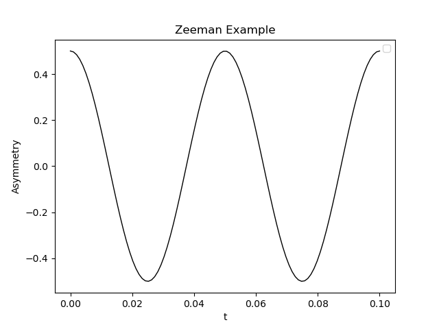
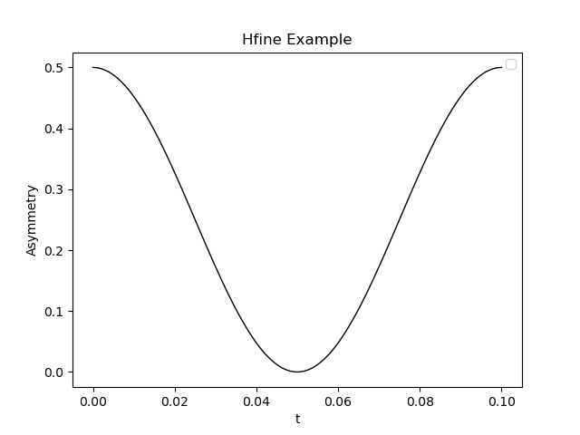
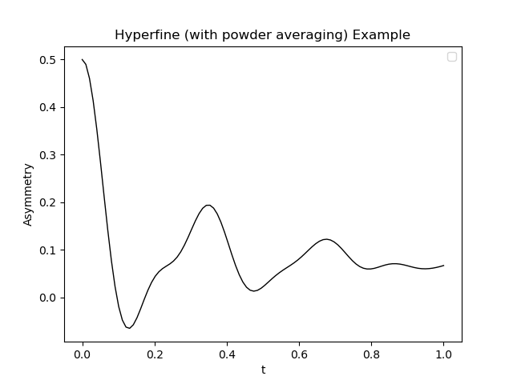
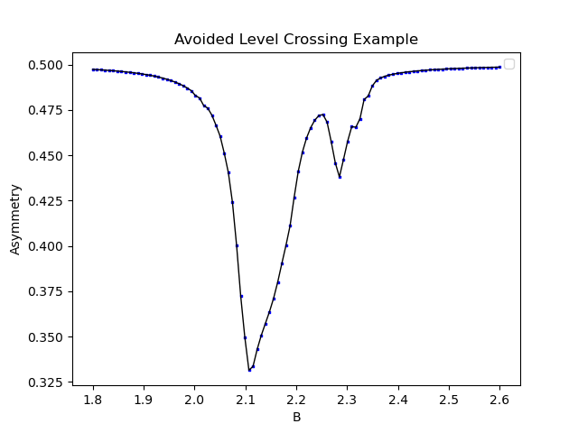
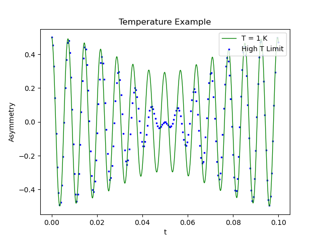
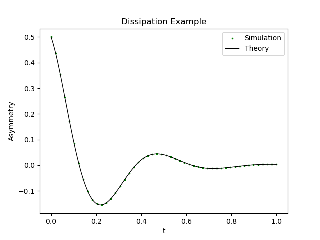
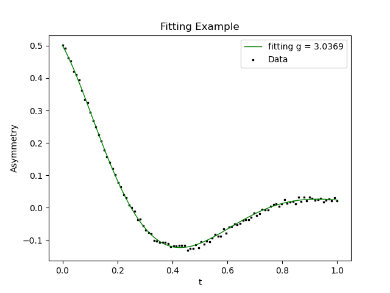

# Introduction

As in other materials science domains, in muon spectroscopy comparing the
results of simulation with experimentally observed properties is a staple tool
for gaining insight into the structure of interest. There are various types of
coupling, and a variety of possible experimental setups that may be desirable to
simulate. A more in depth discussion of the theory of spin dynamics in the
context of muon spectroscopy can be found
[in the main MuSpinSim documentation](https://muon-spectroscopy-computational-project.github.io/muspinsim/).

This tutorial covers a number of workflows, which reflect the different
capabilities of MuSpinSim:

- Coupling between the muon and electrons/atomic nuclei by:
  - hyperfine
  - dipolar
  - quadrupolar
  - Zeeman
- Simulation of external magnetic field:
  - zero field
  - transverse field
  - longitudinal field
- Resolution in:
  - time
  - field
  - temperature
- Fitting against experimental data

However, the main structure of the workflow remains similar throughout.

> ### Agenda
>
> In this tutorial, we will cover:
>
> 1. TOC
> {:toc}
>
{: .agenda}

# Preparation steps

## Get data

> <hands-on-title>Data upload</hands-on-title>
>
> 1. Create a new history for each workflow in this tutorial. Note that while it
>    is possible to import all data into and run workflows in a single history,
>    you will need to be careful to manually select the right input files for
>    the 6th and 7th workflows. By default Galaxy will automatically select the
>    most recent file with the correct type, which could be the output of
>    another workflow leading to an error.
> 2. Import the files from [Zenodo]({{ page.zenodo_link }}) or from
>    the shared data library (`GTN - Material` -> `{{ page.topic_name }}`
>     -> `{{ page.title }}`) into history for the 6th and 7th workflows respectively:
>
>    ```
>    https://sandbox.zenodo.org/record/1131061/files/dissipation_theory.dat
>    https://sandbox.zenodo.org/record/1131061/files/experiment.dat
>    ```
>
>    
>
>    
>
> 3. Rename the datasets to match their file names, if needed.
> 4. Check that the datatype is correct for each dataset.
>
>    
>
{: .hands_on}

## Import workflows

> <hands-on-title>Import Workflow</hands-on-title>
>
> 1. Import each workflow for this tutorial using these [instructions](workflows/).
> 2. Open the editor for each workflow, and verify that all the required tools
>    are installed on your Galaxy instance, and have the same version(s) as the
>    tools in workflow. If this is not the case a dialogue box will warn you.
>
{: .hands_on}

# Workflow 1 - Zeeman Coupling

The Zeeman interaction is the interaction of any spin with an external magnetic
field. In MuSpinSim this mainly means a strong global field applied to the
entire experiment, though it is possible for the user to also set custom local
magnetic fields for individual spins (representing for example the effect of
nearby paramagnetic nuclei). The Hamiltonian written explicitly is:

$$
\mathcal{H}_Z = 2\pi\hbar\sum_i^N \gamma_i (\mathbf{B}+\mathbf{B}_i)\mathbf{S}_i
$$

The sum is intended over all spins, with the gyromagnetic ratios depending on
the nuclei's own properties. The magnetic field here was split in two parts, a
global and a local one which bears the index of the spin. Of course, both of
these can be zero, and by default are if the user does not specify anything.
$$\mathbf{S}_i$$ is the vector of spin operators.

We can execute the workflow that uses Zeeman coupling in one go, but to aid
understanding we will describe each step in detail below.

## MuSpinSim Configure

The first step is to generate a configuration file for the rest of the process.

> <hands-on-title>Tool details</hands-on-title>
>
> 1.  with the following parameters:
>    - *"Name"*: `zeeman`
>    - *"Spins"*:
>      - *"Spins to simulate"*:
>        - *"Spins to simulate 1"*:
>          - *"Species"*: `mu`
>    - *"Spin Interactions"*:
>      - *"Interactions to simulate"*:
>        - *"Interactions to simulate 1"*:
>          - *"Choose interaction type"*: `Zeeman`
>          - *"Index of coupled spin"*: `1`
>          - *"Zeeman coupling vector"*: `0 0 20.0/muon_gyr`
>    - *"Experiment Parameters"*:
>      - *"Experiment type"*: `custom`
>      - *"X axis"*: `time`
>      - *"Y axis"*: `asymmetry`
>      - *"Average axes"*: `orientation`
>      - *"Euler Convention"*: `ZYZ`
>      - *"Times"*:
>        - *"Time 1"*:
>          - *"Time"*: `range(0, 0.1, 100)`
>    - *"Fitting Parameters"*:
>      - *"Fit experimental data with simulations"*: `No`
> 2. Should generate the following output(s):
>    -  `muspinsim input file zeeman` (Output dataset)
>
{: .hands_on}

The output of this tool is a `txt` file, formatted for MuSpinSim to use for the
the simulation itself. While there are a lot of parameters being defined, we can
focus on the *"Interactions to simulate"* section. Here we define only one
coupling, Zeeman, and we define its direction (aligned with the $$z$$ axis),
strength ($$20.0$$) and units. The coupling value is implicitly assumed to be in
terms of frequency ($$MHz$$); this is more intuitive when viewing the final plot
of the data. MuSpinSim will therefore interpret this as "a magnetic field strong
enough to cause oscillations at $$20MHz$$" using the inverse of the muon's
gyromagnetic ratio $$135.5388 MHz/T$$ (i.e. a field strength of $$0.1475T$$).
MuSpinSim supports a number of keyword arguments (we can also note the use of
the Python `range` function) and these are described
[in the main MuSpinSim documentation](https://muon-spectroscopy-computational-project.github.io/muspinsim/input/).
Although not explicitly stated, the unit for time is $$\mu s$$.

## MuSpinSim Simulate

Now that we have defined the conditions, we can simulate them during the next
step of the workflow. For this we only need to provide our configuration file as
an input.

> <hands-on-title>Tool details</hands-on-title>
>
> 1.  with the following parameters:
>    -  *"Configuration file containing simulation parameters"*: `muspinsim input file zeeman` (Input dataset)
> 2. Should generate the following output(s):
>    -  `Muspinsim output collection` (Output dataset)
>    -  `muspinsim log for muspinsim input file zeeman` (Output dataset)
>
{: .hands_on}

In principle the output from this step could be a collection of many `.dat`
files, however in our case there will only be one dataset in this collection. By
default only the collection and not the dataset will be visible in our history,
however it can be viewed in the hidden section. In addition a log file is
produced including time stamps for the various stages of the simulation.

## MuSpinSim Plot

Finally, we can visualise our data by plotting it. This tool will parse the
`.dat` format of the previous step and provide some simple options to control
the appearance of the plot, which are given below.

> <hands-on-title>Tool details</hands-on-title>
>
> 1.  with the following parameters:
>    - *"Plot Title"*: `Zeeman Example`
>    - *"Label for x axis"*: `t`
>    - *"Label for y axis"*: `Asymmetry`
>    - *"Output File Type"*: `PNG`
>    - *"Muspinsim File Series"*:
>      - *"Muspinsim File Series 1"*:
>        -  *"Muspinsim Experiment Data (.dat)"*: `zeeman.dat`
>        - *"Line/Point Color"*: `Black`
>        - *"Series Type"*: `Line`
>        - *"Line type"*: `Solid`
>        - *"Line width"*: `1.0`
> 2. Should generate the following output(s):
>    -  `MuSpinSim Plot on data 4` (Output dataset)
>
{: .hands_on}

Using the above parameters, or running the entire workflow at once, we should
see the following plot as our final output. Note that the period of this
oscillation ($$0.05 \mu s$$) matches our input of $$20 MHz$$.




# Workflow 2 - Hyperfine Coupling

The hyperfine interaction is often the main interaction we care about in muon
spin resonance simulations. It represents an interaction between an electronic
spin and a nuclear one (muon or otherwise). While physically it is often
distinguished in two terms - a Fermi contact term due to the electronic spin
density at the site of the nucleus as well as a dipolar part at a distance -
these are effectively both incorporated in a single $$3\times3$$ symmetric tensor
with non-zero trace. The following interaction between spins is written like this:

$$
\mathcal{H}_{hfine} = 2\pi\hbar \sum_{i < j}^N \mathbf{S}_i\mathbf{A}_{ij}\mathbf{S}_j
$$

(assuming a hyperfine tensor in frequency units). MuSpinSim also makes sure that
hyperfine terms can only be defined when one of the two spins is confirmed to be
an electron.

While there are some changes from the previous example, the overall workflow is
largely the same.

## MuSpinSim Configure

As in the previous example, we start with configuration.

> <hands-on-title>Tool details</hands-on-title>
>
> 1.  with the following parameters:
>    - *"Name"*: `hfine`
>    - *"Spins"*:
>      - *"Spins to simulate"*:
>        - *"Spins to simulate 1"*:
>          - *"Species"*: `mu`
>        - *"Spins to simulate 2"*:
>          - *"Species"*: `e`
>    - *"Spin Interactions"*:
>      - *"Interactions to simulate"*:
>        - *"Interactions to simulate 1"*:
>          - *"Choose interaction type"*: `hyperfine`
>          - *"Index of nuclear coupled spin"*: `1`
>          - *"Hyperfine coupling tensor"*: `10 0 0` `0 10 0` `0 0 10`
>    - *"Experiment Parameters"*:
>      - *"Experiment type"*: `custom`
>      - *"X axis"*: `time`
>      - *"Y axis"*: `asymmetry`
>      - *"Average axes"*: `orientation`
>      - *"Euler Convention"*: `ZYZ`
>      - *"Times"*:
>        - *"Time 1"*:
>          - *"Time"*: `range(0, 0.1, 100)`
>    - *"Fitting Parameters"*:
>      - *"Fit experimental data with simulations"*: `No`
> 2. Should generate the following output(s):
>    -  `muspinsim input file hfine` (Output dataset)
>
{: .hands_on}

The only changes here (other than the *"Name"*) are the addition of an electron
spin to the system, and changing to a `hyperfine` interaction type. A
consequence of this is that we now provide a tensor ($$3\times3$$ matrix) rather than
a vector to define the strength and orientation of the coupling. Once again,
the units are implicitly $$MHz$$.

## MuSpinSim Simulate

As all our changes are captured in the config file, this step operates exactly
as before.

> <hands-on-title>Tool details</hands-on-title>
>
> 1.  with the following parameters:
>    -  *"Configuration file containing simulation parameters"*: `muspinsim input file hfine` (Input dataset)
> 2. Should generate the following output(s):
>    -  `Muspinsim output collection` (Output dataset)
>    -  `muspinsim log for muspinsim input file hfine` (Output dataset)
>
{: .hands_on}

## MuSpinSim Plot

Similarly aside from labelling there are no differences with the plotting
parameters.

> <hands-on-title>Tool details</hands-on-title>
>
> 1.  with the following parameters:
>    - *"Plot Title"*: `Hfine Example`
>    - *"Label for x axis"*: `t`
>    - *"Label for y axis"*: `Asymmetry`
>    - *"Output File Type"*: `PNG`
>    - *"Muspinsim File Series"*:
>      - *"Muspinsim File Series 1"*:
>        -  *"Muspinsim Experiment Data (.dat)"*: `hfine.dat`
>        - *"Line/Point Color"*: `Black`
>        - *"Series Type"*: `Line`
>        - *"Line type"*: `Solid`
>        - *"Line width"*: `1.0`
> 2. Should generate the following output(s):
>    -  `MuSpinSim Plot on data 4` (Output dataset)
>
{: .hands_on}



Note that while the range of values asymmetry takes has changed, we can once
again observe that that our period of $$0.1 \mu s$$ matches the input of
$$10MHz$$.

# Workflow 3 - Hyperfine Coupling with powder averages

In this workflow, we will continue to use hyperfine coupling, but with an
anisotropic tensor including non-zero off-diagonal elements. We will also use
the *"Orientations"* section of the configuration to simulate an experiment on a
powdered sample.

In a powdered sample, each fragment is treated as being randomly orientated such
that it is equivalent to an average over all possible rotations of a crystalline
sample. In simulation, there are multiple ways of achieving this average
supported by MuSpinSim. Regardless, each orientation will have its own
contribution to the "powder" average, and we should expect to see this reflected
in the final plot we obtain.

## MuSpinSim Configure

As in the previous example, we start with configuration.

> <hands-on-title>Tool details</hands-on-title>
>
> 1.  with the following parameters:
>    - *"Name"*: `hfine_powder`
>    - *"Spins"*:
>      - *"Spins to simulate"*:
>        - *"Spins to simulate 1"*:
>          - *"Species"*: `mu`
>        - *"Spins to simulate 2"*:
>          - *"Species"*: `e`
>    - *"Spin Interactions"*:
>      - *"Interactions to simulate"*:
>        - *"Interactions to simulate 1"*:
>          - *"Choose interaction type"*: `hyperfine`
>          - *"Index of nuclear coupled spin"*: `1`
>          - *"Index of electronic coupled spin"*: `2`
>          - *"Hyperfine coupling tensor"*: `5 2 3` `2 5 2` `3 2 5`
>    - *"Experiment Parameters"*:
>      - *"Experiment type"*: `custom`
>      - *"X axis"*: `time`
>      - *"Y axis"*: `asymmetry`
>      - *"Fields"*:
>        - *"Fields 1"*:
>          - *"Field (T)"*: `0.01`
>      - *"Average axes"*: `orientation`
>      - *"Orientations"*:
>        - *"Orientations 1"*:
>          - *"Orientation"*: `Euler angles helper function (eulrange(n))`
>          - *"n"*: `10`
>      - *"Euler Convention"*: `ZYZ`
>      - *"Times"*:
>        - *"Time 1"*:
>          - *"Time"*: `range(0, 0.1)`
>    - *"Fitting Parameters"*:
>      - *"Fit experimental data with simulations"*: `No`
> 2. Should generate the following output(s):
>    -  `muspinsim input file hfine_powder` (Output dataset)
>
{: .hands_on}

Here we have made a few changes. First, we have defined an external magnetic
field of $$0.01T$$, aligned with the $$z$$ axis (other orientations can be
achieved by providing a vector rather than scalar here).

We have also defined the orientations needed to do our powder average. It is
possible to define a specific range of angles for the average (see
[the main MuSpinSim documentation](https://muon-spectroscopy-computational-project.github.io/muspinsim/input/#orientation))
but there are also helper functions that cover a full sphere. We are using
`eulrange`, which will generate a grid of $$n \times n \times n$$ (1000)
weighted Euler angles.

## MuSpinSim Simulate

As all our changes are captured in the config file, this step operates exactly
as before.

> <hands-on-title>Tool details</hands-on-title>
>
> 1.  with the following parameters:
>    -  *"Configuration file containing simulation parameters"*: `muspinsim input file hfine_powder` (Input dataset)
> 2. Should generate the following output(s):
>    -  `Muspinsim output collection` (Output dataset)
>    -  `muspinsim log for muspinsim input file hfine_powder` (Output dataset)
>
{: .hands_on}

## MuSpinSim Plot

Similarly aside from labelling there are no differences with the plotting
parameters.

> <hands-on-title>Tool details</hands-on-title>
>
> 1.  with the following parameters:
>    - *"Plot Title"*: `Hyperfine (with powder averaging) Example`
>    - *"Label for x axis"*: `t`
>    - *"Label for y axis"*: `Asymmetry`
>    - *"Output File Type"*: `PNG`
>    - *"Muspinsim File Series"*:
>      - *"Muspinsim File Series 1"*:
>        -  *"Muspinsim Experiment Data (.dat)"*: `hfine_powder.dat`
>        - *"Line/Point Color"*: `Black`
>        - *"Series Type"*: `Line`
>        - *"Line type"*: `Solid`
>        - *"Line width"*: `1.0`
> 2. Should generate the following output(s):
>    -  `MuSpinSim Plot on data 4` (Output dataset)
>
{: .hands_on}



As discussed earlier, our final plot is the average of 1000 individual
oscillations. Each has its own frequency, and so as time progresses they end up
increasingly out of phase. The result is that the oscillations decay as the
contributions begin to cancel each other out.

# Workflow 4 - Avoided Level Crossing

This workflow simulates a simple {ALC} experiment which involves three spins: a
muon, an electron, and a hydrogen atom. Both the muon and the hydrogen are
coupled to the electron by the hyperfine interaction. As a result, in our
configuration file we will need to define two spin interactions with type
`hyperfine`, but which act on different nuclear spins and have different
coupling tensors.

## MuSpinSim Configure

As in the previous example, we start with configuration.

> <hands-on-title>Tool details</hands-on-title>
>
> 1.  with the following parameters:
>    - *"Name"*: `alc`
>    - *"Spins"*:
>      - *"Spins to simulate"*:
>        - *"Spins to simulate 1"*:
>          - *"Species"*: `e`
>        - *"Spins to simulate 2"*:
>          - *"Species"*: `mu`
>        - *"Spins to simulate 2"*:
>          - *"Species"*: `custom`
>          - *"Species name"*: `H`
>    - *"Spin Interactions"*:
>      - *"Interactions to simulate"*:
>        - *"Interactions to simulate 1"*:
>          - *"Choose interaction type"*: `hyperfine`
>          - *"Index of nuclear coupled spin"*: `2`
>          - *"Hyperfine coupling tensor"*: `580 5 10` `5 580 9` `10 9 580`
>        - *"Interactions to simulate 2"*:
>          - *"Choose interaction type"*: `hyperfine`
>          - *"Index of nuclear coupled spin"*: `3`
>          - *"Hyperfine coupling tensor"*: `150 3 4` `3 150 5` `4 5 150`
>    - *"Experiment Parameters"*:
>      - *"Experiment type"*: `Avoided Level Crossing (ALC)`
>      - *"Fields"*:
>        - *"Fields 1"*:
>          - *"Field (T)"*: `range(1.8, 2.6, 100)`
>      - *"Average axes"*: `orientation`
>      - *"Orientations"*:
>        - *"Orientations 1"*:
>          - *"Orientation"*: `Zaremba-Conroy-Wolfsberg helper function (zcw(n))`
>          - *"n"*: `20`
>      - *"Euler Convention"*: `ZYZ`
>    - *"Fitting Parameters"*:
>      - *"Fit experimental data with simulations"*: `No`
> 2. Should generate the following output(s):
>    -  `muspinsim input file alc` (Output dataset)
>
{: .hands_on}

The method of defining the hyperfine tensors is unchanged, however we now have
two of them, with the respective index noted. Our experiment parameters have
also changed. We use a predefined *"Experiment type"* instead of manually
defining our $$x$$ and $$y$$ axes, and now have a `range` of values for our
magnetic field. Note that we have also changed the helper function for
orientation angles to `zcw`. This is cheaper as it only generates $$n$$ polar
angles, but should only be used for cases where polar angles are sufficient.
This is the case here thanks to the experiment's longitudinal polarisation.

## MuSpinSim Simulate

As all our changes are captured in the config file, this step operates exactly
as before.

> <hands-on-title>Tool details</hands-on-title>
>
> 1.  with the following parameters:
>    -  *"Configuration file containing simulation parameters"*: `muspinsim input file alc` (Input dataset)
> 2. Should generate the following output(s):
>    -  `Muspinsim output collection` (Output dataset)
>    -  `muspinsim log for muspinsim input file alc` (Output dataset)
>
{: .hands_on}

## MuSpinSim Plot

Here we define two file series to plot, but use the same dataset for each.
Effectively this will give us both points and a connecting line between them.

> <hands-on-title>Tool details</hands-on-title>
>
> 1.  with the following parameters:
>    - *"Plot Title"*: `Hyperfine (with powder averaging) Example`
>    - *"Label for x axis"*: `B`
>    - *"Label for y axis"*: `Asymmetry`
>    - *"Output File Type"*: `PNG`
>    - *"Muspinsim File Series"*:
>      - *"Muspinsim File Series 1"*:
>        -  *"Muspinsim Experiment Data (.dat)"*: `alc.dat`
>        - *"Line/Point Color"*: `Black`
>        - *"Series Type"*: `Line`
>        - *"Line type"*: `Solid`
>        - *"Line width"*: `1.0`
>      - *"Muspinsim File Series 2"*:
>        -  *"Muspinsim Experiment Data (.dat)"*: `alc.dat`
>        - *"Line/Point Color"*: `Blue`
>        - *"Series Type"*: `Points`
>        - *"Point Type"*: `Square`
>        - *"Point Scale"*: `2.0`
> 2. Should generate the following output(s):
>    -  `MuSpinSim Plot on data 4` (Output dataset)
>
{: .hands_on}



# Workflow 5 - Temperature

In this example we look at the effect of temperature on the system. Many of the
parameters are the same as they were in
[Workflow 2](#workflow-2---hyperfine-coupling), but with an external static
field of $$1T$$. This means that the difference in energy between the "up" and
"down" states for the electron is given by:

$$
\Delta E = 2\pi\hbar \gamma_e \cdot (1 \,\mathrm{T}) =  2\pi\hbar \cdot (28024.95 \,\mathrm{MHz}) \approx 1.159\cdot 10^{-4} \,\mathrm{eV}
$$

The scale of this energy is much higher than anything that can come out of the
hyperfine coupling between electron and muon (only 10 MHz), so we're safely in
the area of validity of the high field approximation. In terms of temperature
scale, we expect the high temperature ($$T \approx \infty$$) regime will be
valid for:

$$
T \gg \frac{1.159\cdot 10^{-4} \,\mathrm{eV}}{ k_B} \approx 1.35 \,\mathrm{K}.
$$

For this reason, we make a comparison between two versions of the same system, one with $$T=\infty$$ and one with $$T = 1 \,\mathrm{K}$$, low enough to be out of the high temperature regime. The expected behaviour is as follows:

* the external field sets a base Larmor frequency of 135.54 MHz for the muon. The hyperfine interaction adds or subtracts 5 MHz based on whether the electron is up or down;
* for very low T, the electron will start entirely in one state, aligned with the external magnetic field. In this case we expect the signal to be a single cosinusoid at 140.54 MHz;
* for very high T, the electron will be in a statistical ensemble of up and down state, and we expect the signal to be an average of two cosinusoids at 140.54 and 130.54 MHz respectively.

## MuSpinSim Configure

As we are simulating two different temperatures, we need a configuration file
for each.

> <hands-on-title>Tool details</hands-on-title>
>
> 1.  with the following parameters:
>    - *"Name"*: `Low T` / `High T`
>    - *"Spins"*:
>      - *"Spins to simulate"*:
>        - *"Spins to simulate 1"*:
>          - *"Species"*: `mu`
>        - *"Spins to simulate 2"*:
>          - *"Species"*: `e`
>    - *"Spin Interactions"*:
>      - *"Interactions to simulate"*:
>        - *"Interactions to simulate 1"*:
>          - *"Choose interaction type"*: `hyperfine`
>          - *"Index of nuclear coupled spin"*: `1`
>          - *"Hyperfine coupling tensor"*: `10 0 0` `0 10 0` `0 0 10`
>    - *"Experiment Parameters"*:
>      - *"Experiment type"*: `custom`
>      - *"X axis"*: `time`
>      - *"Y axis"*: `asymmetry`
>      - *"Fields"*:
>        - *"Fields 1"*:
>          - *"Field (T)"*: `1.0`
>      - *"Average axes"*: `orientation`
>      - *"Euler Convention"*: `ZYZ`
>      - *"Times"*:
>        - *"Time 1"*:
>          - *"Time"*: `range(0, 0.1, 100)`
>      - *"Temperatures"*:
>        - *"Temperature 1"*:
>          - *"temperature"*: `1.0` / `inf`
>    - *"Fitting Parameters"*:
>      - *"Fit experimental data with simulations"*: `No`
> 2. Should generate the following output(s):
>    -  `muspinsim input file Low T` / `muspinsim input file High T` (Output dataset)
>
{: .hands_on}

Other than the *"Name"* and the value for the *"temperature"*, these two systems
are the same.

## MuSpinSim Simulate

Here we will need to run the simulation on both of the configuration files.

> <hands-on-title>Tool details</hands-on-title>
>
> 1.  with the following parameters:
>    -  *"Configuration file containing simulation parameters"*: `muspinsim input file Low T` / `muspinsim input file High T` (Input dataset)
> 2. Should generate the following output(s):
>    -  `Muspinsim output collection` (Output dataset)
>    -  `muspinsim log for muspinsim input file Low T` / `muspinsim log for muspinsim input file High T` (Output dataset)
>
{: .hands_on}

## MuSpinSim Plot

We will use two files as inputs to the plot, however these are now displaying
different data (low and high temperature).

> <hands-on-title>Tool details</hands-on-title>
>
> 1.  with the following parameters:
>    - *"Plot Title"*: `Temperature Example`
>    - *"Label for x axis"*: `t`
>    - *"Label for y axis"*: `Asymmetry`
>    - *"Output File Type"*: `PNG`
>    - *"Muspinsim File Series"*:
>      - *"Muspinsim File Series 1"*:
>        -  *"Muspinsim Experiment Data (.dat)"*: `Output dataset 'muspinsim_results' from step 3`
>        - *"Line/Point Color"*: `Green`
>        - *"Series Type"*: `Line`
>        - *"Line type"*: `Solid`
>        - *"Line width"*: `1.0`
>      - *"Muspinsim File Series 2"*:
>        -  *"Muspinsim Experiment Data (.dat)"*: `Output dataset 'muspinsim_results' from step 4`
>        - *"Line/Point Color"*: `Blue`
>        - *"Series Type"*: `Points`
>        - *"Line type"*: `Square`
>        - *"Line width"*: `2.0`
> 2. Should generate the following output(s):
>    -  `MuSpinSim Plot on data 8 and data 7` (Output dataset)
>
{: .hands_on}



The high temperature limit corresponds to the sum of two slightly out of phase
cosinusoids, while the low temperature example is closer to a single wave. You
can try experimenting with changing the temperature and re-running the
simulation to see how it affects the result.

# Workflow 6 - Dissipation

Here we introduce another type of interaction for the muon: dissipation. Our
muon is polarised in the $$x$$ direction, but the field applied is aligned with
$$z$$. Under this perpendicular field, we expect the oscillations to decay
according to the dissipation strength we provide.

> <warning-title>Selecting the right dataset</warning-title>
> If using a separate history for each workflow, switch to the history
> containing only `dissipation_theory.dat` now. If sharing one history between
> workflows, make sure that *"Theoretical Datapoints for Dissipation"* is
> manually set to `dissipation_theory.dat`.
{: .warning}

## MuSpinSim Configure

As in the previous example, we start with configuration.

> <hands-on-title>Tool details</hands-on-title>
>
> 1.  with the following parameters:
>    - *"Name"*: `dissipation`
>    - *"Spins"*:
>      - *"Spins to simulate"*:
>        - *"Spins to simulate 1"*:
>          - *"Species"*: `mu`
>    - *"Spin Interactions"*:
>      - *"Interactions to simulate"*:
>        - *"Interactions to simulate 1"*:
>          - *"Choose interaction type"*: `dissipation`
>          - *"Index of spin with dissipation"*: `1`
>          - *"Dissipation"*: `5.0`
>    - *"Experiment Parameters"*:
>      - *"Experiment type"*: `custom`
>      - *"X axis"*: `time`
>      - *"Y axis"*: `asymmetry`
>      - *"Fields"*:
>        - *"Fields 1"*:
>          - *"Field (T)"*: `2.0/muon_gyr`
>      - *"Average axes"*: `orientation`
>      - *"Euler Convention"*: `ZYZ`
>      - *"Times"*:
>        - *"Time 1"*:
>          - *"Time"*: `range(0, 1.0, 50)`
>    - *"Fitting Parameters"*:
>      - *"Fit experimental data with simulations"*: `No`
> 2. Should generate the following output(s):
>    -  `out_file` (Output dataset)
>
{: .hands_on}

We have changed our interaction type, however as before our strength is
interpreted as $$5MHz$$. As we also specified a field which causes oscillations
with frequency $$2MHz$$, we expect to see:

$$
A(t) = \frac{1}{2} \cos(4\pi t)e^{-5t} 
$$

Where $$A$$ is the asymmetry, and $$t$$ is in $$\mu s$$. 

## MuSpinSim Simulate

As all our changes are captured in the config file, this step operates exactly
as before.

> <hands-on-title>Tool details</hands-on-title>
>
> 1.  with the following parameters:
>    -  *"Configuration file containing simulation parameters"*: `Output dataset 'out_file' from step 1` (Input dataset)
> 2. Should generate the following output(s):
>    -  `Muspinsim output collection` (Output dataset)
>    -  `muspinsim log for muspinsim input file hfine` (Output dataset)
>
{: .hands_on}

## MuSpinSim Plot

> <hands-on-title>Tool details</hands-on-title>
>
> 1.  with the following parameters:
>    - *"Plot Title"*: `Dissipation Example`
>    - *"Label for x axis"*: `t`
>    - *"Label for y axis"*: `Asymmetry`
>    - *"Output File Type"*: `PNG`
>    - *"Muspinsim File Series"*:
>      - *"Muspinsim File Series 1"*:
>        -  *"Muspinsim Experiment Data (.dat)"*: `Output dataset 'muspinsim_results' from step 3`
>        - *"Muspinsim Experiment Label"*: `Simulation`
>        - *"Line/Point Color"*: `Green`
>        - *"Series Type"*: `Points`
>        - *"Point type"*: `Square`
>        - *"Point Scale"*: `3.0`
>      - *"Muspinsim File Series 2"*:
>        -  *"Muspinsim Experiment Data (.dat)"*: `Output dataset 'muspinsim_results' from step 2`
>        - *"Muspinsim Experiment Label"*: `Theory`
>        - *"Line/Point Color"*: `Black`
>        - *"Series Type"*: `Line`
>        - *"Line type"*: `Solid`
>        - *"Line width"*: `1.0`
> 2. Should generate the following output(s):
>    -  `MuSpinSim Plot on data 4` (Output dataset)
>
{: .hands_on}

Here we would like to compare the output of MuSpinSim with the theoretical
expression given earlier. For this we need to provide a second dataset as input
to the plot in the expected format. You should have imported such a dataset at
the start of this tutorial.




# Workflow 7 - Fitting 

Finally, we can fit data with MuSpinSim. As in the previous workflow the
experimental setup for this will be a dissipation interaction, however the
strength of the dissipation will be the variable controlling our fit.

While experimental data would usually be the target for fitting, here we will
use the analytical solution with added noise.

> <warning-title>Selecting the right dataset</warning-title>
> If using a separate history for each workflow, switch to the history
> containing only `experiment.dat` now. If sharing one history between
> workflows, make sure that *"Fitting Data"* is manually set to
> `experiment.dat`.
{: .warning}

## MuSpinSim Configure

As in the previous example, we start with configuration.

> <hands-on-title>Tool details</hands-on-title>
>
> 1.  with the following parameters:
>    - *"Name"*: `fitting`
>    - *"Spins"*:
>      - *"Spins to simulate"*:
>        - *"Spins to simulate 1"*:
>          - *"Species"*: `mu`
>    - *"Spin Interactions"*:
>      - *"Interactions to simulate"*:
>        - *"Interactions to simulate 1"*:
>          - *"Choose interaction type"*: `dissipation`
>          - *"Index of spin with dissipation"*: `1`
>          - *"Dissipation"*: `g`
>    - *"Experiment Parameters"*:
>      - *"Experiment type"*: `custom`
>      - *"X axis"*: `time`
>      - *"Y axis"*: `asymmetry`
>      - *"Fields"*:
>        - *"Fields 1"*:
>          - *"Field (T)"*: `1.0/muon_gyr`
>      - *"Average axes"*: `orientation`
>      - *"Euler Convention"*: `ZYZ`
>      - *"Times"*:
>        - *"Time 1"*:
>          - *"Time"*: `range(0, 1.0, 50)`
>    - *"Fitting Parameters"*:
>      - *"Fit experimental data with simulations"*: `Yes`
>      - *"Method to use to fit the data"*: `Nelder-Mead`
>      - *"Variable to fit to the experimental datas"*:
>        - *"Variable to fit to the experimental data 1"*:
>          - *"Name of the variable"*: `g`
>          - *"Starting value"*: `0.1`
>          - *"minimum bound"*: `0.0`
>          - *"maximum bound*: `inf`
> 2. Should generate the following output(s):
>    -  `out_file` (Output dataset)
>
{: .hands_on}


In order to perform the fitting, we have replaced the numerical *"Dissipation"*
with a variable, `g`. We then need to provide details of this variable in the
*"Fitting Parameters"* section: it's starting value, minimum and maximum bound.
Finally we need to provide the method to use. Here we use
`Nelder-Mead`, but
`lbfgs` is also supported. 

## MuSpinSim Simulate

At this stage of the process we need to include our "experimental" data that we
wish to fit to, which should have been imported into our history.

> <hands-on-title>Tool details</hands-on-title>
>
> 1.  with the following parameters:
>    -  *"Configuration file containing simulation parameters"*: `Output dataset 'out_file' from step 1` (Input dataset)
>    -  *"Experiment data to fit (.dat) (Optional)"*: `experiment.dat` (Input dataset)
> 2. Should generate the following output(s):
>    -  `Muspinsim output collection` (Output dataset)
>    -  `muspinsim log for muspinsim input file fitting` (Output dataset)
>    -  `fit report for muspinsim input file fitting` (Output dataset)
>
{: .hands_on}

Note that in addition to the usual outputs, which details the number of
iterations and error on the final, fitted simulation.

## MuSpinSim Plot

> <hands-on-title>Tool details</hands-on-title>
>
> 1.  with the following parameters:
>    - *"Plot Title"*: `Fitting Example`
>    - *"Label for x axis"*: `t`
>    - *"Label for y axis"*: `Asymmetry`
>    - *"Output File Type"*: `PNG`
>    - *"Muspinsim File Series"*:
>      - *"Muspinsim File Series 1"*:
>        -  *"Muspinsim Experiment Data (.dat)"*: `Output dataset 'muspinsim_results' from step 3`
>        - *"Muspinsim Experiment Label"*: `fitting g = 3.0369`
>        - *"Line/Point Color"*: `Green`
>        - *"Series Type"*: `Line`
>        - *"Line type"*: `Solid`
>        - *"Line width"*: `1.0`
>      - *"Muspinsim File Series 2"*:
>        -  *"Muspinsim Experiment Data (.dat)"*: `experiment.dat`
>        - *"Muspinsim Experiment Label"*: `Data`
>        - *"Line/Point Color"*: `Black`
>        - *"Series Type"*: `Points`
>        - *"Point type"*: `Square`
>        - *"Point Scale"*: `2.0`
> 2. Should generate the following output(s):
>    -  `MuSpinSim Plot on data 4` (Output dataset)
>
{: .hands_on}

We can finally compare the result of our fitting against the "experimental"
dataset we provided. Prior to adding noise, the generated data had a value of 3,
which should closely match the output of our simulation(s) with MuSpinSim.



# Conclusion

We have used the MuSpinSim tool to perform a variety of simulations that may be
of interest. In all cases, the workflow involved three Galaxy tool wrappers for
configuration, simulation and plotting respectively. In these examples, each
workflow defined the configuration parameters that were relevant for the
experimental set up. For the full range of options, the standalone  can be used as a reference.
