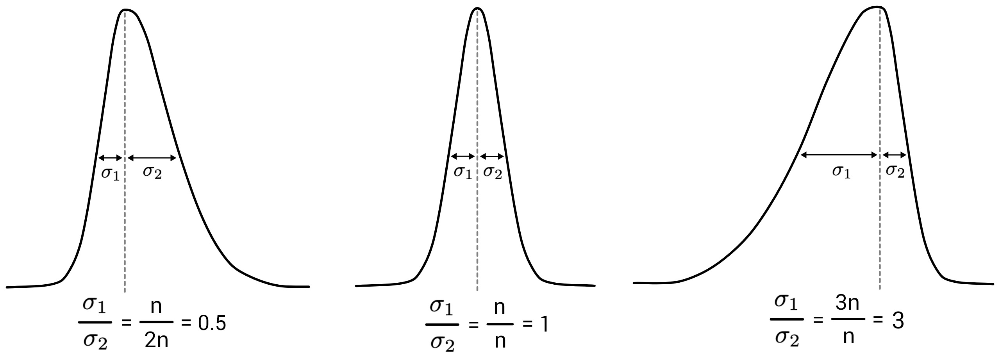
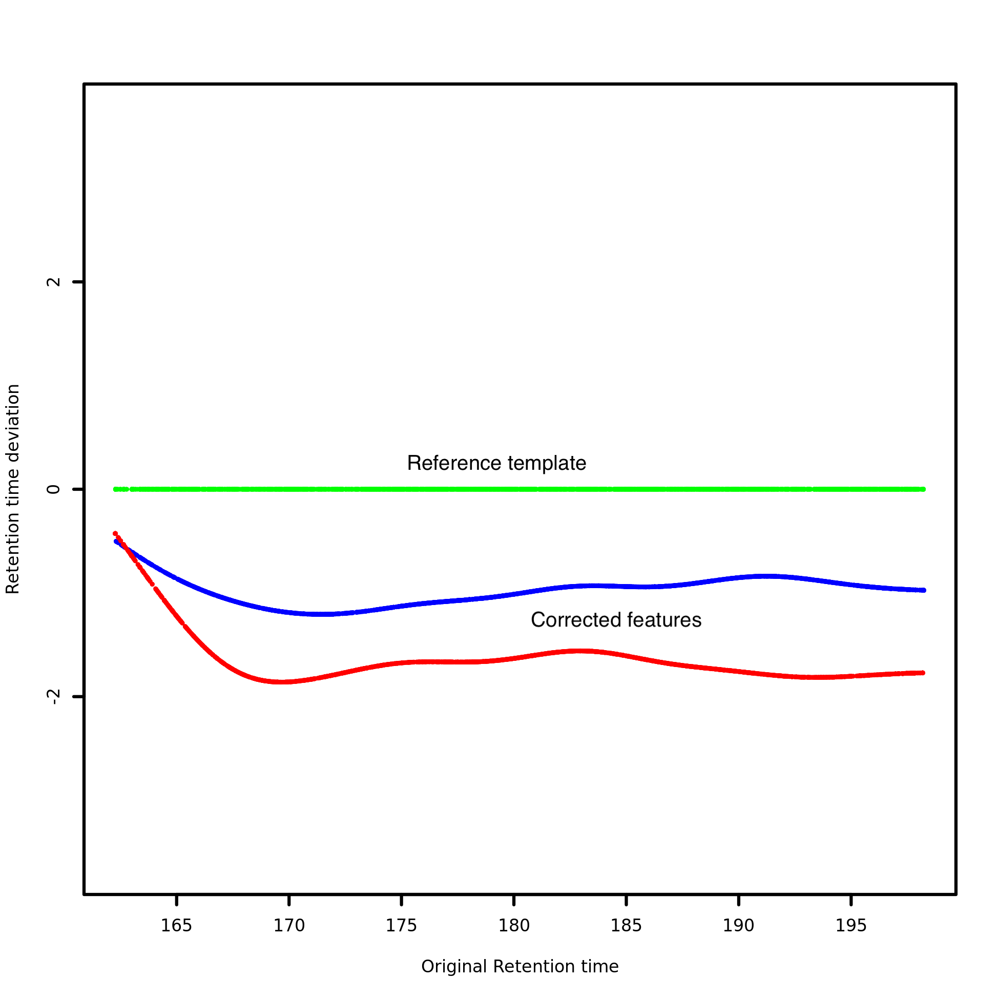

# Introduction
{:.no_toc}

`recetox-aplcms` is a software package designed for the processing of LC/MS based metabolomics data, in particular for peak detection in high resolution mass spectrometry (HRMS) data. 
It supports reading `.mzml` files in raw profile mode and uses a bi-Gaussian chromatographic peak shape () for feature detection and quantification. `recetox-aplcms` is based on the apLCMS R package () and includes various software updates and is actively developed and maintained on GitHub.

There are two major routes of data analysis. The first, which we call **unsupervised** analysis, does not use existing knowledge. It detects peaks de novo from the data based on the data itself. The second, which we call **hybrid** analysis, combines de novo peak detection with existing knowledge. The existing knowledge can come from two sources - known metabolites and historically detected features from the same machinery. While unsupervised approach allows for unbiased exploration and discovery of patterns, hybrid approac integrates prior knowledge or supervised techniques to enhance targeted analysis and interpretation. The choice between these approaches depends on the research objectives, available prior knowledge, and the specific questions being addressed in the metabolomics study.


The workflows consist of the following building blocks:

- **remove noise** - denoise the raw data and extract the EIC
- **generate feature table** - group features in EIC into peaks using peak-shape model
- **compute clusters** - compute mz and rt clusters across samples
- **compute template** - find the template for rt correction
- **correct time** - correct the rt across samples using splines
- **align features** - align identical features across samples
- **recover weaker signals** - recover missed features in samples based on the aligned features
- **merge known table** - add known features to detected features table and vice versa


> ### Agenda
>
> In this tutorial, we will cover:
>
> 1. TOC
> {:toc}
>
{: .agenda}

# Data preparation and prepocessing

## Import the data into Galaxy

> <hands-on-title> Upload data </hands-on-title>
>
> 1. Create a new history for this tutorial
>
>    
>
> 2. Import the files from [Zenodo]({{ page.zenodo_link }}) into a collection:
>
>    ```
>    https://zenodo.org/record/7890956/files/8_qc_no_dil_milliq.raw
>    https://zenodo.org/record/7890956/files/21_qc_no_dil_milliq.raw
>    https://zenodo.org/record/7890956/files/29_qc_no_dil_milliq.raw
>    ```
>
>    
>
> 3. Make sure your data is in a **collection**. You can always manually create the collection from separate files:
>
>    
>
>    In the further steps, this dataset collection will be referred to as `input` (and we recommend naming this collection like that to avoid confusion).
>
> 4. Import the following extra file from [Zenodo]({{ page.zenodo_link }}): TODO
>
>    ```
>    https://gitlab.ics.muni.cz/umsa/umsa-files/-/raw/master/testdata/recetox-aplcms/hybrid/known_table.parquet
>    ```
>
>    
>
>    
> 
>    Please pay attention to the format of the uploaded file, and make sure it is correctly imported.
>
>    
>
>    > <comment-title> The known table </comment-title>
>    >
>    > TODO
>    >
>    {: .comment}
>
{: .hands_on}

## Convert the raw data to mzML

Our input data are in `.raw` format, which is not suitable for the downstream tools in this tutorial. We use the tool  to convert our samples to the appropriate format (`.mzML` in this case).

> <hands-on-title> Convert the raw data to mzML </hands-on-title>
>
> 1.  with the following parameters:
>    -  *"Input unrefined MS data"*: `input` (Input dataset collection)
>    - *"Do you agree to the vendor licenses?"*: `Yes`
>    - *"Output Type"*: `mzML`
>
{: .hands_on}

# Common part

In this first part, recetox-aplcms integrates noise filtering, peak detection and alignment, and statistical analysis to process and extract meaningful information from LC-MS data. To enhance the quality of the data, the tool employs noise filtering techniques to remove false-positive peaks caused by background noise. It applies statistical methods or threshold-based approaches to distinguish true peaks from the oise. Then, recetox-aplcms detects and extracts individual peaks from the noise-free data. It uses an adaptive algorithm that iteratively identifies peaks by considering the local intensity distributions. Once the peaks are detected, they are grouped based on their chromatographic behavior across multiple samples. It aligns the peaks by accounting for variations in retention time, which can occur due to instrument drift or other factors. This is achieved by retention time correction, when the tool estimates retention time shifts based on peak intensities and their alignment patterns, iteratively adjusting the retention time values to minimize misalignment and maximize the alignment of peaks with similar chromatographic behavior. Finally, by considering retention time, m/z values, and peak intensities, recetox-aplcms matches corresponding features, ensuring their accurate alignment and enabling meaningful comparisons.

## Remove noise

This step extracts ion chromatogram (EIC) showing the intensity of only a particular ions of interest over time.
Since the intensity is droping over time in the experiment, we want to normalise this and remove noise from the raw data.
It also performs a first clustering step of points with close m/z values into the extracted ion chromatograms (EICs).

> <details-title> Key parameters </details-title>
> 
> A precise tuning of input parameters is crucial in this step, since it can potentially lead to elimination of some of the data of interest, or, on the other extreme, preservance of some noisy background data:
>
> - **Minimal elution time** - minimal length of elution time of a peak to be actually recognised as a peak. It is closely related to the chromatography method used. Only peaks with greater elution length are kept.
> - **Minimal signal presence** - determines in how many consequent scans do we want to have the signal present. Sometimes the signal from a real feature is not present 100% of the time along the feature's retention time. This parameter sets the threshold for an ion trace to be considered a feature. This parameter is best determined by examining the raw data. For example, if we know a data point shows up only every 3 scans for 10 seconds, this setting can be used ilter it out.
> - **m/z tolerance** - tolerance (in ppm) to determine how far along m/z do two points need to be separated for them to be considered different a different peak. Can be seen as width of m/z peak.
> - **Baseline correction** - intensity cutoff to be used. After grouping the observations, the highest intensity in each group is found. If the highest is lower than this value, the entire group will be deleted.
>
>  and minimal signal presence (min_pres) parameters on input data.")
>
{: .details}

> ###  Hands-on: Remove noise
>
> TODO remove defualt values
>
> 1.  with the following parameters:
>    -  *"Input spectra data"*: `output` (Input dataset collection)
>    - *"Minimal signal presence [fraction of scans]"*: `0.5`
>    - *"Minimal elution time [unit corresponds to the retention time]"*: `12`
>    - *"m/z tolerance [ppm]"*: `10`
>    - *"Baseline correction [unit of signal intensity]"*: `0.0`
>
{: .hands_on}

> ###  Questions
>
> 1. Are there any numerical intervals available for the input parameters?
> 2. Can the data be filtered also on retention time axis?
>
> > ###  Solution
> >
> > 1. All input parameters are instrument-specific, therefore we cannot provide recommended intervals for the values. TODO: isnt min_pres from 0 to 1?
> > 2. Indeed, for this purpose, `Minimal elution time` parameter can be used.
> >
> {: .solution}
>
{: .question}

> <details-title> Parquet format </details-title>
> 
> Output is in the `.parquet` format, which is a binary representation of tabular format. 
This format is used to increase the accuracy of stored values, that would be significantly lower when stored in text format.
>
{: .details}

## Generate feature table

This steps takes the features grouped by m/z from the previous step and detects peaks. The goal is to fit peak shapes in retention time domain to our data, which allows computing precise intensities by integrating the peak area. This step also resolves peak overlaps, by fitting them both as separate peaks. As a consequence of this approach, recetox-aplcms does not work with centroid data since there are no peak shapes anymore, just some "averages" of them.

> <details-title> Key parameters </details-title>
> 
> - **Minimal/maximal standard deviation** - specify the maximum and minimum peak width by selecting allowed range for the standard deviation (both $$\sigma_1$$ and $$\sigma_2$$).
> - **Minimal/maximal sigma ratio** - the lower and upper limit of the ratio between left-standard deviation and the right-standard deviation $$\frac{\sigma_1}{\sigma_2}$$. It represents relative skewness of the peak.
> - **Bandwidth factor** - parameter used to scale down the overall range of retention times (the bandwidth) assumed in the kernel smoother used for peak identification. The value is between zero and one. The minimal and maximal bandwidth can be limited by explicit values. It is used to improve the peak shape by smoothing.
>
> 
>
{: .details}

> ###  Hands-on: Generate feature table
>
> 1.  with the following parameters:
>    -  *"Input profile data"*: `output_file` (output of **recetox-aplcms - remove noise** )
>    - *"Bandwidth factor"*: `0.5`
>    - *"Minimal sigma ratio"*: `0.1`
>    - *"Maximal sigma ratio"*: `2`
>    - *"Standard deviations boundaries"*: `Yes`
>       - *"Minimal standard deviation"*: `0.01`
>       - *"Maximal standard deviation"*: `500.0`
>
{: .hands_on}

> ###  Questions
>
> 1. What is the purpose of fitting the peaks to a shape (in this case bi-Gaussian)?
> 2. Why are there two standard deviations?
>
> > ###  Solution
> >
> > 1. It allows precise computation of the area under the curve and estimating the intensity.
> > 2. Two standard deviations ($$\sigma_1$$ and $$\sigma_2$$) come from bi-Gaussian shape, where both sides of the shape can be different. When these values are equal, we obtain Gaussian shape.
> >
> {: .solution}
>
{: .question}

## Compute clusters

Pre-alignment step where we put all peaks from all samples into a single table and group them based on both m/z and rt. The tool takes a collection of all detected features and computes the clusters over a global feature table, adding the `sample_id` and `cluster` (shared across samples) columns to the table. This process is parametrised by influencing the "size" of buckets (clusters) using relative m/z tolerance and retention time tolerance.

> <details-title> Clustering algorithm details </details-title>
> 
> Features are first grouped in m/z dimension based on the relative m/z tolerance. Then, the absolute tolerance is computed for each feature, then a new group is separated once the difference between consecutive features is above this threshold. The same process is then repeated for the retention time dimension. The individual indices are then combined into a single index in the `cluster` columns.
> 
>  and rt groups (blue). Cluster is the same only when these two groups overlap (green).")
> 
{: .details}

> ###  Hands-on: Compute clusters
>
> 1.  with the following parameters:
>    -  *"Input data"*: `output_file` (output of **recetox-aplcms - generate feature table** )
>    - *"Relative m/z tolerance [ppm]"*: `10`
>    - *"Retention time tolerance [unit corresponds to the retention time]"*: `5.0`
>
{: .hands_on}

> ###  Questions
>
> 1. Can we influence the clustering sensitivity w.r.t. retention time?
>
> > ###  Solution
> >
> > 1. Yes, use retention time tolerance parameter can be used for this purpose.
> >
> {: .solution}
>
{: .question}

Output is again separated to a collecton of individual tables, but with assigned `cluster`.

## Compute template

To continue with further steps, we need a template into which we can align the data - this means a peak table which has the highest number of features, consequently giving us the highest number of reference points we fit our curve to. This step can be potentially skipped if you want to select a template manually or provide a custom file used in further steps.

**TODO** add hint how to select single file from collection as input for a tool

> ###  Hands-on: Compute template
>
> 1.  with the following parameters:
>    -  *"Input data"*: `clustered_feature_tables` (output of **recetox-aplcms - compute clusters** )
>
{: .hands_on}

## Correct time

We need our previously clustered features and selected template.
Apply spline-based retention time correction to a feature table given the template table and the mz and rt tolerances.

> <details-title> Retention time correction effects </details-title>
> 
> **TODO** explain effect of time correction
>
> **TODO** Change picture where we actually see how rt of targeted sample is shifted based on template
>
> 
>
{: .details}

> ###  Hands-on: Correct time
>
> 1.  with the following parameters:
>    -  *"Input clustered features table"*: `clustered_feature_tables` (output of **recetox-aplcms - compute clusters** )
>    -  *"Input template features table"*: `output_file` (output of **recetox-aplcms - compute template** )
>    - *"Relative m/z tolerance [ppm]"*: `10`
>    - *"Retention time tolerance [unit corresponds to the retention time]"*: `5.0`
>
{: .hands_on}

***TODO***: *Consider adding a question to test the learners understanding of the previous exercise*

> ###  Questions
>
> 1. Question1?
> 2. Question2?
>
> > ###  Solution
> >
> > 1. Answer for question1
> > 2. Answer for question2
> >
> {: .solution}
>
{: .question}

## Compute clusters (2nd round) 

After we have aligned the retention time of our samples, we need to run second round of clustering to reflect introduced changes. 

> ###  Steps iteration
>
> Note that the outputs and inputs of the previous steps are compatible, making it possible to iterativelly combine these steps multiple times, until desired quality of results is achieved.
{: .comment}

> ###  Hands-on: Task description
>
> 1.  with the following parameters:
>    -  *"Input data"*: `output_file` (output of **recetox-aplcms - correct time** )
>    - *"Relative m/z tolerance [ppm]"*: `10`
>    - *"Retention time tolerance [unit corresponds to the retention time]"*: `5.0`
>
{: .hands_on}

***TODO***: *Consider adding a question to test the learners understanding of the previous exercise*

> ###  Questions
>
> 1. What already used step could we use next? What would be its effects? 
> 2. Question2?
>
> > ###  Solution
> >
> > 1. Answer for question1
> > 2. Answer for question2
> >
> {: .solution}
>
{: .question}

## Features alignment

This step performs feature alignment after clustering and retention time correction. The peaks clustered across samples are grouped based on the given tolerances to create an aligned feature table, connecting identical features across samples. Among tolerances, the `Minimal occurrence in samples` parameter can be used to control in at least how many samples a feature has to be detected in order to be included in the aligned feature table.  This allows us to preserve only peaks that appear really consistenly across the samples.

> <details-title> Algorithm details </details-title>
> 
> **TODO** explain in details.
>
> **TODO** add picture?
> 
{: .details}

> ###  Hands-on: Align features
>
> 1.  with the following parameters:
>    -  *"Clustered features"*: `clustered_feature_tables` (output of **recetox-aplcms - compute clusters** )
>    - *"Relative m/z tolerance [ppm]"*: `10`
>    - *"Retention time tolerance [unit corresponds to the retention time]"*: `5.0`
>    - *"Minimal occurrence in samples"*: `2`
>
{: .hands_on}

***TODO***: *Consider adding a question to test the learners understanding of the previous exercise*

> ###  Questions
>
> 1. Question1?
> 2. Question2?
>
> > ###  Solution
> >
> > 1. Answer for question1
> > 2. Answer for question2
> >
> {: .solution}
>
{: .question}

> <details-title> Output files </details-title>
> 
> The output consists of three tables. All tables share `id` column.
>
> #### Metadata Table
>
> Contains all quantitative data related to specific peaks that have been detected (mean m/z and rt with their maximal and minimal values). The `npeaks` column denotes the number of peaks which have been grouped into this feature. The columns with the sample names indicate whether this feature is present in the sample.
> 
> > |  id   | mz           |  mzmin       |  mzmax        |  rt            |  rtmin        |  rtmax        |   npeaks  |  21_qc_no_dil_milliq   |  29_qc_no_dil_milliq   |  8_qc_no_dil_milliq    |
> > |-------|--------------|--------------|---------------|----------------|---------------|---------------|-----------|------------------------|------------------------|------------------------|
> > |  1    | 70.03707021  |  70.037066   |  70.0370750   |  294.1038014   |  294.0634942  |  294.149985   |   3       |  1                     |  1                     |  1                     |
> > |  2    | 70.06505677  |  70.065045   |  70.0650676   |  141.9560055   |  140.5762528  |  143.335758   |   2       |  1                     |  0                     |  1                     |
> > |  57   | 78.04643252  |  78.046429   |  78.0464325   |  294.0063397   |  293.9406777  |  294.072001   |   2       |  1                     |  1                     |  0                     |
> > |  ...  | ...          |   ...        |  ...          |  ...           |  ...          |  ...          |   ...     |  ...                   |  ...                   |  ...                   |
> {: .matrix}
> 
> #### Intensity Table
> 
> This table contains the peak area for aligned features in all samples.
> 
> > |  id   |  21_qc_no_dil_milliq   |  29_qc_no_dil_milliq   |  8_qc_no_dil_milliq    |
> > |-------|------------------------|------------------------|------------------------|
> > |  1    |  13187487.20482895     |  7957395.699119729     |  11700594.397257797    |
> > |  2    |  2075168.6398983458    |  0                     |  2574362.159289044     |
> > |  57   |  2934524.4406785755    |  1333044.5065971944    |  0                     |
> > |  ...  |  ...                   |  ...                   |  ...                   |
> {: .matrix}
> 
> #### Retention Time Table
> 
> This table contains the retention times for all aligned features in all samples.
>
> > |  id   |  21_qc_no_dil_milliq   |  29_qc_no_dil_milliq   |  8_qc_no_dil_milliq    |
> > |-------|------------------------|------------------------|------------------------|
> > |  1    |  294.09792478513236    |  294.1499853056912     |  294.0634942428341     |
> > |  2    |  140.57625284242982    |  0                     |  143.33575827589172    |
> > |  57   |  294.07200187644435    |  293.9406777222317     |  0                     |
> > |  ...  |  ...                   |  ...                   |  ...                   |
> {: .matrix}
>
{: .details}

> ###  Next steps
>
> At this point, there are two alternative routes how to continue - you can use [unsupervised]({{ site.baseurl }}/topics/metabolomics/tutorials/gc_ms_with_aplcms/tutorial.html#unsupervised) approach (use no existing knowledge, detects peaks de novo from the data based on the data itself) or [hybrid]({{ site.baseurl }}/topics/metabolomics/tutorials/gc_ms_with_aplcms/tutorial.html#hybrid) approach (combine de novo peak detection with existing knowledge).
> 
{: .comment}

# Unsupervised

Unsupervised approach focuses on exploring and discovering patterns in the data without prior knowledge or assumptions. This method employes techniques such as dimensionality reduction and clustering to reveal inherent structures and relationships within the metabolite profiles. Unsupervised approach is useful when the specific patterns or classes within the data are not known beforehand, allowing for unbiased exploration of the data and potential identification of novel patterns or subgroups. However, unsupervised approach may require additional validation and annotation steps to assign biological meaning to the discovered patterns.

> <details-title> Gaps </details-title>
> 
> Our tables have many gaps, some features weren't detected in some samples... but it doesn't mean they actually aren't there... so we revisit the data trying to recover them, we do another round of peak picking without any noise filtering, but only on specific place (specified by m/z and rt ranges from already analysed data)
>
> **TODO** show example of table with many gaps, comment on them
>
{: .details}

## Recover weaker signals

This step recovers features which are present in a sample but might have been filtered out initially as noise due to low signal intensity. It runs the second stage peak detection based on the aligned feature table from the feature alignment step. If a feature is contained in the aligned feature table, this step revisits the raw data and searches for this feature at the retention time obtained by mapping the corrected retention time back to the original sample.

> <details-title> Key parameters </details-title>
> 
> Since most of the previous steps are run again, also their parameters are repeated, giving the opportunity to set them more or less strict.
>
> Besides them, there is parameter `Minimal count to recover`, allowing to set the minimum number of raw data points to be considered as a true feature.
>
{: .details}

> ###  Hands-on: Recover weaker signals
>
> 1.  with the following parameters:
>    -  *"Input spectra data"*: `output` (Input dataset collection)
>    -  *"Input extracted feature samples collection"*: `output_file` (output of **recetox-aplcms - generate feature table** )
>    -  *"Input corrected feature samples collection"*: `output_file` (output of **recetox-aplcms - correct time** )
>    -  *"Metadata table"*: `metadata_file` (output of **recetox-aplcms - align features** )
>    -  *"RT table"*: `rt_file` (output of **recetox-aplcms - align features** )
>    -  *"Intensity table"*: `intensity_file` (output of **recetox-aplcms - align features** )
>    - *"Relative m/z tolerance [ppm]"*: `10`
>    - *"Retention time tolerance [unit corresponds to the retention time]"*: `5.0`
>    - *"m/z tolerance [ppm]"*: `10`
>    - *"Minimal count to recover"*: `3`
>    - *"Bandwidth factor"*: `0.5`
>
{: .hands_on}

***TODO***: *Consider adding a question to test the learners understanding of the previous exercise*

> ###  Questions
>
> 1. Question1?
> 2. Question2?
>
> > ###  Solution
> >
> > 1. Answer for question1
> > 2. Answer for question2
> >
> {: .solution}
>
{: .question}

## Compute clusters (3rd round)

We might have added new features, so we do the clustering again.

> ###  Hands-on: Compute clusters
>
> 1.  with the following parameters:
>    -  *"Input data"*: `output_file` (output of **recetox-aplcms - recover weaker signals** )
>    - *"Relative m/z tolerance [ppm]"*: `10`
>    - *"Retention time tolerance [unit corresponds to the retention time]"*: `5.0`
>
{: .hands_on}

***TODO***: *Consider adding a question to test the learners understanding of the previous exercise*

> ###  Questions
>
> 1. Question1?
> 2. Question2?
>
> > ###  Solution
> >
> > 1. Answer for question1
> > 2. Answer for question2
> >
> {: .solution}
>
{: .question}

## Features alignment (2nd round)

Features can now appear in more samples then before, so we also need to repeat the alignment step.

> ###  Steps iteration
>
> These steps can be potentially again repeated and combined (as well as for example combined with retention time correction if neccesary) in arbitrary number of iterations.
>
{: .comment}

> ###  Hands-on: Align features
>
> 1.  with the following parameters:
>    -  *"Clustered features"*: `clustered_feature_tables` (output of **recetox-aplcms - compute clusters** ))
>    - *"Relative m/z tolerance [ppm]"*: `10`
>    - *"Retention time tolerance [unit corresponds to the retention time]"*: `5.0`
>    - *"Minimal occurrence in samples"*: `2`
>
{: .hands_on}

***TODO***: *Consider adding a question to test the learners understanding of the previous exercise*

> ###  Questions
>
> 1. Question1?
> 2. Question2?
>
> > ###  Solution
> >
> > 1. Answer for question1
> > 2. Answer for question2
> >
> {: .solution}
>
{: .question}

***TODO*** more explanation of the outputs? comparision with pre-recovered data?

# Hybrid

Hybrid approach combines unsupervised techniques with supervised or targeted methods. This approach incorporates external information, such as known metabolic pathways or class labels, to guide the analysis and interpretation of the data. Hybrid approach may leverage prior knowledge to enhance the detection and interpretation of specific metabolite classes, pathways, or biomarkers of interest. Hybrid approach is particularly valuable when there is prior knowledge available or when targeted analysis is desired.

## Merge known table

> <details-title> Example </details-title>
> 
> **TODO** show both tables and how they are merged
>
{: .details}

> ###  Hands-on: Merge known table
>
> 1.  with the following parameters:
>    -  *"Metadata table"*: `metadata_file` (output of **recetox-aplcms - align features** )
>    -  *"RT table"*: `rt_file` (output of **recetox-aplcms - align features** )
>    -  *"Intensity table"*: `intensity_file` (output of **recetox-aplcms - align features** )
>    -  *"Table of known features"*: `output` (Input dataset)
>    - *"Relative m/z tolerance [ppm]"*: `10`
>    - *"Retention time tolerance [unit corresponds to the retention time]"*: `5.0`
>    - *"Tables merge direction"*: `Merge known table to features`
>
{: .hands_on}

***TODO***: *Consider adding a question to test the learners understanding of the previous exercise*

> ###  Questions
>
> 1. Question1?
> 2. Question2?
>
> > ###  Solution
> >
> > 1. Answer for question1
> > 2. Answer for question2
> >
> {: .solution}
>
{: .question}

## Recover weaker signals

> ###  Hands-on: Recover weaker signals
>
> 1.  with the following parameters:
>    -  *"Input spectra data"*: `output` (Input dataset collection)
>    -  *"Input extracted feature samples collection"*: `output_file` (output of **recetox-aplcms - generate feature table** )
>    -  *"Input corrected feature samples collection"*: `output_file` (output of **recetox-aplcms - correct time** )
>    -  *"Metadata table"*: `output_metadata_file` (output of **recetox-aplcms - merge known table** )
>    -  *"RT table"*: `output_rt_file` (output of **recetox-aplcms - merge known table** )
>    -  *"Intensity table"*: `output_intensity_file` (output of **recetox-aplcms - merge known table** )
>    - *"Relative m/z tolerance [ppm]"*: `10`
>    - *"Retention time tolerance [unit corresponds to the retention time]"*: `5.0`
>    - *"m/z tolerance [ppm]"*: `10`
>    - *"Minimal count to recover"*: `3`
>    - *"Bandwidth factor"*: `0.5`
>
{: .hands_on}

***TODO***: *Consider adding a question to test the learners understanding of the previous exercise*

> ###  Questions
>
> 1. Question1?
> 2. Question2?
>
> > ###  Solution
> >
> > 1. Answer for question1
> > 2. Answer for question2
> >
> {: .solution}
>
{: .question}

## Compute clusters (3rd round)

> ###  Hands-on: Compute clusters
>
> 1.  with the following parameters:
>    -  *"Input data"*: `output_file` (output of **recetox-aplcms - recover weaker signals** )
>    - *"Relative m/z tolerance [ppm]"*: `10`
>    - *"Retention time tolerance [unit corresponds to the retention time]"*: `5.0`
>
{: .hands_on}

***TODO***: *Consider adding a question to test the learners understanding of the previous exercise*

> ###  Questions
>
> 1. Question1?
> 2. Question2?
>
> > ###  Solution
> >
> > 1. Answer for question1
> > 2. Answer for question2
> >
> {: .solution}
>
{: .question}

## Compute template (2nd round)

> ###  Hands-on: Compute template
>
> 1.  with the following parameters:
>    -  *"Input data"*: `clustered_feature_tables` (output of **recetox-aplcms - compute clusters** )
>
{: .hands_on}

***TODO***: *Consider adding a question to test the learners understanding of the previous exercise*

> ###  Questions
>
> 1. Question1?
> 2. Question2?
>
> > ###  Solution
> >
> > 1. Answer for question1
> > 2. Answer for question2
> >
> {: .solution}
>
{: .question}

## Correct time (2nd round)

> ###  Hands-on: Correct time
>
> 1.  with the following parameters:
>    -  *"Input clustered features table"*: `clustered_feature_tables` (output of **recetox-aplcms - compute clusters** )
>    -  *"Input template features table"*: `output_file` (output of **recetox-aplcms - compute template** )
>    - *"Relative m/z tolerance [ppm]"*: `10`
>    - *"Retention time tolerance [unit corresponds to the retention time]"*: `5.0`
>
{: .hands_on}

***TODO***: *Consider adding a question to test the learners understanding of the previous exercise*

> ###  Questions
>
> 1. Question1?
> 2. Question2?
>
> > ###  Solution
> >
> > 1. Answer for question1
> > 2. Answer for question2
> >
> {: .solution}
>
{: .question}

## Compute clusters (4th round)

> ###  Hands-on: Compute clusters
>
> 1.  with the following parameters:
>    -  *"Input data"*: `output_file` (output of **recetox-aplcms - correct time** )
>    - *"Relative m/z tolerance [ppm]"*: `10`
>    - *"Retention time tolerance [unit corresponds to the retention time]"*: `5.0`
>
{: .hands_on}

***TODO***: *Consider adding a question to test the learners understanding of the previous exercise*

> ###  Questions
>
> 1. Question1?
> 2. Question2?
>
> > ###  Solution
> >
> > 1. Answer for question1
> > 2. Answer for question2
> >
> {: .solution}
>
{: .question}

## Features alignment (2nd round)

> ###  Hands-on: Align features
>
> 1.  with the following parameters:
>    -  *"Clustered features"*: `clustered_feature_tables` (output of **recetox-aplcms - compute clusters** )
>    - *"Relative m/z tolerance [ppm]"*: `10`
>    - *"Retention time tolerance [unit corresponds to the retention time]"*: `5.0`
>    - *"Minimal occurrence in samples"*: `2`
>
{: .hands_on}

***TODO***: *Consider adding a question to test the learners understanding of the previous exercise*

> ###  Questions
>
> 1. Question1?
> 2. Question2?
>
> > ###  Solution
> >
> > 1. Answer for question1
> > 2. Answer for question2
> >
> {: .solution}
>
{: .question}

## Merge known table (2nd round)

> <details-title> Example </details-title>
> 
> **TODO** show both tables and how they are merged
>
{: .details}

> ###  Hands-on: Merge known table
>
> 1.  with the following parameters:
>    -  *"Metadata table"*: `metadata_file` (output of **recetox-aplcms - align features** )
>    -  *"RT table"*: `rt_file` (output of **recetox-aplcms - align features** )
>    -  *"Intensity table"*: `intensity_file` (output of **recetox-aplcms - align features** )
>    -  *"Table of known features"*: `output` (Input dataset)
>    - *"Relative m/z tolerance [ppm]"*: `10`
>    - *"Retention time tolerance [unit corresponds to the retention time]"*: `5.0`
>    - *"Tables merge direction"*: `Merge features to known table`
>       - *"new_feature_min_count"*: `2`
>
{: .hands_on}

***TODO***: *Consider adding a question to test the learners understanding of the previous exercise*

> ###  Questions
>
> 1. Question1?
> 2. Question2?
>
> > ###  Solution
> >
> > 1. Answer for question1
> > 2. Answer for question2
> >
> {: .solution}
>
{: .question}

# Conclusion
{:.no_toc}

Sum up the tutorial and the key takeaways here. We encourage adding an overview image of the
pipeline used.