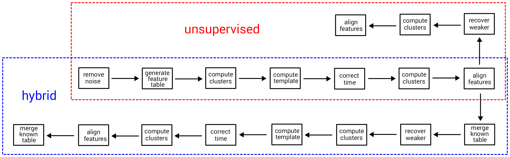
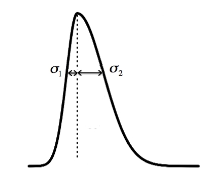

# Introduction
{:.no_toc}

`recetox-aplcms` is a software package designed for the processing of LC/MS based metabolomics data, in particular for peak detection in high resolution mass spectrometry (HRMS) data. 
It supports reading `.mzml` files in raw profile mode and uses a bi-Gaussian chromatographic peak shape () for feature detection and quantification. `recetox-aplcms` is based on the apLCMS R package () and includes various software updates and is actively developed and maintained on GitHub.

There are two major routes of data analysis. The first, which we call **unsupervised** analysis, does not use existing knowledge. It detects peaks de novo from the data based on the data itself. The second, which we call **hybrid** analysis, combines de novo peak detection with existing knowledge. The existing knowledge can come from two sources - known metabolites and historically detected features from the same machinery.



The workflows consist of the following building blocks:

- **remove noise** - denoise the raw data and extract the EIC
- **generate feature table** - group features in EIC into peaks using peak-shape model
- **compute clusters** - compute mz and rt clusters across samples
- **compute template** - find the template for rt correction
- **correct time** - correct the rt across samples using splines
- **align features** - align identical features across samples
- **recover weaker signals** - recover missed features in samples based on the aligned features
- **merge known table** - add known features to detected features table and vice versa


> ### Agenda
>
> In this tutorial, we will cover:
>
> 1. TOC
> {:toc}
>
{: .agenda}

# Data preparation and prepocessing

## Import the data into Galaxy

> <hands-on-title> Upload data </hands-on-title>
>
> 1. Create a new history for this tutorial
>
>    
>
> 2. Import the files from [Zenodo]({{ page.zenodo_link }}) into a collection:
>
>    ```
>    https://zenodo.org/record/7890956/files/8_qc_no_dil_milliq.raw
>    https://zenodo.org/record/7890956/files/21_qc_no_dil_milliq.raw
>    https://zenodo.org/record/7890956/files/29_qc_no_dil_milliq.raw
>    ```
>
>    
>
> 3. Make sure your data is in a **collection**. You can always manually create the collection from separate files:
>
>    
>
>    In the further steps, this dataset collection will be referred to as `input` (and we recommend naming this collection like that to avoid confusion).
>
> 4. Import the following extra file from [Zenodo]({{ page.zenodo_link }}): TODO
>
>    ```
>    https://gitlab.ics.muni.cz/umsa/umsa-files/-/raw/master/testdata/recetox-aplcms/hybrid/known_table.parquet
>    ```
>
>    
>
>    
> 
>    Please pay attention to the format of the uploaded file, and make sure it is correctly imported.
>
>    
>
>    > <comment-title> The known table </comment-title>
>    >
>    > TODO
>    >
>    {: .comment}
>
{: .hands_on}

## Convert the raw data to mzML

Our input data are in `.raw` format, which is not suitable for the downstream tools in this tutorial. We use the tool  to convert our samples to the appropriate format (`.mzML` in this case).

> <hands-on-title> Convert the raw data to mzML </hands-on-title>
>
> 1.  with the following parameters:
>    -  *"Input unrefined MS data"*: `input` (Input dataset collection)
>    - *"Do you agree to the vendor licenses?"*: `Yes`
>    - *"Output Type"*: `mzML`
>
{: .hands_on}

# Common part

TODO

## Remove noise

This step extracts ion chromatogram (EIC) showing the intensity of only a particular ions of interest over time.
Since the intensity is droping over time in the experiment, we want to normalise this and remove noise from the raw data.
It also performs a first clustering step of points with close m/z values into the extracted ion chromatograms (EICs).

> <details-title> Key parameters </details-title>
> 
> A precise tuning of input parameters is crucial in this step, since it can potentially lead to elimination of some of the data of interest, or, on the other extreme, preservance of some noisy background data:
>
> - **Minimal elution time** - minimal length of elution time of a peak to be actually recognised as a peak. It is closely related to the chromatography method used. Only peaks with greater elution length are kept.
> - **Minimal signal presence** - determines in how many consequent scans do we want to have the signal present. Sometimes the signal from a real feature is not present 100% of the time along the feature's retention time. This parameter sets the threshold for an ion trace to be considered a feature. This parameter is best determined by examining the raw data. For example, if we know a data point shows up only every 3 scans for 10 seconds, this setting can be used ilter it out.
> - **m/z tolerance** - tolerance (in ppm) to determine how far along m/z do two points need to be separated for them to be considered different a different peak. Can be seen as width of m/z peak.
> - **Baseline correction** - intensity cutoff to be used. After grouping the observations, the highest intensity in each group is found. If the highest is lower than this value, the entire group will be deleted.
>
>  and minimal signal presence (min_pres) parameters on input data.")
>
{: .details}

> ###  Hands-on: Remove noise
>
> TODO remove defualt values
>
> 1.  with the following parameters:
>    -  *"Input spectra data"*: `output` (Input dataset collection)
>    - *"Minimal signal presence [fraction of scans]"*: `0.5`
>    - *"Minimal elution time [unit corresponds to the retention time]"*: `12`
>    - *"m/z tolerance [ppm]"*: `10`
>    - *"Baseline correction [unit of signal intensity]"*: `0.0`
>
{: .hands_on}

> ###  Questions
>
> 1. Are there any numerical intervals available for the input parameters?
> 2. Can the data be filtered also on retention time axis?
>
> > ###  Solution
> >
> > 1. All input parameters are instrument-specific, therefore we cannot provide recommended intervals for the values. TODO: isnt min_pres from 0 to 1?
> > 2. Indeed, for this purpose, `Minimal elution time` parameter can be used.
> >
> {: .solution}
>
{: .question}

> <details-title> Parquet format </details-title>
> 
> Output is in the `.parquet` format, which is a binary representation of tabular format. 
This format is used to increase the accuracy of stored values, that would be significantly lower when stored in text format.
>
{: .details}

## Generate feature table

This steps takes the features grouped by m/z from the previous step and detects peaks. The goal is to fit peak shapes in retention time domain to our data, which allows computing precise intensities by integrating the peak area. This step also resolves peak overlaps, by fitting them both as separate peaks. As a consequence of this approach, recetox-aplcms does not work with centroid data since there are no peak shapes anymore, just some "averages" of them.

> <details-title> Key parameters </details-title>
> 
> - **Minimal/maximal standard deviation** - specify the maximum and minimum peak width by selecting allowed range for the standard deviation (both $$\sigma_1$$ and $$\sigma_2$$).
> - **Minimal/maximal sigma ratio** - the lower and upper limit of the ratio between left-standard deviation and the right-standard deviation $$\frac{\sigma_1}{\sigma_2}$$. It represents relative skewness of the peak.
> - **Bandwidth factor** - parameter used to scale down the overall range of retention times (the bandwidth) assumed in the kernel smoother used for peak identification. The value is between zero and one. The minimal and maximal bandwidth can be limited by explicit values. It is used to improve the peak shape by smoothing.
>
> 
>
{: .details}

> ###  Hands-on: Generate feature table
>
> 1.  with the following parameters:
>    -  *"Input profile data"*: `output_file` (output of **recetox-aplcms - remove noise** )
>
{: .hands_on}

> ###  Questions
>
> 1. What is the purpose of fitting the peaks to a shape (in this case bi-Gaussian)?
> 2. Why are there two standard deviations?
>
> > ###  Solution
> >
> > 1. It allows precise computation of the area under the curve and estimating the intensity.
> > 2. Two standard deviations ($$\sigma_1$$ and $$\sigma_2$$) come from bi-Gaussian shape, where both sides of the shape can be different. When these values are equal, we obtain Gaussian shape.
> >
> {: .solution}
>
{: .question}

## Compute clusters

Pre-alignment step where we put all peaks from all samples into a single table and group them based on bth m/z and rt. The tool takes a collection of all detected features and computes the clusters over a global feature table, adding the `sample_id` and `cluster_id` (shared across samples) columns to the table. This process is parametrised by influencing the "size" of buckets (clusters) using relative m/z tolerance and retention time tolerance.

> <details-title> Clustering algorithm details </details-title>
> 
> Features are first grouped in m/z dimension based on the relative m/z tolerance. Then, the absolute tolerance is computed for each feature, then a new group is separated once the difference between consecutive features is above this threshold. The same process is then repeated for the retention time dimension. The individual indices are then combined into a single index in the `cluster_id` columns.
>
{: .details}

> ###  Hands-on: Compute clusters
>
> 1.  with the following parameters:
>    -  *"Input data"*: `output_file` (output of **recetox-aplcms - generate feature table** )
>
{: .hands_on}

> ###  Questions
>
> 1. Can we influence the clustering sensitivity w.r.t. retention time?
>
> > ###  Solution
> >
> > 1. Yes, use retention time tolerance parameter can be used for this purpose.
> >
> {: .solution}
>
{: .question}

Output is again separated to a collecton of individual tables, but with assigned `cluster_id`.

## Compute template

To continue with further steps, we need a template into which we can align the data - this means a peak table which has the highest number of features, consequently giving us the highest number of reference points we fit our curve to. This step can be potentially skipped if you want to select a template manually or provide a custom file used in further steps.

**TODO** add hint how to select single file from collection as input for a tool

> ###  Hands-on: Compute template
>
> 1.  with the following parameters:
>    -  *"Input data"*: `clustered_feature_tables` (output of **recetox-aplcms - compute clusters** )
>
{: .hands_on}

## Correct time

We need our previously clustered features, selected template and tolerances.
Apply spline-based retention time correction to a feature table given the template table and the mz and rt tolerances.

**TODO** add picture depicting effect of time correction?

> ###  Hands-on: Correct time
>
> 1.  with the following parameters:
>    -  *"Input clustered features table"*: `clustered_feature_tables` (output of **recetox-aplcms - compute clusters** )
>    -  *"Input template features table"*: `output_file` (output of **recetox-aplcms - compute template** )
>
{: .hands_on}

***TODO***: *Consider adding a question to test the learners understanding of the previous exercise*

> ###  Questions
>
> 1. Question1?
> 2. Question2?
>
> > ###  Solution
> >
> > 1. Answer for question1
> > 2. Answer for question2
> >
> {: .solution}
>
{: .question}

## Sub-step with **recetox-aplcms - compute clusters**

second round of grouping... comment on how you can iterativelly combine this steps multiple times, since you still get the same format of outputs etc.

> ###  Hands-on: Task description
>
> 1.  with the following parameters:
>    -  *"Input data"*: `output_file` (output of **recetox-aplcms - correct time** )
>    - *"Tolerances input method"*: `file`
>        -  *"Input tolerances values"*: `tolerances` (output of **recetox-aplcms - compute clusters** )
>
>    ***TODO***: *Check parameter descriptions*
>
>    ***TODO***: *Consider adding a comment or tip box*
>
>    > ###  Comment
>    >
>    > A comment about the tool or something else. This box can also be in the main text
>    {: .comment}
>
{: .hands_on}

***TODO***: *Consider adding a question to test the learners understanding of the previous exercise*

> ###  Questions
>
> 1. Question1?
> 2. Question2?
>
> > ###  Solution
> >
> > 1. Answer for question1
> > 2. Answer for question2
> >
> {: .solution}
>
{: .question}

## Sub-step with **recetox-aplcms - align features**

kernel density alignment

- `min_occurrence` - how many samples does the feature need to be present in... This way we can filter peaks that appear really consistenly across the samples.

> ###  Hands-on: Task description
>
> 1.  with the following parameters:
>    -  *"Clustered features"*: `clustered_feature_tables` (output of **recetox-aplcms - compute clusters** )
>    -  *"Input tolerances values"*: `tolerances` (output of **recetox-aplcms - compute clusters** )
>
>    ***TODO***: *Check parameter descriptions*
>
>    ***TODO***: *Consider adding a comment or tip box*
>
>    > ###  Comment
>    >
>    > A comment about the tool or something else. This box can also be in the main text
>    {: .comment}
>
{: .hands_on}

***TODO***: *Consider adding a question to test the learners understanding of the previous exercise*

> ###  Questions
>
> 1. Question1?
> 2. Question2?
>
> > ###  Solution
> >
> > 1. Answer for question1
> > 2. Answer for question2
> >
> {: .solution}
>
{: .question}

Outputs:
- rt_table - rt for all samples for our features
- intensity_table - intensities for all samples
- peak_metadata - all data related to specific peaks that have been detected (enumerate columns), number of peaks that have been grouped together... 

# Unsupervised

**TODO** somehow inspect tables, comment on many gaps

## Sub-step with **recetox-aplcms - recover weaker signals**

Our tables have many gaps, some features weren't detected in some samples... but it doesn't mean they actually aren't there... so we revisit the data trying to recover them, we do another round of peak picking without any noise filtering, but only on specific place (specified by m/z and rt ranges from already analysed data)

- `recover_min_count` - how many data points need to be there to consider them a peak
- `bandwidth` - again the same for smoothing

> ###  Hands-on: Task description
>
> 1.  with the following parameters:
>    -  *"Input spectra data"*: `output` (Input dataset collection)
>    -  *"Input extracted feature samples collection"*: `output_file` (output of **recetox-aplcms - generate feature table** )
>    -  *"Input corrected feature samples collection"*: `output_file` (output of **recetox-aplcms - correct time** )
>    -  *"Metadata table"*: `metadata_file` (output of **recetox-aplcms - align features** )
>    -  *"RT table"*: `rt_file` (output of **recetox-aplcms - align features** )
>    -  *"Intensity table"*: `intensity_file` (output of **recetox-aplcms - align features** )
>    -  *"Input tolerances values"*: `tolerances` (output of **recetox-aplcms - compute clusters** )
>
>    ***TODO***: *Check parameter descriptions*
>
>    ***TODO***: *Consider adding a comment or tip box*
>
>    > ###  Comment
>    >
>    > A comment about the tool or something else. This box can also be in the main text
>    {: .comment}
>
{: .hands_on}

***TODO***: *Consider adding a question to test the learners understanding of the previous exercise*

> ###  Questions
>
> 1. Question1?
> 2. Question2?
>
> > ###  Solution
> >
> > 1. Answer for question1
> > 2. Answer for question2
> >
> {: .solution}
>
{: .question}

## Sub-step with **recetox-aplcms - compute clusters**

We might have added new features, so we do the clustering again.

> ###  Hands-on: Task description
>
> 1.  with the following parameters:
>    -  *"Input data"*: `output_file` (output of **recetox-aplcms - recover weaker signals** )
>    - *"Tolerances input method"*: `direct`
>
>    ***TODO***: *Check parameter descriptions*
>
>    ***TODO***: *Consider adding a comment or tip box*
>
>    > ###  Comment
>    >
>    > A comment about the tool or something else. This box can also be in the main text
>    {: .comment}
>
{: .hands_on}

***TODO***: *Consider adding a question to test the learners understanding of the previous exercise*

> ###  Questions
>
> 1. Question1?
> 2. Question2?
>
> > ###  Solution
> >
> > 1. Answer for question1
> > 2. Answer for question2
> >
> {: .solution}
>
{: .question}

## Sub-step with **recetox-aplcms - align features**

Features can now appear in more samples, so we also repeat the alignment step.

These steps can be potentially again repeated and combined (as well as for example combined with retention time correction) in arbitrary number of iterations.

> ###  Hands-on: Task description
>
> 1.  with the following parameters:
>    -  *"Clustered features"*: `clustered_feature_tables` (output of **recetox-aplcms - compute clusters** )
>    -  *"Input tolerances values"*: `tolerances` (output of **recetox-aplcms - compute clusters** )
>
>    ***TODO***: *Check parameter descriptions*
>
>    ***TODO***: *Consider adding a comment or tip box*
>
>    > ###  Comment
>    >
>    > A comment about the tool or something else. This box can also be in the main text
>    {: .comment}
>
{: .hands_on}

***TODO***: *Consider adding a question to test the learners understanding of the previous exercise*

> ###  Questions
>
> 1. Question1?
> 2. Question2?
>
> > ###  Solution
> >
> > 1. Answer for question1
> > 2. Answer for question2
> >
> {: .solution}
>
{: .question}

# Hybrid

## Sub-step with **recetox-aplcms - merge known table**

> ###  Hands-on: Task description
>
> 1.  with the following parameters:
>    -  *"Metadata table"*: `metadata_file` (output of **recetox-aplcms - align features** )
>    -  *"RT table"*: `rt_file` (output of **recetox-aplcms - align features** )
>    -  *"Intensity table"*: `intensity_file` (output of **recetox-aplcms - align features** )
>    -  *"Table of known features"*: `output` (Input dataset)
>    -  *"Input tolerances values"*: `tolerances` (output of **recetox-aplcms - compute clusters** )
>    - *"Tables merge direction"*: `Merge known table to features`
>
>    ***TODO***: *Check parameter descriptions*
>
>    ***TODO***: *Consider adding a comment or tip box*
>
>    > ###  Comment
>    >
>    > A comment about the tool or something else. This box can also be in the main text
>    {: .comment}
>
{: .hands_on}

***TODO***: *Consider adding a question to test the learners understanding of the previous exercise*

> ###  Questions
>
> 1. Question1?
> 2. Question2?
>
> > ###  Solution
> >
> > 1. Answer for question1
> > 2. Answer for question2
> >
> {: .solution}
>
{: .question}

## Sub-step with **recetox-aplcms - recover weaker signals**

> ###  Hands-on: Task description
>
> 1.  with the following parameters:
>    -  *"Input spectra data"*: `output` (Input dataset collection)
>    -  *"Input extracted feature samples collection"*: `output_file` (output of **recetox-aplcms - generate feature table** )
>    -  *"Input corrected feature samples collection"*: `output_file` (output of **recetox-aplcms - correct time** )
>    -  *"Metadata table"*: `output_metadata_file` (output of **recetox-aplcms - merge known table** )
>    -  *"RT table"*: `output_rt_file` (output of **recetox-aplcms - merge known table** )
>    -  *"Intensity table"*: `output_intensity_file` (output of **recetox-aplcms - merge known table** )
>    -  *"Input tolerances values"*: `tolerances` (output of **recetox-aplcms - compute clusters** )
>
>    ***TODO***: *Check parameter descriptions*
>
>    ***TODO***: *Consider adding a comment or tip box*
>
>    > ###  Comment
>    >
>    > A comment about the tool or something else. This box can also be in the main text
>    {: .comment}
>
{: .hands_on}

***TODO***: *Consider adding a question to test the learners understanding of the previous exercise*

> ###  Questions
>
> 1. Question1?
> 2. Question2?
>
> > ###  Solution
> >
> > 1. Answer for question1
> > 2. Answer for question2
> >
> {: .solution}
>
{: .question}

## Sub-step with **recetox-aplcms - compute clusters**

> ###  Hands-on: Task description
>
> 1.  with the following parameters:
>    -  *"Input data"*: `output_file` (output of **recetox-aplcms - recover weaker signals** )
>    - *"Tolerances input method"*: `file`
>        -  *"Input tolerances values"*: `tolerances` (output of **recetox-aplcms - compute clusters** )
>
>    ***TODO***: *Check parameter descriptions*
>
>    ***TODO***: *Consider adding a comment or tip box*
>
>    > ###  Comment
>    >
>    > A comment about the tool or something else. This box can also be in the main text
>    {: .comment}
>
{: .hands_on}

***TODO***: *Consider adding a question to test the learners understanding of the previous exercise*

> ###  Questions
>
> 1. Question1?
> 2. Question2?
>
> > ###  Solution
> >
> > 1. Answer for question1
> > 2. Answer for question2
> >
> {: .solution}
>
{: .question}

## Sub-step with **recetox-aplcms - compute template**

> ###  Hands-on: Task description
>
> 1.  with the following parameters:
>    -  *"Input data"*: `clustered_feature_tables` (output of **recetox-aplcms - compute clusters** )
>
>    ***TODO***: *Check parameter descriptions*
>
>    ***TODO***: *Consider adding a comment or tip box*
>
>    > ###  Comment
>    >
>    > A comment about the tool or something else. This box can also be in the main text
>    {: .comment}
>
{: .hands_on}

***TODO***: *Consider adding a question to test the learners understanding of the previous exercise*

> ###  Questions
>
> 1. Question1?
> 2. Question2?
>
> > ###  Solution
> >
> > 1. Answer for question1
> > 2. Answer for question2
> >
> {: .solution}
>
{: .question}

## Sub-step with **recetox-aplcms - correct time**

> ###  Hands-on: Task description
>
> 1.  with the following parameters:
>    -  *"Input clustered features table"*: `clustered_feature_tables` (output of **recetox-aplcms - compute clusters** )
>    -  *"Input template features table"*: `output_file` (output of **recetox-aplcms - compute template** )
>    -  *"Input tolerances values"*: `tolerances` (output of **recetox-aplcms - compute clusters** )
>
>    ***TODO***: *Check parameter descriptions*
>
>    ***TODO***: *Consider adding a comment or tip box*
>
>    > ###  Comment
>    >
>    > A comment about the tool or something else. This box can also be in the main text
>    {: .comment}
>
{: .hands_on}

***TODO***: *Consider adding a question to test the learners understanding of the previous exercise*

> ###  Questions
>
> 1. Question1?
> 2. Question2?
>
> > ###  Solution
> >
> > 1. Answer for question1
> > 2. Answer for question2
> >
> {: .solution}
>
{: .question}

## Sub-step with **recetox-aplcms - compute clusters**

> ###  Hands-on: Task description
>
> 1.  with the following parameters:
>    -  *"Input data"*: `output_file` (output of **recetox-aplcms - correct time** )
>    - *"Tolerances input method"*: `file`
>        -  *"Input tolerances values"*: `tolerances` (output of **recetox-aplcms - compute clusters** )
>
>    ***TODO***: *Check parameter descriptions*
>
>    ***TODO***: *Consider adding a comment or tip box*
>
>    > ###  Comment
>    >
>    > A comment about the tool or something else. This box can also be in the main text
>    {: .comment}
>
{: .hands_on}

***TODO***: *Consider adding a question to test the learners understanding of the previous exercise*

> ###  Questions
>
> 1. Question1?
> 2. Question2?
>
> > ###  Solution
> >
> > 1. Answer for question1
> > 2. Answer for question2
> >
> {: .solution}
>
{: .question}

## Sub-step with **recetox-aplcms - align features**

> ###  Hands-on: Task description
>
> 1.  with the following parameters:
>    -  *"Clustered features"*: `clustered_feature_tables` (output of **recetox-aplcms - compute clusters** )
>    -  *"Input tolerances values"*: `tolerances` (output of **recetox-aplcms - compute clusters** )
>
>    ***TODO***: *Check parameter descriptions*
>
>    ***TODO***: *Consider adding a comment or tip box*
>
>    > ###  Comment
>    >
>    > A comment about the tool or something else. This box can also be in the main text
>    {: .comment}
>
{: .hands_on}

***TODO***: *Consider adding a question to test the learners understanding of the previous exercise*

> ###  Questions
>
> 1. Question1?
> 2. Question2?
>
> > ###  Solution
> >
> > 1. Answer for question1
> > 2. Answer for question2
> >
> {: .solution}
>
{: .question}

## Sub-step with **recetox-aplcms - merge known table**

> ###  Hands-on: Task description
>
> 1.  with the following parameters:
>    -  *"Metadata table"*: `metadata_file` (output of **recetox-aplcms - align features** )
>    -  *"RT table"*: `rt_file` (output of **recetox-aplcms - align features** )
>    -  *"Intensity table"*: `intensity_file` (output of **recetox-aplcms - align features** )
>    -  *"Table of known features"*: `output` (Input dataset)
>    -  *"Input tolerances values"*: `tolerances` (output of **recetox-aplcms - compute clusters** )
>    - *"Tables merge direction"*: `Merge features to known table`
>
>    ***TODO***: *Check parameter descriptions*
>
>    ***TODO***: *Consider adding a comment or tip box*
>
>    > ###  Comment
>    >
>    > A comment about the tool or something else. This box can also be in the main text
>    {: .comment}
>
{: .hands_on}

***TODO***: *Consider adding a question to test the learners understanding of the previous exercise*

> ###  Questions
>
> 1. Question1?
> 2. Question2?
>
> > ###  Solution
> >
> > 1. Answer for question1
> > 2. Answer for question2
> >
> {: .solution}
>
{: .question}


## Re-arrange

To create the template, each step of the workflow had its own subsection.

***TODO***: *Re-arrange the generated subsections into sections or other subsections.
Consider merging some hands-on boxes to have a meaningful flow of the analyses*

# Conclusion
{:.no_toc}

Sum up the tutorial and the key takeaways here. We encourage adding an overview image of the
pipeline used.