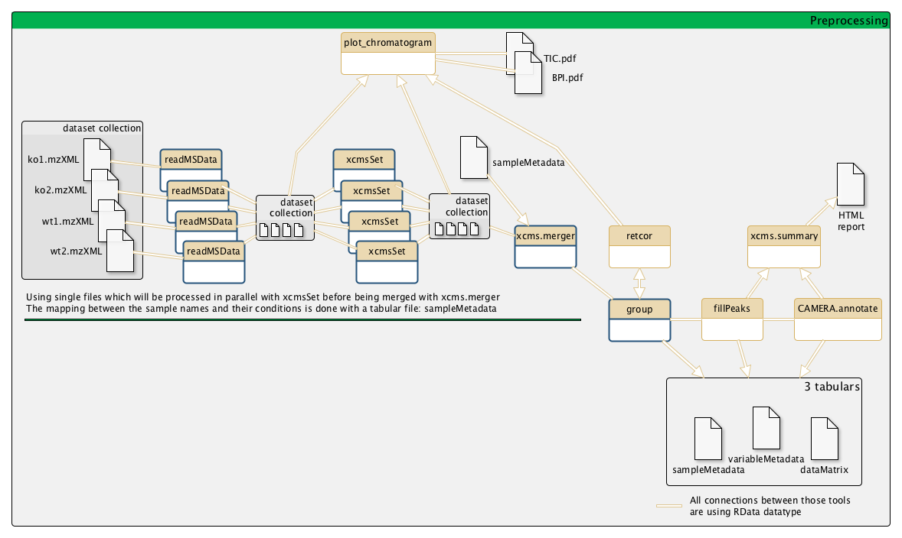

# Introduction
{:.no_toc}

**TODO** Explain why metabolomics, what do you want to do

To illustrate this approach, we will use data from [Thévenot et al, 2015](https://pubs.acs.org/doi/10.1021/acs.jproteome.5b00354). The objectives of this paper was to analyze the influence of age, body mass index, and gender on the urine metabolome. To do that, the authors collected samples from 183 employees from CEA and did
LC-HRMS LTQ-Orbitrap (negative ionization mode) (**TODO** explain the terms).

To analyze these data, we will the follow the [LC-MS workflow](http://workflow4metabolomics.org/the-lc-ms-workflow), developed by the [Wokflow4metabolomics group](http://workflow4metabolomics.org/). **TODO** Introduce with one or two sentence the workflow (explanation of the meaning of LC-MS, the big steps, etc). This workflow take as input **TODO** and perform several steps: pre-processing, statistics, and annotation.

> ### Agenda
>
> In this tutorial, we will go into each of the steps:
>
> 1. TOC
> {:toc}
>
{: .agenda}

# Data upload

Until recently, the LC-MS workflow required some zip files (with files nested in folders) as input. But now, the W4M team recommend to import individually the files into dataset collections and process them in parallel. But, we will see that the **xcms.findChromPeaks** outputs have to be merged (**Merger**) before using **xcms.groupChromPeaks** and a sampleMetadata file must be used to set the groups (but you need one for some further steps anyway).

The data are available in [Zenodo]({{ page.zenodo_link }}). It is composed of 4 datasets among the 240 (**TODO**: why 240 for 183 employees?) from the whole Sacurine dataset.

> ###  Hands-on: Data upload
>
> 1. Create a new history for this RNA-seq exercise
> 2. Import the 4 mzXML files from [Zenodo](https://doi.org/10.5281/zenodo.1185122) or a data library inside a collection:
>
>    ```
>    https://zenodo.org/record/1346742/files/Blanc12.mzXML
>    https://zenodo.org/record/1346742/files/Blanc17.mzXML
>    https://zenodo.org/record/1346742/files/HU_neg_099.mzXML
>    https://zenodo.org/record/1346742/files/HU_neg_178.mzXML
>    ```
>
>    
>    
>
>    > ###  Format of the files
>    > The files there are in mzxml format (**TODO**: explain the format). The other possible formats for metabolomics data are: mzml, mzdata, netcdf (**TODO**: explain the differences with the previous format)
>    {: .comment}
>
>    > ###  Files bigger than 2Go
>    > If your files are bigger than 2Go, you need to import them into Galaxy using the FTP method.
>       {: .comment}
>
>    The aim of the Dataset Collections is to use them as a sort of Dataset to not have to feed the tools with numerous individual datasets. If you miss the build step, don't panic.
>
>    
>
> 3. Click on the collection to inspect the nested datasets
> 4. Check that the datatype of the files in the collection is `mzxml`
>
>    If the datatype is not `mzxml`, please change the datatype to `mzxml`
>
>    
>
{: .hands_on}

We also need to import the metadata file. This file contains for each of your raw files their metadata:
- class which will be used during the preprocessing steps
- number of batch which will be useful for a batch correction step
- different experimental conditions which can be used for the statistics

samples | class | sampleType | subset | full | injectionOrder | batch | osmolality | sampling | age | bmi | gender
--- | --- | --- | --- | --- | --- | --- | --- | --- | --- | --- | ---
HU_neg_099 | bio | sample | 1 | 1 | 83 | ne1 | 923 | 4 | 23 | 21.3 | Male
HU_neg_178 | bio | sample | 0 | 1 | 153 | ne1 | 958 | 7 | 33 | 26.57 | Female
HU_neg_199 | bio | sample | 1 | 1 | 1 | ne2 | 945 | 9 | 55 | 25.3 | Female
Blanc12 | blank | blank | 1 | 1 | 120 | ne1 | NA | NA | NA | NA | NA
Blanc17 | blank | blank | 0 | 1 | 173 | ne1 | NA | NA | NA | NA | NA

> ###  Warning: Be careful about ...
> Microsoft Office Excel files are not allowed.
> Only file based on text are accepted: .tsv, .csv, .tab, .txt, …
{: .comment}

> ###  Hands-on: Metadata upload
>
> 1. Import the metadata file from [Zenodo](https://doi.org/10.5281/zenodo.1185122) or a data library inside a collection
>
>       ```
>       https://zenodo.org/record/1346742/files/sacuri_sampleMetadata.tsv
>       ```
>
>       
>       
>
{: .hands_on}

# Preprocessing with XCMS

The first step of the workflow is the pre-processing of the raw data with XCMS.  

XCMS is a free software dedicated to pre-processing any types of mass spectrometry acquisition files from low to high resolution including FT-MS data coupled with different kind of chromatography (liquid or gaz). This software is used worldwide by a majority of specialists of metabolomic using mass spectrometry methods.

This software is based on different algorithms that have been published and is maintained on the R repository [5,6,7].

XCMS is able to read files with open format as mzXML and netCDF which are independent of the constructors' formats.

It is composed of R functions able to extract, filter, align, fill gap and annotate isotopes, adducts and fragments. This set of functions gives a modularity particularly well adapted to defined workflows which is one of the key points of Galaxy:



We will not have to run these steps 4 times on each datasets, thanks to the Dataset collection

> ###  Hands-on: Preprocessing with XCMS
>
> 1. **MSnbase readMSData**  with the following parameters
>    -  *"File(s) from your history containing your chromatograms"*: the input data collection selected with **Dataset collection** ()
>
> 2. **xcms findChromPeaks (xcmsSet)**  with the following parameters
>    -  *"RData file"*: the `raw.raw.RData` Data Collection
>    -  *"Extraction method for peaks detection"*: `CentWave`
>    -  *"Min,Max peak width in seconds"*: `10,35`
>
>    In the next step of the workflow, **xcms.groupChromPeaks**  and **xcms.adjustRtime**  need one RData file. To merge all our RData which are nested in the Dataset Collection called something like `raw.xset.RData`, we will use a tool named **xcms.find ChromPeaks Merger** . This tool will also take the SampleMetadata `sampleMetadata.tsv` to map the classes to the samples: Samples, QC, Blank
>
> 3. **xcms findChromPeaks Merger**  with the following parameters
>    -  *"RData file"*: the `raw.raw.xset.RData` Data Collection (output of **xcms findChromPeaks (xcmsSet)** )
>    -  *"Sample metadata file"*: the imported metadata file
>   
>    When the **xcms findChromPeaks Merger** step is done, you can observe that we now have a dataset called `xset.merged.RData` in the history. It's no longer a Dataset Collection.
>
> 4. **xcms.groupChromPeaks (group)**  with the following parameters
>     -  *"RData file"*: `xset.merged.RData` (output of **xcms findChromPeaks Merger** )
>
{: .hands_on}

**TODO** some explanation about the observed outputs (+ question boxes?)

# Conclusion
{:.no_toc}

**TODO**: recap of the different steps and why these steps
