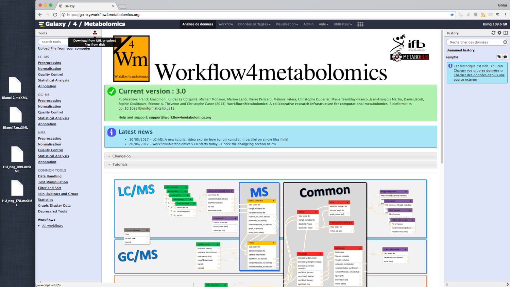
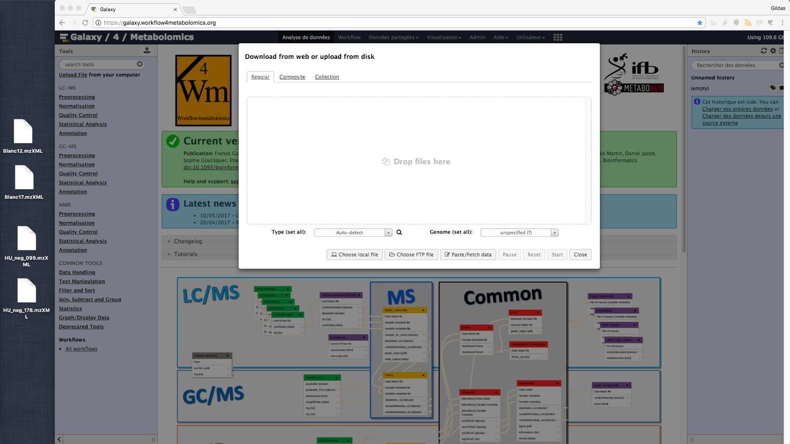
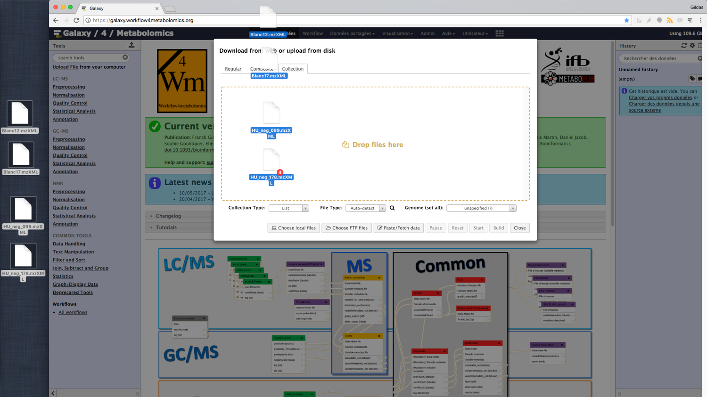
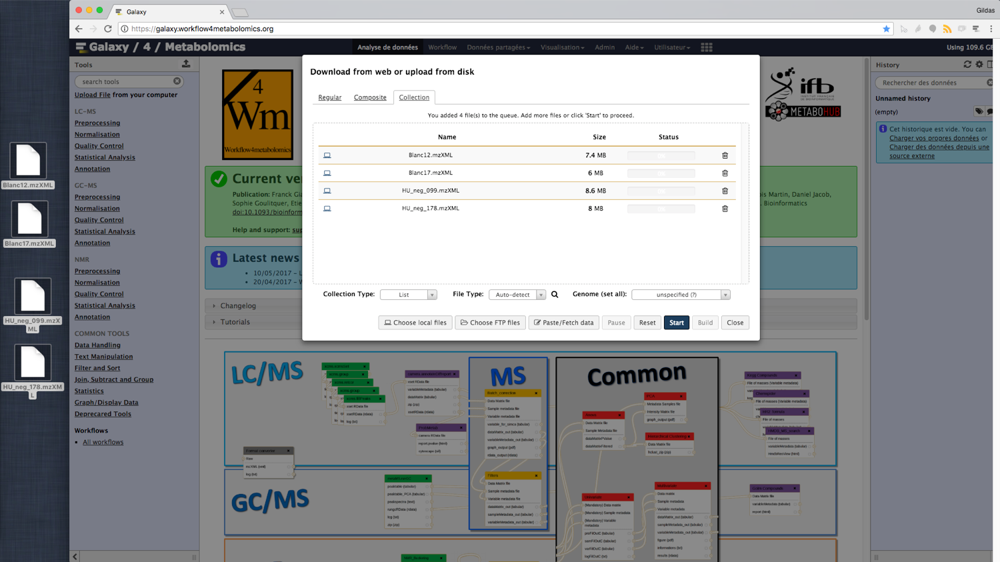
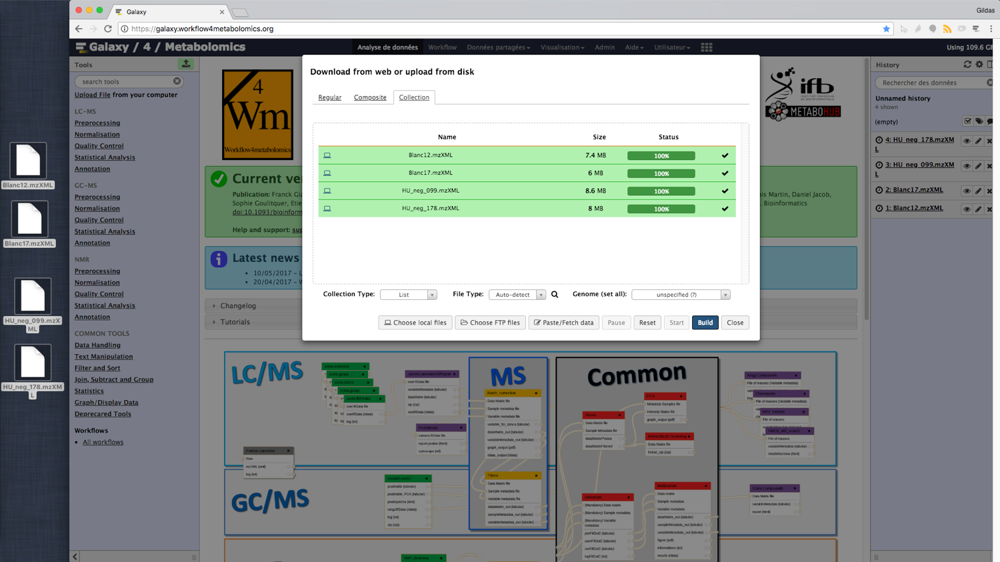
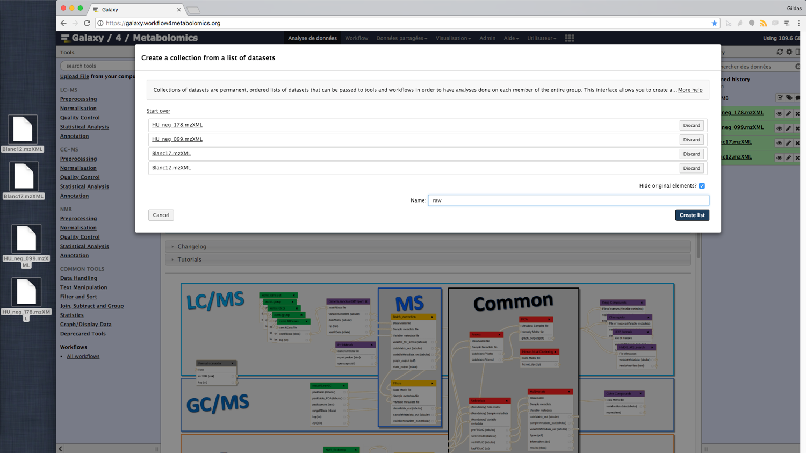
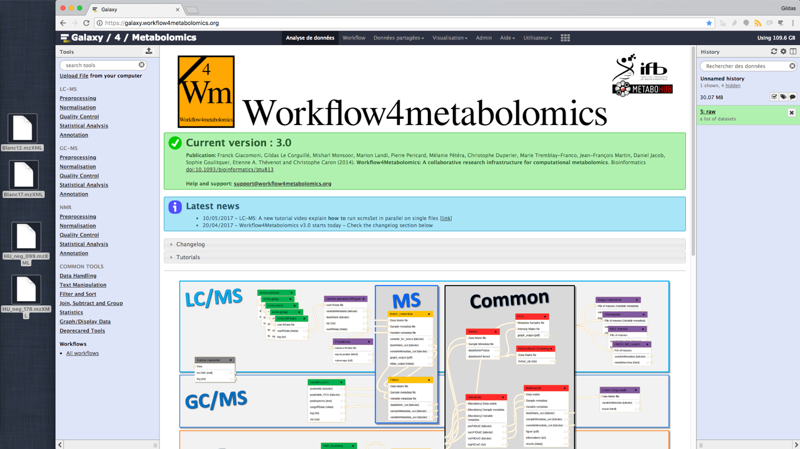
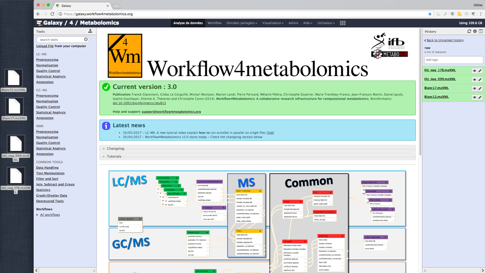

# Introduction
{:.no_toc}

This tutorial will explain the data importation, the first step before analyze your data with the Workflow4Metabolomics Galaxy Instance.

> ###  Comments
> Note that this tutorial is written for the new version of the xcms wrapper for xcms 3.0
>
> Those wrappers aren't yet available in the [workflow4metabolomics](https://galaxy.workflow4metabolomics.org/) production instance nor in [usegalaxy.eu](https://usegalaxy.eu/)
>
> We hope to release them in September 2018.
{: .comment}

> ### Agenda
>
> In this tutorial, we will deal with:
>
> 1. TOC
> {:toc}
>
{: .agenda}

# Obtaining data

In this tutorial we use 4 datasets from the Sacurine study

> ###  Background: The Sacurine dataset
> Summary:
> - **Objective**: influence of age, body mass index, and gender on the urine metabolome
> - **Cohort**: 183 employees from CEA
> - **LC-HRMS**: LTQ-Orbitrap (negative ionization mode)
{: .tip}

> ###  Hands-on: Obtaining our data
>
> The Toy Dataset is available in Zenodo: 
>
> Download all of them
{: .hands_on}

# Import the "Raw" data in "DataSet Collection"

> ###  Tip: Format
> The format (and datatype) allowed
> * mzxml
> * mzml
> * mzdata
> * netcdf
{: .tip}
>
> ###  Warning: Be careful about ...
> We will assume that each individual file is **less than 2Go**.
>
> Otherwise, you will have the use the FTP method which will be describe **soon** in an other tutorial.
{: .warning-box}
>
> ###  Hands-on: Obtaining our data
>
> 1. Click on the **Upload button** at top-right of the tool panel.
> > 
>
> 2. Click on the **Collection** tab in the upload window.
> > 
>
> 3. Drag and Drop your "raw data" .mzXML within the upload window.
> > /!\ You should get displayed in yellow "Drop files here"
> > 
>
>    > ###  Warning: Be careful about ...
>    > Do not include your SampleMetadata file, just raw files
>    {: .warning-box}
>
> 4. [optional] Select the datatype in the **File Type** drop list
>
>    > ###  Tip: A tip
>    > To save time during the upload phase, please select the correct "File Type".
>    > That way Galaxy will not have to guess the type for each file
>    {: .tip}
> > 
>
> 5. **Start** the upload itself
> > 
>
> 6. Please **wait**
> > You can observe the Status bar and the dataset which are arriving in the history panel in background.
> >
> > This step can take hours depending of your Internet connection and the load of the W4M server.
> > 
>
> 7. As soon as the **Build** button is available, click on it
> > 
>
> 8. Name your future Dataset Collection
> > 
>
> 9. Done
> > As you can see the original dataset have been hidden to make room for the Dataset Collection with its 4 individuals datasets.
> >
> > The aim of the Dataset Collections is to use them as a sort of Dataset to not have to feed the tools with numerous individual datasets.
> > 
> > If you click on the Dataset Collection name, the nested datasets are shown.
> > 
>
{: .hands_on}

> ###  Tip: A tip
>
> If you miss the build step, don't panic.
>
> Because for example, the upload phase was too long.
>
>    > ###  Solution
>    >
>    > You can still build a Dataset Collection:
>    > 1. From your history panel
>    > 2. Click on the Tick button above your Datasets
>    > 3. Choose in the list **Build Dataset List**
>    > 4. Name your future Dataset Collection
>    > 5. Done!
>    >
>    {: .solution}
{: .tip}

# Import the SampleMetadata sheet

# How to use those datain the first steps

# Conclusion
{:.no_toc}
