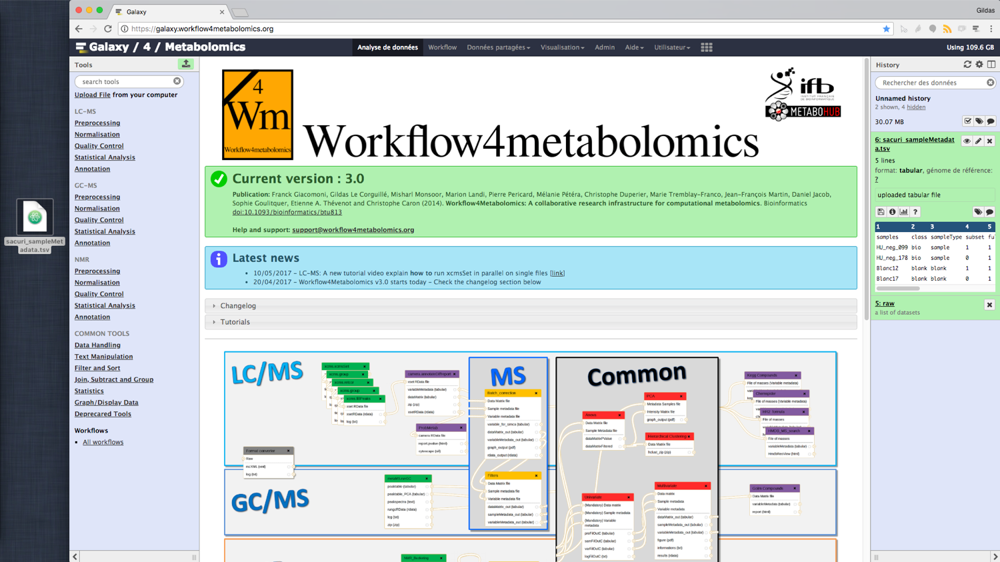

# Introduction
{:.no_toc}

This tutorial will explain the data importation, the first step before analyze your data with the Workflow4Metabolomics Galaxy Instance.

> ###  Comments
> Note that this tutorial is written for the new version of the xcms wrapper for xcms 3.0
>
> Those wrappers aren't yet available in the [workflow4metabolomics](https://galaxy.workflow4metabolomics.org/) production instance nor in [usegalaxy.eu](https://usegalaxy.eu/)
>
> We hope to release them in September 2018.
{: .comment}

> ### Agenda
>
> In this tutorial, we will deal with:
>
> 1. TOC
> {:toc}
>
{: .agenda}

# Individual files VS zip file

For the older of us, the Workflow4Metabolomics LC-MS workflow used require some zip file as input.

But now, the W4M team recommend to import the files and process the first steps individually.

See the explanation below: 

> ###  The zip file: the old fashion, not recommended system
> Files are nested in folders for their groups within a zip file
>
> - PROS:
>   - The folders set the group of the files for **xcms.groupChromPeaks**
>   - Only one import and one step  
> - CONS:
>   - **xcms.findChromPeaks** is limited to 6 CPUs
>   - The files aren't integrated into the history and can't be visualized
>
> 
>
{: .warning-box}

> ###  The single files system: recommended
> Files are uploaded individually (grouped in Dataset collection) and processed in parallel
>
> - PROS:
>   - One xcmsSet job is launch for each input file. It is highly parallelizable
>   - The files are completely integrated in Galaxy and can be visualized
>   - A better transparency
> - CONS:
>   - The **xcms.findChromPeaks** outputs have to be merged (**Merger**) before using **xcms.groupChromPeaks**
>   - A sampleMetadata file must be used to set the groups (but you need one for some further steps anyway)
>
> 
>
{: .tip}

# Obtaining data

In this tutorial we use 4 datasets from the Sacurine study

> ###  Background: The Sacurine dataset
> Summary:
> - **Objective**: influence of age, body mass index, and gender on the urine metabolome
> - **Cohort**: 183 employees from CEA
> - **LC-HRMS**: LTQ-Orbitrap (negative ionization mode)
>
> For further informations, please see this [dedicated page](http://workflow4metabolomics.org/dataset_sacurine) and the [publication](https://pubs.acs.org/doi/10.1021/acs.jproteome.5b00354)
{: .tip}

> ###  Hands-on: Obtaining our data
>
> The Toy Dataset is available in Zenodo: 
>
> It is composed of 4 datasets among the 240 from the whole [Sacurine dataset ](http://workflow4metabolomics.org/dataset_sacurine)
>
> Download all of them
{: .hands_on}

# Import the "Raw" data in "DataSet Collection"

> ###  Tip: Format
> The format (and datatype) allowed
> * mzxml
> * mzml
> * mzdata
> * netcdf
{: .tip}
>
> ###  Warning: Be careful about ...
> We will assume that each individual file is **less than 2Go**.
>
> Otherwise, you will have the use the FTP method which will be describe **soon** in an other tutorial.
{: .warning-box}
>
> ###  Hands-on:
>
> 1. Click on the **Upload button** at top-right of the tool panel.
> > 
>
> 2. Click on the **Collection** tab in the upload window.
> > 
>
> 3. Drag and Drop your "raw data" .mzXML within the upload window.
> > /!\ You should get displayed in yellow "Drop files here"
> > 
>
>    > ###  Warning: Be careful about ...
>    > Do not include your SampleMetadata file, just raw files
>    {: .warning-box}
>
> 4. [optional] Select the datatype in the **File Type** drop list
>
>    > ###  Tip: A tip
>    > To save time during the upload phase, please select the correct "File Type".
>    > That way Galaxy will not have to guess the type for each file
>    {: .tip}
> > 
>
> 5. **Start** the upload itself
> > 
>
> 6. Please **wait**
> > You can observe the Status bar and the dataset which are arriving in the history panel in background.
> >
> > This step can take hours depending of your Internet connection and the load of the W4M server.
> > 
>
> 7. As soon as the **Build** button is available, click on it
> > 
>
> 8. Name your future Dataset Collection
> > 
>
> 9. Done
> > As you can see the original dataset have been hidden to make room for the Dataset Collection with its 4 individuals datasets.
> >
> > The aim of the Dataset Collections is to use them as a sort of Dataset to not have to feed the tools with numerous individual datasets.
> > 
> > If you click on the Dataset Collection name, the nested datasets are shown.
> > 
>
{: .hands_on}

> ###  Tip: A tip
>
> If you miss the build step, don't panic.
>
> Because for example, the upload phase was too long.
>
>    > ###  Solution
>    >
>    > You can still build a Dataset Collection:
>    > 1. From your history panel
>    > 2. Click on the Tick button above your Datasets
>    > 3. Choose in the list **Build Dataset List**
>    > 4. Name your future Dataset Collection
>    > 5. Done!
>    >
>    {: .solution}
{: .tip}

# Import the SampleMetadata sheet

> ###  The Sample Metadata sheet
>
> This file contains for each of your raw files their metadata.
> - class which will be used during the preprocessing steps
> - number of batch which will be useful for a batch correction step
> - and different experimental conditions which can be used for the statistics
>
> > samples | class | sampleType | subset | full | injectionOrder | batch | osmolality | sampling | age | bmi | gender
> > --- | --- | --- | --- | --- | --- | --- | --- | --- | --- | --- | ---
> > HU_neg_099 | bio | sample | 1 | 1 | 83 | ne1 | 923 | 4 | 23 | 21.3 | Male
> > HU_neg_178 | bio | sample | 0 | 1 | 153 | ne1 | 958 | 7 | 33 | 26.57 | Female
> > HU_neg_199 | bio | sample | 1 | 1 | 1 | ne2 | 945 | 9 | 55 | 25.3 | Female
> > Blanc12 | blank | blank | 1 | 1 | 120 | ne1 | NA | NA | NA | NA | NA
> > Blanc17 | blank | blank | 0 | 1 | 173 | ne1 | NA | NA | NA | NA | NA
>
>    > ###  Warning: Be careful about ...
>    > Microsoft Office Excel files are not allowed.
>    > Only file based on text are accepted: .tsv, .csv, .tab, .txt, …
>    {: .warning-box}
>
{: .tip}

> ###  Hands-on:
>
> 1. Click on the **Upload button** at top-right of the tool panel.
> > 
>
> 2. This time we will stay on the **Regular** tab
> > It doesn't need to be nested in a Dataset Collection.
> > 
>
> 3. Drag and Drop your SampleMetadata file .tsv (in my case) within the upload window.
> > /!\ You should get displayed in yellow "Drop files here"
> > 
>
> 4. **Start**
> > 
>
> 5. Done
> > You can now see your SampleMetadata in the history panel.
> > 
>
{: .hands_on}

# How to use those data in the first steps

> ###  The workflow
>
> > 
> We will only play the step framed in blue
>
> Again, thanks to the Dataset collection, we will not have to run 4 times **MSnBase.readMSData** and 4 times **xcms.findChromPeaks (xcmsSet)**. Galaxy will manage that for us.
>
> See the "[Individual files VS zip file](#individual-files-vs-zip-file)" section for explanation about the Dataset collections and their interest
{: .tip}

> ###  Hands-on: Run the first steps
>
> 1. **MSnBase.readMSData**  with the following parameters
>  - Click on the **Dataset Collection** (folder) button
> > 
>  -    *"File(s) from your history containing your chromatograms"*: the `raw` Data Collection
>
> 2. **xcms.findChromPeaks (xcmsSet)**  with the following parameters
>  - Click on the **Dataset Collection** button
>  -   *"RData file"*: the `raw.raw.RData` Data Collection
>  -  *"Extraction method for peaks detection"*: `CentWave`
>  -    *"Min,Max peak width in seconds"*: `10,35`
>
> 3. **xcms.findChromPeaks Merger**  with the following parameters
>    > ###  Tip: Why this step?
>    > For the next step of the workflow, groupChromPeaks and adjustRtime, we need one RData.
>    >
>    > To merge all our RData which are nested in the Dataset Collection called something like `raw.xset.RData`, we will use a tool named **xcms.find ChromPeaks Merger**
>    >
>    > This tool will also take the SampleMetadata `sampleMetadata.tsv`to map the classes to the samples: Samples, QC, Blank
>    {: .tip}
>  - Click on the **Dataset Collection** button
>  -   *"RData file"*: the `raw.raw.xset.RData` Data Collection
>  -    *"Sample metadata file"*: `sacuri_sampleMetadata.tsv`
>
> 4. **xcms.groupChromPeaks (group)**  with the following parameters
>  -   *"RData file"*: `xset.merged.RData`
>
> When the **xcms.findChromPeaks Merger** step is done, you can observe that we now have a dataset called `xset.merged.RData` in the history. It's no longer a Dataset Collection.
>
> From now, we will deal with regular datasets for the further steps.
>
{: .hands_on}

# Conclusion
{:.no_toc}
