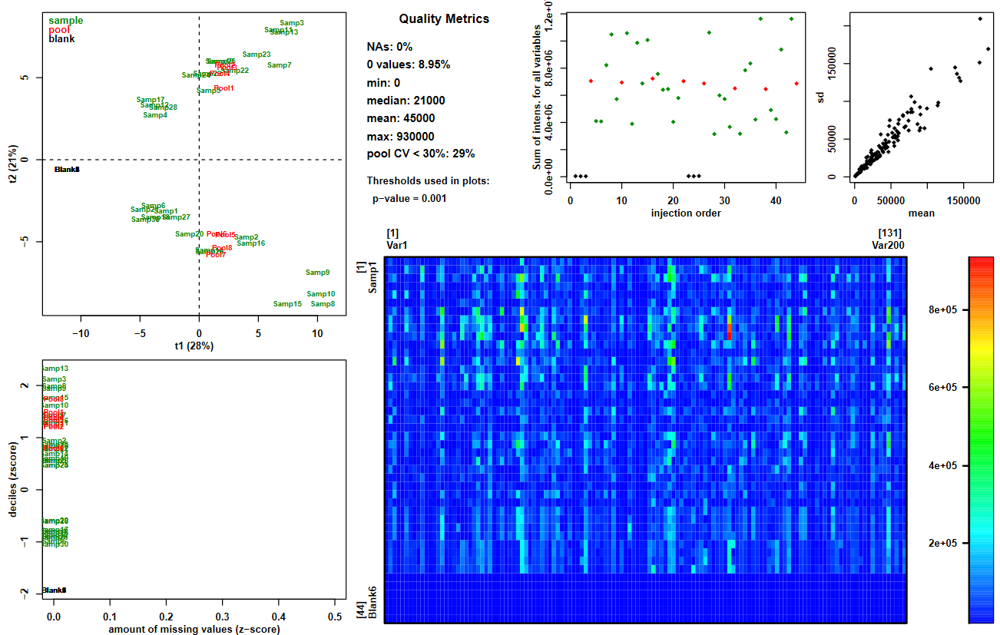
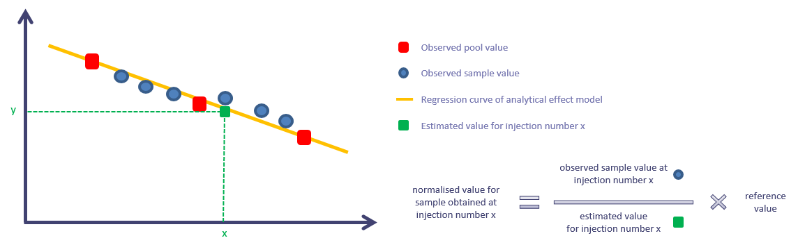
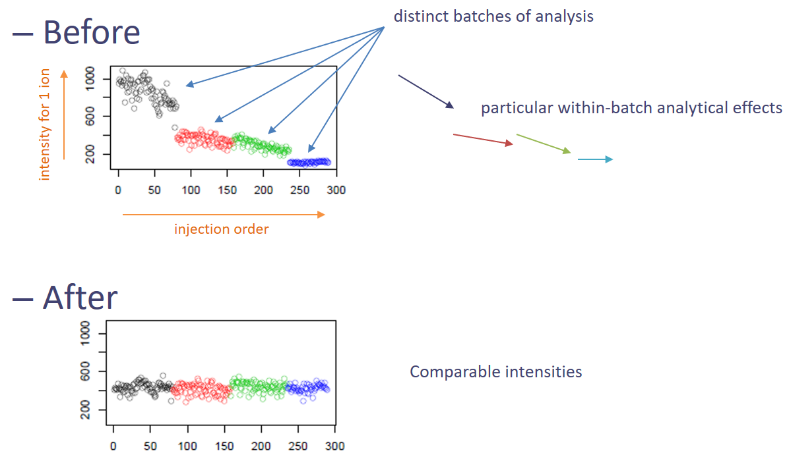

# Introduction
{:.no_toc}

Metabolomics is a *-omic* science known for being one of the most closely related to phenotypes.
It involves the study of different types of matrices, such as blood, urine, tissues, in various organisms including plants.
It focuses on studying the very small molecules which are called *metabolites*, to better understand matters linked to the metabolism.

Metabolomics analyses can be quite complex to conduct, especially when dealing with untargeted approaches. 
**Liquid-Chromatography Mass Spectrometry** (LC-MS) is one of the three main technologies used to perform this kind of approach. 
Data analysis for this technology requires a large variety of steps, ranging from extracting information from the raw data, to statistical analysis and annotation. 
One of these steps is called "data processing". It takes place after the pre-processing step (extraction of the peak list from raw data) and before any statistical analysis.
You can get an overview of a complete LC-MS untargeted metabolomic workflow by following the dedicated 
training material [here](https://training.galaxyproject.org/training-material/topics/metabolomics/tutorials/lcms/tutorial.html).

After the pre-processing step, what you have at your disposal is a list of ions (variableMetadata file) and corresponding intensities (dataMatrix file).
What you may want now is to get some relevant information from your tables. However, your data may not be suitable yet for statistical analysis.
What should you do to ensure the quality of your tables? This tutorial will show you what the usual quality steps are.

> ### Agenda
>
> In this tutorial, we will cover:
>
> 1. TOC
> {:toc}
>
{: .agenda}

# Overview and data upload

Data processing covers a large range of actions. They can generally be described as transformation (*e.g.* normalisation) or filter (*e.g.* removal of unwanted ions). 
In this tutorial we will focus on three main types of processing:
- Removing "trash" signals
- Correcting intensities
- Removing signals of insufficient quality

## Galaxy tools' workflow

The different Galaxy tools that will be used in this tutorial are given in the following workflow picture.


All these modules are part of the [Wokflow4Metabolomics](http://workflow4metabolomics.org/) tool suit (, ).
They are compatible with the whole data analysis solution maintained by the W4M team. 

> ###  Workflow4Metabolomics public history
>
> This training material can be followed running it on any Galaxy instance holding the Galaxy modules needed.
> Nonetheless, if you happen to be a W4M user and do not want to run the hands-on yourself, please note that
> you can find the entire history in the 'published histories' section:
> [GTN_LCMSprocessing](https://workflow4metabolomics.usegalaxy.fr/u/peteram/h/gtnlcmsdataprocessing)
>
{: .comment}

## Dataset description

To illustrate the steps in this tutorial, a dataset has been built purposely.
It is composed of 3 files. They are text files of tables with tabulation as separator. 

The *dataMatrix* file is a table containing the intensities of measured variables (ions, in lines) for every samples (in column).
The first column is for ions' identifiers while the first line is for samples' identifiers.

The *variableMetadata* file is a table containing information about the ions. 
The first column is for ions's identifiers while the other columns gather information about m/z and retention time (rt). 

The *sampleMetadata* file is a table containing information about the samples. 
The first column is for samples's identifiers while the other columns gather analytical and biological information
such as the order of injection in the analytical sequence and the biological groups of interest for the supposed study. 

The simulated design is composed of 30 biological samples (tagged "sample" in the *sampleType* column),
completed with 8 Quality-control pooled samples (tagged "pool" in the *sampleType* column)
and 6 extraction solvent samples (tagged "blank" in the *sampleType* column). 
The samples have been supposedly injected in two distinct sequences (tagged "B1" and "B2" in the *batch* column),
the injection order being given in the *injectionOrder* column. 
Two sample characteristics are given:
- The *Group* column represents two groups "A" and "B", supposedly two biological groups (*e.g.* phenotypes, treatment groups...).
- the *Osmo* column represents a measurement of supposed osmolarity, imagining that the samples may be urine samples. 

## Data upload

To perform the different exercices of this tutorial, you need to create a new history and upload the dedicated dataset. 

> ###  Hands-on: Data upload
>
> 1. Create a new history for this tutorial
> 2. Import the 3 starting files in your history. Two possibilities: 
>    - Option 1: from a shared data library (ask your instructor)
>    - Option 2: from [Zenodo](https://zenodo.org/record/5179809) using the URLs given below:
>
>    ```
>   https://zenodo.org/record/5179809/files/Dataprocessing_dataMatrix.txt
>   https://zenodo.org/record/5179809/files/Dataprocessing_sampleMetadata.txt
>   https://zenodo.org/record/5179809/files/Dataprocessing_variableMetadata.txt 
>    ```
>
>    
>
> 3. Rename the datasets for their names to be shorter: "dataMatrix", "sampleMetadata", "variableMetadata".
>
>    
>
> 4. Check that the datatype is "tabular". If not, you may change it. 
>
>    
>
> > ###  Comment to W4M users
> >
> > In the [GTN_LCMSprocessing](https://workflow4metabolomics.usegalaxy.fr/u/peteram/h/gtnlcmsdataprocessing) history,
this step corresponds to the datasets number 1 to 3.
> {: .tip}
>
{: .hands_on}

# Removing "trash" signals

Data are often affected by various sources of unwanted variability. This can be found in your tables in different ways, 
two common ones being the presence of unwanted ions, and the effect of biological or analytical variables on intensity measures. 
This unwanted information can limit the effectiveness of statistical methods, leading sometimes to difficulties in revealing investigated effects. 
Thus, identifying such variability can help analysing your data at its full potential. 
Yet, getting rid of such information may not be a trivial problem. It requires different elements to be completed successfully. 

In this section we will adress the question of "trash" signal filtering. 
By this we mean ions that are present in the extracted peak list we have, but that do not correspond to relevant compounds to analyse.
This can be for example noise, or ions from compounds that are not present in original biological samples. 

To make it clearer, we will illustrate this with two examples: a "simple" one first and a more advanced one in a second time. 

## Filtering signals at given retention times

When using a chromatography column for MS analysis, you may want to exclude some time ranges where you know the information found there is not of interest.
For example, you may want to exclude the dead volume, a calibration zone at the begining or the end, or to exclude a column flush.

In this tutorial, let's suppose data are from some LC-QTOF analysis with a dead volume between 0 and 0.4 minutes and a column flush from 16 minutes.
Then we may want to exclude ions that may be found at theses specific retention time (rt) ranges. 
A quick check at the variableMetadata reveals that a retention time column is available ("rt") with values in minutes.
We can then use this column to filter the dataset. 

> ###  Hands-on: Using **Generic_filter** to filter ions found at specific retention times
>
> 1.  with the following parameters:
>    -  *"Data Matrix file"*: the `dataMatrix` file
>    -  *"Sample metadata file"*: the `sampleMetadata` file
>    -  *"Variable metadata file"*: the `variableMetadata` file
>    - *"Deleting samples and/or variables according to Numerical values"*: `yes`
>        - In *"Identify the parameter to filter "*:
>            - *"1: Identify the parameter to filter "*
>                - *"On file"*: `Variable metadata`
>                - *"Name of the column to filter"*: `rt`
>                - *"Interval of values to remove"*: `extremity`
>                    - *"Remove all values lower than"*: `0.4`
>                    - *"And upper than"*: `16.0`
>    - *"Deleting samples and/or variables according to Qualitative values"*: `no`
>
>
>    > ###  Comment to W4M users
>    >
>    > In the [GTN_LCMSprocessing](https://workflow4metabolomics.usegalaxy.fr/u/peteram/h/gtnlcmsdataprocessing) history,
this step corresponds to the datasets number 4 to 6.
>    {: .tip}
>
{: .hands_on}

The **Generic Filter**  tool generates 3 tables. They correspond to the 3 original tables, 
except the content has been filtered according to the specified parameters. 
By "filtering", it means removing from the dataset some variables (ions) and/or samples according to the defined filters. 

> ###  Question
>
> What have changed between the 3 input tables and the 3 output ones?
>
> > ###  Solution
> >
> >  The sampleMetadata output is identical to the input one since no filter on samples has been applied.
> >  The variableMetadata output contains less lines than the input one: some ions has been removed from the table.
The same happened with the dataMatrix table, corresponding ions being removed from the file.
Thus, these two files went from 201 lines (header included) to 172 lines, meaning only 171 ions remained in the dataset.
> >
> {: .solution}
>
{: .question}

This was a relatively easy task to do. The key point to perform the filter was to know the ranges of rt that needed to be filter,
since the information about rt values was already explicitly found in the dataset. 
However, sometimes filtering requires more steps to be able to perform the wanted processing.
This will be illustrated in the next example.

## Using blanks to filter noise signals

As mentioned before, measured signal using mass spectrometry may not always be of interest.
It can be noise, or compounds not characteristic of the analysed biological samples.
There are several ways to reduce the impact on gathered data.
But one key point is always, as a starting point, to identify the issue. 

In the previous example we knew there were retention time values where signals were not relevant.
But they may also be some signals that represent noise, found at no specific retention times. 
So a question can be "how do we identify these signals?". 

One possible alternative is the use of blanks to estimate the noise, as a reference. 
The idea is to compare blanks’ intensities with other samples’ intensities.
If there is no subtantial difference, we can assume that the concerned signal is noise.

Of course, to be able to do so, you need to inject reference blanks along with your biological samples to get these intensities in your dataMatrix.
Thus, you need to anticipate it when you define your injection sequence. 
Ideally, the blanks to use are extraction blanks, but you can also use injection solvent depending on your protocols. 

When blanks are available in your dataset, the last thing to consider is "how do I formalise the information to be able to filter?".
One common way to compare may be to set a minimum difference between means or medians, or to test for significant difference with a statistical test.
In this tutorial, we will choose to calculate a mean fold change between blanks and non-blanks samples, and to set a threshold value for filtering.  

The mean fold change ("fold") for each ion can be calculated using the **Intensity Check**  tool. 

> ###  Hands-on: Using **Intensity Check** to generate the information needed to filter
>
> 1.  with the following parameters:
>    -  *"Data Matrix file"*: `GF_dataMatrix` (output of the previous **Generic Filter**  job)
>    -  *"Sample metadata file"*: `GF_sampleMetadata` (output of the previous **Generic Filter**  job)
>    -  *"Variable metadata file"*: `GF_variableMetadata` (output of the previous **Generic Filter**  job)
>    - *"Computation method"*: `Between one class and all the remaining samples`
>        - *"Class column"*: `c5: sampleType`
>        - *"Selected class"*: `blank`
>        - *"Calculate the mean fold change"*: `Yes`
>            - *"Where should the class be placed for the mean fold change calculation?"*: `Denominator (Bottom)`
>
>
>    > ###  Comment to W4M users
>    >
>    > In the [GTN_LCMSprocessing](https://workflow4metabolomics.usegalaxy.fr/u/peteram/h/gtnlcmsdataprocessing) history,
this step corresponds to the datasets number 7 and 8.
>    {: .tip}
>
{: .hands_on}

This module generates two outputs: a pdf file for plots (that is not of interest in our example)
and a table corresponding to the variableMetadata file used as input, completed with new columns depending on the selected parameters. 
In our case, it generated a column named *fold_Other_VS_blank* that we will use for filtering. 

> ###  Question
>
> What does a value of "4" mean in the *fold_Other_VS_blank* column?
Remember that we used as parameter *"Selected class"*=`blank` and
*"Where should the class be placed for the mean fold change calculation?"*=`Denominator (Bottom)`.
>
> > ###  Solution
> >
> > Since *"Selected class"*=`blank`, the samples are devided in two groups: the blank samples on one hand
and all the other samples on the other hand. 
To calculate a mean fold change (*i.e.* a ratio of means) between the two classes, we need to define which mean will be used as numerator 
and which one will be used as denominator. Since we defined that the selected class should be the denominator, the values we will get are 
(mean of non-blank samples)/(mean of blank samples). 
Thus, a value of "4" for a given ion means that the ion has a mean 4 times higher in non-blank samples compared to blank samples. 
> >
> {: .solution}
>
{: .question}

The **Intensity Check**  tool generates additional information about your dataset, but do not perform any filter.
We can now define a threshold for filtering, and use the **Generic Filter**  tool again to remove noise signal. 
Here we will use a threshold value of "4". What we want is to remove ions having a fold value lower than 4,
meaning that the mean values of biological samples' intensities for theses ions are not sufficiently high compared to blanks to be considered
to be resulting from relevant compounds. 

> ###  Hands-on: Using **Generic_filter** to filter ions with insuffisant mean contrast with blank samples
>
> 1.  with the following parameters:
>    -  *"Data Matrix file"*: `GF_dataMatrix` (output of the previous **Generic Filter**  job)
>    -  *"Sample metadata file"*: `GF_sampleMetadata` (output of the previous **Generic Filter**  job)
>    -  *"Variable metadata file"*: `IC_GF_variableMetadata` (output of the previous **Intensity Check**  job)
>    - *"Deleting samples and/or variables according to Numerical values"*: `yes`
>        - In *"Identify the parameter to filter "*:
>            - *"1: Insert Identify the parameter to filter "*
>                - *"On file"*: `Variable metadata`
>                - *"Name of the column to filter"*: `fold_Other_VS_blank`
>                - *"Interval of values to remove"*: `lower`
>                    - *"Remove all values lower than"*: `4.0`
>    - *"Deleting samples and/or variables according to Qualitative values"*: `no`
>
>
>    > ###  Comment to W4M users
>    >
>    > In the [GTN_LCMSprocessing](https://workflow4metabolomics.usegalaxy.fr/u/peteram/h/gtnlcmsdataprocessing) history,
this step corresponds to the datasets number 9 to 11.
>    {: .tip}
>
{: .hands_on}

As for the previous use of **Generic Filter**, we now have a dataset filtered from noise signals. 

> ###  Questions
>
> What is the current stage of our training dataset?
>
> > ###  Solution
> >
> > From a dataset containing originally 200 ions, the two successive filters lead to a dataset containing only 131 ions.
The number of samples did not change, so we still have 30 biological samples, 8 QC pools and 6 blanks. 
> >
> {: .solution}
>
{: .question}

At that point we will not use the blank samples anymore. However, before removing them from the dataset, it is always interesting to 
get an overview of the dataset including blanks. 

## Filtered dataset overview

The idea here is to have a glance at what the dataset looks like at a macro scale.
For this tutorial, we consider that at this step what we have in our dataset is ions only resulting from compounds originally present in the biological samples.
Thus, there are some assumptions we can begin to make, that we can try to check using graphical tools. 

Here, we will use a tool that is called **Quality Metrics** to have an overview of our dataset through the generation of a pdf file containing some plots. 

> ###  Hands-on: Using **Quality Metrics** to get an overview of the dataset
>
> 1.  with the following parameters:
>    -  *"Data matrix file"*: `GF_GF_dataMatrix` (output of the last **Generic Filter**  job)
>    -  *"Sample metadata file"*: `GF_GF_sampleMetadata` (output of the last **Generic Filter**  job)
>    -  *"Variable metadata file"*: `GF_IC_GF_variableMetadata` (output of the last **Generic Filter**  job)
>    - *"Coefficient of Variation"*: `no`
>    - *"Advanced parameters"*: `Use default`
>
>
>    > ###  Comment to W4M users
>    >
>    > In the [GTN_LCMSprocessing](https://workflow4metabolomics.usegalaxy.fr/u/peteram/h/gtnlcmsdataprocessing) history,
this step corresponds to the datasets number 12 to 15.
>    {: .tip}
>
{: .hands_on}

This tool generates several outputs (some of them are going to be used in a later use of this module), however for now only the pdf output is of interest.



On the top left of the picture, we can see the two first components of a Principal Component Analysis (PCA) with the projection of samples on it, colored by sample type.
We can see that the main variability in the dataset distinguishes the blank samples (on the left in blank) from the other ones (red for pools and green for samples).
This is awaited since blanks are supposed to have very low intensities compared to biological samples. 
This observation is consistant with the top middle plot which represents the sum of intensities for each sample (plotting according to the injection order),
where blank samples have very low values. 

This kind of plots is a good way to detect samples that may have abnormally low profiles: 
if a sample is positioned at the same area as the blanks, it is suspicious and a special attention should be given to the concerned sample.

In this tutorial dataset, no atypical sample is observed, so no special attention needs to be paid on specific samples.

Since the blank samples are of no use anymore, we can remove them from the dataset. 
Again, this can be done running the **Generic Filter**  tool, using the *sampletype* column of the sampleMetadata table. 

> ###  Hands-on: Using **Generic_filter** to remove blank samples from the dataset
>
> 1.  with the following parameters:
>    -  *"Data Matrix file"*: `GF_GF_dataMatrix` (output of the last **Generic Filter**  job)
>    -  *"Sample metadata file"*: `GF_GF_sampleMetadata` (output of the last **Generic Filter**  job)
>    -  *"Variable metadata file"*: `GF_IC_GF_variableMetadata` (output of the last **Generic Filter**  job)
>    - *"Deleting samples and/or variables according to Numerical values"*: `no`
>    - *"Deleting samples and/or variables according to Qualitative values"*: `yes`
>        - In *"Removing a level in factor"*:
>            - *"1: Insert Removing a level in factor"*
>                - *"Name of the column to filter"*: `sampleType`
>                - *"Remove factor when"*: `blank`
>
>    > ###  Comment
>    >
>    > The tabular outputs of the previous **Quality Metrics** job are not needed here.
This is why what we use as input here are the outputs from the last **Generic Filter** job.
>    {: .comment}
>
>    > ###  Comment to W4M users
>    >
>    > In the [GTN_LCMSprocessing](https://workflow4metabolomics.usegalaxy.fr/u/peteram/h/gtnlcmsdataprocessing) history,
this step corresponds to the datasets number 16 to 18.
>    {: .tip}
>
{: .hands_on}

This step leads to a dataset containing 131 ions and 38 samples (from which 8 pools). 

You may have noticed that from module to module, output names tend to become longer and longer.
To prevent very long and not-so-informative names due to successive use of modules, we highly recommand to regularly rename the outputs.
Here, we completed a first row of data processing with the filter of trash signals. Now is a good time for a little renaming.

> ###  Hands-on: Rename the last 3 tables
>
> 1. Rename the tables for their names to be shorter: "RT_blank_Filter_dataMatrix", "RT_blank_Filter_sampleMetadata", "RT_blank_Filter_variableMetadata".
>
>    
>
>
{: .hands_on}

Now we are ready to investigate another type of data processing: correcting intensities

# Signal drift and batch effect correction

Here we will illustrate an example of data processing that is not about filtering, but about correcting. 
Indeed, when it comes to perform statistics comparing biological samples, it is crucial for the intensity values used to be reflecting
relevant variability between samples. 

In untargeted Metabolomics studies, we manipulate measures that are relative abundancies.
Although we have no unit attached to the intensities, we at least assume that, for a given ion, an intensity value for one sample being higher
than the one from another sample means that the compound from which the ion is generated is original found in higher abundance in the biological sample from
the first sample compared to the other. 
This assumption may seem trivial, but truth is it is not when dealing with LC-MS data.

It is known that when injecting successively a large number of samples, the LC-MS system tends to get dirty. This may cause a measure drift. 
To prevent inability to catch signal anymore, in case of large injection series, the sequence is generally divided into several batches and the source is cleaned between batches.
Unfortunately, these signal drift and batch design can add significant variability in the data. 
It makes sample comparison complicated, since the assumption stated previously about abundance in biological samples may not be true anymore. 
In case data is impacted by these effects, we need a way to normalise the data to obtain something reliable for statistical analysis. 

## [Optional step] Checking batch effect on data

You may have noticed in the **Quality Metrics** output PDF that appart from blanks, samples seemed to be seperated in two groups. 
Truth is it is indeed. However, the best would be to confirm it, in particular by finding out what these groups are linked to.
Here dices are already rolled, and given the fact that in this section we are adressing signal drift and batch effects, 
one could suppose that the groups may have something to do with it. 

Let's confirm it by performing a PCA, with the specificity to colour the sample projections according to the supposed effect: the batch information. 
This can be done using the **Multivariate**  tool. 

> ###  Hands-on: Using **Multivariate** to get a coloured score plot from a PCA
>
> 1.  with the following parameters:
>    -  *"Data matrix file"*: `RT_blank_Filter_dataMatrix` (output of the last **Generic Filter**  job)
>    -  *"Sample metadata file"*: `RT_blank_Filter_sampleMetadata` (output of the last **Generic Filter**  job)
>    -  *"Variable metadata file"*: `RT_blank_Filter_variableMetadata` (output of the last **Generic Filter**  job)
>    - *"Number of predictive components"*: `2`
>    - *"Advanced graphical parameters"*: `Full parameter list`
>        - *"Sample colors"*: `batch`
>        - *"Amount by which plotting text should be magnified relative to the default"*: `0.4`
>    - *"Advanced computational parameters"*: `Use default`
>
>    > ###  Comment
>    >
>    > Changing the `0.8` value to `0.4` makes the text size of labels on the score plot smaller.
Since the plot box size by default is tiny, this enhances the readability of the plot. 
>    {: .comment}
>
>    > ###  Comment to W4M users
>    >
>    > In the [GTN_LCMSprocessing](https://workflow4metabolomics.usegalaxy.fr/u/peteram/h/gtnlcmsdataprocessing) history,
this step corresponds to the datasets number 19 to 22.
>    {: .tip}
>
{: .hands_on}

This output of **Multivariate** we will be interested in here is only the PDF file (Multivariate_figure.pdf). 
Among the four plots displayed in the file, we can see at the bottom left corner that the first component clearly reveals two distinct groups.
These groups perfectly match the batch information we coloured the sample projections with. 

This confirms that we indeed have at least a batch effect in the data. 
To note, this comment is relevant thanks to the fact that supposedly we randomised the injection sequence. 
This is essential to be able to efficiently separate any analytical effect from known biological variables when searching for effects. 
If you look at the sampleMetadata file we originally imported, you can notice that the biological group (*A* and *B*) are equally found in the two batches,
with alternation all through the injection order. 

## Performing the correction process

We previously saw that in data processing issues, it is sometimes crucial to anticipate what needs to be done before defining the injection sequence.
This is even more the case when dealing with batch effects and signal drifts.

There is a strategy, described initially by Van Der Kloet in 2009 (), that has made its way to nowadays procedures ().
The idea is to model the signal drift and the batch effect level by using a reference that can be representative for every ions in the dataset.
Indeed, signal drift and batch effects can have very different impacts accross ions in a same dataset, so it is crucial to have a reference that is reliable
for each ion independantly. 

Here the "universal" reference is obtained by using samples that are made by pooling together an extract of every samples in study. 
Thus, these Quality-control pooled samples ('pools') contain all the compounds that are originally found in the samples, being a reference for a very wide range of ions.
By injecting these pools all through the injection sequence of the study samples, we obtain a reference for which the main variability observed is composed of
the analytical effects we want to correct, since biologically they are supposed to be identical.

> ###  More details about the theory
>
> The procedure that is used to correct data in this tutorial is the following.
>
> For each ion independently, the normalisation process works as described in the following picture:
>
> 
>
> You can see a plot representing 8 sample measures (blue points) in a batch for a given extracted ion. 
The yellow line represents a model for the signal drift that can be used to normalise the data.
This line is determined using the pools only (red squares). 
With the given formula, we can correct the signal drift. 
>
> This work has to be done for each batch. 
Thus, if your sequence is divided into several batches, the idea is to obtain something similar to the following picture:
>
> 
>
{: .details}

In this tutorial, we have all the information we need to perform the correction:
- Pools representing the molecule diversity have been injected regularly all through the sequences.
- They are numerous enough in each batch for the regression to be reliable (well, at least we have enough of them to perform a linear modeling).
- The dataset contains the mandatory information needed in the sampleMetadata file: the injection order, the batches of analysis and the sample type (pool or sample).

We can then use the **Batch correction**  tool to perform the correction. 

> ###  Hands-on: Using **Batch correction** to correct the data from signal drift and batch effet
>
> 1.  with the following parameters:
>    -  *"Data Matrix file"*: `RT_blank_Filter_dataMatrix` (output of the last **Generic Filter**  job)
>    -  *"Sample metadata file"*: `RT_blank_Filter_sampleMetadata` (output of the last **Generic Filter**  job)
>    -  *"Variable metadata file"*: `RT_blank_Filter_variableMetadata` (output of the last **Generic Filter**  job)
>    - *"Type of regression model "*: `linear`
>        - *"Factor of interest "*: `Group`
>        - *"Level of details for plots "*: `complete`
>
>    > ###  Comment
>    >
>    > The tabular outputs of the previous **Multivariate** job are not needed here.
This is why what we use as input here are the outputs from the last **Generic Filter** job.
>    {: .comment}
>
>    > ###  Comment to W4M users
>    >
>    > In the [GTN_LCMSprocessing](https://workflow4metabolomics.usegalaxy.fr/u/peteram/h/gtnlcmsdataprocessing) history,
this step corresponds to the datasets number 23 to 25.
>    {: .tip}
>
{: .hands_on}

The tool generates 3 outputs:
- a dataMatrix file containing the corrected intensities
- a variableMetadata file corresponding to the input one completed with additional columns
- a pdf file with graphics to visualise the impact of the correction process

Depending on the regression model option chosen (linear/lowess/loess/all_loess_pool/all_loess_sample), the output details differ slightly.
Indeed, the previously described algorithm has been adapted following two stretegies: one for the linear/lowess/loess (3L) options,
another for the all_loess_pool/all_loess_sample (all_loess) ones.

The main differences between the two strategies are that:
- one part allows regression type choice and applies the normalisation depending on internal quality metrics
- the other part offers the possibility to apply the correction without pool samples. 
For more information, do not hesitate to read the help section provided with the Galaxy tool. 

In this tutorial example, we used the *linear* option which is part of the 3L strategy.
We could not use any of the other options because the other ones would need more pools per batch than what we have here.
When using the 3L strategy, in the PDF file you can have various graphics depending on the *Level of details for plots* option you choose.
Here we generated all the plots that are available. This means that the PDF file contains first one page per ion with before/after plots,
plus 3 additional pages at the end that display overall before/after indicators (sum of intensities, PCA plots, pools' coefficients of variation).

> ###  Question
>
> Look at the penultimate page of the PDF output (page n°133).
This page represents before/after PCA plots with various colouring.
We will only focus on the two first lines, in particular looking at the first column.
The two corresponding plots represent PCA score plots before (first line) and after (second line) the correction process.
The two plots are coloured according to the batch information (B1 and B2).
What can you say about the batch effect after the correction process compared to before?
>
> > ###  Solution
> >
> > Compared to the batch effect that was highlighted as the main effect in the data before the correction process,
we can see that after correction, the batch effect is no longer explaining the first PCA component.
This result is awaited since the reduction of the batch effect is one of the aim of the Batch correction step.  
> >
> {: .solution}
>
{: .question}

Now that we corrected the data from the signal drift and batch effect, we consider that differences in intensity between samples
can be attributed mostly to differences in concentration of original compounds.
However, we know that what we converted to intensity values in our table is initially signal measurements, thus we suspect that
intensities may be noisy at some point. 

# Filtering signals of insufficient quality

Similarly to many measuring devices, values that are generated by LC-MS devices are subject to noise.
In the specific case of untargeted Metabolomics, the values are relative and can have, in a single dataset, a very large range of scales.
It is difficult to quantify the noise, even so it is crucial to have a minimum confidence when searching for subtile differences between groups of individuals.
Thus, having a way to put appart variables (ions) that may be of insufficient quality is key to limit the risk of wrong conclusion while analysing the data. 

Beyond the issue of noise, the quality of the variables in one's dataset is a key question. In particular, in untargeted Metabolomics the data has particularities that
make the endpoint analyses complicated, such as the disproportion between sample size and variable number, the complex redundancy and the noise issue already mentioned.
When quality indicators can be computed before any statistical analysis, it is a real advantage: it can improve the efficiency of later statistical analysis and
also help to select good candidates in biomarker approaches.

One common and powerful way to assess measurements quality is the use of pools. 
Indeed, now that the data is corrected for signal drift, we expect to have stable intensities within pools since there is no biological variability among them.
Being noise, and/or analytical effects that we may not have managed to remove for specific ions, we can evaluate the remaining variability in pools for each ion.
This enables the use of quality thresholds to get rid of ions we consider not to be sufficiently reliable regarding intensity values. 

In this tutorial, we will illustrate the use of pools by computing coefficients of variation (CV). 
This metric allows to evaluate the variability accross samples independantly of the unit scale.
This advantage enables the definition of a unique threshold value that can be applied to every ions whatever the scales. 
CV are computed for each ion in your dataset, so you can filter ions using the chosen threshold.
Note: the greater the CV value, the greater the variability.

The first use of CV we will illustrate here is the computation of CVs for the pools only. The idea here is to grasp the pool variability. 
It is expected that pools do not vary much since they correspond to the same biological content. 
Thus, if your pools vary too much, you can suspect that the corresponding ion is not reliable enough. 

The second use of CV we will use here is a comparison between pool CVs and sample CVs.
Indeed, we expect sample CVs to be higher than pool CVs since they share the same noise and analytical variability but also carry biological variability.

The **Quality Metrics**  tool provides different CV indicators depending on what is in your sample list. 
In particular, in the present case-study, it computes pool CVs along with a ratio between pool CVs and sample CVs. 
These two indicators are automatically calculated as long as the input datasets provide the needed information 
(a *sampleType* column in the sampleMetadata file with the information of *pool* and *sample*).
Thus, for these two cindicators the tool can be run without specific parameters to set.

> ###  Hands-on: Using **Quality Metrics** to compute the CV indicators
>
> 1.  with the following parameters:
>    -  *"Data matrix file"*: `BC_linear_RT_blank_Filter_dataMatrix` (output of the **Batch_correction**  job)
>    -  *"Sample metadata file"*: `RT_blank_Filter_sampleMetadata` (output of the last **Generic Filter**  job)
>    -  *"Variable metadata file"*: `BC_linear_RT_blank_Filter_variableMetadata` (output of the **Batch_correction**  job)
>    - *"Coefficient of Variation"*: `no`
>    - *"Advanced parameters"*: `Use default`
>
>
>    > ###  Comment
>    >
>    > You may have noticed that we already used this tool previously in the tutorial.
Although CV columns were already available at that time, here you need to use this tool again since this time indicators will be computed on intensities
corrected from the signal drifts and batch effects. 
Note that what we are going to use this time is the tabular output, but while you are at it you can always check the pdf file if you want.
>    {: .comment}
>
>    > ###  Comment to W4M users
>    >
>    > In the [GTN_LCMSprocessing](https://workflow4metabolomics.usegalaxy.fr/u/peteram/h/gtnlcmsdataprocessing) history,
this step corresponds to the datasets number 26 to 29.
>    {: .tip}
>
{: .hands_on}

The tool provides a variableMetadata tabular output, containing all the computed CV values.
For now no filter has been applied on the dataset. To remove the ions of insufficient quality, you will need the **Generic Filter**  tool again.

But first, you need to determine the thresholds you want to use.
Here we have two indicators we want to use. One is the pool CVs, the other is the ratio between pool CVs and sample CVs.
This means that we will need to set two distinct thresholds, and to add two numerical filters in **Generic Filter** . 

> ###  Hands-on: Using **Generic Filter** to filter the dataset
>
> 1.  with the following parameters:
>    -  *"Data Matrix file"*: `BC_linear_RT_blank_Filter_dataMatrix` (output of the **Batch_correction**  job)
>    -  *"Sample metadata file"*: `QM_RT_blank_Filter_sampleMetadata` (output of the last **Quality Metrics**  job)
>    -  *"Variable metadata file"*: `QM_BC_linear_RT_blank_Filter_variableMetadata` (output of the last **Quality Metrics**  job)
>    - *"Deleting samples and/or variables according to Numerical values"*: `yes`
>        - In *"Identify the parameter to filter "*:
>            - *"1: Insert Identify the parameter to filter "*
>                - *"On file"*: `Variable metadata`
>                - *"Name of the column to filter"*: `poolCV_over_sampleCV`
>                - *"Interval of values to remove"*: `upper`
>                    - *"Remove all values upper than"*: `1.0`
>            -  *"2: Insert Identify the parameter to filter "*
>                - *"On file"*: `Variable metadata`
>                - *"Name of the column to filter"*: `pool_CV`
>                - *"Interval of values to remove"*: `upper`
>                    - *"Remove all values upper than"*: `0.3`
>    - *"Deleting samples and/or variables according to Qualitative values"*: `yes`
>        - In *"Removing a level in factor"*:
>            - *"1: Insert Removing a level in factor"*
>                - *"Name of the column to filter"*: `sampleType`
>                - *"Remove factor when"*: `pool`
>
>
>    > ###  Comment
>    >
>    > Here, we took the opportunity of this filter to remove the pools from the dataset. 
Indeed, pools will be no longer used in this tutorial's steps, so we can remove them from the dataset. 
>    {: .comment}
>
>
> 2. Rename the output tables for their names to be shorter: "Filtered_dataMatrix", "Filtered_sampleMetadata", "Filtered_variableMetadata".
>
>    
>
>
>    > ###  Comment to W4M users
>    >
>    > In the [GTN_LCMSprocessing](https://workflow4metabolomics.usegalaxy.fr/u/peteram/h/gtnlcmsdataprocessing) history,
this step corresponds to the datasets number 30 to 32.
>    {: .tip}
>
{: .hands_on}

> ###  Questions
>
> 1. What does the *0.3* threshold mean in the hands-on exercise you just executed?
> 2. What does the *1.0* threshold mean in the hands-on exercise you just executed?
> 3. How many variables are left in your dataset? How many samples?
>
> > ###  Solution
> >
> > 1. The *0.3* value corresponds to the maximum value kept in the dataset ('Interval of values to remove: *upper*') regarding the
*pool_CV* column in your *Variable metadata* file. 
Thus, ions with pool CV value superior to 0.3 are excluded from the dataset.
To note, pool CV values are commonly considered as reflecting unstable ions when superior to 0.3.
> > 2. The *1.0* value corresponds to the maximum value kept in the dataset ('Interval of values to remove: *upper*') regarding the
*poolCV_over_sampleCV* column in your *Variable metadata* file. This means that any ion with a pool CV / sample CV ratio above 1
(*i.e.* a pool CV greater than the sample CV) is discarded from the dataset.
> > 3. Filtering led to 102 ions and 30 samples.
> >
> {: .solution}
>
{: .question}

Presented threshold values here are common thresholds in Metabolomics studies. 
Please note that thresholds should be chosen consistently regarding the LC-MS device caracteristics and the study objectives.
Thus you may need to be more strict in some cases and less strict in others. 
However, being less strict than usual should always be appropriately justified. 

# Study-specific data processing: example normalising data according to a non-analytical effect

The previous steps presented in this tutorial illustrated the categories of data processing that need to be consider whatever the study in 
untargeted LC-MS Metabolomics projects. In some cases the decision may be not to take actions, but in all cases the issue has to be considered
to apprehend the reliability of the data for further analyses.

Nonetheless, each study is unique and specific issues can arise that would need some additional data processing steps that are very specific to the study.
Thus, sticking to a standard date processing workflow may not be sufficient in some case.
For example, one commonly considered data processing step in biomarker discovery studies is the reduction of redundancy, 
which is a complex question that can be addressed using various strategies depending on the study objectives. 

In this section, we will illustrate an example of study-specific data processing that involves a normalisation of the dataset.
This will follow the standard *Identify->Formalise->Handle* design that is common to any data processing approach.

## Identifying unwanted variability

First thing is of course to identify an issue in the data that needs to be handled. 
In the previous steps, this was the "easy" part since we already had knowledge about what needed to be handled.
We adressed well-known problems, for which solutions may not always be easy, but at least we know there is something. 

In study-specific data processing, it may not be that simple. 
Usually, to see something you need to search for it. This means you have hypotheses prior to the data analysis.
However, sometimes unwanted variability is unexpected, making the search process difficult. 

Fortunately, whether you have hypotheses or not, there is a common starting point in Metabolomics that can help you see whether an issue seems to need special attention. 
This is the use of PCA, that we already saw in previous steps to highlight awaited effects.

In this tutorial, we constructed the dataset so we already know what is the variability to identify.
In a real project it can also be the case, or at least we can have hypotheses about effect we would not be supprised to observe.
In this tutorial example, we considered samples as being urine samples. 
It is known that urine samples can vary a lot in total solute concentration, potentially limiting the possibility to detect specific biological effects.
Thus, even if it may not be the case, we can wonder whether the variability of concentration may have a huge effect on the metabolomic dataset we have. 
This is why, while making a PCA, we may want to plot the first components and see whether the variability displayed seems to match the concentration.

In the sampleMetadata file provided in this tutorial, you can find a column named *Osmo* that is meant to correspond to measures of osmolality, 
one way to represent the overall concentration of urine samples. 
Let's try to colour the PCA score plots according to that variable. For this, we will use the **Multivariate**  Galaxy module.

> ###  Hands-on: Using **Multivariate**  to visualise the two first components of a PCA
>
> 1.  with the following parameters:
>    -  *"Data matrix file"*: `Filtered_dataMatrix` (output of the last **Generic_Filter**  job)
>    -  *"Sample metadata file"*: `Filtered_sampleMetadata` (output of the last **Generic_Filter**  job)
>    -  *"Variable metadata file"*: `Filtered_variableMetadata` (output of the last **Generic_Filter**  job)
>    - *"Number of predictive components"*: `2`
>    - *"Advanced graphical parameters"*: `Full parameter list`
>        - *"Sample colors"*: `Osmo`
>        - *"Amount by which plotting text should be magnified relative to the default"*: `0.4`
>    - *"Advanced computational parameters"*: `Use default`
>
>
>    > ###  Comment to W4M users
>    >
>    > In the [GTN_LCMSprocessing](https://workflow4metabolomics.usegalaxy.fr/u/peteram/h/gtnlcmsdataprocessing) history,
this step corresponds to the datasets number 33 to 36.
>    {: .tip}
>
{: .hands_on}

Among the four output files generated by the tool, the one we are interested in is the *Multivariate_figure.pdf* file.
The PCA scores plot representing the projection of samples on the two first components is located at the bottom left corner:


Taking into account that the PCA was computed on Unit-Variance-scaled data (see the **Multivariate**  tool's help section for more details),
this result confirms the impact of total concentration on our dataset.
Since this effect in data is independant of the question of interest that we suppose we investigate in the study, we may want to get rid of this effect 
to prevent a power reduction in further statistical analysis. 

## Formalising the information

This step is essential to be able to perform any data processing action. 
At this step we identified some unwanted variability, however to get rid of it we need to formalise the information in a way or another.

As an example, in the *Removing "trash" signals* section, we acknowledged the fact that the LC-MS device could detect signals even in samples that are not supposed to contain
relevant biological compounds. This being identified, this knowledge is not sufficient to be able to handle the issue in the dataset.
The solution we chose then was to use blank samples to represent the uninformative signals.
Thus, the blank samples' intensities are the formalisation of the unwanted variability identified.

In this section's example, the formalisation is already done: we have the *Osmo* column in our data, that furthermore enabled to identify the unwanted variability.
Thus, we can move to the next step already. However please remember that this part is still mandatory in the process, even if sometimes it is straightforward. 

## Getting rid of the variability

Now that the unwanted variability is identified and formalised, the next step is to apply an adequate procedure to handle it.

Here we have a quantitative effect linked to the *Osmo* variable.
There are plenty of ways to handle this kind of effect, and a proper approach would be first to study the impact of this effect on data in details,
and then only to choose which data processing approach to use to efficiently correct this effect. 

In this tutorial, we assume the *Osmo* effect is a multiplicative one. 
This appears to be true in the dataset: the data was built especially for this tutorial so there is not surprise here. 
Then we can use a normalisation approach to handle the question.
Please remember that this is a fake dataset used to illustrate the importance and philosophy of data processing for LC-MS untargeted metabolomics analyses.
For proper handling of urine concentration in one's study, it may require more in-depth procedures depending on the protocole. 

The **Normalization**  Galaxy module enables to perform an adequate correction of this effect.
The approach of this module is to apply the normalisation operation to each sample to make the data from all samples directly comparable with each other
(to take into account variations of the overall concentrations of samples due to biological and technical reasons).
It provides different normalisation strategies, some of them particularly of interest for NMR-based metabolomic datasets. 
In our example, what we are interested in is a normalisation based on the *Osmo* variable, which is one of the possibilities provided by the module. 

> ###  Hands-on: Using **Normalization**  to handle the total concentration effect
>
> 1.  with the following parameters:
>    -  *"Data matrix of preprocessed data"*: `Filtered_dataMatrix` (output of the last **Generic_Filter**  job)
>    - *"Normalization method"*: `Quantitative variable`
>        -  *"Sample metadata matrix"*: `Filtered_sampleMetadata` (output of the last **Generic_Filter**  job)
>        - *"Name of the column of the numerical variable for normalization (weight, osmolality, ...)"*: `Osmo`
>
>
>    > ###  Comment to W4M users
>    >
>    > In the [GTN_LCMSprocessing](https://workflow4metabolomics.usegalaxy.fr/u/peteram/h/gtnlcmsdataprocessing) history,
this step corresponds to the datasets number 37 and 38.
>    {: .tip}
>
{: .hands_on}

With the parameter choices made here, the module generates two outputs: a log file and a dataMatrix file.
The dataMatrix corresponds to the normalised intensities. This is what will be used in further analyses. 

## Checking the resulting data

Now that the normalisation process has been applied, one may want to check the effect on data. 
Has the effect been entirely removed from the data? Can we see a significant reduction of it in the data?

Similarly to the checks we could make in the context of signal drift and batch effect correction with before/after plots,
it is wise to check the impact of any normalisation process on the dataset. 
This check can be conducted trying to highlight the unwanted effect the same way it was highlighted in the initial step. 
In our tutorial example we observed the *Osmo* effect on the two first components of a PCA.
Thus, we can compute a similar PCA using the normalised intensities and see whether the two first components still cary the unwanted variability. 

> ###  Hands-on: Using **Multivariate**  to visualise the two first components of a PCA
>
> 1.  with the following parameters:
>    -  *"Data matrix file"*: `Normalization_dataMatrix` (output of the **Normalization**  job)
>    -  *"Sample metadata file"*: `Filtered_sampleMetadata` (output of the last **Generic_Filter**  job)
>    -  *"Variable metadata file"*: `Filtered_variableMetadata` (output of the last **Generic_Filter**  job)
>    - *"Number of predictive components"*: `2`
>    - *"Advanced graphical parameters"*: `Full parameter list`
>        - *"Sample colors"*: `Osmo`
>        - *"Amount by which plotting text should be magnified relative to the default"*: `0.4`
>    - *"Advanced computational parameters"*: `Use default`
>
>
>    > ###  Comment to W4M users
>    >
>    > In the [GTN_LCMSprocessing](https://workflow4metabolomics.usegalaxy.fr/u/peteram/h/gtnlcmsdataprocessing) history,
this step corresponds to the datasets number 39 to 42.
>    {: .tip}
>
{: .hands_on}

When looking at the Scores plot available in the PDF output, we can see that the previously observed link between the colouring scale
and the components' coordinates is no longer obvious. 
We can then conclude that the *Osmo* effect has been notably reduced inside the dataset. 

It is even possible to see, on the first component, what seems to be a clear seperation of two groups of samples.
Theses groups do not correspond to an *Osmo* effect: we can see that high and low values of *Osmo* are found in each group with balanced. 

We could be curious and wonder whether these groups would reflect a biological state.
In the sampleMetadata we have, there is a *Group* column, supposedly representing two biological groups A and B. 
Let's see how theses groups are projected on the final PCA we have. 

> ###  Hands-on: Using **Multivariate**  to visualise the two first components of a PCA
>
> 1.  with the following parameters:
>    -  *"Data matrix file"*: `Normalization_dataMatrix` (output of the **Normalization**  job)
>    -  *"Sample metadata file"*: `Filtered_sampleMetadata` (output of the last **Generic_Filter**  job)
>    -  *"Variable metadata file"*: `Filtered_variableMetadata` (output of the last **Generic_Filter**  job)
>    - *"Number of predictive components"*: `2`
>    - *"Advanced graphical parameters"*: `Full parameter list`
>        - *"Sample colors"*: `Group`
>        - *"Amount by which plotting text should be magnified relative to the default"*: `0.4`
>    - *"Advanced computational parameters"*: `Use default`
>
>    > ###  Comment
>    >
>    > To run this exercice, you can choose to re-run the previous one and simply change the *"Sample colors"* parameter
from `Osmo` to`Group`.
>    {: .comment}
>
>    > ###  Comment to W4M users
>    >
>    > In the [GTN_LCMSprocessing](https://workflow4metabolomics.usegalaxy.fr/u/peteram/h/gtnlcmsdataprocessing) history,
this step corresponds to the datasets number 43 to 46.
>    {: .tip}
>
{: .hands_on}


> ###  Questions
>
> What major comment can you do when looking at the PCA scores plot obtain from the last hands-on exercise?
>
> > ###  Solution
> >
> > We can see that the groups that seemed to be shown on the first PCA component match perfectly the biological categories available in the *Group*
column of the sampleMetadata file. 
We could say that the normalisation process enabled to highlight a distinct effect of the biological groups. 
Note that it is possible that this effect would be already noticeable without the normalisation process,
however the perfect separation on the first component after normalisation is promising to be able to extract 
clear information about the source of this variability. 
> >
> {: .solution}
>
{: .question}

Now that the dataset seems to be processed adequately, with no identified remaining unwanted main effect 
(the principal effect being the groups of interest for the study), we can consider the data processing of this dataset completed.
This does not mean that further data processing steps could not be considered depending on the study objectives,
but we reached the end of the example used to illustrate the meaning and importance of untargeted LC-MS metabolomic data processing
through this tutorial.

# Conclusion
{:.no_toc}

The question of data filtering and correction must be addressed in all projects, even thought in some cases it may lead to the decision of no action on data. 
In particular, the removing of "trash" signals, the signal drift and batch effect correction and the filtering of signals of insufficient quality 
are common aspects to consider when dealing with LC-MS data. 
Remember that depending on your context (type of samples, protocol specificities...) specific filters/normalisations may be needed, independently of standards ones. 
Once you complete your customed processing procedure, your tables are ready for biologically-oriented exploration!
