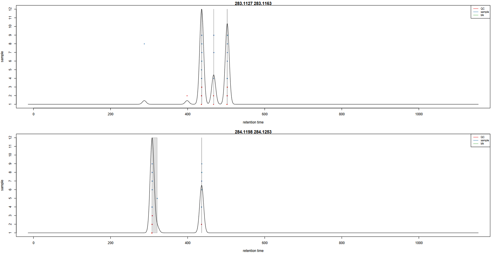

# Introduction


Metabolomics is a *-omic* science known for being one of the most closely related to phenotypes.
It involves the study of different types of matrices, such as blood, urine, tissues, in various organisms including plants.
It focuses on studying the very small molecules which are called *metabolites*, to better understand matters linked to the metabolism.

One of the three main technologies used to perform metabolomic analyses is **Liquid-Chromatography Mass Spectrometry** (LC-MS). Data analysis
for this technology requires a large variety of steps, ranging from extracting information from the raw data to statistical analysis and annotation.
To be able to perform a complete LC-MS analysis in a single environment, the [Wokflow4Metabolomics](http://workflow4metabolomics.org/)
team provides Galaxy tools dedicated to metabolomics. This tutorial details the steps involved in the first part of untargeted LC-MS
data processing: extracting information from raw data to obtain what is called a peak table. This step is commonly refered to as
the preprocessing step. This tutorial will show you how to perform such a step using the Galaxy implementation of the XCMS software.

To illustrate this approach, we will use data from . The objectives of this paper was to analyze
the influence of age, body mass index, and gender on the urine metabolome. To do so, the authors collected samples
from 183 employees from the French Alternative Energies and Atomic Energy Commission (CEA) and performed LC-HRMS LTQ-Orbitrap
(negative ionization mode).

Since the original dataset takes a few hours to be processed, we chose to take a limited subset of individuals for this tutorial.
This will enable you to perform an example of metabolomic preprocessing workflow in a limited time, even though
the results obtained may not be reliable enough for biological interpretation due to the small sample size.
Nevertheless, the chosen diversity of sample will allow you to explore the basics of a preprocessing workflow.

We chose a subset of 12 samples, composed of 6 biological samples, 3 quality-control pooled samples ('QC pools' - mix of all
biological samples) and 3 blank samples ('blanks' - injection solvent).

To analyze these data, we will then follow a Galaxy workflow
developed by the [Wokflow4metabolomics group](http://workflow4metabolomics.org/) (, ).

[](../../images/lcmspreproc_wf.png)

> <comment-title>Workflow4Metabolomics public history</comment-title>
>
> This training material can be followed running it on any Galaxy instance holding the Galaxy modules needed.
> Nonetheless, if you happen to be a W4M user and do not want to run the hands-on yourself, please note that
> you can find the entire history in the 'published histories' section:
> [GTN_LCMSpreprocessing](https://workflow4metabolomics.usegalaxy.fr/u/peteram/h/gtnlcmspreprocessing)
>
{: .comment}

**Preprocessing with XCMS**

**XCMS** () is a free and open source software dedicated to pre-processing of any type of mass spectrometry acquisition files from low to
high resolution, including FT-MS data coupled with different kind of chromatography (liquid or gas). This software is
used worldwide by a huge community of specialists in metabolomics using mass spectrometry methods.

This software is based on different algorithms that have been published, and is provided and maintained using R software.

Since sometimes a couple of pictures is worth a thousand words, you will find in the following slides some material to help
you understand how XCMS works:
[link to slides](../../tutorials/lcms-preprocessing/slides.html).
This document is refered to as "Check the next X slides" in the present training material.
As an example, [check the next 2 slides](../../tutorials/lcms-preprocessing/slides.html#raw-to-matrix)
for complementary material about XCMS R package.


> <agenda-title></agenda-title>
>
> In this tutorial, we will cover:
>
> 1. TOC
> {:toc}
>
{: .agenda}


# Data preparation for XCMS

The **XCMS**  R package is composed of R functions able to extract, filter, align and fill gap, with the possibility to annotate isotopes,
adducts and fragments using the CAMERA R package (). This set of functions gives modularity, and thus is particularly well
adapted to define workflows, one of the key points of Galaxy.

The first Galaxy module, **MSnbase readMSData** , is meant to read files with open format as `mzXML`, `mzMl`, `mzData` and `netCDF`,
which are independent of the constructors' formats.
First of all, you need to upload your data (that must be in one of the cited open formats) into Galaxy.


## Importing the LC-MS data into Galaxy

In metabolomics studies, the number of samples can vary a lot (from a handful to several hundreds). Thus, extracting your
data from the raw files can be very fast, or take quite a long time. To optimise the computation time as much as possible,
the W4M core team chose to develop tools that can run single raw files in parallel for the first steps of
pre-processing, since the initial actions in the extraction process treat files independently.

Since the first steps can be run on each file independently, the use of **Dataset collections** in Galaxy is recommended, to avoid
having to launch jobs manually for each sample. You can start using the dataset collection option from the very beginning of your analysis, when uploading your data into Galaxy.

> <hands-on-title>Data upload the mzXML with <b>Get data</b></hands-on-title>
>
> 1. Create a new history for this tutorial
>
>    
>
> 2. Import the 12 `mzXML` files into a collection named `mzML`
>    - Option 1: from a shared data library (ask your instructor)
>    - Option 2: from Zenodo using the URLs given below
>
>      [](https://doi.org/10.5281/zenodo.3757956)
>    ```
>    https://zenodo.org/record/3757956/files/Blanc05.mzML
>    https://zenodo.org/record/3757956/files/Blanc10.mzML
>    https://zenodo.org/record/3757956/files/Blanc16.mzML
>    https://zenodo.org/record/3757956/files/HU_neg_048.mzML
>    https://zenodo.org/record/3757956/files/HU_neg_090.mzML
>    https://zenodo.org/record/3757956/files/HU_neg_123.mzML
>    https://zenodo.org/record/3757956/files/HU_neg_157.mzML
>    https://zenodo.org/record/3757956/files/HU_neg_173.mzML
>    https://zenodo.org/record/3757956/files/HU_neg_192.mzML
>    https://zenodo.org/record/3757956/files/QC1_002.mzML
>    https://zenodo.org/record/3757956/files/QC1_008.mzML
>    https://zenodo.org/record/3757956/files/QC1_014.mzML
>    ```
>
>    
>
>    
>
> 3. Make sure your data is in a **collection**. Make sure it is named `mzML`
>    - If you forgot to select the collection option during import, you can create the collection now:
>
>    
>
> > <tip-title>Comment to W4M users</tip-title>
> >
> > If you happen to be a W4M user, please note that you can find at the following link a ready-to-start history:
> > [GTN_LCMSpreprocessing_mzML](https://workflow4metabolomics.usegalaxy.fr/u/peteram/h/gtnlcmspreprocessingmzml).
> > We highly recommend to get started by importing this history.
> >
> > In the [GTN_LCMSpreprocessing](https://workflow4metabolomics.usegalaxy.fr/u/peteram/h/gtnlcmspreprocessing) history,
> > this step corresponds to the dataset collection number 13.
> {: .tip}
>
{: .hands_on}

You should have in your history a green Dataset collection (`mzML`) with 12 datasets in mzml format.

Their size can be checked by clicking on the information icon  on the individual datasets.

## First Galaxy module: *MSnbase readMSData*

This first step is only meant to read your `mzXML` file and generate an object usable by **XCMS** .

**MSnbase readMSData**  takes as input your raw files and prepares `RData` files for the first XCMS step.

> <hands-on-title>MSnbase readMSData</hands-on-title>
>
> 1. Run **MSnbase readMSData**  with the following parameters:
>    - *"File(s) from your history containing your chromatograms"*: the `mzML` dataset collection
>
>    
>
>  > <tip-title>Comment to W4M users</tip-title>
>  >
>  > In the [GTN_LCMSpreprocessing](https://workflow4metabolomics.usegalaxy.fr/u/peteram/h/gtnlcmspreprocessing) history,
>  > this step corresponds to the dataset collection number 14.
>  {: .tip}
>
>  > <question-title></question-title>
>  >
>  > What do you get as output?
>  >
>  > > <solution-title></solution-title>
>  > >
>  > > 1. A **Dataset collection** containing 12 datasets.
>  > > 2. The datasets are some RData objects with the **rdata.msnbase.raw** datatype.
>  > >
>  > {: .solution}
>  >
>  {: .question}
{: .hands_on}

Now that you have prepared your data, you can begin with the first XCMS extraction step: peakpicking. However, before beginning to
extract meaningful information from your raw data, you may be interested in visualising your chromatograms. This can be of particular
interest if you want to check whether you should consider discarding some range of your analytical sequence (some scans or *retention
time* (RT) ranges).

To do so, you can use a tool that is called **xcms plot chromatogram**  that will plot each sample's chromatogram (see dedicated section
further). However, to use this tool, you may need additional information about your samples for colouring purpose. Thus, you may need
to upload into Galaxy a table containing metadata of your samples (a *sampleMetadata* file).


## Importing a sample metadata file

What we referenced here as a *sampleMetadata* file corresponds to a table containing information about your samples (= sample metadata).

A sample metadata file contains various information for each of your raw files:
- **Classes** which will be used during the preprocessing steps
- **Analytical batches** which will be useful for a batch correction step, along with **sample types** (pool/sample) and **injection order**
- Different **experimental conditions** which can be used for statistics
- Any information about samples that you want to keep, in a *column* format

The content of your sample metadata file has to be filled by you, since it is not contained in your raw data.
Note that you can either:
- Upload an existing metadata file
- Use a template to create one (because it can be painful to get the sample list without misspelling or omission)
  1. Generate a template with the **xcms get a sampleMetadata file**  tool
  2. Fill it using your favorite table editor (Excel, LibreOffice)
  3. Upload it within Galaxy

> <tip-title>Optional: Generate the right template with <b>xcms get a sampleMetadata file</b></tip-title>
>
> In the case of this tutorial, we already prepared a *sampleMetadata* file with all the necessary information.
> Below is an optional hands-on explaining how to get a template to fill, with the two following advantages:
>   1. You will have the exact list of the samples you used in Galaxy, with the exact identifiers (*i.e.* exact sample names)
>   2. You will have a file with the right format (tabulation-separated text file) that only needs to be filled with the information you want.
>
> > <hands-on-title>xcms get a sampleMetadata file</hands-on-title>
> >
> > **xcms get a sampleMetadata file**  with the following parameters:
> >    -  *"RData file"*: the `mzML.raw.RData` collection output from **MSnbase readMSData** 
> >
> > > <tip-title>Comment to W4M users</tip-title>
> > >
> > > In the [GTN_LCMSpreprocessing](https://workflow4metabolomics.usegalaxy.fr/u/peteram/h/gtnlcmspreprocessing) history,
> > > this step corresponds to the dataset number 27.
> > {: .tip}
> >
> {: .hands_on}
>
> An easy step for an easy sampleMetadata filling!
>
> From this tool, you will obtain a `tabular` file (meaning a tab-separated text file) with a first column of identifiers and a
> second column called *class* which is empty for the moment (only '.' for each sample). You can now download this file by clicking on the  icon.
>
{: .tip}


#### Prepare your sampleMetadata file

The sampleMetadata file is a tab-separated table, in text format. This table has to be filled by the user. You can use any
software you find appropriate to construct your table, as long as you save your file in a compatible format. For example, you can
use a spreadsheet software such as Microsoft Excel or LibreOffice.

> <warning-title>Important: Save your table in the correct format</warning-title>
>
> The file has to be a `.txt` or a `.tsv` (tab-separated values). Neither `.xlsx` nor `.odt` are supported.
> If you use a spreadsheet software, be sure to change the default format to **Text (Tab delimited)** or equivalent.
{: .warning}

Once your sampleMetadata table is ready, you can proceed to the upload. In this tutorial we already prepared the table for you ;)

> <tip-title>Optional: Filling the <i>sampleMetadata</i> using the template obtained from Galaxy</tip-title>
>
> For this tutorial, we already provide the *sampleMetadata* file, so you only have to upload it to Galaxy. Below we
> explain how we filled this file from the template we generated in Galaxy.
>
> First, we used **xcms get a sampleMetadata file**  as mentioned in the previous tip box.
>
> We obtained the following table:
>
> sample_name | class
> --- | ---
> QC1_014 | .
> QC1_008 | .
> QC1_002 | .
> HU_neg_192 | .
> HU_neg_173 | .
> HU_neg_157 | .
> HU_neg_123 | .
> HU_neg_090 | .
> HU_neg_048 | .
> Blanc16 | .
> Blanc10 | .
> Blanc05 | .
>
> We used a spreadsheet software to open the file. First, we completed the class column. You will see in further XCMS steps that this
> second column matters.
>
> sample_name | class
> --- | ---
> QC1_014 | QC
> QC1_008 | QC
> QC1_002 | QC
> HU_neg_192 | sample
> HU_neg_173 | sample
> HU_neg_157 | sample
> HU_neg_123 | sample
> HU_neg_090 | sample
> HU_neg_048 | sample
> Blanc16 | blk
> Blanc10 | blk
> Blanc05 | blk
>
> With this column, we will be able to colour the samples depending on the sample type (QC, sample, blk).
> Next, we added columns with interesting or needed information, as following:
>
> sample_name | class | sampleType | injectionOrder | batch | osmolality | sampling | age | bmi | gender
> --- | --- | --- | --- | --- | --- | --- | --- | --- | ---
> QC1_014 | QC | pool | 185 | ne1 | NA | NA | NA | NA | NA
> QC1_008 | QC | pool | 105 | ne1 | NA | NA | NA | NA | NA
> QC1_002 | QC | pool | 27 | ne1 | NA | NA | NA | NA | NA
> HU_neg_192 | sample | sample | 165 | ne1 | 1184 | 8 | 31 | 24.22 | Male
> HU_neg_173 | sample | sample | 148 | ne1 | 182 | 7 | 55 | 20.28 | Female
> HU_neg_157 | sample | sample | 137 | ne1 | 504 | 7 | 43 | 21.95 | Female
> HU_neg_123 | sample | sample | 100 | ne1 | 808 | 5 | 49 | 24.39 | Male
> HU_neg_090 | sample | sample | 75 | ne1 | 787 | 4 | 46 | 19.79 | Male
> HU_neg_048 | sample | sample | 39 | ne1 | 997 | 3 | 39 | 19.49 | Female
> Blanc16 | blk | blank | 173 | ne1 | NA | NA | NA | NA | NA
> Blanc10 | blk | blank | 94 | ne1 | NA | NA | NA | NA | NA
> Blanc05 | blk | blank | 29 | ne1 | NA | NA | NA | NA | NA
>
> In particular, the `batch`, `sampleType` and `injectionOrder` columns are mandatory to correct the data from signal drift during later quality processing
> (see the [Mass spectrometry: LC-MS analysis](../../tutorials/lcms/tutorial.html)
> Galaxy training material for more information).
> Once we completed the table filling, we saved the file, minding to stick with the original format. Then, our *sampleMetadata* was ready to
> be uploaded into Galaxy.
>
{: .tip}


#### Upload the sampleMetada file with 'Get data'

> <hands-on-title>Upload the sampleMetada</hands-on-title>
>
> 1. Import the `sampleMetadata_completed.tsv` file from your computer, from Zenodo or from a shared data library
>    ```
>    https://zenodo.org/record/3757956/files/sampleMetadata_12samp_completed.tsv
>    ```
>
>    
>
>    
>
> 2. Check the data type of your imported files.
>    - The datatype should be `tabular`, if this is not the case, please change the datatype now.
>
>    
>
>    > <comment-title></comment-title>
>    >
>    > Here we provided the sampleMetadata file so we know that the upload led to a 'tabular' file. But from experience we also know that
>    > it can happen that, when uploading a sampleMetadata table, user obtained other inappropriate types of data. This is generally due to the file
>    > not following all the requirements about the format (*e.g.* wrong separator, or lines with different numbers of columns).
>    > Thus, we highly recommend that you always take a second to check the data type after the upload. This way you can handle the problem
>    > right away if you appear to get one of these obvious issues.
>    {: .comment}
>
> 3. Rename your sampleMetadata file with a shorter name 'sampleMetadata_completed.tsv'
>
>    
>
> > <tip-title>Comment to W4M users</tip-title>
> >
> > In the [GTN_LCMSpreprocessing](https://workflow4metabolomics.usegalaxy.fr/u/peteram/h/gtnlcmspreprocessing) history,
> > this step corresponds to the dataset number 28.
> {: .tip}
>
>
> > <question-title></question-title>
> >
> > 1. How many columns should I have in my sampleMetadata file?
> > 2. What kind of class can I have?
> >
> > > <solution-title></solution-title>
> > >
> > > 1. At least 2, with the identifiers and the class column. But as many as you need to describe the potential variability of your samples
> (*e.g.* the person in charge of the sample preparation, the temperature...). This will allow later statistical analysis to expose the relevant parameters.
> > > 2. Sample, QC, blank... The class (the 2nd column) is useful for the preprocessing step with XCMS to detect the metabolite across the samples.
> Thus, it can be important to separate very different types of samples, as biological ones and blank ones for example. If you don't have any specific class
> that you want to consider in XCMS preprocessing, just fill everywhere with `sample` or a dot `.` for example.
> > >
> > {: .solution}
> >
> {: .question}
{: .hands_on}

## Getting an overview of your samples' chromatograms

You may be interested in getting an overview of what your samples' chromatograms look like, for example to see if some of
your samples have distinct overall characteristics, *e.g.* unexpected chromatographic peaks or huge overall intensity.

You can use the *sampleMedata* file we previously uploaded to add some group colours to your samples when visualising your chromatograms.
The tool automatically takes the second column as colour groups when a file is provided.

Note that you can also check the chromatograms at any moment during the workflow, in particular at the following steps:
 - After **MSnbase readMSData**  to help you to define retention time ranges that you may want to discard from the very beginning
(*"Spectra Filters"* section in **xcms findChromPeaks (xcmsSet)**  parameters)
 - After **adjustRtime**  to check the result of the correction (and potentially rerun *adjustRtime* with other settings)

> <hands-on-title>xcms plot chromatogram</hands-on-title>
>
> 1. **xcms plot chromatogram**  with the following parameters:
>   - *"RData file"*: `mzML.raw.RData` (collection)
>   - *"Sample metadata file"*: `sampleMetadata_completed.tsv` that you uploaded previously
>
>    > <comment-title></comment-title>
>    >
>    > If you use this tool at a later step of XCMS workflow and provided in the Merger step a sampleMetadata with a second column containing groups
>    > (see further in this tutorial), you will get colouring according to these groups even without providing a sampleMetadata file as a 'plot chromatogram' parameter.
>    {: .comment}
>
> > <tip-title>Comment to W4M users</tip-title>
> >
> > In the [GTN_LCMSpreprocessing](https://workflow4metabolomics.usegalaxy.fr/u/peteram/h/gtnlcmspreprocessing) history,
> > this step corresponds to the datasets number 29 and 30.
> {: .tip}
>
{: .hands_on}

This tool generates Base Peak Intensity Chromatograms (BPIs) and Total Ion Chromatograms (TICs). If you provide groups as we do here, you obtain two plots:
one with colours based on provided groups, one with one colour per sample.


How BPIs and TICs look like is dependant of the kind of data you have: LC-MS technology used, study design, type of samples, events that may have occured during the analysis...
It can vary a lot from one experiment to another due to these characteristics.
Sometimes you can see (un)expected effects on these plots as retention time variations accros samples, overall sample intensity differences due to analytical or biological
matters, specific peak areas... Generally, it is recommended to first focus on QC pooled samples if you have some, since they are not supposed to be affected by
biological variabilities: it helps you to focus on aspects uncorrelated to individual sample effects. Evaluation of blank samples (if any) can also be a good start:
"Are all blanks globally less intense than real samples?" is a question that can generally be raised.

# First XCMS step: *peak picking*

Now that your data is ready for XCMS processing, the first step is to extract peaks from each of your data files
independently. The idea here is, for each peak, to proceed to chromatographic peak detection.

The XCMS solution provides two different algorithms to perform chromatographic peak detection: *matchedFilter* and
*centWave*. The matchedFilter strategy is the first one provided by the XCMS R package. It is compatible with any
LC-MS device, but was developed at a time when high resolution mass spectrometry was not common standard yet. On the
other side, the **centWave** algorithm () was specifically developed for high resolution mass spectrometry, dedicated to
data in centroid mode. In this tutorial, you will practice using the centWave algorithm.


> <comment-title>How the centWave algorithm works</comment-title>
>
> [Check the next 7 slides](../../tutorials/lcms-preprocessing/slides.html#findchrompeaks)
> to help you understand how the centWave algorithm works.
> Remember that these steps are performed for each of your data files independently.
>  - Firstly, the algorithm detects series of scans with close values of m/z. They are called 'region of interest' (ROI).
> The m/z deviation is defined by the user. The tolerance value should be set according to the mass spectrometer accuracy.
>  - On these regions of interest, a second derivative of a Gaussian model is applied to these consecutive scans in order to define
> the extracted ion chromatographic peak. The Gaussian model is defined by the peak width which corresponds to the standard deviation
> of the Gaussian model. Depending on the shape, the peak is added to the peak list of the current sample.
>
> At the end of the algorithm, a list of peaks is obtained for each sample. This list is then considered to represent the content
> of your sample; if an existing peak is not considered a peak at this step, then it can not be considered in the next steps of
> pre-processing.
>
{: .comment}

Let's try performing the peakpicking step with the **xcms findChromPeaks (xcmsSet)**  tool.


> <hands-on-title>xcms findChromPeaks (xcmsSet)</hands-on-title>
>
> **xcms findChromPeaks (xcmsSet)**  with the following parameters:
>   - *"RData file"*: `mzML.raw.RData` (collection)
>   - *"Extraction method for peaks detection"*: `CentWave - chromatographic peak detection using the centWave method`
>     - *"Max tolerated ppm m/z deviation in consecutive scans in ppm"*: `3`
>     - *"Min,Max peak width in seconds"*: `5,20`
>     - In **Advanced Options**:
>       - *"Prefilter step for for the first analysis step (ROI detection)"*: `3,5000`
>       - *"Noise filter"*: `1000`
>
> You can leave the other parameters with their default values.
>
> > <comment-title></comment-title>
> >
> > Along with the parameters used in the core centWave algorithm, XCMS provides other filtering options allowing you to get
> > rid of ions that you don't want to consider. For example, you can use *Spectra Filters* allowing you to discard some RT or m/z
> > ranges, or *Noise filter* (as in this hands-on) not to use low intensity measures in the ROI detection step.
> {: .comment}
>
> > <tip-title>Comment to W4M users</tip-title>
> >
> > In the [GTN_LCMSpreprocessing](https://workflow4metabolomics.usegalaxy.fr/u/peteram/h/gtnlcmspreprocessing), this step corresponds to
> > the dataset collections number 31 and 32.
> {: .tip}
>
{: .hands_on}

At this step, you obtain a dataset collection containing one `RData` file per sample, with independent lists of ions. Although this
is already a nice result, what you may want now is to get all this files together to identify which are the shared ions between samples.
To do so, XCMS provides a function that is called *groupChromPeaks* (or group). But before proceeding to this grouping step, first you
need to group your individual RData files into a single one.

# Gathering the different samples in one Rdata file

A dedicated tool exists to merge the different `RData` files into a single one: **xcms findChromPeaks Merger** . Although you can simply take as
input your dataset collection alone, the tool also provides the possibility to take into account a sampleMetadata file. Indeed,
depending of your analytical sequence, you may want to treat part of your samples a different way when proceeding to
the grouping step using **xcms groupChromPeaks (group)** .

This can be the case for example if you have in your analytical sequence some blank samples (your injection solvent) that you want to
extract along with your biological samples to be able to use them as a reference for additional noise estimation and noise filtering. The fact that
these blank samples have different characteristics compared to your biological samples can be of importance when setting parameters of
your grouping step. You will see what this is all about in the 'grouping' section of this tutorial, but in the workflow order, it is
at this step that you need to provide the needed information if you want distinction in your grouping step.

In the case of our tutorial data, we have three sample types: the original biological samples ('samples'), quality-control pooled samples ('pools')
corresponding to a mix of all biological samples, and blank samples ('blanks') constituted of injection solvent.
We will consider these three classes for the grouping step. Thus, we need to provide the sampleMetadata file during the merging step,
with the second column defining theses classes.


> <hands-on-title>xcms findChromPeaks Merger</hands-on-title>
>
> 1. **xcms findChromPeaks Merger**  with the following parameters:
>   - *"RData file"*: `mzML.raw.xset.RData` (collection)
>   - *"Sample metadata file"*: `sampleMetadata_completed.tsv`
>
> > <tip-title>Comment to W4M users</tip-title>
> >
> > In the [GTN_LCMSpreprocessing](https://workflow4metabolomics.usegalaxy.fr/u/peteram/h/gtnlcmspreprocessing), this step corresponds to
> > the dataset number 57.
> {: .tip}
>
{: .hands_on}

The tool generates a single `RData` file containing information from all the samples in your dataset collection input.

# Second XCMS step: *determining shared ions across samples*

The first peak picking step gave us lists of ions for each sample. However, what we want now is a single matrix of ions' intensities for all samples.
To obtain such a table, we need to determine, among the individual ion lists, which ions are the same. This is the aim of the present step, called
'grouping'.

Various methods are available to proceed to the grouping step. In this tutorial, we will focus on the 'PeakDensity' method
that performs peak grouping based on time dimension peak densities.

[Check the next 8 slides](../../tutorials/lcms-preprocessing/slides.html#groupchrompeaks),
you will find additional material to help you understand the grouping algorithm.

The group function aligns ions extracted with close retention time and close m/z values in the different samples. In order to define this
similarity, we have to define on one hand a m/z window and on the other hand a retention time window. A binning is then performed in the
mass domain. The size of the bins is called width of overlapping m/z slices. You have to set it according to your mass spectrometer resolution.

Then, a kernel density estimator algorithm is used to detect region of retention time with high density of ions. This algorithm uses a Gaussian
model to group together peaks with similar retention time.

The inclusion of ions in a group is defined by the standard deviation of the Gaussian model, called bandwidth. This parameter has a large weight
on the resulting matrix. It must be chosen according to the quality of the chromatography. To be valid, the number of ions in a group must be greater
than a given number of samples. Either a percentage of the total number of samples or an absolute number of samples can be given. This is defined by the user.

> <hands-on-title>xcms groupChromPeaks (group)</hands-on-title>
>
> **xcms groupChromPeaks (group)**  with the following parameters:
>   - *"RData file"*: `xset.merged.RData`
>   - *"Method to use for grouping"*: `PeakDensity - peak grouping based on time dimension peak densities`
>     - *"Bandwidth"*: `5.0`
>     - *"Minimum fraction of samples"*: `0.9`
>     - *"Width of overlapping m/z slices"*: `0.01`
>   - *"Get the Peak List"*: `Yes`
>     - *"If NA values remain, replace them by 0 in the dataMatrix"*: `No`
>
> > <comment-title>Minimum fraction of samples</comment-title>
> >
> > This parameter sets the minimum proportion of samples in a class where a peak should be found to keep the corresponding ion in the peaktable.
> > The idea is to look inside each class (*i.e.* each group of samples defined in the second column of the sampleMetadata file) and to keep
> > an ion if there is at least one class where the ion is found in at least the specified proportion of samples.
> >
> > The way to define what kind of classes would be relevant is not straightforward. It is a somehow complex combination of your study objectives,
> > the kind of biological matrix you analyse, assumptions you may have on the presence or absence of some compounds...
> > What could typically be considered is whether you have radically different kind of samples (distinct parts of an organism, distinct kind of
> > sample preparation...) and whether you expect huge composition differences between specific biological groups of individuals.
> > For example, if you study human blood samples in order to distinguish specificities between women and men, even if most of the metabolites
> > present may be expected to be find in both groups (at various levels but always present), some may be specific to one such as hormones.
> > Thus, you may consider putting men and women samples in distinct classes.
> >
> > In the Sacurine study, no specific a priori groups were defined. Thus, no specific assumption was taken into consideration regarding biological
> > classes. Thus, in this tutorial we considered only three classes: one for samples, one for pools and one for blanks.
> > Since pools are a mix of all biological samples,
> > we may want to consider an ion only if it is found in every pools. Thus, we may consider setting the 'Minimum fraction of samples' parameter to 1.
> > Considering that it sometimes happens that one sample can be a little out of the box for various reasons (pools do not make exception),
> > we may consider to lower a little this threshold, for example using a proportion of 0.9.
> >
> > Please note that in our example, since the dataset contains only 3 pools, this would make no difference to 1.0 concerning the 'pools' class.
> {: .comment}
>
> > <tip-title>Comment to W4M users</tip-title>
> >
> > In the [GTN_LCMSpreprocessing](https://workflow4metabolomics.usegalaxy.fr/u/peteram/h/gtnlcmspreprocessing), this step corresponds to
> > the datasets number 58 to 61.
> {: .tip}
>
{: .hands_on}


This grouping step is very important because it defines the data matrix which will be used especially for the statistical analyses.
User has to check the effect of parameter values on the result.

In order to check the result of the grouping function, a pdf file is created. It provides one plot per m/z slice found in the data. Each picture
represents the peak density across samples, plotting the corresponding Gaussian model which width is defined by the bandwidth parameter. Each dot
corresponds to a sample, with colours corresponding to defined classes if any. The plot allows to assess the quality of alignment.
The grey areas' width is associated with the bandwidth parameter.

Here is an example of two m/z slices obtained from the hands-on:




> <question-title></question-title>
>
> 1. Look at the `283.1127 - 283.1163` m/z slice. How many peak groups are considered? Can you explain why some peaks are not affected to peak groups?
> 2. Look at the `284.1198 - 284.1253` m/z slice. What do you think could have happened if you had used a smaller bandwidth value?
>
> > <solution-title></solution-title>
> >
> > 1. There are 3 peak groups in this m/z slice. The two peaks that are not assigned to peak groups are alone in their retention time area. Thus,
> >    the number of samples under the corresponding density peaks does not reach the minimum fraction of samples set by the user (0.9) to consider a peak group,
> > in any specified class.
> > 2. If the bandwidth value had been set to a smaller value, the density peak width would have been smaller. With a small-enough bandwidth value,
> >    there could have been two density peaks instead of one under the current first density peak. Thus, the sample in line 5 would have been out of the
> >    previous peak group, thus not assigned to any peak group due to the 0.9 minimum fraction limit.
> >
> {: .solution}
>
{: .question}

When performing a grouping step, you construct a peak table. Even if this step may not be the final extraction step, you can take this opportunity
to check how your peak table looks at this point of the XCMS extraction. For this, you need to set the 'Get the Peak List' option to `Yes`
as done in this tutorial hands-on. This option generates two additional tables:
- a data matrix (xset.merged.group.dataMatrix.tsv) with intensities for each ion and each sample;
- a variable metadata file (xset.merged.group.variableMetadata.tsv) with information concerning the ions.

The variable metadata file contains various information that can be of interest:
- information about the m/z ratio of each ion (`mz`, `mzmin`, `mzmax` columns);
- information about the retention time of each ion (`rt`, `rtmin`, `rtmax` columns);
- the total number of peaks that were found for each ion (`npeaks` column);
- the number of samples in which each ion has been found, for each class (one column per class).

The data matrix contains the intensities for each ion and each sample. When no peak was found in a sample for a specific ion, value is given as NA
(you can choose to get a '0' value instead, using the 'If NA values remain, replace them by 0 in the dataMatrix' option). You can get a summary of NA proportions
using the **Intensity Check**  module.

> <tip-title>Optional: Getting an overview of the proportion of NA in your data</tip-title>
>
> When you choose to export the peak list while using the **xcms groupChromPeaks (group)**  module, you can have a first level of
> information regarding the proportion of NA by looking at the columns of classes you specified (or the `.` column when no class were given) in
> the variable metadata file ('variableMetadata').
> However, since the number of ions can be of hundreds or thousands, it can be difficult to evaluate the overall proportion in the dataset.
> Thus, one way to go is to use the variableMetadata to check specific ions (ones you may have chosen *a priori* and/or ones you spotted due to
> outstanding behaviour), and to use the **Intensity Check**  module to get an overview of the whole dataset.
>
> > <hands-on-title>Intensity Check</hands-on-title>
> >
> > **Intensity Check**  with the following parameters:
> >   - *"Data matrix file"*: `xset.merged.group.dataMatrix.tsv`
> >   - *"Sample metadata file"*: `sampleMetadata_completed.tsv`
> >   - *"Variable metadata file"*: `xset.merged.group.variableMetadata.tsv`
> >   - *"Computation method"*: `For each class of samples`
> >     - *"Class column"*: `c2: class`
> >     - *"Statistics"*: tick `Missing values`
> >     - *"Calculate the mean fold change"*: tick `No`
> >
> > > <tip-title>Comment to W4M users</tip-title>
> > >
> > > In the [GTN_LCMSpreprocessing](https://workflow4metabolomics.usegalaxy.fr/u/peteram/h/gtnlcmspreprocessing), this step corresponds to
> > > the datasets number 62 and 63.
> > {: .tip}
> >
> {: .hands_on}
>
> In the pdf file you will get as output, you can find a plot displaying proportions of NA for each class you specified.
> With the example provided in this tutorial, you can notice that the blk class containing blanks has a high number of NA with 4394 ions
> that have not been found, in any blank.
>
> 
>
> > <question-title></question-title>
> >
> > How many ions in the table have been found in all the pools?
> >
> > > <solution-title></solution-title>
> > >
> > > Knowing that there are 3 pools in the QC class, we can determine there are 4746 ions that have been found in all pools.
> > >
> > {: .solution}
> >
> {: .question}
>
{: .tip}

When looking back at the plots from plotChromPeakDensity.pdf, we can notice that in some cases there seems to be a small drift of retention time for some samples.
This phenomenon is well known with LC-MS techniques. To be able to attribute correct groups for peaks, it may be needed to perform some retention time
correction accross samples. Thus, the idea is (when needed) to apply a retention time strategy on the output of your grouping step, then to perform
a second grouping step on the corrected data.

# Optional XCMS step: *retention time correction*

Sometimes with LC-MS techniques, a deviation in retention time occurs from a sample to another. In particular, this is likely to be observed when you
inject large sequences of samples.

This optional step aims at correcting retention time drift for each peak among samples. The XCMS package provides two algorithms to do so.
[Check the next 4 slides](../../tutorials/lcms-preprocessing/slides.html#adjustrtime),
you will find additional material to help you understand the retention time correction algorithms.
In this training material we will focus on the "PeakGroups" method.

This correction is based on what is called *well behaved peaks*.
One characteristic of these peaks is that they are found in all samples or at least in most of the samples.
Sometimes it is difficult to find enough peaks present in all samples. The user can define a percentage of the total number of samples in which
a peak should be found to be considered a well behaved peak. This parameter is called *minimum required fraction of samples*.

On the contrary, you may have peak groups with more detected peaks than the total number of samples. Those peaks are called *additional peaks*.
If you do not want to consider peak groups with too much additional peaks as 'well behaved peaks', you can use the 'maximal number of additional
peaks' parameter to put them aside.

The algorithm uses statistical smoothing methods. You can choose between linear or loess regression.


> <hands-on-title>xcms adjustRtime (retcor)</hands-on-title>
>
> **xcms adjustRtime (retcor)**  with the following parameters:
>    - *"RData file"*: `xset.merged.groupChromPeaks.RData`
>    - *"Method to use for retention time correction"*: `PeakGroups - retention time correction based on aligment of features (peak groups) present in most/all samples.`
>        - *"Minimum required fraction of samples in which peaks for the peak group were identified"*: `0.7`
>
> You can leave the other parameters to default values.
>
>    > <comment-title></comment-title>
>    >
>    > If you have a very large number of samples (*e.g.* a thousand), it might be impossible to find peaks that are present in 100% of your samples.
>    If that is the case and you still set a very high value for the minimum required fraction of samples, the tool can not complete successfully the retention
>    time correction.
>    A special attention should also be given to this parameter when you expect a large number of peaks not to be present in part of your samples
>    (*e.g.* when dealing with some blank samples).
>    {: .comment}
>
> > <tip-title>Comment to W4M users</tip-title>
> >
> > In the [GTN_LCMSpreprocessing](https://workflow4metabolomics.usegalaxy.fr/u/peteram/h/gtnlcmspreprocessing), this step corresponds to
> > the datasets number 64 and 65.
> {: .tip}
>
{: .hands_on}


This tool generates a plot output that you can use to visualise how retention time correction was applied across the samples and along the chromatogram.
It also allows you to check whether the well behaved peaks were distributed homogeneously along the chromatogram.

> <tip-title>Check the impact of RT correction using 'xcms plot chromatogram'</tip-title>
>
> Apart from the plots generated by the adjustRtime tool, you can check the impact of the retention time
> correction by comparing the chromatogram you obtained previously to a new one generated after correction.
>
> > <hands-on-title>xcms plot chromatogram</hands-on-title>
> >
> > **xcms plot chromatogram**  with the following parameters:
> >    - *"RData file"*: `xset.merged.groupChromPeaks.adjustRtime.RData`
> >
> >    > <comment-title></comment-title>
> >    >
> >    > As in the previous 'plot chromatogram', you can use your completed sampleMetadata file to get colours.
> >    {: .comment}
> >
> > > <tip-title>Comment to W4M users</tip-title>
> > >
> > > In the [GTN_LCMSpreprocessing](https://workflow4metabolomics.usegalaxy.fr/u/peteram/h/gtnlcmspreprocessing), this step corresponds to
> > > the datasets number 66 and 67.
> > {: .tip}
> >
> {: .hands_on}
>
>
{: .tip}


The retention time correction step is not mandatory. However, when it is used retention time values are modified.
Consequently, applying this step on your data requires to complete it with an additional 'grouping' step using the
**xcms groupChromPeaks (group)**  tool again.

Parameters for this second group step are expected to be similar to the first group step. Nonetheless,
since retention times are supposed to be less variable inside a same peak group now, in some cases it can be relevant to
lower a little the bandwidth parameter.

[Check the next slide](../../tutorials/lcms-preprocessing/slides.html#beforeafterrt)
to get an illustration of grouping before/after retention time correction.

> <hands-on-title>second 'xcms groupChromPeaks (group)'</hands-on-title>
>
> **xcms groupChromPeaks (group)**  with the following parameters:
>    - *"RData file"*: `xset.merged.groupChromPeaks.adjustRtime.RData`
>    - *"Method to use for grouping"*: `PeakDensity - peak grouping based on time dimension peak densities`
>        - *"Bandwidth"*: `5.0`
>        - *"Minimum fraction of samples"*: `0.9`
>        - *"Width of overlapping m/z slices"*: `0.01`
>    - *"Get the Peak List"*: `Yes`
>        - *"Convert retention time (seconds) into minutes"*: `Yes`
>        - *"Number of decimal places for retention time values reported in ions' identifiers."*: `2`
>        - *"If NA values remain, replace them by 0 in the dataMatrix"*: `No`
>
>    > <comment-title></comment-title>
>    >
>    > When performing this second grouping, similarly to the first grouping you can take this opportunity to check how your peak table
>    > looks at this point of the XCMS extraction, setting the 'Get the Peak List' option to `Yes`. As previously explained, you can
>    > look at your variableMetadata file as well as perform an NA diagnostic using the **Intensity Check**  module.
>    {: .comment}
>
> > <tip-title>Comment to W4M users</tip-title>
> >
> > In the [GTN_LCMSpreprocessing](https://workflow4metabolomics.usegalaxy.fr/u/peteram/h/gtnlcmspreprocessing), this step corresponds to
> > the datasets from number 68 to number 71.
> {: .tip}
>
{: .hands_on}

It is possible to use the retention time correction and grouping step in an iterative way if needed. Once you perform your
last adjustRtime step and thus your last grouping step, you will obtain your final peak list (*i.e.* final list of ions).

> <question-title></question-title>
>
> 1. How many ions did you obtained with the final grouping step?
> 2. Open the dataMatrix file you obtained with the final grouping. This table corresponds to intensities for each ion and each
>    sample. What do you notice when looking at the intensity of the fourth ion regarding the first sample?
>
> > <solution-title></solution-title>
> >
> > 1. The final grouping step led to 5100 ions.
> > 2. The fourth ion (M74T317) has a 'NA' value for the first sample (QC1_014). This is also the case for several other ions
> >    and samples.
> >
> {: .solution}
>
{: .question}

At this point of the XCMS extraction workflow, the peak list may contain NA when peaks were not considered peaks in only some
of the samples in the first 'findChromPeaks' step. This does not necessary means that no peak exists for these samples. For example,
sometimes peaks are of very low intensity for some samples and were not kept as peaks because of that in the first 'findChromPeaks'
step.

To be able to get the information that may actually exist behind NAs, there is an additional XCMS step that is called *fillChromPeaks*.

> <comment-title></comment-title>
>
> Before performing the 'fillChromPeaks' step, it is highly recommended to first have a look at your data concerning the distribution
> of NAs in your data. Indeed, this will allow you to check whether your results are consistent with your expectations; if not you
> may want to go back to some of your parameter choices in previous XCMS steps.
> To perform your NA diagnosis, you can use the variableMetadata file and dataMatrix file that you obtained with the last grouping step
> with the 'Get the Peak List' option to `Yes`. The variableMetadata file contains information about your ions: you will find information
> about the number of peaks detected for each ion. The dataMatrix files contains the intensities for each ion and each sample.
> As suggested previously (after the first grouping step), you can use the **Intensity Check**  module to get an overview
> of the proportion of NA in your dataset at this step.
{: .comment}


# Final XCMS step: *integrating areas of missing peaks*

The idea of this XCMS step is to integrate signal in the mz-rt area of an ion (chromatographic peak group) for samples in which no
chromatographic peak for this ion was identified.
To do so, you can use the *xcms fillChromPeaks (fillPeaks)* tool
([check the next slide](../../tutorials/lcms-preprocessing/slides.html#fillchrompeaks)).

However, before any automatic filling of missing values, you may be interested in an overview of the NA distribution in your data.
Indeed, depending on you extraction parameters, you may have an unexpectedly high proportion of NAs in your data. If that is the case,
you may consider reviewing your previous extraction parameters and re-running previous steps to obtain consistant results before
proceeding to the integration of missing peak areas.

To get an overview of your missing data, as specified previously you can use the **Intensity check**  module.

Once you are satisfied with the optimisation of previous extraction parameters, you can proceed to the integration of missing peak areas.

> <hands-on-title>xcms fillChromPeaks (fillPeaks)</hands-on-title>
>
> **xcms fillChromPeaks (fillPeaks)**  with the following parameters:
>    - *"RData file"*: `xset.merged.groupChromPeaks.*.RData` (last step of your previous XCMS step)
>    - In *"Peak List"*:
>        - *"Convert retention time (seconds) into minutes"*: `Yes`
>        - *"Number of decimal places for retention time values reported in ions' identifiers."*: `2`
>
>    > <comment-title></comment-title>
>    >
>    > The *"Reported intensity values"* parameter is important here. It defines how the intensity will be computed. You have three choices:
>    > - into : integration of peaks (*i.e.* areas under the peaks)
>    > - maxo : maximum height of peaks
>    > - intb : integration of peaks with baseline subtraction
>    {: .comment}
>
> > <tip-title>Comment to W4M users</tip-title>
> >
> > In the [GTN_LCMSpreprocessing](https://workflow4metabolomics.usegalaxy.fr/u/peteram/h/gtnlcmspreprocessing), this step corresponds to
> > the datasets number 72 to 74.
> {: .tip}
>
{: .hands_on}

With this 'fillChromPeaks' step, you obtain your final intensity table. At this step, you have everything mandatory to begin analysing
your data:
 - A *sampleMetadata* file (if not done yet, to be completed with information about your samples)
 - A *dataMatrix* file (with the intensities)
 - A *variableMetadata* file (with information about ions such as retention times, m/z)

Nonetheless, before proceeding with the next step in an untargeted metabolomic workflow (processing and filtering of your data), you can add an optional step
with the **CAMERA.annotate**  module. This tool uses the CAMERA R package to perform a first annotation of your data based on XCMS outputs.


# Annotation with CAMERA [Optional]

This last step provides annotation of isotopes, adducts and neutral losses. It gives also some basic univariate statistics in case you
considered several groups for your XCMS extraction.

There is a huge number of parameters that will not be detailed in this short tutorial. However most of the default values can be kept here
for a first attempt to run this function. Nevertheless, a few parameters have to be set at each run:
 - The polarity has to be set since it affects annotation.
 - For statistical analysis, you have to define if you have two or more conditions to compare. These conditions had to be defined in the
 sample metadata uploaded previously and taken into account in the XCMS workflow.
 - You can define how many significant ions will be used for extracted ions chromatogram (EIC) plot. These plots will be included in a pdf file.

 Apart from the PDF file, the main three outcomes from **CAMERA.annotate**  are three columns added in the variableMetadata file:
 - **isotopes:** the name says everything
 - **adduct:** same here; this column is filled in the 'All functions' mode only
 - **pcgroup:** this stands for Pearson's correlation group; it corresponds to groups of ions that match regarding retention time and intensity
 correlations, leading to think that maybe they could come from the same original metabolite.

> <hands-on-title>CAMERA.annotate</hands-on-title>
>
> 1. **CAMERA.annotate**  with the following parameters:
>    - *"RData file"*: `xset.merged.groupChromPeaks.*.fillChromPeaks.RData`
>    - In *"Annotate Isotopes [findIsotopes]"*:
>        - *"Max. ion charge"*: `2`
>    - *"Mode"*: `Only groupFWHM and findIsotopes functions [quick]`
>    - In *"Export options"*:
>        - *"Convert retention time (seconds) into minutes"*: `Yes`
>        - *"Number of decimal places for retention time values reported in ions' identifiers."*: `2`
>
>    > <comment-title></comment-title>
>    >
>    > As said previously, there are quite a few parameters in this tool, some of them having very high impact on your annotations.
>    > In particular, the **Mode** parameter will influence a lot your results regarding pcgroups, and adducts (that will not be computed otherwise).
>    {: .comment}
>
> > <tip-title>Comment to W4M users</tip-title>
> >
> > In the [GTN_LCMSpreprocessing](https://workflow4metabolomics.usegalaxy.fr/u/peteram/h/gtnlcmspreprocessing), this step corresponds to
> > the datasets number 75 and 76.
> {: .tip}
>
{: .hands_on}

The information given by this tool is not mandatory for the next step of a metabolomic workflow. Commonly, annotation is considered a later
step in the pipeline, but since CAMERA uses the outputs of XCMS, if you want to use it you better do it at this step, allowing you to have the
corresponding information in your variableMetadata file for later use.


# Finalising your pre-processing

Pre-processing requires a significant number of parameters to set. To help you summarise your final XCMS workflow, the **xcms process history**
 module enables the summary of all used XCMS parameters, along with the sample list and the final XCMS R object overview.
With only one single HTML file generated, you have access to all this information.

> <hands-on-title>xcms process history</hands-on-title>
>
> 1. **xcms process history**  with the following parameters:
>    - *"xset RData file"*: `xset.merged.[...].fillChromPeaks.RData`
>
>    > <comment-title></comment-title>
>    >
>    > This module can be used after any XCMS step using the generated .RData file.
>    {: .comment}
>
> > <tip-title>Comment to W4M users</tip-title>
> >
> > In the [GTN_LCMSpreprocessing](https://workflow4metabolomics.usegalaxy.fr/u/peteram/h/gtnlcmspreprocessing), this step corresponds to
> > the dataset number 77.
> {: .tip}
>
{: .hands_on}

At this step, you get all the data needed to proceed to any appropriate data processing and analysis using the 3 tables you obtained from
this pre-processing workflow.

> <tip-title>Switch your identifiers with <b>ID choice</b></tip-title>
>
> You may have noticed the option provided in XCMS modules to specify a number of decimal places for m/z and RT values reported in
> ions' identifiers. This option, available for modules generating variableMetadata files, creates an additional column named *namecustom*.
> You can use this column to switch automatic ion IDs to these customised ones, using the **ID choice**  tool.
>
> > <hands-on-title>ID choice</hands-on-title>
> >
> > 1. **ID choice**  with the following parameters:
> >    - *"Data matrix file"*: the `xset.merged[...].dataMatrix.tsv` dataset from your last XCMS step
> >    - *"Metadata file containing your new IDs"*: the `xset.merged[...].variableMetadata.tsv` dataset from your last XCMS or CAMERA step
> >    - *"Which ID do you want to change?"*: `Variables`
> >    - *"Name of the column to consider as new ID"*: `namecustom`
> >
> > > <tip-title>Comment to W4M users</tip-title>
> > >
> > > In the [GTN_LCMSpreprocessing](https://workflow4metabolomics.usegalaxy.fr/u/peteram/h/gtnlcmspreprocessing) history,
> > > this step corresponds to the datasets number 78 and 79.
> > {: .tip}
> >
> {: .hands_on}
>
> Note that the **ID choice**  module can be used on sample identifiers too. This can be particularly useful when
> the raw files (used to determine sample IDs in XCMS) have automatically-generated names that can be unfriendly and excessively long.
>
{: .tip}

The pre-processing part of a metabolomic analysis corresponds to quite a few number of steps, depending of your analysis.
It can generate several versions of your 3 tables, with only one of interest for each at the end of the extraction process.
We highly recommend, at this step of a metabolomic workflow, to split your analysis by beginning a new Galaxy history with only
the 3 tables you need. This will help you in limiting selecting the wrong datasets in further analyses, and bring a little tidiness
for future review of your analysis process.

We also recommend you to rename your 3 tables before proceeding with further data processing and analysis.
Indeed, you may have notice that the XCMS tools generate output names that contain the different XCMS steps you used,
enabling easy traceability while browsing your history. However, knowing that the next steps of analysis are also going to extend
the 3 tables names, if you keep the original names it will become very long and thus may reduce the names readability.
Hence, we highly recommend you to rename them with something short, e.g. sampleMetadata, variableMetadata and dataMatrix,
or anything not too long that you may find convenient.


# Conclusion


This tutorial allowed you to get a glance at what data pre-processing in Metabolomics could look like when dealing with LC-MS data.
The workflow used here as an example is only one glance at what you can construct using Galaxy.
Now that you know that tools exist and are available in this accessible, reproducible and transparent resource
that Galaxy is, all that remains for you to make high level reproducible science is to develop and apply your expertise in Metabolomics,
and create, run and share!
