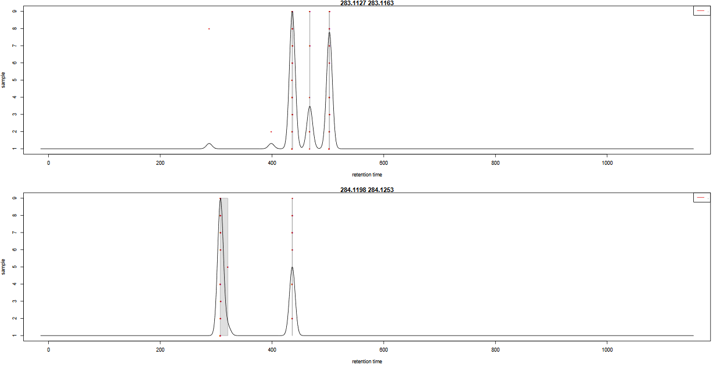
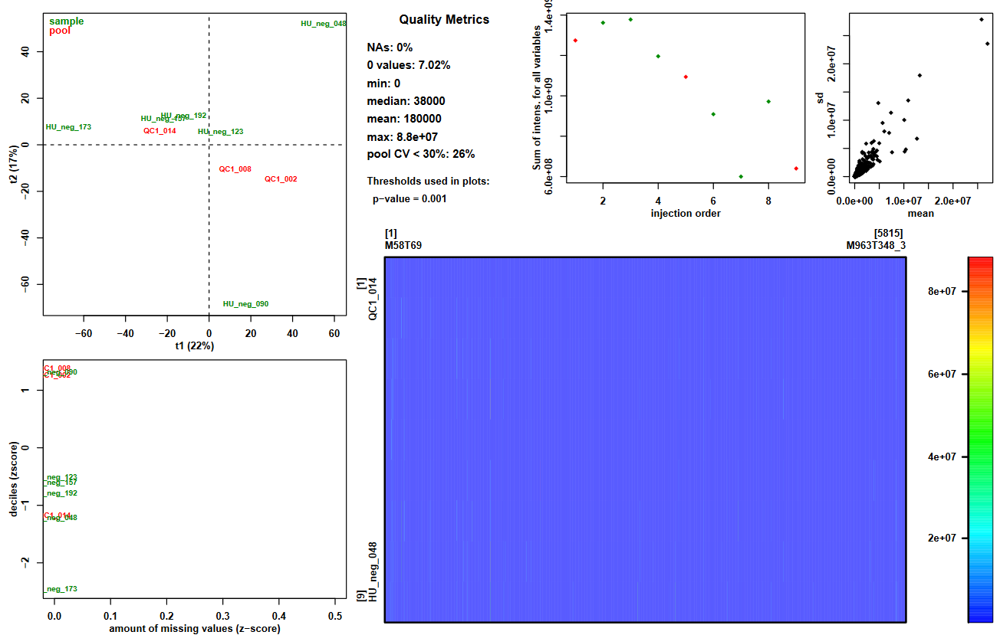
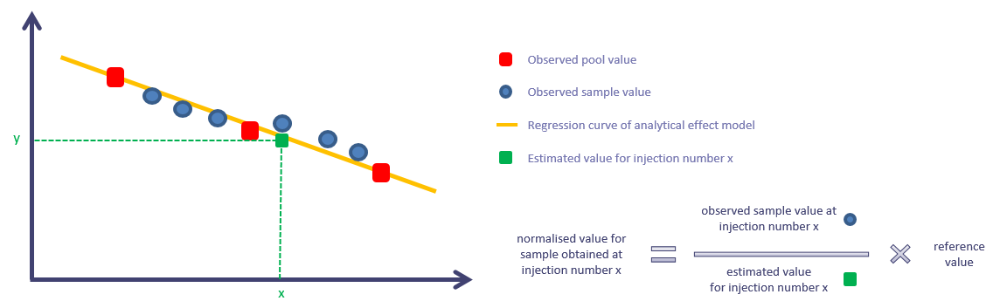
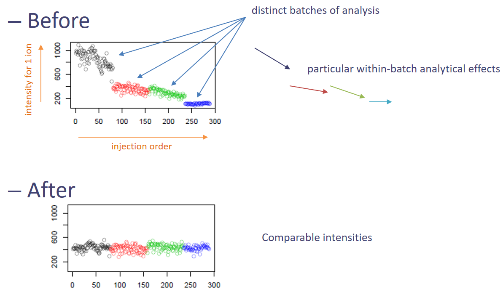

# Introduction
{:.no_toc}

**TODO** Explain why metabolomics, what do you want to do

To illustrate this approach, we will use data from . The objectives of this paper was to analyze
the influence of age, body mass index, and gender on the urine metabolome. To do so, the authors collected samples
from 183 employees from the French Alternative Energies and Atomic Energy Commission (CEA) and performed LC-HRMS LTQ-Orbitrap
(negative ionization mode) (**TODO** explain the terms).

Since the original dataset takes a few hours to be processed, we chose to take a limited subset of individuals for this tutorial.
This will allow you to perform an example of metabolomic workflow from pre-processing to annotation in a limited time, even though
the results obtained may not be reliable from a scientific point of view due to a sample size way too small. Nevertheless,
the chosen diversity of sample will allow you to explore the bases of a metabolomic workflow.

We chose a subset of 9 samples, composed of 6 biological samples and 3 quality-control pooled samples (QC pools - mix of all
biological samples).

To analyze these data, we will the follow a light version of the [LC-MS workflow](http://workflow4metabolomics.org/the-lc-ms-workflow),
developed by the [Wokflow4metabolomics group](http://workflow4metabolomics.org/), (, ).
**TODO** Introduce with one or two sentence the workflow (explanation of the meaning of LC-MS, the big steps, etc).
This workflow takes as input **TODO** and perform several steps: pre-processing, statistics and annotation.


> ### Agenda
>
> In this tutorial, we will cover:
>
> 1. TOC
> {:toc}
>
{: .agenda}


# Preprocessing with XCMS

The first step in the workflow is the pre-processing of the raw data with XCMS ().

XCMS is a free and open source software dedicated to pre-processing of any types of mass spectrometry acquisition files from low to
high resolution, including FT-MS data coupled with different kind of chromatography (liquid or gaz). This software is
used worldwide by a huge community of specialists in metabolomics using mass spectrometry methods.

This software is based on different algorithms that have been published, and is provided and maintained using R software.

XCMS is able to read files with open format as mzXML, mzMl, mzData and netCDF which are independent of the constructors' formats.

It is composed of R functions able to extract, filter, align and fill gap, with the possibility to annotate isotopes,
adducts and fragments using the R package CAMERA. This set of functions gives modularity, thus being particularly well
adapted to define workflows, one of the key points of Galaxy:


## Importing the LC/MS data into Galaxy

In metabolomics studies, the number of samples can vary a lot (from a few ones to hundreds). Thus, extracting your
data from the raw files can be very fast as well as take quite a long time. To optimise as much as possible the
computing time, W4M core team chose to propose modules that can run single raw files for the first steps of
pre-processing, since the initial actions in the extraction process treat files independantly.

Since the first steps can be run on each file, the use of **Dataset collection** is recommanded in Galaxy to avoid
launching jobs manually for each sample. You can consider the Dataset collection option from the very beginning, while
uploading your data into Galaxy.

> ###  Hands-on: Data upload the mzXML with **Get data**
>
> 1. Create a new history for this tutorial
> 2. Import the 9 mzXML files from [Zenodo](http://doi.org/10.5281/zenodo.3244991) or a shared data library inside a collection
>    - HU_neg_048.mzML
>    - HU_neg_090.mzML
>    - HU_neg_123.mzML
>    - HU_neg_157.mzML
>    - HU_neg_173.mzML
>    - HU_neg_192.mzML
>    - QC1_002.mzML
>    - QC1_008.mzML
>    - QC1_014.mzML
>
>    ```
>    https://zenodo.org/record/3244991/files/HU_neg_048.mzML
>    https://zenodo.org/record/3244991/files/HU_neg_090.mzML
>    https://zenodo.org/record/3244991/files/HU_neg_123.mzML
>    https://zenodo.org/record/3244991/files/HU_neg_157.mzML
>    https://zenodo.org/record/3244991/files/HU_neg_173.mzML
>    https://zenodo.org/record/3244991/files/HU_neg_192.mzML
>    https://zenodo.org/record/3244991/files/QC1_002.mzML
>    https://zenodo.org/record/3244991/files/QC1_008.mzML
>    https://zenodo.org/record/3244991/files/QC1_014.mzML
>    ```
>
>    
>    
>
{: .hands_on}

You should have in your history a green Dataset collection (`sacurine`) with 9 datasets with as format mzml.

Their size can be checked in their information panel (i)

## Data preparation for XCMS

This first step is only meant to read your mzXML and generate an object usable by XCMS.

**MSnbase readMSData** takes as input your raw files and prepares RData files for the first XCMS step.

> ###  Hands-on: MSnbase readMSData
>
> Use **MSnbase readMSData**  with the following parameters:
>    - *"File(s) from your history containing your chromatograms"*:
>        - Click on the folder icon to select the Dataset collection: `sacurine`
>
{: .hands_on}


> ###  Question
>
> What do you get as output?
>
> > ###  Solution
> >
> > 1. A **Dataset collection** containing 9 dataset
> > 2. The dataset are some RData object with the datatype **rdata.msnbase.raw**
> >
> {: .solution}
>
{: .question}

## First XCMS step: *peak picking*

Now that your data is ready for XCMS processing, the first step is to extract peaks from each of your data files
independently. The idea here is, for each peak, to proceed to chromatographic peak detection. 

The XCMS solution provides two different algorithms to perform chromatographic peak detection: *matchedFilter* and
*centWave*. The matchedFilter strategy is the first one provided by the XCMS R package. It is compatible with any 
LC-MS device, but was developed at a time when high resolution mass spectrometry was not common standard yet. On the 
other side, the centWave algorithm was specifically developped for high resolution mass spectrometry, dedicated to 
data in centroid mode. In this tutorial, you are goning to practice using the centWave algorithm. 

**Overview of how centWave works**

Remember that these steps are performed for each of your data files independantly.
 - Firstly, the algorithm detects series of scans with close values of m over z. They are called 'region of interest' (ROI). 
The m over z deviation is defined by the user. The tolerance value should be set according to the mass spectrometer accuracy.
 - On these Regions of interest, a second derivative of a gaussian model is applied to these consecutive scans in order to define 
the extract ion chromatographic peak. The gaussian model is defined by the peak width which corresponds to the standard deviation 
of the gaussian model. Depending on the shape, the peak is added to the peak list of the current sample.

At the end of the algorithm, a list of peaks is obtained for each sample. This list is then considered to represent the content
of your sample; if an existing peak is not considered a peak at this step, then it can not be considered in the next steps of 
pre-processing. 

Let's try performing the peakpicking step with the **xcms findChromPeaks (xcmsSet)** module in the **LC-MS > Preprocessing** section. 


> ###  Hands-on: xcms findChromPeaks (xcmsSet)
>
> Execute **xcms findChromPeaks (xcmsSet)**  with the following parameters:
>    - *"RData file"*:
>        - Click on the folder icon to select the Dataset collection: `The one from the previous 'MSnbase readMSData' step`
>    - *"Extraction method for peaks detection"*: `CentWave - chromatographic peak detection using the centWave method`
>        - *"Max tolerated ppm m/z deviation in consecutive scans in ppm"*: `3`
>        - *"Min,Max peak width in seconds"*: `5,20`
>        - In *"Advanced Options"*:
>            - *"Prefilter step for for the first analysis step (ROI detection)"*: `3,5000`
>            - *"Noise filter"*: `1000`
>
> You can leave the other parameters with their default values. 
>
>    > ###  Comment
>    >
>    > Along with the parameters used in the core centWave algorithm, XCMS provides other filtering options allowing you to get 
rid of ions that you don't want to consider. For example, you can use *Spectra Filters* allowing you to discard some RT or M/z 
ranges, or *Noise filter* (as in this hands-on) not to use low intensity measures in the ROI detection step. 
>    {: .comment}
>
{: .hands_on}

At this step, you obtained a dataset collection containing one RData file per sample, with independant lists of ions. Although this
is already a nice result, what you may want now is to get all this files together to identify which are the shared ions between samples.
To do so, XCMS provides a function that is called *groupChromPeaks* (or group). But before proceeding to this grouping step, first you
need to group your individual RData files into a single one. And by the way you may also want to get a grasp of your samples' 
chromatograms before going any further (note that you can also plot chromatograms *before* even performing you chromatographic peak
detection). 


## Going from a dataset collection to a single file and checking chromatograms

In Galaxy4Metabolomics, we dedicated a tool to merge the different RData files into a single one. Although you can simply take as
input your dataset collection alone, the module also provides de possibility to take into account a sampleMetadata file. Indeed,
depending of your analytical sequence, you may want to treat part of your samples a different way when proceeding to the grouping step. 

This can be the case for example if you have in your analytical sequence some blank samples (your injection solvent) that you want to
extract along with your biological samples to be able to use them as a reference for noise estimation and noise filtering. The fact that 
these blank samples have different caracteristics compared to your biological samples can be of importance when setting parameters of 
your grouping step. You will see what this is all about in the 'grouping' section of this tutorial, but in the workflow order, it is 
at this step that you need to provide the needed information if you want distinction in your grouping step. 

You can also use the sampleMedata file we mentioned to add some group colors to your samples when visualising your chromatograms. 
In this tutorial, we are not going to use distinct sample groups in the XCMS 'grouping' step. Nevertheless, we will provide a 
sampleMetadata file for chromatogram visualisation purpose. Thus, you will find here how to import such a file into your Galaxy history. 

### Importing a sample metadata file

What we referenced here as a sampleMetadata file corresponds to a table containing information about your samples (= sample metadata).  

A sample metadata file contains various information for each of your raw files:
- classes which will be used during the preprocessing steps
- number of batches which will be useful for a batch correction step, along with sample types (pool/sample) and injection order
- different experimental conditions which can be used for the statistics
- any information about samples that you want to keep, in a "column" format

The content of your sample metadata file has to be filled by you, since it is not contained in your raw data. 
Note that you can either:
- upload one already filled
- use a template (because it can be painful to get the sample list without misspelling or omission)
  1. generate a template with the tool **xcms get a sampleMetadata file**
  2. fill it using your favorite table editor (Excel, Libre Office)
  3. upload it within Galaxy

> ###  Tip: Get the right template with 'xcms get a sampleMetadata file'
>
> In the case of this tutorial, we already prepared a sampleMetadata file with all the needed information. Nevertheless, we provide here 
an optional hands-on if you want to check how to get a template to fill, with the two following advantages:
> - you will have the exact list of the samples you used in Galaxy, with the exact identifiers (*i.e.* exact sample names)
> - you will have a file with the right format (tabulation-separated text file) that only need to be filled with the information you want. 
>
> > ###  Hands-on: xcms get a sampleMetadata file
> >
> > Execute **xcms get a sampleMetadata file**  that you will find in the **XXXXXXXXX** section. You only need to give 
the dataset collection you obtained from the previous 'xcms findChromPeaks (xcmsSet)' step:
> >    - *"RData file"*:
> >        - Click on the folder icon to select the Dataset collection: `The one from the previous 'findChromPeaks' step`
> >
> > An easy step for an easy sampleMetadata filling!
> >
> >
> {: .hands_on}
>
>
> From this module, you will obtain a 'tabular' file (meaning a tabulation-separated text file) with a first column of identifiers and a 
second column called *class* which is empty for the moment (only '.' for each sample). You can download this file using the 
***y a-t-il une icone disquette prevue dans les GTN ??*** icon. 
>
{: .tip}


#### Prepare your sampleMetadata file

The sampleMetadata file is a tabulation-separated table, in text format. This table have to be filled by the user. You can use any 
software you find appropriate to contruct your table, as long as you save your file in a compatible format. For example, you can
use a spreadsheet software such as Microsoft Excel or LibreOffice.

> ###  Comment
>
> The file have to be a `.tsv` (tab-separated values). Neither `.xlsx` nor `.odt` are supported.
> If you use a spreadsheet software, be sure to change the default format to **Text (Tab delimited)** or equivalent. 
{: .comment}

Once your sampleMetadata table is ready, you can proceed to the upload. In this tutorial we already prepared the table for you ;)

> ###  Tip: How did we fill the sampleMetadata using the template obtained from Galaxy?
>
> For this tutorial, we already provide the sampleMetadata file, so you only have to get the table and upload it to Galaxy. Here we 
simply present how we filled the provided file from the template we generated in Galaxy. 
>
> First, we used the 'xcms get a sampleMetadata file' module as mentionned in the previous tip box. We obtained the following table:
>
> sample_name | class
> --- | ---
> QC1_014 | .
> QC1_008 | .
> QC1_002 | .
> HU_neg_192 | .
> HU_neg_173 | .
> HU_neg_157 | .
> HU_neg_123 | .
> HU_neg_090 | .
> HU_neg_048 | .
>
> We used a spreadsheet software to open the file. First, we completed the class column. We do not plan to use this column to process 
XCMS by groups, but we do plan to use it to plot coloured chromatograms. 
>
> sample_name | class
> --- | ---
> QC1_014 | QC
> QC1_008 | QC
> QC1_002 | QC
> HU_neg_192 | sample
> HU_neg_173 | sample
> HU_neg_157 | sample
> HU_neg_123 | sample
> HU_neg_090 | sample
> HU_neg_048 | sample
>
> This way, we will be able to colour the samples depending on the sample type (QC or sample). 
> Next, we added columns with interesting or needed information, as following: 
>
> sample_name | class | polarity | sampleType | injectionOrder | batch | osmolality | sampling | age | bmi | gender
> --- | --- | --- | --- | --- | --- | --- | --- | --- | --- | ---
> QC1_014 | QC | 0 | pool | 185 | ne1 | NA | NA | NA | NA | NA
> QC1_008 | QC | 0 | pool | 105 | ne1 | NA | NA | NA | NA | NA
> QC1_002 | QC | 0 | pool | 27 | ne1 | NA | NA | NA | NA | NA
> HU_neg_192 | sample | 0 | sample | 165 | ne1 | 1184 | 8 | 31 | 24.22 | Male
> HU_neg_173 | sample | 0 | sample | 148 | ne1 | 182 | 7 | 55 | 20.28 | Female
> HU_neg_157 | sample | 0 | sample | 137 | ne1 | 504 | 7 | 43 | 21.95 | Female
> HU_neg_123 | sample | 0 | sample | 100 | ne1 | 808 | 5 | 49 | 24.39 | Male
> HU_neg_090 | sample | 0 | sample | 75 | ne1 | 787 | 4 | 46 | 19.79 | Male
> HU_neg_048 | sample | 0 | sample | 39 | ne1 | 997 | 3 | 39 | 19.49 | Female
>
> In particular, the `batch`, `sampleType` and `injectionOrder` columns are mandatory to correct the data from signal drift (see later in 
the tutorial). 
> Once we completed the table filling, we saved the file, minding to stick with the original format. Hence, our sampleMetadata was ready to 
be uploaded into Galaxy. 
>
{: .tip}


#### Upload the sampleMetada file with 'Get data'

> ###  Hands-on: Data upload the sampleMetada with **Get data**
>
> 1. Import the sampleMetadata_completed.tsv file from [Zenodo](http://doi.org/10.5281/zenodo.3244991) or from a shared data library
>    - sampleMetadata_completed.tsv
>
>    ```
>    https://zenodo.org/record/3244991/files/sampleMetadata_completed.tsv
>    ```
>
>    
>    
>
> 2. Check the data type of your imported files. 
>
>    > ###  Comment
>    >
>    > Here we provided the sampleMetadata file so we know that the upload led to a 'tabular' file. But from experience we also know that 
it can happen that, when uploading a sampleMetadata table, user obtained other inappropriate types of data. This is generally due to the file 
not following all the requirements about the format (*e.g.* wrong separator, or lines with different numbers of columns). 
>    > Thus, we highly recommand that you always take a second to check the data type after the upload. This way you can handle the problem
right away if you appear to get one of these obvious issues. 
>    {: .comment}
>
{: .hands_on}

> ###  Question
>
> 1. How many columns should I have in my sampleMetadata file?
> 2. What kind of class can I have?
>
> > ###  Solution
> >
> > 1. At least 2, with the identifers and the class column. But as many as you need to describe the potential variablity of your samples 
(*e.g.* the person in charge of the sample preparation, the temperature...). The statistical analysis will expose the relevant parameters.
> > 2. Sample, QC, blank... The class (the 2nd column) is useful for the preprocessing step with XCMS to detect the metabolite across the samples. 
So it can be important to separate very different types of samples, as biological ones and blank ones for example. If you don't have any specific class
that you want to consider in XCMS preprocessing, just fill everywhere with `sample` or a dot `.` for example. 
> >
> {: .solution}
>
{: .question}


### Going from a dataset collection to a single file

To merge your individual RData files into one single RData to be used for the grouping step that will follow, you need to use the 
**xcms findChromPeaks Merger** module. For this step, you only need your dataset collection, plus a sampleMetadata **if you want to 
consider groups in the *xcms groupChromPeaks (group)* step that will follow**. 

If you do not have specific reasons to consider groups in your extraction process, then you do not need a sampleMetadata file at this step. 
**Please note that if you provide a sampleMetadata file with the second column reporting several groups, this group information is then taken into
consideration during the grouping step.**

In the case of our tutorial data, we do not want to separate the samples according to groups, so we do not provide the sampleMetadata when executing
the Merger module. 


> ###  Hands-on: xcms findChromPeaks Merger
>
> Execute **xcms findChromPeaks Merger**  with the following parameters:
>    - *"RData file"*:
>        - Click on the folder icon to select the Dataset collection: `The one from the previous 'findChromPeaks' step`
>    - *"Sample metadata file"*:
>        - Leave this parameter to `Nothing selected`
>
{: .hands_on}

The module generates a single RData file containing information from all the samples in your dataset collection input. 

### Getting an overview of your samples' chromatograms

You may be interested in getting an overview of what your samples' chromatograms look like, for example to see if some of
your samples have distinct overall characteristics (unexpected chromatographic peaks, huge overall intensity...). 

Note that you can also check the chromatograms right after the 'MSnbase readMSData' step. In particular, this can help you defining retention time 
ranges that you may want to discard from the very beginning. 

> ###  Hands-on: xcms plot chromatogram
>
> Execute **xcms plot chromatogram**  with the following parameters:
>    - *"RData file"*: `The RData file from the 'Merger' step`
>    - *"Sample metadata file"*: `The sampleMetadata file you uploaded previously`
>
>    > ###  Comment
>    >
>    > If you provided in the Merger step a sampleMetadata with a second column containing groups, you will get colouring according to 
these groups even without providing a sampleMetadata file as a 'plot chromatogram' parameter. 
>    {: .comment}
>
{: .hands_on}

This module generates Base Peak Intensity Chromatograms (BPIs) and Total Ion Chromatograms (TICs). If you provided groups (as in our 
hands-on), you obtain two plots: one with colours based on provided groups, one with one colour per sample. 


## Second XCMS step: determining shared ions across samples

The first peak picking step gave us lists of ions for each sample. However, what we want now is a single matrix of ions intensities for all samples.
To obtain such a table, we need to determine, among the individual ion lists, which ions are the same. This is the aim of the present step, called 
'grouping'.

The group function aligns ions extracted with close retention time and close 'm over z' (m/z) values in the different samples. In order to define this 
similarity, we have to define on one hand a m/z windows and on the other hand a retention time window. A binning is then performed in the 
mass domain. The size of the bins is called width of overlapping m/z slices. You have to set it according to your mass spectrometer resolution. 

Then, a kernel density estimator algorithm is used to detect region of retention time with high density of ions. This algorithm uses a gaussian 
model to group together peaks with similar retention time. 

The inclusion of ions in a group is defined by the standard deviation of the gaussian model, called bandwith. This parameter has a large weight 
on the resulting matrix. It must be chosen according to the quality of the chromatography. To be valid, the number of ions in a group must be greater 
than a given number of samples. Either a percentage of the total number of samples or an absolute value of samples can be given. This is defined by the user.

> ###  Hands-on: xcms groupChromPeaks (group)
>
> Execute **xcms groupChromPeaks (group)**  with the following parameters:
>    - *"RData file"*: `The RData file from the 'Merger' step`
>    - *"Method to use for grouping"*: `PeakDensity - peak grouping based on time dimension peak densities`
>        - *"Bandwidth"*: `5.0`
>        - *"Width of overlapping m/z slices"*: `0.01`
>    - *"Get the Peak List"*: `No`
>
> You can leave the other parameters to zero. 
>
{: .hands_on}


This gouping step is very important because it defines the final data matrix which will be used especially for the statistical analyses. 
User has to check the effect of parameter values on the result.

In order to check the result of group function, a pdf file is created and provides for all m/z slices the gaussian model which width is 
defined by the bandwith parameter. Each red dot corresponds to a sample. The plot allows to assess the quality of alignment. The vertical grey line 
width corresponds to the bandwith parameter.

Hear is an example of two m/z slides obtained from the hands-on:




> ###  Questions
>
> 1. Look at the '283.1127 - 283.1163' m/z slice. How many peak groups are considered? Can you explain why some peaks are not affected to peak groups?
> 2. Look at the '284.1198 - 284.1253' m/z slice. What do you think could have happened if you had used a smaller bandwidth value?
>
> > ###  Solution
> >
> > 1. There are 3 peak groups in this m/z slice. The two peaks that are not assigned to peak groups are alone in their retention time area. Thus,
the number of samples under the corresponding density peaks does not reach the minimum fraction of samples set by the user (0.5) to consider a peak group. 
> > 2. If the bandwidth value had been set to a smaller value, the density peak width would have been smaller. With a small enough bandwidth value,
there could have been two density peaks instead of one under the current first density peak. Thus, the sample in line 5 would have been out of the
previous peak group, thus not assigned to any peak group due to the 0.5 minimum fraction limit. 
> >
> {: .solution}
>
{: .question}


## Optional step: *retention time correction*

Sometimes with LC-MS techniques, a deviation in retention time occurs from a sample to another. In particular, this is likely to be observed when you 
inject large sequences of samples. 

This optional step aims to correct retention time drift for each peak among samples. The correction is based on what is called *well behaved peaks*, 
that are peaks found in all samples or at least in most of the samples.

Sometimes it is difficult to find enough peaks present in allsamples. The user can define a percentage of the total number of samples in which 
a peak should be found to be considered a well behaved peak. This parameter is called *minimum required fraction of samples*.

On the contrary, you may have peak groups with more detected peaks than the total number of samples. Those peaks are called *additional peaks*. 
You can filter those ions defining the maximal number of additional peaks, for a peak to be considered a well behaved peak.

The algorithm uses statistical smothing methods. You can choose between linear or loess regression.


> ###  Hands-on: xcms adjustRtime (retcor)
>
> Execute **xcms adjustRtime (retcor)**  with the following parameters:
>    - *"RData file"*: `The RData file from the 'groupChromPeaks' step`
>    - *"Method to use for retention time correction"*: `PeakGroups - retention time correction based on aligment of features (peak groups) present in most/all samples.`
>        - *"Minimum required fraction of samples in which peaks for the peak group were identified"*: `0.8299`
>        - *"Smooth method"*: `loess - non-linear alignment`
>
> You can leave the other parameters to default values. 
>
>    > ###  Comment
>    >
>    > If you have a very large number of samples (*e.g.* a thousand), it might be impossible to find peaks that are present in 100% of your samples.
If that is the case and you still set a very high value for the minimum required fraction of samples, the module can not complete successfully the retention 
time correction. 
>    {: .comment}
>
{: .hands_on}


This module generates a plot output that you can use to visualise how retention time was apply accross the samples and along the chromatogram. 
It also allows you to check whether the well behaved peaks were distributed homogeniously along the chromatogram. 

> ###  Tip: Check the impact of RT correction using 'xcms plot chromatogram'
>
> Appart from the plots generated by the adjustRtime module, you can check the impact of the retention time
correction by comparing the chromatogram you obtained previously to a new one generated after correction.
>
> > ###  Hands-on: xcms plot chromatogram
> >
> > Execute **xcms plot chromatogram**  with the following parameters:
> >    - *"RData file"*: `The RData file from the 'adjustRtime' step`
> >
> >    > ###  Comment
> >    >
> >    > As in the previous 'plot chromatogram', you can use your completed sampleMetadata file to get colours.
> >    {: .comment}
> >
> {: .hands_on}
> 
>
{: .tip}


The retention time correction step is not mandatory. However, when it is used retention time are modified. 
Consequently, applying this step on your data requires to complete it with an additional 'grouping' step.

Parameters for this second group step are expected to be similar to the first group step. Nonetheless,
since retention times are supposed to be less variable inside a same peak group now, in some cases it can be relevant to 
lower a little the bandwidth parameter. 

> ###  Hands-on: second 'xcms groupChromPeaks (group)'
>
> Execute **xcms groupChromPeaks (group)**  with the following parameters:
>    - *"RData file"*: `The RData file from the 'adjustRtime' step`
>    - *"Method to use for grouping"*: `PeakDensity - peak grouping based on time dimension peak densities`
>        - *"Bandwidth"*: `5.0`
>        - *"Width of overlapping m/z slices"*: `0.01`
>    - *"Get the Peak List"*: `Yes`
>        - *"Convert retention time (seconds) into minutes"*: `Yes`
>        - *"Number of decimal places for retention time values reported in ions' identifiers."*: `2`
>        - *"Replace the remain NA by 0 in the dataMatrix"*: `No`
>
>    > ###  Comment
>    >
>    > When performing this second grouping (or at the first one if you do not plan to perform retention time correction),
you can take this opporunity to check how you peaktable looks like at this point of the XCMS extraction. For this, you can 
set the 'Get the Peak List' option to `Yes`.
>    {: .comment}
>
{: .hands_on}

It is possible to use the retention time correction and grouping step in an iterative way if needed. Once you perform your 
last adjustRtime step and thus your last grouping step, you will obtain your final peak list (*i.e.* final list of ions). 

> ###  Questions
>
> 1. How many ions did you obtained with the final grouping step?
> 2. Open the dataMatrix file you obtained with the final grouping. This table corresponds to intensities for each ion and each 
samples. What do you notice when looking at the intensity of the first ion regarding the first sample?
>
> > ###  Solution
> >
> > 1. The final grouping step led to 5815 ions.
> > 2. The first ion (M58T69) has an 'NA' value for the first sample (QC1_014). This is also the case for several other ions 
and samples. 
> >
> {: .solution}
>
{: .question}

At this point of the XCMS extraction workflow, the peak list may contain NA when peaks where not considered peaks in only some 
of the samples in the first 'findChromPeaks' step. This does not necessary means that no peak exist for these samples. For example, 
sometimes peaks are of very low intensities for some samples and were not kept as peaks because of that in the first 'findChromPeaks' 
step. 

To be able to get the information that may actually exist behind NAs, there is an additional XCMS step that is call *fillChromPeaks*.

> ###  Comment
>
> Before performing the 'fillChromPeaks' step, it is highly recommended to first have a look of your data concerning the distribution 
of NAs in your data. Indeed, this will allow you to check whether your results are consistent with your expectations; if not you 
may want to go back to some of your parameter choices in previous XCMS steps. 
> To perform your NA diagnosis, you can use the variableMetadata file and dataMatrix file that you obtained with the last grouping step 
with the 'Get the Peak List' option to `Yes`. The variableMetadata file contains information about your ions: you will find information 
anout the number of peaks detected for each ion. The dataMatrix files contains the intensities for each ion and each sample. 
{: .comment}


## Final XCMS step: *integrating areas of missing peaks*

The idea of the XCMS step is to integrate signal in the mz-rt area of an ion (chromatographic peak group) for samples in which no 
chromatographic peak for this ion was identified. 

> ###  Hands-on: xcms fillChromPeaks (fillPeaks)
>
> Execute **xcms fillChromPeaks (fillPeaks)**  with the following parameters:
>    - *"RData file"*: `The RData file from the last 'groupChromPeaks' step`
>    - In *"Peak List"*:
>        - *"Convert retention time (seconds) into minutes"*: `Yes`
>        - *"Number of decimal places for retention time values reported in ions' identifiers."*: `2`
>
> You can leave other parameters to default values. 
>
>
{: .hands_on}

With this 'fillChromPeaks' step, you obtain your final intensity table. At this step, you have everything mandatory to begin analysing 
your data: 
 - a sampleMetadata file (if not done yep, to be completed with information about your samples)
 - a dataMatrix file (with the intensities)
 - a variableMEtadata file (with information about ions such as retention times, m/z)

Nonetheless, before proceeding with the next step in the workflow (processing and filtering of your data), you can add an optional step 
with the *CAMERA.annotate* module. This tool uses the CAMERA R package to perform a first annotation of your data based on XCMS outputs. 


## Optional step: annotation with CAMERA

Blablabla

> ###  Hands-on: CAMERA.annotate
>
> 1. **CAMERA.annotate**  with the following parameters:
>    - In *"Annotate Isotopes [findIsotopes]"*:
>        - *"Max. ion charge"*: `2`
>    - *"Mode"*: `Only groupFWHM and findIsotopes functions [quick]`
>    - In *"Statistics and results export: [diffreport]"*:
>        - *"Number of condition"*: `One condition`
>    - In *"Export options"*:
>        - *"Convert retention time (seconds) into minutes"*: `Yes`
>        - *"Number of decimal places for retention time values reported in ions' identifiers."*: `2`
>    - In *"Resubmit your raw dataset or your zip file"*:
>        - *"Resubmit your dataset or your zip file"*: `no need`
>
>    ***TODO***: *Check parameter descriptions*
>
>    ***TODO***: *Consider adding a comment or tip box*
>
>    > ###  Comment
>    >
>    > A comment about the tool or something else. This box can also be in the main text
>    {: .comment}
>
{: .hands_on}

***TODO***: *Consider adding a question to test the learners understanding of the previous exercise*

> ###  Questions
>
> 1. Question1?
> 2. Question2?
>
> > ###  Solution
> >
> > 1. Answer for question1
> > 2. Answer for question2
> >
> {: .solution}
>
{: .question}


# W4M 3-tables format

To do: add a complement about the 3-table format, depending on the information already given in xcms part.
In particular, a focus on mandatory information for the present tutorial.

Adding a Hands-on to:
- copy the 3 tables into a new history (with question: what are the 3 datasets you need to copy)
- rename the 3 tables into something shorter


# Data processing: quality checks, normalisation, data filtering

In the previous step of LC-MS workflow, you saw how to extract features from your acquisition files. This data is
shaped in a format allowing the use of various standard statistical methods. However, being able to perform a
statistical analysis does not mean necessarily being able to highlight relevant information. Indeed, data are often affected
by various sources of unwanted variability. It can limit the effectiveness of statistical methods, leading sometimes to
difficulties in revealing investigated effects. Identifying such variability can help analysing your data at its full potential.

In this tutorial, we chose to limit the data processing to 3 steps:
 - overview of the variability in the data
 - signal drift correction
 - filtering of unreliable variables based on coefficients of variation

> ###  Comments
> To get a little more information regarding data processing, do not hesitate to visit the usemetabo.oc plateform:
> [Link to LC-MS processing step](https://usemetabo.org/courses/w4mlc-ms-processing)
{: .comment}


## Step 1: global variability in the data

Commonly, LC-MS analysis generates a significant number of variables (hundreds to thousands). Getting a complete view of
such dataset may not be an easy task, but getting a glimpse of it is possible using some common unsupervised multivariate
analysis. One of the most commonly used method is the Principal Components Analysis (PCA). You can get a basic PCA along with
over useful information using the Quality Metrics tool available in the Quality Control section.

> ###  Hands-on: Using **Quality Metrics** to get an overview of your data
>
> Execute **Quality Metrics**  with the following parameters:
>    - *"Data matrix file"*: `The one from 'xcms fillChromPeaks' outputs`
>    - *"Sample metadata file"*: `Your original completed sampleMetadata file`
>    - *"Variable metadata file"*: `The one from 'xcms fillChromPeaks' or 'CAMERA.annotate' outputs`
>
>
>    > ###  Comment
>    >
>    > You can leave other parameters with default values. 
>    {: .comment}
>
{: .hands_on}

For a first overview of your data, you can focus on the graphical output of this tool: **Quality_Metrics_figure.pdf**.
It provides a variety of useful information:
 - summary of the intensities in the dataMatrix file
 - view of these intensities with a color scale
 - 2-components PCA score plot to check for clusters or outliers
 - sum of intensities per sample according to injection order to check the presence of signal drift or batch effect
 - z-scores for intensity distribution and proportion of missing values
 - ions' sd and mean values



> ###  Question time: cross-referencing information
>
> Look at the 'Quality_Metrics_figure.pdf' file.
> 1. Look at the proportion of ions with a pool coefficient of variation <30%. Knowing that pools are identical samples, and that
values with a CV > 30% can not be considered stables, what can you conclude about your dataset regarding the possibility to
compare intensities between samples?
> 2. Look at the sum of intensities per sample according to injection order. What major information do you observe on the plot?
Can this observation help you understand the CV results you just looked at?
> 3. Now look at the PCA plot. Can you explain the first component (t1)? Use the previous plot to help you.
>
> > ###  Solution
> >
> > 1. You can read on the plot that *pool CV < 30%: 26%*, meaning that the pool values are stable only for a quarter of the ions
in your dataset. If the pooled samples are not stable, this means that you can observe differences between samples even when
there are no biological differences. Thus, comparing samples becomes difficult and has high risk of being unreliable.
Consequently, with only a quarter of the ions being stable regarding pool intensities, performing statistical analyses on
this full dataset would probably lead to unreliable results.
> > 2. We can see on the figure that the global intensity of samples seems to decrease with the injection order. In particular,
the fact that the pooled samples' intensities decrease leads us to suspect a signal drift due to the clogging effect of successive
injection of samples.
> > This signal drift could be the reason why so many ions in the dataset leaded to high CV values for pools, since it prevents
at least part of the ions to be stable regarding pools' intensities.
> > 3. If we look closely at the samples' identifiers on the plot, it seems that the lowest numbers in IDs are at the right side
of the first component. Knowing that these numbers correspond to an order in the injection sequence, we can link it to the
previous picture's samples. Then, what we can observe is that the order of samples in the first component of PCA from right to left
corresponds approximately to the decreasing order of sums of intensities. Thus, we can conclude that the main variability in
the dataset may be due to the signal drift.
> >
> {: .solution}
>
{: .question}

## Step 2: handling the signal drift observed althrough the analytical sequence

It is known that when injecting successively a large number of samples, the system tends to get dirty, and this may cause a measure drift.
To prevent inability to catch signal anymore, in case of large injection series, the sequence is generally divided into several batches
and the source is cleaned between batches. Unfortunately, these signal drift and batch design can add significant variability in data,
making sample comparison complicated. In case data is impacted by these effects, it is highly recommanded to normalise the data to get
rid of these unwanted effects.

In our case study, we saw that the data seemed to be affected by signal drift. Thus, we will use the **Batch_correction** module to
get rid of it.

> ###  Hands-on: Data normalisation using the **Batch_correction** module
>
> Execute **Batch_correction**  with the following parameters:
>    - *"Data matrix file"*: `The one from 'xcms fillChromPeaks' outputs`
>    - *"Sample metadata file"*: `Your original completed sampleMetadata file`
>    - *"Variable metadata file"*: `The one from 'xcms fillChromPeaks' or 'CAMERA.annotate' outputs`
>    - *"Type of regression model "*: `linear`
>        - *"Factor of interest "*: `gender`
>
> You can leave other parameters with default values. 
>
>    > ###  Comment
>    >
>    > The choice of the type of regression model to use depends on several parameters.
>    > In this case-study, since we only have 3 pools, there are only two possible choices: *linear* or *all loess sample*
>    > When possible, we recommend to use pools to correct the signal drift, that is why we chose to run the module with *linear*.
>    {: .comment}
>
{: .hands_on}

**What transformation have this module done to the ions' intensities?**

For each ion independently, the normalisation process works as described in the folowing picture:



The methodology is meant to correct for signal drift. In the module, it is combined with a correction for batch effect. Thus, if your
sequence is divided into several batches, the idea is to obtain something like the folowing:



In the case of *linear* regression model, the module performs some tests before applying the normalisation for quality purposes.
For some ions, if the normalisation process would have led to unconsistant results, the concerned ions are not corrected for signal drift.
This kind of quality checks depends on the type of regression model you use. Please refer to the module's help section for more information!


## Step 3: getting rid of unreliable variables using CV

Now that the data is corrected for signal drift, we expect to have stable intensities within pools. But is this always the case?
Truth is, even when correcting ions, we may not manage to get rid of analytical effect for 100% of ions. And even if we could,
LC-MS data may contain noise signal, or ions that are not reliable as they are too noisy. Thus, it is possible that the data still
contains unusable ions.

To filter the ions not reliable enough, we can consider CVs as a filtering indicator. The **Quality Metrics** module provides
different CV indicators depending on what is in your sample list. In particular, in the present case-study, it can compute pool CVs
as previously seen, but also a ratio between pool CVs and sample CVs. This is particularly of interest since we can expect that,
whatever the pool CV value, it will be lower than the corresponding sample CV value, since biological samples are supposed to be affected
by biological variability. Thus, we can filter the ions that do not respect this particular condition.

> ###  Hands-on: CV calculation using the **Quality Metrics** module
>
> Execute **Quality Metrics**  with the following parameters:
>    - *"Data matrix file"*: `The one from Batch_correction outputs`
>    - *"Sample metadata file"*: `Your original completed sampleMetadata file`
>    - *"Variable metadata file"*: `The one from Batch_correction outputs`
>
>
>    > ###  Comment
>    >
>    > Do not forget you need to use this module again, since this time indicators will be computed on normalised intensities.
>    > What we are going to use this time is the tabular output, but while you are at it you can always check the pdf file.
>    {: .comment}
>
{: .hands_on}

The module provides a variableMetadata tabular output, containing all the computed CV values. You can then use these values to filter
your data using the **Generic_Filter** module, available in the **COMMON TOOLS > Data Handling** section. 


> ###  Hands-on: Data filtering using the **Generic_Filter** module
>
> Execute **Generic_Filter**  with the following parameters:
>    - *"Data matrix file"*: `The one from Batch_correction outputs`
>    - *"Sample metadata file"*: `Your original completed sampleMetadata file or the one from Quality_Metrics outputs`
>    - *"Variable metadata file"*: `The one from Quality_Metrics outputs`
>    - *"Deleting samples and/or variables according to Numerical values"*: `yes`
>        -  *"Identify the parameter to filter "*
>            - *"On file"*: `Variable metadata`
>            - *"Name of the column to filter"*: `poolCV_over_sampleCV`
>            - *"Interval of values to remove"*: `upper`
>                - *"Remove all values upper than"*: `1.0`
>        -  *"Insert Identify the parameter to filter "*
>            - *"On file"*: `Variable metadata`
>            - *"Name of the column to filter"*: `pool_CV`
>            - *"Interval of values to remove"*: `upper`
>                - *"Remove all values upper than"*: `0.3`
>    - *"Deleting samples and/or variables according to Qualitative values"*: `yes`
>        -  *"Removing a level in factor"*
>            - *"Name of the column to filter"*: `sampleType`
>            - *"Remove factor when"*: `pool`
>
>
>    > ###  Comment
>    >
>    > You can see here that you can take the opportunity of this filtering step to get rid of the pools. Indeed, next step is
statistical analysis, and you do not need the pools anymore since they do not participate in the scientific design of the study. 
>    {: .comment}
>
{: .hands_on}


> ###  Questions
>
> 1. What does the *1.0* threshold mean in the hands-on exercice you just executed?
> 2. How many variables are left in your dataset? How many samples?
>
> > ###  Solution
> >
> > 1. The *1.0* value corresponds to the maximum value kept in the dataset ('Interval of values to remove: *upper*') regarding the
*poolCV_over_sampleCV* column in your *Variable metadata* file. This means that any ion with a pool CV / sample CV ratio above 1
(*i.e.* a pool CV greater than the sample CV) is discarded from the dataset. 
> > 2. Filtering led to 2706 ions and 6 samples.
> >
> {: .solution}
>
{: .question}


# Statistical analysis to find variables of interest

The question of data filtering and correction must be addressed in all projects, even thought in some cases it may lead to 
the decision of no action on data. Once you applied your customed processing procedure, your tables are ready for the 
statistical analysis. 

There is a large variety of statistical analysis methods that you can apply on metabolomic LC-MS data. The most standard 
strategy is a combination of univariate analysis (such as applying a Mann-Whitney-Wilcoxon test on each ion indepedently)
and multivariate analysis (such as constructing a PLS model using all your ions at once). What you should keep in mind is
that the choice of your statistical analysis strategy depends on both your data characteristics (such as colinearity or
dataset size) and your study design. You should think carefully about what is appropriate for your own project. 

In this tutorial, we will take the example of univariate analysis, using the `bmi` column of the **sampleMetadata file** as 
our variable of interest (body mass index). Since this variable is quantitative, we will chose in this example to mesure 
the link between the BMI and the measured ions using **statistical correlation calculation**. For more examples of 
statistical analysis performed on LC-MS data, you can take a few minutes to watch the usemetabo.org open course video
[here](https://usemetabo.org/courses/w4mlc-ms-statistical-analysis). 

## Computation of statistical indices

First thing is to compute the correlation coefficients used to estimate the link between the variable of interest `bmi` 
and the ions that we have in our dataset. For this calculation we can use the **Univariate** module in the 
**Statistical Analysis** section. 

> ###  Hands-on: Statistical analysis using the **Univariate** module
>
> Execute **Univariate**  with the following parameters:
>    - *"Data matrix file"*: `The one from Generic_filter outputs`
>    - *"Sample metadata file"*: `The one from Generic_filter outputs`
>    - *"Variable metadata file"*: `The one from Generic_filter outputs`
>    - *"Factor of interest"*: `bmi`
>    - *"Test"*: `Spearman correlation rank test (quantitative)`
>    - *"Method for multiple testing correction"*: `none`
>
>    > ###  Comment
>    >
>    > In this tutorial, we chose to perform the analysis without multiple testing correction. This choice is not 
based on a relevant statistical strategy (which would more likely be to *use* multiple testing correction). It is based on
the fact that with only 6 biological samples in a dataset of 2706 ions it is almost impossible to settle for correlation 
coefficients significantly different from zero. Consequently, to illustrate better the filtering step that will follow,
we chose not to apply the multiple testing correction, allowing us to obtain 'significant' results regarding statistical
indices. 
>    {: .comment}
>
{: .hands_on}

The module provides different types of output. You will find statistical indices in the *variableMetadata output* (such as
p-values and statistical indicators). 'Significant' results are illustrated by graphics in the *Univariate_figure.pdf* file.  

> ###  Questions
>
> How many *significant* variables were found?
>
> > ###  Solution
> >
> > The module found that 61 variables have a correlation coefficient significantly different from 0. 
> >
> {: .solution}
>
{: .question}


## Reducing the dataset to keep ions of interest only

In untargeted metabolomics, statistical analysis is usually used as a filter to focus on a subset of variables with potential. 
This subset can be used to proceed to identification and thus biological interpretation. Hence, statistical indices are
generally associated with thresholds allowing us to determine which ions should be kept or discarded. 

In our example of correlation analysis, two indices can be used to filter the data.
 - p-values: it indicates whether it is likely for a given correlation coefficient not to be actually different from zero; 
considering a threshold of 0.05 generally corresponds to a misleading risk of 5%. 
 - correlation coefficient: it indicates if the correlation between a given ion and the variable of interest is strong or not;
it goes from -1 to 1, with 0 meaning no correlation; in our example we consider as a sufficiently strong link a coefficient with
absolute value above 0.9. 


> ###  Hands-on: Variable filtering using the **Generic_Filter** module
>
> 1. **Generic_Filter**  with the following parameters:
>    - *"Data matrix file"*: `The one from the previous Generic_filter's outputs`
>    - *"Sample metadata file"*: `The one from the previous Generic_filter's outputs`
>    - *"Variable metadata file"*: `The one from Univariate outputs`
>    - *"Deleting samples and/or variables according to Numerical values"*: `yes`
>        -  *"Identify the parameter to filter "*
>            - *"On file"*: `Variable metadata`
>            - *"Name of the column to filter"*: `bmi_spearman_none`
>            - *"Interval of values to remove"*: `upper`
>                - *"Remove all values upper than"*: `0.05`
>        -  *"Insert Identify the parameter to filter "*
>            - *"On file"*: `Variable metadata`
>            - *"Name of the column to filter"*: `bmi_spearman_cor`
>            - *"Interval of values to remove"*: `between`
>                - *"Remove all values between"*: `-0.9`
>                - *"And"*: `0.9`
>    - *"Deleting samples and/or variables according to Qualitative values"*: `no`
>
>
{: .hands_on}

With this filter you obtain a subset of your data, supposedly ions that may present an interest regarding your study. If the goal
is to find biomarkers, then you have a subset of biomarker candidates. If you aim for mechanism explaination, you obtain a subset
of ions to identify and replace in a biological context. 

In this tutorial, the statistical filtering led to 25 remaining ions, linked to the BMI values by high correlation coefficients. 


# Annotation

Now that you have a short list of interesting ions, you may be interested in knowing from which molecules these ions come from.
Identification in generally a difficult and time-consumming step. To help you in that process or to get a potential first glance
of the nature of your selected subset, annotation can be a first valuable step. 

Annotation is not identification. It is only meant to try matching your data with hypotheses based on known information. Nonetheless,
it can help you save a lot of time giving you hints about what to search for. The basic idea is to bring your ion's masses and a 
reference mass bank face to face. This will give you potential origins of your ions. 

To be able to perform annotation, you will 'only' need to gather the mass list of you subset of ions, a reference bank, and a tool 
to proceed to the matching. The use of 'only' is tricky here, since the subset of ions may be the only thing that is turnkey at this
step of the workflow (if you consider the previous steps are all cleared now). 

For example, what may be the reference bank that you need for the annotation step? This is a crucial question. It exists a variety
of online resources with well-known reference banks, but which one to choose? Some banks may have overlaping content, but also 
specific one. In fact, the appropriate bank may depend on the analytical technique used, the type of sample analysed, the nature of 
individuals/organisms from which you got your biological samples... If you are working on widely studied organism, you may find 
an adequate reference bank online. However, it is also possible that none of the provided banks is relevant for your study. In that
case, you may need to construct your own database other time, to be able to search for relevant matching for your ions of interest. 

In this tutorial, we chose the 'easy' case of human urinary samples. Thus, one possibility we have is to use the online reference 
bank HMDB (The Human Metabolome Database). Let's try requesting directly into this widely used bank using the **HMDB MS search** 
module available in the Annotation section. 


> ###  Hands-on: Annotating the data using the HMDB
>
> Execute **HMDB MS search**  with the following parameters:
>    - *"Would you use a file "*: `YES`
>        - *"File of masses (Variable Metadata) "*: `The one from the last Generic_filter's outputs`
>        - *"Do you have a header "*: `YES`
>        - *"Column of masses "*: `c3`
>    - *"Mass-to-charge ratio "*: `0.005`
>    - *"Number of maximum entries returned by the query "*: `3`
>    - *"Molecular Species "*: `Negatif Mode`
>
>
>    > ###  Comment
>    >
>    > Here we will limit the maximum number of entries returned to 3, to limit the number of matches in the results. 
>    {: .comment}
>
{: .hands_on}

Here, we tried to provide a Mass-to-charge ratio (*i.e.* a mass delta) based on what we globaly know about the technique used to
analyse the samples. Even if this parameter may seems simple, it is important to settle with a relevant value. If you provide a 
value that is too low, you may not be able to have matches for your ions eventhough the original molecule is present in the database.
On the opposite, if the value provided is too high, you may end with a huge number of matches, which could be time-consumming to 
review to identify relevant proposed annotation. 


***TODO***: *Consider adding a question to test the learners understanding of the previous exercise*

> ###  Hands-on: ???
>
> Some exercise(s) based on obtained results?
>
>    > ###  Comment
>    >
>    > why not a comment?
>    {: .comment}
>
{: .hands_on}

> ###  Questions
>
> 1. Question1?
> 2. Question2?
>
> > ###  Solution
> >
> > 1. Answer for question1
> > 2. Answer for question2
> >
> {: .solution}
>
{: .question}


Once you reviewed carefully your annotation and settled for a subset of candidate identities, your are ready for further adventures. 
For now, Galaxy4Metabolomics stops here but we have various perspectives of additionnal modules for the future (a little bit of
[MetExplore](https://metexplore.toulouse.inra.fr/index.html/) for example?). 

# Conclusion
{:.no_toc}

Sum up the tutorial and the key takeaways here. We encourage adding an overview image of the
pipeline used.
