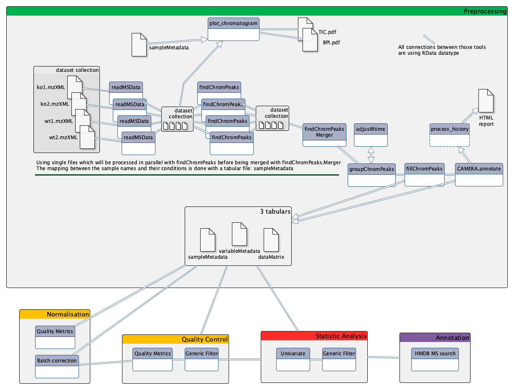

# Introduction


You may already know that there are different types of *-omic* sciences; out of these, metabolomics is most closely related to phenotypes.
Metabolomics involves the study of different types of matrices, such as blood, urine, tissues, in various organisms including plants. It  focuses on studying the very small molecules
which are called *metabolites*, to better understand matters linked to the metabolism. However, studying metabolites is not a piece of cake
since it requires several critical steps which still have some major bottlenecks. Metabolomics is still quite a young science, and has many
kinds of specific challenges.

One of the three main technologies used to perform metabolomic analysis is **Liquid-Chromatography Mass Spectrometry** (LC-MS). Data analysis
for this technology requires a large variety of steps, ranging from extracting information from the raw data, to statistical analysis
and annotation. To be able to perform a complete LC-MS analysis in a single environment, the [Wokflow4Metabolomics](http://workflow4metabolomics.org/)
team provides Galaxy tools dedicated to metabolomics. This tutorial explains the main steps involved in untargeted LC-MS data processing
for metabolomic analysis, and shows how to conduct metabolomic data analysis from preprocessing to annotation using Galaxy.

To illustrate this approach, we will use data from . The objectives of this paper was to analyze
the influence of age, body mass index, and gender on the urine metabolome. To do so, the authors collected samples
from 183 employees from the French Alternative Energies and Atomic Energy Commission (CEA) and performed LC-HRMS LTQ-Orbitrap
(negative ionization mode) analyses.

Since the original dataset takes a few hours to be processed, we chose to take a limited subset of individuals for this tutorial.
This will allow you to perform an example of metabolomic workflow, from pre-processing to annotation, in a limited time, even though
the results obtained may not be reliable from a scientific point of view due to the small sample size. Nevertheless,
the chosen diversity of sample will allow you to explore the basics of a metabolomic workflow.

We chose a subset of 9 samples, composed of 6 biological samples and 3 quality-control pooled samples (QC pools - mix of all
biological samples).

To analyze these data, we will then follow a light version of the [LC-MS workflow](http://workflow4metabolomics.org/the-lc-ms-workflow),
developed by the [Wokflow4metabolomics group](http://workflow4metabolomics.org/) (, ).
The workflow is composed of 4 main parts:
  1. **Preprocessing** extracts ions from raw data
  2. **Data processing** checks the quality of data and transforms it to something relevant
  3. **Statistical Analysis** highlights interesting information inside the data
  4. **Annotation** puts a name on selected variables

[](../../images/tutorial-lcms-workflow.png)

> <agenda-title></agenda-title>
>
> In this tutorial, we will cover:
>
> 1. TOC
> {:toc}
>
{: .agenda}


# Preprocessing with XCMS

The first step in the workflow is the pre-processing of the raw data with **XCMS** ().

**XCMS**  is a free and open source software dedicated to pre-processing of any type of mass spectrometry acquisition files from low to
high resolution, including FT-MS data coupled with different kind of chromatography (liquid or gas). This software is
used worldwide by a huge community of specialists in metabolomics using mass spectrometry methods.

This software is based on different algorithms that have been published, and is provided and maintained using R software.

**MSnbase readMSData** , prior to **XCMS**  is able to read files with open format as `mzXML`, `mzMl`, `mzData` and `netCDF`, which are independent of the constructors' formats. The **XCMS**  package itself is composed of R functions able to extract, filter, align and fill gap, with the possibility to annotate isotopes,
adducts and fragments using the R package CAMERA (). This set of functions gives modularity, and thus is particularly well
adapted to define workflows, one of the key points of Galaxy.


## Importing the LC/MS data into Galaxy

In metabolomics studies, the number of samples can vary a lot (from a handful to several hundreds). Thus, extracting your
data from the raw files can be very fast, or take quite a long time. To optimise the computation time as much as possible, the W4M core team chose to develop tools that can run single raw files for the first steps of
pre-processing in parallel, since the initial actions in the extraction process treat files independently.

Since the first steps can be run on each file independently, the use of **Dataset collections** in Galaxy is recommended, to avoid
having to launch jobs manually for each sample. You can start using the dataset collection option from the very beginning of your analysis, when uploading your data into Galaxy.

> <hands-on-title>Data upload the mzXML with <b>Get data</b></hands-on-title>
>
> 1. Create a new history for this tutorial
>
>    
>
> 2. Import the 9 `mzXML` files into a collection named `sacurine`
>    - Option 1: from a shared data library (ask your instructor)
>    - Option 2: from Zenodo using the URLs given below
>
>    ```
>    https://zenodo.org/record/3244991/files/HU_neg_048.mzML
>    https://zenodo.org/record/3244991/files/HU_neg_090.mzML
>    https://zenodo.org/record/3244991/files/HU_neg_123.mzML
>    https://zenodo.org/record/3244991/files/HU_neg_157.mzML
>    https://zenodo.org/record/3244991/files/HU_neg_173.mzML
>    https://zenodo.org/record/3244991/files/HU_neg_192.mzML
>    https://zenodo.org/record/3244991/files/QC1_002.mzML
>    https://zenodo.org/record/3244991/files/QC1_008.mzML
>    https://zenodo.org/record/3244991/files/QC1_014.mzML
>    ```
>
>    
>
>    
>
> 3. Make sure your data is in a **collection**. Make sure it is named `sacurine`
>    - If you forgot to select the collection option during import, you can create the collection now:
>
>    
{: .hands_on}

You should have in your history a green Dataset collection (`sacurine`) with 9 datasets in mzml format.

Their size can be checked by clicking on the information icon  on the individual datasets

## Data preparation for XCMS: *MSnbase readMSData*

This first step is only meant to read your `mzXML` file and generate an object usable by **XCMS** .

**MSnbase readMSData**  takes as input your raw files and prepares `RData` files for the first XCMS step.

> <hands-on-title>MSnbase readMSData</hands-on-title>
>
> 1. **MSnbase readMSData**  with the following parameters:
>    - *"File(s) from your history containing your chromatograms"*: the `sacurine` dataset collection
>
>    
>
>
>  > <question-title></question-title>
>  >
>  > What do you get as output?
>  >
>  > > <solution-title></solution-title>
>  > >
>  > > 1. A **Dataset collection** containing 9 dataset.
>  > > 2. The datasets are some RData objects with the **rdata.msnbase.raw** datatype.
>  > >
>  > {: .solution}
>  >
>  {: .question}
{: .hands_on}

Now that you have prepared your data, you can begin with the first XCMS extraction step: peakpicking. However, before beginning to
extract meaningful information from your raw data, you may be interested in visualising your chromatograms. This can be of particular
interest if you want to check whether you should consider discarding some range of your analytical sequence (some scan or *retention
time* (RT) ranges).

To do so, you can use a tool that is called **xcms plot chromatogram**  that will plot each sample's chromatogram (see dedicated section
further). However, to use this tool, you may need additional information about your samples for colouring purpose. Thus, you may need
to upload into Galaxy a table containing metadata of your samples (a *sampleMetadata* file).


## Importing a sample metadata file

What we referenced here as a *sampleMetadata* file corresponds to a table containing information about your samples (= sample metadata).

A sample metadata file contains various information for each of your raw files:
- **Classes** which will be used during the preprocessing steps
- **Analytical batches** which will be useful for a batch correction step, along with **sample types** (pool/sample) and **injection order**
- Different **experimental conditions** which can be used for statistics
- Any information about samples that you want to keep, in a *column* format

The content of your sample metadata file has to be filled by you, since it is not contained in your raw data.
Note that you can either:
- Upload an existing metadata file
- Use a template to create one (because it can be painful to get the sample list without misspelling or omission)
  1. Generate a template with the **xcms get a sampleMetadata file**  tool
  2. Fill it using your favorite table editor (Excel, LibreOffice etc.)
  3. Upload it within Galaxy

> <tip-title>Optional: Generate the right template with <b>xcms get a sampleMetadata file</b></tip-title>
>
> In the case of this tutorial, we already prepared a *sampleMetadata* file with all the necessary information. Below is an optional hands-on explaining how to get a template to fill, with the two following advantages:
>
> 1. You will have the exact list of the samples you used in Galaxy, with the exact identifiers (*i.e.* exact sample names)
> 2. You will have a file with the right format (tabulation-separated text file) that only needs to be filled with the information you want.
>
> > <hands-on-title>xcms get a sampleMetadata file</hands-on-title>
> >
> > 1. **xcms get a sampleMetadata file**  with the following parameters:
> >    -  *"RData file"*: the `sacurine.raw.RData` collection output from **MSnbase readMSData** 
> >
> {: .hands_on}
>
> An easy step for an easy sampleMetadata filling!
>
> From this tool, you will obtain a `tabular` file (meaning a tab-separated text file) with a first column of identifiers and a
> second column called *class* which is empty for the moment (only '.' for each sample). You can now download this file by clicking on the  icon.
>
{: .tip}


#### Prepare your sampleMetadata file

The sampleMetadata file is a tab-separated table, in text format. This table has to be filled by the user. You can use any
software you find appropriate to construct your table, as long as you save your file in a compatible format. For example, you can
use a spreadsheet software such as Microsoft Excel or LibreOffice.

> <warning-title>Important: Save your table in the correct format</warning-title>
>
> The file has to be a `.txt`or a `.tsv` (tab-separated values). Neither `.xlsx` nor `.odt` are supported.
> If you use a spreadsheet software, be sure to change the default format to **Text (Tab delimited)** or equivalent.
{: .warning}

Once your sampleMetadata table is ready, you can proceed to the upload. In this tutorial we already prepared the table for you ;)

> <tip-title>Optional: Filling the <i>sampleMetadata</i> using the template obtained from Galaxy</tip-title>
>
> For this tutorial, we already provide the *sampleMetadata* file, so you only have to upload it to Galaxy. Below we
> explain how we filled this file from the template we generated in Galaxy.
>
> First, we used **xcms get a sampleMetadata file**  as mentioned in the previous tip box.
>
> We obtained the following table:
>
> sample_name | class
> --- | ---
> QC1_014 | .
> QC1_008 | .
> QC1_002 | .
> HU_neg_192 | .
> HU_neg_173 | .
> HU_neg_157 | .
> HU_neg_123 | .
> HU_neg_090 | .
> HU_neg_048 | .
>
> We used a spreadsheet software to open the file. First, we completed the class column. You will see in further XCMS steps that this
> second column matters.
>
> sample_name | class
> --- | ---
> QC1_014 | QC
> QC1_008 | QC
> QC1_002 | QC
> HU_neg_192 | sample
> HU_neg_173 | sample
> HU_neg_157 | sample
> HU_neg_123 | sample
> HU_neg_090 | sample
> HU_neg_048 | sample
>
> With this column, we will be able to colour the samples depending on the sample type (QC or sample).
> Next, we added columns with interesting or needed information, as following:
>
> sample_name | class | polarity | sampleType | injectionOrder | batch | osmolality | sampling | age | bmi | gender
> --- | --- | --- | --- | --- | --- | --- | --- | --- | --- | ---
> QC1_014 | QC | 0 | pool | 185 | ne1 | NA | NA | NA | NA | NA
> QC1_008 | QC | 0 | pool | 105 | ne1 | NA | NA | NA | NA | NA
> QC1_002 | QC | 0 | pool | 27 | ne1 | NA | NA | NA | NA | NA
> HU_neg_192 | sample | 0 | sample | 165 | ne1 | 1184 | 8 | 31 | 24.22 | Male
> HU_neg_173 | sample | 0 | sample | 148 | ne1 | 182 | 7 | 55 | 20.28 | Female
> HU_neg_157 | sample | 0 | sample | 137 | ne1 | 504 | 7 | 43 | 21.95 | Female
> HU_neg_123 | sample | 0 | sample | 100 | ne1 | 808 | 5 | 49 | 24.39 | Male
> HU_neg_090 | sample | 0 | sample | 75 | ne1 | 787 | 4 | 46 | 19.79 | Male
> HU_neg_048 | sample | 0 | sample | 39 | ne1 | 997 | 3 | 39 | 19.49 | Female
>
> In particular, the `batch`, `sampleType` and `injectionOrder` columns are mandatory to correct the data from signal drift (see later in
> the tutorial).
> Once we completed the table filling, we saved the file, minding to stick with the original format. Then, our *sampleMetadata* was ready to
> be uploaded into Galaxy.
>
{: .tip}


#### Upload the sampleMetada file with 'Get data'

> <hands-on-title>Upload the sampleMetada</hands-on-title>
>
> 1. Import the `sampleMetadata_completed.tsv` file from Zenodo or from a shared data library (ask your instructor)
>    ```
>    https://zenodo.org/record/3244991/files/sampleMetadata_completed.tsv
>    ```
>
>    
>
>    
>
> 2. Check the data type of your imported files.
>    - The datatype should be `tabular`, if this is not the case, please change the datatype now
>
>    
>
>    > <comment-title></comment-title>
>    >
>    > Here we provided the sampleMetadata file so we know that the upload led to a 'tabular' file. But from experience we also know that
>    > it can happen that, when uploading a sampleMetadata table, a user obtains other inappropriate types of data. This is generally due to the file
>    > not following all the requirements about the format (*e.g.* wrong separator, or lines with different numbers of columns).
>    > Thus, we highly recommend that you always take a second to check the data type after the upload. This way you can handle the problem
>    > right away if you happen to get one of these obvious issues.
>    {: .comment}
>
> 3. Rename your sampleMetadata file with a shorter name 'sampleMetadata_completed.tsv'
>
>    
>
{: .hands_on}

> <question-title></question-title>
>
> 1. How many columns should I have in my sampleMetadata file?
> 2. What kind of class can I have?
>
> > <solution-title></solution-title>
> >
> > 1. At least 2, with the identifiers and the class column. But as many as you need to describe the potential variability of your samples
> >    (*e.g.* the person in charge of the sample preparation, the temperature...). The statistical analysis will expose the relevant parameters.
> > 2. Sample, QC, blank... The class (the 2nd column) is useful for the preprocessing step with XCMS to detect the metabolite across the samples.
> >    So it can be important to separate very different types of samples, as biological ones and blank ones for example. If you don't have any specific class
> >    that you want to consider in XCMS preprocessing, just fill everywhere with `sample` or a dot `.` for example.
> >
> {: .solution}
>
{: .question}


## Getting an overview of your samples' chromatograms

You may be interested in getting an overview of what your samples' chromatograms look like, for example to see if some of
your samples have distinct overall characteristics, *e.g.* unexpected chromatographic peaks or huge overall intensity.

You can use the *sampleMedata* file we previously uploaded to add some group colours to your samples when visualising your chromatograms.
The tool automatically takes the second column as colour groups when a file is provided.

Note that you can also check the chromatograms at any moment during the workflow, in particular at the following steps:
 - After **MSnbase readMSData**  to help you to define retention time ranges that you may want to discard from the very beginning (*"Specta Filters"* in **findChromPeaks** )
 - After **adjustRtime**  to check the result of the correction (and potentially rerun *adjustRtime* with other settings)

> <hands-on-title>xcms plot chromatogram</hands-on-title>
>
> 1. **xcms plot chromatogram**  with the following parameters:
>    - *"RData file"*: `sacurine.raw.RData` (collection)
>    - *"Sample metadata file"*: `sampleMetadata_completed.tsv` you uploaded previously
>
>    
>
>    > <comment-title></comment-title>
>    >
>    > If you use this tool at a later step of XCMS workflow while having provided, in the Merger step (see further in this tutorial), a sampleMetadata with a second column containing groups,
>    > you will get colouring according to these groups even without providing a sampleMetadata file as a 'plot chromatogram' parameter.
>    {: .comment}
>
{: .hands_on}

This tool generates Base Peak Intensity Chromatograms (BPIs) and Total Ion Chromatograms (TICs). If you provide groups as we do here, you obtain two plots:
one with colours based on provided groups, one with one colour per sample.


## First XCMS step: *peak picking*

Now that your data is ready for XCMS processing, the first step is to extract peaks from each of your data files
independently. The idea here is, for each peak, to proceed to chromatographic peak detection.

The XCMS solution provides two different algorithms to perform chromatographic peak detection: *matchedFilter* and
*centWave*. The matchedFilter strategy is the first one provided by the XCMS R package. It is compatible with any
LC-MS device, but was developed at a time when high resolution mass spectrometry was not common standard yet. On the
other side, the **centWave** algorithm () was specifically developed for high resolution mass spectrometry, dedicated to
data in centroid mode. In this tutorial, you will practice using the centWave algorithm.


> <comment-title>How the centWave algorithm works</comment-title>
>
> Remember that these steps are performed for each of your data files independently.
>  - Firstly, the algorithm detects series of scans with close values of m/z. They are called 'region of interest' (ROI).
> The m/z deviation is defined by the user. The tolerance value should be set according to the mass spectrometer accuracy.
>  - On these regions of interest, a second derivative of a Gaussian model is applied to these consecutive scans in order to define
> the extracted ion chromatographic peak. The Gaussian model is defined by the peak width which corresponds to the standard deviation
> of the Gaussian model. Depending on the shape, the peak is added to the peak list of the current sample.
>
> At the end of the algorithm, a list of peaks is obtained for each sample. This list is then considered to represent the content
> of your sample; if an existing peak is not considered a peak at this step, then it can not be considered in the next steps of
> pre-processing.
{: .comment}

Let's try performing the peakpicking step with the **xcms findChromPeaks (xcmsSet)** 


> <hands-on-title>xcms findChromPeaks (xcmsSet)</hands-on-title>
>
> 1. **xcms findChromPeaks (xcmsSet)**  with the following parameters:
>   - *"RData file"*: `sacurine.raw.RData` (collection)
>   - *"Extraction method for peaks detection"*: `CentWave - chromatographic peak detection using the centWave method`
>     - *"Max tolerated ppm m/z deviation in consecutive scans in ppm"*: `3`
>     - *"Min,Max peak width in seconds"*: `5,20`
>     - In **Advanced Options**:
>       - *"Prefilter step for for the first analysis step (ROI detection)"*: `3,5000`
>       - *"Noise filter"*: `1000`
>
> You can leave the other parameters with their default values.
>
>    > <comment-title></comment-title>
>    >
>    > Along with the parameters used in the core centWave algorithm, XCMS provides other filtering options allowing you to get
>    > rid of ions that you don't want to consider. For example, you can use *Spectra Filters* allowing you to discard some RT or M/z
>    > ranges, or *Noise filter* (as in this hands-on) not to use low intensity measures in the ROI detection step.
>    {: .comment}
>
{: .hands_on}

At this step, you obtain a dataset collection containing one `RData` file per sample, with independent lists of ions. Although this
is already a nice result, what you may want now is to get all this files together to identify which ions are shared between samples.
To do so, XCMS provides a function that is called *groupChromPeaks* (or group). But before proceeding to this grouping step, first you
need to group your individual RData files into a single one.


## Gathering the different samples in one Rdata file

A dedicated tool exists to merge the different `RData` files into a single one: **xcms findChromPeaks Merger** . Although you can simply take as
input your dataset collection alone, the tool also provides de possibility to take into account a sampleMetadata file. Indeed,
depending of your analytical sequence, you may want to treat part of your samples a different way when proceeding to the grouping step using **xcms groupChromPeaks (group)** .

This can be the case for example if you have in your analytical sequence some blank samples (your injection solvent) that you want to
extract along with your biological samples to be able to use them as a reference for noise estimation and noise filtering. The fact that
these blank samples have different characteristics compared to your biological samples can be of importance when setting parameters of
your grouping step. You will see what this is all about in the 'grouping' section of this tutorial, but in the workflow order, it is
at this step that you need to provide the needed information if you want distinction in your grouping step.

**In the case of our tutorial data**, we do not want to separate the samples according to groups, so we do not provide the sampleMetadata when executing
the Merger tool.


> <hands-on-title>xcms findChromPeaks Merger</hands-on-title>
>
> 1. **xcms findChromPeaks Merger**  with the following parameters:
>    - *"RData file"*: `sacurine.raw.xset.RData` (collection)
>    - *"Sample metadata file"*: `Nothing selected`
>
>    
>
{: .hands_on}

The tool generates a single `RData` file containing information from all the samples in your dataset collection input.

## Second XCMS step: *determining shared ions across samples*

The first peak picking step gave us lists of ions for each sample. However, what we want now is a single matrix of ions intensities for all samples.
To obtain such a table, we need to determine, among the individual ion lists, which ions are the same. This is the aim of the present step, called
'grouping'.

The group function aligns ions extracted with close retention time and close m/z values in the different samples. In order to define this
similarity, we have to define on one hand a m/z window and on the other hand a retention time window. A binning is then performed in the
mass domain. The size of the bins is called width of overlapping m/z slices. You have to set it according to your mass spectrometer resolution.

Then, a kernel density estimator algorithm is used to detect region of retention time with high density of ions. This algorithm uses a Gaussian
model to group together peaks with similar retention time.

The inclusion of ions in a group is defined by the standard deviation of the Gaussian model, called bandwidth. This parameter has a large weight
on the resulting matrix. It must be chosen according to the quality of the chromatography. To be valid, the number of ions in a group must be greater
than a given number of samples. Either a percentage of the total number of samples or an absolute value of samples can be given. This is defined by the user.

> <hands-on-title>xcms groupChromPeaks (group)</hands-on-title>
>
> 1. **xcms groupChromPeaks (group)**  with the following parameters:
>   - *"RData file"*: `xset.merged.RData`
>   - *"Method to use for grouping"*: `PeakDensity - peak grouping based on time dimension peak densities`
>     - *"Bandwidth"*: `5.0`
>     - *"Width of overlapping m/z slices"*: `0.01`
>
{: .hands_on}


This grouping step is very important because it defines the data matrix which will be used especially for the statistical analyses.
User has to check the effect of parameter values on the result.

In order to check the result of the grouping function, a pdf file is created. It provides one plot per m/z slice found in the data. Each picture
represents the peak density across samples, plotting the corresponding Gaussian model which width is defined by the bandwidth parameter. Each red
dot corresponds to a sample. The plot allows to assess the quality of alignment. The grey areas' width is associated with the bandwidth parameter.

Here is an example of two m/z slides obtained from the hands-on:


> <question-title></question-title>
>
> 1. Look at the `283.1127 - 283.1163` m/z slice. How many peak groups are considered? Can you explain why some peaks are not affected to peak groups?
> 2. Look at the `284.1198 - 284.1253` m/z slice. What do you think could have happened if you had used a smaller bandwidth value?
>
> > <solution-title></solution-title>
> >
> > 1. There are 3 peak groups in this m/z slice. The two peaks that are not assigned to peak groups are alone in their retention time area. Thus,
> >    the number of samples under the corresponding density peaks does not reach the minimum fraction of samples set by the user (0.5) to consider a peak group.
> > 2. If the bandwidth value had been set to a smaller value, the density peak width would have been smaller. With a small-enough bandwidth value,
> >    there could have been two density peaks instead of one under the current first density peak. Thus, the sample in line 5 would have been out of the
> >    previous peak group, thus not assigned to any peak group due to the 0.5 minimum fraction limit.
> >
> {: .solution}
>
{: .question}

When looking at the plots from plotChromPeakDensity.pdf, we can notice that in some cases there seems to be a small drift of retention time for some samples.
This phenomenon is well known with LC-MS techniques. To be able to attribute correct groups for peaks, it may be needed to perform some retention time
correction accross samples. Thus, the idea is (when needed) to apply a retention time strategy on the output of your grouping step, then to perform
a second grouping step on the corrected data.

## Optional XCMS step: *retention time correction*

Sometimes with LC-MS techniques, a deviation in retention time occurs from a sample to another. In particular, this is likely to be observed when you
inject large sequences of samples.

This optional step aims to correct retention time drift for each peak among samples. The correction is based on what is called *well behaved peaks*,
that are peaks found in all samples or at least in most of the samples.

Sometimes it is difficult to find enough peaks present in all samples. The user can define a percentage of the total number of samples in which
a peak should be found to be considered a well behaved peak. This parameter is called *minimum required fraction of samples*.

On the contrary, you may have peak groups with more detected peaks than the total number of samples. Those peaks are called *additional peaks*.
If you do not want to consider peak groups with too much additional peaks as 'well behaved peaks', you can use the 'maximal number of additional
peaks' parameter to put them aside.

The algorithm uses statistical smoothing methods. You can choose between linear or loess regression.


> <hands-on-title>xcms adjustRtime (retcor)</hands-on-title>
>
> 1. **xcms adjustRtime (retcor)**  with the following parameters:
>    - *"RData file"*: `xset.merged.groupChromPeaks.RData`
>    - *"Method to use for retention time correction"*: `PeakGroups - retention time correction based on aligment of features (peak groups) present in most/all samples.`
>        - *"Minimum required fraction of samples in which peaks for the peak group were identified"*: `0.8299`
>
> You can leave the other parameters to default values.
>
>    > <comment-title></comment-title>
>    >
>    > If you have a very large number of samples (*e.g.* a thousand), it might be impossible to find peaks that are present in 100% of your samples.
>    > If that is the case and you still set a very high value for the minimum required fraction of samples, the tool can not complete successfully the retention
>    > time correction. A special attention should also be given to this parameter when you expect a large number of peaks not to be present in part of your samples
>    > (*e.g.* when dealing with some blank samples).
>    {: .comment}
>
{: .hands_on}


This tool generates a plot output that you can use to visualise how retention time was applied across the samples and along the chromatogram.
It also allows you to check whether the well behaved peaks were distributed homogeneously along the chromatogram.

> <tip-title>Check the impact of RT correction using 'xcms plot chromatogram'</tip-title>
>
> Apart from the plots generated by the adjustRtime tool, you can check the impact of the retention time
> correction by comparing the chromatogram you obtained previously to a new one generated after correction.
>
> > <hands-on-title>xcms plot chromatogram</hands-on-title>
> >
> > 1. **xcms plot chromatogram**  with the following parameters:
> >    - *"RData file"*: `xset.merged.groupChromPeaks.adjustRtime.RData`
> >
> >    > <comment-title></comment-title>
> >    >
> >    > As in the previous 'plot chromatogram', you can use your completed sampleMetadata file to get colours.
> >    {: .comment}
> >
> {: .hands_on}
>
>
{: .tip}


The retention time correction step is not mandatory. However, when it is used retention time are modified.
Consequently, applying this step on your data requires to complete it with an additional 'grouping' step using the
**xcms groupChromPeaks (group)**  tool again.

Parameters for this second group step are expected to be similar to the first group step. Nonetheless,
since retention times are supposed to be less variable inside a same peak group now, in some cases it can be relevant to
lower a little the bandwidth parameter.

> <hands-on-title>second 'xcms groupChromPeaks (group)'</hands-on-title>
>
> 1. **xcms groupChromPeaks (group)**  with the following parameters:
>    - *"RData file"*: `xset.merged.groupChromPeaks.adjustRtime.RData`
>    - *"Method to use for grouping"*: `PeakDensity - peak grouping based on time dimension peak densities`
>        - *"Bandwidth"*: `5.0`
>        - *"Width of overlapping m/z slices"*: `0.01`
>    - *"Get the Peak List"*: `Yes`
>        - *"Convert retention time (seconds) into minutes"*: `Yes`
>        - *"Number of decimal places for retention time values reported in ions' identifiers."*: `2`
>        - *"Replace the remain NA by 0 in the dataMatrix"*: `No`
>
>    > <comment-title></comment-title>
>    >
>    > When performing this second grouping (or at the first one if you do not plan to perform retention time correction),
>    > you can take this opportunity to check how your peak table looks like at this point of the XCMS extraction. For this, you can
>    > set the 'Get the Peak List' option to `Yes`.
>    {: .comment}
>
{: .hands_on}

It is possible to use the retention time correction and grouping step in an iterative way if needed. Once you perform your
last adjustRtime step and thus your last grouping step, you will obtain your final peak list (*i.e.* final list of ions).

> <question-title></question-title>
>
> 1. How many ions did you obtained with the final grouping step?
> 2. Open the dataMatrix file you obtained with the final grouping. This table corresponds to intensities for each ion and each
>    sample. What do you notice when looking at the intensity of the first ion regarding the first sample?
>
> > <solution-title></solution-title>
> >
> > 1. The final grouping step led to 5815 ions.
> > 2. The first ion (M58T69) has a 'NA' value for the first sample (QC1_014). This is also the case for several other ions and samples.
> >
> {: .solution}
>
{: .question}

At this point of the XCMS extraction workflow, the peak list may contain NA when peaks where not considered peaks in only some
of the samples in the first 'findChromPeaks' step. This does not necessary means that no peak exists for these samples. For example,
sometimes peaks are of very low intensity for some samples and were not kept as peaks because of that in the first 'findChromPeaks'
step.

To be able to get the information that may actually exist behind NAs, there is an additional XCMS step that is called *fillChromPeaks*.

> <comment-title></comment-title>
>
> Before performing the 'fillChromPeaks' step, it is highly recommended to first have a look at your data concerning the distribution
> of NAs in your data. Indeed, this will allow you to check whether your results are consistent with your expectations; if not you
> may want to go back to some of your parameter choices in previous XCMS steps.
> To perform your NA diagnosis, you can use the variableMetadata file and dataMatrix file that you obtained with the last grouping step
> with the 'Get the Peak List' option to `Yes`. The variableMetadata file contains information about your ions: you will find information
> about the number of peaks detected for each ion. The dataMatrix files contains the intensities for each ion and each sample; you can get
> an overview of it using the **Intensity Check**  module.
{: .comment}


## Final XCMS step: *integrating areas of missing peaks*

The idea of the XCMS step is to integrate signal in the mz-rt area of an ion (chromatographic peak group) for samples in which no
chromatographic peak for this ion was identified.

> <hands-on-title>xcms fillChromPeaks (fillPeaks)</hands-on-title>
>
> 1. **xcms fillChromPeaks (fillPeaks)**  with the following parameters:
>    - *"RData file"*: `xset.merged.groupChromPeaks.*.RData`
>    - In *"Peak List"*:
>        - *"Convert retention time (seconds) into minutes"*: `Yes`
>        - *"Number of decimal places for retention time values reported in ions' identifiers."*: `2`
>
>    > <comment-title></comment-title>
>    >
>    > The *"Reported intensity values"* parameter is important here. It defines how the intensity will be computed. You have three choices:
>    > - into : integration of peaks (*i.e.* areas under the peaks)
>    > - maxo : maximum height of peaks
>    > - intb : integration of peaks with baseline subtraction
>    {: .comment}
>
{: .hands_on}

With this 'fillChromPeaks' step, you obtain your final intensity table. At this step, you have everything mandatory to begin analysing
your data:
 - A *sampleMetadata* file (if not done yet, to be completed with information about your samples)
 - A *dataMatrix* file (with the intensities)
 - A *variableMetadata* file (with information about ions such as retention times, m/z)

Nonetheless, before proceeding with the next step in the workflow (processing and filtering of your data), you can add an optional step with the
**CAMERA.annotate**  module. This tool uses the CAMERA R package to perform a first annotation of your data based on XCMS outputs.


## Annotation with CAMERA [Optional]

This last step provides annotation of isotopes, adducts and neutral losses. It gives also some basic univariate statistics in case you
considered several groups for your XCMS extraction.

There is a huge number of parameters that will not be detailed in this short tutorial. However most of the default values can be kept here
for a first attempt to run this function. Nevertheless, a few parameters have to be set at each run:
 - The polarity has to be set since it affects annotation.
 - For statistical analysis, you have to define if you have two or more conditions to compare. These conditions had to be defined in the
 sample metadata uploaded previously and taken into account in the XCMS workflow.
 - You can define how many significant ions will be used for extracted ions chromatogram (EIC) plot. These plots will be included in a pdf file.

 Apart from the PDF file, the main three outcomes from **CAMERA.annotate**  are three columns added in the variableMetadata file:
 - **isotopes:** the name says everything
 - **adduct:** same here; this column is filled only in the 'All functions' mode
 - **pcgroup:** this stands for Pearson's correlation group; it corresponds to groups of ions that match regarding retention time and intensity
 correlations, leading to think that maybe they could come from the same original metabolite.

> <hands-on-title>CAMERA.annotate</hands-on-title>
>
> 1. **CAMERA.annotate**  with the following parameters:
>    - *"RData file"*: `xset.merged.groupChromPeaks.*.fillChromPeaks.RData`
>    - In *"Annotate Isotopes [findIsotopes]"*:
>        - *"Max. ion charge"*: `2`
>    - *"Mode"*: `Only groupFWHM and findIsotopes functions [quick]`
>    - In *"Export options"*:
>        - *"Convert retention time (seconds) into minutes"*: `Yes`
>        - *"Number of decimal places for retention time values reported in ions' identifiers."*: `2`
>
>    > <comment-title></comment-title>
>    >
>    > As said previously, there are quite a few parameters in this tool, some of them having very high impact on your annotations.
>    > In particular, the **Mode** parameter will influence a lot your results regarding pcgroups, and adducts (that will not be computed otherwise).
>    {: .comment}
>
{: .hands_on}

The information given by this tool is not mandatory for the next step of the metabolomic workflow. Commonly, annotation is considered a later
step in the pipeline, but since CAMERA uses the outputs of XCMS, if you want to use it you better do it at this step, allowing you to have the
corresponding information in your variableMetadata file for later use.


# Stopover: debriefing and preparation for next steps

At the end of the Preprocessing step, you should have three tabulation-separated tables:
 - A **sampleMetadata** file given and completed by the user
 - A **dataMatrix** file from XCMS.fillChromPeaks
 - A **variableMetadata** file from either XCMS.fillChromPeaks or CAMERA.annotate

Concerning the **sampleMetadata** file, for the next steps of the workflow, there are four columns that are mandatory to go through all the analysis:
 - `injectionOrder`: a numerical column of injection order
 - `sampleType`: specifies if a QC pool or a sample (coded `pool` or `sample`)
 - `batch`: a categorical column indicating the batches of analysis (if only one, must be a constant)
 - your variable(s) of interest: here we will consider as an example the Body Mass Index (`bmi`)

> <comment-title></comment-title>
>
> The preprocessing part of this analysis can be quite time-consuming, and already corresponds to quite a few number of steps, depending of your analysis.
> It can also generate several versions of your 3 tables, with only one of interest for each at the end of the extraction process. We highly recommend,
> at this step of the metabolomic workflow, to split your analysis by beginning a new Galaxy history with only the 3 tables you need. This will help
> you in limiting selecting the wrong dataset in further analyses, and bring a little tidiness for future review of your analysis process.
>
> To begin a new history with the 3 tables from your current history, you can use the functionality 'copy dataset' and copy it into a new history.
>
> We also recommend you to rename your 3 tables before proceeding with the next steps of the metabolomic workflow. Indeed, you may have notice that
> the XCMS tools generate output names that contain the different XCMS steps you used, allowing easy traceability while browsing your history.
> However, knowing that the next steps of analysis are also going to extend the 3 tables' names, if you keep the original names it will become very
> long and thus may reduce the names' readability. Hence, we highly recommend you to rename them with something short, *e.g.* 'sampleMetadata',
> 'variableMetadata' and 'dataMatrix', or anything not too long that you may find convenient.
{: .comment}


> <hands-on-title>Copying the 3 tables into a new history and renaming them</hands-on-title>
>
> 1. Create a new history with the 3 tables
>
>    
>
> 2. Rename the 3 tables with shorter names:
>    - `xset.merged.groupChromPeaks.adjustRtime.groupChromPeaks.fillpeaks.dataMatrix.tsv` -> **dataMatrix.tsv**
>    - `xset.merged.groupChromPeaks.*.fillChromPeaks.annotate.variableMetadata.tsv` -> **variableMetadata.tsv**
>
>    
>
{: .hands_on}

# Data processing: quality checks, normalisation, data filtering

In the previous step of the LC-MS workflow, you saw how to extract features from your acquisition files. This data is
shaped in a format allowing the use of various standard statistical methods. However, being able to perform a
statistical analysis does not mean necessarily being able to highlight relevant information. Indeed, data are often affected
by various sources of unwanted variability. It can limit the effectiveness of statistical methods, leading sometimes to
difficulties in revealing investigated effects. Identifying such variability can help analyzing your data at its full potential.

In this tutorial, we chose to limit the data processing to 3 steps:
 - overview of the variability in the data
 - signal drift correction
 - filtering of unreliable variables based on coefficients of variation

> <comment-title></comment-title>
> To get a little more information regarding data processing, do not hesitate to visit the usemetabo.oc platform:
> [Link to LC-MS processing step](https://usemetabo.org/courses/w4mlc-ms-processing)
{: .comment}


## Step 1: global variability in the data

Commonly, LC-MS analyses generate a significant number of variables (hundreds to thousands). Getting a complete view of
such dataset may not be an easy task, but getting a glimpse of it is possible using some common unsupervised multivariate
analysis. One of the most commonly used method is the **Principal Components Analysis** (PCA). You can get a basic PCA along with
over useful information using the **Quality Metrics**  tool.

> <hands-on-title>Using <b>Quality Metrics</b> to get an overview of your data</hands-on-title>
>
> 1. **Quality Metrics**  with the following parameters:
>    - *"Data matrix file"*: `dataMatrix.tsv`
>    - *"Sample metadata file"*: `sampleMetadata_completed.tsv`
>    - *"Variable metadata file"*: `variableMetadata.tsv`
>
{: .hands_on}

For a first overview of your data, you can focus on the graphical output of this tool: **Quality_Metrics_figure.pdf**.
It provides a variety of useful information:
 - Summary of the intensities in the dataMatrix file (information.txt file and plot top center paragraph)
 - View of these intensities with a color scale (plot bottom right panel)
 - 2-components PCA score plot to check for clusters or outliers (plot top left panel)
 - Sum of intensities per sample according to injection order to check the presence of signal drift or batch effect (plot top center panel)
 - Z-scores for intensity distribution and proportion of missing values (plot bottom left panel)
 - Ions' standard deviation (sd) and mean values (plot top right panel)


> <question-title>cross-referencing information</question-title>
>
> Look at the 'Quality_Metrics_figure.pdf' file.
> 1. Look at the proportion of ions with a pool coefficient of variation <30%. Knowing that pools are identical samples, and that
>    values with a CV > 30% can not be considered stables, what can you conclude about your dataset regarding the possibility to
>    compare intensities between samples?
> 2. Look at the sum of intensities per sample according to injection order. What major information do you observe on the plot?
>    Can this observation help you understand the CV results you just looked at?
> 3. Now look at the PCA plot. Can you explain the first component (t1)? Use the previous plot to help you.
>
> > <solution-title></solution-title>
> >
> > 1. You can read on the plot that *pool CV < 30%: 26%*, meaning that the pool values are stable only for a quarter of the ions
> >    in your dataset. If the pooled samples are not stable, this means that you can observe differences between samples even when
> >    there are no biological differences. Thus, comparing samples becomes difficult and has high risk of being unreliable.
> >    Consequently, with only a quarter of the ions being stable regarding pool intensities, performing statistical analyses on
> >    this full dataset would probably lead to unreliable results.
> > 2. We can see in the figure that the global intensity of samples seems to decrease with the injection order. In particular,
> >    the fact that the pooled samples' intensities decrease leads us to suspect a signal drift due to the clogging effect of successive
> >    injection of samples.
> >    This signal drift could be the reason why so many ions in the dataset led to high CV values for pools, since it prevents
> >    at least part of the ions to be stable regarding pools' intensities.
> > 3. If we look closely at the samples' identifiers on the plot, it seems that the lowest numbers in IDs are at the right side
> >    of the first component. Knowing that these numbers correspond to an order in the injection sequence, we can link it to the
> >    previous picture's samples. Then, what we can observe is that the order of samples in the first component of PCA from right to left
> >    corresponds approximately to the decreasing order of sums of intensities. Thus, we can conclude that the main variability in
> >    the dataset may be due to the signal drift.
> >
> {: .solution}
>
{: .question}

## Step 2: handling the signal drift observed all through the analytical sequence

It is known that when injecting successively a large number of samples, the system tends to get dirty, and this may cause a measure drift.
To prevent inability to catch signal anymore, in case of large injection series, the sequence is generally divided into several batches
and the source is cleaned between batches. Unfortunately, these signal drift and batch design can add significant variability in data,
making sample comparison complicated. In case data is impacted by these effects, it is highly recommended to normalise the data to get
rid of these unwanted variabilities.

In our case study, we saw that the data seemed to be affected by signal drift. Thus, we will use the **Batch_correction**  tool
to get rid of it.

> <hands-on-title>Data normalisation</hands-on-title>
>
> 1. **Batch_correction**  with the following parameters:
>   - *"Data matrix file"*: `dataMatrix.tsv`
>   - *"Sample metadata file"*: `sampleMetadata_completed.tsv`
>   - *"Variable metadata file"*: `variableMetadata.tsv`
>   - *"Type of regression model "*: `linear`
>        - *"Factor of interest "*: `gender`
>
>    > <comment-title></comment-title>
>    > The choice of type of regression model to use depends on several parameters.
>    > In this case-study, since we only have 3 pools, there are only two possible choices: *linear* or *all loess sample*
>    > When possible, we recommend to use pools to correct the signal drift, that is why we chose to run the tool with *linear*.
>    {: .comment}
>
{: .hands_on}

**What transformation has this tool done to the ions' intensities?**

For each ion independently, the normalisation process works as described in the following picture:


The methodology is meant to correct for signal drift. In the tool, it is combined with a correction for batch effect. Thus, if your
sequence is divided into several batches, the idea is to obtain something similar to the following picture:


In the case of *linear* regression model, the tool performs some tests before applying the normalisation for quality purposes.
For some ions, if the normalisation process would have led to inconsistent results, the concerned ions are not corrected for signal drift.
This kind of quality checks depends on the type of regression model you use. Please refer to the tool's help section for more information!


## Step 3: getting rid of unreliable variables using CV

Now that the data is corrected for signal drift, we expect to have stable intensities within pools. But is this always the case?
Truth is, even when correcting ions, we may not manage to get rid of analytical effect for 100% of ions. And even if we could,
LC-MS data may contain noise signal, or ions that are not reliable as they are too noisy. Thus, it is possible that the data still
contains unusable ions.

To filter the ions not reliable enough, we can consider CVs as a filtering indicator. The **Quality Metrics**  tool provides
different CV indicators depending on what is in your sample list. In particular, in the present case-study, it can compute pool CVs
as previously seen, but also a ratio between pool CVs and sample CVs. This is particularly of interest since we can expect that,
whatever the pool CV value, it will be lower than the corresponding sample CV value, since biological samples are supposed to be affected
by biological variability. Thus, we can filter the ions that do not respect this particular condition.

> <hands-on-title>CV calculation</hands-on-title>
>
> 1. **Quality Metrics**  with the following parameters:
>    - *"Data matrix file"*: `Batch_correction_linear_dataMatrix.tsv`
>    - *"Sample metadata file"*: `sampleMetadata_completed.tsv`
>    - *"Variable metadata file"*: `Batch_correction_linear_variableMatrix.tsv`
>
>
>    > <comment-title></comment-title>
>    >
>    > Do not forget you need to use this tool again, since this time indicators will be computed on normalised intensities.
>    > What we are going to use this time is the tabular output, but while you are at it you can always check the pdf file.
>    {: .comment}
>
{: .hands_on}

The tool provides a variableMetadata tabular output, containing all the computed CV values. You can then use these values to filter
your data using the **Generic_Filter**  tool.


> <hands-on-title>Data filtering</hands-on-title>
>
> 1. **Generic_Filter**  with the following parameters:
>    - *"Data matrix file"*: `Batch_correction_linear_dataMatrix.tsv`
>    - *"Sample metadata file"*: `sampleMetadata_completed.tsv` or `Quality Metrics_sampleMetadata_completed.tsv`
>    - *"Variable metadata file"*: `Quality Metrics_Batch_correction_linear_variableMetadata.tsv`
>    - *"Deleting samples and/or variables according to Numerical values"*: `yes`
>        -  *"Identify the parameter to filter "*
>            - *"On file"*: `Variable metadata`
>            - *"Name of the column to filter"*: `poolCV_over_sampleCV`
>            - *"Interval of values to remove"*: `upper`
>                - *"Remove all values upper than"*: `1.0`
>        -  *"Insert Identify the parameter to filter "*
>            - *"On file"*: `Variable metadata`
>            - *"Name of the column to filter"*: `pool_CV`
>            - *"Interval of values to remove"*: `upper`
>                - *"Remove all values upper than"*: `0.3`
>    - *"Deleting samples and/or variables according to Qualitative values"*: `yes`
>        -  *"Removing a level in factor"*
>            - *"Name of the column to filter"*: `sampleType`
>            - *"Remove factor when"*: `pool`
>
>
>    > <comment-title></comment-title>
>    >
>    > You can see here that you can take the opportunity of this filtering step to get rid of the pools. Indeed, next step is
>    > statistical analysis, and you do not need the pools anymore since they do not participate in the scientific design of the study.
>    {: .comment}
>
{: .hands_on}


> <question-title></question-title>
>
> 1. What does the *0.3* threshold mean in the hands-on exercise you just executed?
> 2. What does the *1.0* threshold mean in the hands-on exercise you just executed?
> 3. How many variables are left in your dataset? How many samples?
>
> > <solution-title></solution-title>
> >
> > 1. The *0.3* value corresponds to the maximum value kept in the dataset ('Interval of values to remove: *upper*') regarding the
> >    *poolCV* column in your *Variable metadata* file. As mentioned previously in 'Step 1: global variability in the data' section,
> >    pool CV values are commonly considered as reflecting unstable ions when superior to 0.3.
> >    Although the signal drift correction decreased the proportion of ions with pool CV > 30% from 74% to 53%, we still need to get
> >    rid of these remaining unstable ions for which sample comparisons would be difficult and at high risk of being unreliable.
> > 2. The *1.0* value corresponds to the maximum value kept in the dataset ('Interval of values to remove: *upper*') regarding the
> >    *poolCV_over_sampleCV* column in your *Variable metadata* file. This means that any ion with a pool CV / sample CV ratio above 1
> >    (*i.e.* a pool CV greater than the sample CV) is discarded from the dataset.
> > 3. Filtering led to 2706 ions and 6 samples.
> >
> {: .solution}
>
{: .question}


# Statistical analysis to find variables of interest

The question of data filtering and correction must be addressed in all projects, even thought in some cases it may lead to
the decision of no action on data. Once you applied your customized processing procedure, your tables are ready for the
statistical analysis.

There is a large variety of statistical analysis methods that you can apply on metabolomic LC-MS data. The most standard
strategy is a combination of univariate analysis (such as applying a Mann-Whitney-Wilcoxon test on each ion independently)
and multivariate analysis (such as constructing a PLS model using all your ions at once). What you should keep in mind is
that the choice of your statistical analysis strategy depends on both your data characteristics (such as colinearity or
dataset size) and your study design. You should think carefully about what is appropriate for your own project.

In this tutorial, we will take the example of univariate analysis, using the `bmi` column of the **sampleMetadata file** as
the study's biological factor investigated (body mass index). Since this variable is quantitative, we will chose in this example to measure
the link between the BMI and the measured ions using a **statistical correlation calculation**. For more examples of
statistical analysis performed on LC-MS data, you can take a few minutes to watch the [usemetabo.org](https://usemetabo.org) open course video
[here](https://usemetabo.org/courses/w4mlc-ms-statistical-analysis).

## Computation of statistical indices

The first step is to compute the correlation coefficients used to estimate the link between the biological variable `bmi`
and the ions that we have in our dataset. For this calculation we can use the **Univariate**  tool.

> <hands-on-title>Statistical analysis</hands-on-title>
>
> 1. **Univariate**  with the following parameters:
>    - *"Data matrix file"*: `Generic_Filter_Batch_correction_linear_dataMatrix.tsv`
>    - *"Sample metadata file"*: `Generic_Filter_Quality Metrics_sampleMetadata_completed.tsv`
>    - *"Variable metadata file"*: `Generic_Filter_Quality Metrics_Batch_correction_linear_variableMetadata.tsv`
>    - *"Factor of interest"*: `bmi`
>    - *"Test"*: `Spearman correlation rank test (quantitative)`
>    - *"Method for multiple testing correction"*: `none`
>
>    > <comment-title></comment-title>
>    >
>    > In this tutorial, we chose to perform the analysis without multiple testing correction. This choice is not
>    > based on a relevant statistical strategy (which would more likely be to *use* multiple testing correction). It is based on
>    > the fact that with only 6 biological samples in a dataset of 2706 ions it is almost impossible to settle for correlation
>    > coefficients significantly different from zero. Consequently, to illustrate better the filtering step that will follow,
>    > we chose not to apply the multiple testing correction, allowing us to obtain something that looks like 'significant' results
>    > regarding statistical indices.
>    {: .comment}
>
{: .hands_on}

The tool provides different types of output. You will find statistical indices in the *variableMetadata output* (such as
p-values and statistical indicators). 'Significant' results are illustrated by graphics in the *Univariate_figure.pdf* file.

> <question-title></question-title>
>
> How many *significant* variables were found?
>
> > <solution-title></solution-title>
> >
> > The tool found that 61 variables have a correlation coefficient significantly different from 0.
> >
> {: .solution}
>
{: .question}


## Reducing the dataset to keep ions of interest only

In untargeted metabolomics, statistical analysis is usually used as a filter to focus on a subset of variables with potential.
This subset can be used to proceed to identification and thus biological interpretation. Hence, statistical indices are
generally associated with thresholds allowing us to determine which ions should be kept or discarded.

In our example of correlation analysis, two indices can be used to filter the data.
 - **P-values:** it indicates whether it is likely for a given correlation coefficient not to be actually different from zero;
considering a threshold of 0.05 generally corresponds to a misleading risk of 5%.
 - **Correlation coefficient:** it indicates if the correlation between a given ion and the biological factor is strong or not;
it goes from -1 to 1, with 0 meaning no correlation; in our example we consider as a sufficiently strong link a coefficient with
absolute value above 0.9.


> <hands-on-title>Variable filtering</hands-on-title>
>
> 1. **Generic_Filter**  with the following parameters:
>    - *"Data matrix file"*: `Generic_Filter_Batch_correction_linear_dataMatrix.tsv`
>    - *"Sample metadata file"*: `Generic_Filter_Quality Metrics_sampleMetadata_completed.tsv`
>    - *"Variable metadata file"*: `Univariate_Generic_Filter_Quality Metrics_Batch_correction_linear_variableMetadata.tsv`
>    - *"Deleting samples and/or variables according to Numerical values"*: `yes`
>        -  *"Identify the parameter to filter "*
>            - *"On file"*: `Variable metadata`
>            - *"Name of the column to filter"*: `bmi_spearman_none`
>            - *"Interval of values to remove"*: `upper`
>                - *"Remove all values upper than"*: `0.05`
>        -  *"Insert Identify the parameter to filter "*
>            - *"On file"*: `Variable metadata`
>            - *"Name of the column to filter"*: `bmi_spearman_cor`
>            - *"Interval of values to remove"*: `between`
>                - *"Remove all values between"*: `-0.9`
>                - *"And"*: `0.9`
>    - *"Deleting samples and/or variables according to Qualitative values"*: `no`
>
>
{: .hands_on}

With this filter you obtain a subset of your data, supposedly ions that may present an interest regarding your study. If the goal
is to find biomarkers, then you have a subset of biomarker candidates. If you aim for mechanism explanation, you obtain a subset
of ions to identify and replace in a biological context.

In this tutorial, the statistical filtering led to 25 remaining ions, linked to the BMI values by high correlation coefficients.


# Annotation

Now that you have a short list of interesting ions, you may be interested in knowing which molecules these ions come from.
Identification is generally a difficult and time-consuming step. To help you in that process or to get a potential first glance
of the nature of your selected subset, annotation can be a first valuable step.

Annotation is not identification. It is only meant to try matching your data with hypotheses based on known information. Nonetheless,
it can help you save a lot of time giving you hints about what to search for. The basic idea is to bring your ion's masses and a
reference mass bank face to face. This will give you potential origins of your ions.

To be able to perform annotation, you will 'only' need to gather the mass list of your subset of ions, a reference bank, and a tool
to proceed to the matching. The use of 'only' is tricky here, since even the subset of ions to use may not be turnkey at this step
of the workflow (even if you consider the previous steps as cleared now, selected ions may not be the ones most appropriate to
get a foothold in annotation).

For example, what may be the reference bank that you need for the annotation step? This is a crucial question. It exists a variety
of online resources with well-known reference banks, but which one to choose? Some banks may have overlapping content, but also
specific one. In fact, the appropriate bank may depend on the analytical technique used, the type of sample analyzed, the nature of
individuals/organisms from which you got your biological samples... If you are working on widely studied organism, you may find
an adequate reference bank online. However, it is also possible that none of the provided banks is relevant for your study. In that
case, you may need to construct your own database, to be able to search for relevant matches for your ions of interest.

In this tutorial, we chose the 'easy' case of human urinary samples. Thus, one possibility we have is to use the online reference
bank HMDB (The Human Metabolome Database). Let's try requesting directly into this widely used bank using the **HMDB MS search**
 tool.


> <hands-on-title>Annotating the data using the HMDB</hands-on-title>
>
> 1. **HMDB MS search**  with the following parameters:
>    - *"Would you use a file "*: `YES`
>        - *"File of masses (Variable Metadata) "*: `Generic_Filter_Univariate_Generic_Filter_Quality Metrics_Batch_correction_linear_variableMetadata.tsv`
>        - *"Do you have a header "*: `YES`
>        - *"Column of masses "*: `c3`
>    - *"Mass-to-charge ratio "*: `0.005`
>    - *"Number of maximum entries returned by the query "*: `3`
>    - *"Molecular Species "*: `Negatif Mode`
>
{: .hands_on}

Here, we tried to provide a Mass-to-charge ratio (*i.e.* a mass delta) based on what we globally know about the technique used to
analyze the samples. Even if this parameter may seems simple, it is important to settle it with a relevant value. If you provide a
value that is too low, you may not be able to have matches for your ions even though the original molecule is present in the database.
On the opposite, if the value provided is too high, you may end with a huge number of matches, which could be time-consuming to
review to identify relevant proposed annotation.

> <comment-title></comment-title>
> Once you reviewed carefully your annotation and settled for a subset of candidate identities, your are ready for further adventures.
> For now, Galaxy4Metabolomics stops here but we have various perspectives of additional tools for the future (a little bit of
> [MetExplore](https://metexplore.toulouse.inra.fr/index.html/) for example?).
{: .comment}


# Conclusion


This tutorial allowed you to get a glance at what data analysis in Metabolomics could look like when dealing with LC-MS data.
The workflow used here as an example is only one of many that you can already construct using Galaxy. For each of the four main steps described
here, you can find a variety of combinations and tools to use, to try to reach the highest potential of Galaxy when dealing with
LC-MS metabolomic data. Now that you know that tools exist and are available in this accessible, reproducible and transparent resource
that Galaxy is, all that remains for you to make high level reproducible science is to develop and apply your expertise in Metabolomics,
and create, run and share!
