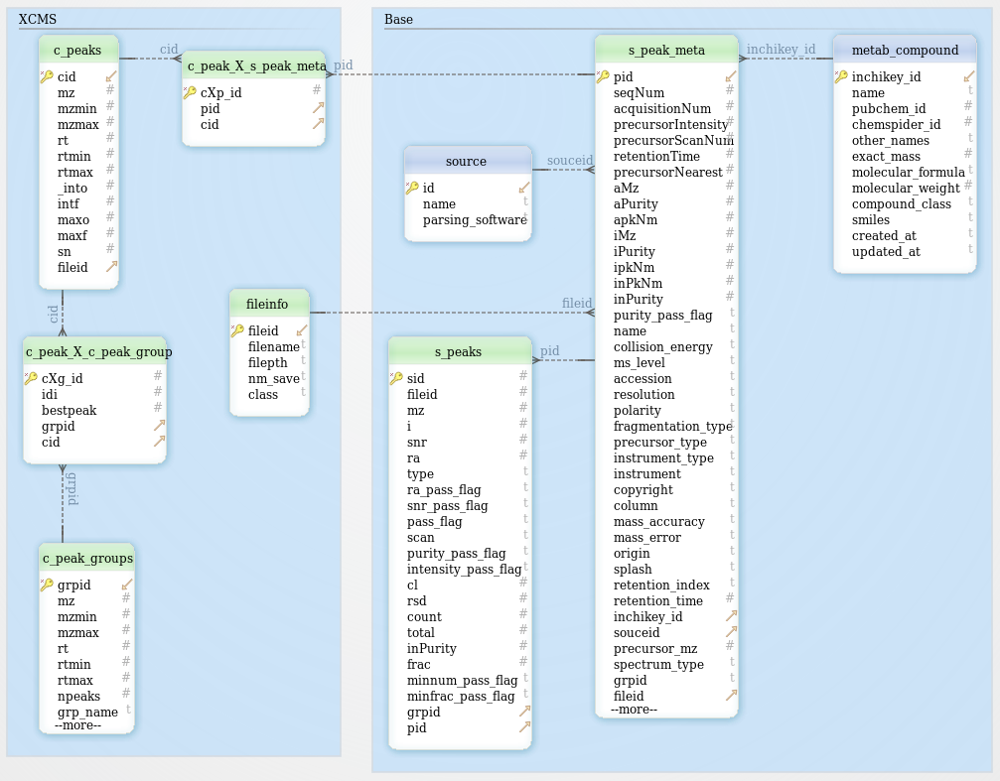
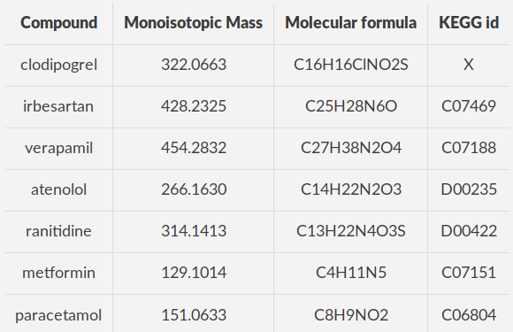
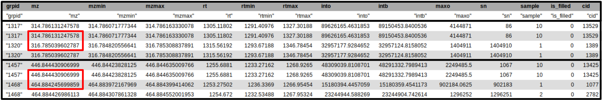

--- 
layout: tutorial_hands_on

title: 'Mass spectrometry : MS/MS analysis with msPurity package'
level: Introductory
zenodo_link: 'https://zenodo.org/record/3614672' 
questions:
- What are the main steps of MS/MS datas processing for metabolomic analysis? 
- How te be able to annotate the maximum of spectra using Galaxy? 
objectives:
- To be sure you have already comprehend the diversity of LC-MS analysis. 
- To learn the principal functions of msPurity package through Galaxy.
- To evaluate the potential of this new MS/MS workflow for MS/MS metabolomic analysis. 
time_estimation: 2H 
key_points:
- The take-home messages 
- They will appear at the end of the tutorial 
requirements:
- type: "internal"
    topic_name: metabolomics
    tutorials:
      - lcms
contributors:
- jsaintvanne

--- 

# Introduction
{:.no_toc}

MsPurity paper authors () said “mass spectrometry (MS) is routinely used to quantify, annotate, and identify small molecules in complex biological matrices.[..] Tandem mass spectrometry (MS/MS) is a widely used approach for structural annotation and identification of metabolites in complex biological samples”. MS is used to generate theoretical formula for a metabolite of interest while MS/MS provides additional information regarding molecular structure and chemical groups. Authors also highlight the key point of MS/MS : “the term “tandem mass spectrometry” is used when a single collision step is used, but product ions can be isolated for further collision to provide MSn spectra where n ≥ 3. A key component of any MS/MS (or higher) technology is the isolation of selected m/z windows for gas-phase fragmentation and the mapping back of the fragmentation (product) spectrum to the selected m/z window”.
{: .text-justify}

This previous paper deals with a metabolomics analytical and data analysis workflow that directly takes into consideration the purity of an isolation window by using the msPurity package. “The approach, demonstrated using an Agilent6520 Q-TOF instrument, requires sliding isolation windows to be acquired surrounding the precursor of interest.[...] In these cases, simply assessing the targeted precursor purity can be useful in interpreting the MS/MS spectra and aid in assessing the reliability of any subsequent annotation. [...] What we call here “precursor purity” is calculated with a revised Michalski approach”. The software has been applied to investigate DDA (Data Dependant Acquisition) or DIA (Data Independent Acquisition) metabolomics data sets for different biological samples retrieved from the data repositories MetaboLights, Metabolomics Workbench, and PRIMeData Resource of Plant Metabolomics (DROP Met). They also detail how theoretical isolation windows can be assessed using MS1 data sets collected independent of MS/MS acquisitions. The computational methods detailed in the msPurity paper (Lawson et al. 2017) are available in the R package msPurity. The package has been developed to work as a standalone or to be used in conjunction with the metabolomics peak detection and processing R package XCMS 2.0.
{: .text-justify}

The present tutorial  illustrates this approach with data from [*Metabolights n°307*](https://www.ebi.ac.uk/metabolights/MTBLS307), extracted from . The aim of this paper is “to detect and visualize antihypertensive drug metabolites in untargeted metabolomics experiments based on the spectral similarity of their fragmentation spectra” (). To do so, the authors collected urines from a cohort of 26 patients and samples were analysed with a pHILIC column coupled to a Thermo Q-Exactive instrument. Authors found 165 separated metabolites from 7 parents drugs and during this tutorial we will only focuse to find each of these parents. For time reasons, we will just used a subset of samples. We should not find all these waiting metabolites because of the data complexity.
{: .text-justify}

To analyze these data, we will start by following a light version of the [LC-MS workflow](http://workflow4metabolomics.org/the-lc-ms-workflow), developed by the [Wokflow4metabolomics group](http://workflow4metabolomics.org/) (, ), then we will be able to complete the MS/MS workflow developed by **msPurity** authors ().
{: .text-justify}

> ### Agenda
>
> In this tutorial, we will cover:
>
> 1. TOC
> {:toc}
>
{: .agenda}

# Preprocessing with XCMS

The first step of the workflow is the pre-processing of the raw data with **XCMS** ().
{: .text-justify}

**XCMS** is a free and open source software dedicated to pre-processing of any type of mass spectrometry acquisition files from low to high resolution, including FT-MS data coupled with different kind of chromatography (liquid or gas). This software is used worldwide by a huge community of specialists in metabolomics using mass spectrometry methods.
{: .text-justify}

This software is based on different algorithms that have been published, and is provided and maintained using R software.
{: .text-justify}

**MSnbase readMSData**  function, prior to **XCMS**, is able to read files with open format as `mzXML`, `mzML`, `mzData` and `netCDF`, which are independent of the constructors' formats. The **XCMS** package itself is composed of R functions able to extract, filter, align and fill gap, with the possibility to annotate isotopes, adducts and fragments (using the R package CAMERA, ). This set of functions gives modularity, and thus is particularly well adapted to define workflows, one of the key points of Galaxy.
{: .text-justify}

First step of this tutorial is to download the data test. As describe in the introduction, we will use data from . We will only process on a subset of these data. So, you can **import your files directly in Galaxy by using the following URLs below** or download files into your computer (then upload them on Galaxy) : 
{: .text-justify}

[](https://doi.org/10.5281/zenodo.3614672)

```
https://zenodo.org/record/3614672/files/sampleMetadata_manVSwoman.csv
https://zenodo.org/record/3614672/files/Urine_23_Top10_posneg_pos.mzML
https://zenodo.org/record/3614672/files/Urine_44_Top10_posneg_pos.mzML
https://zenodo.org/record/3614672/files/Urine_66_Top10_posneg_pos.mzML
https://zenodo.org/record/3614672/files/Urine_73_Top10_posneg_pos.mzML
https://zenodo.org/record/3614672/files/Urine_90_Top10_posneg_pos.mzML
https://zenodo.org/record/3614672/files/Urine_91_Top10_posneg_pos.mzML
```
This step is described as number 1 in details part below.

Then, to be able to process your MS/MS datas, we need to **start with the peakpicking of MS datas**. One Galaxy Training already explains how to process with your MS datas. You should **follow this link and complete this tutorial** : [Mass spectrometry: LC-MS analysis](https://galaxyproject.github.io/training-material/topics/metabolomics/tutorials/lcms/tutorial.html). For MS/MS analysis you **don't really need to finish** this previous tutorial but for a better understanding of your datas, it is recommanded. In this tutorial, you **just have to compute** your datas with the **following steps** briefly describe in the *details* part below (please follow parameters values to have the same results during the training).
{: .text-justify}

> ###  Some help : Resume of the XCMS preprocessing
>
> Here is a resume of the **XCMS** preprocessing. Please follow instructions for this training tutorial. It has few steps that are an obligation to be able to obtain the final file. With this file, we can continue the workflow to process our MS/MS datas with **msPurity** package.
> {: .text-justify}
>
> > ###  1 - Import your datas into a Galaxy collection
> > 
> > For a good workflow, you need to create a collection in Galaxy which contains **all** your data. It can be "MS only" data, "MS/MS with MS" files but it **can NOT be only MS/MS data** because we have to search for the MS precursor peaks during msPurity part.
> > 
> > > ###  Tip: Create a dataset collection while importing your files
> > > 1. Click on  icon (**Download from URL or upload files from disk**) on the top left of Galaxy
> > > 2. Select the collection tab at the top of the pop-up
> > > 3. Choose the files you want to upload
> > > 4. Start the uploading with **Start** button
> > > 5. When files are uploaded, clic on **Build** button to build the dataset collection
> > > 6. Enter the name for your collection
> > {: .tip}
> >
> > > ###  Tip: Importing data via links
> > >
> > > * Copy the link location
> > > * Open the Galaxy Upload Manager ( on the top-right of the tool panel)
> > > 
> > > * Click on **Collection** on the top
> > > 
> > > 
> > > * Click on **Collection Type** and select `{{ include.collection_type }}`
> > > 
> > > * Select **Paste/Fetch Data**
> > > * Paste the link into the text field
> > > 
> > >   `{{ include.link }}`
> > > 
> > > 
> > >   `{{ include.link2 }}`
> > > 
> > > 
> > > * Change **Type** from "Auto-detect" to `{{ include.format }}`
> > > 
> > > 
> > > * Change **Genome** to `{{ include.genome }}`
> > > 
> > > * Press **Start**
> > > 
> > > * Click on **Build** when available
> > > 
> > > * Ensure that the forward and reverse reads are set to {{ include.pairswaptext }}, respectively.
> > >     * Click **Swap** otherwise
> > > 
> > > * Enter a name for the collection
> > > 
> > >     * A useful naming convention is to use {{ include.collection_name_convention }}
> > > 
> > > 
> > >     * {{ include.collection_name }}
> > > 
> > > * Click on **Create list** (and wait a bit)
> > > 
> > > * **Close** the window
> > > 
> > > 
> > > By default, Galaxy uses the URL as the name, so rename the files with a more useful name.
> > > 
> > {: .tip}
> > > ###  Tip: Importing data from a data library
> > >
> > > As an alternative to uploading the data from a URL or your computer, the files may also have been made available from a *shared data library*:
> > >
> > > * Go into **Shared data** (top panel) then **Data libraries**
> > > 
> > > * {{ include.path }}
> > > 
> > > * Find the correct folder (ask your instructor)
> > > 
> > > * Select the desired files
> > > * Click on the **To History** button near the top and select **{{ include.astype | default: "as Datasets" }}** from the dropdown menu
> > > * In the pop-up window, select the history you want to import the files to (or create a new one)
> > > * Click on **Import**
> > {: .tip}
> >
> {: .solution}
>
> > ###  2 - Prepare your MS datas with *MSnbase readMSData* 
> >
> > **MSnbase readMSData** , prior to **XCMS** is able to read files with open format as `mzXML`, `mzML`, `mzData` and `netCDF`, which are independent of the constructors' formats.
> >   - **Input** : your collection with all your files
> >   - **Output** : a new collection with your files and their metabolomic information after `readMSData` function. Format : `collection.raw.RData`.
> {: .solution}
>
> > ###  3 - First XCMS step : *peak picking*
> >    
> > Open and run the **xcms findChromPeaks (xcmsSet)**  tool and set your parameters. For our training please enter the following parameters : 
> >   - **Extraction method for peaks detection** : there are 4 different possible options here. Please select `CentWave - chromatographic peak detection using the centWave method` for our training.
> >   - **Max tolerated ppm m/z deviation in consecutive scans in ppm** : it corresponds to the maximum deviation in ppm. Please set it to `5` for our training.
> >   - **Min, Max peak width in seconds** : it corresponds to the expected approximate peak width in chromatographic space. Please set it to `5,20` in our training to have a large example. 
> > 
> > Here, you have all the right parameters for our example. These are the two dataset collection you will have in your history on the right of Galaxy instance : 
> >    - **Input** : collection of Rdata object(s) obtained just before (format : `collection.raw.RData`)
> >    - **Output** : a collection with informations about peak picking for each files. Format : `collection.raw.xset.RData`.
> {: .solution}
> 
> > ###  4 - *Merge samples* in one dataset with a sampleMetadata file
> >
> > To merge your data, you need to **input a sampleMetadata file** containing filenames and their metadata informations like their class for example. If you don't add a sampleMetadata file, the **xcms findChromPeaks Merger**  tool will **group all your files together**. You can also **create your sampleMetadata file** with W4M Galaxy tool **xcms get a sampleMetadata file**  with the following parameters: *"RData file"* outputed from **MSnbase readMSData** . Here is an example of the minimum expectations about a sampleMetadata file (**important** : don't write the format of the file, just their names) :
> > {: .text-justify}
> > 
> > | sample_name |  class  | 
> > |:-----------:|:-------:|
> > |    file1    |  homme  |
> > |-------------+---------|
> > |    file2    |  femme  |
> > |-------------+---------|
> > |    file3    |  homme  |
> > 
> > You have just to enter the following files in the tool and process it. You should now have these files in your history :
> >   - **Input** : 
> >     - collection of RData object(s) obtained during peak picking (format : `collection.raw.xset.RData`) 
> >     - optionnaly a sampleMetadata file in `tabular` format. For our example please start with `sampleMetadata_hommeVSfemme.csv` in tabular format.
> >   - **Output** : 
> >     - one RData file named `xset.merged.RData` which contains a list of all your datas processed just before.
> {: .solution}
>
> > ###  5 - Second XCMS step : *determining shared ions across samples*
> >
> > Open **xcms groupChromPeaks (group)**  tool and run it with your parameters. This tool will group all your peaks found before together when they represent the same analyte across samples. It uses overlapping m/z bins and calculations of smoothed peak distributions in chromatographic time. In Galaxy instance please set the parameters as below : 
> > {: .text-justify}
> >  - **Method to use for grouping** : please `keep the PeakDensity method` which will groups peak based on time dimension peak densities.
> > {: .text-justify}
> >  - **Bandwidth** : it corresponds to the standard deviation of the smoothing kernel to be used. Set it to `10` for our example.
> > {: .text-justify}
> >  - **Minimum fraction of samples** : minimum fraction of samples in at least one sample group in which the peaks have to be present to be considered as a peak group. This value is the threshold and `don't change` it for our example and keep it at 0.5.
> > {: .text-justify}
> >  - **Minimum number of samples** : minimum number of sample(s) in which the peak have to be detected to be considered as a group. Please `don't change` it for our example and keep it at 1.
> > {: .text-justify}
> >  - **Width of overlapping m/z slices** : the m/z difference between two peaks to be able to be grouped. For our example please set it to `0.05`. 
> > {: .text-justify}
> > 
> > You don't need to change the other parameters, except if you want the peaklist as output. You should now have these files in your history : 
> > {: .text-justify}
> >  - **Input** : 
> >    - the RData file obtained just before with all datas and peaks information for each files (format : `xset.merged.RData`).
> >    {: .text-justify}
> >  - **Output** : 
> >    - one Rdata file named `xset.merged.groupChromPeaks.RData` containing all peaks grouped according to their mz and retention time.
> >    {: .text-justify}
> >    - one `pdf` file named `xset.merged.groupChromPeaks.plotChromPeakDensity.pdf`. It contains chromatographic density plots.
> >    {: .text-justify}
> >    - 2 `tsv` files. The first one named `xset.merged.group.dataMatrix.tsv` contains informations about ions intensities. The second one named `xset.merged.group.variableMetadata.tsv` contains an other table with information about ions. These files are generated only if you set the parameter **Get peaklist** to `yes`. It is just more information after the grouping step. 
> > {: .text-justify}
> {: .solution}
>
> > ###  6 - Optional XCMS step : *retention time correction*
> >
> > This step is optionnal, it aims to correct retention time drift for each peak among samples. You have to use the **xcms adjustRtime (retcor)**  tool to correct this retention time. We `don't use it in our example`. But if you will use it during an other processing, you should have these files in your history : 
> > {: .text-justify}
> >  - **Input** : 
> >    - the Rdata file already with peaks grouped and named `xset.merged.groupChromPeaks.RData`
> >    {: .text-justify}
> >  - **Output** : 
> >    - new RData file named `xset.merged.groupChromPeaks.adjustRtime.RData` with correction of retention time.
> >    {: .text-justify}
> >    - one `pdf` file named `xset.merged.groupChromPeaks_rawVSadjusted.adjustRtime.Rplots.pdf`  and containing a plot to show the difference between rt and adjusted rt for each file.
> >    {: .text-justify}
> >    
> > > ###  Important : Have to group again !
> > >
> > > Retention time have been modified. Consequently, it requires to complete it with an additionnal grouping step with **xcms groupChromPeaks (group)** . You will obtain a new Rdata file named `xset.merged.groupChromPeaks.adjustRtime.groupChromPeaks.RData`. 
> > > {: .text-justify}
> >    {: .warning}
> {: .solution}
>
> > ###  7 - Final XCMS step *integrating areas of missing peaks*
> >
> > This last step can be run after grouping your peaks and don't need the retention time correction. Run **xcms fillChromPeaks (fillPeaks)**  to identify, for each sample, peak groups where that sample is not represented. 
> >  - **Input** : 
> >    - your Rdata file `xset.merged.groupChromPeaks.*.RData`
> >  - **Output** : 
> >    - a new RData file named `xset.merged.groupChromPeaks.*.fillChromPeaks.RData`
> {: .solution}
> > ###  Important : Be careful of the file format
> >
> > During each step of preprocessing, your file has its format changed and can have also its name changed.
> > To be able to continue to MS/MS processing, you need to have a RData object wich is **merged and grouped** (step 4 and 5) at least. It means that you should have a file named like `xset.merged.groupChromPeaks.RData` (and maybe with some step more in it).
> {: .warning} 
{: .details}


# Stopover : Verify your data after the XCMS preprocessing

When you have process **all or only needed** steps described before, you can continue with the MS/MS processing part with **msPurity** package. Don't forget to always check your files format ! For the next step you need to have this file `xset.merged.groupChromPeaks.*.RData` where * is the name of **optionnal** steps you could do during the pre-processing. For our example, your file should be named `xset.merged.groupchromPeaks.RData`. 
{: .text-justify}

> ###  Comment
> 
> The preprocessing part of this analysis can be **quite time-consuming**, and already corresponds to quite a few number of steps, depending of your analysis. We highly recommend, at this step of the MS/MS workflow, to split your analysis by beginning a new Galaxy history with **only the files you need** (final xset Rdata file and your data collection of mzML). This will help you in limiting selecting the wrong dataset in further analysis, and bring a little **tidiness** for future review of your MS/MS analysis process. You should also be able to make a better peakpicking in the future in the same history and it will not be polluated by MS/MS part of your process.
> {: .text-justify}
> 
> > ###  Tip: Copy dataset to a new history
> >
> > 1. Click on the  icon (**History options**) on the top of the history panel
> > 2. Click on **Copy Dataset**
> > 3. Select the desired files
> > 4. Give a relevant name to the "New history"
> > 5. Click on the new history name in the green box that have just appear to switch to this history
> {: .tip}
> 
> <br>
> To begin a new history with the files from your current history, you can **use the functionality ‘copy dataset’** and copy it into a new history (the option is hidden behind the notched wheel  at the top right of the history).
> {: .text-justify}
> 
> You may have notice that the XCMS tools generate **output names that contain the different XCMS steps you used**, allowing easy traceability while browsing your history. Hence, we highly recommend you to rename it **with something short**, e.g. "xset", "XCMSSetObject", or anything not too long that you may find convenient.
> {: .text-justify}
> 
>
{: .comment}

Before the next step with msPurity package on MS/MS data, here are some questions to be able to verify if your file is ready and if you have the same results as us. Please check these questions : 
{: .text-justify}

> ###  Question before MS/MS steps
> 
>  **1** - What are the steps of preprocessing you made before your final file ?
> > ###  Solution
> > 
> > Here are the different steps made for our example : 
> >  - **(Not with XCMS)** import your datas into Galaxy instance
> >  - **MSNbase readMSData**  to read our MS data
> >  - XCMS peakpicking with **xcms findChromPeaks (xcmsSet)**  tool
> >  - (Not with XCMS but necessary) merge my datas into one file with **xcms findChromPeaks Merger**  tool
> >  - XCMS grouping with **xcms groupChromPeaks (group)**  tool
> >  - **(Not done)** XCMS retention time correction, then grouping again with xcms adjustRtime (retcor)  tool
> >  - XCMS integration of missing peaks with **xcms fillChromPeaks (fillPeaks)**  tool
> > 
> {: .solution}
> <br>
>  **2** - Concerning what we said before and the previous answer, what is the complete name of your final RData file in our example ?
> > ###  Solution
> > 
> > During each step of XCMS preprocessing, the name of the file which is processing is completed by the name of the step you were doing. So, finally your file should be name `xset.merged.groupChromPeaks.fillChromPeaks.RData`. That because (as seen in previous answer) you ran a grouping and the integration after merged datas.
> > {: .text-justify}
> > 
> {: .solution}
> <br>
> **3** - What is the size (in MB) of your final RData file ?
> > ###  Solution
> > 
> > To be able to see the size of a file in your history, you just have to select it. It will deployed informations about it and you can see the size of yours. For our example, the size of the final file is **863,4 kB**.
> > {: .text-justify}
> > 
> {: .solution}
{: .question}


# Processing with msPurity package

**msPurity** is a R package developed by Birmingham University team and published in 2017 (). It is also available via Galaxy instance through some [wrappers](https://github.com/computational-metabolomics/mspurity-galaxy/tree/master) that were developped by the same people. 
{: .text-justify}

This R package was developed to :
  - Assess the contribution of the targeted precursor of acquired fragmentation spectra by checking isolation windows using a metric called “precursor ion purity”
  - Assess the anticipated precursor ion purity of XCMS LC-MS features where no fragmentation has been acquired
  - Map fragmentation spectra to XCMS LC-MS features
  - Filter and average MS/MS spectra from an LC-MS/MS dataset
  - Create a spectral-database of LC-MS(/MS) data and associated annotations
  - Perform spectral matching of query MS/MS spectra against library MS/MS spectra
  - Export fragmentation spectra to MSP format


**What is *precursor ion purity*?** 

They call "**precursor ion purity** the measure of the contribution of a selected precursor peak in an isolation window used for fragmentation. The simple calculation involves dividing the intensity of the selected precursor peak by the total intensity of the isolation window. When assessing MS/MS spectra this calculation is done before and after the MS/MS scan of interest and the **purity is interpolated at the recorded time of the MS/MS acquisition**.[...] Additionally, low abundance ions that are remove that are thought to have limited contribution to the resulting MS/MS spectra and the isolation efficiency of the mass spectrometer can be used to normalise the contributing ions to metric."
{: .text-justify}

There are 3 main classes used in msPurity :

  - purityA :
    - Assessing precursor purity of previously acquired MS/MS spectra: A user has acquired either LC-MS/MS or DIMS/MS spectra and an assessment is made of the precursor purity for each MS/MS scan. Further processing of the purityA object include - fragmentation spectra filtering, averaging, MSP creation, spectral-database creation and spectral matching.
    {: .text-justify}
  - purityX :
    - Assessing precursor purity of anticipated isolation windows for LC-MS/MS spectra. i.e. a user has acquired from an LC-MS full scan (MS1) data and an assessment is to be made of the precursor purity of detected features using anticipated or theoretical isolation windows. This information can then be used to guide further targeted MS/MS experiments.
    {: .text-justify}
  - purityD :
    - Assessing precursor purity of anticipated isolation windows for DIMS/MS spectra. Also provides some basic functionality to process DIMS spectra.
    {: .text-justify}

During our tutorial we will used the purityA class because we have files containing MS/MS spectra and MS data directly.

## 1 - Assessing the purity

The importance of **assessing the contribution of the precursor ion** within an isolation window for MS/MS experiments has been previously detailed in proteomics, where precursor ion purity influences the quality and accuracy of matching to mass spectral libraries. But to date, there has been little attention to this data-processing technique in metabolomics. In **targeted and data-dependent acquisition** (DDA)-based experiments, where MS/MS is performed on a dynamic list of precursor ions (as often determined by a preceding MS full scan), an isolation window is centered on the targeted precursor peak (m/z value). However, the **isolation window** can often contain **more than one distinct peak**. Fragmentation spectra resulting from these situations being termed *“chimeric”* and can be problematic for interpretation of the spectra and mass spectral library searching.
{: .text-justify}

The precursor purity metric is calculated as *“intensity of a selected precursor divided by the summed intensity of the isolation window”*. The impact of chimeric spectra on spectral matching and annotation depends on **the purity of the isolation window fragmented** (i.e., the ratio between the relative intensity of the precursor divided by the summed intensity of all ions within the isolation window). If the purity of the precursor ion is sufficiently low, it can often **be difficult to determine the origin of the resulting product ion(s)**. This in turn can lead to erroneous spectral matching results or no spectral matches. Deconvolution of chimeric spectra however is possible and forms the basis of the data-analysis procedures applied to data independent acquisition (DIA) experiments.
{: .text-justify}

> ###  How the purityA algorithm works ?
> 
> Just given a vector of LC-MS/MS file paths and the **precursor ion purity** of each MS/MS scan from each file can be calculated. It then stores in the purityA S4 class object where **a dataframe of the purity results** can be accessed using the appropriate slot (*pa@puritydf*). The **calculation** involves dividing the intensity of the selected precursor peak by the total intensity of the isolation window. It is performed before and after the MS/MS scan of interest and interpolated at the recorded time of the MS/MS acquisition. 
> {: .text-justify}
> 
> 
> Additionally, isotopic peaks can estimated and **omitted** from the calculation. Low abundance peaks are **removed** that are thought to have limited contribution to the resulting MS/MS spectra. The isolation efficiency of the mass spectrometer can be used to **normalise** the intensities used for the calculation. The **precursor ion purity** represents the measure of the contribution of a selected precursor peak in an isolation window used for fragmentation and can be used as away of assessing the spectral quality and level of "contamination" of fragmentation spectra. 
> {: .text-justify}
> 
> 
> Note that if there are any **files that do not have MS/MS scans** a file ID is save but no assessments will be made. 
> {: .text-justify}
> 
{: .comment}

Let's try assessing the purity of precursors with the Galaxy tool **msPurity.purityA **.

> ###  Hands-on : msPurity.purityA 
> 
> In Galaxy instance, you just need to run the **msPurity.purityA**  tool with the collection containing all your files. It is the collection with which we started the peak picking processus at the beginning of this tutorial. 
> {: .text-justify}
>  - **\*.mzML file** : Please select the directory icon and then `select your dataset collection` you used at the begining of your XCMS preprocessing 
> {: .text-justify}
>  - **Use most intense peak within isolation window for precursor?** : you can set it to "No" value if you want the process to keep the registered precursor from the file. If you set it to "Yes", it will selected the most intense peak within its isolation window. Please `set it to Yes`.
> {: .text-justify}
>  - **Use nearest full scan to determine precursor?** : you can set it to "No" value to keep the precursor scan already registered within the file. If you set it to "True", it will use the nearest full scan to determine what the m/z value is of the precursor. Please `set it to Yes`. 
> {: .text-justify}
>  - **Interpolation PPM** : Enter the value you want as the ppm tolerance for the precursor ion purity interpolation (the closest match within the window will be used for the interpolation). Please `set it to 5`.
> {: .text-justify}
>
> You just have to adjust these 4 parameters and don't touch the others.
> 
> > ###  Resume
> > To resume this tool, you will have these things in your history on the right side of Galaxy instance : 
> >  - **Input** : 
> >    - your **collection** with all your files (`mzML`, `mzXML`,...)
> >  - **Output** : 
> >    - one RData file containing **pa** object with all MS/MS datas from your files (`msPurity.purityA_on_yourdata.RData`)
> >    - one `tsv` file with all results from the assess of purity in the files you gave (*slot puritydf of pa object*). Each line correspond to one MS/MS scan (`msPurity.purityA_on_yourdata.tsv`). 
> > {: .text-justify}
> {: .comment}
{: .hands_on}

> ###  Question
> 
> **1** - How many lines do you have in your `msPurity.purityA_on_yourdata.tsv` file ?
>
> > ###  Solution
> > **1** - To see the number of line from a `tsv` file, just select the concerning file and it will deployed informations about it. For our example, we can see that we have **19 373** lines. Each line corresponds to a MS/MS spectra and its informations. 
> > {: .text-justify}
> {: .solution}
>
> <br>
>
> **2** - Can you explain briefly what each column corresponds to ?
>
> > ###  Solution
> > **2** - During this first part of **msPurity** processing, only the *@puritydf* slot has been modified. It is now a table containing the following informations : 
> > {: .text-justify}
> >  - **pid** : unique id for MS/MS scan
> >  - **fileid** : unique id for file
> >  - **seqNum** : scan number
> >  - **acquisitionNum** : acquisition number
> >  - **precursorIntensity** : precursor intensity value as defined in the file
> >  - **precursorMZ** : precursor m/z value as defined in the file
> >  - **precursorRT** : precursor RT value as defined in the file
> >  - **precursorScanNum** : precursor scan number value as defined in file
> >  - **id** : unique id (redundant)
> >  - **filename** : filename
> >  - **retentionTime** : retention time 
> >  - **precursorNearest** : MS1 scan nearest to the MS/MS scan purityA35
> >  - **aMz** :  The m/z value in the "precursorNearest" MS1 scan which most closely matches the precursorMZ value provided from the file
> >  - **aPurity** : The purity score for aMz
> >  - **apkNm** : The number of peaks in the isolation window for aMz
> >  - **iMz** :  The m/z value in the precursorNearest MS1 scan that is the most intense within the isolation window.
> >  - **iPurity** : The purity score for iMz
> >  - **ipkNm** : The number of peaks in the isolation window for iMz
> >  - **inPkNm** : The interpolated number of peaks in the isolation window
> >  - **inPurity** :  The interpolated purity score (the purity score is calculated at neighbouring MS1 scans and interpolated at the point of the MS/MS acquisition)
> {: .solution}
{: .question}

The output is a RData file with the purityA S4 class object (referred to as *pa* for convenience throughout the manual). The object contains a slot (pa@puritydf) where we can find the details of the purity assessments for each MS/MS scan. The purityA object can then be used for further processing including linking the fragmentation spectra to XCMS features, averaging fragmentation, database creation and spectral matching (from the created database).
There is also the additional output which is a tsv file of the purity assessment dataframe.
{: .text-justify}

> ###  Advanced parameters
>
> Here, we list all parameters available on Galaxy tool, depending of the need of the user and not cited just before : 
>{: .text-justify}
>
> - **offsets** : two options are available here :
>   - **uses offsets determined in the file** : it will use the retention time offsets determined in the file directly for the precursor values
>   - **user supplied offset values** : with this option you have to enter 2 values. One corresponding to the left offsets (the *minoffset*) and the other one corresponding to the right offset (the *maxoffset*).
> {: .text-justify}
> - **Threshold to remove peaks below x % of the relative intensity of precursor of interest** : you have to enter a numeric value between 0 and 1. All peaks less than this percentage of the precursor ion of interest will be removed from the purity calculation. It is essentially a noise filter to remove peaks that are thought to have either none or very limited impact on the resulting fragmentation spectra (*--ilim* parameter)
> {: .text-justify}
> - **Normalisation for isolation efficiency** : you can choose 4 values for this parameter. If you set it to "none", the intensity of the isolation window stay like this. If you choose one of the following functions (*Gaussian*, *Raised Cosine* or *Calculated from Q-Exactive for +/-0.5 Da windows*), the intensity will be normalised by this function (*--iwNorm* parameter and *--iwNormFun* parameter).
> {: .text-justify}
> - **Handling of isotopic peaks** : you can choose 3 propositions (*--isotopes* parameter and *--im* parameter) :
>   - **Keep isotopes in precursor ion purity calculation** : with this option, nothing is done on isotopes in precursor ion purity calculation.
>   - **Exclude C12/C13 isotopes in precursor ion purity calculation** : with this option, you will exclude C13 isotopes (single, double and triple bonds). It is the default parameter.
> {: .text-justify}
>   - **Exclude a user supplied list of isotopes in purity calculation** : with this option, you can add a table as input. This table contains all your isotopes you want to excludes. Tabular files should be has the following : 
>
> 
> | isotope_id | mass diff | abundance of isotope  | ppm tol for mz  | abundance buffer | charge | relative atomic mass (int) | xflag |
> |:----------:|:---------:|:---------------------:|:---------------:|:----------------:|:------:|:--------------------------:|:-----:|
> |     1      | 1.003355  |        1.07           |        4        |       0.1        |    1   |             12             |   1   |
> |------------+-----------+-----------------------+-----------------+------------------+--------+----------------------------+-------|
> |     2      | 1.9659026 |        0.2424         |        4        |       0.1        |    1   |             35             |   1   |
> |------------+-----------+-----------------------+-----------------+------------------+--------+----------------------------+-------|
> |     3      | 0.916291  |        0.4931         |        4        |       0.1        |    1   |             80             |   1   |
> {: .custom-class #table_isotopes}
> 
> The remaining slots for purityA class include :
>  - cores: The number of CPUs to be used for any further processing with this purityA object
>  - fileList: list of the files that have been processed
>  - mzRback: The backend library used by mzR to extract information from the file (e.g. pwiz)
>  - grped_df: If frag4feature has been performed, a dataframe of the grouped XCMS features linked to the associated fragmentation spectra precursor * details is recorded here
>  - grped_MS/MS: If frag4feature has been performed, a list of fragmentation spectra assoicated with each grouped XCMS feature is recorded here
>  - f4f_link_type: If frag4feature has been performed, the linking method is recorded here
>  - av_spectra: if averageIntraFragSpectra, averageInterFragSpectra, or averageAllFragSpectra have been performed, the average spectra is recorded here
>  - av_intra_params: If averageIntraFragSpectra has been performed, the parameters are recorded here
>  - av_inter_params: if averageInterFragSpectra has been performed, the parameters are recorded here
>  - av_all_params: If averageAllFragSpectra has been performed, the parameters are recorded here
>  - db_path: If create_database has been performed, the resulting database path is recorded here
{: .details}

## 2 - Match features with fragmentation spectra

The `frag4feature` function from msPurity package will link the fragmentation spectra (MS/MS) back to the XCMS features. This function matches precursor ions of MS/MS datas with features and stores them into a new table. To be able to be matched, the associated acquisition time of the MS/MS event has to be **within the retention time window** defined for the individual peaks associated and the precursor m/z value also has to be **within the user ppm tolerance** to XCMS feature. 
{: .text-justify}

> ###  Hands-on : msPurity.frag4feature 
>
> Just find the **msPurity.frag4feature**  tool in the Galaxy instance to be able to run this function. As result, it will give you all your MS/MS datas which have a good precursor found during the XCMS processus. But before, you have to enter the right parameters: 
> {: .text-justify}
>  - **xcmsSet object** : the Rdata file you made during the XCMS preprocessing. Its name should be `xset.merged.groupChromPeaks.fillChromPeaks.RData` (or your new name if your rename it).
> {: .text-justify}
>  - **purityA object** : the RData file ouputed the step before containing all your MS/MS spectra. Should be named `msPurity.purityA_on_yourdata.RData`.
> {: .text-justify}
>  - **ppm error tolerance between precursor mz and XCMS feature mz** : fragmentation will be ignored if the precursor m/z value is not within the ppm tolerance to the XCMS feature m/z. Please `set it to 10` (default).
> {: .text-justify}
>  - **Should the most intense precursor be used within the isolation window?** : if you set it to "yes", the most intense precursor will be used. If it is on "no" the precursor closest the center of the isolation window will be used. Please `set it to "yes"`.
> {: .text-justify}
>  - **Was retention time correction used?** : just `precise if you used retention time correction` when you made the XCMS preprocessing. It is an optionnal step so maybe you have not made it.
> {: .text-justify}
>  - **For matching fragmentation to a feature, use the grouped feature range** : XCMS has already calculated individual peaks for each file, then it has grouped them together. If your MS/MS files have also MS datas, you can link MS/MS spectra directly to a peak for each file. In this case, you can turn this parameter to "no". If you don't have any MS datas in each file, you can turn it to "yes". In this case, the full width of the grouped peaks will be used to link MS/MS spectra with it. In our case, please `set it to "no"`, we have enough MS datas in our files.
> {: .text-justify}
> <br>
> You have an other parameter that is a threshold for the precursor ion purity. It is here to filter precursor with a high purity, but we will see the filter tool just after to be able to order our datas. 
> {: .text-justify}
>
> > ###  Resume
> > To resume this tool, you will have these things in your history on the right side of Galaxy instance :
> >  - Input : You need 2 inputs for this function
> >    - Your `xset.merged.groupChromPeaks.*.RData` file containing all the XCMS processus results.
> >    - The Rdata file obtained just before with all your MS/MS datas (`msPurity.purityA_on_yourdata.RData`).
> >  - Output : 
> >    - one updated RData file named `msPurity.frag4feature_on_yourdata.RData`.
> >    - one `tsv` file containg all MS/MS spectra that matched with a XCMS feature (*slot grped_df of pa object*). Each line has informations about  the grouped XCMS features linked to the associated fragmentation spectra precursor details (`msPurity.frag4feature_on_yourdata.tsv`).
> > {: .text-justify}
> {: .comment}
{: .hands_on}

> ###  Question
> 
> **1** - How many lines do you have in your `msPurity.frag4feature_on_yourdata.tsv` file ?
> 
> > ###  Solution
> > **1** - To see the number of line from a `tsv` file, just select the concerning file and it will deployed informations about it. For our example, we can see that we have **5 554** lines. Each line corresponds to a MS/MS spectra which matched with a precursor ion. 
> > {: .text-justify}
> {: .solution}
>
> <br>
>
> **2** - Can you explain briefly what each column corresponds to ?
> > ###  Solution
> > **2** - During this first part of **msPurity** processing, only the *@puritydf* slot has been modified. It is now a table containing the following informations : 
> > {: .text-justify}
> >  - **grpid** : group id from XCMS feature
> >  - **mz** : mass derived from XCMS peaklist
> >  - **mzmin** : minimum mass derived from XCMS peaklist
> >  - **mzmax** : maximum mass derived from XCMS peaklist
> >  - **rt** : retention time of 
> >  - **rtmin** : minimum retention time
> >  - **rtmax** : maximum retention time
> >  - **into** : 
> >  - **intb** : 
> >  - **maxo** : 
> >  - **sn** : 
> >  - **sample** : 
> >  - **is_filled** :  
> >  - **cid** : 
> >  - **filename** : 
> >  - **inPurity** : interpolated purity score
> >  - **pid** : 
> >  - **precurMtchID** : associated nearest precursor scan id (file specific)
> >  - **precurMtchScan** : associated 
> >  - **precurMtchRT** : associated precursor scan retention time
> >  - **precurMtchMZ** : associated precursor scan mass
> >  - **precurMtchPPM** : associated precursor scan mz tolerance in parts per million
> >  - **retentionTime** : 
> >  - **fileid** : 
> >  - **seqNum** : 
> {: .solution}
{: .question}

> ###  Go further
> The slot grped_df is a dataframe of the grouped XCMS features linked to a reference to any associated MS/MS scans in the region of the full width of the XCMS feature in each file. The dataframe contains the following columns.
> {: .text-justify}
>
>   - grpid: XCMS grouped feature id
>   - mz: derived from XCMS peaklist
>   - mzmin: derived from XCMS peaklist
>   - mzmax: derived from XCMS peaklist
>   - rt: derived from XCMS peaklist
>   - rtmin: derived from XCMS peaklist
>   - rtmax: derived from XCMS peaklist
>   - into: derived from XCMS peaklist
>   - intb: derived from XCMS peaklist
>   - maxo: derived from XCMS peaklist
>   - sn: derived from XCMS peaklist
>   - sample: derived from XCMS peaklist
>   - is_filled : 
>   - cid: unique id of MS/MS scan
>   - filename : 
>   - inPurity: The interpolated purity score
>   - pid : 
>   - precurMtchID: Associated nearest precursor scan id (file specific)
>   - precurMtchScan : 
>   - precurMtchRT: Associated precursor scan RT
>   - precurMtchMZ: Associated precursor m/z
>   - precurMtchPPM: Associated precursor m/z parts per million (ppm) tolerance to XCMS feature m/z
>   - retentionTime : 
>   - fileid : 
>   - seqNum : 
>
> The slot grped_MS2 is a list of the associated fragmentation spectra for the grouped features.
> {: .text-justify}
{: .details}

## 3 - Filter your results

The fragmentation result can be filtered prior to averaging using the `filterFragSpectra` function. You can filter your features according to different parameters : 
{: .text-justify}
 - **precursor ion purity** : you can filter by enter the value that will be the threshold for the precursor ion purity value. Each MS/MS spectra with a precursor ion purity under this threshold will be tagged as *false* or will be removed.
 {: .text-justify}
 - **peak intensity** : you can fix a minimum for the peak intensity. All peaks under this value will be tagged or removed.
 {: .text-justify}
 - **relative abundance** : the relative abundance is calculated for each peak in the window. You can select a value that will be the minimum requiered as relative abundance. Every peak under this value will be removed or flagged. 
 {: .text-justify}
 - **signal-to-noise** : the ratio of a peak signal to the noise is calculated for each peak of a file. You can enter the minimum signa-to-noise ratio that will removed (or flagged) all peaks under this value. 
 {: .text-justify}

> ###  Hands-on : msPurity.filterFragSpectra 
>
> This function is used in **msPurity.filterFragSpectra ** from Galaxy instance. It is an optionnal step of the process but we can make some tries to refine our MS/MS spectra and have a little bit less than thousands we had. Here is an example with the different parameters you have to complete to make a selection of your matched MS/MS spectra : 
> {: .text-justify}
>  - **purityA object with fragmentation linked to XCMS features** : file output from msPurity.frag4feature  tool. It should be named `msPurity.frag4feature_on_yourdata.RData`.
>  {: .text-justify}
>  - **Miniumum precursor ion purity of the associated precursor for fragmentation spectra scan** : minimum precursor ion purity of the associated precursor for fragmentation spectra scan. For example, you can `set it to 0.9` to obtain MS/MS spectra with a good porecursor ion purity only.
>  {: .text-justify}
>  - **Peak instensity threshold** : minimum intensity of a peak. `Keep it at 0`.
>  {: .text-justify}
>  - **Relative abundance threshold** : minimum relative abundance of a peak. `Keep it at 0`.
>  {: .text-justify}
>  - **Signal to noise threshold** : minimum signal-to-noise of a peak within each file. `Keep it at 0`.
>  {: .text-justify}
>  - **Function to calculate noise** : method to calculate signal to noise ration (median or mean).
>  {: .text-justify}
>  - **Remove peaks that do not meet the filtering criteria** : select if you want to removed peak that do not meet the threshold criteria. `Keep them for the moment with "no"`.
>  {: .text-justify}
>
{: .hands_on}

## 4 - Average your results

The fragmentation spectra can be averaged in multiple ways : 
  - `averageIntraFragSpectra` will average fragmentation spectra **within a file**.
  - `averageInterFragSpectra` will average fragmentation spectra **across files** (but *intra need to be done first*).
  - `averageAllFragSpectra` will average **all** spectra **ignoring the intra and inter relationships**.

The way you make the average will depend of the user wishes to treat its fragmentation spectra. Another alternative is to ignore the averaging completely and just use the non-averaged fragmentation spectra for the spectral matching.
{: .text-justify}

> ###  Be careful when processing the averaging ?
> If the inter and intra fragmentation scans have to be treated differently the following should be followed :
> {: .text-justify}
>  - Start by running the **msPurity.averageFragSpectra**  tool with the following parameters : 
>    - **purityA object** : your `RData file outputed from` msPurity.filterFragSpectra  tool or from msPurity.frag4feature  if you didn't use the filter tool on your datas.
>    {: .text-justify}
>    - **Average and filter fragmentation spectra for each XCMS feature** : start by choosing the `within a MS data file` option to be bale to run the *intra averaging*.
>    {: .text-justify}
>  - When it is finish, run again **msPurity.averageFragSpectra**  tool but change the following parameter :
>    - **purityA object** : choose the RData file `created with the previous tool`.
>    {: .text-justify}
>    - **Average and filter fragmentation spectra for each XCMS feature** : this time choose the `across MS data files` option to be able to make *the averaging between your files*.
>    {: .text-justify}
> <br>
> 
> If the inter and intra fragmentation scans have to be treated identically the following workflow should be used : 
>  - Start by running the **msPurity.averageFragSpectra**  tool with the following parameters :
>    - **purityA object** : your `RData file outputed from` msPurity.filterFragSpectra  tool or from msPurity.frag4feature  if you didn't use the filter tool on your datas.
>    {: .text-justify}
>    - **Average and filter fragmentation spectra for each XCMS feature** : choose `within and across data files` option.
>    {: .text-justify}
{: .warning}

> ###  Hands-on : msPurity.averageFragSpectra 
>
> For our tutorial, we will used the basic full average which make at the same time the average between and across files. So please set the following parameters : 
> {: .text-justify}
>  - **purityA object** : your RData file outputed from **msPurity.filterFragSpectra **tool. It should be named `msPurityA.filterFragSpectra_on_your_data.RData`.
>  {: .text-justify}
>  - **Average and filter fragmentation spectra for each XCMS feature** : choose `within and across data files` option.
>    {: .text-justify}
>
{: .hands_on}

## 5 - Create your MSP file

This is the last step of the msPurity part. This **msPurity.createMSP  tool** can construct a `msp` file from our `RData` file outputted from matching or averaging. So, all the fragmentation spectra that has been linked to an XCMS feature are export with their own informations. 

> ###  Hands-on : msPurity.createMSP 
>
> This tool has some parameters to complete and each one is important depending to our datas and our process made before. So four our tutorial, we need the following parameters : 
>   - **msPurity purityA dataset** : this is the RData file outputted from our msPurity part we have done. The file should be named `msPurity.averageFragSpectra(all)_on_your_data.RData`.
>   - **How to choose fragmentation spectra (if precursor was fragmented in >1 scans per XCMS group feature)** : here you have to adjust your choice according to the process you made before during averaging part. For our tutorial `select "average(all)"` to have all your datas you averaged. 
>   - **Use additional metadata?** : choose if you use additional metadata for the `msp` file. If "yes" you have to add a dataframe containing a column with the "grpid" of each peak you want to complete. But for our tutorial `keep it to "no"`.
>   - **Select XCMS groups?** : choose if you want to select some peaks. If "yes" you have to enter each grpid you want separated by comas. But for our tutorial `keep it to "no"`.
>   - **Include intensity, relative abundance or both in the MSP file** : in the `msp` file you will have the spectra with values of m/z and you can choose the intensity or the relative abundance. For our tutorial `just keep the default values`.
>   - **MSP schema to use for files** : choose the schema you want for your `msp` file. You have 2 options : MAssBank or MoNa. For the tutorial `keep the default parameter`.
>   - **Filter peaks that have been flagged in prior processing steps** : during the filtering step some peaks can have been flagged because they didn't respect threshold or parameters we completed. Here you have to choose if you want to keep or not this flagged peaks. For the tutorial `keep it to "yes"` to filter these flagged peaks.
>   - **Always include the following adduct descriptions in the MSP file** : if you want to check some adducts, select them in the list. For our tutorial `keep it empty` to have the default adduct [M+H]+.
>   - **Create MSP spectra for each adduct?** : here you choose if you want one file per adduct. You should `keep it to "yes"` to have different file for different adducts.
>
{: .hands_on}

So when you look at your output, you should have something like this : 
")

- *RECORD_TITLE* : the title given for this peak. **msPurity** take informations about its mass (MZ), retention time (RT), group id (grpid), file, adduct and compile all of them to build the name. 
{: .text-justify}
- *MS$FOCUSED_ION* : the exact mass of the precursor.
{: .text-justify}
- *AC$CHROMATOGRAPHY* : the exact retention time of the precursor.
{: .text-justify}
- *XCMS groupid (grpid)* : the group id in which the precursor has been classed.
{: .text-justify}
- *COMMENT* : some words about how we obtained this peak and which tool we used to.
{: .text-justify}
- *PK$NUM_PEAK* : number of peaks in the MS/MS spectra.
{: .text-justify}
- *PK$PEAK* : the column names of the list of peaks containing in the MS/MS spectra, follow by all the peaks in lines below.  
{: .text-justify}

We can now use this file to make our annotation with different software like *MetFrag*, *Sirius CSI-Finger-ID*, etc.... This can be done on Galaxy (and describe later in this tutorial) or you can also take informations directly in your `msp` file and work peak by peak in [this website](https://msbi.ipb-halle.de/MetFragBeta/ "MetFrag web version") for example.
{: .text-justify}

## 6 - (Optionnal) Create a database

This function can be used to create an SQLite database for the LC-MS/MS example experiment. It can be done just after the averaging to be sure that we will create the database of our spectra already sorted. 
The SQLite schema of the spectral database can be detailed here : 



Add more explanations about the schema  !!!!!!!!!!!!!!!!!!!!!!!!!!!!!!!!!!!!!!!!!!!!!!!!!!!!!!!!!!!

> ###  Hands-on : msPurity.createDatabase 
>
> For our tutorial we will complete the following parameters for **msPurity.createDatabase ** tool : 
>   - **xcmsSet or CAMERA object** : the XCMS preprocessing RData file you used for msPurity.frag4feature  tool and that outputed from the first part of the tutorial. It should be named `xset.merged.groupChromPeaks.RData`. And it hasn't been run through CAMERA processing.
>  {: .text-justify}
>   - **Use CAMERA object or XCMS object from RData?** : Just precise if your xcmsSet object has been run through CAMERA processing or not. For us, in our tutorial, it is just a xcmsSet object which has no CAMERA data. So, `keep it on XCMS (xset)`.
>  {: .text-justify}
>   - **purityA object (frag4feature output)** : the purityA object in RData file that outputed from msPurity.frag4feature  tool. But if you also processed some filtering or averaging on it, it can also be the RData from any of these ones. So for this tutorial your RData file should be named `msPurity.averageSpectra(all)_on_your_data.RData`.
>  {: .text-justify}
>   - **Include EIC data?** : just answer here if you want to obtain EICs for each peak and store them in the database. If you say "yes" you have to know that it takes quite a lot of time to process it. For our tutorial you can `keep it to "no"`.
>  {: .text-justify}
>   - **Add a different grouped peaklist to database?** : if you want to add some grouped peaks. For our tutorial `keep it on user default`. But if you want to add something you need to create a dataframe before that is derived from the xset object of the first part of this tutorial. 
>  {: .text-justify}
>
{: .hands_on}


## 7 - (Optionnal) Matching of databases
  
Firstly, this function is coupled and must be executed after the previous **msPurity.createDatabase ** tool. Indeed, this **msPurity.spectralMatching ** tool allows the matching between the just created database and an other one.  

So, the first one is a query SQLite database which should contain the *"unknown"* spectral database generated by the **msPurity.createDatabase ** tool as part of the data processing workflow.  
The second database is the spectral database of the library must contain the *“known”* spectra coming from public resources or generated by the users. The SQLite library database defaults to MoNA data, including Massbank, HMDB, LipidBlast and GNPS. A larger database can be downloaded from here??????????.
  
To create a user generated library SQLite database the following tool can be used to generate a SQLite database from a collection of MSP files: `msp2db` ([see on Pypi](https://pypi.org/project/msp2db/)). Unfortunatelly, this tool is not available on W4M Galaxy yet. It should be noted though, that as long as the schema of the spectral-database is as described here, then any database can be used for either the library or query - even allowing for the same database to be used. 
  
The spectral matching functionality includes four main components : 
  - spectral filtering : spectral filtering simply filters both the library and the query spectra to search (for example, choosing the source of the library, the instrument, the retention time, the PPM tolerance of the precursor, etc.).
  - spectral alignment : this step involves aligning the query peaks with the library peaks. The approach used is similar to the modified pMatch algorithm described in Zhou et al 2015.
  - spectral matching : the spectral matching of the aligned spectra is performed against a combined intensity and a weighted vector m/z - created for the query and library spectra (wq and wl). See below: ```w = intensity^x ∗ mz^y```. Where x and y represent the weight factors, by default to `x = 0.5 and y = 2` according to MassBank. These can however be adjusted by the user. The aligned weighted vectors are then matched using the cosine of the dot product, the cosine of the inverse dot product, and the composite dot product. See below for the cosine equation of the dot product. ```dpc = wq ∗ wl / √(∑wq^2) ∗ √(∑wl^2)```.
  - summary of results  

> ###  Hands-on : msPurity.spectralMatching 
>
> Like the previous tool, we don't use it during our tutorial but we present it if you need to go further in your researches. So you need the following parameters to be able to run **msPurity.spectralMatching  tool** : 
> {: .text-justify}
>   - **Query spectra input and filters** : it corresponds to the database which will compare to the library database.
>     - **Input** : you have 3 options here, keep the first one selected :
>       - `SQLite database of (LC)-MS/MS data` : it is the database you created during **msPurity.spectralMatching  tool** processing.
>       - *Locally configured SQLite, MySQL or PostgreSQL database* : ????????????????????????????????????????
>       - *Prepared database of MassBank, HMDB, LipidBlast and GNPS* : database prepared by msPurity authors.
>     - **Filters** : a lot of filters for this database (more in details section)
>   - **Library spectra input and filters** : it corresponds to the database which is compare to the query we exported from msPurity.
>     - **Input** : please select the first option, the default parameter : 
>       - `Prepared database of MassBank, HMDB, LipidBlast and GNPS` : database prepared by msPurity authors.
>       - *SQLite database of (LC)-MS/MS data* : it is the database you created during **msPurity.spectralMatching  tool** processing.
>       - *Locally configured SQLite, MySQL or PostgreSQL database* : ?????????????????????????????????????????????
>     - **Filters** : a lot of filters for this database (more in details section)
> 
>
> > ###  Details about filters
> > 
> > Each database has its filters which are explain just below. You don't need to touch to them for a normal matching. But you should need some of these filters to have more precise results :
> > {: .text-justify}
> >   - **ppm error of the precursor for spectra** : the `value for the ppm error` of the precursor for spectra.
> >   {: .text-justify}
> >   - **ppm error of the product for spectra** : the `value for the ppm error` of the product for spectra.
> >   {: .text-justify}
> >   - **Filter on relative abundance threshold?** : if you want to filter on this parameter, set the value for your `relative abundance threshold`.
> >   {: .text-justify}
> >   - **Filter on polarity?** : if you want to filter on this parameter, enter and `select the polarity` or polarities you want to have in your datas.
> >   {: .text-justify}
> >   - **Filter on precursor ion purity?** : if you want to filter on precursor ion purity, set the `threshold` value for your datas.
> >   {: .text-justify}
> >   - **Filter on XCMS groups ids?** : if you want to filter on this parameter, add the `grpid` of each peak separate by a coma.
> >   {: .text-justify}
> >   - **Filter on pids?** : if you want to filter on this parameter, add the `pid` of each peak separate by a coma.
> >   {: .text-justify}
> >   - **Filter on retention time range?** : if you want to filter on this parameter, complete the `minimum retention time range and the maximum retention time range` you want for your datas.
> >   {: .text-justify}
> >   - **Filter on accessions?** : if you want to filter on this parameter, enter the `accesion ID` you don't want in your datas, separate by a coma.
> >   {: .text-justify}
> >   - **Filter on sources?** : if you want to filter on this parameter, `select databases` you want to use and delete each one you don't want.
> >   {: .text-justify}
> >   - **Filter on instrument types?** : if you want to filter on this parameter, `select intrument type` you want to keep and delete each one you don't want.
> >   {: .text-justify}
> >   - **Filter on instrument name?** : if you want to filter on this parameter, enter the `name of the intrument` if you know it. 
> >   {: .text-justify}
> >   - **Filter on spectral type?** : if you want to filter on this parameter, `select which spectra` you want to deal with during this process.
> >   {: .text-justify}
> >   - **Ignore any peaks flagged in the spectra in previous stages?** : if yes you will `ignore each peak which has been flagged` during previous step of msPurity. If not you will run your process with all peaks.
> >   {: .text-justify}
> > 
> {: .details}
>
{: .hands_on}


# Stopover : Verify your datas after the msPurity processing
  

You have now finish the msPurity package part. Like in the previous stopover, we will verify your files to know if you have done msPurity steps correctly. This package has a function named "createMSP" which is installed as tool in Galaxy. With this, you obtained a `msp` format file which contains each saved MS/MS fragmentation spectra and its peaks. For the annotation step, we will need this `msp` file as input for each tool we will want to use. 

The `msp` file should contains lines like these repeated for each spectra and its precursor : 

```
RECORD_TITLE: MZ:71.0605 | RT:848.8 | grpid:3 | file:NA | adduct:NA
MS$FOCUSED_ION: PRECURSOR_M/Z 71.0605060747176
AC$CHROMATOGRAPHY: RETENTION_TIME 848.84928
XCMS groupid (grpid): 3
COMMENT: Exported from msPurity purityA object using function createMSP, using method 'av_inter' msPurity version:1.12.0 
PK$NUM_PEAK: 8
PK$PEAK: m/z int. rel.int.
50.0516510009766    407.938293457031    6.76
61.6874847412109    416.434692382812    6.9
65.3922653198242    408.490203857422    6.77
68.5475082397461    443.723205566406    7.36
71.0605697631836    6032.71630859375    100
71.0685195922852    759.818908691406    12.59
73.6430206298828    366.938262939453    6.08
74.0707550048828    408.659912109375    6.77
```

> ###  Question before MS/MS steps
> 
>  **1** - What are the **steps of processing** with msPurity you made before your final file ? And what is **the aim of each one** ?
> > ###  Solution
> > 
> > During the msPurity part process, we used a lot of different tools. But each one has its specificity and is important to filter our datas. Each one is describe just below : 
> > {: .text-justify}
> >   - **Assessing the purity** : this step enables to calculate the purity score for each MS/MS spectra and its precursor (directly output from file). It creates a dataframe containing each spectra with its precursor, some informations and the purity score.
> > {: .text-justify}
> >   - **Matching features with spectra** : we made a preprocessing step where we obtained all peaks according to our parameters. This list of features will be match against the list of spectra obtained during the previous step. This step searches for matches between these 2 tables and writes a new one containing only matches. 
> > {: .text-justify}
> >   - **Filtering results** : during this step we can reduce a lot our results. Effectively, if our datas are quite good, we should have thousands of matches during the previous step and with a lot of bad purity or intensity peaks. With these filters, you can obtain only matches better than threshold you enterred as parameters. 
> > {: .text-justify}
> >   - **Averaging results** : inside and between your different files, you can have some equivalent datas. To group these datas, the averaging tool able to find similar peaks. At the end of this processus, you will obtain a new table of matches in which precursor peaks are grouped by a `grpid` column. 
> >  {: .text-justify}
> >   - **Creating `msp` file** : to be able to have a readable file for the annotation, there is msPurity.createMSP  tool which transform your datas into a `msp` file. This file contains informations about precursor and its MS/MS spectra.
> > {: .text-justify}
> {: .solution}
> <br>
>  **2** - What is **the difference** between average all spectra and average spectra intra then inter files ?
> > ###  Solution
> > 
> > When you average on **all** spectra you try to group all peaks in files **AND** between files with the **same** parameters. Whereas when you filter in files **THEN** between files, you **can** group with **different** parameters in each step. These 2 methods can be exactly the same thing when you set the same parameters in grouping in and between files. 
> > {: .text-justify}
> {: .solution}
> <br>
> **3** - How many precursors do you have finally ? and how can you see it ?
> > ###  Solution
> > 
> > To know how many precursors we have just before doing our annotation, we can look in our `msp` file outputted from msPurity.createMSP  tool. But it can be very long to count one by one to know how many precursors we have. So, to know it fast and esayly, we can serach for `RECORD_TITLE` in our `msp` file (after clicking on `show all`). With this research, we will find all these words and they are writed only one time per precursor. Here, we obtain 705 results. So, we have `705 different precursors` which can be potentially anotated. 
> > {: .text-justify}
> > 
> {: .solution}
>
{: .question}


# Annotation

## With MetFrag

MetFrag is a software developped by PheNoMeNal team and which is freely available. It is used for the annotation of high precision tandem mass spectra of metabolites which is a first and critical step for the identification of a molecule's structure. Candidate molecules of different databases are fragmented in silico and matched against mass to charge values. A score calculated using the fragment peak matches gives hints to the quality of the candidate spectrum assignment. MetFrag can be easily used via the web tool but it can also be processed by the commandline version or the R package for the R programming language. 
A tool has been developped on Galaxy instance and is available on W4M Galaxy. With this tool, you can continue the previous steps we have done during this tutorial. 
{: .text-justify}

> ###  Hands-on : MetFrag 
> This tool is named **MetFrag**  in Galaxy instance. It is the principal step of annotation after the msPurity part. To link these two parts, we already saw the **msPurity.createMSP**  tool which able us to obtain a MSP file where we have all our interesting masses link to their spectrum and informations. So to run the metfrag tool, we need to set up these parameters for the tutorial : 
>  - **MSP file (Output from Create MSP tool)** : it is the file outputed from createMSP tool and containing all your spectra and their informations. For the tutorial you should have the `msPurity.createMSP_on_data_x:msp` file.
>  - **Choose Compound Database** : with this parameter you can choose the database you want to compare to. There are multiple databases you can choose : *KEGG, PubChem, MetChem* or your own database if you want. For the tutorial, please `set it to KEGG` to have less possibility compare to *PubChem*. For more informations about these databases, please look at "go further" part just after.
>  - **Polarity** : just be sure the polarity parameter match with your datas. `Keep it at positive` for the tutorial because our datas are in positive mode.
>  - **MetFrag Score Types** : here you choose the differents scores you want to apply during the processing. To see what score you can obtain, just clic on *Select/Unselect all*. And to choose the score, just delete with the cross the score you don't want. For the tutorial, `just keep the FragmenterScore`.
>  - **MetFrag Score Weights** : it is the weight for each score you choose in the parameter just before. For each one you add before, you need to precise the value max for this one, separate by a coma. For the tutorial, `you just need to set it to 1` because you just selected *FragmenterScore*.
>  - **Minimum number of MS/MS peaks** : you can set a threshold to the spectra on the minimum number of peaks. It can be a good process to reduce the time of the processing avoiding useless spectra. For our tutorial, `please set it to 5`.
>  - **In post-processing section** :
>    - **Threshold for score after MetFrag search** : this parameter filter results which have a better score than the threshold we fix here. It can be good to set it to have less results which will probably be some bad matches between database and spectra. For the tutorial `set it to 0.7`.
>    - **Minimum percentage of explain peaks** : during the matching part of MetFrag between database and spectra, it compare spectra peaks and database peaks. When it finds that peaks are quite the same, it adds them into explain peaks. They can probably explain something similar between database and spectra. So for the tutorial, `we would like 50% of explain peaks` in our results to have only good matches.
>
> > ###  How to process the averaging ?
> > 
> > For the last parameter (*Skip invalide or undefined adduct types*) it is important to `set it on "no"` because we haven't defined any adduct type for our data.
> > 
> {: .warning}
>
{: .hands_on}

> ###  Question
> 
> **1** - How many results do you have after the MetFrag processing ?
>
> > ###  Solution
> > **1** - To see the number of results, you just have to look at the number of line of the `tsv` file. For our example, we can see that we have **454** lines. Each line corresponds to one result from MetFrag. 
> > {: .text-justify}
> {: .solution}
>
> <br>
>
> **2** - Can you explain each column of the result file ?
>
> > ###  Solution
> > **2** - There are multiple informations about results from MetFrag : 
> >  - **adduct** : the adduct used to obtain these results
> >  - **name** : name of the spectra
> >  - **sample_name** : ??
> >  - **CompoundName** : name of the compound which matched
> >  - **ExplPeaks** : value of all explain peaks
> >  - **FormulasOfExplPeaks** : formula of explain peaks and their value
> >  - **FragmenterScore** : result for fragmenter score
> >  - **FragmenterScore_Values** : values used for fragmenter score calculation
> >  - **Identifier** : identifier of the compound for the database choose
> >  - **InChI** : inchi of the compound
> >  - **InChIKey** : inchi key of the compound
> >  - **InChIKey1** : inchi key 1 of the compound
> >  - **InChIKey2** : inchi key 2 of the compound
> >  - **InChIKey3** : inchi key 3 of the compound
> >  - **MaximumTreeDepth** : depth of the reconstruction tree to obtain the final compound
> >  - **MolecularFormula** : formula of the compound
> >  - **MonoisotopicMass** : monoisotopic mass
> >  - **NoExplPeaks** : number of explain peaks
> >  - **NumberPeaksUsed** : number of peaks used for matching (= total number of peaks in spectra)
> >  - **SMILES** : SMILES code of the compound
> >  - **Score** : final score
> {: .solution}
>
> <br>
>
> **3** - Can you find the following drugs that should be present in our datas according to the publication : *clodipogrel, irbesartan, verapamil, atenolol, ranitidine, metformin, paracetamol* ?
>
> > ###  Solution
> > **3** - After searching each compound in our database (here it is KEGG) we want to find, we have the following informations : 
> > 
> > 
> > 
> > Firstable, we can see that the *clodipogrel* compound has **no reference in KEGG database**. This is due to the poor referencing of MSMS data. But it exists bigger databases that can contain this compound. Whereas the process is very longer with this king of database contrary to KEGG database where we have the principal compounds and which is **not too big to have a process running in a few time**.
> > {: .text-justify}
> > Masses in the table are **monoisotopic masses** and we have to add the mass of the adduct to be able to find the good precursor mass in our results. For example here, we just have to **add 1.007276 to the monoisotopic mass because of the adduct [M+H]+** (please take a look at [this site](https://fiehnlab.ucdavis.edu/staff/kind/Metabolomics/MS-Adduct-Calculator "find your adducts")). When we have these values for each compound we are searching for these values in our results. One value can have multiple lines because the retention time can be different (mass has been found during different retention time). After that, you just have to look at the corresponding compound that matched and **verify if it corresponds to the one you are searching for**. You can also do it other way around : **searching for the compound names you want and verify if the mass correspond**. If you find something that match between mass and compound name, you have also to verify their score and their number of explain peaks. With the parameters that we completed for the processing, you should not have some bad results... 
> > {: .text-justify}
> > In our example, we can find *irbesartan* with a MZ = 429.2406 and *metformin* with MZ = 130.1089. But we only have these two compounds where we can find the name and the mass matched correctly... But if you search a little bit more, you can find that we also have some compounds with MZ = 267.1693 which is *practolol* and with mz = 152.0706 which is *acetaminophen*. The first one corresponds to the *atenolol* and the second *paracetamol*. So it is **important to know that we can have differents names for the same compound !!** 
> > {: .text-justify}
> > To resume, we have found 4 compounds : *irbesartan, metformin, practolol(atenolol), acetaminophen(paracetamol)*. 3 haven't been found : one is **not in KEGG database**, so it is normal, the 2 others are not in MetFrag result but it could be interesting to **investigate earlier in the workflow** to know if we found something about these compounds. Please open the "go further" section just after to know more about it.
> > {: .text-justify}
> {: .solution}
> 
{: .question}

> ###  Go further
> 
> We will try to find all our compounds. We **already have 4 of them** found during the MetFrag annotation we performed just after the msPurity part. But it misses 3 of them... The first one (*clodipogrel*) **may be find in PubChem database or some other**. The two others we can try to find if we have them in our previous files of the workflow : 
>  - in the `msp` file : try to find the associated MZ for each of these not found compounds. Here we should find something around MZ = 455 and MZ = 315... Whereas we don't have anything between MZ = 446 and MZ = 464 or MZ = 314 and MZ = 316. So with the adduct [M+H]+, we don't have these 2 compounds. But maybe we can find them with a better investigation on the adduct type of these compounds.
>  - in the tabular file of assessing MS/MS : it is exactly the same problem as previous. We don't have any mass which correspond to the one we are searching.
>
> 
> 
> So we can't find anything from these compounds but we know that raw datas has been obtained in switching mode between positive and negative. And here, our datas are only positive. So, maybe these compounds has been found in negative datas.
> 
{: .details}


## With Sirius CSI-FingerID

SIRIUS is a java-based software framework for discovering a landscape of de-novo identification of metabolites using single and tandem mass spectrometry. SIRIUS uses isotope pattern analysis for detecting the molecular formula and further analyses the fragmentation pattern of a compound using fragmentation trees

# Conclusion 
{:.no_toc} 

During this tutorial, the user learnt how to process with MS/MS datas. The peakpicking part is very very important for the rest of the annotation of MS/MS datas. 
