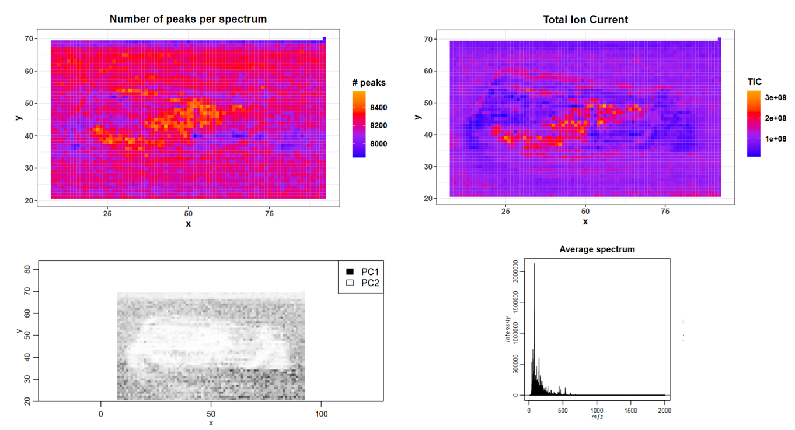

# Introduction
{:.no_toc}

Mass spectrometry imaging (MSI) is applied to measure the spatial distribution of hundreds of biomolecules in a sample. A mass spectrometer scans over the entire sample and collects a mass spectrum every 5-200 µm. This results in thousands of spots in which a mass spectrum is acquired. Each mass spectrum consists of hundreds of analytes that are measured by their mass-to-charge (m/z) ratio. For each analyte the peak intensity in the mass spectra of every pixel is known and can be set together to map the spatial distribution of the analyte in the sample. 

The technique has a broad range of applications as it is able to measure many different kinds of analytes such as peptides, proteins, metabolites or chemical compounds in a large variety of samples such as cells, tissues and liquid biopsies. Application areas include pharmacokinetic studies, biomarker discovery, molecular pathology, forensic studies, plant research and material sciences. The strength of MSI is the simultaneous analysis of hundreds of analytes in an unbiassed, untargeted, label free, fast and affordable measurement while maintaining morphological information. 

Depending on the analyte of interest and the application, different mass spectrometers are used. A mass spectrometer measures the analytes by ionizing, evaporating and sorting them by their mass-to-charge (m/z) ratio. Put simply, a mass spectrometer needs basically three parts: an ionization source, a mass analyzer and a detector. Most common ionization sources for MSI are MALDI (Matrix Assisted Laser Desorption/Ionization), DESI (Desorption Electrospray Ionization) and SIMS (Secondary Ion Mass Spectrometry).


One common type of mass spectrometer for MSI is a MALDI Time-Of-Flight (MALDI-TOF) device. During MALDI ionization a laser shoots onto the sample that was covered with a special matrix which absorbs the laser energy and transfers it to the analytes. This process evaporizes and ionizes the analytes that due to their charge can then be accelerated in an electrical field towards the TOF tube. The time of flight through the tube to the detector is measured and as this correlates with the mass over charge (m/z) of the analyte, the flight time allows the calculation of m/z. During measurement complete mass spectra are acquired in thousands of sample spots. Each mass spectrum contains hundreds of analyte m/z and for each of those analytes an abundance heatmap showing the spatial distribution in the sample can be calculated and visualized. 

Depending on the analyte of interest, the sample type and the mass spectrometer, the sample preparation steps as well as the properties of the acquired data differ. Independent of those differences, the preparation and measurement of the sample is normally straightforward while the analysis of the large and complex data is the main bottleneck of a MSI experiment. 

In this tutorial we will determine analytes with a localized distribution in a chilli cross section. The data analysis steps can be transferred to any other application in which the morphological distribution of an analyte in a sample is analyzed. A common application is studying the distribution of a drug and its metabolites in an animal model to better understand pharmacokinetic properties of the drug. 


> ### Agenda
>
> In this tutorial, we will cover:
>
> 1. TOC
> {:toc}
>
{: .agenda}

# Chilli dataset

In this tutorial we will use the chilli dataset generated in the lab of Robert Winkler at the CINVESTAV institute in Irapuato (Mexico) and deposited at [Zenodo](https://zenodo.org/record/484496). The data was acquired to show that their self made low cost 'plug and play' MSI system as well as their open source R scripts work properly and allow the direct spatially resolved detection of volatile organic compounds (VOCs) from plant tissue ([Maldonado-Torres et al.](https://doi.org/10.1016/j.jprot.2014.03.003) and [Gamboa-Becerra et al.](https://doi.org/10.1007/s00216-015-8744-9)). 

The mass spectrometer consisted of a low-temperature plasma (LTP) ionization source coupled to a quadrupole mass analyzer. This ionization source allows to measure semi-volatile organic compunds directly from fresh material under ambient conditions without destruction of the sample. To get an idea how this set up and the chilli looks like have a look at their [video](https://www.youtube.com/watch?v=NbZ1QqTZvXM) and [website](http://lababi.bioprocess.org/). The chilli (*Capsicum annuum*) was purchased from a local market in Irapuato, Mexico and longitudinally cut into a slice of 80 x 35 mm and 4 mm thickness and laid onto a glass slide. Mass spectra were acquired with a spatial resolution of 1 mm and in a mass range from 15 – 2000 Thomson (Th, unit of m/z) to measure semi-volatile and volatile organic compounds (VOCs). 

We will check the properties of the dataset and then perform similar steps as described by [Gamboa-Becerra et al.](https://doi.org/10.1007/s00216-015-8744-9): Plotting an average mass spectrum, filtering the dataset for the relevant m/z range, automatical generation of m/z images to find analytes that correspond to morphological features and generating an image that overlays three different analytes. 


## Get data

The imzML file consists of two files: The first file contains the metadata in an XML file and has the extension .imzML. The second file contains the mass spectra data, is saved as a binary file and its extension is .ibd. To be valid both files must have the same filename before the extension. More information about the imzML file structure can be found here: [ms-imaging.org](https://ms-imaging.org/wp/imzml/data-structure/). Galaxy provides the composite upload for files consisting of several components.

> ###  Hands-on: Data upload
>
> 1. **Create a new history** and give it a name.
>
>    
>
> 2. Import the files from [Zenodo](https://zenodo.org/record/484496). Download both subfiles of the imzML file: the imzML part and the ibd part:
>
>    ```
>    https://zenodo.org/record/484496/files/ltpmsi-chilli.imzML
>    https://zenodo.org/record/484496/files/ltpmsi-chilli.ibd
>    ```
>
> 3. Upload the data on Galaxy via the **composite** option.
>
>    > ###  Tip: Upload via the composite option
>    > - Open the Galaxy Upload Manager ( on the top-right of the tool panel)
>    > - Click on **Composite** on the top
>    > - Set **Composite Type** to `imzml`
>    > - Expand the first **Select** button (for the imzML metadata component)
>    > - Select **Choose local file** and the local `ltpmsi-chilli.imzML` file
>    > - Expand the second **Select** button (for the mass spectral data component)
>    > - Select **Choose local file** and the local `ltpmsi-chilli.ibd` file
>    > - Press **Start**
>    > - **Close** the window
>    {: .tip}
>
>    
>
>    > ###  Tip: FTP upload for large files
>    > * In case one subfile is larger than 2 GB the uploading needs to be done via ftp.
>    > * The necessary steps are explained in this tutorial [Getting data into Galaxy]({{ site.baseurl }}/topics/galaxy-data-manipulation/tutorials/get-data/slides.html)
>    {: .tip}
>
>    > ###  Tip: Uploading an Analyze7.5 file
>    > * `Analyze7.5` files are also supported by Galaxy.
>    > * The file consists of three components and is therefore uploaded via the 'composite' function, analogously to the imzML upload.
>    > * The files to select in the `composite` tab are the header file `.hdr`, the m/z values file `.t2m` and the spectra file `.img`.
>    {: .tip}
{: .hands_on}


# Exploring and filtering the chilli dataset

## Quality control of the data

> ###  Hands-on: Quality control 
>
> 1. **MSI Qualitycontrol**  with the following parameters:
>    -  *"MSI data"*: `ltpmsi-chilli.imzML` (Input dataset)
>    - *"Processed imzML file"*: `yes`
>        - *"Mass accuracy to which the m/z values will be binned"*: `0.1`
>        - *"Unit of the mass accuracy"*: `mz`
>    - *"PCA with 2 components"*: `Yes`
>    - Press **Execute**
>
>    > ###  Properties of the imzML file
>    > To set the parameters for the mass spectrometry imaging tools correctly three parameters should be known about the dataset: Is the imzML file type processed or continuous, are the spectra profile or centroided mode and the accuracy of the mass spectrometer. For the chilli dataset the publication states that it is a processed imzML type in centroided mode. 
To be sure this information can also be extracted by opening the local imzML component of the file in a text editor. There we read for the chilli dataset: 
>    >
>    >      <cvParam cvRef="MS" accession="MS:1000128" name="profile spectrum" value=""/>
>    >      <cvParam cvRef="IMS" accession="IMS:1000031" name="processed" value=""/>
>    >
>    >The spectra are in profile mode and not centroided. The information that the data is a processed imzML type is correct what means that each spectrum has an individual m/z axis opposite to the continuous imzML type where all spectra have the same m/z axis. In many software tools processed imzML files are not or only partly supported. The Cardinal software supports processed imzML files but requires a binning of the m/z values while reading the file. The bin size should be chosen according to the m/z accuracy of the mass spectrometer. For the chilli dataset we therefore use 0.1 m/z as this results in m/z bins of 0.2 m/z what corresponds to the m/z step size that was used in the publication. 
>    {: .comment}
>
{: .hands_on}

> ###  Questions
>
> 1. In what m/z range was the data acquired?
> 2. How many spectra (pixels) were measured?
> 3. In which images can you guess the shape of the chilli?
>
> > ###  Solution
> >
> > 1. The measured m/z range was m/z 15 - 2000.
> > 2. 4166 spectra were measured.
> > 3. The rough shape of the chilli section is visible in the "Number of peaks per spectrum"; "TIC per spectrum" and "PCA result" images. 
> >
> {: .solution}
>
{: .question}

Open the quality report with the eye button and check the summary table on the first page to answer question 1 and 2. The shape of the chilli can roughly be seen in the images showing the number of peaks per spectrum and the total ion chromatogram with higher values in the middle part of the fruit that roughly corresponds to the placenta. In the PCA image the complete chilli except for the lowest part of the fruit is visible in light colours compared to the dark background. 

To further investigate mass spectra of different chilli compartments we select one pixel for each tissue area (pericarp, placenta and seeds) from the total ion chromatogram image. Knowing the exact shape of the chilli tissue from Figure 4 of the publication helps to find the corresponding areas. This are the pixels we have chosen for the tutorial: 

    x     y     compartment
    39    53    seeds
    50    44    placenta
    25    60    pericarp



The average mass spectra plots show that there are not many analytes above 900 Th as the intensities in this m/z area are quite low and show no distinct peaks. 

## Plotting average  mass spectra

We will follow up on the average mass spectra plots from the quality control report as well as on the differences of mass spectra from different chilli compartments. First, we generate more zoomed in mass spectra plots to get an idea about the m/z range that is relevant for LTP ionized analytes. Next, we will plot and compare mass spectra that derive from different regions of the chilli. 

> ###  Hands-on: Average mass spectra
>
> 1. **MSI plot spectra**  with the following parameters:
>    -  *"MSI data"*: `ltpmsi-chilli.imzML` (Input dataset)
>    - *"Processed imzML file"*: `yes`
>        - *"Mass accuracy to which the m/z values will be binned"*: `0.1`
>        - *"Unit of the mass accuracy"*: `mz`
>    - *"Select if you want to plot the mass spectrum of a single pixel or the average spectrum of all pixels of a sample"*: `Average spectrum for each sample`
>        - *"Use pixel annotation from tabular file for spectra plots"*: `pixels belong into one group only`
>        - In *"Zoomed in plots with m/z min and m/z max to define the plot window"*:
>            - Click on *"Insert Zoomed in plots with m/z min and m/z max to define the plot window"*:
>            - In *"1: Zoomed in plots with m/z min and m/z max to define the plot window"*:
>                - *"lower m/z boundary for plotting window"*: `10`
>                - *"upper m/z boundary for plotting window"*: `200`
>            - Click on *"Insert Zoomed in plots with m/z min and m/z max to define the plot window"*:
>            - In *"2: Zoomed in plots with m/z min and m/z max to define the plot window"*:
>                - *"lower m/z boundary for plotting window"*: `200`
>                - *"upper m/z boundary for plotting window"*: `500`
>            - Click on *"Insert Zoomed in plots with m/z min and m/z max to define the plot window"*:
>            - In *"3: Zoomed in plots with m/z min and m/z max to define the plot window"*:
>                - *"lower m/z boundary for plotting window"*: `500`
>                - *"upper m/z boundary for plotting window"*: `1000`
>            - Click on *"Insert Zoomed in plots with m/z min and m/z max to define the plot window"*:
>            - In *"4: Zoomed in plots with m/z min and m/z max to define the plot window"*:
>                - *"lower m/z boundary for plotting window"*: `1000`
>                - *"upper m/z boundary for plotting window"*: `1500`
>            - Click on *"Insert Zoomed in plots with m/z min and m/z max to define the plot window"*:
>            - In *"5: Zoomed in plots with m/z min and m/z max to define the plot window"*:
>                - *"lower m/z boundary for plotting window"*: `1500`
>                - *"upper m/z boundary for plotting window"*: `2000`
>
{: .hands_on}

> ###  Questions
>
> 1. What is roughly the m/z of the heaviest peak visible in the average spectra plot of the complete m/z range? 
> 2. What is roughly the m/z of the peak with the highest average intensity?
>
> > ###  Solution
> >
> > 1. There is a tiny peak at m/z ~760.
> > 2. The highest peak is at ~80 m/z what can best be seen in the mass spectrum between 15 and 200 m/z. 
> >
> {: .solution}
>
{: .question}

In the average spectrum of the complete m/z range there are no visible peaks above 800 Th. Most of the high intense peaks are below 300 Th what corresponds to typical masses of VOCs. Even in the zoomed mass spectra between 1000 and 2000 Th only few distinct peaks can be guessed in the noise. In concordance with [Gamboa-Becerra et al.](https://doi.org/10.1007/s00216-015-8744-9) we will restrict further analysis to the m/z range between 15 and 1000. 


We will rerun the msi spectra plot tool and add the annotation of the pixels that correspond to different chilli compartments.

> ###  Hands-on: Mass spectra of different chilli compartments
>
> 1. Create a tabular file with the coordinates of interest and rename it:
>
>    ```
    x     y     compartment
    39    53    seeds
    50    44    placenta
    25    60    pericarp
>    ```
>
>    > ###  Tip: Creating a new file
>    >
>    > * Open the Galaxy Upload Manager
>    > * Select **Paste/Fetch Data**
>    > * Paste the file contents into the text field
>    > * From the settings menu  select **Convert spaces to tabs**
>    > * Press **Start** and **Close** the window
>    {: .tip}
>
>    > ###  Tip: Rename a dataset
>    > - Click on the  **pencil icon** for the dataset to edit its attributes
>    > - In the central panel, change the **Name** field to `annotations`
>    > - Click the **Save** button
>    {: .tip}
>
> 2. Press the rerun button of the **MSI plot spectra**  result, keep everything as above and change the following:
>    - *"Use pixel annotation from tabular file for spectra plots"*: `group pixels according to annotations`
>        -  *"Tabular file with pixel coordinates and annotation"*: `annotations` (Input dataset)
>        - *"Column with x values"*: `column:1`
>        - *"Column with y values"*: `column:2`
>        - *"Column with pixel annotations"*: `column:3`
>        - *"Tabular file contains a header line"*: `Yes`
>
{: .hands_on}

> ###  Questions
>
> 1. What does the NA annotation stand for? 
> 2. To which compartment does the highest intensity peak belong to? 
> 3. To which compartment does the third highest intensity peak belong to?
>
> > ###  Solution
> >
> > 1. All spectra without annotation in the tabular file are considered as NA, what means that NA represents the average spectrum of the dataset except for the 3 annotated pixels.
> > 2. The highest intensity peak at around 80 Th belongs to the spectrum that is located in the pericarp of the chilli. 
> > 3. The peak at around 60 Th belongs to the spectrum that is located in the seeds.
> {: .solution}
>
{: .question}


The single spectra that derive from different chilli departments show quite some differences. One has to keep in mind that this are single spectra and therefore the intensities can be different from the average intensity of the compartment. Looking at the m/z range between 1000 and 2000 we realize that there are quite some distinct peaks which were hidden in the noise of the average spectrum that not only contained the spectra of the chilli but also all background spectra. In concordance with the original publication and to speed up computation times we also focus on the low m/z range but for a deeper analysis it could be worth to also analyze the higher m/z range.

## Filtering for the relevant m/z range

> ###  Hands-on: filtering for a m/z range
>
> 1. **MSI filtering**  with the following parameters:
>    -  *"MSI data"*: `ltpmsi-chilli.imzML` (Input dataset)
>    - *"Processed imzML file"*: `yes`
>        - *"Mass accuracy to which the m/z values will be binned"*: `0.1`
>        - *"Unit of the mass accuracy"*: `mz`
>    - *"Select m/z feature filtering option"*: `m/z range (manually)`
>        - *"Minimum value for m/z"*: `15.0`
>        - *"Maximum value for m/z"*: `1000.0`
>
{: .hands_on}

> ###  Questions
>
> 1. How many m/z features are left in the output dataset?
> 2. How many m/z features were removed?
>
> > ###  Solution
> >
> > 1. After filtering 4926 m/z features are left. 
> > 2. The dataset had originally 9927 m/z features, after filtering 4926 are left what means that 5001 were removed.
> >
> {: .solution}
>
{: .question}

Cardinal tools write only continuous imzMl formats, therefore from now on the dataset is in continuous imzML format and "processed imzML file" can be set to 'no' in the following tools. 

# Multiple and overlayed analyte images

## Automatic generation of analyte images

For the chilli dataset we want to know which m/z features have a localized distribution in the fruit. This is done by automatically generating distribution images for all analytes (m/z features) and then visually identify which features are localized in specific compartments of the fruit. [Gamboa-Becerra et al.](https://doi.org/10.1007/s00216-015-8744-9) scan the m/z range with a step size of 0.2 Th and a tolerance of 0.4 Th what resulted in more than 2000 images which they visually explored for localized features. In this training we will only generate images for the two mass ranges where we have already seen high intensity peaks in the spectra plots: around 60 and 80 m/z. We already binned the dataset to 0.2 Th and therefore need only to specify the m/z tolerance of 0.4 Th. The large tolerance was chosen to obtain images from overlapping m/z ranges to make the signal intensity more robust against small m/z inaccuracies in individual mass spectra. We obtain the m/z features with the MSI data exporter tool and then filter for the m/z ranges of interest and use the resulting tabular file to automatically generate the analyte images.

> ###  Hands-on: Generation of multiple analyte images
>
> 1. **MSI data exporter**  with the following parameters:
>    -  *"MSI data"*: `MSI filtering on data 1: imzML` (output of **MSI filtering** )
>    - *"Multiple output files can be selected"*: `mz feature output`
>
> 2. **Filter**  with the following parameters:
>    -  *"Filter data on any column using simple expressions"*: `MSI data exporter on data 6: features` (output of **MSI data exporter** )
>    - *"With following condition"*: `c2>=60 and c2<=65 or c2>=80 and c2<=85`
>    - *"Number of header lines to skip"*: `1`
>
> 3. **MSI mz images**  with the following parameters:
>    -  *"MSI data"*: `MSI filtering on data 1: imzML` (output of **MSI filtering** )
>    -  *"m/z of interest (e.g. internal Calibrants)"*: `Filter on data 8` (output of **Filter** )
>    - *"Column with m/z values"*: `column:2`
>    - *"Column with name of m/z values"*: `column:1`
>    - *"Tabular file contains a header line"*: `Yes`
>    - *"Select a contrast enhancement function for the heatmap images"*: `suppression`
>    - *"M/z range"*: `0.4`
>
{: .hands_on}

> ###  Questions
>
> 1. Which are the two analyte images that show the most localized distribution?
> 2. To which compartments are the two features localized? 
>
> > ###  Solution
> >
> > 1. To define the exact m/z with the best localization is quite tricky. Between 61.8 and 62.6 Th there is a localized feature and between 84 and 84.4 Th. We would choose 62.2 and 84.2 to get the best images (in the publication it was 62.1 and 84.1).
> > 2. The comparison of the feature localization with the chilli image shows that the 62.2 Th feature is located in the seeds and the 84.2 Th feature more uniformly in the placenta and pericarp.
> >
> {: .solution}
>
{: .question}

In this tutorial we only evaluated 102 features, while the authors of this study evaluated more than 2000 images visually. This process is time consuming and biased by the judgment of the scientist, still this method seems to be quite common. Several attempts have been made to circumvent this process and obtain m/z features with localized distribution automatically [Alexandrov and Bartels](https://doi.org/10.1093/bioinformatics/btt388) and [Ingelese et al.](https://doi.org/10.1093/bioinformatics/bty622).
After m/z features with a localized distribution have been found, it is interesting to identify them. Therefore [Gamboa-Becerra et al.](https://doi.org/10.1007/s00216-015-8744-9) performed additional gas and liquid chromatography mass spectrometry (GC-MS and LC-MS) which enabled the high certainty identification of several features. Unfortunately the highly localized features 62.2 and 84.2 could not be identified but the defined localization implies their biological importance. Several capsaicinoids could be identified amongst them capsaicine with a m/z of 306.6. 

> ###  Identification of m/z features
> The identification of m/z features in MSI experiments is not always necessary but can increase the confidence in the analysis and the molecular understanding. M/z features are either matched to databases or for more confidence another experiment is performed on the same sample to restrict the identification possibilities to analytes that are actually present in the sample. In this study other mass spectrometry techniques were applied and could identify several m/z features but at the same time features with defined localization could not be identified (e.g. 62.2 Th and 84.2 Th). This molecules can be fragments, metabolites or contaminants that are not available with the used mass spectrometry techniques. 
> Targeted analysis can be performed if the m/z of the molecule of interest is already known (e.g. when studying the tissue distribution of a drug and its known metabolites). In this case distribution images for the molecules of interest are a good starting point and scanning through all m/z features might not be necessary.
{: .comment}


## Overlay image for three analyte features

Next, we will plot the distribution of molecules with different distributions in the tissue: 306.6 Th (Capsaicin), 62.2 Th and 84.2 Th. 

> ###  Hands-on: Overlay image for several m/z features
>
> 1. Create a tabular file with the m/z of interest and rename it to 'mz features':
>
>    ```
>    306.6
>    62.2
>    84.2
>    ```
>
>    > ###  Tip: Creating a new file
>    >
>    > * Open the Galaxy Upload Manager
>    > * Select **Paste/Fetch Data**
>    > * Paste the file contents into the text field
>    > * Set Type to **tabular** instead of auto-detect
>    > * Press **Start** and **Close** the window
>    {: .tip}
>
>
> 2. **MSI mz images**  with the following parameters:
>    -  *"MSI data"*: `MSI filtering on data 1: imzML` (output of **MSI filtering** )
>    -  *"m/z of interest (e.g. internal Calibrants)"*: `mz features` (Input dataset)
>    - *"Column with m/z values"*: `column:1`
>    - *"Column with name of m/z values"*: `column:1`
>    - *"Tabular file contains a header line"*: `No`
>    - *"Select a contrast enhancement function for the heatmap images"*: `suppression`
>    - *"M/z range"*: `0.4`
>    - *"Overlay image"*: `Yes`
>        - *"1: Colours for the plots"*: `red`
>        - *"2: Colours for the plots"*: `blue`
>        - *"3: Colours for the plots"*: `green`
>
{: .hands_on}

> ###  Questions
>
> 1. To which compartment is capsaicin located? 
>
> > ###  Solution
> >
> > 1. Capsaicin is located in the middle of the placenta and partly in the seeds. 
> >
> {: .solution}
>
{: .question}


