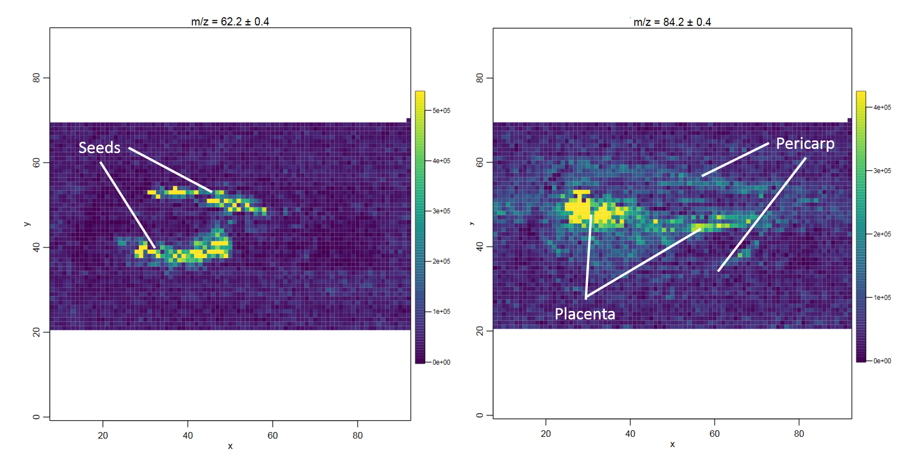

# Introduction


Mass spectrometry imaging (MSI) is applied to measure the spatial distribution of hundreds of biomolecules in a sample. A mass spectrometer scans over the entire sample and collects a mass spectrum every 5-200 µm. This results in thousands of spots (or pixels) for each of which a mass spectrum is acquired. Each mass spectrum consists of hundreds of analytes that are measured by their mass-to-charge (m/z) ratio. For each analyte the peak intensity in the mass spectra of every pixel is known and can be set together to map the spatial distribution of the analyte in the sample. 

The technique has a broad range of applications as it is able to measure many different kinds of analytes such as peptides, proteins, metabolites or chemical compounds in a large variety of samples such as cells, tissues and liquid biopsies. Application areas include pharmacokinetic studies, biomarker discovery, molecular pathology, forensic studies, plant research and material sciences. The strength of MSI is the simultaneous analysis of hundreds of analytes in an unbiased, untargeted, label-free, fast and affordable measurement while maintaining morphological information. 

Depending on the analyte of interest and the application, different mass spectrometers are used. A mass spectrometer measures the analytes by ionizing, evaporating and sorting them by their mass-to-charge (m/z) ratio. Put simply, a mass spectrometer consists basically of three parts: an ionization source, a mass analyzer and a detector. The most common ionization sources for MSI are MALDI (Matrix Assisted Laser Desorption/Ionization), DESI (Desorption Electrospray Ionization) and SIMS (Secondary Ion Mass Spectrometry).


One common type of mass spectrometer for MSI is a MALDI Time-Of-Flight (MALDI-TOF) device. During MALDI ionization, a laser is fired onto the sample, which has been covered with a special matrix that absorbs the laser energy and transfers it to the analytes. This process vaporizes and ionizes the analytes. As they are now charged, they can be accelerated in an electric field towards the TOF tube. The time of flight through the tube to the detector is measured, which allows calculation of the mass over charge (m/z) of the analyte, as both mass and charge are correlated with time of flight. During measurement, complete mass spectra with hundreds of m/z - intensity pairs are acquired in thousands of sample plots, leading to large and complex datasets. Each mass spectrum is annotated with coordinates (x,y) that define its location in the sample. This allows visualization of the intensity distribution of each m/z feature in the sample as a heatmap.

Depending on the analyte of interest, the sample type and the mass spectrometer, the sample preparation steps as well as the properties of the acquired data vary. Apart from these differences, the preparation and measurement of the sample is normally straightforward, while the analysis of the large and complex dataset is the main bottleneck of a MSI experiment. 

In this tutorial we will determine analytes with a localized distribution in a chilli cross section. The data analysis steps can be transferred to any other application in which the morphological distribution of an analyte in a sample is analyzed. A common application is studying the distribution of a drug and its metabolites in an animal model to better understand pharmacokinetic properties of the drug. 


> <agenda-title></agenda-title>
>
> In this tutorial, we will cover:
>
> 1. TOC
> {:toc}
>
{: .agenda}

# Chilli dataset

In this tutorial we will use the chilli dataset generated in the lab of Robert Winkler at the CINVESTAV institute in Irapuato (Mexico) and deposited at [Zenodo](https://zenodo.org/record/484496). The data was acquired to demonstrate their self-made low-cost 'plug and play' MSI system as well as their open source R scripts and to show they allow the direct spatially resolved detection of volatile organic compounds (VOCs) from plant tissue ([Maldonado-Torres et al.](https://doi.org/10.1016/j.jprot.2014.03.003) and [Gamboa-Becerra et al.](https://doi.org/10.1007/s00216-015-8744-9)). 

The mass spectrometer consisted of a low-temperature plasma (LTP) ionization source coupled to a quadrupole mass analyzer. This ionization source allows measurement of semi-volatile organic compunds directly from fresh material under ambient conditions without destruction of the sample. To get an idea how this set up and the chilli looks, have a look at their [video](https://www.youtube.com/watch?v=NbZ1QqTZvXM) and [website](http://lababi.bioprocess.org/). The chilli (*Capsicum annuum*) was purchased from a local market in Irapuato, Mexico and longitudinally cut into a slice of 80 x 35 mm and 4 mm thickness and laid onto a glass slide. Mass spectra were acquired with a spatial resolution of 1 mm and in a mass range from 15 – 2000 m/z to measure semi-volatile and volatile organic compounds (VOCs). 

We will check the properties of the dataset and then perform a similar analysis to that described by [Gamboa-Becerra et al.](https://doi.org/10.1007/s00216-015-8744-9): plotting an average mass spectrum, filtering the dataset for the relevant m/z range, automatical generation of m/z images to find analytes that correspond to morphological features and generating an image that overlays three different analytes. 


## Get data

The imzML composite file consists of two files. The first file contains the metadata in an XML file and has the extension .imzML. The second file contains the mass spectra data, is saved as a binary file and has the extension .ibd. To be valid, both files must have the same filename before the extension. More information about the imzML file structure can be found here: [ms-imaging.org](https://ms-imaging.org/wp/imzml/data-structure/). Galaxy provides a composite upload option for files consisting of several components.

> <hands-on-title>Data upload</hands-on-title>
>
> 1. **Create a new history** and give it a name.
>
>    
>
> 2. Upload the data from [Zenodo](https://zenodo.org/record/484496) via the **composite** option
>
>    > <tip-title>Upload via the composite option</tip-title>
>    > - Open the Galaxy Upload Manager( on the top-right of the tool panel)
>    > - Click on **Composite** on the top
>    > - Set **Composite Type** to `imzml`
>    > - Expand the first **Select** button (for the imzML metadata component)
>    > - Select **Paste/Fetch data** and paste
>    >    ```
>    > https://zenodo.org/record/484496/files/ltpmsi-chilli.imzML
>    >    ```
>    > - Expand the second **Select** button (for the mass spectral data component)
>    > - Select **Paste/Fetch data** and paste
>    >    ```
>    > https://zenodo.org/record/484496/files/ltpmsi-chilli.ibd
>    >    ```
>    > - Press **Start**
>    > - **Close** the window
>    {: .tip}
>
>    
>
>    > <tip-title>FTP upload for large files</tip-title>
>    > * In case one subfile is larger than 2 GB the uploading needs to be done via ftp.
>    > * The necessary steps are explained in this tutorial [Getting data into Galaxy]({{ site.baseurl }}/topics/galaxy-interface/tutorials/get-data/slides.html)
>    {: .tip}
>
>    > <tip-title>Uploading an Analyze7.5 file</tip-title>
>    > * `Analyze7.5` files are also supported by Galaxy.
>    > * The file consists of three components and is therefore uploaded via the 'composite' function, analogously to the imzML upload.
>    > * The files to select in the `composite` tab are the header file `.hdr`, the m/z values file `.t2m` and the spectra file `.img`.
>    {: .tip}
>
> 3. Rename the data into `ltpmsi-chilli`
>
>    > <tip-title>Rename a dataset</tip-title>
>    > - Click on the  **pencil icon** for the dataset to edit its attributes
>    > - In the central panel, change the **Name** field to `ltpmsi-chilli`
>    > - Click the **Save** button
>    {: .tip}
{: .hands_on}


# Exploring and filtering the chilli dataset

## Quality control of the data

Before starting any analysis it is important to check the characteristics and quality of the MSI data. The MSI quality control tool creates a comprehensive PDF report that contains multiple descriptive visualizations of different data attributes. Here we will use the MSI quality control to get an idea about the m/z range and the shape of the chilli section. More details about the MSI quality control tool can be found in the tutorial [Mass spectrometry imaging 1: Loading and exploring MSI data]({{site.baseurl}}/topics/proteomics/tutorials/mass-spectrometry-imaging-loading-exploring-data/tutorial.html).

> <hands-on-title>Quality control </hands-on-title>
>1. 
>    -  *"MSI data"*: `ltpmsi-chilli.imzML` (Input dataset)
>    - *"Centroided input"*: `yes`
>    - *"Processed imzML file"*: `yes`
>        - *"Mass accuracy to which the m/z values will be binned"*: `0.2`
>        - *"Unit of the mass accuracy"*: `mz`
>    - *"PCA with 2 components"*: `Yes`
>    - Press **Execute**
>
>    > <comment-title>Properties of the imzML file</comment-title>
>    > To set the parameters for the mass spectrometry imaging tools correctly the following three parameters should be known about the dataset: 1) is the imzML file type processed or continuous, 2) are the spectra in profile or centroided mode and 3) the accuracy of the mass spectrometer. For the chilli dataset the publication states that it is a processed imzML type in centroided mode. This information can also be extracted by opening the local imzML component of the file in a text editor or web browser. Line 10 and 11 state: 
>    >
>    >      <cvParam cvRef="MS" accession="MS:1000128" name="profile spectrum" value=""/>
>    >      <cvParam cvRef="IMS" accession="IMS:1000031" name="processed" value=""/>
>    >
>    > Starting from line 105 the "run" and "spectrumList" elements describe the acquired spectra in more detail:
>    >
>    >      <run defaultInstrumentConfigurationRef="IC1" id="_x0031_30704_IMGCHJ2">
>    >      <spectrumList count="4166" defaultDataProcessingRef="pwiz_Reader_conversion">
>    >        <spectrum defaultArrayLength="11127" id="controllerType=0 controllerNumber=1 scan=1" index="0" dataProcessingRef="pwiz_Reader_conversion">
>    >          <cvParam cvRef="MS" accession="MS:1000511" name="ms level" value="1"/>
>    >          <cvParam cvRef="MS" accession="MS:1000579" name="MS1 spectrum" value=""/>
>    >          <cvParam cvRef="MS" accession="MS:1000127" name="centroid spectrum" value=""/>
>    >          <cvParam cvRef="MS" accession="MS:1000528" name="lowest observed m/z" value="15"/>
>    >          <cvParam cvRef="MS" accession="MS:1000527" name="highest observed m/z" value="2000"/>
>    >          <cvParam cvRef="MS" accession="MS:1000504" name="base peak m/z" value="80.0377"/>
>    >          <cvParam cvRef="MS" accession="MS:1000505" name="base peak intensity" value="3.72813e+006"/>
>    >          <cvParam cvRef="MS" accession="MS:1000285" name="total ion current" value="2.42458e+008"/>
>    >
>    > This means that the file consists of 4166 spectra (count="4166") and that the imzML type is 'processed' as the first spectrum (scan="1") has 11127 m/z values (defaultArrayLength="11127) while the following spectra (not shown here) have different numbers of m/z values. In processed imzML files each spectrum has an individual m/z axis, in contrast to the continuous imzML type, where all spectra have the same m/z axis. In many software tools processed imzML files are not or only partly supported. The MSI tools in Galaxy are based on [Cardinal](http://cardinalmsi.org/) and therefore support imzML files, but require a binning of the m/z values while reading the file. The bin size should be chosen according to the m/z accuracy of the mass spectrometer. For the chilli dataset we therefore use 0.1 m/z, as this results in m/z bins of 0.2 m/z which corresponds to the m/z step size that was used in the publication. 
>    >
>    > Regarding the spectra, line 10 states that the spectra are in profile mode while the 'run' section defines spectrum 1 as a centroided spectrum. As the 'run' section is directly linked to the spectra in the ibd file, this is the information to trust. Furthermore, the 'dataProcessingList' element gives a hint that peak picking was performed, which is confirmed in the publication. 
>    {: .comment}
>
{: .hands_on}


> <question-title></question-title>
>
> 1. In which m/z range were the data acquired?
> 2. How many spectra (pixels) were measured?
> 3. In which images can you guess the shape of the chilli?
>
> > <solution-title></solution-title>
> >
> > 1. The measured m/z range was m/z 15 - 2000.
> > 2. 4166 spectra were measured.
> > 3. The rough shape of the chilli section is visible in the "Number of peaks per spectrum"; "Total Ion Current" and "PCA result" images. 
> >
> {: .solution}
>
{: .question}

Open the quality report with the eye button and check the summary table on the first page to answer question 1 and 2. The shape of the chilli can roughly be seen in the images showing the number of peaks per spectrum and the total ion current, with higher values in the middle part of the fruit that roughly corresponds to the placenta. In the PCA image the complete chilli, except for the lowest part of the fruit, is visible in light colours compared to the dark background. 

To further investigate mass spectra of different chilli compartments we select one pixel for each tissue area (pericarp, placenta and seeds) from the total ion current image. Knowing the exact shape of the chilli tissue from Figure 4 of the publication helps to find the corresponding areas. This are the pixels we have chosen for the tutorial: 

seeds: x=39 y=53, placenta: x=50 y=44, pericarp: x=25 y=60

The relevant m/z range for VOCs was not known before the measurement and therefore chosen quite liberally. The average mass spectra plots give a hint about the relevant m/z range of the sample with most peaks below 750 m/z and no distinct peaks above 750 m/z. 


## Plotting average mass spectra

We will follow up on the average mass spectra plots from the quality control report as well as on the differences between mass spectra from different chilli compartments. First, we generate more zoomed in mass spectra plots to get an idea about the m/z range that is relevant for VOCs. Next, we will plot and compare mass spectra that derive from different regions of the chilli. 

> <hands-on-title>Average mass spectra</hands-on-title>
>
> 1. 
>    -  *"MSI data"*: `ltpmsi-chilli.imzML` (Input dataset)
>    - *"Centroided input"*: `yes`
>    - *"Processed imzML file"*: `yes`
>        - *"Mass accuracy to which the m/z values will be binned"*: `0.2`
>        - *"Unit of the mass accuracy"*: `mz`
>    - *"Choose spectra"*: `Plot mean spectra based on all spectra`
>        - In *"zoomed in m/z range"*: `Manual input`
>            - Click on *"Define min m/z and max m/z for the plotting window"*:
>            - In *"1: Define min m/z and max m/z for the plotting window"*:
>                - *"lower m/z boundary for plotting window"*: `10`
>                - *"upper m/z boundary for plotting window"*: `200`
>            - Click on *"Define min m/z and max m/z for the plotting window"*:
>            - In *"2: Define min m/z and max m/z for the plotting window"*:
>                - *"lower m/z boundary for plotting window"*: `200`
>                - *"upper m/z boundary for plotting window"*: `500`
>            - Click on *"Define min m/z and max m/z for the plotting window"*:
>            - In *"3: Define min m/z and max m/z for the plotting window"*:
>                - *"lower m/z boundary for plotting window"*: `500`
>                - *"upper m/z boundary for plotting window"*: `1000`
>            - Click on *"Define min m/z and max m/z for the plotting window"*:
>            - In *"4: Define min m/z and max m/z for the plotting window"*:
>                - *"lower m/z boundary for plotting window"*: `1000`
>                - *"upper m/z boundary for plotting window"*: `1500`
>            - Click on *"Define min m/z and max m/z for the plotting window"*:
>            - In *"5: Define min m/z and max m/z for the plotting window"*:
>                - *"lower m/z boundary for plotting window"*: `1500`
>                - *"upper m/z boundary for plotting window"*: `2000`
>
{: .hands_on}

> <question-title></question-title>
>
> 1. What is the approximate m/z of the heaviest peak visible in the average spectra plot of the complete m/z range? 
> 2. What is the approximate m/z of the peak with the highest average intensity?
>
> > <solution-title></solution-title>
> >
> > 1. There is a tiny peak at m/z ~760.
> > 2. The highest peak is at ~80 m/z, which can best be seen in the mass spectrum between 15 and 200 m/z. 
> >
> {: .solution}
>
{: .question}

In the average spectrum of the complete m/z range there are no visible peaks above 800 m/z. Most of the high intensity peaks are below 300 Th, which corresponds to the typical masses of VOCs. Even in the zoomed mass spectra between 1500 and 2000 m/z only a few distinct peaks can be identified in the noise. In accordance with [Gamboa-Becerra et al.](https://doi.org/10.1007/s00216-015-8744-9), we will restrict further analysis to the m/z range between 15 and 1000. 


We will rerun the MSI plot spectra tool and add annotation to the pixels that correspond to different chilli compartments.

> <hands-on-title>Mass spectra of different chilli compartments</hands-on-title>
>
> 1. Create a tabular file with the coordinates of interest and rename it to 'annotations':
>
>    ```
>    x     y     compartment
>    39    53    seeds
>    50    44    placenta
>    25    60    pericarp
>    ```
>
>    > <tip-title>Creating a new file</tip-title>
>    >
>    > * Open the Galaxy Upload Manager
>    > * Select **Paste/Fetch Data**
>    > * Paste the file contents into the text field
>    > * From the settings menu  select **Convert spaces to tabs**
>    > * Press **Start** and **Close** the window
>    {: .tip}
>
> 2. 
>    - Press the rerun button, changing only the following:
>    - *"Choose spectra"*: `Plot single spectra (separate or overlaid)`
>        -  *"Load tabular file with pixel coordinates"*: `annotations` (Input dataset)
>        - *"Column with x values"*: `column:1`
>        - *"Column with y values"*: `column:2`
>        - *"Tabular file contains a header line"*: `Yes`
>        - *"Separate plot per spectrum or overlaid plot with average spectra per annotation group"*: `Overlaid spectra plots`
>        - *"Select column with annotations"*: `column:3`
>
{: .hands_on}

> <question-title></question-title>
>
> 1. Which compartment does the highest intensity peak belong to? 
> 2. Which compartment does the third-highest intensity peak belong to?
>
> > <solution-title></solution-title>
> >
> > 1. The highest intensity peak at around 80 m/z belongs to the spectrum that is located in the pericarp of the chilli. 
> > 2. The peak at around 60 m/z belongs to the spectrum that is located in the seeds.
> {: .solution}
>
{: .question}


The single spectra that derive from different chilli compartments show some major differences. You should keep in mind that these are single spectra and therefore the intensities can be different to the average intensity of the compartment. Looking at the m/z range between 1000 and 2000, we realize that there are a number of distinct peaks which were hidden in the noise of the average spectrum, which contained all background spectra as well as the spectra of the chilli. In accordance with the original publication, and to speed up computation time, we focus on the low m/z range, but for a deeper analysis it could also be worth analyzing the higher m/z range.

## Filtering for the relevant m/z range

> <hands-on-title>filtering for a m/z range</hands-on-title>
>
> 1. 
>    -  *"MSI data"*: `ltpmsi-chilli.imzML` (Input dataset)
>    - *"Centroided input"*: `yes`
>    - *"Processed imzML file"*: `yes`
>        - *"Mass accuracy to which the m/z values will be binned"*: `0.2`
>        - *"Unit of the mass accuracy"*: `mz`
>    - *"Select m/z feature filtering option"*: `m/z range (manually)`
>        - *"Minimum value for m/z"*: `15.0`
>        - *"Maximum value for m/z"*: `1000.0`
>
{: .hands_on}

> <question-title></question-title>
>
> 1. How many m/z features are left in the output dataset?
> 2. How many m/z features were removed?
>
> > <solution-title></solution-title>
> >
> > 1. After filtering 4926 m/z features are left. 
> > 2. The dataset originally had 9926 m/z features; after filtering 4926 are left, which means that 5000 were removed.
> >
> {: .solution}
>
{: .question}

The MSI tools are only able to write outputs as continuous imzML format; therefore, from now on the dataset is in continuous imzML format and "processed imzML file" can be set to 'no' in the following tools. 

# Multiple and overlayed analyte images

## Automatic generation of analyte images

The main question for the chilli dataset is which m/z features have a localized distribution in the fruit. This question can be addressed by automatically generating distribution images for all analytes (m/z features) and then visually identifying which features are localized in specific compartments of the fruit. [Gamboa-Becerra et al.](https://doi.org/10.1007/s00216-015-8744-9) scan the m/z range with a step size of 0.2 m/z and a tolerance of 0.4 Th, which resulted in more than 2000 images which they visually explored for localized features. In this training we will only generate images for the two mass ranges where we have already seen high intensity peaks in the spectra plots: around 60 and 80 m/z. 

This requires three steps. Firstly, all m/z features of the dataset with the MSI data exporter are extracted. Secondly, all m/z features are filtered in the m/z ranges that we are interested in: between 55 and 65 Th, as well as between 75 and 85 m/z (this step can be skipped to obtain distribution images for all features). Thirdly, the MSI m/z image tool is used to automatically generate distribution images for each of the m/z from the second step. As the data is already binned to 0.2 Th, only the m/z tolerance of 0.4 m/z has to be specified. The large tolerance was chosen to obtain images from overlapping m/z ranges to make the signal intensity more robust against small m/z inaccuracies in individual mass spectra.

> <hands-on-title>Generation of multiple analyte images</hands-on-title>
> 1. 
>    -  *"MSI data"*: `filtered imzML` (output of **MSI filtering** )
>    - *"Centroided input"*: `yes`
>    - *"Multiple output files can be selected"*: `mz feature output`
>
> 2. 
>    -  *"Filter"*: `MSI data exporter on data 6: features` (output of **MSI data exporter** )
>    - *"With following condition"*: `c2>=55 and c2<=65 or c2>=75 and c2<=85`
>    - *"Number of header lines to skip"*: `1`
>
> 3. 
>    -  *"MSI data"*: `filtered imzML` (output of **MSI filtering** )
>    - *"Centroided input"*: `yes`
>    -  *"m/z of interest (e.g. internal Calibrants)"*: `Filter on data` (output of **Filter** )
>    - *"Column with m/z values"*: `column:2`
>    - *"Column with name of m/z values"*: `column:1`
>    - *"Tabular file contains a header line"*: `Yes`
>    - *"M/z range"*: `0.4`
>    - *"Contrast enhancement"*: `suppression`
>
{: .hands_on}

> <question-title></question-title>
>
> 1. Which are the two analyte images that show the most localized distribution?
> 2. Which compartments are the two features localized in? 
>
> > <solution-title></solution-title>
> >
> > 1. Defining the exact m/z with the best localization is quite tricky. Between 61.8 and 62.6 m/z there is a localized feature, as well as between 84 and 84.4 m/z. We can choose 62.2 and 84.2 to get the best images (in the publication it was 62.1 and 84.1).
> > 2. The comparison of the feature localization with the chilli image shows that the 62.2 m/z feature is located in the seeds and the 84.2 m/z feature more uniformly in the placenta and pericarp.
> >
> {: .solution}
>
{: .question}



In this tutorial we only evaluated 102 features, while the authors of this study evaluated more than 2000 images visually. This process is time-consuming and biased by the judgment of the scientist, but seems to still be used sometimes. Several attempts have been made to circumvent this process and obtain m/z features with localized distribution automatically, for example by [Alexandrov and Bartels](https://doi.org/10.1093/bioinformatics/btt388) and [Ingelese et al.](https://doi.org/10.1093/bioinformatics/bty622).

After m/z features with a localized distribution have been found, it is interesting to identify them. [Gamboa-Becerra et al.](https://doi.org/10.1007/s00216-015-8744-9) performed additional gas and liquid chromatography mass spectrometry (GC-MS and LC-MS) which enabled the identification of several features with high certainty. Unfortunately the highly localized features at 62.2 and 84.2 m/z could not be identified, but the defined localization implies their biological importance. Several capsaicinoids could be identified, amongst them capsaicin (306.6 m/z).

> <comment-title>Identification of m/z features</comment-title>
> The identification of m/z features in MSI experiments is not always necessary, but can increase the confidence in the analysis and the molecular understanding. m/z features are either matched to databases or for more confidence another experiment is performed on the same sample to restrict the identification possibilities to analytes that are actually present in the sample. In this study other mass spectrometry techniques were applied, allowing identification of several m/z features, but at the same time features with defined localization could not be identified (e.g. 62.2 m/z and 84.2 m/z). These molecules may be fragments, metabolites or contaminants that are not available with the used mass spectrometry techniques.
> Targeted analysis can be performed if the m/z of the molecule of interest is already known (e.g. when studying the tissue distribution of a drug and its known metabolites). In this case distribution images for the molecules of interest are a good starting point and scanning through all m/z features might not be necessary.
{: .comment}

## Overlay image for three analyte features

To get an idea about the distribution of capsaicin in the chilli we will plot its distribution in an overlay image with the two unknown but localized features 62.2 m/z and 84.2 m/z. 

> <hands-on-title>Overlay image for several m/z features</hands-on-title>
>
> 1. Create a tabular file with the m/z of interest and rename it to 'mz features':
>
>    ```
>    62.2
>    84.2
>    306.6
>    ```
>
>    > <tip-title>Creating a new file</tip-title>
>    >
>    > * Open the Galaxy Upload Manager
>    > * Select **Paste/Fetch Data**
>    > * Paste the file contents into the text field
>    > * Set Type to **tabular** instead of auto-detect
>    > * Press **Start** and **Close** the window
>    {: .tip}
>
> 2. 
>    -  *"MSI data"*: `filtered imzML` (output of **MSI filtering** )
>    - *"Centroided input"*: `yes`
>    -  *"m/z of interest (e.g. internal Calibrants)"*: `mz features` (Input dataset)
>    - *"Column with m/z values"*: `column:1`
>    - *"Column with name of m/z values"*: `column:1`
>    - *"Tabular file contains a header line"*: `No`
>    - *"M/z range"*: `0.4`
>    - *"Contrast enhancement"*: `suppression`
>    - *"Alpha Power"*: `1.5`
>    - *"Linear normalization of image"*: `Yes`
>    - *"Overlay image"*: `Yes`
>        - *"1: Colours for the plots"*: `blue`
>        - *"2: Colours for the plots"*: `green`
>        - *"3: Colours for the plots"*: `red`
>
{: .hands_on}

> <question-title></question-title>
>
> 1. Which compartment is capsaicin located in? 
>
> > <solution-title></solution-title>
> >
> > 1. Capsaicin is located in the middle of the placenta, as well as partly in the seeds. 
> >
> {: .solution}
>
{: .question}


# Conclusion

This tutorial covered the steps to explore the properties of a dataset and visualize the morphological distribution of molecules. 


