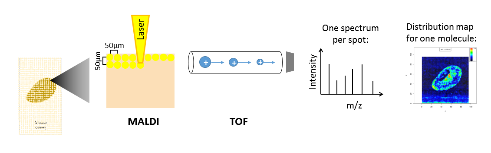
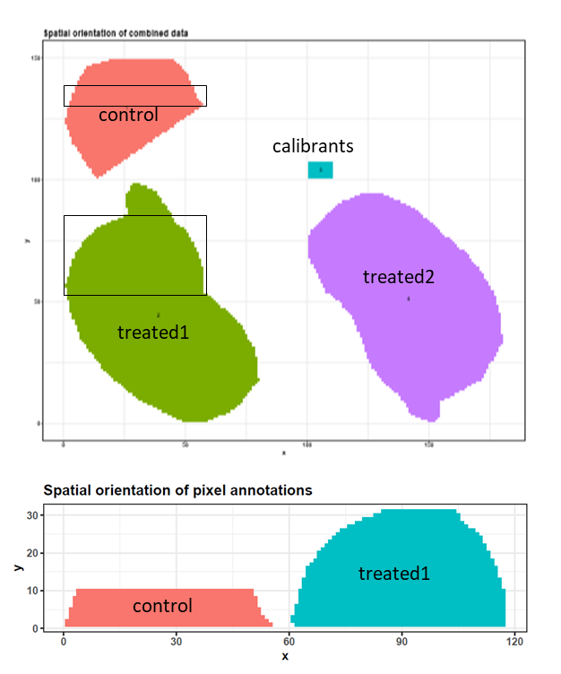
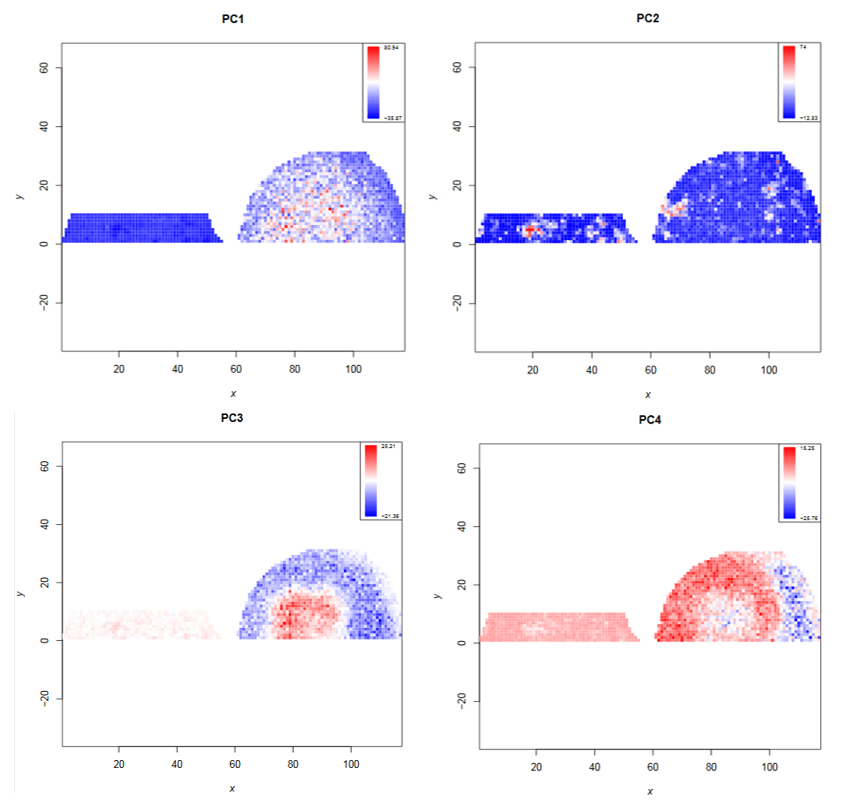
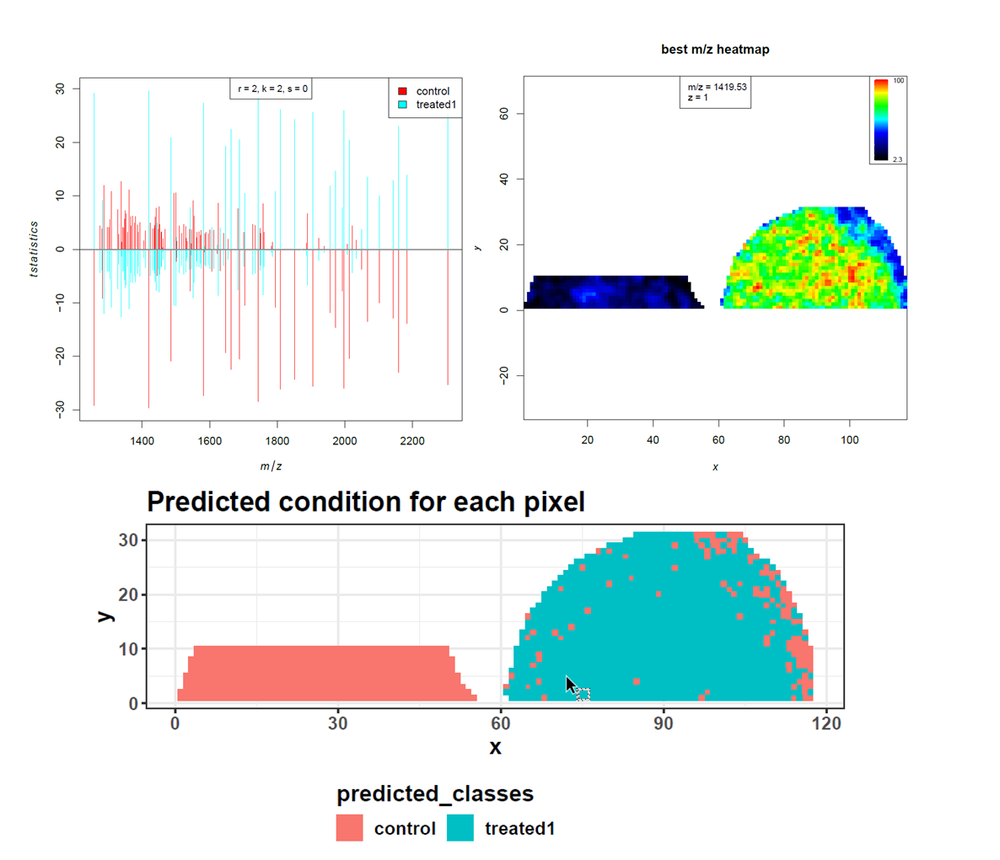
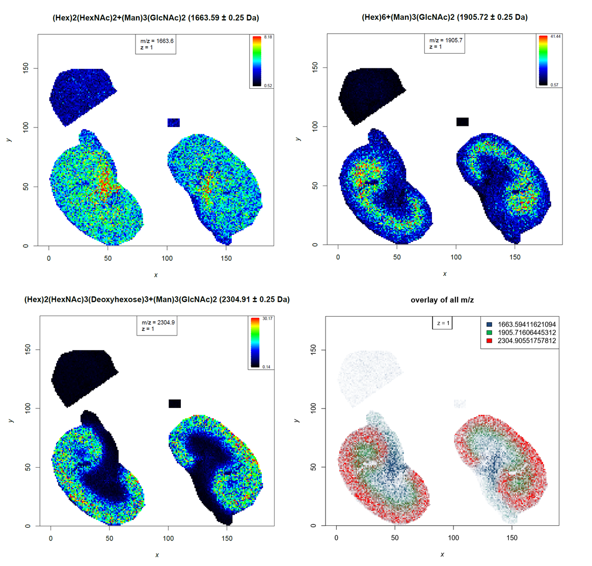
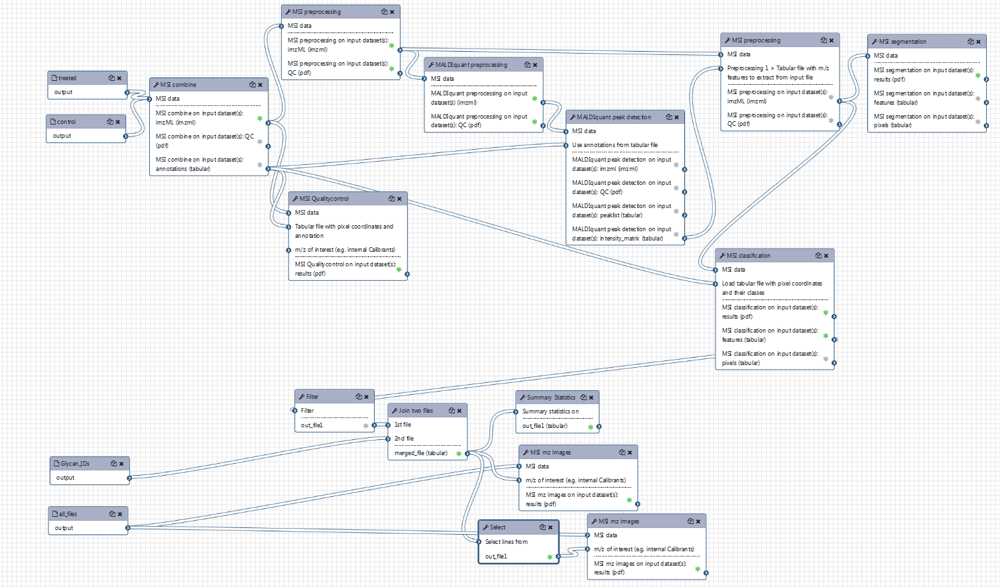

# Introduction


Mass spectrometry imaging (MSI) is applied to measure the spatial distribution of hundreds of biomolecules in a sample. A mass spectrometer scans over the entire sample and collects a mass spectrum every 5-200 µm. This results in thousands of spots (or pixels) for each of which a mass spectrum is acquired. Each mass spectrum consists of hundreds of analytes that are measured by their mass-to-charge (m/z) ratio. For each analyte the peak intensity in the mass spectra of every pixel is known and can be set together to map the spatial distribution of the analyte in the sample.

The technique has a broad range of applications as it is able to measure many different kinds of analytes such as peptides, proteins, metabolites or chemical compounds in a large variety of samples such as cells, tissues and liquid biopsies. Application areas include pharmacokinetic studies, biomarker discovery, molecular pathology, forensic studies, plant research and material sciences. The strength of MSI is the simultaneous analysis of hundreds of analytes in an unbiased, untargeted, label-free, fast and affordable measurement while maintaining morphological information.

Depending on the analyte of interest and the application, different mass spectrometers are used. A mass spectrometer measures the analytes by ionizing, evaporating and sorting them by their mass-to-charge (m/z) ratio. Put simply, a mass spectrometer consists basically of three parts: an ionization source, a mass analyzer and a detector. The most common ionization sources for MSI are MALDI (Matrix Assisted Laser Desorption/Ionization), DESI (Desorption Electrospray Ionization) and SIMS (Secondary Ion Mass Spectrometry).



One common type of mass spectrometer for MSI is a MALDI Time-Of-Flight (MALDI-TOF) device. During MALDI ionization, a laser is fired onto the sample, which has been covered with a special matrix that absorbs the laser energy and transfers it to the analytes. This process vaporizes and ionizes the analytes. As they are now charged, they can be accelerated in an electric field towards the TOF tube. The time of flight through the tube to the detector is measured, which allows calculation of the mass over charge (m/z) of the analyte, as both mass and charge are correlated with time of flight. During measurement, complete mass spectra with hundreds of m/z - intensity pairs are acquired in thousands of sample plots, leading to large and complex datasets. Each mass spectrum is annotated with coordinates (x,y) that define its location in the sample. This allows visualization of the intensity distribution of each m/z feature in the sample as a heatmap.

Depending on the analyte of interest, the sample type and the mass spectrometer, the sample preparation steps as well as the properties of the acquired data vary. Human tissues are often stained with hematoxylin and hemalaun (H&E) after mass spectrometry imaging. This allows better visualization of tissue histology and can be used to compare the MSI heatmaps with the real morphology. The stained image of the tissue can also be used to define regions of interest that can be extracted from the MSI data and can be subjected to supervised statistical analysis.

As MSI measures only unfractionated molecules (MS1), identification of the resulting m/z features requires matching them to a list of known m/z features. The easiest approach is to match the MSI m/z features to existing databases such as UniProt for proteins or lipidmaps for lipids. More accurate identification is obtained by performing additional mass spectrometry experiments (either on the same or on a similar sample, e.g. adjacent slice from a tissue) that also measure the fragmented molecules (MS2) and thereby also allow accurate identification of isobaric molecules. This tandem mass spectrometry approach can either be done in situ directly on the sample or by transferring the sample to a tube and bringing it into solution for liquid-chromatography tandem mass spectrometry (LC-MS/MS).

In this tutorial we will determine and identify N-linked glycans by differential analysis of a control (untreated) murine kidney section and a section treated with PNGase F. The data analysis steps can be transferred to any other application that requires finding differential analytes, such as for biomarker discovery.


> <agenda-title></agenda-title>
>
> In this tutorial, we will cover:
>
> 1. TOC
> {:toc}
>
{: .agenda}

# N-linked glycans in murine kidney dataset

In this tutorial we will use the [murine kidney N-glycan dataset](https://doi.org/10.1016/j.dib.2018.08.186) generated in the lab of Peter Hoffmann (Adelaide, Australia). N-linked glycans are carbohydrates (consisting of several sugar molecules) that are attached as a post-translational modification to the carboxamide side chain of an asparagine residue of a protein. Changes in N-linked glycans have been observed in several diseases. The Hoffmann lab acquired the presented dataset to show that their automated sample preparation method for N-glycan MALDI imaging successfully analyses N-glycans from formalin-fixed paraffin-embedded murine kidney tissue ([Gustafsson et al.](https://doi.org/10.1007/s00216-014-8293-7)). The datasets generated in this study were made publicly available via the [PRIDE Archive](https://www.ebi.ac.uk/pride/archive/projects/PXD009808).

Three 6 µm sections of formalin-fixed paraffin-embedded murine kidney tissue were prepared for MALDI imaging. To release N-linked glycans from the proteins, PNGase F was printed onto two kidney sections. In the third kidney section, one area was printed with buffer to serve as a control, and another was covered with N-glycan calibrants [Figure 4a-c](https://media.springernature.com/original/springer-static/image/art%3A10.1007%2Fs00216-014-8293-7/MediaObjects/216_2014_8293_Fig4_HTML.gif). 2,5-DHB matrix was sprayed onto the tissue sections and MALDI imaging was performed with 100 µm intervals using a MALDI-TOF/TOF instrument.

To make computation times feasible for this training, we reduced all datasets to a m/z range of 1250 – 2310 and resampled the m/z values with a step size of 0.1. The main part of the training will be performed with the control and one PNGase F treated kidney file, which were both restricted to representative pixels (Figure 2). To test the results on the complete dataset we also provide a file in which all four (m/z reduced and resampled) files (control, calibrants, treated kidney 1 and treated kidney 2) are combined and TIC-normalized. All size-reduced training datasets are available via [Zenodo](https://zenodo.org/record/2628280). We will combine the cropped control and the cropped treated1 file and perform similar steps to those described by [Gustafsson et al.](https://doi.org/10.1007/s00216-014-8293-7). These steps include combining files, preprocessing, unsupervised and supervised analysis, identification of N-glycans and generation of analyte distribution heatmaps.




## Get data

> <hands-on-title>Data upload</hands-on-title>
>
> 1. Create a new history and give it a name.
>
>    
>
> 2. Import the files from [Zenodo](https://zenodo.org/record/2628280). Upload all three datasets (one by one) to Galaxy via the **composite** option and rename them to 'control', 'treated1' and 'all_files'.
>    ```
>    https://zenodo.org/record/2628280/files/conrol.imzml
>    https://zenodo.org/record/2628280/files/control.ibd
>    https://zenodo.org/record/2628280/files/treated1.imzml
>    https://zenodo.org/record/2628280/files/treated1.ibd
>    https://zenodo.org/record/2628280/files/all_files.imzml
>    https://zenodo.org/record/2628280/files/all_files.ibd
>    ```
>
> 3. Paste the link of the tabular file with the N-glycan identities into the regular upload and rename it to 'Glycan IDs':
>    ```
>    https://zenodo.org/record/2628280/files/Glycan_IDs.tabular
>    ```
>
> 4. Create a tabular file with the three glycan calibrants that were used in the study and rename it to 'calibrants':
>    ```
>    M+Na+    composition
>    1257.4225    Man5GlcNAc2
>    1542.5551    Man3GlcNAc5
>    2393.8457    Man3Gal4GlcNAc6
>    ```
>
> 5. Add a tag to each imzML file ('control', 'treated1' and 'all_files') and to the tabular file ('Glycans'):
>
>    
>
{: .hands_on}

# Preparing the files for statistical analysis

## Combining control and treated1 files

> <hands-on-title>Combining files</hands-on-title>
>
> 1. **MSI combine**  with the following parameters:
>    -  *"MSI data"*: `control` (uploaded dataset) and `treated1` (uploaded dataset)
>    - *"Output format"*: `imzML`
>
>    > <comment-title>on the combine tool</comment-title>
>    >
>    > Two combining options are available: 'Automatic combination' combines the selected files into a grid with 5 pixel space between them. The order of the files in the history determines their orientation in the combined file and the file name is used to annotate the corresponding pixels. For custom orientation of the files the option 'shift xy coordinates with a tabular file' can be applied. For now, the **MSI combine**  only allows combining files with the same m/z axis. Different m/z axes can be adjusted by filtering for the common m/z range and then binning with the same bin size (**MSI filtering**  and **MSI preprocessing** .
>    {: .comment}
>
{: .hands_on}

## Exploring the combined file

To get an overview of the combined dataset we will use the **MSI Qualitycontrol** . We will use the annotation file that was generated by the **MSI combine**  to inform the **MSI Qualitycontrol**  which spectra belong to which subfile - this will lead to several extra figures where the data properties for both subfiles are plotted separately.

> <hands-on-title>Quality control with spectrum annotations</hands-on-title>
>
> 1. **MSI Qualitycontrol**  with the following parameters:
>    -  *"MSI data"*: `combined imzML` (output of **MSI combine** )
>    - *"Use pixel annotation from tabular file for QC plots"*: `use pixel annotation from a tabular file`
>        -  *"Tabular file with pixel coordinates and annotation"*: `combined annotations` (output of **MSI combine** )
>        - *"Column with x values"*: `Column: 1`
>        - *"Column with y values"*: `Column: 2`
>        - *"Column with pixel annotations"*: `Column: 3`
>        - *"Tabular file contains a header line"*: `Yes`
>    -  *"m/z of interest (e.g. internal Calibrants)"*: `calibrants` (uploaded dataset)
>    - *"Column with m/z values"*: `column:1`
>    - *"Column with name of m/z values"*: `column:2`
>    - *"Tabular file contains a header line"*: `Yes`
>    - *"PCA with 2 components"*: `Yes`
>
{: .hands_on}


> <question-title></question-title>
>
> 1. How many m/z values does the combined dataset contain?
> 2. How many spectra does the combined dataset contain?
> 3. How many input calibrants were valid?
> 4. Which of the two subfiles shows higher overall intensities?
>
> > <solution-title></solution-title>
> >
> > 1. 10581
> > 2. 1935
> > 3. Two calibrants are valid, which means that they lie in the (cropped) m/z range of our files.
> > 4. Several plots show that the treated subfile has higher intensities than the control subfile.
> >
> {: .solution}
>
{: .question}

The quality report gives a broad overview of the properties of both files. The pixel order seems to be random and does not correspond to the measurement in the MALDI. This means that the plots where the 'spectra index' is plotted on the x-axis do not represent the acquisition process. While the PNGase F treated kidney file shows higher intensities in several plots (e.g. median intensity per spectrum and intensity boxplots), the number of peaks is similar in both subfiles. The most abundant m/z feature plot of the treated kidney roughly corresponds to the morphology of the kidney while in the control file there are no visible kidney structures. The first principal componant in the PCA analysis roughly differentiates the spectra of the two subfiles which is a good sign for finding differences in the treated vs. control kidney files. For the following preprocessing steps, it is important to know the rough number of data points that one peak consists of. From page 27 on, the average mass spectra of the two glycan calibrants are shown. Due to our harsh resampling to 0.1 m/z, the calibrant 1257.4225 (Man5GlcNAc2) shows quite an angular peak shape. The complete peak consists of about 6 data points, which corresponds to a width of 0.5 m/z. On page 28 the average spectrum for each subfile is plotted, showing a nice peak in the treated subfile and only basal intensity in the control subfile. Page 29 and 30 show the average mass spectra for the 1542.5551 (Man3GlcNAc5) calibrant. The intensities of this calibrant are relatively low and only slightly higher in the treated than in the control subfile. Furthermore, the split up peak shape is not useful for defining the peak width properly.

## Preprocessing of the combined file

Preprocessing of the MSI raw spectra is crucial to reduce experimental (electrical, chemical and mechanical) noise and variance within and between the datasets before statistical analysis. Depending on the ionization technique, the mass analyzer, the sample and the statistical analysis, different preprocessing steps have to be applied. Here, we will perform similar preprocessing steps to those described by [Gustafsson et al.](https://doi.org/10.1007/s00216-014-8293-7).

  1. **Intensity normalization**:
Signal intensities in MALDI datasets are affected by heterogeneous matrix spray or crystallization, salt and pH gradients and contamination of the ion source over time. Therefore intensity normalization is important to ensure spectra that were acquired at different positions of the sample are comparable. The most common method is the normalization to the total ion current (TIC). This means that each intensity value of a spectrum is divided by the sum of all intensities of the spectrum (equal to the total ion current, TIC). More information on normalization can be found in the publications by [Gibb and Strimmer](https://arxiv.org/pdf/1607.03180.pdf) and [Deininger et al.](https://link.springer.com/article/10.1007%2Fs00216-011-4929-z).

  2. **Spectra smoothing**:
Smoothing reduces noise in the spectra and thereby improves peak picking. Smoothing is an optional preprocessing step, especially for high resolution data. The critical parameter for smoothing is the window size. Larger window sizes lead to stronger smoothing, which not only reduces noise but also the intensities of real peaks. Therefore it is important to set the window size large enough to remove noise but small enough to preserve the peaks. We will use the 'gaussian' smoothing method that applies a weighted moving average filter and set the window size to 4 (resampling was done with 0.1, multiplied by 4 this gives a 0.4 m/z window which is slightly smaller than the complete peak width that we found to be roughly 0.5 m/z). The standard deviation is set to the default setting: window/4 = 1. As the smoothing changes the peak width, we will quickly examine the 1257.42 calibrant peak width afterwards and use the information to define the correct window sizes in further preprocessing steps.

  3. **Baseline removal**:
Especially for MALDI datasets it is common to perform a baseline subtraction to remove the background intensity that is generated by chemical noise. Baseline removal could also be performed before smoothing but as smoothing might slightly increase the baseline we perform the baseline removal afterwards. Similar to the smoothing step, the window size in which the noise is estimated is crucial. The window should be large enough to obtain a representative number of data points but small enough to avoid removing parts of the peaks as well. Here, the window is obtained by dividing the m/z range by the number of blocks. Recommended window sizes range from 1 - 5 m/z. We will divide the m/z axis into 500 blocks, giving a window size of about 2 m/z.


> <hands-on-title>Preprocessing part I</hands-on-title>
>
> 1. **MSI preprocessing**  with the following parameters:
>    -  *"MSI data"*: `combined imzML` (output of **MSI combine** )
>    - In *"Preprocessing"*:
>        - Click on *"Insert Preprocessing"*:
>        - In *"1: Preprocessing"*:
>            - *"Preprocessing methods"*: `Intensity Normalization (TIC)`
>       - Click on *"Insert Preprocessing"*:
>        - In *"2: Preprocessing"*:
>            - *"Preprocessing methods"*: `Peak smoothing`
>                - *"Smoothing method"*: `gaussian`
>                    - *"The standard deviation for the Gaussian kernel (window/sd)"*: `1`
>                - *"Window size"*: `4.0`
>        - In *"3: Preprocessing"*:
>            - *"Preprocessing methods"*: `Baseline Reduction`
>    - *"Output format"*: `imzML`
>
> 2. **MSI plot spectra**  with the following parameters:
>    -  *"MSI data"*: `processed imzML` (output of **MSI preprocessing** )
>    - *"Select if you want to plot the mass spectrum of a single pixel or the average spectrum of all pixels of a sample"*: `Average spectrum for each sample`
>        - *"Use pixel annotation from tabular file for spectra plots"*: `group pixels according to annotations`
>        -  *"Tabular file with pixel coordinates and annotation"*: `combined annotations` (output of **MSI combine** )
>        - *"Column with x values"*: `Column: 1`
>        - *"Column with y values"*: `Column: 2`
>        - *"Column with pixel annotations"*: `Column: 3`
>        - *"Tabular file contains a header line"*: `Yes`
>        - In *"Zoomed in plots with m/z min and m/z max to define the plot window"*:
>            - Click on *"Insert Zoomed in plots with m/z min and m/z max to define the plot window"*:
>            - In *"1: Zoomed in plots with m/z min and m/z max to define the plot window"*:
>                - *"lower m/z boundary for plotting window"*: `1257`
>                - *"upper m/z boundary for plotting window"*: `1259`
>
{: .hands_on}

The QC report of the **MSI preprocessing**  shows the changes during preprocessing for four random spectra. TIC normalization only changes the dimension of the y-axis. Smoothing decreases the peak height and thus the intensity values on the y-axis shrink as well. Baseline removal shifts the complete spectrum towards the bottom.

The **MSI plot spectra**  is a quick way to control peak shape after smoothing. The zoomed in spectrum of the 1257.42 calibrant peaks shows that the peaks become broader than before. Most of the underlying data points can be seen as angles of the peak. The peak width ranges from 1257.1 to 1257.9 m/z = 0.8 m/z width. We will set the following window sizes to 9 data points (half the window size of 4).

We can then continue with the second part of the preprocessing:

  1. **m/z alignment**:
Despite regular m/z calibration of the mass spectrometer, m/z values vary slightly during data acquisition. To make m/z features comparable between different spectra or samples, they need to have the same m/z value. Furthermore, if identification is desired the m/z values should also be as accurate as possible. For high resolution data, binning of the m/z axis is often sufficient to group similar m/z values to a common m/z bin. For TOF instruments, re-calibration of the m/z values is commonly applied with the help of known, ubiquitous analytes such as internal calibrants or matrix peaks. Unfortunately, no internal calibrants were applied and the DHB matrix peaks occur more frequently below 1000 m/z. Therefore, the m/z values are not re-calibrated with known analytes but instead aligned to the average picked mass spectrum to ensure that similar m/z features obtain the same m/z value. This common m/z value can still be slightly shifted from its correct position - this should be kept in mind for the identification step that we will perform later. m/z alignment or binning could also be done after peak picking, but as we will perform peak picking on the average spectrum it is important that the m/z shifts are already minimized. We will remove spectra in which less than 2 reference m/z were found by setting them to zero and then removing all empty spectra. To account for the m/z shifts we will export the processed imzML file, which means that each spectrum has its own m/z axis.

  2. **Peak picking and binning**:
The key step during preprocessing is peak detection as it reduces the dimensionality of the data and bases the following statistical analysis on potentially relevant peaks rather than on noise. A peak is a local maximum above a user-defined noise threshold. The higher the signal-to-noise ratio is set, the more true positive peaks are picked, but at the cost of lowered sensitivity. Therefore, we will set the signal-to-noise ratio to 5, which should remove most of the noise while keeping enough sensitivity. The window should ideally have about the size of the peak width (recalling we set half window size to 4). We will perform peak picking and monoisotopic picking on the average mass spectra of each subfile, which are again defined with the annotation tabular file. The removal of isotopic peaks reduces the number of m/z features of the dataset, which is not only beneficial for computation time but also for many statistical approaches that are hindered by highly correlating variables. To ensure comparability of the picked m/z features, binning of the m/z axis is performed.

  3. **Extracting peaks**:
The average peak picking has removed all spatial information and kept only mean intensity values for the two subfiles. Therefore, the 'peaks' function is used to retrieve the picked peaks from all pixels of the normalized, smoothed and baseline reduced dataset.

For further reading on preprocessing we recommend [Gibb and Strimmer](https://arxiv.org/pdf/1607.03180.pdf) and [Norris et al.](https://doi.org/10.1016/j.ijms.2006.10.005).

> <hands-on-title>Preprocessing part II</hands-on-title>
>
> 1. **MALDIquant preprocessing**  with the following parameters:
>    -  *"MSI data"*: `preprocessed imzML` (output of **MSI preprocessing** )
>    - In *"Method"*:
>        - In *"1: Method"*:
>            - *"Select a method"*: `Align spectra`
>                - *"Tolerance"*: `0.0002`
>                - *"Half window size"*: `4`
>                - *"Signal-to-noise-ratio"*: `3`
>                - *"Allow no matches"*: `Yes`
>                - *"Empty no matches"*: `Yes`
>                - *"Remove empty spectra"*: `Yes`
>                - *"minFrequency"*: `0.8`
>                - *"Export processed imzML"*: `Yes`
>
> 2. **MALDIquant peak detection**  with the following parameters:
>    -  *"MSI data"*: `MALDIquant preprocessing imzML` (output of **MALDIquant preprocessing** )
>    - *"Spectra annotations"*: `yes`
>        - *"Use annotations from tabular file"*: `combined annotations` (output of **MSI combine** )
>        - *"Column with x values"*: `Column: 1`
>        - *"Column with y values"*: `Column: 2`
>        - *"Column with pixel annotations"*: `Column: 3`
>        - *"File contains a header line"*: `Yes`
>    - In *"Method"*:
>        - In *"1: Method"*:
>            - *"Select a method"*: `Peak detection`
>                - *"Half window size"*: `4`
>                - *"Signal to noise"*: `5`
>                - *"Detect peaks on average mass spectra"*: `Yes`
>        - Click on *"Insert Method"*:
>        - In *"2: Method"*:
>            - *"Select a method"*: `Monoisotopic peaks`
>                - *"Minimal correlation"*: `0.4`
>                - *"Tolerance"*: `0.0002`
>                - *"Size"*: `2:5`
>        - Click on *"Insert Method"*:
>        - In *"3: Method"*:
>            - *"Select a method"*: `Binning`
>                - *"Tolerance"*: `0.0002`
>
> 3. **MSI preprocessing**  with the following parameters:
>    -  *"MSI data"*: `preprocessed imzML from first step` (output of **MSI preprocessing** )
>    - In *"Preprocessing"*:
>        - Click on *"Insert Preprocessing"*:
>        - In *"1: Preprocessing"*:
>            - *"Preprocessing methods"*: `Data reduction`
>                - *"Reduction method"*: `peaks`
>                - *"Tabular file with m/z features to extract from input file"*: `MALDIquant peak detection intensity matrix` (output of **MALDIquant peak detection** )
>                - *"Tabular file contains a header line"*: `Yes`
>    - *"Output format"*: `imzML`
>
{: .hands_on}

> <question-title></question-title>
>
> 1. How many m/z values are left after preprocessing?
> 2. What is the lowest m/z feature that is left after preprocessing?
>
> > <solution-title></solution-title>
> >
> > 1. 125 m/z features are left
> > 2. 1257.47 (min m/z)
> >
> {: .solution}
>
{: .question}

> <details-title>How to find good preprocessing parameters</details-title>
> Before starting with preprocessing it is important to know the properties of the data. Internal calibrants can help to estimate the quality of the data and to control the preprocessing steps. The **MSI Qualitycontrol**  shows the extent of a noise baseline, the level of noise in the mass spectra, intensity distributions and m/z accuracy as described in the ([Mass spectrometry imaging: Loading and exploring MSI data]({{site.baseurl}}/topics/proteomics/tutorials/mass-spectrometry-imaging-loading-exploring-data/tutorial.html)) tutorial. Most preprocessing steps are applied to single spectra and therefore allow optimization of the preprocessing steps on a small subset of the original dataset that can be obtained with the **MSI filtering** . To make sure that the preprocessing steps and parameters are chosen properly it is recommended to perform them step by step and check the outcome after every step. The **MSI Qualitycontrol** , the **MSI spectra plot** , and the **MSI mz images**  are helpful to track the changes during preprocessing. The first two tools are able to overlay MSI data with different annotations, making it possible to combine files before and after the preprocessing step, as done in step 1 and 2 of this tutorial, and compare the introduced changes directly. The usage of annotations in the **MSI spectra plot**  is explained in the tutorial [Mass spectrometry imaging: Examining the spatial distribution of analytes]({{ site.baseurl }}/topics/metabolomics/tutorials/msi-analyte-distribution/tutorial.html).
{: .details}

The QC table of the **MALDIquant preprocessing**  reveals that 19 spectra (pixel) were removed during the alignment. The empty spectra are visible in the QC file of **MALDIquant peak detection** . This QC furthermore shows the baseline in blue and the picked (monoisotopic) peaks in green. After peak extraction the mass spectra are not in profile mode anymore (one peak consists of many datapoints) but centroided (one peak is represented by one datapoint). Therefore, in further steps 'centroided input' must be set to 'Yes'.


# Statistical analysis and identification of N-glycans

## Unsupervised statistical analysis

Unsupervised analysis can be applied at any time to any dataset because no prior knowledge of the data is required. The clustering or segmentation algorithms (that perform unsupervised analysis) separate regions of the data that have the most distinct differences in their mass spectra. We will perform principal component analysis (PCA) with 4 clusters to visualize the largest differences in the dataset.

> <hands-on-title>Segmentation with PCA</hands-on-title>
>
> 1. **MSI segmentation**  with the following parameters:
>    -  *"MSI data"*: `preprocessed imzML (peaks)` (output of **MSI preprocessing** )
>    - *"Centroided input"*: `Yes`
>    - *"Select the tool for spatial clustering"*: `pca`
>        - *"The number of principal components to calculate"*: `4`
>    - In *"Colours for the plots"*:
>        - Click on *"Insert Colours for the plots"*:
>        - In *"1: Colours for the plots"*:
>            - *"Colours"*: `dark_blue`
>        - Click on *"Insert Colours for the plots"*:
>        - In *"2: Colours for the plots"*:
>            - *"Colours"*: `orange`
>        - Click on *"Insert Colours for the plots"*:
>        - In *"3: Colours for the plots"*:
>            - *"Colours"*: `green`
>        - Click on *"Insert Colours for the plots"*:
>        - In *"4: Colours for the plots"*:
>            - *"Colours"*: `red`
>
{: .hands_on}

> <question-title></question-title>
>
> 1. Which principal components correlate with the morphology of the kidney?
> 2. What are the approximate m/z values with the highest loadings for each of those principal components?
>
> > <solution-title></solution-title>
> >
> > 1. PC1, PC3 and PC4
> > 2. PC1: 1900; PC3: 1900; PC4: 2300 (from PCA plot)
> >
> {: .solution}
>
{: .question}



The PCA clustering reveals that the N-glycan profile is different in different kidney compartments. To find the m/z features that correspond to these compartments, the feature tabular file can further be analyzed by sorting the file for the principal components of interest. This reveals the discrete m/z values for the features with the highest loadings: PC1 and PC3: 1905.72, PC4: 2304.91. Later, we will visualize the morphological distribution of those features on the complete dataset.


## Supervised statistical analysis

Supervised analysis can only be performed if the regions of interest that should be compared are known. For this dataset we know which spectra were treated or not treated with PNGase F. With this information we can use the spatial shrunken centroids algorithm, which in addition to classification is able to find the m/z features that best distinguish each class ([Bemis et al.](https://doi.org/10.1074/mcp.O115.053918)). We expect those discriminating m/z features to be the N-linked glycans that were only released in the treated kidney section but not in the control section.

> <hands-on-title>Spatial shrunken centroids classification</hands-on-title>
>
> 1. **MSI classification**  with the following parameters:
>    -  *"MSI data"*: `preprocessed imzML (peaks)` (output of **MSI preprocessing** )
>    - *"Centroided input"*: `Yes`
>    - *"Analysis step to perform"*: `training`
>        -  *"Load tabular file with pixel coordinates and their classes"*: `combined annotations` (output of **MSI combine** )
>        - *"Column with x values"*: `Column: 1`
>        - *"Column with y values"*: `Column: 2`
>        - *"Column with response (condition) values"*: `Column: 3`
>        - *"Tabular files contain a header line"*: `Yes`
>        - *"Select the method for classification"*: `spatial shrunken centroids`
>            - *"Analysis step to perform"*: `spatial shrunken centroids analysis`
>            - *"The sparsity thresholding parameter by which to shrink the t-statistics (s)"*: `0`
>
{: .hands_on}




High accuracy, sensitivity and specificity indicate that the control and PNGase F treated kidney sections can be discriminated quite well. The prediction shows the location of the few misclassified spectra towards the border of the tissue. As our aim is not to build and test a classifier for accurate prediction, we move on to investigate the m/z features that were most discriminative for the two groups more deeply. Looking at the feature tabular file, we spot the 2 m/z features that had the highest loadings in the PCA, amongst the top features with the highest t-statistics. Furthermore, this list can be compared to the m/z features that were determined as potential N-linked glycans in [Gustafsson et al. Figure S6](https://static-content.springer.com/esm/art%3A10.1007%2Fs00216-014-8293-7/MediaObjects/216_2014_8293_MOESM1_ESM.pdf). We found nine out of twelve m/z features. Two m/z features were outside our cropped m/z range and could therefore not be found. The 1079.408 m/z feature is missing in our feature list.


## Identification of N-glycans

We filter the m/z feature output from the **MSI classification**  for an adjusted p-value below 0.05 and a positive t-statistic in the 'treated1' spectra to consider only the most discriminative features that are more abundant in the treated than in the control spectra. Those m/z features are potentially N-glycans that were released by PNGase F treatment from the kidney section but not from the control section. To verify that the m/z features are N-linked glycans and to elucidate their identity and structure [Gustafsson et al.](https://doi.org/10.1007/s00216-014-8293-7) performed an additional LC-MS/MS experiment on N-linked glycans released from another mouse kidney section. They identified [31 N-linked glycans](https://media.springernature.com/original/springer-static/image/art%3A10.1007%2Fs00216-014-8293-7/MediaObjects/216_2014_8293_Fig3_HTML.gif) and calculated the m/z for the sodium N-glycan ions which can be matched to the imaging m/z features. Protonated glycans do not ionize well, but sodium adducts are the best detected glycan form in positive mode mass spectrometry. We match the differential m/z features from the imaging experiment to the m/z features from the LC-MS/MS results with a tolerance of 300 ppm and keep all matches that occur within this distance. We then calculate the average ppm error for the matches.


> <hands-on-title>Identification of N-glycans</hands-on-title>
>
> 1. **Filter data on any column using simple expressions**  with the following parameters:
>    -  *"Filter"*: `classification features` (output of **MSI classification** )
>    - *"With following condition"*: `c5=="treated1" and c7>0 and c9<0.05`
>    - *"Number of header lines to skip"*: `1`
>
> 2. **Join two files on column allowing a small difference**  with the following parameters:
>    -  *"1st file"*: `Filter data` (output of **Filter** )
>    - *"Column to use from 1st file"*: `Column: 1`
>    -  *"2nd file"*: `Glycan IDs` (uploaded dataset)
>    - *"Column to use from 2nd file"*: `Column: 1`
>    - *"Does the input files contain a header line"*: `Yes`
>    - *"Add an addional column with the calculated distance."*: `Yes`
>    - *"Choose the mode of merging."*: `All matches within the defined distance`
>    - *"Choose the metrics of your distance"*: `Distance in ppm`
>    - *"Allowed distance between the two values that will trigger a merge"*: `300.0`
>
> 3. **Summary Statistics for any numerical column**   with the following parameters:
>    -  *"Summary statistics on"*: `Join two files` (output of **Join two files** )
>    - *"Column or expression"*: `c12`
>
{: .hands_on}

> <question-title></question-title>
>
> 1. How many m/z features are filtered by our criteria?
> 2. How many m/z features could be identified?
> 3. How many duplicated matches occured?
> 4. What was the average m/z error for the matching?
>
> > <solution-title></solution-title>
> >
> > 1. The filtered file has 32 lines minus one header line, i.e. 31 m/z features.
> > 2. 19 m/z features were identified.
> > 3. 0
> > 4. 28.98 ppm
> {: .solution}
>
{: .question}

31 m/z features of the imaging dataset have a p-value below 0.05 and are potentially N-linked glycans. To ensure the identity of those features, they were matched to the results of an additional LC-MS/MS experiment. This step allows us to identify 19 m/z features as N-linked glycans. 15 of those m/z features were also found and identified in the [original publication](https://doi.org/10.1007/s00216-014-8293-7), which means that we found 4 additional N-glycans: 1704.7, 1542.6, 2101.8 and 1955.7. Those are the 4 m/z features with the lowest t-statistic. One hint to their validity is their m/z error. The m/z errors of 5, 24, 32 and 64 ppm seem reasonable. The average m/z error was 28.98 ppm compared to 38.7 ppm in the original publication. Without resampling of the m/z axis (which was mainly done to speed up computation time) or with additional internal calibrants for m/z re-calibration this error would probably further decrease.
Next, we visually explore the abundance distribution for all identified N-glycans in the complete, TIC-normalized dataset (consisting of the subfiles: control, calibrant, treated1 and treated2).


## N-linked glycan distribution in the complete dataset

> <hands-on-title>Distribution images for the identified N-glycans</hands-on-title>
>
> 1. **MSI mz images**  with the following parameters:
>    -  *"MSI data"*: `all_files` (uploaded dataset)
>    -  *"m/z of interest"*: `Join two files` (output of **Join two files** )
>    - *"Column with m/z values"*: `Column: 1`
>    - *"Column with name of m/z values"*: `Column: 11`
>    - *"Tabular file contains a header line"*: `Yes`
>    - *"Contrast enhancement"*: `suppression`
{: .hands_on}

> <question-title></question-title>
>
> 1. Which N-linked glycans were used as calibrants?
>
> > <solution-title></solution-title>
> >
> > 1. (Hex)2+(Man)3(GlcNAc)2 (1257.5) and (HexNAc)3+(Man)3(GlcNAc)2 (1542.6) (higher intensity in the calibrant file)
> >
> {: .solution}
>
{: .question}

Despite the classification being done on a small part of the complete dataset, the discovered N-glycans are more abundant in both treated kidney sections than in the control and calibrant regions. The four additional N-glycans that we could identify are more abundant in the treated kidney than in the control files, but compared to the other N-glycans their intensities are lower.


## N-linked glycans with a distinct localization to kidney compartments

During PCA analysis we found N-glycans that are localized in specific kidney compartments. We will filter the identified N-glycan file for the specific m/z features to plot their distribution to different compartments as overlay image.

> <comment-title>Regular expressions to filter text</comment-title>
>
> Regular expressions are syntax that can be used to describe a certain 'text'. They are extremely helpful to filter any kind of text and are therefore utilized by several Galaxy tools. The tools help section provides more details about how to use regular expressions. Here, we want to filter for three m/z features, but we are unsure where the exact decimal places are. Therefore we filter only for the m/z feature without decimal places but include the point '.' to make sure that we do not get matches to any other numbers in the tabular file. As the point '.' has a special meaning in regular expressions, it is necessary to 'escape' it by using the backslash '\' - this allows searching for the point as well. For example '1663\\.' will filter for '1663.' in the text. The pipe '\|' separates alternate possibilities and allows the user to run the tool only once while filtering for three different m/z features.
{: .comment}

> <hands-on-title>Overlayed distribution image for 3 N-glycans</hands-on-title>
>
> 1. **Select lines that match an expression**  with the following parameters:
>    -  *"Select lines from"*: `Join two files` (output of **Join two files** )
>    - *"the pattern"*: `(1663\.)|(1905\.)|(2304\.)`
>
> 2. **MSI mz images**  with the following parameters:
>    -  *"MSI data"*: `all_files` (uploaded dataset)
>    -  *"m/z of interest"*: `Select on data` (output of **Select** )
>    - *"Column with m/z values"*: `Column: 1`
>    - *"Column with name of m/z values"*: `Column: 11`
>    - *"Contrast enhancement"*: `suppression`
>    - *"Overlay image"*: `yes`
>        - In *"Colours for the plots"*:
>            - Click on *"Insert Colours for the plots"*:
>            - In *"1: Colours for the plots"*:
>                - *"Colours"*: `dark_blue`
>            - Click on *"Insert Colours for the plots"*:
>            - In *"2: Colours for the plots"*:
>                - *"Colours"*: `green`
>            - Click on *"Insert Colours for the plots"*:
>            - In *"3: Colours for the plots"*:
>                - *"Colours"*: `red`
{: .hands_on}




# Conclusion

This tutorial covered combining datasets, data preprocessing and supervised as well as unsupervised statistical analysis.




