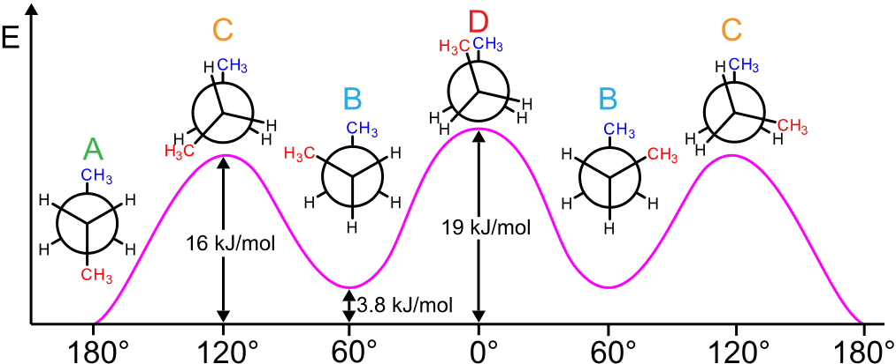

Mass spectrometry (MS) is a powerful analytical technique used in many fields, including proteomics, metabolomics, drug discovery and many more areas relying on compounds identification. Even though nowadays MS is a standard and popular method, there are still compounds which lack experimental spectra. In those cases, predicting mass spectra from the chemical structure can reveal useful structural information, help in compound identification and expand the spectral databases, improving the accuracy and efficiency of database search. [, ]. 
There have been several methods developed to predict mass spectra, which can be classified as either first-principles physical-based simulation or data-driven statistical methods []. To the first category we can assign purely statistical theories (quasi-equilibrium theory (QET) or Rice–Ramsperger–Kassel–Marcus (RRKM) theories) [], as well as QCEIMS [] and semiempirical GFNn-xTB [] which use Born–Oppenheimer molecular dynamics (MD) combined with fragmentation pathways. Data-driven statistical methods reach back to 1960s when DENDRAL project was started by early AI scientists [] – it applied rule-based heuristic programming. More recently, CFM-ID has been introduced [, , , , ], which uses rule-based fragmentation and employs machine learning methods. Current advancements in machine learning led to recent work using deep neural networks that allow predicting spectra from molecular graphs or fingerprints [].

> <agenda-title></agenda-title>
>
> In this tutorial, we will cover:
>
> 1. TOC
> {:toc}
>
{: .agenda}

You will be able to check out how QCxMS works in practice since we are going to use Galaxy tool suite based on this method [, , ]. Beforehand, we will generate conformers of the query molecule with [RDKit](http://www.rdkit.org) and we will use xTB for molecular optimisation []. 
But first things first, let’s get some toy data to play with and crack on! 

> <question-title></question-title>
>
> What does QCEIMS stand for?
>
>   > <tip-title>Hint</tip-title>
>   > With a little knowledge of chemistry, you’ll be able to work it out yourself!
>   >
>   > Look at the acronym in the following way: **QC-EI-MS**.
>   {: .tip}
> > <solution-title></solution-title>
> >
> > QC = quantum chemical 
> >
> > EI = electron ionisation
> >
> > MS = mass spectra
> >
> > Hence QCEIMS = quantum-chemical electron ionisation mass spectra
> >
> {: .solution}
>
{: .question}

> <details-title>What is QCxMS?</details-title>
> QCxMS is a successor of QCEIMS, where the *EI* part is replaced by *x* to take into account other MS methods and improve the applicability of the program. In QCEIMS, *EI* stands for *electron ionisation*, while in QCxMS, *x* refers to *EI* or *CID (collision-induced dissociation)* []. 
{: .details}

 


# Importing data and pre-processing

In this tutorial, we start from molecule’s SMILES, but then we convert it to SDF, so if you already have SDF files to work with, simply jump in the relevant place in the workflow and carry on from there. 
We will start with a table with the first column being molecule names and the second one – corresponding SMILES. 

<!---
consider the figure with SMILES and the corresponding structure
-->


> <details-title>What is SMILES?</details-title>
>
> SMILES (.smi) - the simplified molecular-input line-entry system (SMILES) is a specification in the form of a line notation for describing the structure of chemical species using short ASCII strings. A linear text format which can describe the connectivity and chirality of a molecule [].
>
{: .details}

## Upload data onto Galaxy

In this tutorial, we will work on two simple molecules – ethanol (C<sub>2</sub>H<sub>5</sub> OH) and ethylene (C<sub>2</sub>H<sub>4</sub>). Of course, you might choose any molecule that you want, but be aware that the more complex structure you choose, the more time it will take to complete the analysis since it involves generating conformers, semiempirical methods and molecular optimisation.
You have three options for uploading the data. The first two - importing via history and Zenodo link will give a file specific to this tutorial, while the last one – “Paste data uploader" gives you more flexibility in terms of the compounds you would like to test with this workflow. 

> <hands-on-title>Option 1: Data upload - Import history</hands-on-title>
>
> 1. You can simply import [this history](https://usegalaxy.eu/u/j.jakiela/h/input-file-end-to-end-ei-mass-spectra-prediction-workflow-using-qcxms) with the input table. 
>
>    
>
> 2. **Rename**  the history to your name of choice.
>
{: .hands_on}

><hands-on-title>Option 2: Data upload - Add to history via Zenodo</hands-on-title>
>
> 1. Create a new history for this tutorial
> 2. Import the input table from [Zenodo]({{ page.zenodo_link }})
>
>    ```
>    https://zenodo.org/records/13259853/files/qcxms_prediction_input.tabular
>    ```
>
>    
>
{: .hands_on}

> <hands-on-title> Option 3: Data Upload  - paste data </hands-on-title>
> 
> 1. Create a new history for this tutorial
> 2. 
> * Click  **Upload Data** at the top of the tool panel
> 
> * Select  **Paste/Fetch Data** at the bottom
> 
> * Paste the contents into the text field, separated by space. First, enter the name of the molecule, then its SMILES. Please note that we are not using headers here. For this tutorial, we’ll use the example of ethanol and ethylene, but feel free to use your own examples. 
> 
> ```
> ethanol CCO
> ethylene C=C
> ```
> 
> * Change **Type** from "Auto-detect" to `tabular`
> 
> * Find the gear symbol (), deselect any ticked options and select only () **Convert spaces to tabs**
> 
> * Press **Start** and **Close** the window
>
> 3. You can then rename the dataset as you wish.
> 4. Check that the datatype is `tabular`.
>
>    
>
{: .hands_on}

## Input pre-processing

Once your dataset is uploaded, we can do some simple pre-processing to prepare the file for downstream analysis. Let’s start with ‘cutting’ the table into two columns – one with SMILES, the other with the molecule name – and then separating each entry to create a dataset collection, followed by parsing out the text information. 

> <hands-on-title> Cutting out name column </hands-on-title>
>
>  with the following parameters:
>    -  *"File to cut"*: the tabular file in your history with the compound name and SMILES
>    - *"Operation"*: `Keep`
>    - *"Cut by"*: `fields`
>    - *"Delimited by"*: `Tab`
>    - *"Is there a header for the data’s columns"*: `No`
>    - *"List of Fields"*: `1`
>
{: .hands_on}

> <hands-on-title> Creating dataset collection (molecule name) </hands-on-title>
>
>  with the following parameters:
>    -  *"Select the file type to split"*: `Tabular`
>    - *"Tabular file to split"*: ``
>    - *"Number of header lines to transfer to new files"*: `0`
>    - *"Split by row or by a column?"*: `By row`
>    - *"Specify number of output files or number of records per file?"*: `Number of records per file (‘chunk mode’)`
>    - *"Chunk size"*: `1`
>    - *"Base name for new files in collection"*: `split_file`
>    - *"Method to allocate records to new files"*: `Maintain record order`
>
{: .hands_on}

> <hands-on-title> Parsing out name info </hands-on-title>
>
>   with the following parameters:
>    -  *"Input file containing parameter to parse out of"*: 
>    - *"Select type of parameter to parse"*: `Text`
>    - *"Remove newlines ?"*:   `Yes`
>
{: .hands_on}


We will repeat the first two steps, but processing SMILES this time. 


> <hands-on-title> Cutting out SMILES column </hands-on-title>
>
>   with the following parameters:
>    -  *"File to cut"*: the tabular file in your history with the compound name and SMILES
>    - *"Operation"*: `Keep`
>    - *"Cut by"*: `fields`
>    - *"Delimited by"*: `Tab`
>    - *"Is there a header for the data’s columns"*: `No`
>    - *"List of Fields"*: `2`
>
{: .hands_on}


> <hands-on-title>  Creating dataset collection (SMILES) </hands-on-title>
>
>   with the following parameters:
>    -  *"Select the file type to split"*: `Tabular`
>    - *"Tabular file to split"*: ``
>    - *"Number of header lines to transfer to new files"*: `0`
>    - *"Split by row or by a column?"*: `By row`
>    - *"Specify number of output files or number of records per file?"*: `Number of records per file (‘chunk mode’)`
>    - *"Chunk size"*: `1`
>    - *"Base name for new files in collection"*: `split_file`
>    - *"Method to allocate records to new files"*: `Maintain record order`
>
{: .hands_on}

Now, onto format conversion. Let’s convert our SMILES to SDF (Structure Data File), appending the molecule’s name that we have already extracted. 

> <hands-on-title> Convert SMILES to SDF </hands-on-title>
>
>  with the following parameters:
>    -  *"Molecular input file"*: split from SMILES
>    -  *"Output format"*: `MDL MOL format (sdf, mol)`
>    - *"Append the specified text after each molecule title"*: parse parameter value from name column
>
{: .hands_on}

We now have two SDF files, each containing the coordinates of the atoms and the name of the investigated molecule. Let’s combine them to make the life easier and work on just one file. 

> <hands-on-title> Concatenating the files  </hands-on-title>
>
>  with the following parameters:
>    -  *"Datasets to concatenate"*: output from the previous step
>
{: .hands_on}

# 3D Conformer generation & optimization

## Generate conformers
The next step involves generating three-dimensional (3D) conformers for each molecule from the generated SDF. The number of conformers to generate can be specified as an input parameter, with a default value of 1 if not provided. This process is crucial for exploring the possible shapes and energies that a molecule can adopt. The output of this step is a file containing the generated 3D conformers.
> <details-title>What are conformers? </details-title>
> Conformers are different spatial arrangements of a molecule that result from rotations around single bonds. They have different potential energies and hence some are more favourable (local minima on the potential energy surface) than others. 

Image credit: [Keministi]( https://commons.wikimedia.org/wiki/File:Butane_conformations_and_relative_energies.svg), License: Creative Commons CC0 1.0. 
{: .details}


> <hands-on-title> Generate conformers </hands-on-title>
>
>   with the following parameters:
>    -  *"Input file"*: `output` (Input dataset)
>    - *"Number of conformers to generate"*: `{'id': 1, 'output_name': 'output'}`
>
{: .hands_on}

Once again format conversion! Now we will convert the generated conformers from the SDF format to Cartesian coordinate (XYZ) format. The XYZ format lists the atoms in a molecule and their respective 3D coordinates, which is a common format used in computational chemistry for further processing and analysis.

> <hands-on-title> Molecular Format Conversion </hands-on-title>
>
>  with the following parameters:
>    -  *"Molecular input file"*: `outfile` (output of **Generate conformers** )
>    - *"Output format"*: `XYZ cartesian coordinates format`
>    - *"Split multi-molecule files into a collection"*:  `Yes`
>    - *"Add hydrogens appropriate for pH"*: `7.0`
>
{: .hands_on}


## Molecular optimization

As shown in the image in the  Details box, different conformers have different energies. Therefore, our next step will optimize the geometry of the molecules to find the lowest energy conformation. We will perform semi-empirical optimization on the molecules using the [Extended Tight-Binding (xTB)](https://github.com/grimme-lab/xtb) method. The level of optimization accuracy to be used can be specified as an input parameter, *"Optimization Levels"*. The default quantum chemical method is GFN2-xTB.

> <hands-on-title> Molecular optimisation with xTB </hands-on-title>
>
>  with the following parameters:
>    -  *"Atomic coordinates file"*: `file_outputs` (output of **Compound conversion** )
>    - *"Optimization Levels"*: ``
>
{: .hands_on}

# QCxMS Spectra Prediction 

## Neutral and production runs

Finally, let’s predict the spectra for our molecules. As mentioned, we will use [QCxMS](https://github.com/qcxms/QCxMS) for this purpose. First, we need to prepare the necessary input files for the QCxMS production runs. These files are required for running the QCxMS simulations, which will predict the mass spectra of the molecules. This step typically formats the optimized molecular data into a format that can be used for the production simulations. 


> <hands-on-title> QCxMS neutral run </hands-on-title>
>
>   with the following parameters:
>    -  *"Molecule 3D structure [.xyz]"*: `output` (output of **xtb molecular optimization** )
>    - *"QC Method"*: ` Specifies the quantum chemical method to use (string, options: GFN1-xTB or GFN2-xTB).`
>
{: .hands_on}

The outputs of the above step are as follows:
-	.in output: Input file for the QCxMS production run (File).
-	.start output: Start file for the QCxMS production run (File).
-	.xyz output: Cartesian coordinate file for the QCxMS production run (File).

We can now use those files as input for the next tool which calculates the mass spectra for each molecule using QCxMS (Quantum Chemistry and Mass Spectrometry). This simulation generates .res files, which contain the raw results of the mass spectra calculations. These results are essential for predicting how the molecules will appear in mass spectrometry experiments.

> <hands-on-title> QCxMS production run </hands-on-title>
>
> 1.  with the following parameters:
>    -  *"in files [.in]"*: `coords1` (output of **QCxMS neutral run** )
>    -  *"start files [.start]"*: `coords2` (output of **QCxMS neutral run** )
>    -  *"xyz files [.xyz]"*: `coords3` (output of **QCxMS neutral run** )
>
{: .hands_on}


## Filter failed datasets

It might be the case that some runs might have failed, therefore it is crucial to filter out any failed runs from the dataset to ensure only successful results are processed further. This step is important to maintain the integrity and quality of the data being analyzed in subsequent steps. The output is a file containing only the successful mass spectra results.

> <hands-on-title> Filter failed datasets </hands-on-title>
>
> 1.  with the following parameters:
>    -  *"Input Collection"*: `res_files` (output of **QCxMS production run** )
>
{: .hands_on}


## Get MSP spectra

The filtered collection contains .res files from the QCxMS production run. This final step converts the .res files into simulated mass spectra in MSP (Mass Spectrum Peak) file format. The MSP format is widely used for storing and sharing mass spectrometry data, enabling easy comparison and analysis of the results.

> <hands-on-title> QCxMS get MSP results </hands-on-title>
>
> 1.  with the following parameters:
>    -  *"Molecule 3D structure [.xyz]"*: `file_outputs` (output of **Compound conversion** )
>    -  *"res files [.res]"*: `output` (output of **Filter failed datasets** )
>
{: .hands_on}

> <details-title>MSP files </details-title>
> MSP (Mass Spectrum Peak) file is a text file structured according to the NIST MSSearch spectra format. MSP is one of the generally accepted formats for mass spectral libraries (or collections of unidentified spectra, so called spectral archives), and it is compatible with lots of spectra processing programmes (MS-DIAL, NIST MS Search, AMDIS, etc.). It can contain one or more mass spectra, these are split by an empty line. The individual spectra essentially consist of two sections: metadata (such as name, spectrum type, ion mode, retention time, and the number of m/z peaks) and peaks.
{: .details}

You can now  download the MSP file and open it in your spectra processing software for further investigation! 

To give you some insight into how well QCxMS can perform, below is the mass spectrum of ethanol resulting from our workflow compared with [experimental spectrum](https://hmdb.ca/spectra/c_ms/28442). Both spectra were compiled using an [online mass spectrum generator](https://www.sisweb.com/mstools/spectrum.htm) which requires only m/z values and intensities – so the values that you can get from our MSP file! As you can see, the predicted peaks nicely correspond to experimental ones. But be careful - there might be slight deviations for molecules with more structural complexity! 

 and predicted (lower panel) mass spectra of ethanol.")


# Conclusion
 Well done, you’ve simulated mass spectra! You might want to consult your results with the [key history](https://usegalaxy.eu/u/hechth/h/end-to-end-ei-mass-spectra-prediction-workflow-using-qcxms-1) or use [the workflow](https://usegalaxy.eu/u/j.jakiela/w/end-to-end-ei-mass-spectra-prediction-workflow-using-qcxms) associated with this tutorial. 
The prediction of mass spectra might be very useful, particularly for compounds that lack experimental data. Simulating the spectra can also save time and resources. This field has been developing quite rapidly, and recent advancements in new algorithms and packages have led to more and more accurate results. However, one cannot forget that this kind of software should be used to deepen our chemical understanding of the structures of studied compounds and not as a replacement for practical experiments. 
