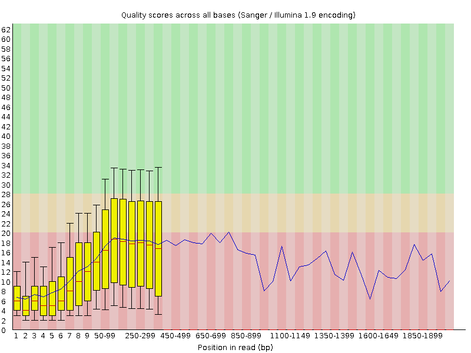

# Introduction
{:.no_toc}

<!-- This is a comment. -->

What is a microbiome? There are collections of small living creatures.
These small creatures are called bacteria and they are everywhere. In our gut,
in the soil, on vending machines, and even inside the beer. Most of these bacteria are
actually very good for us, but some can make us very ill.

Bacteria come in different shapes and sizes, but they have the same components.
One crucial component is the DNA, the blueprint of life. The DNA encodes the
shape and size and many other characteristics unique to a bacterial species. Because of
the encoding information the DNA can be used to identify what kind of bacteria
the DNA is from. Therefore, within a metagenomic sample, e.g. form soil, gut, or beer, one can
identify what kind of species are inside the sample.

In this tutorial, we will use data generated via the [BeerDEcoded project](https://streetscience.community/projects/beerdecoded/).

> ###  The BeerDEcoded project
>
> The BeerDEcoded project are workshops organized with and for schools and general
> audience, to introduce biology and genomic science. People will learn about
> DNA, sequencing technologies, bioinformatics, open science, how these technologies and concepts are
> applied and how they are impacting their daily life.
>
> The 1-2 days continuous (or divided over several days) workshops include the following steps:
> 1. Extract yeasts and their DNA from beer bottle,
> 2. Sequence the extracted DNA using a MinION sequencer to obtain the sequence of bases/nucleotides (A, T, C and G) for each DNA fragment in the sample,
> 3. Analyze the sequenced data in order to know which organisms this DNA is from
>
> 
>
{: .comment}

DNA of yeasts in a bottle of La Trappe beer has been extracted and sequenced using a
MinION to obtain sequences of DNA of the extracted yeasts. Now, for each obtained sequence, we would like to identify the yeast species to which it belongs, and thereby outline the diversity of organisms (the microbiome community) in the beer sample.

To get this information, we need to process the sequenced data in a few steps:
1. Check the quality of the data
2. Assign taxonomic label, i.e. assigh 'species' to the sequences
3. Visualize the species distribution

This type of data analysis requires running several bioinformatics tools and
usually requires a computer science background. [Galaxy](https://galaxyproject.org/) is
an open-source platform for data analysis that enables users to use bioinformatics
tools through its graphical web interface, accessible via any Web browser.

So, in this tutorial, we will use Galaxy to extract and visualize the community
of yeasts from a beer bottle.

> ### Agenda
>
> In this tutorial, we will cover:
>
> 1. TOC
> {:toc}
>
{: .agenda}


# Prepare Galaxy and data

First of all, this tutorial will get you hands on with some basic Galaxy tasks, including creating a history and importing data.

## Get familiar with Galaxy

> ###  Hands-on: Open Galaxy
>
> 1. Open your favorite browser (Chrome, Safari or Firefox as your browser, not Internet Explorer!)
> 2. Create a Galaxy account if you do not have one
>
>    
>
{: .hands_on}

The Galaxy homepage is divided into three panels:
* Tools on the left
* Viewing panel in the middle
* History of analysis and files on the right


The first time you use Galaxy, there will be no files in your history panel.

Any analysis should get its own Galaxy history. So let's start by creating a new one:

> ###  Hands-on: Prepare the Galaxy history
>
> 1. Create a new history for this analysis
>
>    
>
> 2. Rename the history
>
>    
>
{: .hands_on}

## Get data

Before we can begin any Galaxy analysis, we need to upload the input data: FASTQ files

> ###  Hands-on: Upload your dataset
>
> 1. Import the sequenced data
>
>    - Option 1 [](https://youtu.be/FFCDx1rMGAQ): Your own local data using **Upload Data** (recommended for 1-10 datasets).
>
>      
>
>    - Option 2: From Zenodo, an external server via URL
>
>      ```text
>      {{ page.zenodo_link }}
>      ```
>
>      
>
>    Your uploaded file is now in your current history. When the file has uploaded to Galaxy, it will turn green. But, what is this file?
>
> 2. Click on the  (eye) icon next to the dataset name to look at the file content
>
{: .hands_on}

The contents of the file will be displayed in the central Galaxy panel.

This file contains the sequences, also called **reads**, of DNA, *i.e.* succession of nucleotides, for all fragments from the yeasts in the beer, in FASTQ format.



# Data quality

## Assess data quality

Before starting to work on our data, it is necessary to assess its quality. This is an essential step if we aim to obtain a **meaningful downstream analysis**.

**FastQC** is one of the most widely used tools to **check the quality** of data generated by High Throughput Sequencing (HTS) technologies.

> ###  Hands-on: Quality check
>
> 1.  with the following parameters
>    -  *"Raw read data from your current history"*: `Reads`
>
> 2. Inspect the generated HTML file
>
{: .hands_on}

> ###  Questions
>
> Given the Basic Statistics table on the top,
> 1. How many sequences are in the FASTQ file?
> 2. How long are the sequences?
>
> > ###  Solution
> >
> > 1. There are 1876 sequences.
> > 2. The sequences range from 130 nucleotides to 2327 nucleotides. Not all sequences have then the same length.
> >
> {: .solution}
>
{: .question}

**FastQC** provides information on various parameters, such as the range of quality values across all bases at each position:



We can see that the quality of our sequencing data grows after the first few bases, stays around a score of 18, which is a relatively low value compared to other sequencing technologies, and then decreases again at the end of the sequences.

For more detailed information about the other plots in the FASTQC report, check out our [dedicated tutorial]().

## Improve the dataset quality

In order to improve the quality of our data, we will use two tools:
- **porechop** () to remove adapters that were added for sequencing and chimera (contaminant)
- **fastp** () to filter sequences with low quality scores (below 9)

> ###  Hands-on: Improve the dataset quality
>
> 1.  with the following parameters:
>    -  *"Input FASTA/FASTQ"*:  `Reads`
>    - *"Output format for the reads"*: `fastq`
>
> 2.  with the following parameters:
>    - *"Single-end or paired reads"*: `Single-end`
>    -  *"Dataset collection"*: output of **Porechop**
>    - In *"Adapter Trimming Options"*:
>        - *"Disable adapter trimming"*: `Yes`
>    - In *"Filter Options"*:
>        - In *"Quality filtering options"*:
>            - *"Qualified quality phred"*: `9`
>    - In *"Read Modification Options"*:
>        - *"PolyG tail trimming"*: `Disable polyG tail trimming`
>
> 3. Inspect the HTML report of **fastp** to see how the quality has been improved
{: .hands_on}

> ###  Questions
>
> 1. How many sequences are there before filtering? Is it the same number as in FASTQC report?
> 2. How many sequences are there after filtering? How many sequences have then been removed by filtering?
> 3. What is the mean length before filtering? And after filtering?
>
> > ###  Solution
> >
> > 1. There are 1,869 reads before filtering. The number is lower than in the FASTQC report. Some reads may have been discarded via Porechop
> > 2. There are 1,350 reads after filtering. So the filtering step has removed $$1869-1350 = 519$$ sequences.
> > 3. The mean length is 314 nucleotide before filtering and 316bp after filtering.
> {: .solution}
>
{: .question}

# Assign taxonomic classifications

One of the main aim in microbiome data analysis is to identify the organisms sequenced. For that we try to identify the taxon to which each individual reads belong.



Taxonomic assignment or classification is the process of assigning an **Operational Taxonomic Unit** (OTUs, that is, groups of related individuals / taxon) to sequences. To assign an OTU to a sequence it is compared against a database, but this comparison can be done in different ways, with different bioinformatics tools. Here we will use **Kraken2** ().

> ###  Kraken2 and the k-mer approach for taxonomy classification
>
> In the $$k$$-mer approach for taxonomy classification, we use a database containing the DNA sequences of genomes we know the taxonomy. The genome database is broken into pieces of length $$k$$ (called $$k$$-mers), usually 30bp.
>
> **Kraken** examines the $$k$$-mers within the query sequence, searches for them in the database, looks for where these are placed within the taxonomy tree inside the database and make the classification with the most probable position.  the maps $$k$$-mers to the lowest common ancestor (LCA) of all genomes known to contain the given $$k$$-mer.
>
>  of the genomes that contain that k-mer in a database. The taxa associated with the sequence's k-mers, as well as the taxa's ancestors, form a pruned subtree of the general taxonomy tree, which is used for classification. In the classification tree, each node has a weight equal to the number of k-mers in the sequence associated with the node's taxon. Each root-to-leaf (RTL) path in the classification tree is scored by adding all weights in the path, and the maximal RTL path in the classification tree is the classification path (nodes highlighted in yellow). The leaf of this classification path (the orange, leftmost leaf in the classification tree) is the classification used for the query sequence. Source: ")
>
{: .details}

<!-- Add something about database -->

> ###  Hands-on: Kraken2
>
> 1.  with the following parameters:
>    - *"Single or paired reads"*: `Single`
>        -  *"Input sequences"*: Output of **fastp**
>    - *"Print scientific names instead of just taxids"*: `Yes`
>    - In *"Create Report"*:
>        - *"Print a report with aggregrate counts/clade to file"*: `Yes`
>        - *"Format report output like Kraken 1's kraken-mpa-report"*: `Yes`
>    - *"Select a Kraken2 database"*: `Prebuilt Refseq indexes: PlusPF`
>
> 2. Inspect the report file
{: .hands_on}

The Kraken report in MPA format is a tabular file with 2 columns:

```
d__Eukaryota	756
d__Eukaryota|k__Metazoa	402
d__Eukaryota|k__Metazoa|p__Chordata	402
d__Eukaryota|k__Metazoa|p__Chordata|c__Mammalia	402
d__Eukaryota|k__Metazoa|p__Chordata|c__Mammalia|o__Primates	402
d__Eukaryota|k__Metazoa|p__Chordata|c__Mammalia|o__Primates|f__Hominidae	402
d__Eukaryota|k__Metazoa|p__Chordata|c__Mammalia|o__Primates|f__Hominidae|g__Homo	402
d__Eukaryota|k__Metazoa|p__Chordata|c__Mammalia|o__Primates|f__Hominidae|g__Homo|s__Homo sapiens	402
d__Eukaryota|k__Fungi	342
d__Eukaryota|k__Fungi|p__Ascomycota	341
d__Eukaryota|k__Fungi|p__Ascomycota|c__Saccharomycetes	336
...
```

1. The first column lists clades, ranging from taxonomic domains (Bacteria, Archaea, etc.) through species.

    The taxonomic level of each clade is prefixed to indicate its level:
    - Domain: `d__`
    - Kingdom: `k__`
    - Phylum: `p__`
    - Class: `c__`
    - Order: `o__`
    - Family: `f__`
    - Genus: `g__`
    - Species: `s__`

2. The second column gives the number of reads assigned to the clade rooted at that taxon


> ###  Questions
>
> 1. How many reads are assigned Homo sapiens?
> 2. What is the most found taxon?
> 3. Which fungi species are found?
>
> > ###  Solution
> >
> > 1. 402 reads are assigned to **Homo sapiens**
> > 2. Eukaryota is the most found taxon
> > 3. Saccharomyces cerevisiae, Saccharomyces paradoxus, Saccharomyces eubayanus, Kluyveromyces marxianus, Sugiyamaella lignohabitans
> >
> {: .solution}
>
{: .question}

# Visualize the community

Once we have assigned the corresponding taxa to the sequences, the next step is to properly visualize the data: visualize the diversity of taxons at different levels.

To do that, we will use the tool **Krona** (). But before that, we need to adjust the format of the data output from Kraken2.

> ###  Hands-on: Prepare dataset for Krona
>
> 1.  with the following parameters:
>    -  *"Input tabular dataset"*: output of **Kraken2** )
> 2.  with the following parameters:
>    -  *"File to process"*: `out_file` (output of **Reverse** )
>    - In *"Replacement"*:
>        -  *"Insert Replacement"*
>            - *"Find pattern"*: `\|`
>            - *"Replace with:"*: `\t`
{: .hands_on}

**Krona** creates an interactive report that allows hierarchical data (like taxonomy) to be explored with zooming, multi-layered pie charts. With this tool, we can easily visualize the composition of the microbiome communities and also compare how the populations of microorganisms are modified between different samples.

> ###  Hands-on: Krona pie chart
>
> 1.  with the following parameters:
>    - *"What is the type of your input data"*: `Tabular`
>        -  *"Input file"*:  output of **Replace Text** 
>
> 2. Inspect the generated file
{: .hands_on}

Let's take a look at the result.

<!--
<iframe id="krona" src="krona_all.html" frameBorder="0" width="100%" height="900px">  </iframe>

Add data interpretation and questions to understand the data

> ###  Questions
>
> 1.
>
> > ###  Solution
> >
> > 1.
> >
> {: .solution}
>
{: .question}

--->

# Conclusion
{:.no_toc}


## (Optional) Sharing your history

One of the most important features of Galaxy comes at the end of an analysis: sharing your histories with others so they can review them.

> ###  Hands-on: Share history and workflow
>
> 1. Click on the  (gear) symbol in the history panel
> 2. Select `Share or Publish`
> 3. Make your history accessible via a link
> 4. Copy the link
>
{: .hands_on}

> ###  The 3 ways to share in Galaxy
>
> 1. **Make accessible via Link**
>
>     This generates a link that you can give out to others. Anybody with this link will be able to view your history.
>
> 2. **Publish History**
>
>     This will not only create a link, but will also publish your history. This means your history will be listed under `Shared Data → Published Histories` in the top menu.
>
> 3. **Share with Individual Users**
>
>     This will share the history only with specific users on the Galaxy instance.
>
{: .comment}


