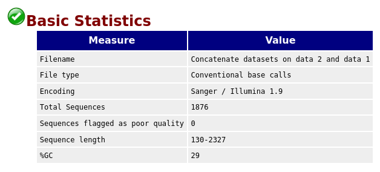
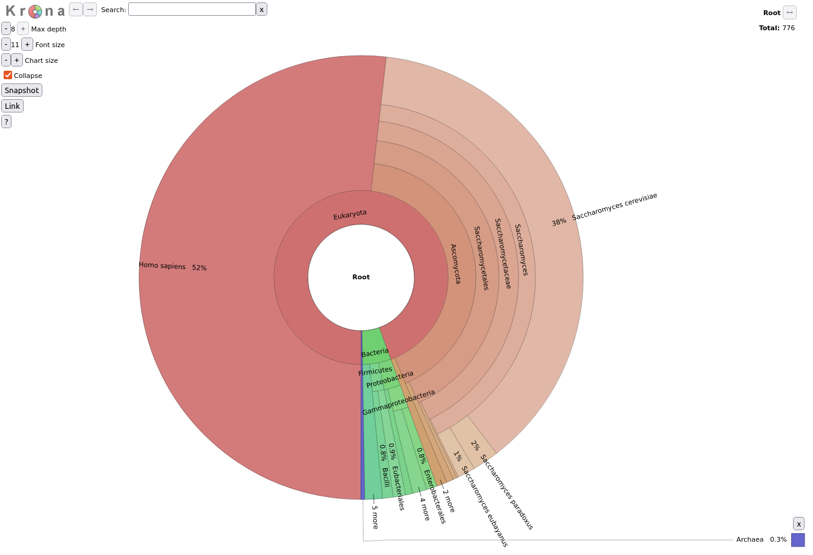

What is a microbiome? It is a collection of small living creatures.
These small creatures are called **micro-organisms** and they are **everywhere**. In our gut,
in the soil, on vending machines, and even inside the beer. Most of these micro-organisms are
actually very good for us, but some can make us very ill.

Micro-organisms come in different shapes and sizes, but they have the same components.
One crucial component is the **DNA**, the blueprint of life. The DNA encodes the
shape and size and many other characteristics unique to a species. Because DNA is so species-specific,
reading the DNA can be used to identify what kind of micro-organism
the it is from. Therefore, within a metagenomic specimen, *e.g.* a sample form soil, gut,
or beer, one can identify what kind of species are inside the sample.

In this tutorial, we will use data of beer microbiome generated via the
[BeerDEcoded project](https://streetscience.community/projects/beerdecoded/).

> <details-title>The BeerDEcoded project</details-title>
>
> The BeerDEcoded Project is a series of workshops organized with and for schools as well as the general
> audience, aiming to introduce biology and genomic science. People learn in an interactive way
> about DNA, sequencing technologies, bioinformatics, open science, how these technologies
> and concepts are applied and how they are impacting their daily life.
>
> Beer is alive and contains many microorganisms. It can be found in many places
> and there are many of them. It is a fun media to bring the people to the
> contact of molecular biology, data-analysis, and open science.
>
> A BeerDEcoded workshop includes the following steps:
> 1. Extract yeasts and their DNA from beer bottle,
> 2. Sequence the extracted DNA using a MinION sequencer to obtain the sequence of bases/nucleotides (A, T, C and G) for each DNA fragment in the sample,
> 3. Analyze the sequenced data in order to know which organisms this DNA is from
>
> 
>
{: .details}

> <comment-title>Beer microbiome</comment-title>
>
> Beer is alive! It contains microorganisms, in particular **yeasts**.
>
> Indeed, grain and water create a sugary liquid (called wort). The beer brewer
> adds yeasts to it. By eating the sugar, yeast creates alcohol,
> and other compounds (esters, phenols, etc.) that give beer its particular
> flavor.
>
> Yeasts are microorganisms, more precisely **unicellular fungi**. The majority
> of beers use a yeast genus called ***Saccharomyces***, which in Greek means
> "sugar fungus". Within that genus, two specific species of *Saccharomyces*
> are the most commonly used:
>
> - ***Saccharomyces cerevisiae***: a top-fermenting (*i.e.* yeast which rise
> up to the top of the beer as it metabolizes sugars, delivering alcohol as a by-product),
> ale yeast responsible for a huge range of beer styles like witbiers, stouts, ambers,
> tripels, saisons, IPAs, and many more. It is most likely the yeast that the early brewers were
> inadvertently brewing with over 3,000 years ago.
> - ***Saccharomyces pastorianus***: a bottom-fermenting (*i.e.* it sits on the
> bottom of the tank as it ferments) lager yeast, responsible for beer styles
> like Pilsners, lagers, märzens, bocks, and more. This yeast was originally
> found, and cultivated, by Bavarian brewers a little over 200 years ago. It is
> the most commonly used yeast in terms of the raw amount of beer produced around the world.
>
> Since yeast is all around us, we can actually brew spontaneously
> fermented beer by using wild yeasts and souring microbiota floating through the air.
>
{: .comment}

During one BeerDEcoded workshop, we extracted yeasts out of a bottle of
[Chimay](https://en.wikipedia.org/wiki/Chimay_Brewery). We then
extracted the DNA of these yeasts and sequenced it using a MinION to obtain the DNA
sequences. Now, we would like to **identify the yeast species** sequenced there, and
thereby **outline the diversity of microorganisms** (the microbiome community) in the beer
sample.

To get this information, we need to process the sequenced data in a few steps:
1. Check the quality of the data
2. Assign a taxonomic label, *i.e.* assign 'species' to each sequence
3. Visualize the distribution of the different species

This type of data analysis requires running several bioinformatics tools and
usually requires a computer science background. [Galaxy](https://galaxyproject.org/) is
an open-source platform for data analysis that enables anyone to use bioinformatics
tools through its graphical web interface, accessible via any Web browser.

So, in this tutorial, we will use Galaxy to extract and visualize the community
of yeasts from a bottle of beer.

> <agenda-title></agenda-title>
>
> In this tutorial, we will cover:
>
> 1. TOC
> {:toc}
>
{: .agenda}


# Prepare Galaxy and data

First of all, this tutorial will get you hands on with some basic Galaxy tasks, including creating a history and importing data.

## Get familiar with Galaxy

> <hands-on-title>Open Galaxy</hands-on-title>
>
> 1. Open your favorite browser (Works on Chrome, Firefox, Safari but not Internet Explorer!)
> 2. Create a Galaxy account if you do not have one
>
>    
>
{: .hands_on}

The Galaxy homepage is divided into three panels:
* Tools on the left
* Viewing panel in the middle
* History of analysis and files on the right


The first time you use Galaxy, there will be no files in your history panel.

Any analysis should get its own Galaxy history. So let's start by creating a new one:

> <hands-on-title>Prepare the Galaxy history</hands-on-title>
>
> 1. Create a new history for this analysis
>
>    
>
> 2. Rename the history
>
>    
>
{: .hands_on}

## Get data

Before we can begin any Galaxy analysis, we need to upload the input data: FASTQ files

> <hands-on-title>Upload your dataset</hands-on-title>
>
> 1. Import the sequenced data including fastq in the name
>
>    - Option 1 [](https://youtu.be/FFCDx1rMGAQ): Your own local data using **Upload Data** (recommended for 1-10 datasets).
>
>      
>
>    - Option 2: From Zenodo, an external server, via URL
>
>      ```text
>      https://zenodo.org/record/7093173/files/ABJ044_c38189e89895cdde6770a18635db438c8a00641b.fastq
>      ```
>
>      
>
>    Your uploaded file is now in your current history. When the file is fully uploaded to Galaxy, it will turn green. But, what is this file?
>
> 2. Click on the  (eye) icon next to the dataset name to look at the file contents.
>
{: .hands_on}

The contents of the file will be displayed in the central Galaxy panel.

This file contains the sequences, also called **reads**, of DNA, *i.e.* succession of nucleotides, for all fragments from the yeasts in the beer, in FASTQ format.



# Data quality

## Assess data quality

Before starting to work on our data, it is necessary to assess its quality. This is an essential step if we aim to obtain a **meaningful downstream analysis**.

**FastQC** is one of the most widely used tools to **check the quality** of data generated by High Throughput Sequencing (HTS) technologies.

> <hands-on-title>Quality check</hands-on-title>
>
> 1.  with the following parameters
>    -  *"Raw read data from your current history"*: `Reads`
>
> 2. Inspect the generated HTML file
>
{: .hands_on}

> <question-title></question-title>
>
> Given the Basic Statistics table on the top of the page:
>
> 
>
> 1. How many sequences are in the FASTQ file?
> 2. How long are the sequences?
>
> > <solution-title></solution-title>
> >
> > 1. There are 1876 sequences.
> > 2. The sequences range from 130 nucleotides to 2327 nucleotides. Not all sequences have then the same length.
> >
> {: .solution}
>
{: .question}

**FastQC** provides information on various parameters, such as the range of quality values across all bases at each position:

. Y-axis: quality score, between 0 and 40 - the higher the score, the better the base call. For each position, a boxplot is drawn with: the median value, represented by the central red line;the inter-quartile range (25-75%), represented by the yellow box; the 10% and 90% values in the upper and lower whiskers; and the mean quality, represented by the blue line. The background of the graph divides the y-axis into very good quality scores (green), scores of reasonable quality (orange), and reads of poor quality (red).")

We can see that the quality of our sequencing data grows after the first few bases, stays around a score of 18 and then decreases again at the end of the sequences. MinION and Oxford Nanopore Technologies (ONT) are known to have a higher error rate compared to other sequencing techniques and platforms ().

For more detailed information about the other plots in the FASTQC report, check out our [dedicated tutorial]().

## Improve the dataset quality

In order to improve the quality of our data, we will use two tools:
- **porechop** () to remove adapters that were added for sequencing and chimera (contaminant)
- **fastp** () to filter sequences with low quality scores (below 10)

> <hands-on-title>Improve the dataset quality</hands-on-title>
>
> 1.  with the following parameters:
>    -  *"Input FASTA/FASTQ"*:  `Reads`
>    - *"Output format for the reads"*: `fastq`
>
> 2.  with the following parameters:
>    - *"Single-end or paired reads"*: `Single-end`
>      -  *"Input 1"*: output of **Porechop**
>      - In *"Adapter Trimming Options"*:
>        - *"Disable adapter trimming"*: `Yes`
>    - In *"Filter Options"*:
>        - In *"Quality filtering options"*:
>            - *"Qualified quality phred"*: `10`
>    - In *"Read Modification Options"*:
>        - *"PolyG tail trimming"*: `Disable polyG tail trimming`
>
> 3. Inspect the HTML report of **fastp** to see how the quality has been improved
{: .hands_on}

> <question-title></question-title>
>
> 1. How many sequences are there before filtering? Is it the same number as in FASTQC report?
> 2. How many sequences are there after filtering? How many sequences have then been removed by filtering?
> 3. What is the mean length before filtering? And after filtering?
>
> > <solution-title></solution-title>
> >
> > 1. There are 1,869 reads before filtering. The number is lower than in the FASTQC report. Some reads may have been discarded via Porechop
> > 2. There are 1,350 reads after filtering. So the filtering step has removed $$1869-1350 = 519$$ sequences.
> > 3. The mean length is 314 nucleotide before filtering and 316bp after filtering.
> {: .solution}
>
{: .question}

# Assign taxonomic classification

One of the main aims in microbiome data analysis is to identify the organisms sequenced. For that we try to **identify the taxon** to which each individual read belong.



> <question-title></question-title>
>
> 1. Which microorganisms do we expect to identify in our data?
> 2. What is the taxonomy of the main expected microorganism?
>
> > <solution-title></solution-title>
> >
> > 1. The sequences are supposed to be yeasts extracted from a bottle of beer. The majority of beers contain a yeast genus called ***Saccharomyces*** and 2 species in that genus: *Saccharomyces cerevisiae* (ale yeast) and *Saccharomyces pastorianus* (lager yeast). The used beer is an ale beer, so we expect to find ***Saccharomyces cerevisiae***. But other yeasts can also have been used and then found. We could also have some DNA left from other beer components, but also contaminations by other microorganisms and even human DNA from people who manipulated the beer or did the extraction.
> >
> >
> > 2. The main expected microorganism is ***Saccharomyces cerevisiae*** with its taxonomy:
> >
> >    Level | Classification
> >    --- | ---
> >    Domain | Eukaryota
> >    Kingdom | Fungi
> >    Phylum | Ascomycota
> >    Class | Saccharomycetes
> >    Order | Saccharomycetales
> >    Family | Saccharomycetaceae
> >    Genus | *Saccharomyces*
> >    Species | *S. cerevisiae*
> >
> {: .solution}
>
{: .question}

Taxonomic assignment or classification is the process of assigning an **Operational Taxonomic Unit** (OTUs, that is, groups of related individuals / taxon) to sequences. To assign an OTU to a sequence it is compared against a database, but this comparison can be done in different ways, with different bioinformatics tools. Here we will use **Kraken2** ().



> <hands-on-title>Kraken2</hands-on-title>
>
> 1.  with the following parameters:
>    - *"Single or paired reads"*: `Single`
>        -  *"Input sequences"*: Output of **fastp**
>    - *"Print scientific names instead of just taxids"*: `Yes`
>    - In *"Create Report"*:
>        - *"Print a report with aggregrate counts/clade to file"*: `Yes`
>    - *"Select a Kraken2 database"*: `Prebuilt Refseq indexes: PlusPF`
>
>      The database here contains reference sequences and taxonomies. We need to
>      be sure it contains yeasts, i.e. fungi.
>
> 2. Inspect the report file
{: .hands_on}

The Kraken report is a tabular files with one line per taxon and 6 columns or fields:

1. Percentage of fragments covered by the clade rooted at this taxon
2. Number of fragments covered by the clade rooted at this taxon
3. Number of fragments assigned directly to this taxon
4. A rank code, indicating
    - (U)nclassified
    - (R)oot
    - (D)omain
    - (K)ingdom
    - (P)hylum
    - (C)lass
    - (O)rder
    - (F)amily
    - (G)enus, or
    - (S)pecies

    Taxa that are not at any of these 10 ranks have a rank code that is formed by using the rank code of the closest ancestor rank with a number indicating the distance from that rank. E.g., `G2` is a rank code indicating a taxon is between genus and species and the grandparent taxon is at the genus rank.

5. NCBI taxonomic ID number
6. Indented scientific name


```
Column 1	Column 2	Column 3	Column 4	Column 5	Column 6
38.00 	513 	513 	U 	0 	unclassified
62.00 	837 	1 	R 	1 	root
61.93 	836 	27 	R1 	131567 	cellular organisms
56.00 	756 	3 	D 	2759 	Eukaryota
55.33 	747 	3 	D1 	33154 	Opisthokonta
29.78 	402 	0 	K 	33208 	Metazoa
29.78 	402 	0 	K1 	6072 	Eumetazoa
29.78 	402 	0 	K2 	33213 	Bilateria
29.78 	402 	0 	K3 	33511 	Deuterostomia
29.78 	402 	0 	P 	7711 	Chordata
29.78 	402 	0 	P1 	89593 	Craniata
29.78 	402 	0 	P2 	7742 	Vertebrata
29.78 	402 	0 	P3 	7776 	Gnathostomata
29.78 	402 	0 	P4 	117570 	Teleostomi
29.78 	402 	0 	P5 	117571 	Euteleostomi
29.78 	402 	0 	P6 	8287 	Sarcopterygii
29.78 	402 	0 	P7 	1338369 	Dipnotetrapodomorpha
29.78 	402 	0 	P8 	32523 	Tetrapoda
29.78 	402 	0 	P9 	32524 	Amniota
29.78 	402 	0 	C 	40674 	Mammalia 
```

> <question-title></question-title>
>
> 1. How many taxons have been identified?
> 2. How much reads have been classified?
> 3. Which domains were found and with how many reads?
> 4. How much reads have been assigned by fungi Kingdom?
>
> > <solution-title></solution-title>
> >
> > 1. The file contains 300 lines (*information visible when expanding the report dataset in the history panel*). So 300-2 = 298 taxons have been identified.
> >
> > 2. On the 1350 sequences in the input, 837 (62%) were classified (or identified as a taxon) and 513 unclassified (38%). *Information visible when expanding the report dataset in the history panel, and scrolling in the small box starting with "Loading database information" below the format information, but also on the top of the report.*
> >
> > 3. The domains are identified by a `D` in colum 4. 
> >
> >    To get the domains (or other taxonomic level), we can use  with the following parameters:
> >    -  *"Filter"*: report outpout of **Kraken2**
> >    - *"With following condition"*: `c4=='D'` 
> >
> >    The 3 domains were found:
> >    - Eukaryota with 756 (56%) reads assigned to it
> >    - Bacteria with 51 (3.78%) reads
> >    - Archaea with 2 (0.15%) reads
> >
> > 4. 342 (25.33%) reads are assigned to fungi.
> {: .solution}
>
{: .question}

Other taxons than yeast have been identified. They could be contamination or misidentification of reads. Indeed, many taxons have less than 5 reads assigned. We will filter these reads out to get a better view of the possible contaminations.

> <hands-on-title>Filter taxons with low assignements</hands-on-title>
>
> 1.  with the following parameters:
>    -  *"Filter"*: report outpout of **Kraken2**
>    - *"With following condition"*: `c2>5`
>
>      We want to keep only taxons with more than 5 reads assigned, *i.e.* the value in the 2nd column, is higher than 5.
>
> 2. Inspect the output
{: .hands_on}

> <question-title></question-title>
>
> 1. How many taxons have been removed? How many were kept?
> 2. What are the possible contaminations?
>
> > <solution-title></solution-title>
> > 1. 59 lines are now in the file so $$300 - 59 = 241$$ taxons have been removed because low assignment rates.
> >
> > 2. Most of the reads (402) were assigned to humans (*Homo sapiens*). This is likely a contamination either during the beer production or more likely during DNA extraction.
> >
> >    Bacteria were also found: Firmicutes, Proteobacteria and Bacteroidetes. But the identified taxons are not really precise (not below order level). So difficult to identify the possible source of contamination.
> {: .solution}
{: .question}

# Visualize the community

Once we have assigned the corresponding taxa to the sequences, the next step is to properly visualize the data: visualize the diversity of taxons at different levels.

To do that, we will use the tool **Krona** (). But before that, we need to adjust the output from Kraken2 to the requirements of **Krona**. Indeed, **Krona** expects as input a table with the first column containing a count and the remaining columns describing the hierarchy. Currently, we have a report tabular file with the first column containing the taxonomy and the second column the number of reads. We will now use another tool, which also provides taxonomic classification, but it produces the exact formatting Krona needs.

> <hands-on-title>Prepare dataset for Krona</hands-on-title>
>
> 1.  with the following parameters:
>    -  *"Kraken report file"*: **Report** output of **Kraken**
>
> 2. Inspect the output file
>
>    > <question-title></question-title>
>    >
>    > ```
>    > Column 1	Column 2	Column 3	Column 4	Column 5	Column 6	Column 7	Column 8
>    > 513 	Unclassified 						
>    > 7 	k__Eukaryota 						
>    > 0 	k__Eukaryota 	p__Chordata 					
>    > 0 	k__Eukaryota 	p__Chordata 	c__Mammalia 				
>    > 0 	k__Eukaryota 	p__Chordata 	c__Mammalia 	o__Primates 			
>    > 0 	k__Eukaryota 	p__Chordata 	c__Mammalia 	o__Primates 	f__Hominidae 		
>    > 0 	k__Eukaryota 	p__Chordata 	c__Mammalia 	o__Primates 	f__Hominidae 	g__Homo 	
>    > 402 	k__Eukaryota 	p__Chordata 	c__Mammalia 	o__Primates 	f__Hominidae 	g__Homo 	s__Homo_sapiens					
>    > ```
>    >
>    > 1. What are the columns in the file?
>    >
>    > > <solution-title></solution-title>
>    > > 1. 8 columns: one with the number of reads and one for each of the 7 levels of taxonomy.
>    > {: .solution}
>    {: .question}
{: .hands_on}

We can now run **Krona**. This tool creates an interactive report that allows hierarchical data (like taxonomy) to be explored with zooming, as multi-layered pie charts. With this tool, we can easily visualize the composition of a microbiome community.

> <hands-on-title>Krona pie chart</hands-on-title>
>
> 1.  with the following parameters:
>    - *"What is the type of your input data"*: `Tabular`
>        -  *"Input file"*:  output of **Krakentools** 
>
> 2. Inspect the generated file
{: .hands_on}

Let's take a look at the result.

<iframe id="krona" src="krona.html" frameBorder="0" width="100%" height="900px">  </iframe>

> <question-title></question-title>
>
> 1. What is the percentage of reads assigned to *Homo sapiens*? 
> 2. To Archaea?
>
> > <solution-title></solution-title>
> >
> > 1. 30% of reads are assigned to *Homo sapiens*
> > 2. 0.08% of Archaea
> {: .solution}
>
{: .question}

# Investigate the beer microbiome

Let's come back to our original question: characterization of the beer microbiome, specially looking at the yeasts.

Yeasts do not form a single taxonomic group (). They are parts of the fungi kingdom but belong two separate phyla: the Ascomycota and the Basidiomycota. [But the "true yeasts" are classified in the order Saccharomycetales](https://web.archive.org/web/20090226151906/http://www.yeastgenome.org/VL-what_are_yeast.html).

> <question-title></question-title>
> 1. Click on `o__Saccharomycetales` in the graph (Krona pie chart). Which yeast species have been identified? Are they the expected in beer?
> 2. Click on *Saccharomyces* in the graph. What are the percentages of identified reads assigned to *Saccharomyces* for different levels?
> 3. Click a second time on *Saccharomyces* in the graph. What is the repartition between the different *Saccharomyces* species?
>
> > <solution-title></solution-title>
> >
> > 1. 6 species from the Saccharomycetales order have been identified:
> >    - Saccharomycetaceae family
> >      - *Saccharomyces* genus
> >        - *Saccharomyces cerevisiae* species, the most abundant identified yeast species with 293 reads and the one expected given the type of beers
> >        - *Saccharomyces paradoxus* species, a wild yeast and the closest known species to *Saccharomyces cerevisiae*
> >
> >          These reads might have been misidentified to *Saccharomyces paradoxus* instead of *Saccharomyces cerevisiae* because of some errors in the sequences, as *Saccharomyces cerevisiae* and *Saccharomyces paradoxus* are close species and should share then a lot of similarity in their sequences.
> >
> >        - *Saccharomyces eubayanus* species, most likely the parent of the lager brewing yeast, *Saccharomyces pastorianus* ()
> >
> >          Similar to *Saccharomyces paradoxus*, these reads might have been misassigned.
> >
> >      - *Kluyveromyces* genus - *Kluyveromyces marxianus* species: only 1 read
> >
> >    - Trichomonascaceae family - *Sugiyamaella* genus - *Sugiyamaella lignohabitans* species: only 1 read
> >    - Debaryomycetaceae family - *Candida* genus - *Candida dubliniensis* species: only 1 read
> >
> >    Everything except *Saccharomyces cerevisiae* are probably misindentified reads.
> >
> > 2. Reads are assigned to *Saccharomyces*
> >    - 25% out of total reads (root)
> >    - 44% out of identified reads for Eukaryota domain
> >    - 96% out of identified reads for Ascomycota phylum
> >    - 98% out of identified reads for Saccharomycetales order
> >    - 99% out of identified reads for Saccharomycetaceae family
> >
> >    
> >
> > 3. 92% of *Saccharomyces* reads are assigned to *Saccharomyces cerevisiae*, 5% to *Saccharomyces paradoxus* and 3% to *Saccharomyces eubayanus*,.
> >
> >    
> {: .solution}
>
{: .question}

Microbiome of several beers, including Chimay beers, have been previously investigated by targeting specifically the fungi, in which we can find yeasts ():

 sequencing of fungal species per beer. Source ")

The species identified for Chimay beers are (from the most abundant to the least one):
- *Saccharomyces cerevisiae*
- *Saccharomyces mikatea*: a species generally used in winemaking ()
- *Kazachstania martiniae*: *Kazachstania* is a genus from the family Saccharomycetaceaethe.

- *Saccharomyces kudriavzevii*
- *Brettanomyces bruxellensis*

    *Brettanomyces* is a non-spore forming genus of yeast in the family Saccharomycetaceae, and is important to both the brewing and wine industries due to the sensory compounds it produces. 

    *Brettanomyces bruxellensis* is typically used for the production of the Belgian beers.

- *Saccharomyces paradoxus*: a wild yeast species closely related to *Saccharomyces cerevisiae*
- *Kazachstania kunashirensis*
- *Saccharomyces cariocanus*: a wild yeast species closely related to *Saccharomyces cerevisiae*
- *Filobasidium magnum*
- *Malasseria restricta*
- *Pichia kudriavzevii*
- *Aureobasidium pullulans*
- *Sporidiobolus metaroseus*

In a structured way:

Phylum | Class | Order | Family | Genus | Species
--- | --- | --- | --- | --- | ---
Ascomycota | Saccharomycetes | Saccharomycetales | Saccharomycetaceae | Saccharomyces | *Saccharomyces cerevisiae*
Ascomycota | Saccharomycetes | Saccharomycetales | Saccharomycetaceae | Saccharomyces | *Saccharomyces mikatea*
Ascomycota | Saccharomycetes | Saccharomycetales | Saccharomycetaceae | Saccharomyces | *Saccharomyces kudriavzevii*
Ascomycota | Saccharomycetes | Saccharomycetales | Saccharomycetaceae | Saccharomyces | *Saccharomyces paradoxus*
Ascomycota | Saccharomycetes | Saccharomycetales | Saccharomycetaceae | Saccharomyces | *Saccharomyces cariocanus*
Ascomycota | Saccharomycetes | Saccharomycetales | Saccharomycetaceae | Kazachstania | *Kazachstania martiniae*
Ascomycota | Saccharomycetes | Saccharomycetales | Saccharomycetaceae | Kazachstania | *Kazachstania kunashirensis*
Ascomycota | Saccharomycetes | Saccharomycetales | Saccharomycetaceae | Brettanomyces | *Brettanomyces bruxellensis*
Ascomycota | Saccharomycetes | Saccharomycetales | Saccharomycetaceae |  | *Pichia kudriavzevii*
Ascomycota | Dothideomycetes | Dothideales | Dothioraceae | Aureobasidium | *Aureobasidium pullulans*
Basidiomycota | Tremellomycetes | Filobasidiales | Filobasidiaceae | Filobasidium | *Filobasidium magnum*
Basidiomycota | Malasseziomycetes | Malasseziales | Malasseziaceae | Malassezia | *Malasseria restricta*
Basidiomycota | Sporidiobolales | Sporidiobolales | Sporidiobolaceae | Sporidiobolus | *Sporidiobolus metaroseus*

> <question-title></question-title>
>
> By looking at the output of **Krakentools**, which fungi species identified for the Chimay beers in  are also identified in our data? And vice versa?
>
> > <solution-title></solution-title>
> >
> > Phylum | Class | Order | Family | Genus | Species |  | Our data 
> > --- | --- | --- | --- | --- | --- | --- | ---
> > Ascomycota | Saccharomycetes | Saccharomycetales | Saccharomycetaceae | Saccharomyces | *Saccharomyces cerevisiae* | X | X
> > Ascomycota | Saccharomycetes | Saccharomycetales | Saccharomycetaceae | Saccharomyces | *Saccharomyces mikatea* | X | 
> > Ascomycota | Saccharomycetes | Saccharomycetales | Saccharomycetaceae | Saccharomyces | *Saccharomyces kudriavzevii* | X | 
> > Ascomycota | Saccharomycetes | Saccharomycetales | Saccharomycetaceae | Saccharomyces | *Saccharomyces paradoxus* | X | X
> > Ascomycota | Saccharomycetes | Saccharomycetales | Saccharomycetaceae | Saccharomyces | *Saccharomyces cariocanus* | X | 
> > Ascomycota | Saccharomycetes | Saccharomycetales | Saccharomycetaceae | Saccharomyces | *Saccharomyces eubayanus* | | X
> > Ascomycota | Saccharomycetes | Saccharomycetales | Saccharomycetaceae | Kazachstania | *Kazachstania martiniae* | X | 
> > Ascomycota | Saccharomycetes | Saccharomycetales | Saccharomycetaceae | Kazachstania | *Kazachstania kunashirensis* | X | 
> > Ascomycota | Saccharomycetes | Saccharomycetales | Saccharomycetaceae | Kluyveromyces | *Kluyveromyces marxianus* | | X
> > Ascomycota | Saccharomycetes | Saccharomycetales | Saccharomycetaceae | Brettanomyces | *Brettanomyces bruxellensis* | X | 
> > Ascomycota | Saccharomycetes | Saccharomycetales | Saccharomycetaceae |  | *Pichia kudriavzevii* | X | 
> > Ascomycota | Saccharomycetes | Saccharomycetales | Debaryomycetaceae  | Candida | *Candida dubliniensis* | | X 
> > Ascomycota | Dothideomycetes | Dothideales | Dothioraceae | Aureobasidium | *Aureobasidium pullulans* | X | 
> > Ascomycota | Sordariomycetes | Sordariales | Sordariaceae | Neurospora | *Neurospora crassa* | | X 
> > Basidiomycota | Tremellomycetes | Filobasidiales | Filobasidiaceae | Filobasidium | *Filobasidium magnum* | X | 
> > Basidiomycota | Malasseziomycetes | Malasseziales | Malasseziaceae | Malassezia | *Malasseria restricta* | X | 
> > Basidiomycota | Sporidiobolales | Sporidiobolales | Sporidiobolaceae | Sporidiobolus | *Sporidiobolus metaroseus* | X | 
> {: .solution}
{: .question}

Some interesting yeast have been found in   and not in our data (e.g. *Brettanomyces bruxellensis*), and vice versa.

# (Optional) Sharing your history

One of the most important features of Galaxy comes at the end of an analysis: sharing your histories with others so they can review them.



# Conclusion
