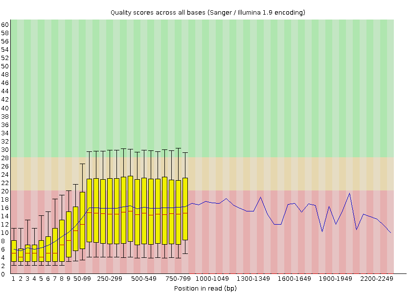

# Introduction
{:.no_toc}

<!-- This is a comment. -->

What is a microbiome? There are collections of small living creatures.
These small creatures are called bacteria and they are everywhere. In our gut,
in the soil, on vending machines, and even inside the beer. Most of these bacteria are
actually very good for us, but some can make us very ill.

Bacteria come in different shapes and sizes, but they have the same components.
One crucial component is the DNA, the blueprint of life. The DNA encodes the
shape and size and many other characteristics unique to a bacterial species. Because of
the encoding information the DNA can be used to identify what kind of bacteria
the DNA is from. Therefore, within a metagenomic sample, e.g. form soil, gut, or beer, one can
specify what kind of species are inside the sample.

In this tutorial, we will use data generated via the [BeerDEcoded project](https://streetscience.community/projects/beerdecoded/).

> ###  The BeerDEcoded project
>
> The BeerDEcoded project are workshops organized with and for schools and general
> audience, to introduce biology and genomic science. People will learn about
> DNA, sequencing technologies, bioinformatics, open science, how these technologies and concepts are
> applied and how they are impacting their daily life.
>
> The 1-2 days continuous (or divided over several days) workshops include the following steps:
> 1. Extract yeasts and their DNA from beer bottle,
> 2. Sequence the extracted DNA using a MinION sequencer to obtain the sequence of bases/nucleotides (A, T, C and G) for each DNA fragment in the sample,
> 3. Analyze the sequenced data in order to know which organisms this DNA is from
>
> 
>
{: .comment}

DNA of yeasts in a bottle of La Trappe beer has been extracted and sequenced using a
MinION to obtain sequences of DNA of the extracted yeasts. Now, for each obtained sequence, we would like to identify the yeast species to which it belongs, and thereby outline the diversity of organisms (the microbiome community) in the beer sample.

To get this information, we need to process the sequenced data in a few steps:
1. Check the quality of the data
2. Assign taxonomic label, i.e. assigh 'species' to the sequences
3. Visualize the species distribution

This type of data analysis requires running several bioinformatics tools and
usually requires a computer science background. [Galaxy](https://galaxyproject.org/) is
an open-source platform for data analysis that enables users to use bioinformatics
tools through its graphical web interface, accessible via any Web browser.

So, in this tutorial, we will use Galaxy to extract and visualize the community
of yeasts from a beer bottle.

> ### Agenda
>
> In this tutorial, we will cover:
>
> 1. TOC
> {:toc}
>
{: .agenda}


# Prepare Galaxy and data

First of all, this tutorial will get you hands on with some basic Galaxy tasks, including creating a history and importing data.

## Get familiar with Galaxy

> ###  Hands-on: Open Galaxy
> At first, Open your favorite browser (Chrome, Safari or Firefox as your browser, not Internet Explorer!)
> 
>    

{: .hands_on}

The Galaxy homepage is divided into three panels:
* Tools on the left
* Viewing panel in the middle
* History of analysis and files on the right


The first time you use Galaxy, there will be no files in your history panel.

Any analysis should get its own Galaxy history. So let's start by creating a new one:

> ###  Hands-on: Prepare the Galaxy history
>
> 1. Create a new history for this analysis
>
>    
>
> 2. Rename the history
>
>    
>
{: .hands_on}

## Get data

Before we can begin any Galaxy analysis, we need to upload the input data: FASTQ files

> ###  Hands-on: Upload your dataset
>
> 1. Import the sequenced data
>
>    - Option 1 [](https://youtu.be/FFCDx1rMGAQ): Your own local data using **Upload Data** (recommended for 1-10 datasets).
>
>      
>
>    - Option 2: From Zenodo, an external server via URL
>
>      ```text
>      {{ page.zenodo_link }}
>      ```
>
>      
>
>    Your uploaded file is now in your current history. When the file has uploaded to Galaxy, it will turn green. But, what is this file?
>
> 2. Click on the  (eye) icon next to the dataset name, to look at the file content
>
{: .hands_on}

The contents of the file will be displayed in the central Galaxy panel.

This file contains the sequences, also called **reads**, of DNA, *i.e.* succession of nucleotides, for all fragments from the yeasts in the beer, in FASTQ format.

> ###  FASTQ format
>
> Although it looks complicated (and maybe it is), the FASTQ format is easy to > understand with a little decoding. Each read, representing a fragment of DNA, is encoded by 4 lines:
>
> Line  | Description
> --- | ---
> 1 | Always begins with `@` followed by the information about the read
> 2 | The actual nucleic sequence
> 3 | Always begins with a `+` and contains sometimes the same info in line 1
> 4 | Has a string of characters which represent the quality scores associated with each base of the nucleic sequence; must have the same number of characters as line 2
>
> So for example, the first sequence in our file is:
>
> ```
> @03dd2268-71ef-4635-8bce-a42a0439ba9a runid=8711537cc800b6622b9d76d9483ecb373c6544e5 read=252 ch=179 start_time=2019-12-08T11:54:28Z flow_cell_id=FAL10820 protocol_group_id=la_trappe sample_id=08_12_2019
> AGTAAGTAGCGAACCGGTTTCGTTTGGGTGTTTAACCGTTTTCGCATTTATCGTGAAACGCTTTCGCGTTTTCGTGCGGAAGGCGCTTCACCCAGGGCCTCTCATGCTTTGTCTTCCTGTTTATTCAGGATCGCCCAAAGCGAGAATCATACCACTAGACCACACGCCCGAATTATTGTTGCGTTAATAAGAAAAGCAAATATTTAAGATAGGAAGTGATTAAAGGGAATCTTCTACCAACAATATCCATTCAAATTCAGGCA
> +
> $'())#$$%#$%%'-$&$%'%#$%('+;<>>>18.?ACLJM7E:CFIMK<=@0/.4<9<&$007:,3<IIN<3%+&$(+#$%'$#$.2@401/5=49IEE=CH.20355>-@AC@:B?7;=C4419)*$$46211075.$%..#,529,''=CFF@:<?9B522.(&%%(9:3E99<BIL?:>RB--**5,3(/.-8B>F@@=?,9'36;:87+/19BAD@=8*''&''7752'$%&,5)AM<99$%;EE;BD:=9<@=9+%$
> ```
>
> It means that the fragment named `@03dd2268-71ef-4635-8bce-a42a0439ba9a` (ID given in line1) corresponds to:
> - the DNA sequence `AGTAAGTAGCGAACCGGTTTCGTTTGGGTGTTTAACCGTTTTCGCATTTATCGTGAAACGCTTTCGCGTTTTCGTGCGGAAGGCGCTTCACCCAGGGCCTCTCATGCTTTGTCTTCCTGTTTATTCAGGATCGCCCAAAGCGAGAATCATACCACTAGACCACACGCCCGAATTATTGTTGCGTTAATAAGAAAAGCAAATATTTAAGATAGGAAGTGATTAAAGGGAATCTTCTACCAACAATATCCATTCAAATTCAGGCA` (line2)
> - this sequence has been sequenced with a quality `$'())#$$%#$%%'-$&$%'%#$%('+;<>>>18.?ACLJM7E:CFIMK<=@0/.4<9<&$007:,3<IIN<3%+&$(+#$%'$#$.2@401/5=49IEE=CH.20355>-@AC@:B?7;=C4419)*$$46211075.$%..#,529,''=CFF@:<?9B522.(&%%(9:3E99<BIL?:>RB--**5,3(/.-8B>F@@=?,9'36;:87+/19BAD@=8*''&''7752'$%&,5)AM<99$%;EE;BD:=9<@=9+%$` (line 4).
>
> But what does this quality score mean?
>
> The quality score for each sequence is a string of characters, one for each base of the nucleotide sequence, used to characterize the probability of misidentification of each base. The score is encoded using the ASCII character table (with [some historical differences](https://en.wikipedia.org/wiki/FASTQ_format#Encoding)):
>
> 
>
> So there is an ASCII character associated with each nucleotide, representing its [Phred quality score](https://en.wikipedia.org/wiki/Phred_quality_score), the probability of an incorrect base call:
>
> Phred Quality Score | Probability of incorrect base call | Base call accuracy
> --- | --- | ---
> 10 | 1 in 10 | 90%
> 20 | 1 in 100 | 99%
> 30 | 1 in 1000 | 99.9%
> 40 | 1 in 10,000 | 99.99%
> 50 | 1 in 100,000 | 99.999%
> 60 | 1 in 1,000,000 | 99.9999%
>
{: .details }

# Data quality

## Assess data quality

Before starting to work on our data, it is necessary to assess its quality. This is an essential step if we aim to obtain a **meaningful downstream analysis**.

**FastQC** is one of the most widely used tools to **check the quality** of data generated by High Throughput Sequencing (HTS) technologies.

> ###  Hands-on: Quality check
>
> 1.  with the following parameters
>    -  *"Raw read data from your current history"*: `Reads`
>
> 2. Inspect the generated HTML file
>
{: .hands_on}

**FastQC** provides information on various parameters, such as the range of quality values across all bases at each position:



We can see that the quality of our sequencing data grows after the first few bases, stays around a score of 18, which is a relatively low value compared to other sequencing technologies, and then decreases again at the end of the sequences.

## Improve the dataset quality

In order to improve the quality of our data, we will use two tools:
- **porechop** () to remove adapters that were added for sequencing and chimera (contaminant)
- **fastp** () to filter sequences with low quality scores (below 9)

> ###  Hands-on: Improve the dataset quality
>
> 1.  with the following parameters:
>    - *"Input FASTA/FASTQ"*:  `Reads`
>    - *"Output format for the reads"*: `fastq`
>
> 2.  with the following parameters:
>    - *"Single-end or paired reads"*: `Single-end`
>     -  *"Dataset collection"*: output of **Porechop**
>        - In *"Adapter Trimming Options"*:
>            - *"Disable adapter trimming"*: `Yes`
>    - In *"Filter Options"*:
>        - In *"Quality filtering options"*:
>            - *"Qualified quality phred"*: `9`
>    - In *"Read Modification Options"*:
>        - *"PolyG tail trimming"*: `Disable polyG tail trimming`
>
> 3. (Optional)  with the following parameters
>    -  *"Raw read data from your current history"*: `output of **fastp**
>
> 4. (Optional) Inspect the output of **FASTQC** to see how the quality has been improved
{: .hands_on}

# Assign taxonomic classifications

One of the key steps in metagenomic data analysis is to identify the taxon to which the individual reads belong.

> ###  Taxon?
>
> Taxonomy is the method used to naming, defining (circumscribing) and classifying groups of biological organisms based on shared characteristics. It is founded on the concept that morphological similarities descend from a common evolutionary ancestor.
>
> At a very broad level, all living organisms are grouped into one of the 7 Kingdoms of Life each of which are split further into Phylum > Class > Order > Family > Genus > Species.
>
> For example for the cat:
>
> Level | Classification
> --- | ---
> Kingdom | Animalia
> Phylum | Chordata
> Class | Mammalia
> Order | Carnivora
> Family | Felidae
> Genus | *Felis*
> Species |	*F. catus*
>
> A taxon is a group of organisms and/ or populations(s) of organisms that together form a taxonomic unit. A taxon is usually assigned a rank when it is given its formal, Latin name.
>
> ![Example of taxonomy. It starts, top to bottom, with Kingdom "Animalia", Phylum "Chordata", Class "Mammalia", and Order "Carnivora". Then it splits in 3. On the left, Family "Felidae", with 2 genus "Felis" and "Panthera" and below 3 species "F. catus" and "F. pardalis" below "Felis", "P. pardus" below "Panthera". In the middle, Family "Canidae", genus "Canis" and 2 species "C. familiaris" and "C. lupus". On the right, Family "Ursidae", Genus "Ursus" and 2 species "U. arctos" and "U. horribilus". Below each species is a illustration of the species](./images/taxonomy.png)
>
>
{: .comment}

Taxonomic classification tools are based on microbial genome databases to identify the origin of each sequence. To perform the taxonomic classification we will use **Kraken2** ().

> ###  Kraken2
>
> This tool uses the minimizer method to sample the k-mers (all the read's subsequences of length $$k$$) in a deterministic fashion in order to reduce memory constumption and processing time. In addition, it masks low-complexity sequences from reference sequences by using dustmasker.
>
> 
>
{: .details}

> ###  Hands-on: Kraken2
>
> 1.  with the following parameters:
>    - *"Single or paired reads"*: `Single`
>        -  *"Input sequences"*: Output of **fastp**
>    - *"Print scientific names instead of just taxids"*: `Yes`
>    - In *"Create Report"*:
>        - *"Print a report with aggregrate counts/clade to file"*: `Yes`
>        - *"Format report output like Kraken 1's kraken-mpa-report"*: `Yes`
>
{: .hands_on}

# Visualize the community

Once we have assigned the corresponding taxa to the sequences, the next step is to properly visualize the data: visualize the diversity of taxons at different levels.

To do that, we will use the tool **Krona** (). But before that, we need to adjust the format of the data output from Kraken2.

> ###  Hands-on: Prepare dataset for Krona
>
> 1.  with the following parameters:
>    -  *"Input tabular dataset"*: output of **Kraken2** )
> 2.  with the following parameters:
>    -  *"File to process"*: `out_file` (output of **Reverse** )
>    - In *"Replacement"*:
>        -  *"Insert Replacement"*
>            - *"Find pattern"*: `\|`
>            - *"Replace with:"*: `\t`
{: .hands_on}

**Krona** creates an interactive report that allows hierarchical data (like taxonomy) to be explored with zooming, multi-layered pie charts. With this tool, we can easily visualize the composition of the microbiome communities and also compare how the populations of microorganisms are modified between different samples.

> ###  Hands-on: Krona pie chart
>
> 1.  with the following parameters:
>    - *"What is the type of your input data"*: `Tabular`
>        -  *"Input file"*:  output of **Replace Text** 
>
> 2. Inspect the generated file
{: .hands_on}

Let's take a look at the result.

<!--
<iframe id="krona" src="krona_all.html" frameBorder="0" width="100%" height="900px">  </iframe>

Add data interpretation and questions to understand the data

> ###  Questions
>
> 1.
>
> > ###  Solution
> >
> > 1.
> >
> {: .solution}
>
{: .question}

--->

# Conclusion
{:.no_toc}


## (Optional) Sharing your history

One of the most important features of Galaxy comes at the end of an analysis: sharing your histories with others so they can review them.

> ###  Hands-on: Share history and workflow
>
> 1. Click on the  (gear) symbol in the history panel
> 2. Select `Share or Publish`
> 3. Make your history accessible via a link
> 4. Copy the link
>
{: .hands_on}

> ###  The 3 ways to share in Galaxy
>
> 1. **Make accessible via Link**
>
>     This generates a link that you can give out to others. Anybody with this link will be able to view your history.
>
> 2. **Publish History**
>
>     This will not only create a link, but will also publish your history. This means your history will be listed under `Shared Data → Published Histories` in the top menu.
>
> 3. **Share with Individual Users**
>
>     This will share the history only with specific users on the Galaxy instance.
>
{: .comment}


