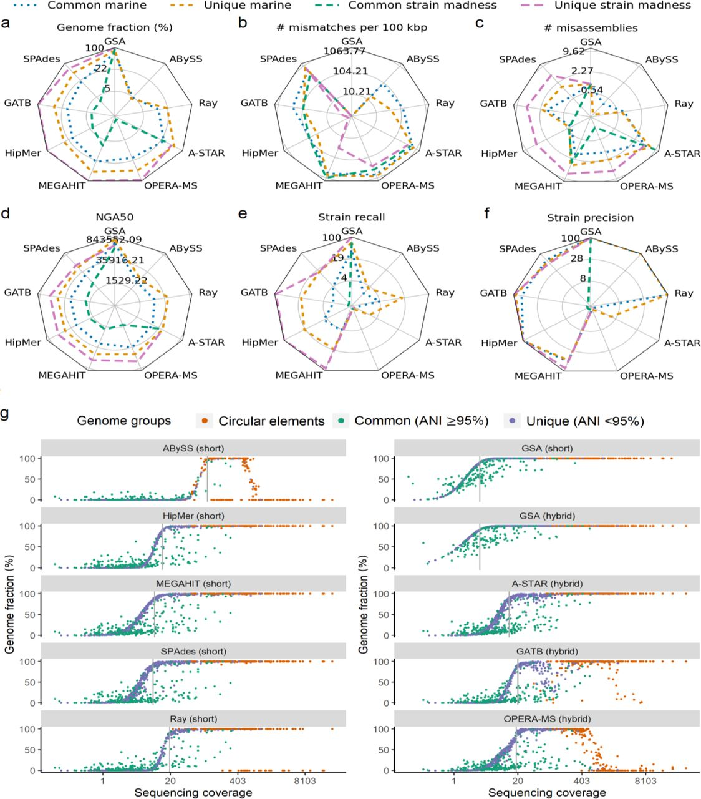
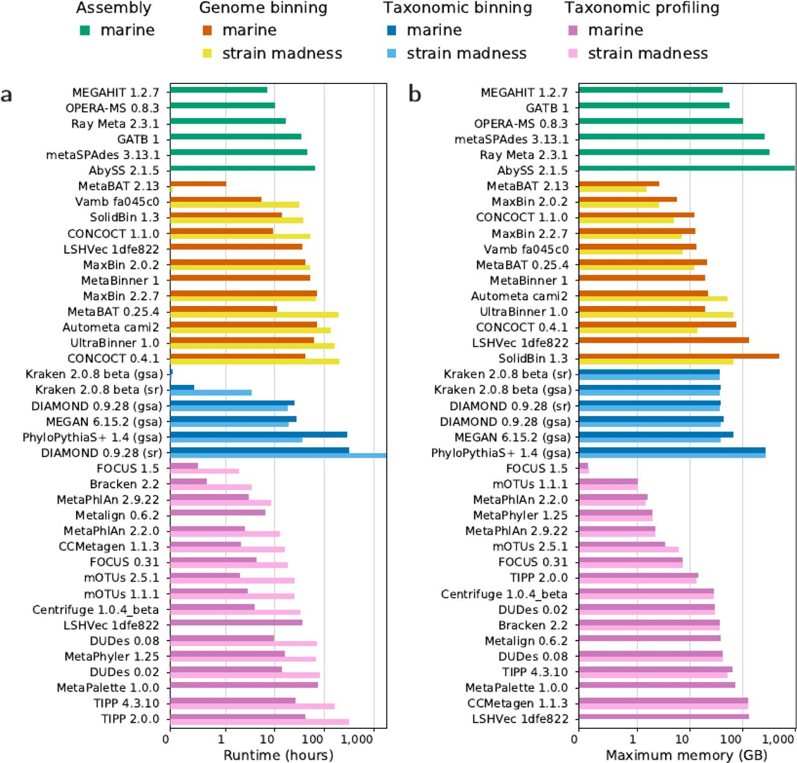

# Introduction

Metagenomics analysis involves **complex computational methods** like **assembly**, **genome binning**, **taxonomic binning**, **taxonomic profiling** and other. It is only when these initial data processing methods make sense that downstream analyses and information extraction are meaningful. Even though vast progress has been made over the last few years, none of these approaches can fully recover the complex information encoded in metagenomes. These approaches all rely on **simplifying assumptions that can have serious limitations**.

It is usually **difficult** for microbiome data analysts to **know which tools to use** for each step. They must rely on evaluations made by the developers of new or improved methods. However, these evaluations are rarely comparable: there is **no general standard for the evaluation of computational methods in metagenomics**. As a result, users may not be properly informed and compute predictions may be misinterpreted.

Essentially, the **critical assessment concept** involves evaluating a theory, situation, statement, or something else with the goal of supporting its dominant paradigms or disproving them as well as suggesting a better alternative plan. Any view or conclusion needs to be backed up by credible evidence in order to be considered critical. In metagenomic research, critical assessment of the data interpretation is especially important, because merely accepting the data as truth would not suffice.

## The CAMI Challenge

Critical Assessment of Metagenome Interpretation (CAMI) () was established in 2012. The objective of CAMI is to evaluate metagenomics methods independently, comprehensively, and without bias. The initiative provides users with **comprehensive information** about the performance of methods in all relevant scenarios. Therefore, it assists users in the selection and application of methods as well as their proper interpretation.

During the 1st CAMI challenge, extensive metagenome benchmark data sets were generated from newly sequenced genomes of around 700 microbial isolates and approximately 600 circular elements that were distinct from strains, species, genera or orders represented by public genomes. Four challenges were suggested (assembly, binning, taxonomic profiling, taxonomic binning). Overall, 16 teams worldwide submitted 215 submissions to the CAMI 1st challenge, consisting of 25 programs and 36 biobox implementations, with permission to publish.

The 2nd CAMI challenges (, ) started in 2019. It includes 4 different challenges:

* An **assembly** challenge
* A **genome binning** challenge
* A **taxonomic binning** challenge
* A **taxonomic profiling** challenge
* A **clinical pathogen prediction** challenge

Each challenge uses a similar set of benchmark datasets reproducing different environments and different sequencing technologies  long and short reads). The six benchmark datasets—reflecting a range of complexities—were created from 1,680 microbial genomes and 599 circular elements of viruses and plasmid:

* 2 **'toy'** datasets created from public data and provided before a challenge,
* 3 **'challenge'** datasets derived exclusively from genomic data that were not publicly available at the time
    * **Marine**: Simulated short read and long read shotgun metagenome data from samples at different seafloor locations of a marine environment
    * **Plant-associated**: Simulated short read and long read shotgun metagenome data from samples taken from a plant rhizosphere environment
    * **Strain madness**: Simulated long read and short read shotgun metagenome data, including a large amount of strain-level variation
* A **pathogen detection** challenge dataset, based on a clinical metagenome sample of blood from a critically ill patient with hemorrhagic fever of unknown cause.

During the challenges, datasets for the challenge were available for download only to participants via the [CAMI portal](https://data.cami-challenge.org/). After the challenges, [all CAMI benchmark datasets were made available with digital object identifiers (DOIs)](https://www.nature.com/articles/s41596-020-00480-3/tables/2) and the genomic data are now in public sequence repositories such as the National Center for Biotechnology Information (NCBI) to be used for further benchmarking in the field.

For running the challenges, the participants ran their preferred tools with their preferred set of parameters and submitted their results along with either a Docker container containing the complete workflow, a script or a software repository with detailed installation instructions, specifying all parameter settings and reference databases used. A total of 5,002 submissions were received from 30 external teams and CAMI developers for the four challenge datasets. Following that, the CAMI developers evaluated the results using standardised metrics and then made sense of the different results described in 

Galaxy could be considered as a **good platform for such a challenge as CAMI**. In addition to providing the computational resources, Galaxy provides **full reproducibility**, which makes it a great solution for CAMI and similar types of challenges. Everything required to complete such challenges is collected in one location:

* Shared data libraries to share the input datasets with participants
* Databases and tools of different versions available to use
* Galaxy workflows extractable and sharable for the reproducibility
* Sharable Galaxy history, including all tool run metadata (input, outputs, parameters, version, used computational resources, etc)

### Motivation

In this tutorial we show how Galaxy could be used as a platform to support the next CAMI challenges or for other similar critical assessment challenges, but also what were the issues we got and possible solutions (on Galaxy side but for organisers of such challenges).

> ### Agenda
>
> In this tutorial, we will cover:
>
> 1. TOC
> {:toc}
>
{: .agenda}

# Select the challenge to reproduce

A the entire challenge is not a one-day task and takes months to complete, we should focus on one challenge out of the four offered in CAMI 2. The choice we make depends on our interests and objectives.

- **Assembly**: one of the important components of metagenomic analysis

    The challenge is called to assess the quality and performance of tools for assembling strain-resolved genomes. 3 "challenge" datasets were offered:
    - marine,
    - strain madness, and
    - plant associated data.

    Two types of assemblies were assessed:
    - **individual assembly**: assembly of reads from only one sample at a time, and
    - **co-assembly**: assembly of all reads from several samples together.

    > <comment-title></comment-title>
    >
    > Do you want to learn more about the principles behind metagenomic assembly? Follow our [dedicated tutorial]().
    {: .comment}

    For the sake of comparison, **gold standard assemblies**, *i.e.* the correct result which can be used to compare with and benchmark other methods’ results, were created with all regions covered by at least one read and were provided only after the challenges.

    In CAMI 2, participants provided 155 submissions and 20 assembler versions of 10 assembling tools to be evaluated during this challenge. The different tools performed differently while measuring various metrics. By CAMI2 developers there are provided [plots](https://www.biorxiv.org/content/biorxiv/early/2021/07/12/2021.07.12.451567/F1.large.jpg?width=800&height=600&carousel=1) of benchmarking analyses of different tools depending on different statistics.

    {:width="70%"}

    Overall, GATB () ranked best on the strain madness data across most metrics (mismatches, misassemblies, strain recall, and strain precision), while HipMer (, , ) on the plant-associated data. Compared to the first CAMI challenge A-STAR considerably improved in genome fraction for the strain madness data. The other leader SPAdes (, ) was not introduced in CAMI1 () and performed well in CAMI2 (, ). For the type of assembly, the different tools performed differently. Single-sample assembly was done well by all assemblers. HipMer performed better on single samples as well as for pooled samples.

- **Genome binning**: clusters or classifies sequences or contigs into bins representing genomes.

    Genome binning takes as input the output of assembly. Two types of short read assemblies were given as inputs for CAMI2: MEGAHIT () assembly and Gold Standard Assembly. Both types for strain madness, marine, and plant-associated datasets, so 6 possible datasets in total.

    Participants submitted 95 results and 10 binning tools (overall, 18 binner versions). The results were evaluated based on:

    * Average purity of bins, *i.e.* the fraction of correctly assigned base pairs for all assignments to a given bin averaged over all predicted genome bins, where unmapped genomes are not considered.

        This value reflects how trustworthy the bin assignments are on average.

    * Completeness of genomes recovered,
    * Adjusted Rand index (ARI) which quantifies binning performance for the overall dataset

        According to , genome binners generate groups or clusters of reads and contigs for a given dataset. Instead of calculating performance metrics established with a bin-to-genome mapping, the quality of a clustering can be evaluated by measuring the similarity between the obtained and correct cluster partitions of the dataset, corresponding here to the predicted genome bins and the gold standard contig or read genome assignments, respectively. Two contigs or reads of the same genome that are placed in the same predicted genome bin are considered true positives TP. Two contigs or reads of different genomes that are placed in different bins are considered true negatives TN. The Rand index ranges from 0 to 1 and is the number of true pairs, TP + TN, divided by the total number of pairs. However, for a random clustering of the dataset, the Rand index would be larger than 0. The Adjusted Rand index (ARI) corrects for this by subtracting the expected value for the Rand index and normalising the resulting value, such that the values still range from 0 to 1.

    The performance of different genome binning tools differed depending on metrics, datasets, and assembly type. Overall, the best trade-off performances were given by MetaBinner () on marine and strain madness assemblies, and CONCOCT () on plant-associated assemblies.

- **Taxonomic binning**: group sequences into bins labelled with a taxonomic identifier.

    For the challenge, the input datasets were marine, strain madness, and plant-associated of 2 types: reads or gold standard assemblies.

    547 results for 7 tools were submitted and evaluated using 3 metrics:

    * average purity,
    * completeness of bins, and
    * the accuracy per sample (the fraction of contigs, or base pairs, that have been assigned by a method to the correct taxa for a taxonomic rank).

    Performances for all datasets decreased from genus to species for all metrics, most notably for completeness by 22.2%.
    Across all datasets and all metrics the best performance was shown by MEGAN (), closely followed by Kraken () v.2.0.8-beta. However, in terms of certain metrics different binners performed better.

    There was a post-processing data approach used to improve the results. This approach means filtering of the 1% smallest predicted bins per taxonomic level. Filtering increased purity whereas reduced completeness. Accuracy was not affected. The winner MEGAN was not changed though.

- **Taxonomic profiling**: identification and quantification of microbial community taxa

    > <comment-title></comment-title>
    >
    > Do you want to learn more about the principles behind metagenomic taxonomy profiling? Follow our [dedicated tutorial]().
    {: .comment}

    There were predicted taxonomic identities and relative abundances of microbial community members for the 64 samples of the mouse gut dataset. There were 4,195 results for 13 tools evaluated. The majority of results were from short-read samples and a few from long-read.

    The performance of the tools were evaluated using:

    * purity of identified taxa,
    * taxon abundance,

        For quantifying relative abundance estimates, the L1 norm and weighted UniFrac error are determined. The L1 norm assesses relative abundance estimates of taxa at a taxonomic rank, on the basis of the sum of the absolute differences between the true and predicted abundances across all taxa. The weighted UniFrac error uses a taxonomic tree storing the predicted abundances at the appropriate nodes for eight major taxonomic ranks. The UniFrac error is the total amount of predicted abundances that must be moved along the edges of the tree to cause them to overlap with the true relative abundances.

    * alpha diversity of profiling results.

    There was a notable performance drop observed from genus to species level rank for all datasets: marina, strain madness, and plant-associated.

    mOTUs () v.2.5.1 performed the best on the marine data at both genus and species. For strain madness data, leaders for genus rank were MetaPhlAn (, ) v.2.9.2, MetaPhyler () v.1.2571, and mOTUs of the CAMI1. For plant-associated data Bracken v2.6 performed best for completeness across ranks.

    Abundances across ranks and submissions were on average predicted better for strain madness than marine data.
    - On the marine data, mOTUs v.2.5.1 had the lowest L1 error while mOTUs v.2.5.1 and MetaPhlAn v.2.9.22 both had the lowest UniFrac error.
    - On the strain madness data, mOTUs cami1 performed best in L1 norm error whilst MetaPhlAn v.2.9.22 had the lowest UniFrac error.
    - On the plant-associated data, Bracken v.2.6 had the lowest L1 norm error across ranks and had the lowest UniFrac as "sourmash gather 3.3.2 k31" did.

To select which challenge to run, we compared **tools submitted for every challenge **to understand the start point of CAMI2 reproduction in the Galaxy. We collected metadata for each tool: source code, publication that describes the tool, tool version, availability in Galaxy, tool version in Galaxy, notes on their performance in  CAMI2.

- **Assembly** tool comparison

    Tool | Publication | Version used in CAMI 2 | Available in Galaxy | Tool version in Galaxy | Notes on their performance
    --- | --- | --- | --- | --- | --- | --- | ---
	[(Meta)HipMer](https://sourceforge.net/projects/hipmer) | , ,   | short read, v.1.0, v.1.2.2, v.2.0, Metagenome, cgraph, cgraph-ono | No
    [(meta)Flye](https://github.com/fenderglass/Flye) |  | long read, v.2.4.1, v.2.8, v.2.8.1 | Yes | 2.9
    [(meta)SPAdes](http://cab.spbu.ru/software/spades) |  | short read/hybrid, v.3.13.0, v.3.13.1, v.3.14-dev | Yes | 3.15.3 |
	[OPERA-MS](https://github.com/CSB5/OPERA-MS) |  | | No | | Second fastest and most memory efficient
    [Ray Meta](http://github.com/sebhtml/ray) |  | short read, v.2.3.1 | No
    [ABySS](https://github.com/bcgsc/abyss) | , | short read, v.2.1.5 | Yes | 2.3.4
    [GATB](http://gatb.inria.fr) | , | hybrid, v.1.0 | No | second fastest and most memory efficient
    A- STAR | | hybrid, contigs, and scaffolds | No
    [MEGAHIT](https://github.com/voutcn/megahit) | | short read, v.1.1.2, v.1.1.4-2, v.1.2.7 | Yes | 1.1.3.5 | the fastest and most memory efficient

- **Genome binning** tool comparison

    Tool | Publication | Version used in CAMI 2 | Available in Galaxy | Tool version in Galaxy | Notes on their performance
    --- | --- | --- | --- | --- | --- | --- | ---
    [MetaBAT](https://bitbucket.org/berkeleylab/metabat/) | ,  | v.2.15-5, v.2.13-33, v.0.25.4 | Yes | 2.15 |  MetaBAT 2.13.33 was the fastest (1.07 and 0.05 h) and most memory efficient genome binner (max. memory usage 2.66 GB, 1.5 GB) on both datasets
    [MaxBin](http://sourceforge.net/projects/maxbin/) |  | v.2.2.7, v.2.0.2 | Yes | 2.2.7 | MaxBin 2.0.2 is the second memory efficient on marine data
    [CONCOCT](https://github.com/BinPro/CONCOCT) |  | v.1.1.0, v.0.4.1 | Yes | | CONCOCT 1.1.0 on marine data is the second memory efficient
    [Autometa](https://bitbucket.org/jason_c_kwan/autometa) |  | | No |
    [LSHVec](https://github.com/Lizhen0909/LSHVec) |  | v.cami2 | No | | LSHVec 1dfe822 is the second fastest method, ∼6x slower than MetaBAT on marine
    MetaBinner | | v.1.3, v.1.2, v.1.1, v.1.0 | No |
    UltraBinner | | v.1.0 | No
    [MetaWRAP](https://github.com/bxlab/metaWRAP) |	 | v.1.2.3 | No |
    [SolidBin](https://github.com/sufforest/SolidBin) |	 | v.1.3 | No | SolidBin 1.3 is 765x slower than MetaBAT on strain madness data
    [Vamb](https://github.com/RasmussenLab/vamb) |  | v.3.0.1, v.fa045c0 | No | | Vamb fa045c0 is the second fastest method, ∼5x and ∼635x slower than MetaBAT

- **Taxonomic binning** tool comparison

    Tool | Publication | Version used in CAMI 2 | Available in Galaxy | Tool version in Galaxy | Notes on their performance
    --- | --- | --- | --- | --- | --- | --- | ---
    [LSHVec](https://github.com/Lizhen0909/LSHVec) |  | v.cami2 | No |
    [PhyloPythiaS+](https://github.com/algbioi/ppsp/wiki) |  | v.1.4 | No |   | PhyloPythiaS+ with 287.3 vs. 36 h, respectively, but had a similar or slightly higher memory usage
    [Kraken](https://github.com/DerrickWood/kraken2) |  | v.2.0.8-beta, v.0.10.5-beta (cami1) | Yes | 2.1.1 | The fastest and most memory efficient taxonomic binner
    [DIAMOND](http://www.diamondsearch.org) |  | v.0.9.28 | Yes | 2.0.8.0 | 	ran ∼500x and ∼910x as long on the marine and strain madness gold standard assemblies, respectively
    [MEGAN](https://github.com/danielhuson/megan-ce) |  | v.6.15.2 | Yes |
    [Ganon](https://gitlab.com/rki_bioinformatics/ganon) |  | v.0.1.4, v.0.3.1 | No |
    [NBC++](https://github.com/EESI/Naive_Bayes) |  | No

- **Taxonomic profiling** tool comparison

    Tool | Publication | Version used in CAMI 2 | Available in Galaxy | Tool version in Galaxy | Notes on their performance
    --- | --- | --- | --- | --- | --- | --- | ---
    [mOTUs](https://github.com/motu-tool/mOTUs_v2) |  | | No | | the second memory efficient
    [Centrifuge](https://github.com/infphilo/centrifuge/archive/centrifuge-genome-research.zip) |  | v.1.0.4 beta | Yes | 1.0.4_beta
    [MetaPhlAn](http://huttenhower.sph.harvard.edu/metaphlan/) | ,  | v.2.9.22, v.2.2.0, cami1, v.3.0.7 | Yes | 3.0.13 | the second memory efficient. Three submissions correctly identified the causal pathogen, Crimean-Congo hemorrhagic fever orthonairovirus (NCBI taxid 1980519)
    [Bracken](https://github.com/jenniferlu717/Bracken) |  | v.2.2, v.2.5, v.2.6 | Yes | 2.6.1 | The fastest profilers on the marine (0.66 h) and strain madness (3.45 h). Correctly identified orthonairovirus, but without indicating it as the causal pathogen. Three submissions correctly identified the causal pathogen, Crimean-Congo hemorrhagic fever orthonairovirus (NCBI taxid 1980519)
    [NBC++](https://github.com/EESI/Naive_Bayes) |  | | No
    [CCMetagen](https://github.com/vrmarcelino/CCMetagen) |  | v.1.1.3 | No | | Three submissions correctly identified the causal pathogen, Crimean-Congo hemorrhagic fever orthonairovirus (NCBI taxid 1980519)
    [DUDes](http://sf.net/p/dudes) |  | v.0.08, v.cami1 | No |
    [LSHVec](https://github.com/Lizhen0909/LSHVec) |  | gsa | No
    [Metalign](https://github.com/nlapier2/Metalign) |  | | No
    [MetaPalette](https://github.com/dkoslicki/MetaPalette) |  | | No
    [MetaPhyler](http://metaphyler.cbcb.umd.edu/) |  | v.1.25 | No
    TIPP | | v.4.3.10, v.cami1 | No |
    FOCUS | | 0.31, v.1.5 | No | | the fastest profilers on the marine (0.51 h) and strain madness (1.89 h). required the least memory (0.16 GB for marine, 0.17 GB for strain madness)

After this comparison it turned out that the **Assembly challenge** is more interesting for us to reproduce on Galaxy platform. One reason for this choice is that highly ranked tools in CAMI2 (like Megahit, Flye, MetaSPAdes, etc.) are already available in Galaxy, so that we can focus more on benchmarking analysis of assembly results than on adding missing tools into Galaxy.


# Select and get the data to benchmark

Once we have decided to reproduce the assembly challenge, we can move forward to determine which dataset is more representative for our purposes. There is no need to use all datasets to demonstrate the utility of Galaxy for future CAMI and other similar tasks.

- **Toy datasets**

    As in the first CAMI challenge metagenome "toy" (or "practice") benchmark datasets were created from public genomes and provided together with the standard of truth before the challenges, to enable contest participants to familiarise themselves with data types and formats. These included

    *  a **49-sample** simulated metagenome data from Human Microbiome data to represent **five different body sites** of the **human host**:

        Body site | Number of samples | Type of reads
        [Airways](https://openstack.cebitec.uni-bielefeld.de:8080/swift/v1/CAMI_Airways) | 10 | long, short, hybrid
        [Gastrointestinal tract](https://openstack.cebitec.uni-bielefeld.de:8080/swift/v1/CAMI_Gastrointestinal_tract) | 10 | long, short, hybrid
        [Oral cavity](https://openstack.cebitec.uni-bielefeld.de:8080/swift/v1/CAMI_Oral) | 10 | long, short, hybrid
        [Skin](https://openstack.cebitec.uni-bielefeld.de:8080/swift/v1/CAMI_Skin) | 10 | long, short, hybrid
        [Urogenital tract](https://openstack.cebitec.uni-bielefeld.de:8080/swift/v1/CAMI_Urogenital_tract) | 9 | long, short, hybrid

    *  a [**64-sample** simulated metagenome data from the **guts of different mice, vendors and positions in the gut**.](https://openstack.cebitec.uni-bielefeld.de:8080/swift/v1/CAMISIM_MOUSEGUT)

        According to  tutorial, the mouse gut metagenome toy dataset was generated with CAMISIM v.0.2 () using a microbial community genome abundance distribution modelled from 791 public prokaryotic genomes marked as at least "scaffolds" in the NCBI RefSeq (). They comprise 8 phyla, 18 classes, 26 orders, 50 families, 157 genera, and 549 species. The community genome abundance distribution matches as closely as possible the 16S taxonomic profiles for 64 mouse gut samples. As such, this dataset enables us to assess how well sequenced community members can be characterised with different techniques from the metagenomes of similar communities. On average, within each of the 64 samples, 91.8 genomes are represented. Both long- and short-read metagenomic sequencing data are available. The runtime to generate this data was approximately 3 weeks using eight CPU cores of a computer with an AMD Opteron 6378 CPU and 968 GB of main memory.

    Both include:
    - 5 Gb long paired-end reads (Pacific Biosciences, variable length with a mean of 3,000 bp) and
    - 5 Gb short paired-end reads (Illumina HiSeq2000, 150 bp).

- 4 **Challenge datasets**
    - **Clinical pathogen detection**: a short-read metagenomic sequencing dataset of a blood sample from a patient with hemorrhagic fever of unknown cause

        We excluded this dataset as it is provided only for the last challenge: identify a causal pathogen together with further pathogens, not for the selected assembly challenge

    - Dataset representing a **marine** environment

        It was created with CAMISIM from BIOM profiles of a deep-sea environment, using 155 newly sequenced marine isolate genomes from this environment and 622 public genomes with matching taxonomic provenance from MarRef, a manually curated database with completely sequenced marine genomes. Additionally, 200 newly sequenced circular elements including plasmids and viruses were added.

        The dataset (100Gb) consists of
        - **10** samples (5 Gb each) with **paired-end short-read** (Illumina, with the length of 150bp) sequences and
        - **10** samples (5 Gb each) with **single-end long-read** (Nanopore, with the length of 7,408 bp) sequences.

    - **Strain madness** dataset representing a very high strain diversity environment ("strain madness")

        The dataset (400 Gb) was generated with CAMISIM, using 408 newly sequenced genomes:
        - **100** samples (2 Gb each) with **paired-rend short-reads** (Illumina, the length of 150bp) sequences.
        - **100** samples (2 Gb each) with **single-end long-read** (Nanopore with the length of 7,408 bp) sequences.

    - **Plant associated rhizosphere** dataset (that included fungal genomes and host plant material) including 894 genomes:

        * 224 are from the proGenomes terrestrial representative genomes,
        * 216 are newly sequenced genomes from an _Arabidopsis thaliana_ root rhizosphere,
        * 55 are fungal genomes associated with the rhizosphere,
        * 398 are plasmids or circular elements and one _Arabidopsis thaliana_ genome.

        15.3% (137) of these genomes have at least one closely related genome present. 90% of metagenome sequence data originate from bacterial genomes, 9% are fungal genome sequences, and 1% is from _A. thaliana_. 399 circular elements including plasmids and viruses were added.

        To evaluate the assembly quality of single-sample versus cross-assembly strategies, 23 new genomes from eight clusters of closely related genomes were selected and added to the dataset in certain samples with predetermined abundances.

        Dataset (315Gb) includes
        - **21** samples (5 Gb) with paired-end short-read (with the length of 150bp) sequences
        - **21** samples with 7,408 bp long read (Oxford Nanopore) sequences
        - **21** samples with 3,000 bp long read (Pacific Bioscience) sequences

We analysed all datasets and compared them with each other in terms of number of samples, dataset size, average read length:

Dataset | Simulation sequencing technique | Number of samples | Dataset size (Gb) | Average read length (bp) |
--- | --- | --- | --- | ---
Toy Human Microbiome | Illumina HiSeq | 49 (10 GI tract, 10 oral cavity, 10 airways, 10 skin, 9 urogenital tract) | 245 |2x150
Toy Human Microbiome | Pacific Bioscience | 49 (10 GI tract, 10 oral cavity, 10 airways, 10 skin, 9 urogenital tract)	245 | 3,000 | 1,000
Toy Mouse Gut | Illumina HiSeq | 64 (12 different mice microbiota) | 320 | 2x150
Toy Mouse Gut | Pacific Bioscience | 64 (12 different mice microbiota) | 320 | 3,000
Marine | Illumina HiSeq | 10 | 50 | 2x150
Marine | Pacific Bioscience | 10 | 50 | 3,000
Strain Madness | Illumina HiSeq | 100 |	200 | 2x150
Strain Madness | Pacific Bioscience | 100 | 200 | 3,000
Rhizosphere | Illumina HiSeq | 21 | 105 | 2x150
Rhizosphere | Pacific Bioscience | 21 | 106 | 3,000
Rhizosphere | Oxford Nanopore | 21 | 107 | 1,610

After close consideration of all datasets we decide to choose a **marine dataset**.

It contains reads from 10 samples (lowest number in all datasets), with both short- (Illumina) and long- (Nanopore) read. It means that we can try different tools on either one sample or pooled sample collection and also rub tools working with long reads and short reads, and tools working with both short and long at the same time.

Overall size of all marine data is 180 Gb. This size is big enough and allows us to test tools and measure such metrics as runtime and memory usage. Other datasets (strain madness and plant-associated) are too large, and since we have a limit in time of this tutorial we decided to give preference to smaller but highly representable marine dataset.

# Prepare Galaxy and data

Now we selected the assembly challenge and marine dataset to reproduce using Galaxy, let's prepare Galaxy for that.

First thing, we need to get the data into our history. We find in  a table with the different DOI for the different dataset

## Get links to datasets

> <hands-on-title>Get dataset links from DOI</hands-on-title>
>
> 1. Copy the DOI (unique identifier) for the marine dataset in the [Table 2 in ](https://www.nature.com/articles/s41596-020-00480-3/tables/2): `10.4126/FRL01-006425521`
> 2. Search for the DOI:
>    1. Open [DataCite](https://search.datacite.org/):
>    2. Search for the DOI
>    3. lick the link that was found for the DOI
> 3. Click in "Zugehöriges Dataset" on the link [https://frl.publisso.de/data/frl:6425521/marine/](https://frl.publisso.de/data/frl:6425521/marine/)
> 4. Click on the [marine folder](https://frl.publisso.de/data/frl:6425521/marine/)
{: .hands_on}

> <question-title></question-title>
>
> 1. What are the different folders in the marine folder?
> 2. What is the content of the different folders?
> 3. What do we need to run the assembly challenge for this dataset?
>
> > <solution-title></solution-title>
> >
> > 1. There are 3 folders: `hybrid`, `long_read`, `short_read`
> > 2. In the `long_read` and `short_read` folders, there are, for each of the 10 samples, 3 files: a BAM file, a contigs file and a read file. In the `hybrid` folder, there are 1 file per sample.
> > 3. To run the assembly challenge, we need to get the read files for each sample in both `long_read` and `short_read` folders.
> >
> {: .solution}
>
{: .question}

## Get data in Galaxy

Now we know what the data we need to add. There are different ways to upload data into the Galaxy:
- Get the data locally and upload to Galaxy
- Upload via a FTP server

  

- Upload each data using links
- Use the [Galaxy Rule-based Uploader]() to download a list of datasets

Since data is of large size we cannot just download them to our computer by clicking the button download. Additionally, the whole dataset cannot be downloaded at once as it contains different samples with one file per one sample. There are also different files for long and short reads of the same sample. It seems like a better approach to use the **Galaxy Rule-based Uploader**.

Before we start to upload datasets we have to create a text table with the information we need to import the samples: sample ID and link to the FASTQ file (URL), like:

```
SampleID	URL
Short read sample 0	https://frl.publisso.de/data/frl:6425521/marine/short_read/marmgCAMI2_sample_0_reads.tar.gz
Short read sample 1	https://frl.publisso.de/data/frl:6425521/marine/short_read/marmgCAMI2_sample_1_reads.tar.gz
...
```

In this text table:
- `SampleID` is the name of the sample which should include all usefull information about sample:
    - the type of dataset (marine, plant-associated, or strain-madness);
    - short or long reads;
    - the sample number.

    This name will be displayed in Galaxy history. So that is important to choose a meaningful name for sample in order to not get lost afterwards.
- `URL` field is for the link in text-file from [CAMI portal](https://data.cami-challenge.org/) (you can download this file with links in the section “2nd CAMI Challenge Marine Dataset”).

In order to get these files into Galaxy, we will want to do a few things:

* Strip the *header* out of the sample information (it doesn’t contain a URL Galaxy can download).
* Define the file **Identifier** column (`SampleID`).
* Define the **URL** column (`URL`) (this is the location Galaxy can download the data from).

We will start to upload the short-read data.

> <hands-on-title>Upload short-read data into Galaxy with Rule Builder</hands-on-title>
>
> 1. Create a new history
>
>    
>
> 2. Rename the history `CAMI 2 - Inputs`
>
>    
>
> 3. Click the upload icon toward the top left corner.
> 4. Click on `Rule-based` on the top right
> 5. Select `Collection(s)` in **Upload data as**
> 6. Paste the following tabular data right into the textbox:
>
>     ```text
>     SampleID	URL
>     Short read sample 0	https://frl.publisso.de/data/frl:6425521/marine/short_read/marmgCAMI2_sample_0_reads.tar.gz
>     Short read sample 1	https://frl.publisso.de/data/frl:6425521/marine/short_read/marmgCAMI2_sample_1_reads.tar.gz
>     Short read sample 2	https://frl.publisso.de/data/frl:6425521/marine/short_read/marmgCAMI2_sample_2_reads.tar.gz
>     Short read sample 3	https://frl.publisso.de/data/frl:6425521/marine/short_read/marmgCAMI2_sample_3_reads.tar.gz
>     Short read sample 4	https://frl.publisso.de/data/frl:6425521/marine/short_read/marmgCAMI2_sample_4_reads.tar.gz
>     Short read sample 5	https://frl.publisso.de/data/frl:6425521/marine/short_read/marmgCAMI2_sample_5_reads.tar.gz
>     Short read sample 6	https://frl.publisso.de/data/frl:6425521/marine/short_read/marmgCAMI2_sample_6_reads.tar.gz
>     Short read sample 7	https://frl.publisso.de/data/frl:6425521/marine/short_read/marmgCAMI2_sample_7_reads.tar.gz
>     Short read sample 8	https://frl.publisso.de/data/frl:6425521/marine/short_read/marmgCAMI2_sample_8_reads.tar.gz
>     Short read sample 9	https://frl.publisso.de/data/frl:6425521/marine/short_read/marmgCAMI2_sample_9_reads.tar.gz
>     ```
>
> 7. Click on the **Build** button
> 8. Remove the header by
>    1. Click on the **Filter** menu
>    2. Select `First or Last N Rows`
>    3. Select
>       - *"Filter which rows?"*: `first`
>       - *"Filter how many rows?"*: `1`
>    4. Click `Apply`
>
> 9. Define the Identifier and URL columns by
>    1. Click on the **Rules** menu
>    2. Select `Add / Modify Column Definitions`
>    3. Define the column with Identifier
>       1. Click `Add Definition` button
>       2. Select `List Identifier(s)`
>       3. Select `A` column
>    4. Define the column with URL
>       1. Click `Add Definition` button
>       2. Select `URL`
>       3. Select `B` column
>    5. Click on `Apply`
> 10. Add the name `Short reads` to the collection
> 11. Click on `Upload`
>
>     > <comment-title></comment-title>
>     > The process will take time.
>     {: .comment}
>
> 12. Inspect the generated collection
>
{: .hands_on}

> <question-title></question-title>
>
> 1. What is the format of the file for each sample?
> 2.
>
> > <solution-title></solution-title>
> >
> > 1.
> >
> {: .solution}
>
{: .question}

We got the marine data for short-reads in our history. Let's do the same for long-reads.

> <hands-on-title>Upload long-read data into Galaxy with Rule Builder</hands-on-title>
>
> 1. Click the upload icon toward the top left corner.
> 2. Click on `Rule-based` on the top right
> 3. Select `Collection(s)` in **Upload data as**
> 4. Paste the following tabular data right into the textbox:
>
>     ```text
>     SampleID	URL
>     Long read sample 0	https://frl.publisso.de/data/frl:6425521/marine/long_read/marmgCAMI2_sample_0_reads.tar.gz
>     Long read sample 1	https://frl.publisso.de/data/frl:6425521/marine/long_read/marmgCAMI2_sample_1_reads.tar.gz
>     Long read sample 2	https://frl.publisso.de/data/frl:6425521/marine/long_read/marmgCAMI2_sample_2_reads.tar.gz
>     Long read sample 3	https://frl.publisso.de/data/frl:6425521/marine/long_read/marmgCAMI2_sample_3_reads.tar.gz
>     Long read sample 4	https://frl.publisso.de/data/frl:6425521/marine/long_read/marmgCAMI2_sample_4_reads.tar.gz
>     Long read sample 5	https://frl.publisso.de/data/frl:6425521/marine/long_read/marmgCAMI2_sample_5_reads.tar.gz
>     Long read sample 6	https://frl.publisso.de/data/frl:6425521/marine/long_read/marmgCAMI2_sample_6_reads.tar.gz
>     Long read sample 7	https://frl.publisso.de/data/frl:6425521/marine/long_read/marmgCAMI2_sample_7_reads.tar.gz
>     Long read sample 8	https://frl.publisso.de/data/frl:6425521/marine/long_read/marmgCAMI2_sample_8_reads.tar.gz
>     Long read sample 9	https://frl.publisso.de/data/frl:6425521/marine/long_read/marmgCAMI2_sample_9_reads.tar.gz
>     ```
>
> 7. Click on the **Build** button
> 8. Remove the header by
>    1. Click on the **Filter** menu
>    2. Select `First or Last N Rows`
>    3. Select
>       - *"Filter which rows?"*: `first`
>       - *"Filter how many rows?"*: `1`
>    4. Click `Apply`
>
> 9. Define the Identifier and URL columns by
>    1. Click on the **Rules** menu
>    2. Select `Add / Modify Column Definitions`
>    3. Define the column with Identifier
>       1. Click `Add Definition` button
>       2. Select `List Identifier(s)`
>       3. Select `A` column
>    4. Define the column with URL
>       1. Click `Add Definition` button
>       2. Select `URL`
>       3. Select `B` column
>    5. Click on `Apply`
> 10. Add the name `Long reads` to the collection
> 11. Click on `Upload`
>
>     > <comment-title></comment-title>
>     > The process will take time.
>     {: .comment}
>
> 12. Inspect the generated collection
>
{: .hands_on}

The data has been simulated and we have the Gold Standard Assembly (GSA) for it, that we can use as reference genome for evaluation of assembly quality.

> <hands-on-title>Upload the Gold Standard Assemblya into Galaxy with Rule Builder</hands-on-title>
> 1. TODO
>
> 12. Inspect the generated collection
>
{: .hands_on}

> <details-title>Download datasets with the CAMI Client</details-title>
>
> Another way to download datasets is to use CAMI Client. [Here](https://www.microbiome-cosi.org/cami/resources/cami-client) you can find instructions on how to use it.
>
> > <hands-on-title>Get dataset with DOI</hands-on-title>
> >
> > 1. Install Java 8 on your computer.
> > 2. Create an account on [CAMI portal](https://data.cami-challenge.org/)
> > 3. Download the [camiClient.jar](https://data.cami-challenge.org/camiClient.jar)
> > 4. Get text-file with links for dataset from [CAMI portal](https://data.cami-challenge.org/). You can download this file in the section "2nd CAMI Challenge Marine Dataset"
> > 5. You can download data with CAMI client using the following command line in the terminal:
> >
> >     ```
> > java -jar camiClient.jar -d <linkfileLocation> <targetDirectory> -p PATTERN
> > ```
> {: .hands_on}
>
{: .details}

## Get raw reads data

We got the marine data in our history with one file per sample (10 samples). We need to prepare our data because
1. the files consist of interleaved paired-end reads, *i.e.* forward and reverse reads are all together in one single file and not 2 as often.

    This can be a problem for some assemblers as not every assembling tool can take interleaved paired-end reads as input.

2. for co-assembly of all samples, some assemblers expect one file with all samples combined together.

> <hands-on-title>Preprocessing data</hands-on-title>
>
> 2. Run  with the following parameters:
>    -  *"Collection of files to collapse into single dataset"*: `Short reads`
>    - *"Keep one header line"*: `No`
>    - *"Prepend File name"*: `No`
>
> 4.  with following parameters:
>     -  *"FASTQ reads"*: output of Collapse collection tool
> 5. Rename the outputs generated by **FASTQ splitter** to include the information about forward and reverse if the information is not in the name
>
>    > <comment-title></comment-title>
>    > While working on this project we realised that both outputs (forward and reverse) had the same name `FASTQ splitter on data X`, where X is the internal number of data in this Galaxy history, with the version of FASTQ splitter we used
>    > Since we have run FASTQ splitter on one dataset and got 2 outputs, as a result filenames of both outputs were the same.
>    >
>    > Why is it not good?
>    >
>    > It can be mistaken by assembler (or any other tool where we want to use FASTQ splitter output files) because it will not know which file is reverse and which is forward.
>    >
>    > We updated the Galaxy tool to fix this issue
>    {: .comment}
>
> 6. Repeat the steps for long reads
{: .hands_on}

We now have collections for both short and long reads.

# Select and prepare the tools to run

## Select tools

To select the tools to use for an analysis but also here to run the challenge, we can compare tools nased on ,  and  on a set of metrics:

- **Genome fraction**: percentage of aligned bases in the reference genome reached by the corresponding tool
- **Mismatches per 100 kbp**: mismatched bases in the contig-reference alignment
- **Misassemblies**: joining sequences that should not be adjacent.
- **NGA50**: the contig length such that using longer contigs produces half (50%) of the bases of the reference genome
- **Strain recall**: the fraction of high-quality (more than 90% genome fraction and less than a specific number of mismatches per 100 kb) genome assemblies recovered for all ground truth genomes
- **Strain precision**: the fraction of low mismatch and high genome fraction (more than 90%) assemblies among all high genome fraction assemblies

The first line, the Gold Standard Assembly, refers to the correct result that was expected from the assemblers.

Tool | Genome fraction (%) | Mismatches per 100 kbp | Misassemblies | NGA50 | Strain recall | Strain precision
Gold Standard Assembly (GSA) | 76.9 | 0 | 0 | 682,777 | 54.9% (upper bound) | 100
ABySS () | Very accurate mean fraction (<1% divergence) |  | The fewest misassemblies | 100% precision. The highest strain precision (100%) for the unique genome
Ray () |  |  |  |  |  | 100% precision. The highest strain precision (100%) for the unique genome
A-STAR | A-STAR excelled in terms of genome fraction on marine and strain madness data sets. A-STAR improved the genome fraction to 44.1% on the marine dataset. On marine common genomes, A-STAR (26.7%) achieved the highest genome fractions. For unique genome, A-STAR provided the most complete assemblies (55.3% genome fraction). A-STAR partially recovered 102 (78%) of 131 16S gold standard sequences. | More mismatches than others: 773/100 kb | More misassemblies than others | | 2nd highest: 7.5% recall  | 2nd highest: 69.4% precision
OPERA-MS () | There were selected 50 unique, public genomes present as a single contig in the gold standard and with annotated 16S sequences. The hybrid assembler OPERA-MS recovered one of the most complete 16S sequences (mean recovered gene fraction 47.1%). For the unique genome, OPERA-MS has an exceptional average NGA50 (187,083, 75% of the gold standard NGA50). | | The most contiguous assemblies were provided by the hybrid assembler OPERA-MS for the marine data, with an average NGA50 of 28,244 across genomes. |
MEGAHIT () | 41.1. On marine common genomes, MEGAHIT (24.6%) achieved the second highest (after A-STAR) genome fractions. There were selected 50 unique, public genomes present as a single contig in the gold standard and with annotated 16S sequences. The mean fraction of genes recovered by short-read assembler MEGAHIT is 36.9% | | For short-read assembly, MEGAHIT had the highest contiguity on the marine (NGA50 of 26,599) |
HipMer () | high genome fraction. There were selected 50 unique, public genomes present as a single contig in the gold standard and with annotated 16S sequences. The mean fraction of genes recovered by short-read assembler HipMer is 29.6% | | high NGA50 | HipMer had the highest strain recall (14.4% on marine). For the unique genome, the HipMer assembly had the highest strain recall (20.4%). | achieved 100% precision. For the unique genome, the highest strain precision (100%) | HipMer had the fewest mm per 100 kb on the marine data set with 96
GATB () | There were selected 50 unique, public genomes present as a single contig in the gold standard and with annotated 16S sequences. The hybrid assembler GATB recovered the most complete 16S sequences (mean recovered gene fraction 60.1%) | The fewest mismatches (173) for hybrid assemblers were introduced by GATB | | 10.8% on marine
SPAdes () | | | | The SPAdes hybrid submission had NGA50 of 43,014 | On marine common genomes, SPAdes had the highest strain recall (8.7%) | On marine common genomes, SPAdes had 96.7% strain precision
Flye () | Flye performed less well than other assemblers across most metrics on the marine data

> <details-title>Performance of the assembly tools on the strain madness and plant-associated datasets</details-title>>
> **Strain madness**
>
> Genome fraction (%) | Mismatches per 100 kbp | Misassemblies | NGA50 | Strain recall | Strain precision
> GSA | 90.8 |  |  | 155,979 | The upper bound for strain recall was 67.4%, as provided by the strain madness gold standard assembly
> ABySS |
> Ray |
> A-STAR | A-STAR excelled in terms of genome fraction on marine and strain madness data sets. For strain madness common genomes >75% genome fraction | On marine and strain-madness datasets A-STAR created more mismatches than others. For strain madness common genomes <0.5% mm | On marine and strain-madness datasets A-STAR created more misassemblies than others. | A-STAR had the highest contiguity for the strain madness data (13,008) | For strain madness common genomes, A-STAR recovered the most, with 1.5% recall | For strain madness common genomes - 23.1% strain precision
> OPERA-MS |
> MEGAHIT |10.апр. | |  | For short-read assembly, MEGAHIT had the highest contiguity on the strain madness data (NGA50 of 4,793) |
> HipMer (in the second place) | For strain madness common genomes, HipMer recovered a lower genome fraction (4.1% versus 30.4% for A-STAR) |For strain madness common genomes, HipMer created fewer mismatches (0.1%) | For strain madness common genomes, HipMer created fewer misassemblies per genome (0.5) | HipMer had the highest strain recall (3.2% on strain madness). For strain madness common genomes, 0.8% strain recall | For strain madness common genomes, 100% strain precision
> GATB ( ranked best) |  | GATB had the fewest mm per 100 kb on the strain madness data set with 98 | GATB created the fewest misassemblies for the strain madness data |  | 2.9% on strain madness |achieved 100% precision
> SPAdes |
> Flye |
>
>
> **Plant-associated**
>
> Genome fraction (%) | Mismatches per 100 kbp | Misassemblies | NGA50 | Strain recall | Strain precision
> GSA |
> ABySS |
> Ray |
> A-STAR |
> OPERA-MS |  |  | High number of mismatches |  | Extremely small strain recall | OPERA-MS has the lowest precision
> MEGAHIT |
> HipMer (performed best across metrics) | HipMer, HipMer2, and Flye have the best coverage. | HipMer has less mismatches per 100 kbp compared to other assemblers. Followed by HipMer2 |  |  | HipMer and HipMer2 have the highest strain recall |
> GATB |
> SPAdes |  |  | SPAdes has the lowest number of misassemblies |
> Flye (the second place) | HipMer, HipMer2, and Flye have the best coverage. |  | Flye_hybrid has higher number of misassemblies than others |  |  | Flye, HipMer, amd HipMer2 have the highest precision
{: .details}

Using the described metrics, the different tools were evaluated in the CAMI paper and aggregated in tables (Supplementary Tables 3-7) from .

In these tables there are also ranking scores of the tools shown for every statistic as well as overall ranking scores. Overall, ranking scores for every dataset are computed as a sum of all ranking scores across metrics. The average ranking score of both datasets are calculated as weighted average sum of ranking for both datasets. We created a table showing all ranking (sum of ranking scores through all metrics) results from previous tables:

Tool | Version | Inputs | Running time | Ranking of all methods on MARINE dataset | Ranking of all methods on STRAIN MADNESS dataset | Ranking of all methods on BOTH datasets | Ranking for common marine genomes | Ranking for unique marine genomes | Ranking for unique strain genomes | Ranking for common strain genomes | Sum of all ranking scores for MARINE dataset | Sum of all ranking scores for STRAIN MADNESS dataset | Sum of all ranking scores for BOTH
--- | --- | --- | --- | --- | --- | --- | --- | --- | --- | --- | --- | ---
Gold Standard | | Short reads |  | 15 | 8 | 10,8 | 17 | 0 | 0 | 8 | 32 | 16 | 48
HipMer | cgraph | Short reads | 2m 1s 2b | 37 | 25 | 29,8 | 34 | 33 | 24 | 21 | 104 | 70 | 174
HipMer | Metagenome | Short reads | 1m 2s 1b | 29 | 31 | 30,2 | 30 | 33 | 14 | 27 | 92 | 72 | 164
HipMer | cgraph-ono | Short reads | 3m 3s 3b | 39 | 27 | 31,8 | 36 | 34 | 33 | 25 | 109 | 85 | 194
Megahit | v1.1.2 | Short reads | 8m 4s 4b	| 57 | 45 | 49,8 | 61 | 52 | 33 | 39 | 170 | 117 | 287
SPAdes | v3.14-dev | Short and long reads | 9m 5s 5b | 58 | 45 | 50,2 | 55 | 65 | 55 | 25 | 178 | 125 | 303
OPERA-MS |  | Short and long reads | 6s 7b | 80 | 44 | 58,4 | 76 | 79 | 47 | 36 | 235 | 127 | 362
Megahit | V1.2.7 | Short reads | 7s 6b | 67 | 51 | 57,4 | 74 | 68 | 47 | 41 | 209 | 139 | 348
Megahit | v1.1.4-2 | Short reads | 8s 8b | 83 | 52 | 64,4 | 87 | 87 | 47 | 43 | 257 | 142 | 399
A-STAR | scaffold | Short and long reads |  | 91 | 48 | 65,2 | 88 | 82 | 61 | 33 | 261 | 142 | 403
A-STAR | contig | Short and long reads |  | 91 | 49 | 65,8 | 86 | 83 | 62 | 34 | 260 | 145 | 405
wtdbg2 | GATB-Pipeline | Short and long reads |  |  | 1000 | 1000 | 1000 | 1000 | 21 | 20 | 2000 | 1041 | 3041
Miniasm | GATB | Short and long reads | | 60 | 20 | 36 | 70 | 58 | 1000 | 1000 | 188 | 2020 | 2208
metaSPAdes | v3.13.1 | Short reads | 4m | 50 | 1000 | 1000 | 41 | 55 | 1000 | 1000 | 146 | 3000 | 3146
metaSPAdes | v3.13.0 | Short reads | 5m | 53 | 1000 | 1000 | 42 | 57 | 1000 | 1000 | 152 | 3000 | 3152
ABySS |  | Short reads | 6m | 52 | 1000 | 1000 | 48 | 54 | 1000 | 1000 | 154 | 3000 | 3154
Ray-Meta |  | Short reads | 7m | 53 | 1000 | 1000 | 61 | 55 | 1000 | 1000 | 169 | 3000 | 3169
metaSPAdes | v3.13.1| Short reads |  | 61 | 1000 | 1000 | 52 | 72 | 1000 | 1000 | 185 | 3000 | 3185
Flye |  | Long reads |  | 83 | 1000 | 1000 | 80 | 77 | 1000 | 1000 | 240 | 3000 | 3240

We summed up ranking scores for all methods, common genomes, and unique genomes to extract the following  priority list for tools:

- With tool versions

    Order | **Marine** dataset | **Strain madness** dataset
    --- | --- | ---
    1 | HipMer | HipMer
    2 | metaSPAdes v3.13.1 | Megahit_v1.1.2
    3 | metaSPAdes v3.13.0 | SPAdes_v3.14-dev
    4 | ABySS | OPERA-MS
    5 | Ray-Meta | Megahit_V1.2.7
    6 | Megahit v1.1.2 |
    7 | SPAdes v3.14-dev |

- Without tool versions

    Order | **Marine** dataset | **Strain madness** dataset | **Plant-associated** dataset
    --- | --- | --- | ---
    1 | HipMer | HipMer | (Meta)HipMer
    2 | **metaSPAdes** | **Megahit** | **(meta)Flye**
    3 | **ABySS** | **SPAdes** | **(meta)SPAdes**
    4 | **Ray-Meta** | **OPERA** |
    5 | **Megahit** | |

    > <comment-title></comment-title>
    > There are no certain ranking tables among Supplementary tables for plant-associated dataset. However,  in  there is information related to tools performance on plant-associated dataset. We created the priority list of tools for the plant-associated dataset.
    {: .comment}

Since in this tutorial we have decided to focus on marine dataset it would be reasonable to reproduce CAMI2 assembly challenge using **HipMer**, **metaSPAdes**, **ABySS**, **Ray-Meta**, **MEGAHIT** assemblers which performed better.

As we know from a table above, **metaSPAdes**, **ABySS**, **MEGAHIT** tools are available in Galaxy while **Ray-Meta** and **HipMer** are not. Moreover, we also selected **Flye** assembler, even though Flye is not in the Top-5 assemblers in CAMI2. Flye is a long-read assembler that works well for this task. We do that to show the assembler launched on long-reads and not only on short-reads and hybrid.


## Prepare tools

Due to the limited time for this project, we have decided to skip adding new tools into Galaxy. So, in this tutorial we do not run Hipmer and Ray-Meta.

All tools in Galaxy are kept up-to-date with their corresponding command-line tool. This is why in this tutorial we checked if the tool we want to use is up-to-date before using it. We then updated Megahit from 1.1.3.5 version to 1.2.9 (the latest version for that moment).

The other case it might be necessary to update the tool when we get an error on tool run or we find out that there is a bug:
- In the **tool itself**, then we have to contact the tool developers
- With the **Galaxy tool**, you may be able to fix it by yourself.

This was the case with the metaSPAdes tool. When we launched the metaSPAdes tool it failed with the error:

```
ln: failed to create symbolic link 'paired_reads1/FASTQ_splitter_on_data_X.fastq': File exists
```

The reason for this error was the same filename were used forward and reverse reads. We figure out that this error came from the FASTQ splitter tool, so we updated the FASTQ splitter. But we also updated metaSPAdes tool to avoid similar cases in the future.

Updating or fixing tools has the same concept as adding tools but is less time consuming.

To update the tool in Galaxy, we need to update its **wrapper**. A wrapper is a XML which serves as a **layer between the command-line tool itself and the Galaxy interface**. This wrapper helps Galaxy users to have a visual interface and selection of the parameters of the command-line.

> <comment-title></comment-title>
> Please read our dedicated tutorial to learn more about Galaxy tools and the detailed instruction of how to build or update the tool is [here](https://planemo.readthedocs.io/en/latest/writing_standalone.html).
{: .comment}

To update or fix a tool, we need to change its XML. But first we need to find where is the source of this XML. Tools in a Galaxy server are installed by the administrators of this Galaxy server using the [**Galaxy ToolShed**](https://toolshed.g2.bx.psu.edu/). The Galaxy ToolShed is like an AppStore with the XML for all possible Galaxy tools. So to update a tool, we need to change its XML in the ToolShed. But usually, XML of tools are developed collaboratively inside GitHub repositories and then pushed to the ToolShed. So we need to find the development repository of the Galaxy tool to update it.

> <hands-on-title>Find the development repository of a tool to update</hands-on-title>
>
> 1. Open the  in Galaxy
> 2. Click on the  (*Option*) menu on the top right of the tool form and select  **See in the ToolShed**
>
>    You will be redirected to the [tool on the ToolShed](https://toolshed.g2.bx.psu.edu/repository?repository_id=3b1fd65d5ff152bf)
>
> 3. Click on the link in [**"Development repository"**](https://github.com/galaxyproject/tools-iuc/tree/master/tool_collections/galaxy_sequence_utils/fastq_paired_end_splitter)
>
{: .hands_on}

We are in the GitHub repository where the source of the tool wrapper, i.e. its XML, is stored and versioned.

Once we have the development repository setup, we can update the tool. We recommend using [Planemo](https://planemo.readthedocs.io/en/latest/), the Galaxy software development kit, to help the process.

> <hands-on-title>Update the tools</hands-on-title>
>
> 1. Install Planemo
> 2. Fork the GitHub repository
> 3. Clone the GitHub repository
> 4. Create a branch
> 5. Go in the folder of the tool
> 6. Make the changes to fix the tool
> 7. Update the tests for this tool
> 8. Lint the tool using `planemo lint`
> 9. See and try the new wrapper by serving a local Galaxy instance using `planemo lint`
> 10. Test the tool with `planemo test`
> 11. Push the changes to the branch of your fork
> 12. Create a Pull Request
> 12. Modify the tool given the suggested changes
{: .hands-on}

Once the Pull Request will be merged, the tool will be automatically updated on the ToolShed and within few likely also in the main Galaxy servers (like usegalaxy.eu, usegalaxy.org or usegalaxy.org.au). If not, you might need to ask the Galaxy administrators to do it.

# Run the assembly tools on the marine dataset

In the CAMI 2 challenge, short and long reads are available for each sample. Different tools are needed to assembly short or long reads. We will reproduce that. In addition, some tools allows **hybrid** assembly, *i.e.* short and long reads together.

In the CAMI 2 challenge, the assemblies were run with 2 approaches:

- **Individual assembly**, i.e. assembly on each individual sample

- **Co-assembly**, i.e. assembly on the pooled samples

> <comment-title></comment-title>
> You can learn about metagenomic assembly, individual and co-assembly in [our dedicated tutorial]()
{: .comment}

Co-assembly is **more commonly** used than individual assembly. But to reproduce the CAMI challenge, we run tools in both modes.

The runtime and memory usage are obviously different for not only these two scenarios, but also for the tools. Some assemblers are fast (like Megahit), some are slow (like Flye). While choosing parameters to run every tool with we oriented on parameters which have been used in CAMI2 challenge by its participants. However, we did't consider it as absolute truth as in metagenomic analysis it can be not very clear which tools and which parameters would be better for the best assembly performance. Then we had to be critical to what had been done in CAMI 2. It was the basis of this tutorial/project, even though we made some corrections. Additionally, we take into account recommendations from tool documentation.

A Galaxy history was created for each tool and type of assembly (single or co-assembly). We named them such that it is easy to identify the tool and type from the mame, but to keep an overview we created a spreadsheet to list all histories along with their metadata (tool, etc).

## Long reads

**MetaFlye** (metagenome mode of Flye) is a scalable long-read metagenome assembly using repeat graphs (). It is supposed to use long reads as input.

### Individual assembly

> <hands-on-title>Individual assembly of long-read samples with Flye</hands-on-title>
>
> 1. Create a new history with the name `CAMI 2 - Long reads - Individual assembly`
>
>    
>
> 2. Copy the collection with long read data into this new history
>
>    
>
> 3. Run  with parameters:
>     -  *"Input reads"*: the collection of long reads from all samples
>     - *"Mode"*: `Nanopore raw (--nano-raw)`
>
>       > <comment-title></comment-title>
>       >
>       > Flye was reported in CAMI2 using parameter Mode `–-raw-bio` while datasets were sequenced with nanopore, thus we corrected parameters and used `–-nano-raw` instead.
>       {: .comment}
>
>     - *"Perform metagenomic assembly"*: `True`
>
> 4. Rename output to `Long reads - Individual assembly - Flye`
{: .hands_on}

### Co-assembly

> <hands-on-title>Co-assembly of long-read sample with Flye</hands-on-title>
>
> 1. Create a new history with the name `CAMI 2 - Long reads - Co-assembly`
>
> 2. Copy the pooled long read data into this new history
>
> 3. Run  with parameters:
>     -  *"Input reads"*: pooled long read data
>     - *"Mode"*: `Nanopore raw (--nano-raw)`
>     - *"Perform metagenomic assembly"*: `True`
> 4. Rename output to `Long reads - Co-assembly - Flye`
{: .hands_on}

We just launched **Flye** for:
- Individual assembly on the collection of long reads from all 10 samples
- Co-assembly on the pooled long reads data

## Short reads

For short reads, we will use the same approach (co-assembly and individual assembly) using 3 tools:

- **MEGAHIT**

    MEGAHIT is an ultra-fast single-node solution for large and complex metagenomics assembly via succinct de Bruijn graph (). As input it uses metagenomics samples as paired-end fastq files. As metagenomics input data short reads should be used.

- **ABySS**

    ABySS is a parallel assembler for short read sequence data (). It uses de novo short read assembly algorithms. Short reads should be used as input data for Abyss.

- **MetaSPAdes**

    MetaSPAdes is a versatile metagenomic assembler (). As input for metaspades it can accept short reads. However, there is an option to use additionally long reads besides short reads to produce hybrid input.

### Individual assembly

> <hands-on-title>Prepare history for individual assembly of short-reads samples with MEGAHIT, Abyss, and MetaSPAdes</hands-on-title>
>
> 1. Create a new history with the name `CAMI 2 - Short reads - Individual assembly`
> 2. Copy the collection with short read data into this new history
{: .hands_on}

MEGAHIT, Abyss, and MetaSPAdes uses *de Bruijn* graphs, representing all $$k$$-mers ( *i.e.* all substrings of length $$k$$) from the reads.

#### ABySS

In ABySS, we need to define the $$k$$-mer size. And in CAMI 2, 2 values were tested: $$k = 41$$ and $$k = 96$$.

> <hands-on-title>Individual assembly with ABySS</hands-on-title>
> 1. Run  with parameters:
>     - In *"Paired-end library"*
>       -  *"Insert Paired-end library"*
>         - *"Type of paired-end datasets"*: `1 paired dataset collection`
>           -  *"Paired-end reads collection"*: Short read collection
>     - *"K-mer length (in bp)"*: `41`
> 2. Rename output to `Short reads - Individual assembly - ABySS - k41`
> 3. Run  with parameters:
>     - In *"Paired-end library"*
>       -  *"Insert Paired-end library"*
>         - *"Type of paired-end datasets"*: `1 paired dataset collection`
>           -  *"Paired-end reads collection"*: Short read collection
>     - *"K-mer length (in bp)"*: `96`
> 4. Rename output to `Short reads - Individual assembly - ABySS - k96`
{: .hands_on}


#### MEGAHIT

MEGAHIT uses a multiple $$k$$-mer strategie. By default, the list of $$k$$-mer sizes is $$[21, 29, 39, 59, 79, 99, 119, 141]$$. But, it is also possible to have iteration with a minimum $$k$$ ($$k_{min}$$), maximum $$k$$ ($$k_{max}$$) and the step ($$k_{step}$$) for the iteration.

In CAMI 2, were used:
- The default setting
- The iteration with $$k_{min} = 21$$, $$k_{max} = 91$$, $$k_{step} = 12$$
- The iteration with $$k_{min} = 21$$, $$k_{max} = 91$$, $$k_{step} = 10$$

Let's reproduce that.

> <hands-on-title>Individual assembly with MEGAHIT</hands-on-title>
> 1. Run  with parameters:
>     - *"Select your input option"*: `Paired-end collection`
>       - *"Run in batch mode?"*: `Run individually`
>       -  *"Select a paired collection"*: Short read collection
> 2. Rename output to `Short reads - Individual assembly - MEGAHIT - Default`
> 3. Run  with parameters:
>     - *"Select your input option"*: `Paired-end collection`
>       - *"Run in batch mode?"*: `Run individually`
>       -  *"Select a paired collection"*: Short read collection
>     - *"K-mer specification method"*: `Specify min, max, and step values`
>       - *"Minimum kmer size"*: `21`
>       - *"Maximum kmer size"*: `91`
>       - *"Increment of kmer size of each iteration"*: `12`
> 4. Rename output to `Short reads - Individual assembly - MEGAHIT - k-min21 k-max91 k-step12`
> 5. Run  with parameters:
>     - *"Select your input option"*: `Paired-end collection`
>       - *"Run in batch mode?"*: `Run individually`
>       -  *"Select a paired collection"*: Short read collection
>     - *"K-mer specification method"*: `Specify min, max, and step values`
>       - *"Minimum kmer size"*: `21`
>       - *"Maximum kmer size"*: `91`
>       - *"Increment of kmer size of each iteration"*: `10`
> 4. Rename output to `Short reads - Individual assembly - MEGAHIT - k-min21 k-max91 k-step10`
{: .hands_on}

#### MetaSPAdes

MetaSPAdes uses also a multiple $$k$$-mer strategie. In CAMI 2, they used $$[21, 33, 55, 77]$$

> <hands-on-title>Individual assembly with MetaSPAdes</hands-on-title>
> 1. Run  with parameters:
>     - *"Pair-end reads input format"*: `Paired-end: list of dataset pairs`
>       -  *"FASTQ file(s): collection"*: Short read collection
>     - *"Select k-mer detection option"*: `User specific`
>       - *"K-mer size values"*: `21,33,55,77`
> 2. Rename output to `Short reads - Individual assembly - MetaSPAdes - k21-33-55-77`
{: .hands_on}

> <comment-title></comment-title>
>
> We got an error `Out of memory` for the first launches of MetaSPAdes. The memory limit in Galaxy was set to 200 Gb on usegalaxy.eu.
>
> If such issue happens, you can contact Galaxy administrators to ask if it is possible to increase the available memory for the tool.
>
> However, it was not enough. According to [Supplementary Table 2](https://www.biorxiv.org/content/10.1101/2021.07.12.451567v1.supplementary-material) CAMI2 participants used the memory limit of 500 Gb. Since the memory limit in Galaxy for every tool is set once and it is used for every launch of this tool no matter how much memory it is needed. It seems to be unreasonable to set 500 Gb instead of the recommended 250, because then any SPAdes job would request that amount of memory.
>
> Other issues we encountered during this project are more general. Protracted technical works occured on the Galaxy platform, all tools were stopped and launched from scratch. That means we ran out of time. Before these technical works tools have been running for around one month and they were re-launched. However, we increased the CPU which helped us to get results sooner.
{: .comment}


### Co-assembly

> <hands-on-title>Co-assembly of short-reads samples with Megahit, Abyss, and MetaSPAdes</hands-on-title>
>
> 1. Create a new history with the name `CAMI 2 - Short reads - Co-assembly`
> 2. Copy the pooled short read data into this new history
> 3. Run  with parameters:
>     - In *"Paired-end library"*
>       -  *"Insert Paired-end library"*
>         - *"Type of paired-end datasets"*: `1 dataset of interleaved reads`
>           -  *"Interleaved paired-end reads"*: Short read data
>     - *"K-mer length (in bp)"*: `41`
> 4. Rename output to `Short reads - Co-assembly - ABySS - k41`
> 5. Run  with parameters:
>     - In *"Paired-end library"*
>       -  *"Insert Paired-end library"*
>         - *"Type of paired-end datasets"*: `1 dataset of interleaved reads`
>           -  *"Interleaved paired-end reads"*: Short read data
>     - *"K-mer length (in bp)"*: `96`
> 6. Rename output to `Short reads - Co-assembly - ABySS - k96`
> 7. Run  with parameters:
>     - *"Select your input option"*: `Interleaved-paired-end`
>       - *"Interleaved-paired-end file(s)"*: Short read data
> 8. Rename output to `Short reads - Co-assembly - MEGAHIT - Default`
> 9. Run  with parameters:
>     - *"Select your input option"*: `Interleaved-paired-end`
>       -  *"Interleaved-paired-end file(s)"*: Short read data
>     - *"K-mer specification method"*: `Specify min, max, and step values`
>       - *"Minimum kmer size"*: `21`
>       - *"Maximum kmer size"*: `91`
>       - *"Increment of kmer size of each iteration"*: `12`
> 10. Rename output to `Short reads - Co-assembly - MEGAHIT - k-min21 k-max91 k-step12`
> 11. Run  with parameters:
>     - *"Select your input option"*: `Interleaved-paired-end`
>       -  *"Interleaved-paired-end file(s)"*: Short read data
>     - *"K-mer specification method"*: `Specify min, max, and step values`
>       - *"Minimum kmer size"*: `21`
>       - *"Maximum kmer size"*: `91`
>       - *"Increment of kmer size of each iteration"*: `10`
> 12. Rename output to `Short reads - Co-assembly - MEGAHIT - k-min21 k-max91 k-step10`
> 13. Run  with parameters:
>     - *"Pair-end reads input format"*: `Paired-end: interlace reads`
>       -  *"FASTQ file(s): interlaced"*: Short read data
>     - *"Select k-mer detection option"*: `User specific`
>       - *"K-mer size values"*: `21,33,55,77`
> 14. Rename output to `Short reads - Co-assembly - MetaSPAdes - k21-33-55-77`
{: .hands_on}


## Hybrid

Hybrid assembly uses both short- and long-read sequencing data. Most assemblers are not designed to handly hybrid mode. metaSPAdes can use auxiliary libraries (typically long noisy-reads) during the repeat resolution and gap closure steps to improve the contiguity of the results.

> <hands-on-title>Hybrid assembly with MetaSPAdes</hands-on-title>
> 1. Create a new history with the name `CAMI 2 - Hybrid`
> 2. Copy the collection with short read data into this new history
> 3. Copy the short read pooled data into this new history
> 4. Copy the collection with long read data into this new history
> 5. Copy the long read pooled data into this new history
> 6. Run  with parameters:
>     - *"Pair-end reads input format"*: `Paired-end: list of dataset pairs`
>       -  *"FASTQ file(s): collection"*: Short read collection
>     - In *"Additional read files"*
>       -  *"Nanopore reads"*: Long read collection
>     - *"Select k-mer detection option"*: `User specific`
>       - *"K-mer size values"*: `21,33,55,77`
> 7. Rename output to `Hybrid - Individual assembly - MetaSPAdes`
> 8. Run  with parameters:
>     - *"Pair-end reads input format"*: `Paired-end: interlace reads`
>       -  *"FASTQ file(s): interlaced"*: Short read data
>     - In *"Additional read files"*
>       -  *"Nanopore reads"*: Long read data
>     - *"Select k-mer detection option"*: `User specific`
>       - *"K-mer size values"*: `21,33,55,77`
> 9. Rename output to `Hybrid - Co-assembly - MetaSPAdes`
{: .hands_on}


# Assess the assembly outputs

Now we run the different assemblies, we need to assess their outputs. In CAMI2, different tools are used to evaluate the quality of the tools for the different challenges:

- For **assembly**: [MetaQUAST](https://github.com/ablab/quast/) ()
- For **genome binning**: [AMBER](https://github.com/CAMI-challenge/AMBER) ()
- For **taxonomic profiling**: [OPAL](https://github.com/CAMI-challenge/OPAL) ()

As in this tutorial, we focus on the assembly challenge, we will use [MetaQUAST](https://github.com/ablab/quast/).

The data used as input for the assembly has been simulated and we have the Gold Standard Assembly for it. We can use it as reference genome in MetaQUAST for evaluation of assembly quality.

> <hands-on-title>Assembly evaluation with MetaQUAST</hands-on-title>
>
> 1. Move to `CAMI 2 - Long reads - Individual assembly` history
> 2. Copy the collection with Gold Standard Assembly into this history
> 3. Run  with parameters:
>    - *"Use customized names for the input files?"*: `No, use dataset names`
>      -  *"Contigs/scaffolds file"*: `Long reads - Individual assembly - Flye`
>    - *"Reads options"*: `Nanopore reads`
>      -  *"FASTQ/FASTA files"*: collection of long reads
>    - *"Use a reference genome?"*: `Yes`
>      -  *"Reference genome"*: Gold Standard Assembly
>    - *"Type of assembly"*: `Metagenome`
>    - *"Output files"*: `HTML report`, `PDF report`, `Tabular reports`, `Log file`, `Key metric summary (metagenome mode)`, `Krona charts (metagenome mode without reference genomes)`
>
>    > <comment-title></comment-title>
>    >
>    > Quast will take time to run. You should let it run and launch the other tools while it runs
>    {: .comment}
>
> 4. Move to `CAMI 2 - Long reads - Co-assembly` history
> 5. Copy the collection with Gold Standard Assembly into this history
> 6. Run  with parameters:
>    - *"Use customized names for the input files?"*: `No, use dataset names`
>      -  *"Contigs/scaffolds file"*: `Long reads - Co-assembly - Flye`
>    - *"Reads options"*: `Nanopore reads`
>      -  *"FASTQ/FASTA files"*: collection of long reads
>    - *"Use a reference genome?"*: `Yes`
>      -  *"Reference genome"*: Gold Standard Assembly
>    - *"Type of assembly"*: `Metagenome`
>    - *"Output files"*: `HTML report`, `PDF report`, `Tabular reports`, `Log file`, `Key metric summary (metagenome mode)`, `Krona charts (metagenome mode without reference genomes)`
>
> 7. Move to `CAMI 2 - Short reads - Individual assembly` history
> 8. Copy the collection with Gold Standard Assembly into this history
> 9. Run  with parameters:
>    - *"Use customized names for the input files?"*: `No, use dataset names`
>      -  *"Contigs/scaffolds file"*: `Short reads - Individual assembly - ABySS - k41`, `Short reads - Individual assembly - ABySS - k96`, `Short reads - Individual assembly - MEGAHIT - Default`, `Short reads - Individual assembly - MEGAHIT - k-min21 k-max91 k-step12`, `Short reads - Individual assembly - MEGAHIT - k-min21 k-max91 k-step10`, `Short reads - Individual assembly - MetaSPAdes - k21-33-55-77`
>    - *"Reads options"*: `Illumina paired-end reads in paired collection`
>      -  *"FASTQ/FASTA files"*:  Short read collection
>    - *"Use a reference genome?"*: `Yes`
>      -  *"Reference genome"*: Gold Standard Assembly
>    - *"Type of assembly"*: `Metagenome`
>    - *"Output files"*: `HTML report`, `PDF report`, `Tabular reports`, `Log file`, `Key metric summary (metagenome mode)`, `Krona charts (metagenome mode without reference genomes)`
>
> 10. Move to `CAMI 2 - Short reads - Co-assembly` history
> 11. Copy the collection with Gold Standard Assembly into this history
> 12. Run  with parameters:
>    - *"Use customized names for the input files?"*: `No, use dataset names`
>      -  *"Contigs/scaffolds file"*: `Short reads - Co-assembly - ABySS - k41`, `Short reads - Co-assembly - ABySS - k96`, `Short reads - Co-assembly - MEGAHIT - Default`, `Short reads - Co-assembly - MEGAHIT - k-min21 k-max91 k-step12`, `Short reads - Co-assembly - MEGAHIT - k-min21 k-max91 k-step10`, `Short reads - Co-assembly - MetaSPAdes - k21-33-55-77`
>    - *"Reads options"*: `Illumina interlaced paired-end reads`
>      -  *"FASTQ/FASTA files"*:  Short read data
>    - *"Use a reference genome?"*: `Yes`
>      -  *"Reference genome"*: Gold Standard Assembly
>    - *"Type of assembly"*: `Metagenome`
>    - *"Output files"*: `HTML report`, `PDF report`, `Tabular reports`, `Log file`, `Key metric summary (metagenome mode)`, `Krona charts (metagenome mode without reference genomes)`
>
> 10. Move to `CAMI 2 - Hybrid` history
> 11. Copy the collection with Gold Standard Assembly into this history
> 12. Run  with parameters:
>    - *"Use customized names for the input files?"*: `No, use dataset names`
>      -  *"Contigs/scaffolds file"*: `Hybrid - Individual assembly - MetaSPAdes`
>    - *"Reads options"*: `Illumina interlaced paired-end reads`
>      -  *"FASTQ/FASTA files"*:  Short read data
>    - *"Use a reference genome?"*: `Yes`
>      -  *"Reference genome"*: Gold Standard Assembly
>    - *"Type of assembly"*: `Metagenome`
>    - *"Output files"*: `HTML report`, `PDF report`, `Tabular reports`, `Log file`, `Key metric summary (metagenome mode)`, `Krona charts (metagenome mode without reference genomes)`
> 12. Run  with parameters:
>    - *"Use customized names for the input files?"*: `No, use dataset names`
>      -  *"Contigs/scaffolds file"*: `Hybrid - Co-assembly - MetaSPAdes`
>    - *"Reads options"*: `Illumina interlaced paired-end reads`
>      -  *"FASTQ/FASTA files"*:  Short read data
>    - *"Use a reference genome?"*: `Yes`
>      -  *"Reference genome"*: Gold Standard Assembly
>    - *"Type of assembly"*: `Metagenome`
>    - *"Output files"*: `HTML report`, `PDF report`, `Tabular reports`, `Log file`, `Key metric summary (metagenome mode)`, `Krona charts (metagenome mode without reference genomes)`
>
{: .hands_on}

To generate a nice report with all metrics combined for all assemblies, we use **MultiQC**. This tool is a good choice when you want to combine results and make them visually represented with different graphs. MultiQC generates a webpage combining reports.

> <hands-on-title>Aggregate all metrics with MultiQC</hands-on-title>
>
> 1. Create a new history named `CAMI 2 - Assembly evaluation`
> 2. Copy the Quast results from all histories for different assemblers
> 3. Run  with parameters:
>     - *"Which tool used to generate report"*: `QUAST`
>       -  *"Output of Quast"*: output of QUAST
> 4. Inspect the generated output
{: .hands_on}

Quast computed different metrics:
- **# contigs**: total number of contigs

    > <question-title></question-title>
    >
    > 1. How many contigs are for ERR2231568? And for ERR2231572?
    > 2. How many sequences are in the output of MEGAHIT for ERR2231568? And for ERR2231572?
    > 3. Why are these numbers different from the number of sequences in the output of MEGAHIT?
    > 4. Which statistics in the metaQUAST report corresponds to number of sequences in the output of MEGAHIT?
    > 5. Which reference genomes have the most contigs ($$\geq$$ 500 bp) in ERR2231568? And in ERR2231572?
    >
    > > <solution-title></solution-title>
    > >
    > > 1. 66,434 contigs for ERR2231568 and 36,112 for ERR2231572.
    > > 2. In the outputs of MEGAHIT, there are 228,719 contigs for ERR2231568 and 122,526 contigs.
    > > 3. The numbers are lower in the metaQUAST results because metaQUAST reports there only the contigs longer than 500bp.
    > > 4. The **# contigs (>= 0 bp)**
    > > 5. Except the non aligned contigs, *Tatumella morbirosei* for ERR2231568 and *Leuconostoc pseudomesenteroides KCTC 3652* for ERR2231572.
    > {: .solution}
    >
    {: .question}

- **Largest contig**: length of the longest contig in the assembly

    > <question-title></question-title>
    >
    > 1. What is the length of the longest contig in ERR2231568? And in ERR2231572?
    > 2. Is the longest contig assigned to a reference genome in ERR2231568? And in ERR2231572?
    >
    > > <solution-title></solution-title>
    > >
    > > 1. 63,871 bp in ERR2231568 and 65,608 for ERR2231572.
    > > 2. It is assigned to *Leuconostoc pseudomesenteroides KCTC 3652* in ERR2231568 and not assigned in ERR2231572.
    > {: .solution}
    >
    {: .question}

- **N50**: length for which the collection of all contigs of that length or longer covers at least half an assembly

    > <question-title></question-title>
    >
    > 1. What is N50 for ERR2231568? And for ERR2231572?
    > 2. What is N90?
    >
    > > <solution-title></solution-title>
    > >
    > > 1. 921 for ERR2231568 and 1,233 for ERR2231572.
    > > 2. N90 is similar to the N50 metric but with 90% of of the sum of the lengths of all contigs
    > {: .solution}
    >
    {: .question}

- **L50**: number of contigs equal to or longer than N50

    > <question-title></question-title>
    >
    > 1. What is the L50 for ERR2231568? And for ERR2231572?
    >
    > > <solution-title></solution-title>
    > >
    > > 1. 17,280 for ERR2231568 and 7,496 for ERR2231572.
    > {: .solution}
    >
    {: .question}

- **Genome fraction (%)**: percentage of aligned bases in the reference genome

    > <question-title></question-title>
    >
    > 1. What is the genome fraction for ?
    > 2. Which reference genome has the highest genome fraction for ?
    >
    > > <solution-title></solution-title>
    > >
    > > 1.
    > > 2.
    > >
    > {: .solution}
    >
    {: .question}

- **Duplication ratio**: total number of aligned bases / genome fraction * reference length

    > <question-title></question-title>
    >
    > 1. What is the duplication ratio for ERR2231568? And for ERR2231572?
    > 2. Which reference genome has the highest duplication ratio for ERR2231568?And for ERR2231572?
    >
    > > <solution-title></solution-title>
    > >
    > > 1. The duplication ratio is 1.061% for ERR2231568 and 1.1% for ERR2231572(column ERR2231572 in ERR2231572 report)
    > > 2. The highest duplication ratio was found for *Gluconobacter kondonii* forERR2231568 (1.163%) and for *Lactobacillus brevis* for ERR2231572 (1.122%).
    > >
    > {: .solution}
    >
    {: .question}

- **Read mapping**: results of the mapping of the raw reads on the different assemblies (only if the *"Reads options"* is not disabled)

    > <question-title></question-title>
    >
    > 1. By opening the report for ERR2231568, to which raw reads are the different sample assemblies compared to to extract information like percentage of mapped reads?
    > 2. To get good information for each sample, which report and information should we look at?
    > 3. What is the % of read mapped for ERR2231568 assembly to ERR2231568 raw reads? And for ERR2231572 assembly to ERR2231572 raw reads?
    > 4. What is the percentage of reads used to build the assemblies for ERR2231568? and ERR2231572?
    >
    > > <solution-title></solution-title>
    > >
    > > 1. To ERR2231568. That is a bug in the Galaxy tool. We are working on fix it so each sample assembly is compared to its corresponding raw reads.
    > > 2. To get the good information for ERR2231568, we should open the ERR2231568  and look only at column ERR2231568.
    > > 3. ...% of ERR2231568 raw reads were mapped to ERR2231568 assembly (column ERR2231568 in ERR2231568 report) and 86.97% of ERR2231572 raw reads to ERR2231572 assembly (column ERR2231572 in ERR2231572 report).
    > > 4. ...% of reads were used to the assemblies for ERR2231568 and  86.97% for ERR2231572.
    > {: .solution}
    >
    {: .question}

- **Misassemblies**: joining sequences that should not be adjacent.

    1. **Relocation** occur based on signal from two mappings of the same contig against the same chromosome

        > <question-title></question-title>
        >
        > 1. How many relocations has been found for ERR2231568? And for ERR2231572?
        > 2. For which reference genomes are there the most relocation found for ERR2231568? And for ERR2231572?
        >
        > > <solution-title></solution-title>
        > >
        > > 1. 88 for ERR2231568 and 158 for ERR2231572
        > > 2. *Pectobacterium carotovorum brasiliensis* for ERR2231568 and *Lactobacillus plantarum argentoratensis* for ERR2231572
        > {: .solution}
        >
        {: .question}

    2. **Translocation** occur when a contig has mapped on more than one reference chromosomes

        > <question-title></question-title>
        >
        > 1. How many translocations has been found for ERR2231568? And for ERR2231572?
        > 2. For which reference genomes are there the most translocations found for ERR2231568? And for ERR2231572?
        > 3. What are the interspecies translocations?
        > 4. How many interspecies translocations has been found for ERR2231568? And for ERR2231572?
        >
        > > <solution-title></solution-title>
        > >
        > > 1. 47 for ERR2231568 and 62 for ERR2231572.
        > > 2. *Pectobacterium carotovorum brasiliensis* for ERR2231568 and *Lactobacillus vaccinostercus* for ERR2231572.
        > > 3. Interspecies translocations are translocations where the a contif has mapped on different reference genomes.
        > > 4. 160 for ERR2231568 and 203 for ERR2231572.
        > {: .solution}
        >
        {: .question}

    3. **Inversion** occurs when a contig has two consecutive mappings on the same chromosome but in different strands

        > <question-title></question-title>
        >
        > 1. How many inversion has been found for ERR2231568? And for ERR2231572?
        > 2. For which reference genomes are there the most inversions found for ERR2231568? And for ERR2231572?
        >
        > > <solution-title></solution-title>
        > >
        > > 1. 4 for ERR2231568 and 5 for ERR2231572.
        > > 2. *Gluconobacter kondonii* and *Tatumella morbirosei* for ERR2231568 and *Lactobacillus hordei* for ERR2231572.
        > {: .solution}
        >
        {: .question}

4. **Mismatches** or mismatched bases in the contig-reference alignment

    > <question-title></question-title>
    >
    > 1. How many mismatches have been identified for ERR2231568? And for ERR2231572?
    > 2. For which reference genomes are there the most mismatches for ERR2231568? And for ERR2231572?
    >
    > > <solution-title></solution-title>
    > >
    > > 1. 764,853 for ERR2231568 and 414,142 for ERR2231572.
    > > 2. *Pantoea SM3* for ERR2231568 and *Leuconostoc pseudomesenteroides KCTC 3652* for ERR2231572.
    > {: .solution}
    >
    {: .question}

> <comment-title></comment-title>
>
> Our [metagenomic assembly tutorial]() explains all metrics more in depth.
{: .comment}

# Extract computational metrics from Galaxy

In CAMI 2, they compared computational characteristics of different tools such as runtime and memory usage:

{:width="70%"}

To get the job metrics (memory usage and runtime) for the jobs in Galaxy, we can use  use [Bioblend](https://bioblend.readthedocs.io/en/latest/api_docs/galaxy/all.html#bioblend.galaxy.jobs.JobsClient.get_metrics)

<!--# Reproduce the graphs as in th paper

We launched a Jupyter notebook to analyse results we got and reproduce graphs from CAMI2 paper for 4 tools (Flye, Megahit, Abyss, MetaSPAdes) and additional GSA in order to compare our results with Gold Standard Assembly. Further steps for benchmarking analysis could be to plot both individual assembly quast results and co-assembly quast results.

Get MultiQC aggregated data, run Jupyter notebook

-->

# Conclusion

In this tutorial we analysed all challenges offered in CAMI 2 and decided to reproduce the assembly challenge using Galaxy. We selected the marine dataset, which is the most suitable for our purposes.

Among the assembly tools used in CAMI 2, we selected Flye, Megahit, MetaSPAdes, and Abyss as being the most relevant for our needs. With these tools, you can perform short, long, or hybrid reads, which is ideal for this demonstration.

The versions of tools used in CAMI2 were compared with those in Galaxy. We updated tools of outdated versions and with lack of some functions we needed to reproduce CAMI2. Different sets of parameters were used for each tool to analyse outputs and draw conclusions about the most appropriate parameters.

> <details-title>Shared Galaxy histories</details-title>
>
> We created Galaxy histories, that are slightly different from those we suggest in this tutorial. We created them according to the principle of one history per:
> * Long reads or short reads as input
> * Co-assembly or individual assembly
> * one unique tool version
> * one unique set of parameters
>
> **Galaxy history name** | **Tool name** | **Version** | **Parameters (the rest is default)** | **Reads in marine dataset** | **interleaved / deinterleaved** | **collection / collapsed to one file**
> [CAMI2 Flye v29 -meta -nano-raw pooled interleaved long collection](https://usegalaxy.eu/u/polina/h/cami2-flye-v29-meta-nano-raw-pooled-interleaved-long-collection) | Flye | 2.9 | Perform metagenomic assembly = True (-meta)  Mode = --nano-raw (-nano-raw) | long | interleaved | collection
> [CAMI2 MetaSPAdes v3_15_3 k21-33-55-77 pooled interleaved short collapsed](https://usegalaxy.eu/u/polina/h/cami2-metaspades-v3153-k21-33-55-77-pooled-interleaved-short-collapsed) | metaSPAdes | 3.15.3 | Pair-end reads input format = paired_interlaced Select k-mer detection option = manual K-mer size values = 21,33,55,77 (-k '21,33,55,77') | short | interleaved | collapsed to one file
> [CAMI2 MetaSPAdes v3_15_3 k21-33-55-77 pooled interleaved short collapsed additional nanopore long collapsed](https://usegalaxy.eu/u/polina/h/cami2-metaspades-v3153-k21-33-55-77-pooled-interleaved-short-collapsed-additional-nanopore-long-collapsed=) | metaSPAdes | 3.15.3 | Pair-end reads input format = paired_interlaced Select k-mer detection option = manual K-mer size values = 21,33,55,77 (-k '21,33,55,77') Additional read files = Nanopore reads (--nanopore nanopore_reads/file1.fastq --nanopore nanopore_reads/file2.fastq) | hybrid | interleaved | collapsed to one file
> [CAMI2 Abyss v234 k41 pooled interleaved short collapsed](https://usegalaxy.eu/u/polina/h/cami1-abyss-v234-k41-pooled-interleaved-short-collapsed) | ABySS | 2_3_4 | Type of paired-end datasets = paired_il Type of paired-end datasets = 1 dataset of interleaved reads K-mer length (in bp) = 41 (k=41) | short | interleaved | collapsed to one file
> [CAMI2 Abyss v234 k96 pooled interleaved short collapsed](https://usegalaxy.eu/u/polina/h/cami1-abyss-v234-k96-pooled-interleaved-short-collapsed) | ABySS | 2_3_4 | Type of paired-end datasets = paired_il Type of paired-end datasets = 1 dataset of interleaved reads K-mer length (in bp) = 96 (k=96) | short | interleaved | collapsed to one file
> [CAMI2 MEGAHIT v129 pooled interleaved short collection](https://usegalaxy.eu/u/polina/h/cami2-megahit-v129-pooled-interleaved-short-collection) | MEGAHIT | 1_2_9 | Select your input option = interleaved | short | interleaved | collection
> [CAMI2 MEGAHIT v129 paired-end k-min21 k-max91 k-step12 pooled deinterleaved short collapsed](https://usegalaxy.eu/u/polina/h/cami2-megahit-v129-paired-end-kmin21-kmax91-kstep12-pooled-deinterleaved-short-collapsed) | MEGAHIT | 1_2_9 | Select your input option = paired K-mer specification method = klim_method Minimum kmer size = 21 Maximum kmer size = 91 Increment of kmer size of each iteration = 12 | short | deinterleaved | collapsed to one file
> [CAMI2 MEGAHIT v129 k-min21 k-max91 k-step10 pooled interleaved short collection]( https://usegalaxy.eu/u/polina/h/cami2-megahit-v129-paired-end-kmin21-kmax91-kstep10-pooled-interleaved-short-collection) | MEGAHIT | 1_2_9 | Select your input option = interleaved K-mer specification method = klim_method; Minimum kmer size = 21; Maximum kmer size = 91; Increment of kmer size of each iteration = 10 | short | interleaved | collection
{: .details}

Furthermore, we have created this tutorial for those who are interested in such a topic and would like to reproduce CAMI2 assembly challenge on marine datasets. This tutorial could be undoubtedly useful for further improvement.

Ultimately, the project demonstrated that **Galaxy could be used for CAMI and similar challenges**. Aside from its impressive features, user-friendly interface, and ample resources, the platform has significant potential for future advancement.

