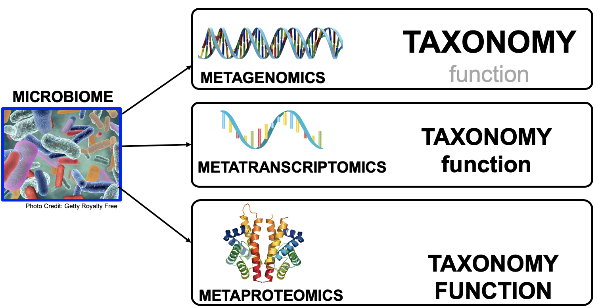

# Introduction
{:.no_toc}

Microbiomes play a critical role in host health, disease, and the environment. The study of microbiota and microbial communities has been facilitated by the evolution of technologies, specifically the sequencing techniques. We can now study the microbiome dynamics by investigating the DNA content (metagenomics), RNA expression (metatranscriptomics), protein expression (metaproteomics) or small molecules (metabolomics):


New generations of sequencing platforms coupled to numerous bioinformatics tools have led to a spectacular technological progress in metagenomics and metatranscriptomics to investigate complex microorganism communities. These techniques are giving insight into taxonomic profiles and genomic components of microbial communities. Metagenomics is packed with information about the present taxonomies in a microbiome, but do not tell much about important functions. That is where metatranscriptomics and metaproteomics play a big part.



In this tutorial, we will use **metatranscriptomics** data from time-serie analysis of a microbial community inside a bioreactor (): 3 replicates over 7 time points. RNAs were enriched by rRNA depletion and treated with DNAse and library was prepared with the TruSeq stranded RNA sample preparation, which included the production of a cDNA library.

For each of the 21 samples, we extracted the community structures and information given the [metatranscriptomics tutorial]({{ site.baseurl }}):

1. preprocess with quality control and filtering
2. extract and analyze the community structure (taxonomic information)
2. extract and analyze the community functions (functional information)
3. combine taxonomic and functional information to offer insights into taxonomic contribution to a function or functions expressed by a particular taxonomy.

We would like in this tutorial compare the results over the time serie and the replicates. 

> ###  Workflow also applicable to metagenomics data
> The approach with the tools described here can also apply to metagenomics data.
{: .comment}

> ### Agenda
>
> In this tutorial, we will cover:
>
> 1. TOC
> {:toc}
>
{: .agenda}

# Comparative analysis of the community structures

## Data upload

To save us time, we already ran MetaPhlAn2. We will now import the outputs of MetaPhlAn2 inside a collection, using the rule based uploader ([advanced tutorial]({{ site.baseurl }}{ % link topics/galaxy-data-manipulation/tutorials/upload-rules/tutorial.md %})) 

> ###  Hands-on: Data upload
>
> 1. Create a new history for this tutorial and give it a proper name
>
> 2. Click on the upload icon
> 3. Click on `Rule-based` on the top
>    - *"Upload data as:"*: `Collection(s)`
> 2. Paste the following tabular data right into the textbox
>
>    ```
>    dataset	sample	community_profile
>    SEM1b_T2A	SRX3777356	https://zenodo.org/api/files/84d7d6c9-2b7b-4569-87f6-dabc5ee42bc2/SEM1b_T2A_community.tabular
>    SEM1b_T2B	SRX3777345	https://zenodo.org/api/files/84d7d6c9-2b7b-4569-87f6-dabc5ee42bc2/SEM1b_T2B_community.tabular
>    SEM1b_T2C	SRX3777347	https://zenodo.org/api/files/84d7d6c9-2b7b-4569-87f6-dabc5ee42bc2/SEM1b_T2C_community.tabular
>    SEM1b_T3A	SRX3777349	https://zenodo.org/api/files/84d7d6c9-2b7b-4569-87f6-dabc5ee42bc2/SEM1b_T3A_community.tabular
>    SEM1b_T3B	SRX3777351	https://zenodo.org/api/files/84d7d6c9-2b7b-4569-87f6-dabc5ee42bc2/SEM1b_T3B_community.tabular
>    SEM1b_T3C	SRX3777353	https://zenodo.org/api/files/84d7d6c9-2b7b-4569-87f6-dabc5ee42bc2/SEM1b_T3C_community.tabular
>    SEM1b_T4A	SRX3777369	https://zenodo.org/api/files/84d7d6c9-2b7b-4569-87f6-dabc5ee42bc2/SEM1b_T4A_community.tabular
>    SEM1b_T4B	SRX3777371	https://zenodo.org/api/files/84d7d6c9-2b7b-4569-87f6-dabc5ee42bc2/SEM1b_T4B_community.tabular
>    SEM1b_T5A	SRX3777373	https://zenodo.org/api/files/84d7d6c9-2b7b-4569-87f6-dabc5ee42bc2/SEM1b_T5A_community.tabular
>    SEM1b_T5A	SRX3777375	https://zenodo.org/api/files/84d7d6c9-2b7b-4569-87f6-dabc5ee42bc2/SEM1b_T5A_community.tabular
>    SEM1b_T5B	SRX3777367	https://zenodo.org/api/files/84d7d6c9-2b7b-4569-87f6-dabc5ee42bc2/SEM1b_T5B_community.tabular
>    SEM1b_T5C	SRX3777343	https://zenodo.org/api/files/84d7d6c9-2b7b-4569-87f6-dabc5ee42bc2/SEM1b_T5C_community.tabular
>    SEM1b_T6A	SRX3777341	https://zenodo.org/api/files/84d7d6c9-2b7b-4569-87f6-dabc5ee42bc2/SEM1b_T6A_community.tabular
>    SEM1b_T6B	SRX3777339	https://zenodo.org/api/files/84d7d6c9-2b7b-4569-87f6-dabc5ee42bc2/SEM1b_T6B_community.tabular
>    SEM1b_T6C	SRX3777337	https://zenodo.org/api/files/84d7d6c9-2b7b-4569-87f6-dabc5ee42bc2/SEM1b_T6C_community.tabular
>    SEM1b_T7A	SRX3777335	https://zenodo.org/api/files/84d7d6c9-2b7b-4569-87f6-dabc5ee42bc2/SEM1b_T7A_community.tabular
>    SEM1b_T7B	SRX3777385	https://zenodo.org/api/files/84d7d6c9-2b7b-4569-87f6-dabc5ee42bc2/SEM1b_T7B_community.tabular
>    SEM1b_T7C	SRX3777383	https://zenodo.org/api/files/84d7d6c9-2b7b-4569-87f6-dabc5ee42bc2/SEM1b_T7C_community.tabular
>    SEM1b_T8A	SRX3777381	https://zenodo.org/api/files/84d7d6c9-2b7b-4569-87f6-dabc5ee42bc2/SEM1b_T8A_community.tabular
>    SEM1b_T8B	SRX3777379	https://zenodo.org/api/files/84d7d6c9-2b7b-4569-87f6-dabc5ee42bc2/SEM1b_T8B_community.tabular
>    SEM1b_T8C	SRX3777377	https://zenodo.org/api/files/84d7d6c9-2b7b-4569-87f6-dabc5ee42bc2/SEM1b_T8C_community.tabular
>    ```
>
> 5. Click on the `Build` button.
>
> 6. Expand the **Filter** menu and select `First or Last N Rows`
>    - *"Filter which rows?"*: `first`
>    - *"Filter how many rows?"*: `1`
>    - Click `Apply`
>
> 7. Expand the **Rules** menu and select `Add / Modify Column Definitions` 
>     - Expand `Add Definition` button and select `List Identifier(s)`
>       - *"List Identifier(s)"*: `A`
>     - Expand `Add Definition` button and select `URL`
>       - *"URL"*: `C`
>
> 8. Enter a name for the collection, e.g. `Community profile`
> 9. Click on `Upload`
>
{: .hands_on}

We have now a collection with 21 MetaPhlAn2 outputs: the 7 time points (T2 to T8) and the 3 replicates (A, B, and C).

## Visualization of the different samples with Krona

As we did with one sample, we can visualize all community structures with KRONA.

> ###  Hands-on: Interactive community structure visualization with KRONA
>
> 1. **Format MetaPhlAn2 output for Krona**  with
>    -  *"Input file (MetaPhlAN2 output)"*: `Community profile`
>
> 2. **Krona pie chart**  with
>    - *"What is the type of your input data"*: `Tabular`
>       -  *"Input file"*: output of **Format MetaPhlAn2 output for Krona**
>
> 3. Inspect the Krona output
{: .hands_on}

One HTML file has been generated in which each sample can be interactively inspected.

> ###  Questions
>
> 1. Do we find always the same taxons in the different time points? And the replicates?
> 2. What are the differences between the datasets
>
>    > ###  Solution
>    >
>    > 1. The same taxons are found the different time points and replicates:
>    >     - Bacteria (*kingdom*)
>    >       - Firmicutes (*phylum*)
>    >         - Clostridia (*class*)
>    >           - Clostridiales (*order*)
>    >             - Clostridiaceae (*family*)
>    >               - Clostridium (*genus*)
>    >                 - Clostridium thermocellum (*species*)
>    >           - Thermoanaerobacterales (*order*)
>    >               - Thermodesulfobiaceae (*family*)
>    >                 - Coprothermobacter (*genus*)
>    >       - Proteobacteria (*phylum*)
>    >         - Gammaproteobacteria (*class*)
>    >           - Enterobacteriales (*order*)
>    >             - Enterobacteriaceae (*family*)
>    >               - Escherichia (*genus*)
>    >     - Archaea (*kingdom*)
>    >       - Euryarchaeota (*phylum*)
>    >         - Methanobacteria (*class*)
>    >           - Methanobacteriales (*order*)
>    >             - Methanobacteriaceae (*family*)
>    >               - Methanothermobacter (*genus*)
>    >                 - Methanothermobacter thermautotrophicus (*species*)
>    >
>    > 2. The differences between the datasets are the abundance of the taxons.
>    {: .solution}
{: .question}

Differences of abundances between the different samples are difficult to compare using KRONA, specially the time points per replicates.

## Comparison of the taxon abundances between samples

We would like now to aggregate the abundances of taxon for each sample in one big table with all samples and some metadata.

> ###  Hands-on: Community structure aggregation
>
> 1. **Merge MetaPhlAn2 files**  with the following parameters:
>    -  *"MetaPhlAn2 output file to join"*: `Community profile`
>
>    In the generated file, the header of the column are dataset number and not the sample name. We will rename them by first removing the first 2 lines and adding one with sample names.
>
> 2. **Select last lines**  with the following parameters:
>    -  *"Text file"*: `Merged MetaPhlAn2 files`
>    - *"Operation"*: `Keep everything from this line on`
>    - *"Number of lines"*: `3`
>
> 3. Create a new file with headers:
>    1. Click on upload icon
>    2. Select `Paste/Fetch data`
>    3. Paste the following information
>
>      ```
>      ID	SEM1b_T2A	SEM1b_T2B	SEM1b_T2C	SEM1b_T3A	SEM1b_T3B	SEM1b_T3C	SEM1b_T4A	SEM1b_T4B	SEM1b_T4C	SEM1b_T5A	SEM1b_T5B	SEM1b_T5C	SEM1b_T6A	SEM1b_T6B	SEM1b_T6C	SEM1b_T7A	SEM1b_T7B	SEM1b_T7C	SEM1b_T8A	SEM1b_T8B	SEM1b_T8C
>      Time	T2	T2	T2	T3	T3	T3	T4	T4	T4	T5	T5	T5	T6	T6	T6	T7	T7	T7	T8	T8	T8
>      Replicate	A	B	C	A	B	C	A	B	C	A	B	C	A	B	C	A	B	C	A	B	C
>      ```
> 
>     4. Set *"Type"* to `tabular`
>     5. Click on `Start` to upload in the history
>
> 4. **Concatenate datasets**  with the following parameters:
>    -  *"Datasets to concatenate"*: `Pasted entry`
>    - In *"Dataset"*
>      - Click on *"Insert Dataset"*
>        -  *"Select"*: output of **Select last lines**
>
{: .hands_on}

We now have a table with for each sample the abundances of the different identified taxons, making the comparison easier.

> ###  Questions
>
> Are all the Phyla present in all samples as suggested before?
>
>    > ###  Solution
>    >
>    > Proteobacteria are in half of the samples, but we did not see that with KRONA plot
>    >
>    {: .solution}
{: .question}


### Visualization of the differences of the taxon abundances between samples

We would like to visualize that distribution now

> ###  Hands-on: Community structure comparison
>
> 3. **Generate heatmap with hierarchical clustering**  with the following parameters:
>    -  *"Input file of microbial relative abundances"*: `Concatenate datasets`
>    - *"Taxonomic level to display"*: `Genera only`
>    - *"Line width for the dendrograms"*: `0.5`
>
> 3. Inspect the output
{: .hands_on}

> ###  Questions
>
> 
>
> **TODO: add a question related to the generated heatmap**
>
>    > ###  Solution
>    >
>    > 1. 
>    >
>    {: .solution}
{: .question}

We can also visualize microbial abundances on a tree of life (also referred to as a phylogeny or cladogram) that captures their taxonomic (or phylogenetic) relatedness, using **GraPhlAn**.

To make sense, we will:
- select the top 100 most abundance clades to highlight
- set a minimum abundance threshold for clades to be annotated
- extract a minimum of 10 biomarkers
- select taxonomic levels 5 and 6 to be annotated within the tree
- select taxonomic level 7 to be used in the external legend
- set the minimum size of clades annotated as biomarkers to 1

> ###  Hands-on: Cladogram
>
> 1. **Export to GraPhlAn**  with the following parameters:
>    -  *"Input file"*: `Concatenate datasets`
>    - *"List which levels should be annotated in the tree"*: `5,6``
>    - *"List which levels should use the external legend for the annotation"*: `7`
>    - *"Minimum value of clades that are biomarkers"*: `1`
>    - *"Minimun abundance value for a clade to be annotated"*: `1.0`
>    - *"Number of clades to highlight"*: `100`
>    - *"Minimum number of biomarkers to extract"*: `10`
>    - *"Row number to use as metadata"*: `1`
> 
> 2. **Generation, personalization and annotation of tree**  with the following parameters:
>    -  *"Input tree"*: `Tree` (output of **Export to GraPhlAn**)
>    -  *"Annotation file"*: `Annotation` (output of **Export to GraPhlAn**)
>
> 3. **GraPhlAn**  with the following parameters:
>    -  *"Input tree"*: `Tree in PhyloXML`
>    - *"Output format"*: `PNG`
>
> 4. Inspect **GraPhlAn** output
{: .hands_on}

# Functional information