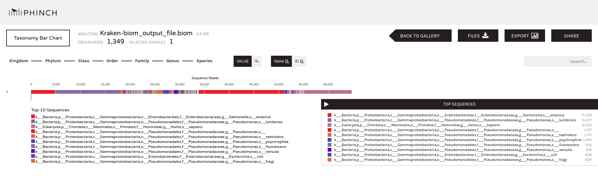
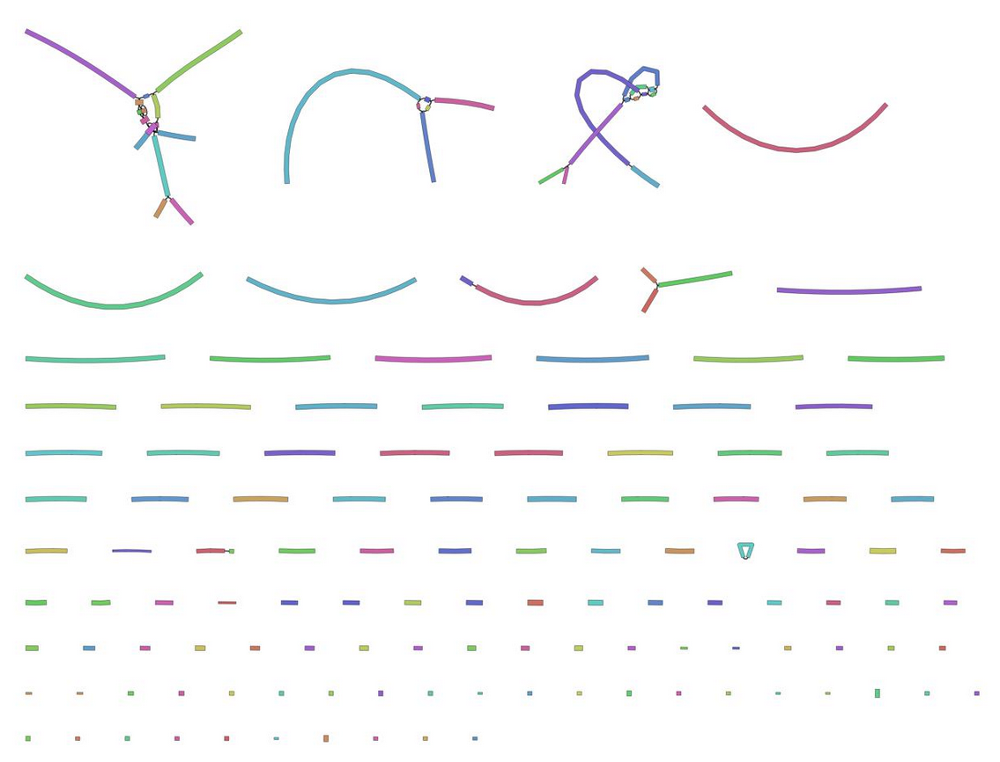
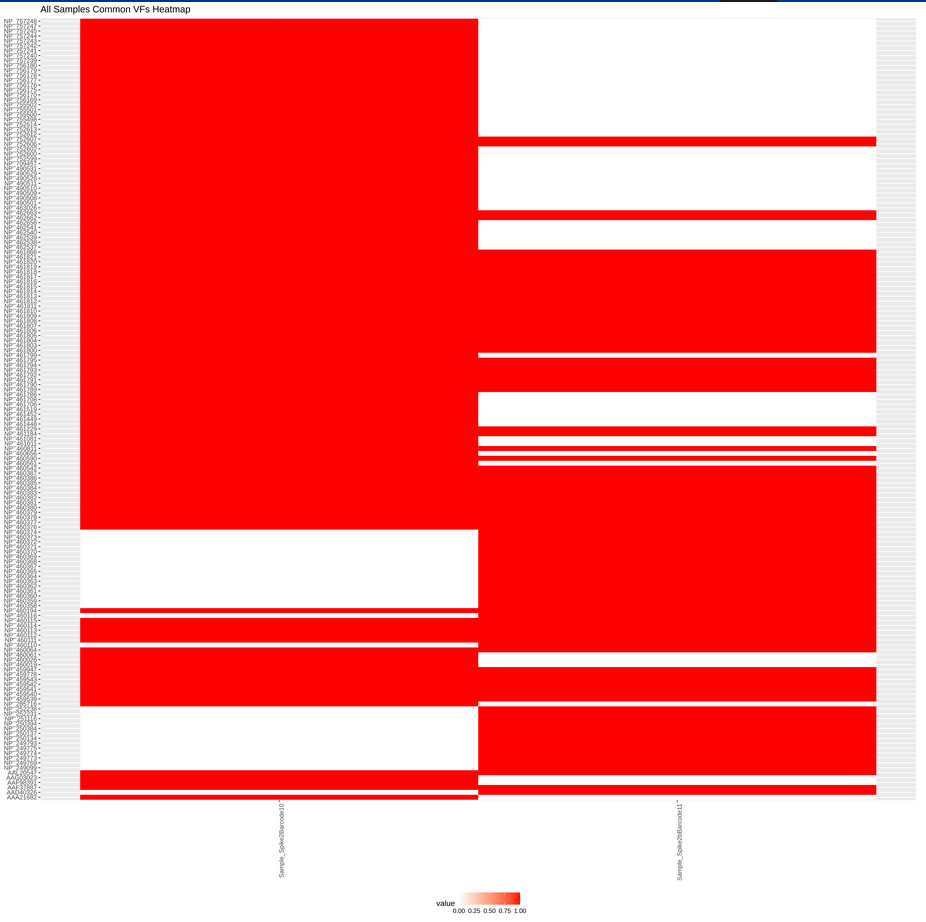
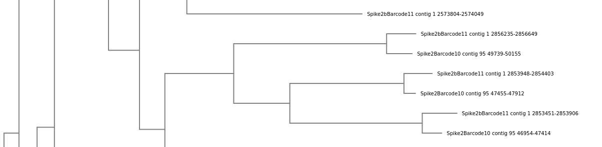

# Introduction

Food contamination with pathogens are a major burden on our society. In the year 2019, foodborne pathogens caused 137 diseases in Germany (BVL 2019). Globally, they affect an estimated 600 million people a year and impact socioeconomic development at different levels. These outbreaks are mainly due to _Salmonella spp._ followed by _Campylobacter spp._ and Noroviruses.

During the investigation of a foodborne outbreak, a microbiological analysis of the potentially responsible food vehicle is performed in order to detect the responsible pathogens and track the contamination source. By default, to detect bacterial pathogens in food, the European Regulation (CE) follows ISO standards, but alternative methods with equivalent performance are possible. Usually, foodborne pathogens are detected and identified by stepwise cultures on selective media and/or targeting specific genes with real-time PCRs. To characterise the detected strains, the current gold standard is Pulsed-field Gel Electrophoresis (PFGE) or Multiple-Locus Variable Number Tandem Repeat Analysis (MLVA). These techniques have some disadvantages. Whole Genome Sequencing (WGS) has been proposed as an alternative: detection of all genes with just one sequencing run, phylogenetic analysis to link cases, information on antimicrobial resistance genes, virulence, serotype, resistance to sanitizers, root cause, and other critical factors in one assay, including historical reference to pathogen emergence. WGS is more than a surveillance tool and was recommended by the European Centre for Disease Prevention and Control (ECDC) and the European Food Safety Authority (EFSA) for surveillance and outbreak investigation. WGS still requires isolation of the targeted pathogen, which is a time-consuming, not always straightforward nor successful process. Sequencing methods without prior isolation could solve this issue.

The evolution of sequencing techniques in the last decades has made possible the development of shotgun metagenomic sequencing, i.e. the direct sequencing of all DNA present in a sample. This approach gives an overview of the genomic composition of all cells in the sample, including the food source itself, the microbial community and any possible pathogens and their complete genetic information, without the need for prior isolation. Several studies have demonstrated the potential of shotgun metagenomics to identify and characterise pathogens and their functional characteristics (e.g. virulence genes) in naturally contaminated or spiked food samples. 

The currently available studies used Illumina sequencing, generating short reads. Longer read lengths, generated by third generation sequencing platforms such as Pacific Biosciences (PacBio) and Oxford [Nanopore](https://nanoporetech.com/) Technologies (ONT), make it easier and more practical to identify strains with fewer reads. MinION (from Oxford Nanopore) is a portable, real-time device for ONT sequencing. Several proof-of-principle studies have shown the utility of ONT long read sequencing from metagenomic samples for pathogen identification. 



The industry partner of the datasets used in this tutorial, [Biolytix](https://www.biolytix.ch/), developed a procedure to extract, sequence using MinION (ONT) sequencing and analyze a food sample for foodborne pathogen detection and contamination source tracking. However, the bioinformatics pipelines are not following the best practices for open data science, not straightforward and can only be manipulated by the original author, making it not scalable. Therefore, the aim of the Galaxy workflows (step by step) presented in this tutorial is to modernise, FAIRify and validate the bioinformatic pipeline using modern paradigms of data science to make it accessible and scalable.

In this tutorial, we will be presenting a Galaxy workflow its main goal is to agnostically detect and track pathogens in any Nanopore samples, for example food like chicken, cow, etc., and identifying contamination, by identifying which samples are contaminated with a pathogen, what exactly is this pathogen and what is the degree of its severity (its virulence factors).
> <agenda-title></agenda-title>
>
> In this tutorial, we will deal with:
>
> 1. TOC
> {:toc}
>
{: .agenda}

# Dataset

In this tutorial, the datasets are all generated by Biolytix. They are all chicken spiked with _Salmonella's_ different stains. The two barcodes we are using are; Barcode 10 Spike 2, which is chicken spiked with _Salmonella enterica subsp. enterica_ this dataset was generated on the 14th of July 2022, and Barcode 11 Spike 2b, which is chicken spiked with _Salmonella enterica subsp. houtenae_ generated on 20th of July 2022.


# Create your histories and Get Data

> <hands-on-title>Data upload</hands-on-title>
>
> 1. Create two new histories for this tutorial one for every sampling time
>
>    
>
> 2. Rename the histories to `Barcode10`and `Barcode11`
>
>    
>
> 3. Import the samples Fastq.qz files via link from [Zenodo]({{ page.zenodo_link }}) or Galaxy shared data libraries to each history respectively:
>
>    - `Barcode10Spike2`: to `Barcode10` history
>
>    ```text
>    {{ page.zenodo_link }}/files/Barcode10_Spike2.fastq.gz
>    ```
>
>    - `Barcode11Spike2b`: to `Barcode11` history
>
>    ```text
>    {{ page.zenodo_link }}/files/Barcode11_Spike2b.fastq.gz
>    ```
>
>    - From the shared data libraries in Galaxy, datasets can be also found under __Shared Data__ menu (top panel) then __Data libraries__, __Biolytix__, __Spiked__, __Salmonella__ then either __Spike2__, __Spike 2 Barcode 10 - 15 collapsed__ or __Spike2b__, __Spike2b Barcode 10-15 and unclassified Collapsed__
>
>    
>    
>
>
{: .hands_on}

# Choose your own tutorial


<div class="ShortVersion" markdown="1">

As you chose to follow the short version of the tutorial we will be running the five sub-workflows each for a complete task. Starting with pre-processing of the sequenced datasets till the pathogen tracking among all our chosen samples. In order to check the step by step tools used for every sub-workflow please follow the tutorial's LongVersion.

# Pre-Processing

Before starting any analysis, it is always a good idea to assess the quality of your input data and improve it when possible by trimming and filtering reads.

In this section we will run a sub-workflow that performs the following tasks with the following tools:
1. Assess the reads quality before and after improving it using [__FastQC__](https://www.bioinformatics.babraham.ac.uk/projects/fastqc/), [__NanoPlot__](https://github.com/wdecoster/NanoPlot) and  [__MultiQC__](https://multiqc.info/)
2. Trimming and filtering reads by length and quality, so quality improving using [__Porechop__](https://github.com/rrwick/Porechop) and [__Fastp__](https://academic.oup.com/bioinformatics/article/34/17/i884/5093234)
3. Remove all possible hosts sequences e.g. chicken, cow, etc. using [__Kraken2__](https://ccb.jhu.edu/software/kraken2/) with [__Kalamari__](https://github.com/lskatz/Kalamari) database, and table manipulation tools, which are **Filter Tabular** and **Filter Sequence By ID**.

We will run all these steps using a single sub-workflow, then discuss each step and the results in more detail. Please do the same steps for both histories; `Barcode10`and `Barcode11`.

> <hands-on-title>Pre-Processing</hands-on-title>
>
> 1. **Import the workflow** into Galaxy
>    - Copy the URL (e.g. via right-click) of [this workflow]({{ site.baseurl }}{{ page.dir }}workflows/nanopore_preprocessing.ga) or download it to your computer.
>    - Import the workflow into Galaxy
>
>    
>
> 2. Run **Workflow 1:  Nanopore Datasets - Pre-Processing**  using the following parameters:
>    - *"Send results to a new history"*: `No`
>    -  *"1: Nanopore reads of a sample"*: `Barcode10_Spike2`
>    - *"2: Host to Remove Specifier"*: `^.*Gallus|Homo|Bos.*$`
>    - *"5: Porechop Output format for the reads"*: `fastq.qz`
>
>    
>
> 3. Run the same sub-workflow for the second history, with `Barcode11_Spike2b` dataset instead
>
>    
>
{: .hands_on}

The workflow will take a little while to complete. Once tools have completed, the results will be available in your history for viewing. Note that only the most important outputs will be visible; intermediate files are hidden by default.

While you wait for the workflow to complete please continue reading in the next section(s) we will go into a bit more detail about what happens in each step of this sub-workflow and examine the results.

## Quality Control

During sequencing, errors are introduced, such as incorrect nucleotides being called. These are due to the technical limitations of each sequencing platform. Sequencing errors might bias the analysis and can lead to a misinterpretation of the data.

Sequence quality control is therefore an essential first step in your analysis.
In this tutorial we use similar tools as described in the tutorial ["Quality control"](), but more specific to Nanopore data:
- **FastQC** generates a web report that will aid you in assessing the quality of your data
- **NanoPlot** plotting tool for long read sequencing data and alignments
- **MultiQC** combines multiple **FastQC** reports into a single overview report, in this tutorial its used to check the quality of the sequencing before and after trimming and quality improvement
- **Porechop** and **Fastp** for trimming and filtering the reads based on the reads quality identified with **FastQC** and **Nanoplot**

For more information about how to interpret the plots generated by **FastQC** and **MultiQC**, please see our dedicated ["Quality control"]() Tutorial.

> <question-title></question-title>
>
> Inspect the webpage output from **MultiQC** for `Barcode10` history
>
> 1. How many sequences does **MultiQC** file before and after trimming has?
> 2. What is the quality score over the reads before and after trimming? And the mean score?
> 3. What is the importance of **FastQC**?
>
> > <solution-title></solution-title>
> >
> > 1. Before trimming the file has 114986 sequences and After trimming the file has 91434 sequences
> > 2. The "Per base sequence quality" is globally medium: the quality score stays between 20 and 25 over the reads after trimming, however, bad quality of reads is seen below 20 before trimming specially at the beginning and the end of the reads.
> >
> >    
> >
> > 3. After checking what is wrong, e.g. before trimming, we should think about the errors reported by **FastQC**: they may come from the type of sequencing or what we sequenced (check the ["Quality control" training](): [FastQC](https://www.bioinformatics.babraham.ac.uk/projects/fastqc/) for more details). However, despite these challenges, we can already see sequences getting slightly better after the trimming and filtering, so now we can proceed with our analyses.
> {: .solution}
{: .question}

## Hosts Filtering
Generally, we are not interested in the food (host) sequences that may or may not include the pathogen, rather we are interested only in the pathogen itself. That's why it's an important step to get rid of all hosts' sequences so we are only remained with sequences that might include a pathogen to start our analyses with. To use these workflows in real life you just run them on the samples you collected from a food factory, for example, at different time points and locations in the production process in order to spot when and where the pathogen entered the food and affect it. The workflow will filter out all possible hosts, e.g. meat, milk, chicken, etc., then remove all found hosts out, and keep the remaining sequences to test and track pathogens for. In this tutorial, we know in prior that the samples we have are __chicken__ spiked with **_Salmonella_** so we already know what will we get as a host and as a main pathogen.

In this tutorial we use the following tools and database to remove all hosts' sequences:
- **Kraken2** a taxonomic classification system, uses built-in and external libraries to classify the sequences into known taxon up to species level
- **Kalamari** is a database of completed assemblies for metagenomics-related tasks used widely in contamination and host filtering
- **Filter Tabular** provides tools for manipulation of tabular files, used to filter out all hosts sequences
- **Filter sequences by ID** by default it divides a FASTA, FASTQ or Standard Flowgram Format (SFF) file in two, those sequences with or without an ID present in the tabular file column(s) specified. You can optimze to have a single output file of just the matching records, or just the non-matching ones.

> <question-title></question-title>
>
> Inspect the webpage output from **MultiQC** for `Barcode10` history
>
> 1. What is the speices of the host?
> 2. How many sequences of this host is found?
>
> > <solution-title></solution-title>
> >
> > 1. _Gallus gallus_ (taxid 9031), which is chicken
> > 2. 836
> >
> {: .solution}
{: .question}

# Taxonomy Profiling
In this section we will know the different taxonomy levels in our samples starting from the kingdom level up to the species level and visualize that. It's important in our testcase to check what might be the species of a possible pathogen to be found, it gets us closer to the investigation as well as discovering possible multiple food infections if any existed.



If you have not yet noticed, in the previous sub-workflow we ran **Kraken2** along with **Kalamari** database, which is also a kind of taxonomy profiling but the database used is designed to include all possible hosts' sequences that we need to filter them out. In this sub-workflow, we will run **Kraken2** again but this time with one of its built-in databases **Standard PlusPF**, which can give us more insight of possible species that can be pathogenic candidates than **Kalamari**, you can test this yourself by comparing reports of both **Kraken2** runs.

In this section we will run a sub-workflow that performs the following tasks:
1. Taxonomy profiling using **Kraken2** with **Standard PlusPF** database
2. Generate a **kraken-biom** report needed for the interactive visualization using [__Kraken-Biom__](https://github.com/smdabdoub/kraken-biom)
3. Taxonomy visualization with one of the interactive tools in Galaxy, [__Phinch visualization__](https://www.phinch.org/), preferably to view its results on Chrome

> <details-title>Kraken2 and the k-mer approach for taxonomy classification</details-title>
>
> In the $$k$$-mer approach for taxonomy classification, we use a database containing DNA sequences of genomes whose taxonomy we already know. On a computer, the genome sequences are broken into short pieces of length $$k$$ (called $$k$$-mers), usually 30bp.
>
> **Kraken** examines the $$k$$-mers within the query sequence, searches for them in the database, looks for where these are placed within the taxonomy tree inside the database, makes the classification with the most probable position, then maps $$k$$-mers to the lowest common ancestor (LCA) of all genomes known to contain the given $$k$$-mer.
>
>  of the genomes that contain that k-mer in the database. The taxa associated with the sequence's k-mers, as well as the taxa's ancestors, form a pruned subtree of the general taxonomy tree, which is used for classification. In the classification tree, each node has a weight equal to the number of k-mers in the sequence associated with the node's taxon. Each root-to-leaf (RTL) path in the classification tree is scored by adding all weights in the path, and the maximal RTL path in the classification tree is the classification path (nodes highlighted in yellow). The leaf of this classification path (the orange, leftmost leaf in the classification tree) is the classification used for the query sequence. Source: ")
>
{: .details}

We will need one output from the **Pre-Processing** section, so if yours is still running or you get an error you can go on and upload it so you can start this workflow, the next hands-on is optional

> <hands-on-title>Optional Data upload</hands-on-title>
>
> 1. Import the quality processed samples fastqsanger files via link from [Zenodo]({{ page.zenodo_link }}) to each history respectively:
>
>    - `Nanopore_processed_sequenced_reads_Barcode10_Spike2`: to `Barcode10` history
>
>    ```text
>    {{ page.zenodo_link }}/files/Nanopore_processed_sequenced_reads_Barcode10_Spike2.fastqsanger
>    ```
>
>    - `Nanopore_processed_sequenced_reads_Barcode11_Spike2b`: to `Barcode11` history
>
>    ```text
>    {{ page.zenodo_link }}/files/Nanopore_processed_sequenced_reads_Barcode11_Spike2b.fastqsanger
>    ```
>
>    
>
{: .hands_on}


We will run all these steps using a single sub-workflow, then discuss each step and the results in more detail. Please do the same steps for both histories; `Barcode10`and `Barcode11`.

> <hands-on-title>Taxonomy Profiling</hands-on-title>
>
> 1. **Import the workflow** into Galaxy
>    - Copy the URL (e.g. via right-click) of [this workflow]({{ site.baseurl }}{{ page.dir }}workflows/nanopore_taxonomy_profiling_and_visualization.ga) or download it to your computer.
>    - Import the workflow into Galaxy
>
>    
>
> 2. Run **Workflow 2: Nanopore Datasets - Taxonomy Profiling and Visualization**  using the following parameters:
>    - *"Send results to a new history"*: `No`
>    -  *"Nanopore preprocessed reads"*: `Nanopore processed sequenced reads` the output from **Filter Sequence By ID** from the **Pre-Processing** sub-workflow
>    -  *"Optional for visualization: Sample Metadata"*: `leave empty`
>
>    
>
> 3. Run the same sub-workflow for the second history
>
>    
>
{: .hands_on}


While the workflow is running you can move on to the next section **Gene based pathogenic identification** and run the sub-workflow there as well, both workflows can work in parallel.

> <question-title></question-title>
>
> Inspect the **Kraken2** report for `Barcode10` history
>
> 1. What is the most found species?
> 2. What is the second most found species?
> 3. How many sequences are classified and How many are unclassified? 
> 4. What are the difference between **Kraken2** tool's report with **Kalamari** database and **Kraken2** tool's report with **Standard PlusPF** database with regards to the previous 3 questions
>
> > <solution-title></solution-title>
> >
> > 1. _Escherichia coli_ with 10,243 sequences
> > 2. _Salmonella enterica_ with 7,458 sequences
> > 3. 40,143 sequences are classified and 50,455 are unclassified
> > 4. a. with **Kalamari** database the most found species is _Escherichia coli_ with 12,577 sequences 
> > >  b. with **Kalamari** database the second most found species is _Salmonella enterica_ with 10,632 sequences
> > > >  c. with **Kalamari** database the number of classified sequences are 32,020 sequences and the unclassified sequences are 59,414 
> > > > > In conclusion, both databases are able to show the same results of the most common species. However, the number of the classified sequences with **Standard PlusPF** database is higher than **Kalamari** database and it would be even higher since all chicken sequences were removed before testing the **Standard PlusPF** database
> {: .solution}
{: .question}

## Visualization
In order to view the taxonomy profiling produced by **Kraken2** tool there are a lot of tools to be used afterwards such as **Krona pie chart**, however the species classified are a lot to be shown by this tool. For that reason, we have chosen the **Phinch visualization** interactive tool as it contains multiple visualization plots, it's interactive you can choose between different parameters, you can visualize each taxonomic level on its own, you can have your metadata of the samples represented along with the taxonomic visualization, download all plots for publications and a lot of other benefits. For later, you can check out [__Pavian__](https://academic.oup.com/bioinformatics/article/36/4/1303/5573755) tool as well it can replace **Phinch visualization** with similar outputs.

**Phinch visualization** needs a **Biom** file format as an input for that we needed the **Kraken-Biom** tool to convert the **Kraken2** tabular output into a Biom file. 

Now lets try the **Phinch visulization** tool running for `Barcode11` history

> <hands-on-title>Explore data interactively</hands-on-title>
>
> 1. Open interactive tool
>
>    
>
> 2. Click on **Proceed to Gallery** button on the top right of the opened webpage to see all the plots
>
{: .hands_on}

> <question-title></question-title>
>
> 1. What is the most found species?
> 2. What is the second most found species?
> 3. What's your favorite visualization plot?
>
> > <solution-title></solution-title>
> >
> > 1. Salmonella enterica with 17,309 sequences
> > 2. Pseudomonas lundensis with 13,227 sequences
> > 3. All of them are good visualization to the data but for us to answer these questions, we used **Taxonomy Bar chart**
> >
> >    
> >
> {: .solution}
{: .question}
 
# Gene based pathogenic identification
In this section we will analyze the sequences in our samples and identify [Virulence Factor (VF)](https://www.sciencedirect.com/topics/immunology-and-microbiology/virulence-factor), which are gene products, usually proteins, involved in pathogenicity by identifiying them we can call a pathogen and its severity level. We will also identify [Antimicrobial Resistance genes (AMR)](https://www.sciencedirect.com/topics/engineering/antibiotic-resistance-genes). These type of genes have three fundamental mechanisms of antimicrobial resistance that are enzymatic degradation of antibacterial drugs, alteration of bacterial proteins that are antimicrobial targets, and changes in membrane permeability to antibiotics, which will lead to not altering the target site and spread throughput the pathogenic bacteria decreasing the overall fitness of the host. Using [Multilocus Sequence Typing (MLST)](https://pubmlst.org/) database we will also determine the strain of the bacteria we are testing for pathogenicity. Never the less, we will be creating our **FASTA** and **Tabular** files that we will used later on to track and visualize our pathogenic identification throughout all samples, which is done in the **Pathogen Tracking among all samples** section and sub-workflow coming later in this tutorial.

In this section, we will run a sub-workflow with the following tools that perform the following tasks:
1. Genome assembly or creating contigs from our sequences using [__metaflye__](https://www.nature.com/articles/s41592-020-00971-x) then assembly polishing using [__medaka consensus pipeline__](https://github.com/nanoporetech/medaka) and visualizing the assembly graph using [__Bandage Image__](https://rrwick.github.io/Bandage/)
2. Generate an **MLST** report with **MLST** tool that scans genomes against PubMLST schemes
3. Generate reports with **AMR** genes and genes with **VF** using [__ABRicate__](https://github.com/tseemann/abricate)
4. Manipulate tabular reports to prepare them for **Pathogen Tracking among all samples** sub-workflow using tools such as **Cut**, **Replace**, **Add line to file**, **Compose text parameter value**, **Tabular-to-FASTA** and **Concatenate datasets**

We will run all these steps using a single sub-workflow, then discuss each step and the results in more detail. Please do the same steps for both histories; `Barcode10`and `Barcode11`.

But before we run the sub-workflow we need to upload one more file needed to create a report for this sub-workflow **MLST** analysis part.

> <hands-on-title>Data upload</hands-on-title>
>
> 1. Import a tabular file via link from [Zenodo]({{ page.zenodo_link }}) or Galaxy shared data libraries to both histories; `Barcode10` and `Barcode11`:
>
>    - `MLST_Report_with_Header.tabular`: For both histories; `Barcode10` and `Barcode11`
>
>    ```text
>    {{ page.zenodo_link }}/files/MLST_Report_with_Header.tabular
>    ```
>    - From the shared data libraries in Galaxy, datasets can be also found under __Shared Data__, __Data libraries__, then __Biolytix__
>
>    
>    
>
>
{: .hands_on}

We will also need one output from the **Pre-Processing** section, so if yours is still running or you get an error you can go on and upload it so you can start this workflow, the next hand-on is optional

> <hands-on-title>Optional Data upload</hands-on-title>
>
> 1. Import the quality processed samples fastqsanger files via link from [Zenodo]({{ page.zenodo_link }}) to each history respectively:
>
>    - `Nanopore_processed_sequenced_reads_Barcode10_Spike2`: to `Barcode10` history
>
>    ```text
>    {{ page.zenodo_link }}/files/Nanopore_processed_sequenced_reads_Barcode10_Spike2.fastqsanger
>    ```
>
>    - `Nanopore_processed_sequenced_reads_Barcode11_Spike2b`: to `Barcode11` history
>
>    ```text
>    {{ page.zenodo_link }}/files/Nanopore_processed_sequenced_reads_Barcode11_Spike2b.fastqsanger
>    ```
>
>    
>
{: .hands_on}

> <hands-on-title>Gene based Pathogenic Identification</hands-on-title>
>
> 1. **Import the workflow** into Galaxy
>    - Copy the URL (e.g. via right-click) of [this workflow]({{ site.baseurl }}{{ page.dir }}workflows/nanopore_gene_based_pathogenic_identification.ga) or download it to your computer.
>    - Import the workflow into Galaxy
>
>    
>
> 2. Run **Workflow 3: Nanopore Datasets - Gene based Pathogenic Identification**  using the following parameters:
>    - *"Send results to a new history"*: `No`
>    -  *"Nanopore Preprocessed reads"*: `Nanopore processed sequenced reads` the output from **Filter Sequence By ID**  from the **Pre-Processing** sub-workflow
>    - *"Sample ID"*: `Spike2Barcode10` or `Spike2bBarcode11` respectively to the history
>    -  *"MLST Report Header"*: `MLST Report with Header` file you have just uploaded to your history 
>
>    
>
> 3. Run the same sub-workflow for the second history
>
>    
>
{: .hands_on}

## Assembly
After improving the quality of the sequences in our samples and removing all the hosts' sequences, the next step is to analize them and search for pathogens. To do so, we have to first assemble our reads and create our contigs file, which will then be used to search databases for the presence of any pathogenic gene.

Recent advances in the challenging area of metagenomic bacterial genome assembly in the form of the specialized long-read metagenomic assembly program **metaflye** or **Flye** and sequence polishing tools such as **medaka** have made the inclusion of these analyses relatively simple. **Metaflye** and **medaka** facilitate the rapid assembly and correction of the long, error-prone Nanopore reads obtained from the metagenomic sequencing in multiple earlier work.

For visualizing the assembly graph output from **Flye** we have chosen **Bandage Image**.

> <question-title></question-title>
>
> Inspect **Flye** and **Medaka consensus pipeline** output results from `Barcode10` history
>
> 1. How many different contigs you got after **Flye** and how many are left after **Medaka consensus pipeline**, and what does that mean?
> 2. What is your result of the **Bandage Image**?
>
> > <solution-title></solution-title>
> >
> > 1. After **Flye** we have got 115 contigs and after **Medaka consensus pipeline** all 115 contigs were kept, which means that the quality of the **Flye** run was high that the polishing did not remove any of the contigs.
> > > 2.
> >
> >    
> >
> {: .solution}
{: .question}

## MLST Database
**MLST** tool is used to scan the [MLST](https://pubmlst.org/) database against PubMLST typing schemes. It's one of the analysis that you can perform on your dataset to determine the allele IDs you can also detect novel alleles. For the further analysis of this tutorial, this step is not important to identify pathogens and track them, however we wanted to show some of the analysis that one can use Galaxy in to understand more about the dataset as well as identifying the strain that might be a pathogen or not. 

The output file of the **MLST** tool is a tab-separated output file which contains: - the filename - the closest PubMLST scheme name - the ST (sequence type) - the allele IDs. 

> <question-title></question-title>
>
> Inspect **MLST**  results from `Barcode11` history
>
> 1. What is the the closest PubMLST typing scheme name detected by the tool?
>
> > <solution-title></solution-title>
> >
> > 1. senterica_achtman_2 ()
> >
> {: .solution}
{: .question}

## Antimicrobial Resistance Genes
Now, we want to search our samples' contigs for **AMR** genes for that we run **ABRicate** and choose the [__NCBI Bacterial Antimicrobial Resistance Gene Database (AMRFinderPlus)__](https://www.ncbi.nlm.nih.gov/pmc/articles/PMC6811410/) from the advanced options of the tool.

The tool will identify if there is an AMR found or not, if found then in which contig, in which location on the contig, what is the name of the exact product, what does it resist against and a lot of other information regarding the found **AMR**

> <question-title></question-title>
>
> Inspect **AMR Identified by NCBI** output files from `Barcode10`and `Barcode11` histories
>
> 1. How many **AMR** genes found in `Barcode10_Spike2` sample, what are they, give more details about them?
> 2. How many **AMR** genes found in `Barcode11_Spike2b` sample, what are they, give more details about them?
>
> > <solution-title></solution-title>
> >
> > 1. Only one **AMR** gene is found and it is tet(C), which resists [TETRACYCLINE](https://medlineplus.gov/druginfo/meds/a682098.html). It's found in contig 109 from the position 1634 till 2809, with 100% coverage, so 100% of gene is covered in this contig.
> > 2. No **AMR** genes are found by the database in `Barcode11_Spike2b` sample. 
> >
> {: .solution}
{: .question}

## Virulence Factor Database
In this step we return back to the main goal of the tutorial where we want to identify the pathogens, where we want to identify if the found bacteria in our samples is a bacteria pathogen or not. One of the ways to do that is to identify if the sequences include genes with a [Virulence Facor](https://www.ncbi.nlm.nih.gov/pmc/articles/PMC2646308/) or not, such that if the samples include genes with a Virulence Factor then its for sure a pathogen.
> <details-title>Bacteria Pathogen</details-title>
>
> A bacterial pathogen is usually defined as any bacterium that has the capacity to cause disease. Its ability to cause disease is called pathogenicity.
>
{: .details}

> <details-title> Virulence</details-title>
>
> Virulence provides a quantitative measure of the pathogenicity or the likelihood of causing disease.
>
{: .details}

> <details-title>Virulence Factors</details-title>
>
> Virulence factors refer to the properties (i.e., gene products) that enable a microorganism to establish itself on or within a host of a particular species and enhance its potential to cause disease. Virulence factors include bacterial toxins, cell surface proteins that mediate bacterial attachment, cell surface carbohydrates and proteins that protect a bacterium, and hydrolytic enzymes that may contribute to the pathogenicity of the bacterium.
>
{: .details}

For this step in the sub-workflow the tool **ABRicate** is chosen again but this time it's along with the [__VFDB__](https://pubmed.ncbi.nlm.nih.gov/26578559/) from the advanced options of the tool. 

> <question-title></question-title>
>
> Inspect **VFs of genes Identified by VFDB** output file from`Barcode10`and `Barcode11` histories
>
> 1. How many different **VFs** gene products found in `Barcode10_Spike2` sample?
> 2. How many different **VFs** gene products found in `Barcode11_Spike2b` sample?
>
> > <solution-title></solution-title>
> >
> > 1. 127
> > 2. 97
> >
> {: .solution}
{: .question}

# SNP based pathogenic identification

Here, we will be identifing variants in our samples compared to a reference genome. For example, if we want to test our samples if they include [_Campylobacter_ pathogenic strains](https://www.cdc.gov/campylobacter/index.html) or not, we will map our samples against the reference genome of the _Campylobacter_ species, and when we find variants in specific positions on the genome we look these positions up and see if these real variations would indicate a pathogen or not. Nevertheless, novel alleles can be also identified here, we might be identifing a new variant of the pathogen while running such a workflow. What we are refering to here is [single nucleotide polymorphisms (SNPs) calling](https://genome.sph.umich.edu/w/images/e/e6/Seqshop_may_2015_day2_snp_lecture_v2.pdf). In this section, we also build our consensus genome of our samples, so we can later build a Phylogenetic tree of all samples' full genomes and have an insight into events that occurred during same or different species of our samples' evolution.

In this training, we are testing _Salmonella enterica_ , which our samples are spiked with its different strains. So we will now upload to our histories the reference genome of [_S. enterica_](https://www.ncbi.nlm.nih.gov/genome/?term=txid99287[Organism:exp]) we got in prior from the [National Center for Biotechnology Information (NCBI) database](https://www.ncbi.nlm.nih.gov/).

In this section, we will run a sub-workflow that can run in parallel to **Taxonomy Profiling**, **Gene based pathogenic identification** and **Pathogen Tracking among all samples** sub-workflows, so feel free to run it in the time you are waiting for the other sub-workflows to finish running. 


> <hands-on-title>Data upload</hands-on-title>
>
> 1. Import a reference genome FASTA file via link from [Zenodo]({{ page.zenodo_link }}) or Galaxy shared data libraries to both histories; `Barcode10` and `Barcode11`:
>
>    - `Salmonella_Ref_genome.fna.gz`: For both histories; `Barcode10` and `Barcode11`
>
>    ```text
>    {{ page.zenodo_link }}/files/Salmonella_Ref_genome.fna.gz
>    ```
>    - From the shared data libraries in Galaxy, datasets can be also found under __Shared Data__, __Data libraries__, then __Biolytix__
>
>    
>    
>
{: .hands_on}

We will also need one output from the **Pre-Processing** section, so if yours is still running or you get an error you can go on and upload it so you can start this workflow, the next hand-on is optional

> <hands-on-title>Optional Data upload</hands-on-title>
>
> 1. Import the quality processed samples fastqsanger files via link from [Zenodo]({{ page.zenodo_link }}) to each history respectively:
>
>    - `Nanopore_processed_sequenced_reads_Barcode10_Spike2`: to `Barcode10` history
>
>    ```text
>    {{ page.zenodo_link }}/files/Nanopore_processed_sequenced_reads_Barcode10_Spike2.fastqsanger
>    ```
>
>    - `Nanopore_processed_sequenced_reads_Barcode11_Spike2b`: to `Barcode11` history
>
>    ```text
>    {{ page.zenodo_link }}/files/Nanopore_processed_sequenced_reads_Barcode11_Spike2b.fastqsanger
>    ```
>
>    
>
{: .hands_on}

> <hands-on-title>SNP based Pathogenic Identification</hands-on-title>
>
> 1. **Import the workflow** into Galaxy
>    - Copy the URL (e.g. via right-click) of [this workflow]({{ site.baseurl }}{{ page.dir }}workflows/nanopore_snp_based_pathogenetic_identification.ga) or download it to your computer.
>    - Import the workflow into Galaxy
>
>    
>
> 2. Run **Workflow 4: Nanopore Datasets - SNP based Pathogenic Identification**  using the following parameters:
>    - *"Send results to a new history"*: `No`
>    -  *"Nanopore Preprocessed reads"*: `Nanopore processed sequenced reads` the output from **Filter Sequence By ID** from the **Pre-Processing** sub-workflow
>    -  *"Reference Genome of Tested Strain/Pathogen"*: `Salmonella_Ref_genome.fna.gz` file you have just uploaded to your history 
>
>    
>
> 3. Run the same sub-workflow for the second history
>
>    
>
{: .hands_on}


## Variant Calling or SNP Calling

To identify variants, the following tools are used:

1. First we map to a reference genome of the species of the pathogen you want to test your samples against, we used **Minimap2** since our datasets are Nanopore. 
2. Then we indetify variants and single nucleotide variants using [__Clair3__](https://hpc.nih.gov/apps/Clair3.html), which is designed specifically for Nanopore datasets giving better results than other variant calling tools as well as its new and up-to-date. [__Medaka consensus tool__ and __medaka variant tool__](https://github.com/nanoporetech/medaka) can be also used instead of **Clair3**, they give similar results but they are much slower then **Clair3** and with much fewer tools' options. So we recommend **Clair3** that we used in this sub-workflow.
3. After that a normalization step to our variant calling output is needed, where we normalize indels; check if REF alleles in the output match the reference; split multiallelic sites into multiple rows; recover multiallelics from multiple rows using [__bcftools norm__](https://samtools.github.io/bcftools/bcftools.html).
4. Last but not least, we filter to keep only the pass and good quality variants, [__SnpSift Filter__](http://pcingola.github.io/SnpEff/) tool is used in our workflow where you can set any filtering expression to keep as per your experiment thresholds. [__LoFreq filter__](https://csb5.github.io/lofreq/) can be also used instead, both tools performs equal and fast results.
5. Finally, we will extract our tabular report where we keep specific fields in the output VCF, we used [__SnpSift Extract Fields__](http://pcingola.github.io/SnpEff/)

> <question-title></question-title>
>
> Now let's inspect the sub-workflow outputs together for `Barcode10` history
>
> 1. How many variants found in `Barcode10_Spike2` sample before and after quality filtering?
> 2. What is the Strain identified by the NCBI for the sample?
>
> > <solution-title></solution-title>
> >
> > 1. Before filtering: 2,652 and After filtering 2,489
> > 2. Strain [LT2](https://bacdive.dsmz.de/strain/5117), Known after we searched the Chroms. NCBI Reference Sequence: NC_003197.2
> {: .solution}
{: .question}

## Consensus Genome Building
For further anaylsis we have included one more step in this section, where we build the full genome of our samples. That can be used later to compare and relate samples together based on their full genome. In cases such as SARS-COV2 its important to do so in order to discover new outbreaks. In this example of the training its not really important to draw a tree of the full genomes of the samples as _Salmonella_ does not have such a speedy outbreak as SARS-COV2 does. However, we decided to include it in the workflow for any further analysis of the users if needed.

For this step we run [__bcftools consensus__](https://samtools.github.io/bcftools/bcftools.html).
> <question-title></question-title>
>
> Inspect **bcftools consensus** `Barcode11` history
>
> 1. How many sequences we got for the sample, what are they and why?
>
> > <solution-title></solution-title>
> >
> > 1. We got 2 sequences, the complete genome and the complete [plasmid](https://www.genome.gov/genetics-glossary/Plasmid) gemome. The tool uses the reference genome and the variants found to build the consensus genome of the sample, and the reference genome FASTA file we use includes two sequences a complete one and a plasmid complete one, so the tool constructed both sequences for us to choose from based on our further analysis.
> {: .solution}
{: .question}

# Pathogen Tracking among all samples
In this section, of the tutorial we will be grouping some outputs of all the samples together in one history, in order to track our **identified pathogens**, from the **Gene based pathogenic identification** section, through out the samples. So the sub-workflow of this section can run directly after the **Gene based pathogenic identification** sub-workflow runs have been finished for all the tested samples. 

In this part of the tutorial we will draw a [heatmap](https://www.cd-genomics.com/microbioseq/introduction-to-heatmap-a-visualized-tool-for-microbial-community-composition-analysis.html) of the identified genes with a **VF**, which indicates a pathogen, and visualize in which samples these genes can be found. We will also draw a [phylogenetic tree](https://www.sciencedirect.com/topics/medicine-and-dentistry/phylogenetic-tree) for each pathogenic gene detected, where we will relate the contigs of the samples together where this gene is found. By these two types of visualizations we can have an overview with all samples together and each gene on its own, how each samples are related to one another and which common pathogenic genes they share. Given the time of the sampling and the location one can easy identify using these graphes where and when the contamination has occurred among the different samples.

To achieve that we first need to copy some of the output datasets from **Gene based pathogenic identification** sub-workflow running for both `Barcode10`and `Barcode11` histories.

> <hands-on-title>Copy datasets from our two histories to a new history</hands-on-title>
>
> 1. Create a new history for for this part of the tutorial, where we will create collections from the results of the two samples' histories we had that are needed to track and visualize our found pathogens.
>
>    
>
> 2. Rename the history `Pathogen Tracking among all samples`
>
>    
>
> 3. Copy the following datasets from `Barcode10` history to the new created history, then copy the same files from `Barcode11` history to the new history too.
>
>     a. VFDB Accession
> >   b. VFDB Accession Tabular with SampleID as a header
> > > c. VFs ABRicate Sample Specific Formatted Tabular
> > > >  d. Sample Specific Contigs FASTA file
>
>    
>
> 4. Now let's create collections of the copied datasets in the new history
>    - In the new created history each two similar datasets are grouped in a collection. In a different example if you tested more samples so this collection will include all the same named files of all the tested different samples 
>    - We will group both `VFDB Accession` files into a collection and name it `VFDB Accession Column`
>    - We will group both `VFDB Accession Tabular with SampleID as a header` files into a collection and name `List of All Samples VFDB Accession Column with Sample ID Tabulars`
>    - We will group both `VFs ABRicate Sample Specific Formatted Tabular` files into a collection and name it `All Samples ABRicate Tabulars`
>    - We will group both `Sample Specific Contigs FASTA file` files into a collection and name it `All Samples Contigs Fasta files`
>
>    
>
{: .hands_on}

Optional hands-on: if you did not get your **Gene based pathogenic identification** section output files needed yet or you got an error with any, you can go on and upload them all or the ones missing from Zenodo so you can start this workflow, please don't forget to create the collections for them as explained in the pervious hands-on.

> <hands-on-title>Optional Data upload</hands-on-title>
>
> 1. Import all tabular and FASTA files needed for this section via link from [Zenodo]({{ page.zenodo_link }}) to the new created history:
>
>    ```text
>    {{ page.zenodo_link }}/files/VFDB_Accession_Barcode10_Spike2.tabular
>    {{ page.zenodo_link }}/files/VFDB_Accession_Barcode11_Spike2b.tabular
>    {{ page.zenodo_link }}/files/VFDB_Accession_Tabular_with_SampleID_as_a_header_Barcode10_Spike2.tabular
>    {{ page.zenodo_link }}/files/VFDB_Accession_Tabular_with_SampleID_as_a_header_Barcode11_Spike2b.tabular
>    {{ page.zenodo_link }}/files/VFs_ABRicate_Sample_Specific_Formated_Tabular_Barcode10_Spike2.tabular
>    {{ page.zenodo_link }}/files/VFs_ABRicate_Sample_Specific_Formated_Tabular_Barcode11_Spike2b.tabular
>    {{ page.zenodo_link }}/files/Sample_Specific_Contigs_FASTA_file_Barcode10_Spike2.fasta
>    {{ page.zenodo_link }}/files/Sample_Specific_Contigs_FASTA_file_Barcode11_Spike2b.fasta
>    ```
>
>    
>
{: .hands_on}

Now after preparing our inputs to the sub-workflow let's run it.

> <hands-on-title>All Samples Analysis</hands-on-title>
>
> 1. **Import the workflow** into Galaxy
>    - Copy the URL (e.g. via right-click) of [this workflow]({{ site.baseurl }}{{ page.dir }}workflows/nanopore_all_samples_phylogenetic_trees_and_heatmap.ga) or download it to your computer.
>    - Import the workflow into Galaxy
>
>    
>
> 2. Run **Workflow 5: Nanopore Datasets - Reports of All Samples along with Full genomes and VF genes Phylogenetic trees**  using the following parameters:
>    - *"Send results to a new history"*: `No`
>    -  *"All Samples Contigs Fasta files"*: `All Samples Contigs Fasta files` the collection you have just created
>    -  *"All Samples ABRicate Tabulars"*: `All Samples ABRicate Tabulars` the collection you have just created
>    -  *"List of All Samples VFDB Accession Column with Sample ID Tabulars"*: `List of All Samples VFDB Accession Column with Sample ID Tabulars` the collection you have just created
>    -  *"VFDB Accession Column"*: `VFDB Accession Column` the collection you have just created
>
>    
>
{: .hands_on}

In this sub-workflow we run the following tools:
1. For heatmap **Heatmap w ggplot** tool is used along with other tabular manipulating tools, such as **Advanced Cut**, **Paste**, **Transpose**, **Replace**, **Multi-Join** and **Add line to file**. All these tools are used to adjust the two of the input tabular files we copied to out history which are `VFs ABRicate Sample Specific Formatted Tabular` and `Sample Specific Contigs FASTA file` from both samples.

2. For the phylogenetic trees, for each bacteria pathogen gene found in the samples we use **ClustalW** for [Multiple Sequence Alignment (MSA)](https://www.sciencedirect.com/topics/medicine-and-dentistry/multiple-sequence-alignment) needed before constructing a phylogenetic tree, for the tree itself we use **FASTTREE** and **Newick Display** to visualize it. Also other table manipulation tools to adjust the other two input files to draw the trees such as, **Cut**, **Split by group**, **Filter sequence by ID**, **Remove beginning** and **bedtools getfasta**.

## Heatmap
A heatmap is one of the visualization techniques that can give you a complete overview of all the samples together and whether or not a certain value exists. In this tutorial, we use the heatmap to visualize all samples aside and check which common bacteria pathogen genes are found in samples and which is only found in one of them. 

> <question-title></question-title>
>
> Now let's see how your heatmap looks like, you can zoom-in and out in your Galaxy history.
>
> >    
>
> 1. Mention three of the common bacteria pathogen genes found in both samples
> 2. Mention one that is only found in `Barcode10_Spike2` sample and one that is only found in `Barcode11_Spike2b`
> 3. How can the differences in the found **VF** bacteria pathogen genes between the two samples be interpreted?
>
> > <solution-title></solution-title>
> >
> > 1. Three of the bacteria pathogen genes with a **VF** identified by the **VFDB** that are common in both samples are with the following accession number: **NP_461810**, **NP_461809** and **NP_459541**
> > 2. **AAF98391** is only found in Barcode 10 sample and **NP_460360** is only found in Barcode 11 sample
> > 3. Both samples are spiked with the same species of the pathogen; _S. enterica_, but not the same strain. `Barcode10_Spike2` sample is spiked with **_S. enterica_** strain and `Barcode11_Spike2b` with _S. enterica subsp. houtenae_ strain. This can be the main cause of the most similarities and the few difference found bacteria pathogen genes between both of the samples. Other factors such as the time and location of the sampling may cause other differences. By knowing the metadata of the samples inputted for the sub-workflows in real life we can understand what actually happened. We can have samples with no pathogen found then we start detecting genes from the 7th or 8th sample, then we can identify where and when the pathogen entered the host, and stop the cause of that
> >
> {: .solution}
{: .question}

## Phylogenetic Trees
Phylogenetic trees are nice ways to track all the bacteria pathogen genes one by one in all samples. So we will have a tree for every found gene, this tree will indicate which contigs the gene is found in all samples and relating these contigs together based on their topology. With such trees we can identify on which location of the sequences sample genome the pathogentic gene is found and is it the same or different location as the other samples. We can also see how many samples have these genes in common and accordingly track our contamination. 

> <question-title></question-title>
>
> Now let's see how your trees for the bacteria pathogen gene with accession IDs: **AAF98391**, **NP_249099** and **NP_460111** look like. To access that go to the output Newick Genes: Tree Graphs Collection
>
>
> 1. In which samples and contigs **AAF98391** gene is found? 
> 2. In which samples and contigs **NP_249099** gene is found? 
> 3. In which samples and contigs **NP_460111** gene is found? 
>
> > <solution-title></solution-title>
> >
> > 1. Only in `Barcode10_Spike2` sample only in Contig 23
> >    
> > 2. Only in `Barcode11_Spike2b` sample only in Contig 2
> >    
> > 3. In both samples; `Barcode10_Spike2` Contig 95 and `Barcode11_Spike2b` Contig 1
> >    
> >
> {: .solution}
{: .question}

</div>


<div class="LongVersion" markdown="1">

As you chose to follow the long version of the tutorial we will be running a tool by tool to complete a full task in every section. Starting with pre-processing of the sequenced datasets till the pathogen tracking among all our chosen samples. If want a faster version, where you run a workflow for every task instead, you can switch to the short version of the tutorial.

# Pre-Processing

Before starting any analysis, it is always a good idea to assess the quality of your input data and improve it when possible by trimming and filtering reads.

In this section we will run the following tools that performs the following tasks:
1. Assess the reads quality before and after improving it using [__FastQC__](https://www.bioinformatics.babraham.ac.uk/projects/fastqc/), [__NanoPlot__](https://github.com/wdecoster/NanoPlot) and  [__MultiQC__](https://multiqc.info/)
2. Trimming and filtering reads by length and quality, so quality improving using [__Porechop__](https://github.com/rrwick/Porechop) and [__Fastp__](https://academic.oup.com/bioinformatics/article/34/17/i884/5093234)
3. Remove all possible hosts sequences e.g. chicken, cow, etc. using [__Kraken2__](https://ccb.jhu.edu/software/kraken2/) with [__Kalamari__](https://github.com/lskatz/Kalamari) database, and table manipulation tools, which are **Filter Tabular** and **Filter Sequence By ID** to separate the sequences into without hosts sequences and only host sequences, so we move one to the next section with the sequences without the host.

We will run the following tools one by one, then discuss each step and the results in more detail. Please do the same steps for both histories; `Barcode10`and `Barcode11`.


> <hands-on-title> Pre-Processing </hands-on-title>
>
> 1.  with the following parameters:
>    - *"Select multifile mode"*: `batch`
>        - *"Type of the file(s) to work on"*: `fastq`
>            -  *"Data input files"*: `Barcode10Spike2` or `Barcode11Spike2b`  (Input dataset with respect to which history)
>
>
> 2.  with the following parameters:
>    -  *"Raw read data from your current history"*: `Barcode10Spike2` or `Barcode11Spike2b`  (Input dataset with respect to which history)
>
> 3.  with the following parameters:
>    -  *"Input FASTA/FASTQ"*: `Barcode10Spike2` or `Barcode11Spike2b`  (Input dataset with respect to which history)
>
> 4.  with the following parameters:
>    - *"Single-end or paired reads"*: `Single-end`
>        -  *"Input 1"*: `outfile` (output of **Porechop** )
>
> 5.  with the following parameters:
>    - *"Select multifile mode"*: `batch`
>        - *"Type of the file(s) to work on"*: `fastq`
>            -  *"Data input files"*: `out1` (output of **fastp** )
>
> 6.  with the following parameters:
>    -  *"Raw read data from your current history"*: `out1` (output of **fastp** )
>
> 7.  with the following parameters:
>    - *"Single or paired reads"*: `Single`
>        -  *"Input sequences"*: `out1` (output of **fastp** )
>    - *"Print scientific names instead of just taxids"*: `Yes`
>    - In *"Create Report"*:
>        - *"Print a report with aggregrate counts/clade to file"*: `Yes`
>        - *"Format report output like Kraken 1's kraken-mpa-report"*: `Yes`
>        - *"Report counts for ALL taxa, even if counts are zero"*: `Yes`
>        - *"Report minimizer data"*: `Yes`
>    - *"Select a Kraken2 database"*: `kalamari`
>
> 8.  with the following parameters:
>    - In *"Results"*:
>        -  *"Insert Results"*
>            - *"Which tool was used generate logs?"*: `FastQC`
>                - In *"FastQC output"*:
>                    -  *"Insert FastQC output"*
>                        -  *"FastQC output"*: `text_file` (output of **FastQC** )
>
> 9.  with the following parameters:
>    -  *"Tabular Dataset to filter"*: `output` (output of **Kraken2** )
>    - In *"Filter Tabular Input Lines"*:
>        -  *"Insert Filter Tabular Input Lines"*
>            - *"Filter By"*: `by regex expression matching`
>                - *"regex pattern"*: `{'id': 1, 'output_name': 'output'}`
>                - *"action for regex match"*: `include line if pattern found`
>
> 10.  with the following parameters:
>    -  *"Sequence file to be filtered"*: `out1` (output of **fastp** )
>    - *"Filter using the ID list from"*: `tabular file`
>        -  *"Tabular file containing sequence identifiers"*: `output` (output of **Filter Tabular** )
>        - *"Column(s) containing sequence identifiers"*: `c2`
>    - *"Output positive matches, negative matches, or both?"*: `Both positive matches (ID on list) and negative matches (ID not on list), as two files`
>    - *"Advanced Options"*: `Hide Advanced Options`
>
{: .hands_on}

The tools will take a little while to complete. Once tools have completed, the results will be available in your history for viewing. Note that only the most important outputs will be visible; intermediate files are hidden by default.

While you wait for the tools to complete running please continue reading in the next section(s) we will go into a bit more detail about what happens in each tool and examine the results.

## Quality Control

During sequencing, errors are introduced, such as incorrect nucleotides being called. These are due to the technical limitations of each sequencing platform. Sequencing errors might bias the analysis and can lead to a misinterpretation of the data.

Sequence quality control is therefore an essential first step in your analysis.
In this tutorial we use similar tools as described in the tutorial ["Quality control"](), but more specific to Nanopore data:
- **FastQC** generates a web report that will aid you in assessing the quality of your data
- **NanoPlot** plotting tool for long read sequencing data and alignments
- **MultiQC** combines multiple **FastQC** reports into a single overview report, in this tutorial its used to check the quality of the sequencing before and after trimming and quality improvement
- **Porechop** and **Fastp** for trimming and filtering the reads based on the reads quality identified with **FastQC** and **Nanoplot**

For more information about how to interpret the plots generated by **FastQC** and **MultiQC**, please see our dedicated ["Quality control"]() Tutorial.

> <question-title></question-title>
>
> Inspect the webpage output from **MultiQC** for `Barcode10` history
>
> 1. How many sequences does **MultiQC** file before and after trimming has?
> 2. What is the quality score over the reads before and after trimming? And the mean score?
> 3. What is the importance of **FastQC**?
>
> > <solution-title></solution-title>
> >
> > 1. Before trimming the file has 114986 sequences and After trimming the file has 91434 sequences
> > 2. The "Per base sequence quality" is globally medium: the quality score stays between 20 and 25 over the reads after trimming, however, bad quality of reads is seen below 20 before trimming specially at the beginning and the end of the reads.
> >
> >    
> >
> > 3. After checking what is wrong, e.g. before trimming, we should think about the errors reported by **FastQC**: they may come from the type of sequencing or what we sequenced (check the ["Quality control" training](): [FastQC](https://www.bioinformatics.babraham.ac.uk/projects/fastqc/) for more details). However, despite these challenges, we can already see sequences getting slightly better after the trimming and filtering, so now we can proceed with our analyses.
> {: .solution}
{: .question}

## Hosts Filtering
Generally, we are not interested in the food (host) sequences that may or may not include the pathogen, rather we are interested only in the pathogen itself. That's why it's an important step to get rid of all hosts' sequences so we are only remained with sequences that might include a pathogen to start our analyses with. To use all these tools represted in the whole tutorial in real life you just run them on the samples you collected from a food factory, for example, at different time points and locations in the production process in order to spot when and where the pathogen entered the food and affect it. In this section we will filter out all possible hosts, e.g. meat, milk, chicken, etc., then remove all found hosts out, and keep the remaining sequences to test and track pathogens for. In this tutorial, we know in prior that the samples we have are __chicken__ spiked with **_Salmonella_** so we already know what will we get as a host and as a main pathogen. 

In this tutorial we use the following tools and database to remove all hosts' sequences:
- **Kraken2** a taxonomic classification system, uses built-in and external libraries to classify the sequences into known taxon up to species level
- **Kalamari** is a database of completed assemblies for metagenomics-related tasks used widely in contamination and host filtering
- **Filter Tabular** provides tools for manipulation of tabular files, used to filter out all hosts sequences
- **Filter sequences by ID** by default it divides a FASTA, FASTQ or Standard Flowgram Format (SFF) file in two, those sequences with or without an ID present in the tabular file column(s) specified. You can optimze to have a single output file of just the matching records, or just the non-matching ones.

> <question-title></question-title>
>
> Inspect the webpage output from **MultiQC** for `Barcode10` history
>
> 1. What is the speices of the host?
> 2. How many sequences of this host is found?
>
> > <solution-title></solution-title>
> >
> > 1. _Gallus gallus_ (taxid 9031), which is chicken
> > 2. 836
> >
> {: .solution}
{: .question}

# Taxonomy Profiling
In this section we will know the different taxonomy levels in our samples starting from the kingdom level up to the species level and visualize that. It's important in our testcase to check what might be the species of a possible pathogen to be found, it gets us closer to the investigation as well as discovering possible multiple food infections if any existed.



If you have not yet noticed, in the previous section we ran **Kraken2** along with **Kalamari** database, which is also a kind of taxonomy profiling but the database used is designed to include all possible hosts' sequences that we need to filter them out. In this section, we will run **Kraken2** again but this time with one of its built-in databases **Standard PlusPF**, which can give us more insight of possible species that can be pathogenic candidates than **Kalamari**, you can test this yourself by comparing reports of both **Kraken2** runs.

In this section we will run the following tools that performs the following tasks:
1. Taxonomy profiling using **Kraken2** with **Standard PlusPF** database
2. Generate a **kraken-biom** report needed for the interactive visualization using [__Kraken-Biom__](https://github.com/smdabdoub/kraken-biom)
3. Taxonomy visualization with one of the interactive tools in Galaxy, [__Phinch visualization__](https://www.phinch.org/), preferably to view its results on Chrome

> <details-title>Kraken2 and the k-mer approach for taxonomy classification</details-title>
>
> In the $$k$$-mer approach for taxonomy classification, we use a database containing DNA sequences of genomes whose taxonomy we already know. On a computer, the genome sequences are broken into short pieces of length $$k$$ (called $$k$$-mers), usually 30bp.
>
> **Kraken** examines the $$k$$-mers within the query sequence, searches for them in the database, looks for where these are placed within the taxonomy tree inside the database, makes the classification with the most probable position, then maps $$k$$-mers to the lowest common ancestor (LCA) of all genomes known to contain the given $$k$$-mer.
>
>  of the genomes that contain that k-mer in the database. The taxa associated with the sequence's k-mers, as well as the taxa's ancestors, form a pruned subtree of the general taxonomy tree, which is used for classification. In the classification tree, each node has a weight equal to the number of k-mers in the sequence associated with the node's taxon. Each root-to-leaf (RTL) path in the classification tree is scored by adding all weights in the path, and the maximal RTL path in the classification tree is the classification path (nodes highlighted in yellow). The leaf of this classification path (the orange, leftmost leaf in the classification tree) is the classification used for the query sequence. Source: ")
>
{: .details}

We will need one output from the **Pre-Processing** section, so if yours is still running or you get an error you can go on and upload it so you can start directly the tools in this section, the next hands-on is optional

> <hands-on-title>Optional Data upload</hands-on-title>
>
> 1. Import the quality processed samples fastqsanger files via link from [Zenodo]({{ page.zenodo_link }}) to each history respectively:
>
>    - `Nanopore_processed_sequenced_reads_Barcode10_Spike2`: to `Barcode10` history
>
>    ```text
>    {{ page.zenodo_link }}/files/Nanopore_processed_sequenced_reads_Barcode10_Spike2.fastqsanger
>    ```
>
>    - `Nanopore_processed_sequenced_reads_Barcode11_Spike2b`: to `Barcode11` history
>
>    ```text
>    {{ page.zenodo_link }}/files/Nanopore_processed_sequenced_reads_Barcode11_Spike2b.fastqsanger
>    ```
>
>    
>
{: .hands_on}

We will run the following tools one by one, then discuss each tool and the results in more detail. Please do the same steps for both histories; `Barcode10`and `Barcode11`.

> <hands-on-title> Taxonomy Profiling </hands-on-title>
>
> 1.  with the following parameters:
>    - *"Single or paired reads"*: `Single`
>        -  *"Input sequences"*: `negative matches (ID not on list)` (output of **Filter sequences by ID**  last tool we ran in the first section, **Pre-Processing**)
>    - In *"Create Report"*:
>        - *"Print a report with aggregrate counts/clade to file"*: `Yes`
>    - *"Select a Kraken2 database"*: `Prebuilt Refseq indexes:  PlusPF (Standard plus protozoa and fungi) (Version:  2022-06-07 - Downloaded: 2022-09-04T165121Z)`
>
> 2.  with the following parameters:
>    -  *"Input files to Kraken-biom: Kraken report output file(s)"*: `report_output` (output of **Kraken2** )
>    -  *"Sample metadata file"*: `leave empty` (Optional input dataset)
>    - *"Do you want to create an OTU IDs file"*: `Yes`
>    - *"Output Format"*: `JSON`
>
> 3.  with the following parameters:
>    -  *"Biom1 dataset"*: `biomOutput` (output of **Kraken-biom** )
>
{: .hands_on}

While the tools are running you can move on to the next section **Gene based pathogenic identification** and run the tools there as well, both tools can work in parallel.

> <question-title></question-title>
>
> Inspect the **Kraken2** report for `Barcode10` history
>
> 1. What is the most found species?
> 2. What is the second most found species?
> 3. How many sequences are classified and How many are unclassified? 
> 4. What are the difference between **Kraken2** tool's report with **Kalamari** database and **Kraken2** tool's report with **Standard PlusPF** database with regards to the previous 3 questions
>
> > <solution-title></solution-title>
> >
> > 1. _Escherichia coli_ with 10,243 sequences
> > 2. _Salmonella enterica_ with 7,458 sequences
> > 3. 40,143 sequences are classified and 50,455 are unclassified
> > 4. a. with **Kalamari** database the most found species is _Escherichia coli_ with 12,577 sequences 
> > >  b. with **Kalamari** database the second most found species is _Salmonella enterica_ with 10,632 sequences
> > > >  c. with **Kalamari** database the number of classified sequences are 32,020 sequences and the unclassified sequences are 59,414 
> > > > > In conclusion, both databases are able to show the same results of the most common species. However, the number of the classified sequences with **Standard PlusPF** database is higher than **Kalamari** database and it would be even higher since all chicken sequences were removed before testing the **Standard PlusPF** database
> {: .solution}
{: .question}

## Visualization
In order to view the taxonomy profiling produced by **Kraken2** tool there are a lot of tools to be used afterwards such as **Krona pie chart**, however the species classified are a lot to be shown by this tool. For that reason, we have chosen the **Phinch visualization** interactive tool as it contains multiple visualization plots, it's interactive you can choose between different parameters, you can visualize each taxonomic level on its own, you can have your metadata of the samples represented along with the taxonomic visualization, download all plots for publications and a lot of other benefits. For later, you can check out [__Pavian__](https://academic.oup.com/bioinformatics/article/36/4/1303/5573755) tool as well it can replace **Phinch visualization** with similar outputs.

**Phinch visualization** needs a **Biom** file format as an input for that we needed the **Kraken-Biom** tool to convert the **Kraken2** tabular output into a Biom file. 

Now lets try the **Phinch visulization** tool running for `Barcode11` history

> <hands-on-title>Explore data interactively</hands-on-title>
>
> 1. Open interactive tool
>
>    
>
> 2. Click on **Proceed to Gallery** button on the top right of the opened webpage to see all the plots
>
{: .hands_on}

> <question-title></question-title>
>
> 1. What is the most found species?
> 2. What is the second most found species?
> 3. What's your favorite visualization plot?
>
> > <solution-title></solution-title>
> >
> > 1. Salmonella enterica with 17,309 sequences
> > 2. Pseudomonas lundensis with 13,227 sequences
> > 3. All of them are good visualization to the data but for us to answer these questions, we used **Taxonomy Bar chart**
> >
> >    
> >
> {: .solution}
{: .question}
 
# Gene based pathogenic identification
In this section we will analyze the sequences in our samples and identify [Virulence Factor (VF)](https://www.sciencedirect.com/topics/immunology-and-microbiology/virulence-factor), which are gene products, usually proteins, involved in pathogenicity by identifiying them we can call a pathogen and its severity level. We will also identify [Antimicrobial Resistance genes (AMR)](https://www.sciencedirect.com/topics/engineering/antibiotic-resistance-genes). These type of genes have three fundamental mechanisms of antimicrobial resistance that are enzymatic degradation of antibacterial drugs, alteration of bacterial proteins that are antimicrobial targets, and changes in membrane permeability to antibiotics, which will lead to not altering the target site and spread throughput the pathogenic bacteria decreasing the overall fitness of the host. Using [Multilocus Sequence Typing (MLST)](https://pubmlst.org/) database we will also determine the strain of the bacteria we are testing for pathogenicity. Never the less, we will be creating our **FASTA** and **Tabular** files that we will used later on to track and visualize our pathogenic identification throughout all samples, which is done in the **Pathogen Tracking among all samples** section and tools coming later in this tutorial.

In this section, we will run the following tools that perform the following tasks:
1. Genome assembly or creating contigs from our sequences using [__metaflye__](https://www.nature.com/articles/s41592-020-00971-x) then assembly polishing using [__medaka consensus pipeline__](https://github.com/nanoporetech/medaka) and visualizing the assembly graph using [__Bandage Image__](https://rrwick.github.io/Bandage/)
2. Generate an **MLST** report with **MLST** tool that scans genomes against PubMLST schemes
3. Generate reports with **AMR** genes and genes with **VF** using [__ABRicate__](https://github.com/tseemann/abricate)
4. Manipulate tabular reports to prepare them for **Pathogen Tracking among all samples** section such as **Cut**, **Replace**, **Add line to file**, **Compose text parameter value**, **Tabular-to-FASTA** and **Concatenate datasets**

We will run all the following tools, then discuss each step and the results in more detail. **Please do the same steps for both histories**; `Barcode10`and `Barcode11`.

But before we run the following tool we need to upload one more file needed to create a report for this section **MLST** analysis part.

> <hands-on-title>Data upload</hands-on-title>
>
> 1. Import a tabular file via link from [Zenodo]({{ page.zenodo_link }}) or Galaxy shared data libraries to both histories; `Barcode10` and `Barcode11`:
>
>    - `MLST_Report_with_Header.tabular`: For both histories; `Barcode10` and `Barcode11`
>
>    ```text
>    {{ page.zenodo_link }}/files/MLST_Report_with_Header.tabular
>    ```
>    - From the shared data libraries in Galaxy, datasets can be also found under __Shared Data__, __Data libraries__, then __Biolytix__
>
>    
>    
>
>
{: .hands_on}

We will also need one output from the **Pre-Processing** section, so if yours is still running or you get an error you can go on and upload it so you can start directly the tools in this section, the next hand-on is optional

> <hands-on-title>Optional Data upload</hands-on-title>
>
> 1. Import the quality processed samples fastqsanger files via link from [Zenodo]({{ page.zenodo_link }}) to each history respectively:
>
>    - `Nanopore_processed_sequenced_reads_Barcode10_Spike2`: to `Barcode10` history
>
>    ```text
>    {{ page.zenodo_link }}/files/Nanopore_processed_sequenced_reads_Barcode10_Spike2.fastqsanger
>    ```
>
>    - `Nanopore_processed_sequenced_reads_Barcode11_Spike2b`: to `Barcode11` history
>
>    ```text
>    {{ page.zenodo_link }}/files/Nanopore_processed_sequenced_reads_Barcode11_Spike2b.fastqsanger
>    ```
>
>    
>
{: .hands_on}

> <hands-on-title> Gene based Pathogenic Identification </hands-on-title>
>
> 1.  with the following parameters:
>    -  *"Input reads"*: `negative matches (ID not on list)` (output of **Filter sequences by ID**  last tool we ran in the first section, **Pre-Processing**)
>    - *"Mode"*: `Nanopore HQ (--nano-hq)`
>    - *"Perform metagenomic assembly"*: `Yes`
>    - *"Reduced contig assembly coverage"*: `Disable reduced coverage for initial disjointing assembly`
>
> 2.  with the following parameters:
>    - In *"components"*:
>        -  *"Insert components"*
>            - *"Choose the type of parameter for this field"*: `Text Parameter`
>                - *"Enter text that should be part of the computed value"*: `Spike2Barcode10` or `Spike2bBarcode11` respectively to the history (a sample id)
>        -  *"Insert components"*
>            - *"Choose the type of parameter for this field"*: `Text Parameter`
>                - *"Enter text that should be part of the computed value"*: `_$1`
>
> 3.  with the following parameters:
>    -  *"Select basecalls"*: `negative matches (ID not on list)` (output of **Filter sequences by ID**  last tool we ran in the first section, **Pre-Processing**)
>    -  *"Select assembly"*: `consensus` (output of **Flye** )
>    - *"Select model"*: `r941_min_hac_g507`
>    - *"Select output file(s)"*: `select all`
>
> 4.  with the following parameters:
>    -  *"Graphical Fragment Assembly"*: `assembly_gfa` (output of **Flye** )
>
> 5.  with the following parameters:
>    -  *"Input file (Fasta, Genbank or EMBL file)"*: `out_consensus` (output of **medaka consensus pipeline** )
>    - In *"Advanced options"*:
>        - *"Database to use - default is 'resfinder'"*: `NCBI Bacterial Antimicrobial Resistance Reference Gene Database`
>
> 6.  with the following parameters:
>    -  *"Input file (Fasta, Genbank or EMBL file)"*: `out_consensus` (output of **medaka consensus pipeline** )
>    - In *"Advanced options"*:
>        - *"Database to use - default is 'resfinder'"*: `VFDB`
>
> 7.  with the following parameters:
>    -  *"Convert these sequences"*: `out_consensus` (output of **medaka consensus pipeline** )
>
> 8.  with the following parameters:
>    -  *""*: `out_consensus` (output of **medaka consensus pipeline** )
>    - *"Specify advanced parameters"*: `Yes, see full parameter list.`
>        - *"Output novel alleles"*: `Yes`
>        - *"Automatically set MLST scheme"*: `Automatic MLST scheme detection`
>
> 9.  with the following parameters:
>    - *"Cut columns"*: `c13`
>    -  *"From"*: `report` (output of the first **ABRicate**  run from step 5)
>
> 10.  with the following parameters:
>    - *"Cut columns"*: `c13`
>    -  *"From"*: `report` (output of second **ABRicate**  run from step 6)
>
> 11.  with the following parameters:
>    -  *"File to process"*: `report` (output of second **ABRicate**  run from step 6)
>    - In *"Find and Replace"*:
>        -  *"Insert Find and Replace"*
>            - *"Find pattern"*: `Sample_all_contigs`
>            - *"Replace with"*: `Spike2Barcode10` or `Spike2bBarcode11` respectively to the history (the sample ID)
>            - *"Replace all occurences of the pattern"*: `Yes`
>            - *"Ignore first line"*: `Yes`
>            - *"Find and Replace text in"*: `specific column`
>                - *"in column"*: `c1`
>        -  *"Insert Find and Replace"*
>            - *"Find pattern"*: `#FILE`
>            - *"Replace with"*: `SampleID`
>            - *"Replace all occurences of the pattern"*: `Yes`
>            - *"Find and Replace text in"*: `specific column`
>                - *"in column"*: `c1`
>        -  *"Insert Find and Replace"*
>            - *"Find pattern"*: `^(.+)$`
>            - *"Replace with"*: (the output of **Compose text parameter value** )
>            - *"Find-Pattern is a regular expression"*: `Yes`
>            - *"Replace all occurences of the pattern"*: `Yes`
>            - *"Ignore first line"*: `Yes`
>            - *"Find and Replace text in"*: `specific column`
>                - *"in column"*: `c2`
>    - **Rename** 
>     - `the tool's outfile` to `VFs ABRicate Sample Specific Formated Tabular`
>
> 12.  with the following parameters:
>    -  *"File to process"*: `output` (output of **FASTA-to-Tabular** )
>    - In *"Find and Replace"*:
>        -  *"Insert Find and Replace"*
>            - *"Find pattern"*: `^(.+)$`
>            - *"Replace with"*: (the output of **Compose text parameter value** )
>            - *"Find-Pattern is a regular expression"*: `Yes`
>            - *"Replace all occurences of the pattern"*: `Yes`
>            - *"Find and Replace text in"*: `specific column`
>                - *"in column"*: `c1`
>    - **Rename** 
>     - `the tool's outfile` to `Sample Specific Contigs Tabular file`
>
> 13.  with the following parameters:
>    -  *"File to process"*: `report` (output of **MLST** )
>    - In *"Replacement"*:
>        -  *"Insert Replacement"*
>            - *"in column"*: `c1`
>            - *"Find pattern"*: `.* all contigs`
>            - *"Replace with"*: `Spike2Barcode10` or `Spike2bBarcode11` respectively to the history (the sample ID)
>
> 14.  with the following parameters:
>    - *"text to add"*: `Spike2Barcode10` or `Spike2bBarcode11` respectively to the history (the sample ID)
>    -  *"input file"*: `out_file1` (output of the first **Cut**  from step 9)
>
> 15.  with the following parameters:
>    - *"text to add"*: `Spike2Barcode10` or `Spike2bBarcode11` respectively to the history (the sample ID)
>    -  *"input file"*: `out_file1` (output of the second **Cut**  from step 10)
>    - **Rename** 
>     - `the tool's outfile` to `VFDB Accession Tabular with SampleID as a header`
>
> 16.  with the following parameters:
>    -  *"Tab-delimited file"*: `outfile` (output of **Replace**  from step 12)
>    - *"Title column(s)"*: `c1`
>    - *"Sequence column"*: `c2`
>    - **Rename** 
>     - `the tool's outfile` to `Sample Specific Contigs FASTA file`
>
> 17.  with the following parameters:
>    -  *"Concatenate Dataset"*: `output` (Input dataset)
>    - In *"Dataset"*: `MLST_Report_with_Header.tabular` (file imported from Zenodo)
>        -  *"Insert Dataset"*
>            -  *"Select"*: `outfile` (output of **Replace Text** )
>
{: .hands_on}

## Assembly
After improving the quality of the sequences in our samples and removing all the hosts' sequences, the next step is to analize them and search for pathogens. To do so, we have to first assemble our reads and create our contigs file, which will then be used to search databases for the presence of any pathogenic gene.

Recent advances in the challenging area of metagenomic bacterial genome assembly in the form of the specialized long-read metagenomic assembly program **metaflye** or **Flye** and sequence polishing tools such as **medaka** have made the inclusion of these analyses relatively simple. **Metaflye** and **medaka** facilitate the rapid assembly and correction of the long, error-prone Nanopore reads obtained from the metagenomic sequencing in multiple earlier work.

For visualizing the assembly graph output from **Flye** we have chosen **Bandage Image**.

> <question-title></question-title>
>
> Inspect **Flye** and **Medaka consensus pipeline** output results from `Barcode10` history
>
> 1. How many different contigs you got after **Flye** and how many are left after **Medaka consensus pipeline**, and what does that mean?
> 2. What is your result of the **Bandage Image**?
>
> > <solution-title></solution-title>
> >
> > 1. After **Flye** we have got 115 contigs and after **Medaka consensus pipeline** all 115 contigs were kept, which means that the quality of the **Flye** run was high that the polishing did not remove any of the contigs.
> > > 2.
> >
> >    
> >
> {: .solution}
{: .question}

## MLST Database
**MLST** tool is used to scan the [MLST](https://pubmlst.org/) database against PubMLST typing schemes. It's one of the analysis that you can perform on your dataset to determine the allele IDs you can also detect novel alleles. For the further analysis of this tutorial, this step is not important to identify pathogens and track them, however we wanted to show some of the analysis that one can use Galaxy in to understand more about the dataset as well as identifying the strain that might be a pathogen or not. 

The output file of the **MLST** tool is a tab-separated output file which contains: - the filename - the closest PubMLST scheme name - the ST (sequence type) - the allele IDs. 

> <question-title></question-title>
>
> Inspect **MLST**  results from `Barcode11` history
>
> 1. What is the the closest PubMLST typing scheme name detected by the tool?
>
> > <solution-title></solution-title>
> >
> > 1. senterica_achtman_2 ()
> >
> {: .solution}
{: .question}

## Antimicrobial Resistance Genes
Now, we want to search our samples' contigs for **AMR** genes for that we run **ABRicate** and choose the [__NCBI Bacterial Antimicrobial Resistance Gene Database (AMRFinderPlus)__](https://www.ncbi.nlm.nih.gov/pmc/articles/PMC6811410/) from the advanced options of the tool.

The tool will identify if there is an AMR found or not, if found then in which contig, in which location on the contig, what is the name of the exact product, what does it resist against and a lot of other information regarding the found **AMR**

> <question-title></question-title>
>
> Inspect **AMR Identified by NCBI** output files from `Barcode10`and `Barcode11` histories
>
> 1. How many **AMR** genes found in `Barcode10_Spike2` sample, what are they, give more details about them?
> 2. How many **AMR** genes found in `Barcode11_Spike2b` sample, what are they, give more details about them?
>
> > <solution-title></solution-title>
> >
> > 1. Only one **AMR** gene is found and it is tet(C), which resists [TETRACYCLINE](https://medlineplus.gov/druginfo/meds/a682098.html). It's found in contig 109 from the position 1634 till 2809, with 100% coverage, so 100% of gene is covered in this contig.
> > 2. No **AMR** genes are found by the database in `Barcode11_Spike2b` sample. 
> >
> {: .solution}
{: .question}

## Virulence Factor Database
In this step we return back to the main goal of the tutorial where we want to identify the pathogens, where we want to identify if the found bacteria in our samples is a bacteria pathogen or not. One of the ways to do that is to identify if the sequences include genes with a [Virulence Facor](https://www.ncbi.nlm.nih.gov/pmc/articles/PMC2646308/) or not, such that if the samples include genes with a Virulence Factor then its for sure a pathogen.
> <details-title>Bacteria Pathogen</details-title>
>
> A bacterial pathogen is usually defined as any bacterium that has the capacity to cause disease. Its ability to cause disease is called pathogenicity.
>
{: .details}

> <details-title> Virulence</details-title>
>
> Virulence provides a quantitative measure of the pathogenicity or the likelihood of causing disease.
>
{: .details}

> <details-title>Virulence Factors</details-title>
>
> Virulence factors refer to the properties (i.e., gene products) that enable a microorganism to establish itself on or within a host of a particular species and enhance its potential to cause disease. Virulence factors include bacterial toxins, cell surface proteins that mediate bacterial attachment, cell surface carbohydrates and proteins that protect a bacterium, and hydrolytic enzymes that may contribute to the pathogenicity of the bacterium.
>
{: .details}

For this step the tool **ABRicate** is chosen again but this time it's along with the [__VFDB__](https://pubmed.ncbi.nlm.nih.gov/26578559/) from the advanced options of the tool. 

> <question-title></question-title>
>
> Inspect **VFs of genes Identified by VFDB** output file from`Barcode10`and `Barcode11` histories
>
> 1. How many different **VFs** gene products found in `Barcode10_Spike2` sample?
> 2. How many different **VFs** gene products found in `Barcode11_Spike2b` sample?
>
> > <solution-title></solution-title>
> >
> > 1. 127
> > 2. 97
> >
> {: .solution}
{: .question}

# SNP based pathogenic identification

Here, we will be identifing variants in our samples compared to a reference genome. For example, if we want to test our samples if they include [_Campylobacter_ pathogenic strains](https://www.cdc.gov/campylobacter/index.html) or not, we will map our samples against the reference genome of the _Campylobacter_ species, and when we find variants in specific positions on the genome we look these positions up and see if these real variations would indicate a pathogen or not. Nevertheless, novel alleles can be also identified here, we might be identifing a new variant of the pathogen while running such a workflow. What we are refering to here is [single nucleotide polymorphisms (SNPs) calling](https://genome.sph.umich.edu/w/images/e/e6/Seqshop_may_2015_day2_snp_lecture_v2.pdf). In this section, we also build our consensus genome of our samples, so we can later build a Phylogenetic tree of all samples' full genomes and have an insight into events that occurred during same or different species of our samples' evolution.

In this training, we are testing _Salmonella enterica_ , which our samples are spiked with its different strains. So we will now upload to our histories the reference genome of [_S. enterica_](https://www.ncbi.nlm.nih.gov/genome/?term=txid99287[Organism:exp]) we got in prior from the [National Center for Biotechnology Information (NCBI) database](https://www.ncbi.nlm.nih.gov/).

In this section, we will run tools that can run in parallel to **Taxonomy Profiling**, **Gene based pathogenic identification** and **Pathogen Tracking among all samples** sections' tools, so feel free to run it in the time you are waiting for the other tools to finish running. 


> <hands-on-title>Data upload</hands-on-title>
>
> 1. Import a reference genome FASTA file via link from [Zenodo]({{ page.zenodo_link }}) or Galaxy shared data libraries to both histories; `Barcode10` and `Barcode11`:
>
>    - `Salmonella_Ref_genome.fna.gz`: For both histories; `Barcode10` and `Barcode11`
>
>    ```text
>    {{ page.zenodo_link }}/files/Salmonella_Ref_genome.fna.gz
>    ```
>    - From the shared data libraries in Galaxy, datasets can be also found under __Shared Data__, __Data libraries__, then __Biolytix__
>
>    
>    
>
{: .hands_on}

We will also need one output from the **Pre-Processing** section, so if yours is still running or you get an error you can go on and upload it so you can start directly the tools in this section, the next hand-on is optional

> <hands-on-title>Optional Data upload</hands-on-title>
>
> 1. Import the quality processed samples fastqsanger files via link from [Zenodo]({{ page.zenodo_link }}) to each history respectively:
>
>    - `Nanopore_processed_sequenced_reads_Barcode10_Spike2`: to `Barcode10` history
>
>    ```text
>    {{ page.zenodo_link }}/files/Nanopore_processed_sequenced_reads_Barcode10_Spike2.fastqsanger
>    ```
>
>    - `Nanopore_processed_sequenced_reads_Barcode11_Spike2b`: to `Barcode11` history
>
>    ```text
>    {{ page.zenodo_link }}/files/Nanopore_processed_sequenced_reads_Barcode11_Spike2b.fastqsanger
>    ```
>
>    
>
{: .hands_on}

> <hands-on-title> SNP based Pathogenic Identification </hands-on-title>
>
> 1.  with the following parameters:
>    - *"Will you select a reference genome from your history or use a built-in index?"*: `Use a genome from history and build index`
>        -  *"Use the following dataset as the reference sequence"*: `Salmonella_Ref_genome.fna.gz` (Input dataset imported from Zenodo)
>    - *"Single or Paired-end reads"*: `Single`
>        -  *"Select fastq dataset"*: `negative matches (ID not on list)` (output of **Filter sequences by ID**  last tool we ran in the first section, **Pre-Processing**)
>    - In *"Alignment options"*:
>        - *"Customize spliced alignment mode?"*: `No, use profile setting or leave turned off`
>
> 2.  with the following parameters:
>    -  *"BAM/CRAM file input"*: `alignment_output` (output of **Map with minimap2** )
>    - *"Reference genome source"*: `History`
>        -  *"Reference genome"*: `Salmonella_Ref_genome.fna.gz` (Input dataset imported from Zenodo)
>    - *"Clair3 model"*: `Built-in`
>        - *"Built-in model"*: `r941_prom_hac_g360+g422`
>    - *"Restict variant calling to:"*: `Whole reference (unrestricted)`
>    - *"Optional additional output files"*: ``
>    - In *"Advanced parameters"*:
>        - *"Call with the following ploidy model"*: `haploid precise (--haploid_precise)`
>
> 3.  with the following parameters:
>    -  *"VCF/BCF Data"*: `merge_output` (output of **Clair3** )
>    - *"Choose the source for the reference genome"*: `Use a genome from the history`
>        -  *"Reference genome"*: `Salmonella_Ref_genome.fna.gz` (Input dataset imported from Zenodo)
>    - In *"Restrict all operations to"*:
>        - *"Regions"*: `Do not restrict to Regions`
>        - *"Targets"*: `Do not restrict to Targets`
>    - *""*: `uncompressed VCF`
>
> 4.  with the following parameters:
>    -  *"Input variant list in VCF format"*: `output_file` (output of **bcftools norm** )
>    - *"Type of filter expression"*: `Simple expression`
>        - *"Filter criteria"*: `(QUAL > 2)`
>    - *"Filter mode"*: `Retain selected variants, remove others`
>
> 5.  with the following parameters:
>    -  *"Variant input file in VCF format"*: `output` (output of **SnpSift Filter** )
>
> 6.  with the following parameters:
>    -  *"VCF/BCF Data"*: `output` (output of **SnpSift Filter** )
>    - *"Choose the source for the reference genome"*: `Use a genome from the history`
>        -  *"Reference genome"*: `Salmonella_Ref_genome.fna.gz` (Input dataset imported from Zenodo)
>
{: .hands_on}

## Variant Calling or SNP Calling

To identify variants, the following tools are used:

1. First we map to a reference genome of the species of the pathogen you want to test your samples against, we used **Minimap2** since our datasets are Nanopore. 
2. Then we indetify variants and single nucleotide variants using [__Clair3__](https://hpc.nih.gov/apps/Clair3.html), which is designed specifically for Nanopore datasets giving better results than other variant calling tools as well as its new and up-to-date. [__Medaka consensus tool__ and __medaka variant tool__](https://github.com/nanoporetech/medaka) can be also used instead of **Clair3**, they give similar results but they are much slower then **Clair3** and with much fewer tools' options. So we recommend **Clair3** that we used in this section.
3. After that a normalization step to our variant calling output is needed, where we normalize indels; check if REF alleles in the output match the reference; split multiallelic sites into multiple rows; recover multiallelics from multiple rows using [__bcftools norm__](https://samtools.github.io/bcftools/bcftools.html).
4. Last but not least, we filter to keep only the pass and good quality variants, [__SnpSift Filter__](http://pcingola.github.io/SnpEff/) tool is used in this section where you can set any filtering expression to keep as per your experiment thresholds. [__LoFreq filter__](https://csb5.github.io/lofreq/) can be also used instead, both tools performs equal and fast results.
5. Finally, we will extract our tabular report where we keep specific fields in the output VCF, we used [__SnpSift Extract Fields__](http://pcingola.github.io/SnpEff/)

> <question-title></question-title>
>
> Now let's inspect some tools' outputs together for `Barcode10` history
>
> 1. How many variants found in `Barcode10_Spike2` sample before and after quality filtering?
> 2. What is the Strain identified by the NCBI for the sample?
>
> > <solution-title></solution-title>
> >
> > 1. Before filtering: 2,652 and After filtering 2,489
> > 2. Strain [LT2](https://bacdive.dsmz.de/strain/5117), Known after we searched the Chroms. NCBI Reference Sequence: NC_003197.2
> {: .solution}
{: .question}

## Consensus Genome Building
For further anaylsis we have included one more step in this section, where we build the full genome of our samples. That can be used later to compare and relate samples together based on their full genome. In cases such as SARS-COV2 its important to do so in order to discover new outbreaks. In this example of the training its not really important to draw a tree of the full genomes of the samples as _Salmonella_ does not have such a speedy outbreak as SARS-COV2 does. However, we decided to include it in this tutorial for any further analysis of the users if needed.

For this step we run [__bcftools consensus__](https://samtools.github.io/bcftools/bcftools.html).
> <question-title></question-title>
>
> Inspect **bcftools consensus** `Barcode11` history
>
> 1. How many sequences we got for the sample, what are they and why?
>
> > <solution-title></solution-title>
> >
> > 1. We got 2 sequences, the complete genome and the complete [plasmid](https://www.genome.gov/genetics-glossary/Plasmid) gemome. The tool uses the reference genome and the variants found to build the consensus genome of the sample, and the reference genome FASTA file we use includes two sequences a complete one and a plasmid complete one, so the tool constructed both sequences for us to choose from based on our further analysis.
> {: .solution}
{: .question}

# Pathogen Tracking among all samples
In this section, of the tutorial we will be grouping some outputs of all the samples together in one history, in order to track our **identified pathogens**, found in the **Gene based pathogenic identification** section, through out the samples. So the tools used in this section can run directly after the tools in the **Gene based pathogenic identification** section have been finished for all the tested samples. 

In this part of the tutorial we will draw a [heatmap](https://www.cd-genomics.com/microbioseq/introduction-to-heatmap-a-visualized-tool-for-microbial-community-composition-analysis.html) of the identified genes with a **VF**, which indicates a pathogen, and visualize in which samples these genes can be found. We will also draw a [phylogenetic tree](https://www.sciencedirect.com/topics/medicine-and-dentistry/phylogenetic-tree) for each pathogenic gene detected, where we will relate the contigs of the samples together where this gene is found. By these two types of visualizations we can have an overview with all samples together and each gene on its own, how each samples are related to one another and which common pathogenic genes they share. Given the time of the sampling and the location one can easy identify using these graphes where and when the contamination has occurred among the different samples.

To achieve that we first need to copy some of the output datasets from **Gene based pathogenic identification** section for both `Barcode10`and `Barcode11` histories.

> <hands-on-title>Copy datasets from our two histories to a new history</hands-on-title>
> 1. Create a new history for for this part of the tutorial, where we will create collections from the results of the two samples' histories we had that are needed to track and visualize our found pathogens.
>
>    
>
> 2. Rename the history `Pathogen Tracking among all samples`
>
>    
>
> 3. Copy the following datasets from `Barcode10` history to the new created history, then copy the same files from `Barcode11` history to the new history too.
>
>     a. VFDB Accession
> >   b. VFDB Accession Tabular with SampleID as a header
> > > c. VFs ABRicate Sample Specific Formatted Tabular
> > > >  d. Sample Specific Contigs FASTA file
>
>    
>
> 4. Now let's create collections of the copied datasets in the new history
>    - In the new created history each two similar datasets are grouped in a collection. In a different example if you tested more samples so this collection will include all the same named files of all the tested different samples 
>    - We will group both `VFDB Accession` files into a collection and name it `VFDB Accession Column`
>    - We will group both `VFDB Accession Tabular with SampleID as a header` files into a collection and name `List of All Samples VFDB Accession Column with Sample ID Tabulars`
>    - We will group both `VFs ABRicate Sample Specific Formatted Tabular` files into a collection and name it `All Samples ABRicate Tabulars`
>    - We will group both `Sample Specific Contigs FASTA file` files into a collection and name it `All Samples Contigs Fasta files`
>
>    
>
{: .hands_on}

Optional hands-on: if you did not get your **Gene based pathogenic identification** section output files needed yet or you got an error with any, you can go on and upload them all or the ones missing from Zenodo so you can start directly the tools in this section, please don't forget to create the collections for them as explained in the pervious hands-on.

> <hands-on-title>Optional Data upload</hands-on-title>
>
> 1. Import all tabular and FASTA files needed for this section via link from [Zenodo]({{ page.zenodo_link }}) to the new created history:
>
>    ```text
>    {{ page.zenodo_link }}/files/VFDB_Accession_Barcode10_Spike2.tabular
>    {{ page.zenodo_link }}/files/VFDB_Accession_Barcode11_Spike2b.tabular
>    {{ page.zenodo_link }}/files/VFDB_Accession_Tabular_with_SampleID_as_a_header_Barcode10_Spike2.tabular
>    {{ page.zenodo_link }}/files/VFDB_Accession_Tabular_with_SampleID_as_a_header_Barcode11_Spike2b.tabular
>    {{ page.zenodo_link }}/files/VFs_ABRicate_Sample_Specific_Formated_Tabular_Barcode10_Spike2.tabular
>    {{ page.zenodo_link }}/files/VFs_ABRicate_Sample_Specific_Formated_Tabular_Barcode11_Spike2b.tabular
>    {{ page.zenodo_link }}/files/Sample_Specific_Contigs_FASTA_file_Barcode10_Spike2.fasta
>    {{ page.zenodo_link }}/files/Sample_Specific_Contigs_FASTA_file_Barcode11_Spike2b.fasta
>    ```
>
>    
>
{: .hands_on}

Now after preparing our inputs to the tools let's run them, and while waiting for them to finish you can jump after this hands-on for more explanation of the tools and what we are doing in every step.

> <hands-on-title> Pathogen Tracking Among all Samples </hands-on-title>
>
> 1.  with the following parameters:
>    -  *"Collection of files to collapse into single dataset"*: `All Samples Contigs Fasta files` (Input dataset collection)
>    - *"Prepend File name"*: `Yes`
>
> 2.  with the following parameters:
>    -  *"Collection of files to collapse into single dataset"*: `All Samples ABRicate Tabulars` (Input dataset collection)
>    - *"Keep one header line"*: `Yes`
>    - *"Prepend File name"*: `Yes`
>
> 3.  with the following parameters:
>    -  *"Collection of files to collapse into single dataset"*: `VFDB Accession Column` (Input dataset collection)
>    - *"Keep one header line"*: `Yes`
>    - *"Prepend File name"*: `Yes`
>
> 4.  with the following parameters:
>    -  *"File to split"*: `output` (output of **Collapse Collection**  from step 2)
>    - *"on column"*: `c13`
>    - *"Include header in splits?"*: `Yes`
>
> 5.  with the following parameters:
>    - *"Cut columns"*: `c2,c3,c4`
>    -  *"From"*: `output` (output of **Collapse Collection**  from step 2)
>
> 6.  with the following parameters:
>    - *"text to add"*: `All_VFs`
>    -  *"input file"*: `output` (output of **Collapse Collection**  from step 3)
>
> 7.  with the following parameters:
>    -  *"Sequence file to be filtered"*: `output` (output of **Collapse Collection**  from step 1)
>    - *"Filter using the ID list from"*: `tabular file`
>        -  *"Tabular file containing sequence identifiers"*: `split_output` (output of **Split by group** )
>        - *"Column(s) containing sequence identifiers"*: `c2`
>    - *"Output positive matches, negative matches, or both?"*: `Just positive matches (ID on list), as a single file`
>    - *"Advanced Options"*: `Show Advanced Options`
>
> 8.  with the following parameters:
>    -  *"from"*: `out_file1` (output of **Cut** )
>
> 9.  with the following parameters:
>    -  *"File to join"*: `outfile` (output of **Add line to file** )
>    -  *"add additional file"*: `List of All Samples VFDB Accession Column with Sample ID Tabulars` (Input dataset collection)
>    - *"Column with values to preserve"*: `c1`
>    - *"Add header line to the output file"*: `Yes`
>    - *"Input files contain a header line (as first line)"*: `Yes`
>    - *"Ignore duplicated keys"*: `Yes`
>
> 10.  with the following parameters:
>    -  *"BED/bedGraph/GFF/VCF/EncodePeak file"*: `out_file1` (output of **Remove beginning** )
>    - *"Choose the source for the FASTA file"*: `History`
>        -  *"FASTA file"*: `output_pos` (output of **Filter sequences by ID** )
>
> 11.  with the following parameters:
>    -  *"File to process"*: `outfile` (output of **Multi-Join** )
>    - In *"Find and Replace"*:
>        -  *"Insert Find and Replace"*
>            - *"Find pattern"*: `dataset_(.*?)_`
>            - *"Replace with"*: `Sample_`
>            - *"Find-Pattern is a regular expression"*: `Yes`
>            - *"Replace all occurences of the pattern"*: `Yes`
>            - *"Find and Replace text in"*: `entire line`
>        -  *"Insert Find and Replace"*
>            - *"Find pattern"*: `(\S+)`
>            - *"Replace with"*: `Acc_$1`
>            - *"Find-Pattern is a regular expression"*: `Yes`
>            - *"Replace all occurences of the pattern"*: `Yes`
>            - *"Case-Insensitive search"*: `Yes`
>            - *"Ignore first line"*: `Yes`
>            - *"Find and Replace text in"*: `entire line`
>
> 12.  with the following parameters:
>    -  *"File to cut"*: `outfile` (output of **Multi-Join** )
>    - *"Cut by"*: `fields`
>        - *"List of Fields"*: `c1`
>
> 13.  with the following parameters:
>    -  *"FASTA file"*: `output` (output of **bedtools getfasta** )
>    - *"Data type"*: `DNA nucleotide sequences`
>    - *"Output alignment format"*: `FASTA format`
>    - *"Output complete alignment (or specify part to output)"*: `Complete alignment`
>
> 14.  with the following parameters:
>    -  *"File to process"*: `outfile` (output of **Replace**  from step 11)
>    - In *"Find and Replace"*:
>        -  *"Insert Find and Replace"*
>            - *"Find pattern"*: `Acc_0`
>            - *"Replace with"*: `0`
>            - *"Replace all occurences of the pattern"*: `Yes`
>            - *"Case-Insensitive search"*: `Yes`
>            - *"Ignore first line"*: `Yes`
>            - *"Find and Replace text in"*: `entire line`
>
> 15.  with the following parameters:
>    - *"Aligned sequences file (FASTA or Phylip format)"*: `fasta`
>        -  *"FASTA file"*: `output` (output of **ClustalW** )
>        - *"Set starting tree(s)"*: `No starting trees`
>    - *"Protein or nucleotide alignment"*: `Nucleotide`
>    - *"Show advanced options"*: `No`
>
> 16.  with the following parameters:
>    -  *"File to process"*: `outfile` (output of **Replace**  from step 14)
>    - In *"Find and Replace"*:
>        -  *"Insert Find and Replace"*
>            - *"Find pattern"*: `Acc_\S*`
>            - *"Replace with"*: `1`
>            - *"Find-Pattern is a regular expression"*: `Yes`
>            - *"Replace all occurences of the pattern"*: `Yes`
>            - *"Ignore first line"*: `Yes`
>            - *"Find and Replace text in"*: `entire line`
>
> 17.  with the following parameters:
>    -  *"Newick file"*: `output` (output of **FASTTREE** )
>    - *"Branch support"*: `Hide branch support`
>    - *"Branch length"*: `Hide branch length`
>    - *"Image width"*: `2000`
>
> 18.  with the following parameters:
>    -  *"File to cut"*: `outfile` (output of **Replace**  from step 16)
>    - *"Operation"*: `Discard`
>    - *"Cut by"*: `fields`
>        - *"List of Fields"*: `c1,2`
>
> 19.  with the following parameters:
>    -  *"Paste"*: `output` (output of **Advanced Cut**  from step 12)
>    -  *"and"*: `output` (output of **Advanced Cut**  from step 18)
>
> 19.  with the following parameters:
>    -  *"Input tabular dataset"*: `out_file1` (output of **Paste** )
>
> 20.  with the following parameters:
>    -  *"Select table"*: `out_file` (output of **Transpose** )
>    - *"Select input dataset options"*: `Dataset with header and row names`
>        - *"Select column, for row names"*: `c1`
>    - *"Plot title"*: `All Samples Common VFs Heatmap`
>    - In *"Output Options"*:
>        - *"width of output"*: `15.0`
>        - *"height of output"*: `17.0`
>
{: .hands_on}

In this section we run the following tools:
1. For heatmap **Heatmap w ggplot** tool is used along with other tabular manipulating tools, such as **Advanced Cut**, **Paste**, **Transpose**, **Replace**, **Multi-Join** and **Add line to file**. All these tools are used to adjust the two of the input tabular files we copied to out history which are `VFs ABRicate Sample Specific Formatted Tabular` and `Sample Specific Contigs FASTA file` from both samples.

2. For the phylogenetic trees, for each bacteria pathogen gene found in the samples we use **ClustalW** for [Multiple Sequence Alignment (MSA)](https://www.sciencedirect.com/topics/medicine-and-dentistry/multiple-sequence-alignment) needed before constructing a phylogenetic tree, for the tree itself we use **FASTTREE** and **Newick Display** to visualize it. Also other table manipulation tools to adjust the other two input files to draw the trees such as, **Cut**, **Split by group**, **Filter sequence by ID**, **Remove beginning** and **bedtools getfasta**.

## Heatmap
A heatmap is one of the visualization techniques that can give you a complete overview of all the samples together and whether or not a certain value exists. In this tutorial, we use the heatmap to visualize all samples aside and check which common bacteria pathogen genes are found in samples and which is only found in one of them. 

> <question-title></question-title>
>
> Now let's see how your heatmap looks like, you can zoom-in and out in your Galaxy history.
>
> >    
>
> 1. Mention three of the common bacteria pathogen genes found in both samples
> 2. Mention one that is only found in `Barcode10_Spike2` sample and one that is only found in `Barcode11_Spike2b`
> 3. How can the differences in the found **VF** bacteria pathogen genes between the two samples be interpreted?
>
> > <solution-title></solution-title>
> >
> > 1. Three of the bacteria pathogen genes with a **VF** identified by the **VFDB** that are common in both samples are with the following accession number: **NP_461810**, **NP_461809** and **NP_459541**
> > 2. **AAF98391** is only found in Barcode 10 sample and **NP_460360** is only found in Barcode 11 sample
> > 3. Both samples are spiked with the same species of the pathogen; _S. enterica_, but not the same strain. `Barcode10_Spike2` sample is spiked with **_S. enterica_** strain and `Barcode11_Spike2b` with _S. enterica subsp. houtenae_ strain. This can be the main cause of the most similarities and the few difference found bacteria pathogen genes between both of the samples. Other factors such as the time and location of the sampling may cause other differences. By knowing the metadata of the samples inputted for the tools in real life we can understand what actually happened. We can have samples with no pathogen found then we start detecting genes from the 7th or 8th sample, then we can identify where and when the pathogen entered the host, and stop the cause of that
> >
> {: .solution}
{: .question}

## Phylogenetic Trees
Phylogenetic trees are nice ways to track all the bacteria pathogen genes one by one in all samples. So we will have a tree for every found gene, this tree will indicate which contigs the gene is found in all samples and relating these contigs together based on their topology. With such trees we can identify on which location of the sequences sample genome the pathogentic gene is found and is it the same or different location as the other samples. We can also see how many samples have these genes in common and accordingly track our contamination. 

> <question-title></question-title>
>
> Now let's see how your trees for the bacteria pathogen gene with accession IDs: **AAF98391**, **NP_249099** and **NP_460111** look like. To access that go to the output Newick Genes: Tree Graphs Collection
>
>
> 1. In which samples and contigs **AAF98391** gene is found? 
> 2. In which samples and contigs **NP_249099** gene is found? 
> 3. In which samples and contigs **NP_460111** gene is found? 
>
> > <solution-title></solution-title>
> >
> > 1. Only in `Barcode10_Spike2` sample only in Contig 23
> >    
> > 2. Only in `Barcode11_Spike2b` sample only in Contig 2
> >    
> > 3. In both samples; `Barcode10_Spike2` Contig 95 and `Barcode11_Spike2b` Contig 1
> >    
> >
> {: .solution}
{: .question}


</div>

# Conclusion

In this tutorial, we have tried the workflow designed to detect and track pathogens in our food and drinks. Through out the full workflow we used our Nanopore sequenced datasets from Biolytix and analyzed it, found the pathogens and tracked it. This approach can be summarized with the following scheme:


