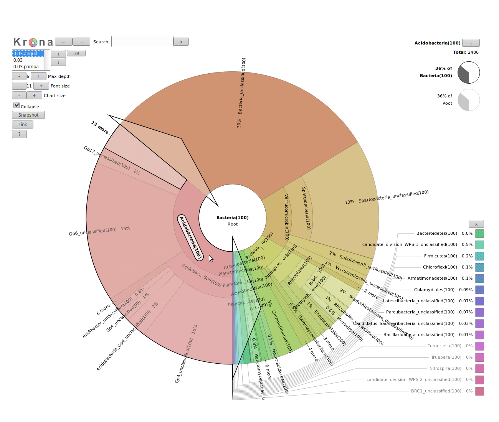

# Introduction


In metagenomics, information about micro-organisms in an environment can be extracted with two main techniques:

- Amplicon sequencing, which sequences only the rRNA or ribosomal DNA of organisms
- Shotgun sequencing, which sequences full genomes of the micro-organisms in the environment

In this tutorial, we will introduce the two main types of analyses with their general principles and differences. For a more in-depth look at these analyses, we recommend our detailed tutorials on each analysis.

We will use two datasets (one amplicon and one shotgun) from the same [project on the Argentinean agricultural pampean soils](https://www.ebi.ac.uk/metagenomics/projects/SRP016633). In this project, three different geographic regions that are under different types of land uses and two soil types (bulk and rhizospheric) were analyzed using shotgun and amplicon sequencing. We will focus on data from the Argentina Anguil and Pampas Bulk Soil (the original study included one more geographical regions .

> <agenda-title></agenda-title>
>
> In this tutorial, we will deal with:
>
> 1. TOC
> {:toc}
>
{: .agenda}

# Amplicon data

Amplicon sequencing is a highly targeted approach for analyzing genetic variation in specific genomic regions.
In the metagenomics fields, amplicon sequencing refers to capture and sequence of rRNA data in a sample.
It can be 16S for bacteria or archea or 18S for eukaryotes.

> <comment-title>Background: The 16S ribosomal RNA gene</comment-title>
> 
>
> The 16S rRNA gene has several properties that make it ideally suited to our purposes
>
> 1. Present in all living organisms
> 2. Highly conserved + highly variable regions
> 3. Huge reference databases
>
> 
>
> The highly conserved regions make it easy to target the gene across different organisms, while the highly variable regions allow us to distinguish between different species.
>
{: .comment}

With amplicon data, we can determine the micro-organisms from which the sequences in our sample are coming from. This is called taxonomic assignation.
We try to assign sequences to taxons and then classify or extract the taxonomy in our sample.

In this analysis, we will use the [mothur tool suite](https://mothur.org), but only a small portion of its tools and possibilities.
To learn more in detail about how to use this tool, check out the full [mothur tutorial](../mothur-miseq-sop/tutorial.html).

## Importing the data

Our datasets come from a soil samples in two different Argentinian locations, for which the 16S rDNA V4 region
has been sequenced using 454 GS FLX Titanium. For the tutorial, the original fastq data has been down sampled and converted to fasta. The original data are available at EBI Metagenomics under the following run numbers:

- Pampa soil: [SRR531818](https://www.ebi.ac.uk/metagenomics/projects/SRP016633/samples/SRS353016/runs/SRR531818/results/versions/2.0)
- Anguil soil: [SRR651839](https://www.ebi.ac.uk/metagenomics/projects/SRP016633/samples/SRS386929/runs/SRR651839/results/versions/2.0)


> <hands-on-title>Data upload</hands-on-title>
>
> 1. Import the following files from [Zenodo](https://zenodo.org/record/815875), or from the shared data library (in `GTN - Material -> {{ page.topic_name }} -> {{ page.title }}`):
>    - `SRR531818_pampa.fasta`
>    - `SRR651839_anguil.fasta`
>
>    ```
>    https://zenodo.org/record/815875/files/SRR531818_pampa.fasta
>    https://zenodo.org/record/815875/files/SRR651839_anguil.fasta
>    ```
>
>    > <tip-title>Importing data via links</tip-title>
>    >
>    > * Copy the link location
>    > * Open the Galaxy Upload Manager
>    > * Select **Paste/Fetch Data**
>    > * Paste the link into the text field
>    > * Press **Start**
>    {: .tip}
>
>    > <tip-title>Importing data from a data library</tip-title>
>    >
>    > * Go into "Shared data" (top panel) then "Data libraries"
>    > * Click on "Training data" and then "Analyses of metagenomics data"
>    > * Select interesting file
>    > * Click on "Import selected datasets into history"
>    > * Import in a new history
>    {: .tip}
>
>    As default, Galaxy takes the link as name, so rename them.
>
{: .hands_on}

<!--

Anguil Soil: https://www.ebi.ac.uk/metagenomics/projects/SRP016633/samples/SRS386929
Pampa Soil https://www.ebi.ac.uk/metagenomics/projects/SRP016633/samples/SRS353016/runs/SRR531818/results/versions/2.0

Project's data: https://www.ebi.ac.uk/metagenomics/projects/SRP016633/samples/SRS353016/runs/SRR531818/results/versions/2.0
Project's pipeline: https://www.ebi.ac.uk/metagenomics/pipelines/2.0
Project's QC results: https://www.ebi.ac.uk/metagenomics/projects/SRP016633/samples/SRS386929/runs/SRR651839/results/versions/2.0
-->

### Preparing datasets

We will perform a multisample analysis with mothur. To do this, we will merge all reads into a single file,
and create a *group file*, indicating which reads belong to which samples.

> <hands-on-title>Prepare multisample analysis</hands-on-title>
>
> 1. **Merge.files**  with the following parameters
>   - "Merge" to `fasta files`
>   - "Inputs" to the two sample fasta files
>
> 2. **Make.group**  with the following parameters
>   - "Method to create group file" to `Manually specify fasta files and group names`
>   - "Additional": Add two elements to this repeat
>        - First element
>            - "fasta - Fasta to group" to `SRR531818_pampa` file
>            - "group - Group name" to `pampa`
>        - Second element (click on "Insert Additional")
>            - "fasta - Fasta to group" to `SRR651839_anguil` file
>            - "group - Group name" to `anguil`
>
{: .hands_on}

> <comment-title>Note</comment-title>
>
> Because we only have a small number of samples, we used the manual specification. If you have hundreds of samples this would quickly become bothersome. The solution? use a collection! To read more about collections in Galaxy, please see [dedicated collections tutorial]().
{: .comment}

Have a look at the group file. It is a very simple file, it contains two columns: the first contains the read names, the second contains the group (sample) name, in our case `pampa` or `anguil`.


### Optimization of files for computation

Because we are sequencing many of the same organisms, we anticipate that many of our sequences are
duplicates of each other. Because it's computationally wasteful to align the same thing a bazillion
times, we'll unique our sequences using the `Unique.seqs` command:

> <hands-on-title>Remove duplicate sequences</hands-on-title>
>
> 1. **Unique.seqs**  with the following parameters
>   - "fasta" to the merged fasta file
>   - "output format" to `Name File`
>
>    > <question-title></question-title>
>    >
>    > How many sequences were unique? How many duplicates were removed?
>    >
>    > > <solution-title></solution-title>
>    > > 19,502 unique sequences and 498 duplicates.
>    > >
>    > > This can be determined from the number of lines in the fasta (or names) output, compared to the
>    > > number of lines in the fasta file before this step.
>    > {: .solution }
>    {: .question}
>
{: .hands_on}

This `Unique.seqs` tool outputs two files: a fasta file containing only the unique sequences, and a *names file*.
The names file consists of two columns, the first contains the sequence names for each of the unique sequences, and the second column contains all other sequence names that are identical to the representative sequence in the first column.

```
name          representatives
read_name1    read_name2,read_name,read_name5,read_name11
read_name4    read_name6,read_name,read_name10
read_name7    read_name8
...
```

> <hands-on-title>Count sequences</hands-on-title>
>
> 1. **Count.seqs**  with the following parameters
>   - "name" to the name file from `Unique.seqs`
>   - "Use a group file" to `yes`
>   - "group" to the group file from `Make.group`
{: .hands_on}

The `Count.seqs` file keeps track of the number of sequences represented by each unique representative across multiple samples. We will pass this file to many of the following tools to be used or updated as needed.

## Quality Control

The first step in any analysis should be to check and improve the quality of our data.


> <comment-title></comment-title>
>
> For more information on the topic of quality control, please see our [dedicated training materials]().
{: .comment}


First, let's get a feel for our data:

> <hands-on-title>Summarize data</hands-on-title>
>
> 1. **Summary.seqs**  with the following parameters
>   - "fasta" parameter to the fasta from `Unique.seqs`
>   - "count" to count table from `Count.seqs`
>   - "output logfile?" to `yes`
>
{: .hands_on}

The `summary` output files give information per read. The `logfile` outputs also contain some summary
statistics:

```
              Start    End        NBases     Ambigs   Polymer  NumSeqs
Minimum:      1        80         80         0        3        1
2.5%-tile:    1        104        104        0        3        501
25%-tile:     1        242        242        0        4        5001
Median:       1        245        245        0        4        10001
75%-tile:     1        245        245        0        4        15001
97.5%-tile:   1        247        247        0        6        19501
Maximum:      1        275        275        2        31       20000
Mean:         1        237.519    237.519    0.00495  4.24965
# of unique seqs:   19502
total # of seqs:    20000
```

This tells us that we have a total of 19,502 unique sequences, representing 20,000 total sequences that vary in length between 80 and 275 bases. Also, note that at least some of our sequences had some ambiguous base calls.
Furthermore, at least one read had a homopolymer stretch of 31 bases, this is likely an error so we would like to filter such reads out as well.

If you are thinking that 20,000 is an oddly round number, you are correct; we downsampled the original datasets to 10,000 reads per sample for this tutorial to reduce the amount of time the analysis steps will take.

We can filter our dataset on length, base quality, and maximum homopolymer length using the `Screen.seqs` tool

The following tool will remove any sequences with ambiguous bases (`maxambig` parameter), homopolymer stretches of 9 or more bases (`maxhomop` parameter) and any reads longer than 275 bp or shorter than 225 bp.

> <hands-on-title>Filter reads based on quality and length</hands-on-title>
>
> 1. **Screen.seqs**  with the following parameters
>   - "fasta" to the fasta file from `Unique.seqs`
>   - "minlength" parameter to `225`
>   - "maxlength" parameter to `275`
>   - "maxambig" parameter to `0`
>   - "maxhomop" parameter to `8`
>   - "count" to the count file from `Count.seqs`
>
{: .hands_on}

> <question-title></question-title>
>
> How many reads were removed in this screening step? (Hint: run the `Summary.seqs` tool again)
>
> > <solution-title></solution-title>
> > 1,804.
> >
> > This can be determined by looking at the number of lines in bad.accnos output of screen.seqs step or by comparing the total number of seqs between of the summary.seqs log before and after this screening step
> {: .solution }
{: .question}

## Sequence Alignment

Aligning our sequences to a reference helps improve OTU assignment [[Schloss et. al.](https://www.ncbi.nlm.nih.gov/pubmed/23018771)], so we will now align our sequences to an alignment of the V4 variable region of the 16S rRNA. This alignment has been created as described in [[mothur's MiSeq SOP](https://mothur.org/wiki/MiSeq_SOP)] from the Silva reference database.

> <hands-on-title>Align sequences</hands-on-title>
>
> 1. Import the `silva.v4.fasta` file in your history
>
>    ```
>    https://zenodo.org/record/815875/files/silva.v4.fasta
>    ```
>
> 2. **Align.seqs**  with the following parameters
>   - "fasta" to the `good.fasta` output from `Screen.seqs`
>   - "Select Reference Template from" to `Your history`
>   - "reference" to the `silva.v4.fasta` reference file
>   - "flip" to `Yes`
>
>    This step may take a few minutes, please be patient.
>
> 3. **Summary.seqs**  with the following parameters
>   - "fasta" parameter to the aligned output from `Align.seqs`
>   - "count" parameter to count_table output from `Screen.seqs`
>
{: .hands_on}

To get an idea of the quality of the alignment, we can view the log output from the summary step:

```
        Start   End NBases  Ambigs  Polymer NumSeqs
Minimum:    2391    10674   9   0   2   1
2.5%-tile:  3080    12071   234 0   4   455
25%-tile:   3080    13424   244 0   4   4545
Median:     3080    13424   245 0   4   9090
75%-tile:   3080    13424   245 0   4   13634
97.5%-tile: 3082    13424   246 0   6   17724
Maximum:    13396   13425   267 0   7   18178
Mean:   3080.6  13380   244.212 0   4.27946
# of unique seqs:   17698
total # of seqs:    18178
```

> <question-title></question-title>
>
> 1. How many sequences have been aligned?
> 2. Between which positions most of the reads are aligned to this references?
>
> > <solution-title></solution-title>
> > 1. 17,698 are aligned
> > 2. From this we can see that most of our reads align nicely to positions `3080-13424` on this reference. This corresponds exactly to the V4 target region of the 16S gene.
> {: .solution }
{: .question}

To make sure that everything overlaps the same region we'll re-run `Screen.seqs` to get sequences that start at or before position 3,080 and end at or after position 13,424.

> <hands-on-title>Remove poorly aligned sequences</hands-on-title>
>
> 1. **Screen.seqs**  with the following parameters
>   - "fasta" to the aligned fasta file
>   - "start" to `3080`
>   - "end" to `13424`
>   - "count" to the group file created by the previous run of `Screen.seqs`
>
{: .hands_on}

> <question-title></question-title>
> How many sequences were removed in this step?
> > <solution-title></solution-title>
> > 4,579 sequences were removed. This is the number of lines in the bad.accnos output.
> {: .solution }
{: .question}

Now we know our sequences overlap the same alignment coordinates, we want to make sure they *only* overlap that region. So we'll filter the sequences to remove the overhangs at both ends. In addition, there are many columns in the alignment that only contain external gap characters (*i.e.* "."), while columns containing only internal gap characters (*i.e.*, "-") are not considered. These can be pulled out without losing any information. We'll do all this with `Filter.seqs`:

> <hands-on-title>Filter sequences</hands-on-title>
>
> 1. **Filter.seqs**  with the following parameters
>   - "fasta"" to `good.fasta` output from `Screen.seqs`
>   - "trump" to `.`
{: .hands_on}


## Extraction of taxonomic information

The main questions when analyzing amplicon data are: Which micro-organisms are present in an environmental samples? And in what proportion? What is the structure of the community of the micro-organisms?

The idea is to take the sequences and assign them to a taxon. To do that, we group (or cluster) sequences based on their similarity to defined Operational Taxonomic Units (OTUs): groups of similar sequences that can be treated as a single "genus" or "species" (depending on the clustering threshold)

> <comment-title>Background: Operational Taxonomic Units (OTUs)</comment-title>
>
> In 16S metagenomics approaches, OTUs are clusters of similar sequence variants of the 16S rDNA marker gene sequence. Each of these clusters is intended to represent a taxonomic unit of a bacterial species or genus depending on the sequence similarity threshold. Typically, OTU clusters are defined by a 97% identity threshold of the 16S gene sequence variants at genus level. 98% or 99% identity is suggested for species separation.
>
> 
>
> . Credit: Danzeisen et al. 2013, 10.7717/peerj.237")
>
{: .comment}

The first thing we want to do is to further de-noise our sequences from potential sequencing errors, by pre-clustering the sequences using the `Pre.cluster` command, allowing for up to 2 differences between sequences. This command will split the sequences by group and then sort them by abundance, then go from most abundant to least and identify sequences that differ by no more than 2 nucleotides from on another. If this is the case, then they get merged. We generally recommend allowing 1 difference for every 100 basepairs of sequence:

> <hands-on-title>Perform preliminary clustering of sequences and remove undesired sequences</hands-on-title>
>
> 1. **Pre.cluster**  with the following parameters
>   - "fasta" to the fasta output from the last `Filter.seqs` run
>   - "name file or count table" to the count table from the last `Screen.seqs` step
>   - "diffs" to 2
>
>   > <question-title></question-title>
>   >
>   >  How many unique sequences are we left with after this clustering of highly similar sequences?
>   > > <solution-title></solution-title>
>   > > 10,398
>   > >
>   > > This is the number of lines in the fasta output
>   > {: .solution }
>   {: .question}
>
{: .hands_on}

<!-- optional additional QC: chimera.uchime -->
We would like to classify the sequences using a training set, which is again is provided on [[mothur's MiSeq SOP](https://mothur.org/wiki/MiSeq_SOP)].

> <hands-on-title>Classify the sequences into phylotypes</hands-on-title>
>
> 1. Import the `trainset16_022016.pds.fasta` and `trainset16_022016.pds.tax` in your history
>
>    ```
>    https://zenodo.org/record/815875/files/trainset16_022016.pds.fasta
>    https://zenodo.org/record/815875/files/trainset16_022016.pds.tax
>    ```
>
> 2. **Classify.seqs**  with the following parameters
>   - "fasta" to the fasta output from `Pre.cluster`
>   - "Select Reference Template from" to `History`
>   - "reference" to `trainset16_022016.pds.fasta` from your history
>   - "Select Taxonomy from" to `History`
>   - "taxonomy" to `trainset16_022016.pds.tax` from your history
>   - "count" to the count table from `Pre.cluster`
>
> This step may take a couple of minutes, now may be a good time to grab a cup of tea/coffee.
>
{: .hands_on}

Have a look at the taxonomy output.

```
name    taxonomy
SRR651839.9109-HXY9DLL01BSHQO-2 Bacteria(99);Verrucomicrobia(99);Spartobacteria(99);unclassified;unclassified;unclassified;
SRR651839.11437-HXY9DLL01AMIPI-2    Bacteria(100);Verrucomicrobia(97);Spartobacteria(97);unclassified;unclassified;unclassified;
SRR651839.15884-HXY9DLL01BDG2F-2    Bacteria(99);unclassified;unclassified;unclassified;unclassified;unclassified;
SRR651839.12048-HXY9DLL01DSOWS-2    Bacteria(100);Verrucomicrobia(100);Spartobacteria(100);unclassified;unclassified;unclassified;
SRR651839.9410-HXY9DLL01BGRG2-2 Bacteria(100);Proteobacteria(100);Alphaproteobacteria(100);Rhizobiales(100);Bradyrhizobiaceae(100);unclassified;
SRR651839.9029-HXY9DLL01E4W9Z-2 Bacteria(100);Verrucomicrobia(100);Spartobacteria(100);unclassified;unclassified;unclassified;
SRR651839.6283-HXY9DLL01CHX25-2 Bacteria(100);Acidobacteria(100);Acidobacteria_Gp4(100);Gp4(100);unclassified;unclassified;
SRR651839.3134-HXY9DLL01DOM67-2 Bacteria(100);Acidobacteria(100);Acidobacteria_Gp6(100);Gp6(100);unclassified;unclassified;
SRR651839.13044-HXY9DLL01ETN7L-2    Bacteria(100);Proteobacteria(100);Alphaproteobacteria(100);Rhizobiales(100);Bradyrhizobiaceae(100);unclassified;
SRR531818.61708-G88ZSJI01AVPPR-2    Bacteria(100);Acidobacteria(99);Acidobacteria_Gp6(99);Gp6(99);unclassified;unclassified;
```

You will see that every read now has a classification.

The next step is to use this information to determine the abundances of the different found taxa. This consists of three steps:
1. first, all individual sequences are classified, and get assigned a confidence score (0-100%)
2. next, sequences are grouped at 97% identity threshold (not using taxonomy info)
3. finally, for each cluster, a consensus classification is determined based on the classification of the individual sequences and taking their confidence scores into account

> <hands-on-title>Assign sequences to OTUs</hands-on-title>
>
> 1. **Cluster.split**  with the following parameters
>   - "Split by" to `Classification using fasta`
>   - "fasta" to the fasta output from `Pre.cluster`
>   - "taxonomy" to the taxonomy output from `Classify.seqs`
>   - "count" to the count table output from `Pre.cluster`
>   - "Clustering method" to `Average Neighbour`
>   - "cutoff" to `0.15`
>
{: .hands_on}

We obtain a table with the columns being the different identified OTUs, the rows the different distances and the cells the ids of the sequences identified for these OTUs for the different distances.

Next we want to know how many sequences are in each OTU from each group with a distance of 0.03 (97% similarity). We can do this using the `Make.shared` command with the 0.03 cutoff level:

> <hands-on-title>Estimate OTU abundance</hands-on-title>
>
> 2. **Make.shared**  with the following parameters
>   - "Select input type" to `OTU list`
>   - "list" to list output from `Cluster.split`
>   - "name file or count table" to the count table from `Pre.cluster`
>   - "label" to `0.03`
>
{: .hands_on}

We probably also want to know the taxonomy for each of our OTUs. We can get the consensus taxonomy for each OTU using the `Classify.otu` command:

> <hands-on-title>Classify the OTUs</hands-on-title>
>
> 3. **Classify.otu**  with the following parameters
>   - "list" to output from `Cluster.split`
>   - "count" to the count table from `Pre.cluster`
>   - "Select Taxonomy from" to `History`
>   - "taxonomy" to the taxonomy output from `Classify.seqs`
>   - "label" to `0.03`
{: .hands_on}

> <question-title></question-title>
>
> 1. How many OTUs with taxonomic assignation are found for the Anguil sample? And for the Pampa sample?
> 2. What is the annotation of first OTU and its size?
>
> > <solution-title></solution-title>
> > 1. 2,195 for Anguil and 2,472 for Pampa ("tax.summary")
> > 2. Otu00001 is associated to 929 sequences and to Bacteria (kingdom), Verrucomicrobia (phylum), Spartobacteria (class) in "taxonomy" file
> {: .solution }
{: .question}

## Visualization

We have now determined our OTUs and classified them, but looking at a long text file is not very informative.
Let's visualize our data using Krona:

> <hands-on-title>Krona</hands-on-title>
>
>  First we convert our mothur taxonomy file to a format compatible with Krona
>
> - **Taxonomy-to-Krona**  with the following parameters
>   - "Taxonomy file" to the taxonomy output from Classify.otu (note: this is a collection input)
>
> - **Krona pie chart**  with the following parameters
>   - "Type of input" to `Tabular`
>   - "Input file" to taxonomy output from Taxonomy-to-Krona (collection)
{: .hands_on}

The result is an HTML file with an interactive visualization, for instance try clicking
on one of the rings in the image or playing around with some of the settings.

<iframe id="krona" src="krona.html" frameBorder="0" width="100%" height="900px">  </iframe>

This produced a single plot for both your samples, but what if you want to compare
the two samples?

> <hands-on-title>Per-sample Krona plots</hands-on-title>
>
> 1. **Classify.otu** 
>
>    Hit the rerun button on the `Classify.otu` job in your history and see if you can find settings that will give you per-sample taxonomy data
>
> 2. **Krona** 
>
>    Now use this new output collection to create per-sample Krona plots
>
{: .hands_on}

In this new Krona output you can switch between the combined plot and the per-sample plots via the selector in the top-left corner.

> <question-title></question-title>
> Which soil sample had a higher percentage of Acidobacteria, anguil or pampa? what were the respective percentages?
> > <solution-title></solution-title>
> > The anguil sample had a higher proportion of Acidobacteria. The exact percentages can be found by looking at the pie charts at the
> > top right-hand corner after clicking on the label Acidobacteria. For anguil the percentage is 36%, for the pampa sample it is 26%.
> >
> > 
> {: .solution }
{: .question}


To further explore the community structure, we can visualize it with dedicated tools such as Phinch.

> <hands-on-title>Visualization of the community structure with Phinch</hands-on-title>
>
> 1. **Make.biom**  with the following parameters
>   - "shared" to `Make.shared` output
>   - "constaxonomy" to taxonomy output from the first run of `Classify.otu` (collection)
> 1. Expand the dataset and click on the "view biom at phinch" link
>
>     > <comment-title></comment-title>
>     >
>     > If this link is not present on your Galaxy, you can download the generated BIOM file and upload directly to Phinch server at [http://phinch.org](http://phinch.org).
>    {: .comment}
>
> 2. Play with the several interactive visualisations:
>
> 
>
{: .hands_on}

Once we have information about the community structure (OTUs with taxonomic structure), we can do more analysis on it: estimation of the diversity of micro-organism, comparison of diversity between samples, analysis of populations, ... We will not go into detail of such analyses here but you can follow our tutorials on amplicon data analyses to learn more about them.

# Shotgun metagenomics data

In the previous section, we saw how to analyze amplicon data to extract the community structure. Such information can also be extracted from shotgun metagenomic data.

In shotgun data, full genomes of the micro-organisms in the environment are sequenced (not only the 16S or 18S). We can then have access to the rRNA (only a small part of the genomes), but also to the other genes of the micro-organisms. Using this information, we can try to answer questions such as "What are the micro-organisms doing?" in addition to the question "What micro-organisms are present?".

In this second part, we will use a metagenomic sample of the Pampas Soil ([SRR606451](https://www.ebi.ac.uk/metagenomics/projects/SRP016633/samples/SRS372043/runs/SRR606451/results/versions/2.0)).

## Data upload

> <hands-on-title>Data upload</hands-on-title>
>
> 1. Create a new history
> 2. Import the `SRR606451_pampa` Fasta file from [Zenodo](http://zenodo.org/record/815875) or from the data library (in "Analyses of metagenomics data")
>
>    ```
>    https://zenodo.org/record/815875/files/SRR606451_pampa.fasta
>    ```
>
{: .hands_on}

## Extraction of taxonomic information

As for amplicon data, we can extract taxonomic and community structure information from shotgun data. Different approaches can be used:

- Same approach as for amplicon data with identification and classification of OTUs

    Such an approach requires a first step of sequence sorting to extract only the 16S and 18S sequences, then using the same tools as for amplicon data. However, rRNA sequences represent a low proportion (< 1%) of the shotgun sequences so such an approach is not the most statistically supported

- Assignation of taxonomy on the whole sequences using databases with marker genes

In this tutorial, we use the second approach with MetaPhlAn2. This tools is using a database of ~1M unique clade-specific marker genes (not only the rRNA genes) identified from ~17,000 reference (bacterial, archeal, viral and eukaryotic) genomes.

> <hands-on-title>Taxonomic assignation with MetaPhlAn2</hands-on-title>
>
> 1. **MetaPhlAN2**  with
>    - "Input file" to the imported file
>    - "Database with clade-specific marker genes" to `locally cached`
>    - "Cached database with clade-specific marker genes" to `MetaPhlAn2 clade-specific marker genes`
>
> This step may take a couple of minutes.
{: .hands_on}

3 files are generated:

- A tabular file with the community structure

    ```
    #SampleID   Metaphlan2_Analysis
    k__Bacteria 100.0
    k__Bacteria|p__Proteobacteria   86.20712
    k__Bacteria|p__Actinobacteria   13.79288
    k__Bacteria|p__Proteobacteria|c__Gammaproteobacteria    86.20712
    k__Bacteria|p__Actinobacteria|c__Actinobacteria 13.79288
    ```

    Each line contains a taxa and its relative abundance found for our sample. The file starts with high level taxa (kingdom: `k__`) and go to more precise taxa.


- A BIOM file with the same information as the previous file but in BIOM format

    It can be used then by mothur and other tools requiring community structure information in BIOM format

- A SAM file with the results of the mapping of the sequences on the reference database

> <question-title></question-title>
>
> 1. What is the most precise level we have access to with MetaPhlAn2?
> 2. What are the two orders found in our sample?
> 3. What is the most abundant family in our sample?
>
> > <solution-title></solution-title>
> > 1. We have access to species level
> > 2. Pseudomonadales and Solirubrobacterales are found in our sample
> > 3. The most abundant family is Pseudomonadaceae with 86.21 % of the assigned sequences
> {: .solution }
{: .question}

Even if the output of MetaPhlAn2 is bit easier to parse than the BIOM file, we want to visualize and explore the community structure with KRONA

> <hands-on-title>Interactive visualization with KRONA</hands-on-title>
>
> 1. **Format MetaPhlAn2 output for Krona**  with
>    - "Input file" to `Community profile` output of `MetaPhlAn2`
>
> 2. **KRONA pie chart**  with
>    - "What is the type of your input data" as `MetaPhlan`
>    - "Input file" to the output of `Format MetaPhlAn2`
>
{: .hands_on}

## Extraction of functional information

We would now like to answer the question "What are the micro-organisms doing?" or "Which functions are performed by the micro-organisms in the environment?".

In the shotgun data, we have access to the gene sequences from the full genome. We use that to identify the genes, associate them with a function, build pathways, etc., to investigate the functional part of the community.

> <hands-on-title>Metabolism function identification</hands-on-title>
>
> 1. **HUMAnN2**  with
>    - "Input sequence file" to the imported sequence file
>    - "Use of a custom taxonomic profile" to `Yes`
>    - "Taxonomic profile file" to `Community profile` output of `MetaPhlAn2`
>    - "Nucleotide database" to `Locally cached`
>    - "Nucleotide database" to `Full`
>    - "Protein database" to `Locally cached`
>    - "Protein database" to `Full UniRef50`
>    - "Search for uniref50 or uniref90 gene families?" to `uniref50`
>    - "Database to use for pathway computations" to `MetaCyc`
>    - "Advanced Options"
>    - "Remove stratification from output" to `Yes`
>
>    This step is long so we generated the output for you!
>
> 2. Import the 3 files whose the name is starting with "humann2"
>
>    ```
>    https://zenodo.org/record/815875/files/humann2_gene_families_abundance.tsv
>    https://zenodo.org/record/815875/files/humann2_pathways_abundance.tsv
>    https://zenodo.org/record/815875/files/humann2_pathways_coverage.tsv
>    ```
{: .hands_on}

HUMAnN2 generates 3 files

- A file with the abundance of gene families

    Gene family abundance is reported in RPK (reads per kilobase) units to normalize for gene length. It reflects the relative gene (or transcript) copy number in the community.

    The "UNMAPPED" value is the total number of reads which remain unmapped after both alignment steps (nucleotide and translated search). Since other gene features in the table are quantified in RPK units, "UNMAPPED" can be interpreted as a single unknown gene of length 1 kilobase recruiting all reads that failed to map to known sequences.

- A file with the coverage of pathways

    Pathway coverage provides an alternative description of the presence (1) and absence (0) of pathways in a community, independent of their quantitative abundance.

- A file with the abundance of pathways

> <question-title></question-title>
>
> How many gene families and pathways have been identified?
>
> > <solution-title></solution-title>
> > 44 gene families but no pathways are identified
> {: .solution }
{: .question}

The RPK for the gene families are quite difficult to interpret in term of relative abundance. We decide then to normalize the values

> <hands-on-title>Normalize the gene family abundances</hands-on-title>
>
> 1. **Renormalize a HUMAnN2 generated table**  with
>    - "Gene/pathway table" to the gene family table generated with `HUMAnN2`
>    - "Normalization scheme" to `Relative abundance`
>    - "Normalization level" to `Normalization of all levels by community total`
>
>  > <question-title></question-title>
>  >
>  > 1. What percentage of sequences has not be assigned to a gene family?
>  > 2. What is the most abundant gene family?
>  >
>  > > <solution-title></solution-title>
>  > > 1. 55% of the sequences have not be assigned to a gene family
>  > > 2. The most abundant gene family with 25% of sequences is a putative secreted protein
>  > {: .solution }
>  {: .question}
{: .hands_on}

With the previous analyses, we investigate "Which micro-organims are present in my sample?" and "What function are performed by the micro-organisms in my sample?". We can go further in these analyses (for example, with a combination of functional and taxonomic results). We did not detail that in this tutorial but you can find more analyses in our tutorials on shotgun metagenomic data analyses.

# Conclusion


We can summarize the analyses with amplicon and shotgun metagenomic data:


Both analyses are quite complex! However, in this tutorial, we only showed simple cases of metagenomics data analysis with subset of real data.

Check our other tutorials to learn more in detail of how to analyze metagenomics data.
