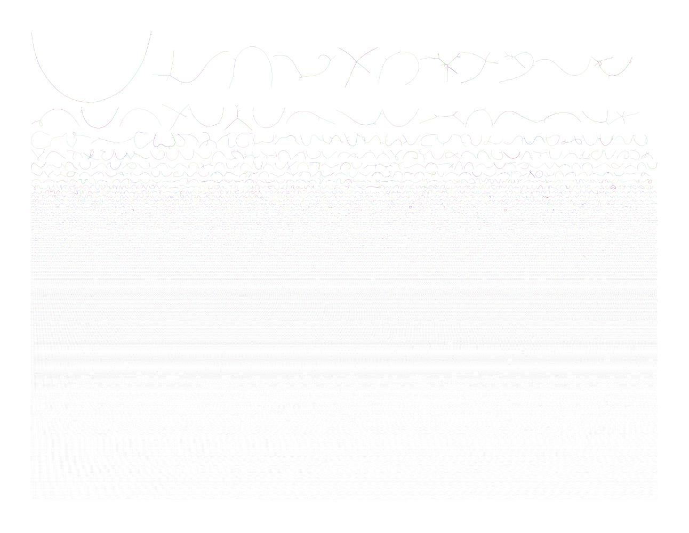

# Introduction

Metagenomics involves the extraction, sequencing and analysis of combined genomic DNA from **entire microbiome** samples. It includes then DNA from **many different organisms**, with different taxonomic background.

Reconstructing the genomes of microorganisms in the sampled communities is critical step in analyzing metagenomic data. To do that, we can use **assembly** and assemblers, *i.e.* computational programs that stich together the small fragments of sequenced DNA produced by sequencing instruments.

Assembling seems intuitively similar to putting together a jigsaw puzzle. Essentially, it looks for reads "that work together" or more precisely, reads that overlap. Tasks like this are **not straightforward**, but rather complex because of the complexity of the genomics (specially the repeats), the missing pieces and the errors introduced during sequencing.

> <comment-title></comment-title>
>
> Do you want to learn more about the principles behind single genome assembly? Follow our [tutorials]().
{: .comment}

**Metagenomic assembly** is further complicated by
- the large volume of data produced
- the quality of the sequence
- the unequal representation of members of the microbial community
- the presence of closely related microorganisms with similar genomes
- the presence of several strains of the same microorganism
- an insufficient amount of data for minor community members

> <details-title>Strategies for assembly</details-title>
> For assembly, there are 3 main strategies:
> 1. Greedy extension
> 2. Overlap Layout Consensus
> 3. De Bruijn graphs. The following figure illustrates these strategies in brief.
>
> {:width="70%"}
>
> The nice paper  on assemblers based on these algorithms will help you to better understand how they work.
{: .details}

For metagenomic assembly, several tools exist: metaSPAdes (), MEGAHIT (), etc. The different assemblers have different computational characteristics and their performance varies according to the microbiome as shown in by both rounds of  Critical Assessment of Metagenome Interpretation initiative (, , ). The preference of one assembler over another depends on the purpose at hand.

In this tutorial, we will learn how to run metagenomic assembly tool and evaluate the quality of the generated assemblies. To do that, we will use data from the study: [Temporal shotgun metagenomic dissection of the coffee fermentation ecosystem](https://www.ebi.ac.uk/metagenomics/studies/MGYS00005630#overview). For an in-depth analysis of the structure and functions of the coffee microbiome, a temporal shotgun metagenomic study (six time points) was performed. The six samples have been sequenced with Illumina MiSeq utilizing whole genome sequencing.

Based on the 6 original dataset of the coffee fermentation system, we generated mock datasets for this tutorial.

> <agenda-title></agenda-title>
>
> In this tutorial, we will cover:
>
> 1. TOC
> {:toc}
>
{: .agenda}

# Prepare analysis history and data

To run assembly, we first need to get the data into Galaxy. Any analysis should get its own Galaxy history. So let's start by creating a new one:

> <hands-on-title>Prepare the Galaxy history</hands-on-title>
>
> 1. Create a new history for this analysis
>
>    
>
> 2. Rename the history
>
>    
>
{: .hands_on}

We need to get the data into our history.

In case of a not very large dataset it's more convenient to upload data directly from your computer to Galaxy.

> <hands-on-title>Upload data into Galaxy</hands-on-title>
>
> 2. Import the sequence read raw data (\*.fastqsanger.gz) from [Zenodo]({{ page.zenodo_link }}) or a data library:
>
>    ```text
>    {{ page.zenodo_link }}/files/ERR2231567_Read_1.fastqsanger.gz
>    {{ page.zenodo_link }}/files/ERR2231567_Read_2.fastqsanger.gz
>    {{ page.zenodo_link }}/files/ERR2231568_Read_1.fastqsanger.gz
>    {{ page.zenodo_link }}/files/ERR2231568_Read_2.fastqsanger.gz
>    {{ page.zenodo_link }}/files/ERR2231569_Read_1.fastqsanger.gz
>    {{ page.zenodo_link }}/files/ERR2231569_Read_2.fastqsanger.gz
>    {{ page.zenodo_link }}/files/ERR2231570_Read_1.fastqsanger.gz
>    {{ page.zenodo_link }}/files/ERR2231570_Read_2.fastqsanger.gz
>    {{ page.zenodo_link }}/files/ERR2231571_Read_1.fastqsanger.gz
>    {{ page.zenodo_link }}/files/ERR2231571_Read_2.fastqsanger.gz
>    {{ page.zenodo_link }}/files/ERR2231572_Read_1.fastqsanger.gz
>    {{ page.zenodo_link }}/files/ERR2231572_Read_2.fastqsanger.gz
>    ```
>
>    
>    
>
>    > <comment-title></comment-title>
>    > In case of large dataset, we can use FTP server or the [Galaxy Rule-based Uploader]().
>    {: .comment}
>
> 3. Create a paired collection named `Raw reads`, rename your pairs with the sample name
>
>    
>
{: .hands_on}

# Assembly

As explained before, there are many challenges to metagenomics assembly, including:

1. differences in coverage between samples, resulting from differences in abundance,
2. the fact that different species often share conserved regions (), and
3. the presence of multiple strains of a single species ().

To reduce the differences in coverage between samples, we can use a **co-assembly** approach, where reads from all samples are aligned together.:

{:width="60%"}

Pros of co-assembly | Cons of co-assembly
--- | ---
More data | Higher computational overhead
Better/longer assemblies | Risk of shattering your assembly
Access to lower abundant organisms | Risk of increased contamination

Co-assembly is then not always beneficial:
- Changes in strain can cause the assembly graph to collapse
- Binned contigs are likely to be misclassified: MAGs must be treated as a population genome.

{:width="80%"}

In these cases, co-assembly is reasonable if:
- Same samples
- Same sampling event
- Longitudinal sampling of the same site
- Related samples

If it is not the case, **individual assembly** should be prefered. In this case, an extra step of **de-replication** should be used:

{:width="80%"}

Co-assembly is more commonly used than individual assembly and then de-replication after binning. But in this tutorial, to show all steps, we will run an **individual assembly**.

> <comment-title></comment-title>
> Sometimes it is important to run assembly tools both on individual samples and on all pooled samples, and use both outputs to get the better outputs for the certain dataset.
{: .comment}

As mentioned in the introduction, several tools are available for metagenomic assembly. But 2 are the most used ones:

- **MetaSPAdes** (): an short-read assembler designed specifically for large and complex metagenomics datasets

  MetaSPAdes is part of the SPAdes toolkit, which has several assembly pipelines. Since SPAdes handles non-uniform coverage, it is useful for assembling simple communities, but metaSPAdes also handles other problems, allowing it to assemble complex communities' metagenomes.

  As input for metaSPAdes it can accept short reads. However, there is an option to use additionally long reads besides short reads to produce hybrid input.

- **MEGAHIT** (): a single node assembler for large and complex metagenomics NGS reads, such as soil

  It makes use of succinct de Bruijn graph (SdBG) to achieve low memory assembly.

Both tools are available in Galaxy. But currently, only MEGAHIT can be used in individual mode for several samples.

> <hands-on-title>Individual assembly of short-reads with MEGAHIT</hands-on-title>
> 1.   with parameters:
>     - *"Select your input option"*: `Paired-end collection`
>       - *"Run in batch mode?"*: `Run individually`
>
>          > <comment-title></comment-title>
>          > To run as co-assembly, select `Merge all fastq pair-end`, instead of `Run individually`
>          {: .comment}
>
>       -  *"Select a paired collection"*: `Raw reads`
>     - In *Basic assembly options*
>       - *"K-mer specification method"*: `Specify min, max, and step values`
>         - *"Minimum kmer size"*: 21
>         - *"Maximum kmer size"*: 91
>         - *"Increment of kmer size of each iteration"*: 12
>
{: .hands_on}

**MEGAHIT** produced a collection of output assemblies - one per sample - that can be proceeded further in binning step and then de-replication. The output contains **contigs**, contiguous lengths of genomic sequences in which bases are known to a high degree of certainty.

Contrary to **MetaSPAdes**, **MEGAHIT** does not output **scaffolds**, i.e. segments of genome sequence reconstructed fron contigs and gaps. The gaps occur when reads from the two sequenced ends of at least one fragment overlap with other reads from two different contigs (as long as the arrangement is otherwise consistent with the contigs being adjacent). It is possible to estimate the number of bases between contigs based on fragment lengths.

> <comment-title></comment-title>
>
> Since the assembly process would take ~1h we are just going to import the results of the assembly previously run.
>
> > <hands-on-title>Import generated assembly files</hands-on-title>
> >
> > 1. Import the six contig files from [Zenodo]({{ page.zenodo_link }}) or the Shared Data library:
> >
> >    ```text
> >    {{ page.zenodo_link }}/files/ERR2231567_assembly.fasta
> >    {{ page.zenodo_link }}/files/ERR2231568_assembly.fasta
> >    {{ page.zenodo_link }}/files/ERR2231569_assembly.fasta
> >    {{ page.zenodo_link }}/files/ERR2231570_assembly.fasta
> >    {{ page.zenodo_link }}/files/ERR2231571_assembly.fasta
> >    {{ page.zenodo_link }}/files/ERR2231572_assembly.fasta
> >    ```
> >
> >
> > 2. Create a collection named `MEGAHIT Contig`, rename your pairs with the sample name
> >
> {: .hands_on}
{: .comment}

> <question-title></question-title>
>
> 1. How many contigs has been for ERR2231568 sample?
> 2. And for ERR2231572?
> 3. What is the minimum length of the contigs?
>
> > <solution-title></solution-title>
> >
> > 1. There are 228,719 sequences in the file so 228,719 contigs
> > 2. 122,526 contigs
> > 3. Sequences seems bigger than 200 bp (`len` attribute of the sequence information in Fasta files). It is the default value set up in MEGAHIT.
> >
> {: .solution}
>
{: .question}

> <details-title>Co-assembly with MetaSPAdes</details-title>
>
> > <hands-on-title>Assembly with MetaSPAdes</hands-on-title>
> >
> > 1.  with following parameters
> >    - *"Pair-end reads input format"*: `Paired-end: list of dataset pairs`
> >        -  *"FASTQ file(s): collection"*: `Raw reads`
> >     - *"Select k-mer detection option"*: `User specific`
> >        - *"K-mer size values"*: `21,33,55,77`
> {: .hands_on}
{: .details}

# Quality control of assembly

Once assembly is done, it is important to check its quality.

Assemblies can be evaluated with **metaQUAST** (), the metagenomics mode of **QUAST** ().

> <hands-on-title>Evaluation assembly quality with metaQUAST</hands-on-title>
>
> 1.  with parameters:
>    - *"Use customized names for the input files?"*: `No, use dataset names`
>      -  *"Contigs/scaffolds file"*: output **MEGAHIT**
>    - *"Reads options"*: `Illumina paired-end reads in paired collection`
>
>        > <comment-title></comment-title>
>        > To make the job quicker, you can select `Disabled` here. The raw reads will then not been mapped to the assembly to compute metrics, like the coverage.
>        {: .comment}
>
>      -  *"FASTQ/FASTA files"*: `Raw reads`
>    - *"Type of assembly"*: `Metagenome`
>    - *"Output files"*: `HTML report`, `PDF report`, `Tabular reports`, `Log file`, `Key metric summary (metagenome mode)`, `Krona charts (metagenome mode without reference genomes)`
>
> 2. Inspect the HTML reports
{: .hands_on}

> <comment-title></comment-title>
>
> Since the Quast process would take times we are just going to import the results:
>
> > <hands-on-title>Import generated metaQuast results</hands-on-title>
> >
> > 1. Import the metaQuast report file from [Zenodo]({{ page.zenodo_link }}) or the Shared Data library:
> >
> >    ```text
> >    {{ page.zenodo_link }}/files/ERR2231567_quast_report.html
> >    {{ page.zenodo_link }}/files/ERR2231568_quast_report.html
> >    {{ page.zenodo_link }}/files/ERR2231569_quast_report.html
> >    {{ page.zenodo_link }}/files/ERR2231570_quast_report.html
> >    {{ page.zenodo_link }}/files/ERR2231571_quast_report.html
> >    {{ page.zenodo_link }}/files/ERR2231572_quast_report.html
> >    ```
> >
> {: .hands_on}
{: .comment}

Quast main output is the HTML report which aggregate different metrics.

On the top of the report is a table with in rows statistics for contigs larger than 500 bp for the different sample assemblies (columns). Let's now look at the table and go from top to bottom:

1. **Genome statistics**

    - **Genome fraction (%)**: percentage of aligned bases in the reference genome

      A base in the reference genome is counted as aligned if at least one contig has at least one alignment to this base.

      We did not provide any reference there, but metaQuast try to identify genome content of the metagenome by aligning contigs to [SILVA](https://www.arb-silva.de/) 16S rRNA database. For each assembly, 50 reference genomes with top scores are chosen. The full reference genomes of the identified organisms are afterwards downloaded from NCBI to map the assemblies on them and compute the genome fractions.

      For each identified genomes, the genome fraction is given when clicking on **Genome fraction (%)**

      > <question-title></question-title>
      >
      > 1. What is the genome fraction for ERR2231568? And for ERR2231572?
      > 2. Which reference genome has the highest genome fraction for ERR2231568? And for ERR2231572?
      >
      > > <solution-title></solution-title>
      > >
      > > 1. The genome fraction is 20.8% for ERR2231568 (column ERR2231568 in ERR2231568 report) and 24.8% for ERR2231572 (column ERR2231572 in ERR2231572 report)
      > > 2. The highest genome fraction was found for *Leuconostoc pseudomesenteroides* for ERR2231568 (83.4%) and for *Lactobacillus* for ERR2231572 (91%). The genomes of *Leuconostoc pseudomesenteroides* and *Lactobacillus* could be then almost completely recovered from the assemblies of ERR2231568 and ERR2231572 respectively.
      > >
      > {: .solution}
      >
      {: .question}

    - **Duplication ratio**: total number of aligned bases / genome fraction * reference length

      If an assembly contains many contigs that cover the same regions of the reference, the duplication ratio may be much larger than 1.

      > <question-title></question-title>
      >
      > 1. What is the duplication ratio for ERR2231568? And for ERR2231572?
      > 2. Which reference genome has the highest duplication ratio for ERR2231568? And for ERR2231572?
      >
      > > <solution-title></solution-title>
      > >
      > > 1. The duplication ratio is 1.061% for ERR2231568 and 1.1% for ERR2231572 (column ERR2231572 in ERR2231572 report)
      > > 2. The highest duplication ratio was found for *Gluconobacter kondonii* for ERR2231568 (1.163%) and for *Lactobacillus brevis* for ERR2231572 (1.122%).
      > >
      > {: .solution}
      >
      {: .question}

2. **Read mapping**: results of the mapping of the raw reads on the different assemblies (only if the *"Reads options"* is not disabled)

    Here the reads for the selected sample are mapped to all assemblies

    > <question-title></question-title>
    >
    > 1. By opening the report for ERR2231568, to which raw reads are the different sample assemblies compared to to extract information like percentage of mapped reads?
    > 2. To get good information for each sample, which report and information should we look at?
    > 3. What is the % of read mapped for ERR2231568 assembly to ERR2231568 raw reads? And for ERR2231572 assembly to ERR2231572 raw reads?
    > 4. What is the percentage of reads used to build the assemblies for ERR2231568? and ERR2231572?
    >
    > > <solution-title></solution-title>
    > >
    > > 1. To ERR2231568. That is a bug in the Galaxy tool. We are working on fix it so each sample assembly is compared to its corresponding raw reads.
    > > 2. To get the good information for ERR2231568, we should open the ERR2231568  and look only at column ERR2231568.
    > > 3. ...% of ERR2231568 raw reads were mapped to ERR2231568 assembly (column ERR2231568 in ERR2231568 report) and 86.97% of ERR2231572 raw reads to ERR2231572 assembly (column ERR2231572 in ERR2231572 report).
    > > 4. ...% of reads were used to the assemblies for ERR2231568 and  86.97% for ERR2231572.
    > {: .solution}
    >
    {: .question}

    > <details-title>Alternative ways to compute coverage</details-title>
    >
    > 2 alternative ways to compute coverage are to
    > 1. Use [CoverM](https://github.com/wwood/CoverM), which is available in Galaxy
    >
    >    > <hands-on-title>Calculate coverage using CoverM</hands-on-title>
    >    >
    >    > 1.  with parameters:
    >    >    - *"Read type"*: `Paired collection`
    >    >      -  *"One or more pairs of forward and reverse possibly gzipped FASTA/Q files for mapping in order"*: `Raw reads`
    >    >    -   *"FASTA file(s) of contigs"*: output of MEGAGIT
    >    >
    >    > 2. Inspect the HTML report for ERR2231568
    >    {: .hands_on}
    >
    > 2. Map the original reads onto contigs and extract the percentage of mapped reads:
    >
    >    > <hands-on-title>Computation of the % reads used in assemblies</hands-on-title>
    >    >
    >    > 1.  with the following parameters:
    >    >    - *"Is this single or paired library"*: `Paired-end Dataset Collection`
    >    >      -  *"FASTQ Paired Dataset"*: `Raw reads`
    >    >    - *"Will you select a reference genome from your history or use a built-in index?"*: `Use a genome from the history and build index`
    >    >      -  *"Select reference genome"*: MEGAHIT output
    >    >    - *"Save the Bowtie2 mapping statistics to the history"*: `Yes`
    >    > 3. Inspect the mapping statistics output
    >    {: .hands_on}
    >
    >    > <question-title></question-title>
    >    >
    >    > 1. What is the overall alignment rate for ERR2231567? and ERR2231571?
    >    > 2. What is the percentage of reads used in assemblies for ERR2231567? and ERR2231571?
    >    >
    >    > > <solution-title></solution-title>
    >    > >
    >    > > 1. The overall alignment rate for ERR2231567 is 65.97% and 73.67% for ERR2231571
    >    > > 2. 65.97% of the reads were used in assemblies for ERR2231567 and 73.67% for ERR2231571.
    >    > >
    >    > {: .solution}
    >    >
    >    {: .question}
    {: .details}

3. **Misassemblies**: joining sequences that should not be adjacent.

    Quast identifies missassemblies by mapping the contigs to the reference genomes of the identified organisms. 3 types of misassemblies can be identified:

    {:width="60%"}

    1. **Relocation** occur based on signal from two mappings of the same contig against the same chromosome, with 2 cases:
        1. the 2 mappings are separated by an unmapped region of at least 1 kbp
        2. they map on the same chromosome with a shared mapping area of at least 1 kbp

        {:width="80%"}

        > <question-title></question-title>
        >
        > 1. How many relocations has been found for ERR2231568? And for ERR2231572?
        > 2. For which reference genomes are there the most relocation found for ERR2231568? And for ERR2231572?
        >
        > > <solution-title></solution-title>
        > >
        > > 1. 88 for ERR2231568 and 158 for ERR2231572
        > > 2. *Pectobacterium carotovorum brasiliensis* for ERR2231568 and *Lactobacillus plantarum argentoratensis* for ERR2231572
        > {: .solution}
        >
        {: .question}

    2. **Translocation** occur when a contig has mapped on more than one reference chromosomes

        > <question-title></question-title>
        >
        > 1. How many translocations has been found for ERR2231568? And for ERR2231572?
        > 2. For which reference genomes are there the most translocations found for ERR2231568? And for ERR2231572?
        > 3. What are the interspecies translocations?
        > 4. How many interspecies translocations has been found for ERR2231568? And for ERR2231572?
        >
        > > <solution-title></solution-title>
        > >
        > > 1. 47 for ERR2231568 and 62 for ERR2231572.
        > > 2. *Pectobacterium carotovorum brasiliensis* for ERR2231568 and *Lactobacillus vaccinostercus* for ERR2231572.
        > > 3. Interspecies translocations are translocations where the a contif has mapped on different reference genomes.
        > > 4. 160 for ERR2231568 and 203 for ERR2231572.
        > {: .solution}
        >
        {: .question}

    3. **Inversion** occurs when a contig has two consecutive mappings on the same chromosome but in different strands

        > <question-title></question-title>
        >
        > 1. How many inversion has been found for ERR2231568? And for ERR2231572?
        > 2. For which reference genomes are there the most inversions found for ERR2231568? And for ERR2231572?
        >
        > > <solution-title></solution-title>
        > >
        > > 1. 4 for ERR2231568 and 5 for ERR2231572.
        > > 2. *Gluconobacter kondonii* and *Tatumella morbirosei* for ERR2231568 and *Lactobacillus hordei* for ERR2231572.
        > {: .solution}
        >
        {: .question}

4. **Mismatches** or mismatched bases in the contig-reference alignment

    > <question-title></question-title>
    >
    > 1. How many mismatches have been identified for ERR2231568? And for ERR2231572?
    > 2. For which reference genomes are there the most mismatches for ERR2231568? And for ERR2231572?
    >
    > > <solution-title></solution-title>
    > >
    > > 1. 764,853 for ERR2231568 and 414,142 for ERR2231572.
    > > 2. *Pantoea SM3* for ERR2231568 and *Leuconostoc pseudomesenteroides KCTC 3652* for ERR2231572.
    > {: .solution}
    >
    {: .question}

5. **Statistics without reference**

    - **# contigs**: total number of contigs

        > <question-title></question-title>
        >
        > 1. How many contigs are for ERR2231568? And for ERR2231572?
        > 2. How many sequences are in the output of MEGAHIT for ERR2231568? And for ERR2231572?
        > 3. Why are these numbers different from the number of sequences in the output of MEGAHIT?
        > 4. Which statistics in the metaQUAST report corresponds to number of sequences in the output of MEGAHIT?
        > 5. Which reference genomes have the most contigs ($$\geq$$ 500 bp) in ERR2231568? And in ERR2231572?
        >
        > > <solution-title></solution-title>
        > >
        > > 1. 66,434 contigs for ERR2231568 and 36,112 for ERR2231572.
        > > 2. In the outputs of MEGAHIT, there are 228,719 contigs for ERR2231568 and 122,526 contigs.
        > > 3. The numbers are lower in the metaQUAST results because metaQUAST reports there only the contigs longer than 500bp.
        > > 4. The **# contigs (>= 0 bp)**
        > > 5. Except the non aligned contigs, *Tatumella morbirosei* for ERR2231568 and *Leuconostoc pseudomesenteroides KCTC 3652* for ERR2231572.
        > {: .solution}
        >
        {: .question}

    - **Largest contig**: length of the longest contig in the assembly

        > <question-title></question-title>
        >
        > 1. What is the length of the longest contig in ERR2231568? And in ERR2231572?
        > 2. Is the longest contig assigned to a reference genome in ERR2231568? And in ERR2231572?
        >
        > > <solution-title></solution-title>
        > >
        > > 1. 63,871 bp in ERR2231568 and 65,608 for ERR2231572.
        > > 2. It is assigned to *Leuconostoc pseudomesenteroides KCTC 3652* in ERR2231568 and not assigned in ERR2231572.
        > {: .solution}
        >
        {: .question}

    - **N50**: length for which the collection of all contigs of that length or longer covers at least half an assembly

        N50 statistic defines assembly quality in terms of contiguity. If all contigs in an assembly are ordered by length, the N50 is the minimum length of contigs that contains 50% of the assembled bases. For example, an N50 of 10,000 bp means that 50% of the assembled bases are contained in contigs of at least 10,000 bp.

        Another example. Let's consider 9 contigs with the lengths 2, 3, 4, 5, 6, 7, 8, 9, and 10:
        - The sum of the length is 54
        - Half of the sum is 27
        - 10 + 9 + 8 = 27 (half the length of the sequence)
        - N50 = 8, i.e. the size of the contig which, along with the larger contigs, contain half of sequence of a particular genome

        > <question-title></question-title>
        >
        > 1. What is N50 for ERR2231568? And for ERR2231572?
        > 2. What is N90?
        >
        > > <solution-title></solution-title>
        > >
        > > 1. 921 for ERR2231568 and 1,233 for ERR2231572.
        > > 2. N90 is similar to the N50 metric but with 90% of of the sum of the lengths of all contigs
        > {: .solution}
        >
        {: .question}

        When comparing N50 values from different assemblies, the assembly sizes must be the same size in order for N50 to be meaningful.

        Also the N50 alone is not a useful measure to assess the quality of an assembly. For example, the assemblies with the following contig lengths:
        - 3, 3, 3, 3, 3, 3, 3, 3, 3, 3, 25, 25, 150, 1500
        - 50, 500, 530, 650

        Both assemblies have the same N50 although one is more contiguous than the other.

    - **L50**: number of contigs equal to or longer than N50

        In other words, L50, for example, is the minimal number of contigs that cover half the assembly.

        If we take the previous example in N50, L50 = 3.

        > <question-title></question-title>
        >
        > 1. What is the L50 for ERR2231568? And for ERR2231572?
        >
        > > <solution-title></solution-title>
        > >
        > > 1. 17,280 for ERR2231568 and 7,496 for ERR2231572.
        > {: .solution}
        >
        {: .question}

# Visualization of the *de novo* assembly graph

Current metagenome assemblers like MEGAHIT and MetaSPAdes use **graphs**, most typically a de Bruijn graph to stich reads together. In an ideal case, the graph would contain one distinct path for each genome of each micro-organisms, but complexities such as repeated sequences usually prevent this.

Assembly graphs contain then **branching structures**: one node may lead into multiple others. **Contigs** correspond to the longest sequences in the graph that can be determined unambiguously. They are the final results of most assembler. But the assembly graph contains more information. It can be useful for finding sections of the graph, such as rRNA, or to try to find parts of a genome.

**Bandage** () is a tool creating interactive visualisations of assembly graphs.

> <hands-on-title>Visualization the assembly graph</hands-on-title>
>
> 1.  with parameters:
>    -  *"Contig file"*: Output of **MEGAHIT**
>    - *"K-mer length"*: `91`
>
>      > <comment-title></comment-title>
>      > To get the value, you need to
>      > 1. Go into the **MEGAHIT** output collection
>      > 2. Expand one of the contig file by clicking on it in the history
>      > 3. Check in the dataset peek the name of the contig
>      > 4. Extract the value after the first `k` in the contig names
>      {: .comment}
>
> 2.  with parameters:
>    -  *"Graphical Fragment Assembly"*: Output of **megahit contig2fastg**
>
> 3. Inspect the generated image for ERR2231571
{: .hands_on}



The graph is quite disconnected. On the top, we can see the longer stretches, that includes multiples contigs (each contig having a different color). On the bottom are the shortest stretches or single contigs.

But it is really hard to read or extract any information from the graph. Let's inspect the information about the assembly graph

> <hands-on-title>Visualization the *de novo* assembly graph</hands-on-title>
>
> 1.  with parameters:
>    -  *"Graphical Fragment Assembly"*: Output of **megahit contig2fastg**
>
> 2.  with parameters:
>    -  *"Tabular files"*: Output of **Bandage Info**
>
> 3. Inspect the generated output
{: .hands_on}

> <question-title></question-title>
>
> 1. How many nodes are in the graph for ERR2231568? And for ERR2231572? What does they correspond to?
> 2. How many edges are in the graph for ERR2231568? And for ERR2231572? What is the impact of these numbers in relation to the number of nodes on the graph?
> 3. How many connected components are there for ERR2231568? And for ERR2231572? What does they correspond to?
> 4. What is the percentage of dead ends are there for ERR2231568? And for ERR2231572?
> 5. What are the smallest and larges edge overlaps?
> 6. What is the largest component? For which sample?
> 7. What is the shortest node? What does they correspond to?
>
> > <solution-title></solution-title>
> >
> > 1. There are 228,719 nodes for ERR2231568 and 122,526 for ERR2231572. They correspond to the number of contigs
> > 2. There are 16,580 edges for ERR2231568 and 13,993 for ERR2231572. There are less edges than nodes in the graph. It means that many nodes/contigs are disconnected
> > 3. There are 212,598 connected components, i.e. number of regions of the graph which are disconnected from each other, for ERR2231568 and 109,044 for ERR2231572
> > 4. There are 94.0702% dead ends, i.e. the end of a node not connected to any other nodes, for ERR2231568 and 90.7032% for ERR2231572. It confirms the previous observation
> > 5. The smallest and larges edge overlaps are 91bp, i.e. the k-mer length
> > 6. The largest component is 340,003 bp for ERR2231567
> > 7. The shortest node is 200 bp, i.e. the minimal size for a contig
> >
> {: .solution}
>
{: .question}

<!--# De-replication

De-replication is the process of identifying sets of genomes that are the "same" in a list of genomes, and removing all but the “best” genome from each redundant set. How similar genomes need to be to be considered “same”, how to determine which genome is “best”, and other important decisions are discussed in [Important Concepts](https://drep.readthedocs.io/en/latest/choosing_parameters.html).

A common use for genome de-replication is the case of individual assembly of metagenomic data. If metagenomic samples are collected in a series, a common way to assemble the short reads is with a “co-assembly”. That is, combining the reads from all samples and assembling them together. The problem with this is assembling similar strains together can severely fragment assemblies, precluding recovery of a good genome bin. An alternative option is to assemble each sample separately, and then “de-replicate” the bins from each assembly to make a final genome set.

{:width="80%"}

If we have different samples, then we do an individual assembly for each sample. In the figure above we see that after individual assembly we have results for every individual assembly represented with pie charts. Different colours on these charts show different strains (organisms). Every chart has a different percentage of every strain which means that the assemblies contain different strains in different proportions in each sample.

Afterwards, we do the process of de-replication. We try to combine all the assemblies and try to identify which genomes are the most proper.

Individual assembly is a good practice as well as co-assembly. They both have pros and cons and that are just different techniques.

Co-assembly is a more common practice. But in case of co-assembly the genome might be more fragmented afterwards (like it is shown in the figure)  and sometimes it can be less proper. However, it should be decided in every single case which approach to use (co- or individual). More comprehensive information about de-replication you can learn from paper  to get more intuition about how de-replication works.

> <hands-on-title>General list of actions for de-replication</hands-on-title>
> 1. Create new history
> 2. Assemble each sample separately using your favorite assembler
> 3. Perform a co-assembly to catch low-abundance microbes
> 4. Bin each assembly separately using your favorite binner
> 5. Bin co-assembly using your favorite binner
> 6. Pull the bins from all assemblies together
> 7. rRun **dRep** on them
> 8. Perform downstream analysis on the de-replicated genome list
>
{: .hands_on}

We will perform steps from 1 to 3 in this tutorial a bit later while steps 4 - 8 will be considered in the following tutorial - Binning tutorial.-->

# Conclusion

Metagenomic data can be assembled to, ideally, obtain the genomes of the species that are represented within the input data. But metagenomic assembly is **complex** and there are
- **different approaches** like de Bruijn graphs methods
- **different strategies**, such as co-assembly, when we assembly all samples together, and individual assembly, when we assembly samples one by one
- **different tools** like MetaSPAdes and MEGAHIT

Once the choices made, metagenomic assembly can start:
1. Input data are assembled to obtain contigs and sometimes scaffolds
2. Assembly quality is evaluated with various metrics
3. The assembly graph can be visualized.

Once all these steps done, we can move to the next phase to build Metagenomics Assembled Genomes (MAGs): binning