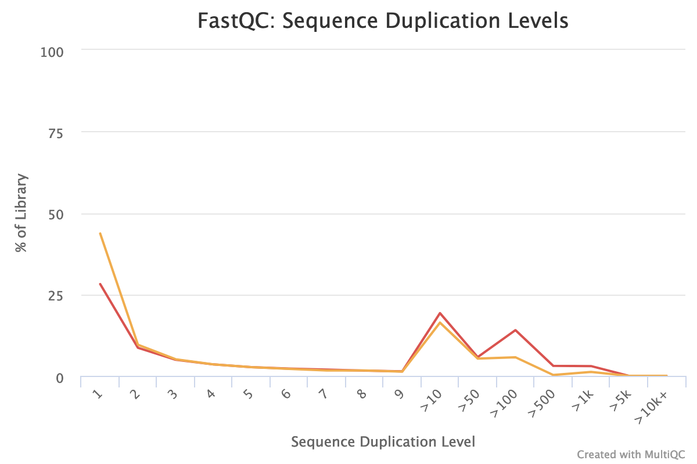
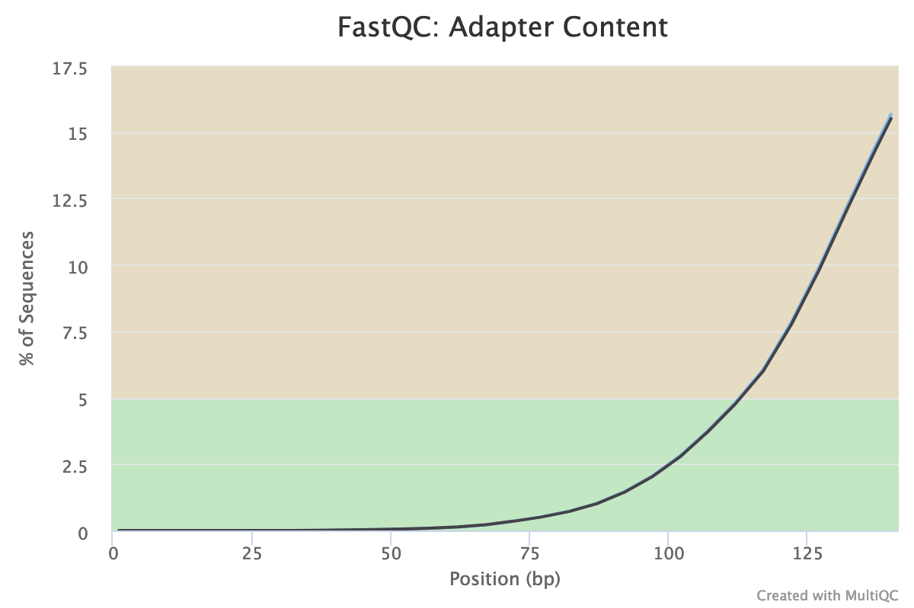


  
  

  
  


# Overview

In this tutorial we will perform a metatranscriptomics analysis based on the ASAIM workflow (), using data from .

> <comment-title>Note: Two versions of this tutorial</comment-title>
>
> Because this tutorial consists of many steps, we have made two versions of it, one long and one short.
>
> 
> This is the **shortened version**. Instead of running each tool individually, we will employ
> workflows to run groups of analysis steps (e.g. data cleaning) at once. If you would like
> more in-depth discussion of each step, please see the [longer version of tutorial]()
> 
> This is the **extended version**. We will run every tool manually and discuss the results in detail.
> If you would like to run through the tutorial a bit quicker and use workflows to run groups of
> analysis steps (e.g. data cleaning) at once, please see the [shorter version of this tutorial]()
> 
> You can also **switch** between the long and short version at the start of any section.
{: .comment}

# Introduction
{:.no_toc}

Microbiomes play a critical role in host health, disease, and the environment. The study of microbiota and microbial communities has been facilitated by the evolution of technologies, specifically the sequencing techniques. We can now study the microbiome dynamics by investigating the DNA content (metagenomics), RNA expression (metatranscriptomics), protein expression (metaproteomics) or small molecules (metabolomics):


New generations of sequencing platforms coupled to numerous bioinformatic tools have led to a spectacular technological progress in metagenomics and metatranscriptomics to investigate complex microorganism communities. These techniques are giving insight into taxonomic profiles and genomic components of microbial communities. Metagenomics is packed with information about the present taxonomies in a microbiome, but do not tell much about important functions. That is where metatranscriptomics and metaproteomics play a big part.


In this tutorial, we will focus on **metatranscriptomics**.

Metatranscriptomics analysis enables understanding of how the microbiome responds to the environment by studying the functional analysis of genes expressed by the microbiome. It can also estimate the taxonomic composition of the microbial population. It provides scientists with the confirmation of predicted open‐reading frames (ORFs) and potential identification of novel sites of transcription and/or translation from microbial genomes. Metatranscriptomics can enable more complete generation of protein sequences databases for metaproteomics.

To illustrate how to analyze metatranscriptomics data, we will use data from time-series analysis of a microbial community inside a bioreactor (). They generated metatranscriptomics data for 3 replicates over 7 time points. Before amplification the amount of rRNA was reduced by rRNA depletion. The sequencing libray was prepared with the TruSeq stranded RNA sample preparation, which included the production of a cDNA library.

In this tutorial, we focus on biological replicate A of the 1st time point. In a follow-up tutorial we will illustrate how to compare the results over the different time points and replicates. The input files used here are trimmed version of the original file for the purpose of saving time and resources.

To analyze the data, we will follow the ASaiM workflow and explain it step by step. ASaiM () is an open-source Galaxy-based workflow that enables microbiome analyses. Its workflow offers a streamlined Galaxy workflow for users to explore metagenomic/metatranscriptomic data in a reproducible and transparent environment. The ASaiM workflow has been updated by the **GalaxyP** team (University of Minnesota) to perform metatranscriptomics analysis of large microbial datasets.

The workflow described in this tutorial takes in paired-end datasets of raw shotgun sequences (in FastQ format) as an input and proceeds to:

1. Preprocess
2. Extract and analyze the community structure (taxonomic information)
2. Extract and analyze the community functions (functional information)
3. Combine taxonomic and functional information to offer insights into the taxonomic contribution to a function or functions expressed by a particular taxonomy.

A graphical representation of the ASaiM workflow which we will be using today is given below:

{: width="75%"}


> <comment-title>Workflow also applicable to metagenomics data</comment-title>
> The approach with the tools described here can also apply to metagenomics data. What will change are the quality control profiles and proportion of rRNA sequences.
{: .comment}

> <agenda-title></agenda-title>
>
> In this tutorial, we will cover:
>
> 1. TOC
> {:toc}
>
{: .agenda}

# Data upload

> <hands-on-title>Data upload</hands-on-title>
>
> 1. Create a new history for this tutorial and give it a proper name
>
>    
>    
>
> 2.  `T1A_forward` and `T1A_reverse` from [Zenodo]({{ page.zenodo_link }}) or from the data library (ask your instructor)
>
>    ```
>    {{ page.zenodo_link }}/files/T1A_forward.fastqsanger
>    {{ page.zenodo_link }}/files/T1A_reverse.fastqsanger
>    ```
>
>    
>    
>
>    As default, Galaxy takes the link as name, so rename them.
>
> 3. **Rename**  the files to `T1A_forward` and `T1A_reverse`
>
>    
>
> 4. Check that the datatype is `fastqsanger` (e.g. **not** `fastq`). If it is not, please change the datatype to `fastqsanger`.
>
>    
>
{: .hands_on}

# Preprocessing




Before starting any analysis, it is always a good idea to assess the quality of your input data and improve it where possible by trimming and filtering reads.

In this section we will run a workflow that performs the following tasks:
1. Assess read quality using **FastQC**  and  **MultiQC** 
2. Filter reads by length and quality using **Cutadapt** 
3. Remove ribosomal RNA (rRNA) using **SortMeRNA** 
4. Combine the high-quality reads into a single *interlaced* FastQ file for downstream analysis using **FastQ interlacer** 

We will run all these steps using a single workflow, then discuss each step and the results in more detail.

> <hands-on-title>Pretreatments</hands-on-title>
>
> 1. **Import the workflow** into Galaxy
>    - Copy the URL (e.g. via right-click) of [this workflow]({{ site.baseurl }}{{ page.dir }}workflows/workflow1_preprocessing.ga) or download it to your computer.
>    - Import the workflow into Galaxy
>
>    
>
> 2. Run **Workflow 1: Preprocessing**  using the following parameters:
>    - *"Send results to a new history"*: `No`
>    -  *"1: Forward FastQ file"*: `T1A_forward`
>    -  *"2: Reverse FastQ file"*: `T1A_reverse`
>
>    
>
{: .hands_on}

The workflow will take a little while to complete. Once tools have completed, the results will be available in your history for viewing. Note that only the most important outputs will he visible; intermediate files are hidden by default.

While you wait for the workflow to complete, please continue reading, in the next section(s) we will go into a bit more detail about what happens in each step of this workflow and examine the results.



## Quality control

During sequencing, errors are introduced, such as incorrect nucleotides being called. These are due to the technical limitations of each sequencing platform. Sequencing errors might bias the analysis and can lead to a misinterpretation of the data.

Sequence quality control is therefore an essential first step in your analysis.
In this tutorial we use similar tools as described in the tutorial ["Quality control"]():
- [FastQC](https://www.bioinformatics.babraham.ac.uk/projects/fastqc/) generates a web report that will aid you in assessing the quality of your data
- [MultiQC](https://multiqc.info/) combines multiple FastQC reports into a single overview report
- [Cutadapt](https://cutadapt.readthedocs.io/en/stable/guide.html) for trimming and filtering


 <!-- only in extended tutorial -->

> <hands-on-title>Quality control</hands-on-title>
>
> 1.  with the following parameters:
>       -  *"Short read data from your current history"*: both `T1A_forward` and `T1A_reverse` datasets selected with **Multiple datasets**
>
>    
>
> 2. Inspect the webpage output of **FastQC**  for the `T1A_forward` dataset
>
>    > <question-title></question-title>
>    >
>    > What is the read length?
>    >
>    > > <solution-title></solution-title>
>    > >
>    > > The read length is 151 bp.
>    > >
>    > {: .solution}
>    >
>    {: .question}
>
> 3.  with the following parameters to aggregate the FastQC reports:
>      - In *"Results"*
>        - *"Which tool was used generate logs?"*: `FastQC`
>        - In *"FastQC output"*
>           - *"Type of FastQC output?"*: `Raw data`
>           -  *"FastQC output"*: both `Raw data` files (outputs of **FastQC** )
>
> 5. Inspect the webpage output from MultiQC for each FASTQ
>
{: .hands_on}



For more information about how to interpret the plots generated by FastQC and MultiQC, please see [this section](#assess-quality-with-fastqc---short--long-reads) in our dedicated Quality Control Tutorial.

> <question-title></question-title>
>
> Inspect the webpage output from MultiQC
>
> 1. How many sequences does each file has?
> 2. How is the quality score over the reads? And the mean score?
> 3. Is there any bias in base content?
> 4. How is the GC content?
> 5. Are there any unindentified bases?
> 6. Are there duplicated sequences?
> 7. Are there over-represented sequences?
> 8. Are there still some adapters left?
> 9. What should we do next?
>
> > <solution-title></solution-title>
> >
> > 1. Both files have 260,554 sequences
> > 2. The "Per base sequence quality" is globally good: the quality stays around 40 over the reads, with just a slight decrease at the end (but still higher than 35)
> >
> >    
> >
> >    The reverse reads have a slight worst quality than the forward, a usual case in Illumina sequencing.
> >
> >    The distribution of the mean quality score is almost at the maximum for the forward and reverse reads:
> >
> >    
> >
> > 3. For both forward and reverse reads, the percentage of A, T, C, G over sequence length is biased. As for any RNA-seq data or more generally libraries produced by priming using random hexamers, the first 10-12 bases have an intrinsic bias.
> >
> >    
> >
> >    
> >
> >    We could also see that after these first bases the distinction between C-G and A-T groups is not clear as expected. It explains the error raised by FastQC.
> >
> > 4. With sequences from random position of a genome, we expect a normal distribution of the %GC of reads around the mean %GC of the genome. Here, we have RNA reads from various genomes. We do not expect a normal distribution of the %GC. Indeed, for the forward reads, the distribution shows with several peaks: maybe corresponding to mean %GC of different organisms.
> >
> >    
> >
> > 5. Almost no N were found in the reads: so almost no unindentified bases
> >
> >    
> >
> > 6. The forward reads seem to have more duplicated reads than the reverse reads with a rate of duplication up to 60% and some reads identified over 10 times.
> >
> >    
> >    
> >
> >    In data from RNA (metatranscriptomics data), duplicated reads are expected. The low rate of duplication in reverse reads could be due to bad quality: some nucleotides may have been wrongly identified, altering the reads and reducing the duplication.
> >
> > 7. The high rate of overrepresented sequences in the forward reads is linked to the high rate of duplication.
> >
> >    
> >
> > 8. Illumina universal adapters are still present in the reads, especially at the 3' end.
> >
> >    
> >
> > 10. After checking what is wrong, we should think about the errors reported by FastQC: they may come from the type of sequencing or what we sequenced (check the ["Quality control" training](): [FastQC](https://www.bioinformatics.babraham.ac.uk/projects/fastqc/) for more details): some like the duplication rate or the base content biases are due to the RNA sequencing. However, despite these challenges, we can still get slightly better sequences for the downstream analyses.
> {: .solution}
{: .question}

Even though our data is already of pretty high quality, we can improve it even more by:
1. Trimming reads to remove bases that were sequenced with low certainty (= low-quality bases) at the ends of the reads
2. Removing reads of overall bad quality
3. Removing reads that are too short to be informative in downstream analysis

> <question-title></question-title>
>
> What are the possible tools to perform such functions?
>
>   > <solution-title></solution-title>
>   >
>   > There are many tools such as **Cutadapt**, **Trimmomatic**, **Trim Galore**, **Clip**, **trim putative adapter** sequences. etc. We choose here **Cutadapt** because it is error tolerant, it is fast and the version is pretty stable.
>   {: .solution}
>
{: .question}

There are several tools out there that can perform these steps, but in this analysis we use **Cutadapt** ().

**Cutadapt** also helps find and remove adapter sequences, primers, poly-A tails and/or other unwanted sequences from the input FASTQ files. It trims the input reads by finding the adapter or primer sequences in an error-tolerant way. Additional features include modifying and filtering reads.



> <hands-on-title>Read trimming and filtering</hands-on-title>
>
> 1.  with the following parameters to trim low quality sequences:
>    - *"Single-end or Paired-end reads?"*: `Paired-end`
>       -  *"FASTQ/A file #1"*: `T1A_forward`
>       -  *"FASTQ/A file #2"*: `T1A_reverse`
>
>      The order is important here!
>
>    - In *"Filter Options"*
>       - *"Minimum length"*: `150`
>    - In *"Read Modification Options"*
>       - *"Quality cutoff"*: `20`
>    - In *"Output Options"*
>       - *"Report"*: `Yes`
>
>      
>
> 2. **Rename** 
>     - `Read 1 output` to `QC controlled forward reads`
>     - `Read 2 output` to `QC controlled reverse reads`
{: .hands_on}



**Cutadapt**  outputs a report file containing some information about the trimming and filtering it performed.

> <question-title></question-title>
>
> Inspect the output report from **Cutadapt** .
>
> 1. How many basepairs have been removed from the forwards reads because of bad quality? And from the reverse reads?
> 2. How many sequence pairs have been removed because at least one read was shorter than the length cutoff?
>
> > <solution-title></solution-title>
> > 1. 203,654 bp has been trimmed for the forward read (read 1) and 569,653 bp bp on the reverse (read 2). It is not a surprise: we saw that at the end of the sequences the quality was dropping more for the reverse reads than for the forward reads.
> > 2. 27,677 (10.6%) reads were too short after trimming and then filtered.
> {: .solution }
{: .question}


## Ribosomal RNA fragments filtering

Metatranscriptomics sequencing targets any RNA in a pool of micro-organisms. The highest proportion of the RNA sequences in any organism will be ribosomal RNAs.

These rRNAs are useful for the taxonomic assignment (i.e. which organisms are found) but they do not provide any functional information, (i.e. which genes are expressed). To make the downstream functional annotation faster, we will sort the rRNA sequences using **SortMeRNA** (). It can handle large RNA databases and sort out all fragments matching to the database with high accuracy and specificity:




> <hands-on-title>Ribosomal RNA fragments filtering</hands-on-title>
>
> 1.  with the following parameters:
>    - *"Sequencing type"*: `Reads are paired`
>       -  *"Forward reads"*: `QC controlled forward reads` (output of **Cutadapt** )
>       -  *"Reverse reads"*: `QC controlled reverse reads` (output of **Cutadapt** )
>       - *"If one of the paired-end reads aligns and the other one does not"*: `Output both reads to rejected file (--paired_out)`
>    - *"Databases to query"*: `Public pre-indexed ribosomal databases`
>       - *"rRNA databases"*:  Select all
>          -  `rfam-5s-database-id98`
>          -  `silva-arc-23s-id98`
>          -  `silva-euk-28s-id98`
>          -  `silva-bac-23s-id98`
>          -  `silva-euk-18s-id95`
>          -  `silva-bac-16s-id90`
>          -  `rfam-5.8s-database-id98`
>          -  `silva-arc-16s-id95`
>    - *"Include aligned reads in FASTA/FASTQ format?"*: `Yes (--fastx)`
>       - *"Include rejected reads file?"*: `Yes`
>    - *"Generate statistics file"*: `Yes`
>
> 2. Expand the aligned and unaligned forward reads datasets in the history
>
>    > <question-title></question-title>
>    >
>    > How many sequences have been identified as rRNA and non rRNA?
>    >
>    > > <solution-title></solution-title>
>    > >
>    > > Aligned forward read file has 1,947 sequences and the unaligned 2,858 sequences. Then 1,947 reads have been identified as rRNA and 2,858 as non rRNA. The numbers are the same for the reverse reads.
>    > >
>    > {: .solution }
>    {: .question}
>
{: .hands_on }



**SortMeRNA**  removes any reads identified as rRNA from our dataset, and outputs a log file with more information about this filtering.

> <question-title></question-title>
>
> Inspect the log output from **SortMeRNA** , and scroll down to the `Results` section.
>
> 1. How many reads have been processed?
> 2. How many reads have been identified as rRNA given the log file?
> 3. Which type of rRNA are identified? Which organisms are we then expected to identify?
>
> > <solution-title></solution-title>
> > 1. 465,754 reads are processed: 232,877 for forward and 232,877 for reverse (given the **Cutadapt** report)
> >
> > 2. Out of the 465,754 reads, 119,646 (26%) have passed the e-value threshold and are identified as rRNA.
> >
> >    The proportion of rRNA sequences is then quite high (around 40%), compared to metagenomics data where usually they represent < 1% of the sequences. Indeed there are only few copies of rRNA genes in genomes, but they are expressed a lot for the cells.
> >
> >    Some of the aligned reads are forward (resp. reverse) reads but the corresponding reverse (resp. forward) reads are not aligned. As we choose *"If one of the paired-end reads aligns and the other one does not"*: `Output both reads to rejected file (--paired_out)`, if one read in a pair does not align, both go to unaligned.
> >
> > 3. The 20.56% rRNA reads are 23S bacterial rRNA, 2.34% 16S bacterial rRNA and 1.74% 18S eukaryotic rRNA. We then expect to identify mostly bacteria but also probably some archae (18S eukaryotic rRNA).
> {: .solution }
{: .question}


## Interlace forward and reverse reads

The tool for functional annotations needs a single file as input, even with paired-end data.

We need to join the two separate files (forward and reverse) to create a single interleaced file, using **FASTQ interlacer**, in which the forward reads have `/1` in their id and reverse reads `/2`. The join is performed using sequence identifiers (headers), allowing the two files to contain differing ordering. If a sequence identifier does not appear in both files, it is output in a separate file named `singles`.

We use **FASTQ interlacer** on the unaligned (non-rRNA) reads from **SortMeRNA** to prepare for the functional analysis.



> <hands-on-title>Interlace FastQ files</hands-on-title>
>
> 1.  with the following parameters:
>   - *"Type of paired-end datasets”*: `2 separate datasets`
>      -  *"Left-hand mates"*: `Unaligned forward reads` (output of **SortMeRNA** )
>      -  *"Right-hand mates"*: `Unaligned reverse reads` (output of **SortMeRNA** )
>
> 2. **Rename**  the pair output to `Interlaced non rRNA reads`
>
{: .hands_on}




# Extraction of the community profile



The first important information to get from microbiome data is the community structure: which organisms are present and in which abundance. This is called **taxonomic profiling**.

Different approaches can be used:

- Identification and classification of Operational Taxonomic Units OTUs, as used in amplicon data

    Such an approach first requires sequence sorting to extract only the 16S and 18S sequences (e.g. using the aligned reads from **SortMeRNA**), then again using the same tools as for amplicon data (as explained in tutorials like [16S Microbial Analysis with mothur]() or [16S Microbial analysis with Nanopore data]()).

    However, because rRNA sequences represent less than 50% of the raw sequences, this approach is not the most statistically supported.

- Assignment of taxonomy on the whole sequences using databases with marker genes

In this tutorial, we follow second approach using **MetaPhlAn** (). This tool uses a database of ~1M unique clade-specific marker genes (not only the rRNA genes) identified from ~17,000 reference (bacterial, archeal, viral and eukaryotic) genomes.

As rRNAs reads are good marker genes, we will use directly the quality controlled files (output of **Cutadapt**) with all reads (not only the non rRNAs).



> <hands-on-title>Community Profile</hands-on-title>
>
> 1. **Import the workflow** into Galaxy
>    - Copy the URL (e.g. via right-click) of [this workflow]({{ site.baseurl }}{{ page.dir }}workflows/workflow2_community_profile.ga) or download it to your computer.
>    - Import the workflow into Galaxy
>
>    
>
> 2. Run **Workflow 2: Community Profile**  using the following parameters:
>    - *"Send results to a new history"*: `No`
>    -  *"1: QC controlled forward reads"*: `QC controlled forward reads` output from the first workflow
>    -  *"2: QC controlled reverse reads"*: `QC controlled reverse reads` output from the first workflow
>
>    
>
{: .hands_on}






> <hands-on-title>Extract the community structure</hands-on-title>
>
> 1.  with the following parameters:
>    - In *"Input(s)"*
>       - *"Input(s)"*: `Fasta/FastQ file(s) with metagenomic reads`
>          - *"Fasta/FastQ file(s) with metagenomic reads"*: `Paired-end files`
>             -  *"Forward paired-end Fasta/FastQ file with metagenomic reads"*: `QC controlled forward reads` (output of **Cutadapt** )
>             -  *"Reverse paired-end Fasta/FastQ file with metagenomic reads"*: `QC controlled reverse reads` (outputs of **Cutadapt** )
>       - *"Database with clade-specific marker genes"*: `Locally cached`
>         - *"Cached database with clade-specific marker genes"*: `MetaPhlAn clade-specific marker genes (mpa_v30_CHOCOPhlAn_201901)`
>    - In *"Analysis"*
>       - *"Type of analysis to perform"*: `rel_ab: Profiling a metagenomes in terms of relative abundances`
>          - *"Taxonomic level for the relative abundance output"*: `All taxonomic levels`
>          - *"Generate a report for each taxonomic level?": `Yes`
>       - *"Quantile value for the robust average"*: `0.1`
>       - *"Organisms to profile"*:
>          -  `Profile viral organisms (add_viruses)`
>    - In *"Output"*
>       - *"Output for Krona"*: `Yes`
{: .hands_on}

This step may take a couple of minutes as each sequence is compare to the full database with ~1 million reference sequences.



5 files and a collection are generated by **MetaPhlAn** :

- The main output: A **tabular file** called `Predicted taxon relative abundances` with the **community profile*

    ```
    #mpa_v30_CHOCOPhlAn_201901
    # ....
    #SampleID	Metaphlan_Analysis
    #clade_name	NCBI_tax_id	relative_abundance	additional_species
    k__Bacteria	2	99.40284
    k__Archaea	2157	0.59716
    k__Bacteria|p__Firmicutes	2|1239	94.67418
    k__Bacteria|p__Coprothermobacterota	2|2138240	4.72866
    k__Archaea|p__Euryarchaeota	2157|28890	0.59716
    k__Bacteria|p__Firmicutes|c__Clostridia	2|1239|186801	94.67418
    k__Bacteria|p__Coprothermobacterota|c__Coprothermobacteria	2|2138240|2138243	4.72866
    k__Archaea|p__Euryarchaeota|c__Methanobacteria
    ```

    Each line contains 4 columns:
    1. the lineage with different taxonomic levels
    2. the previous lineage with NCBI taxon id
    3. the relative abundance found for our sample for the lineage
    4. any additional species

    The file starts with high level taxa (kingdom: `k__`) and go to more precise taxa.

    > <question-title></question-title>
    >
    > Inspect the `Predicted taxon relative abundances` file output by **MetaPhlAn** 
    >
    > 1. How many taxons have been identified?
    > 2. What are the different taxonomic levels we have access to with MetaPhlAn?
    > 3. What genus and species are found in our sample?
    > 4. Has only bacteria been identified in our sample?
    >
    > > <solution-title></solution-title>
    > > 1. The file has 20 lines, including an header. Therefore, 17 taxons of different levels have been identified
    > > 2. We have access: kingdom (`k__`), phylum (`p__`), class (`c__`), order (`o__`), family (`f__`), genus (`g__`), species (`s__`), strain (`t__`)
    > > 3. In our sample, we identified:
    > >     - 3 genera: Coprothermobacter, Methanothermobacter, Hungateiclostridium
    > >     - 3 species: Coprothermobacter proteolyticus, Methanothermobacter thermautotrophicus, Hungateiclostridium thermocellum
    > > 4. As expected from the rRNA sorting, we have some archaea, Methanobacteria, in our sample.
    > {: .solution }
    {: .question}

- A **collection** with the same information as in the tabular file but splitted into different files, one per taxonomic level
- A **tabular file** called `Predicted taxon relative abundances for Krona` with the same information as the previous file but formatted for visualization using Krona. We will use this file later
- A **BIOM file** with the same information as the previous file but in BIOM format

    BIOM format is quite common in microbiomics. This is standard, for example, as the input for tools like mothur or QIIME.

- A **SAM file** with the results of the sequence mapping on the reference database.
- A **tabular file** called `Bowtie2 output` with similar information as the one in the **SAM file**


> <comment-title>Note: Analyzing an isolated metatranscriptome</comment-title>
>
> We are analyzing our RNA reads as we would do for DNA reads. This approach has one main caveat. In **MetaPhlAn**, the species are quantified based on the recruitment of reads to species-specific marker genes. In metagenomic data, each genome copy is assumed to donate ~1 copy of each marker. But the same assumption cannot be made for RNA data: markers may be transcribed more or less within a given species in this sample compared to the average transcription rate. A species will still be detected in the metatranscriptomic data as long as a non-trivial fraction of the species' markers is expressed.
>
> We should then carefully interpret the species relative abundance. These values reflect species' relative contributions to the pool of species-specific transcripts and not the overall transcript pool.
{: .comment}



Some downstream tools need the MetaPhlAn table with predicted taxon abundance with only 2 columns: the lineage and the abundance.

> <hands-on-title>Format taxon relative abundances table</hands-on-title>
> 1.  with the following parameters:
>    - *"Cut columns"*: `c1,c3`
>    -  *"From"*: `Predicted taxon relative abundances` (output of **MetaPhlAn**)
>
> 2. Rename `Cut predicted taxon relative abundances table`
>
{: .hands_on}



## Community structure visualization

Even if the output of **MetaPhlAn** can be easy to parse, we want to visualize and explore the community structure. 2 tools can be used there:

- **Krona** for an interactive HTML output
- **Graphlan** for a publication ready visualization



> <hands-on-title>Interactive community structure visualization with KRONA</hands-on-title>
>
> 1.  with
>    - *"What is the type of your input data"*: `Tabular`
>       -  *"Input file"*: `Predicted taxon relative abundances for Krona` (output of **MetaPhlAn**)
>
{: .hands_on}



**Krona**  renders results of a metagenomic profiling as a zoomable pie chart. It allows hierarchical data, here taxonomic levels, to be explored with zooming, multi-layered pie charts

> <question-title></question-title>
>
> Inspect the output from **Krona** . (The interactive plot is also shown below)
>
> 1. What are the abundances of 2 kingdoms identified here?
> 2. When zooming on Bacteria, what are the 2 subclasses identified?
>
> <br/><br/>
> <center><iframe id="krona" src="krona.html" frameBorder="0" width="90%" height="600px">  </iframe></center>
>
> > <solution-title></solution-title>
> >
> > 1. Archaea represents 0.6% so bacteria are 99.4% of the organisms identified in our sample
> >
> >    {: width="75%"}
> >
> > 2. 5% of bacteria are Coprothermobacter proteolyticus and the rest Hungateiclostridium thermocellum .
> >
> >    {: width="75%"}
> >
> {: .solution}
{: .question}

**GraPhlAn** is another software tool for producing high-quality circular representations of taxonomic and phylogenetic trees.


It takes a taxonomic tree file as the input. We first need to convert the **MetaPhlAn** output using **Export to GraPhlAn**. This conversion software tool produces both annotation and tree file for GraPhlAn.

> <hands-on-title>Publication-ready community structure visualization with GraPhlAn</hands-on-title>
>
> 2.  with the following parameters:
>    -  *"Input file"*: `Cut predicted taxon relative abundances table`
>    - *"List which levels should be annotated in the tree"*: `1,2`
>    - *"List which levels should use the external legend for the annotation"*: `3,4,5`
>    - *"List which levels should be highlight with a shaded background"*: `1`
>
> 3.  with the following parameters:
>    -  *"Input tree"*: `Tree` (output of **Export to GraPhlAn**)
>    -  *"Annotation file"*: `Annotation` (output of **Export to GraPhlAn**)
>
> 4.  with the following parameters:
>    -  *"Input tree"*: `Tree in PhyloXML`
>    - *"Output format"*: `PNG`
>
> 5. Inspect **GraPhlAn** output
>
{: .hands_on}




# Extract the functional information


We would now like to answer the question "What are the micro-organisms doing?" or "Which functions are performed by the micro-organisms in the environment?".

In the metatranscriptomics data, we have access to the genes that are expressed by the community. We can use that to identify genes, their functions, and build pathways, etc., to investigate their contribution to the community using **HUMAnN** (). **HUMAnN** is a pipeline developed for efficiently and accurately profiling the presence/absence and abundance of microbial pathways in a community from metagenomic or metatranscriptomic sequencing data.

To identify the functions made by the community, we do not need the rRNA sequences, specially because they had noise and will slow the run. We will then use the output of **SortMeRNA**, but also the identified community profile from **MetaPhlAn**. This will help **HUMAnN** to focus on the known sequences for the identified organisms.




> <hands-on-title>Functional Information</hands-on-title>
>
> 1. **Import the workflow** into Galaxy
>    - Copy the URL (e.g. via right-click) of [this workflow]({{ site.baseurl }}{{ page.dir }}workflows/workflow3_functional_information.ga) or download it to your computer.
>    - Import the workflow into Galaxy
>
>    
>
> 2. Run **Workflow 3: Functional Information**  using the following parameters:
>    - *"Send results to a new history"*: `No`
>    -  *"1: Interlaced non-rRNA reads"*: `Interlaced non-rRNA reads` output from the first workflow
>    -  *"2: Community Profile"*: `Predicted taxon relative abundances` output from the second workflow
>
>    
>
> > <tip-title>Running low on time? Use this faster approach</tip-title>
> >
> > The first step of this workflow (**HUMAnN** ) may take quite a bit of time to complete (> 45 min). If you would like to run through this tutorial a bit faster, you can download the output of this step first, and then run the rest of the workflow. Instructions are given below:
> >
> > 1. **Import the workflow** into Galaxy
> >    - Copy the URL (e.g. via right-click) of [this workflow]({{ site.baseurl }}{{ page.dir }}workflows/workflow3_functional_information_quick.ga) or download it to your computer.
> >    - Import the workflow into Galaxy
> >
> > 2. **Import** the following 2 files (these are the outputs from **HUMAnN** ):
> >
> >    ```
> >    {{ page.zenodo_link }}/files/T1A_HUMAnN_Gene_families_and_their_abundance.tabular
> >    {{ page.zenodo_link }}/files/T1A_HUMAnN_Pathways_and_their_abundance.tabular
> >    ```
> >
> > 3. Run **Workflow 3: Functional Information (quick)**  using the following parameters:
> >    - *"Send results to a new history"*: `No`
> >    -  *"1: Gene Family abundance"*: `T1A_HUMAnN_Gene_families_and_their_abundance.tabular` you uploaded
> >    -  *"2: Pathway abundance"*: `T1A_HUMAnN_Pathways_and_their_abundance.tabular` you uploaded
> >
> {: .tip}
{: .hands_on}






> <hands-on-title>Extract the functional information</hands-on-title>
>
> 1.  with the following parameters:
>    - *"Input(s)"*: `Quality-controlled shotgun sequencing reads (metagenome (DNA reads) or metatranscriptome (RNA reads))`
>       -  *"Quality-controlled shotgun sequencing reads (metagenome (DNA reads) or metatranscriptome (RNA reads))"*: `Interlaced non rRNA reads`
>    - *"Steps"*: `Bypass the taxonomic profiling step and creates a custom ChocoPhlAn database of the species provided afterwards`
>       - *"Taxonomic profile file"*: `Predicted taxon relative abundances` (output of **MetaPhlAn** )
>       - In *"Nucleotide search / Mapping reads to community pangenomes"*
>          - *"Nucleotide database"*: `Locally cached`
>             - *"Nucleotide database"*: `Full ChocoPhlAn for HUMAnN`
>       - In *"Translated search / Aligning unmapped reads to a protein database"*
>          - *"Protein database"*: `Locally cached`
>             - *"Protein database"*: `Full UniRef90 for HUMAnN`
>
>
{: .hands_on}

> <tip-title>Running low on time? Import the HUMAnN outputs</tip-title>
>
> 1. Import the 2 files:
>
>    ```
>    {{ page.zenodo_link }}/files/T1A_HUMAnN_Gene_families_and_their_abundance.tabular
>    {{ page.zenodo_link }}/files/T1A_HUMAnN_Pathways_and_their_abundance.tabular
>    ```
{: .tip}



**HUMAnN**  generates 4 files:

1. A tabular file with the **gene families and their abundance**:

    ```
    # Gene Family	humann_Abundance-RPKs
    UNMAPPED	98294.0000000000
    UniRef90_A3DCI4	42213.2661898446
    UniRef90_A3DCI4|g__Hungateiclostridium.s__Hungateiclostridium_thermocellum	42205.5707425926
    UniRef90_A3DCI4|unclassified	7.6954472520
    UniRef90_A3DCB9	39273.2031556915
    UniRef90_A3DCB9|g__Hungateiclostridium.s__Hungateiclostridium_thermocellum	39273.2031556915
    ```

    This file details the abundance of each gene family in the community. Gene families are groups of evolutionarily-related protein-coding sequences that often perform similar functions. Here we used [UniRef90 gene families](https://www.uniprot.org/help/uniref): sequences in a gene families have at least 50% sequence identity.

    Gene family abundance at the community level is stratified to show the contributions from known and unknown species. Individual species' abundance contributions sum to the community total abundance.

    Gene family abundance is reported in RPK (reads per kilobase) units to normalize for gene length. It reflects the relative gene (or transcript) copy number in the community.

    The "UNMAPPED" value is the total number of reads which remain unmapped after both alignment steps (nucleotide and translated search). Since other gene features in the table are quantified in RPK units, "UNMAPPED" can be interpreted as a single unknown gene of length 1 kilobase recruiting all reads that failed to map to known sequences.

    > <question-title></question-title>
    >
    > **Inspect** the `Gene families and their abundances` file from **HUMAnN** 
    >
    > 1. What is the most abundant family?
    > 2. Which species is involved in production of this family?
    > 3. How many gene families have been identified?
    >
    > > <solution-title></solution-title>
    > > 1. The most abundant family is the first one in the family: UniRef90_A3DCI4. We can use the tool  to add extra information about the gene family.
    > > 2. Beta-lactamase TEM seems mostly produced here by *Hungateiclostridium thermocellum*.
    > > 3. There is 6,374 lines in gene family file. But some of the gene families have multiple lines when the involved species are known.
    > >
    > >      To know the number of gene families, we need to remove all lines with the species information, i.e. lines with `|` in them using the tool 
    > >
    > >      The tool generates 2 output file:
    > >      - a stratified table with all lines with `|` in them
    > >      - a unstratied table with all lines without `|` in them
    > >
    > >      In the unstratified table, there are 3,175 lines, so 3,174 gene families.
    > {: .solution }
    {: .question}

2. A tabular file with the **pathways and their abundance**:

    ```
     # Pathway	humann_Abundance
    UNMAPPED	21383.0328532606
    UNINTEGRATED	123278.2617863865
    UNINTEGRATED|g__Hungateiclostridium.s__Hungateiclostridium_thermocellum	114029.8324087679
    UNINTEGRATED|unclassified	6301.1699240597
    UNINTEGRATED|g__Coprothermobacter.s__Coprothermobacter_proteolyticus	5407.2826151090
    PWY-6609: adenine and adenosine salvage III	285.7955913866
    PWY-6609: adenine and adenosine salvage III|g__Hungateiclostridium.s__Hungateiclostridium_thermocellum	66.3688569288
    PWY-1042: glycolysis IV	194.7465938041
    ```

    This file shows each pathway and their abundance. Here, we used  the [MetaCyc Metabolic Pathway Database](https://metacyc.org/), a curated database of experimentally elucidated metabolic pathways from all domains of life.

    The abundance of a pathway in the sample is computed as a function of the abundances of the pathway's component reactions, with each reaction's abundance computed as the sum over abundances of genes catalyzing the reaction. The abundance is proportional to the number of complete "copies" of the pathway in the community. Indeed, for a simple linear pathway `RXN1 --> RXN2 --> RXN3 --> RXN4`, if RXN1 is 10 times as abundant as RXNs 2-4, the pathway abundance will be driven by the abundances of RXNs 2-4.

    The pathway abundance is computed once for all species (community level) and again for each species  using species gene abundances along the components of the pathway. Unlike gene abundance, a pathway's  abundance at community-level is not necessarily the sum of the abundance values of each species. For example, for the same pathway example as above, if the abundances of RXNs 1-4 are [5, 5, 10, 10] in Species A and [10, 10, 5, 5] in Species B, the pathway abundance would be 5 for Species A and Species B, but 15 at the community level as the reaction totals are [15, 15, 15, 15].

    > <question-title></question-title>
    >
    > **View** the `Pathways and their abundance` output from **HUMAnN** 
    >
    > 1. What is the most abundant pathway?
    > 2. Which species is involved in production of this pathway?
    > 3. How many gene families have been identified?
    > 4. What is the "UNINTEGRATED" abundance?
    >
    > > <solution-title></solution-title>
    > > 1. The most abundant pathway is PWY-6609. It produces the adenine and adenosine salvage III.
    > > 2. Like the gene family, this pathway is mostly achieved by *Hungateiclostridium thermocellum*.
    > > 3. There are 118 lines in the pathway file, including the lines with species information. To compute the number of gene families, we need to apply a similar approach as for the gene families by removing the lines with `|` in them using the tool .
    > >      The unstratified output file has 64 lines, including the header, UNMAPPED and UNINTEGRATED. Therefore, 61 MetaCyc pathways have been identified for our sample.
    > >
    > > 4. The "UNINTEGRATED" abundance corresponds to the total abundance of genes in the different levels that do not contribute to any pathways.
    > {: .solution }
    {: .question}

3. A file with the **pathways and their coverage**:

    Pathway coverage provides an alternative description of the presence (1) and absence (0) of pathways in a community, independent of their quantitative abundance.

4. A log file

> <comment-title>Note: Analyzing an isolated metatranscriptome</comment-title>
>
> As we already mentioned above, we are analyzing our RNA reads as we would do for DNA reads and therefore we should be careful when interpreting the results. We already mentioned the analysis of the species' relative abundance from **MetaPhlAn**, but there is another aspect we should be careful about.
>
> From a lone metatranscriptomic dataset, the transcript abundance can be confounded with the underlying gene copy number. For example, transcript X may be more abundant in sample A relative to sample B because the underlying X gene (same number in both samples) is more highly expressed in sample A relative to sample B; or there are more copies of gene X in sample A relative to sample B (all of which are equally expressed). This is a general challenge in analyzing isolated metatranscriptomes.
>
> The best approach would be to combine the metatranscriptomic analysis with a metagenomic analysis. In this case, rather than running **MetaPhlAn** on the metatranscriptomic data, we run it on the metagenomic data and use the taxonomic profile as input to **HUMAnN**. RNA reads are then mapped to any species' pangenomes detected in the metagenome. Then we run **HUMAnN** on both metagenomics and metatranscriptomic data. We can use both outputs to normalize the RNA-level outputs (e.g. transcript family abundance) by corresponding DNA-level outputs to the quantification of microbial expression independent of gene copy number.
>
> Here we do not have a metagenomic dataset to combine with and need to be careful in our interpretation.
>
{: .comment}


## Normalize the abundances

Gene family and pathway abundances are in RPKs (reads per kilobase), accounting for gene length but not sample sequencing depth. While there are some applications, e.g. strain profiling, where RPK units are superior to depth-normalized units, most of the time we need to renormalize our samples prior to downstream analysis.




> <hands-on-title>Normalize the gene family abundances</hands-on-title>
>
> 1.  with
>    - *"Gene/pathway table"*: `Gene families and their abundance` (output of **HUMAnN**)
>    - *"Normalization scheme"*: `Relative abundance`
>    - *"Normalization level"*: `Normalization of all levels by community total`
>
> 2. **Rename**  the generated file `Normalized gene families`
>
{: .hands_on}



> <question-title></question-title>
>
> **Inspect**  the `Normalized gene families` file
>
> 1. What percentage of sequences has not been assigned to a gene family?
> 2. What is the relative abundance of the most abundant gene family?
>
> > <solution-title></solution-title>
> > 1. 14% (`0.14438 x 100`) of the sequences have not be assigned to a gene family.
> > 2. The UniRef90_A3DCI4 family represents 6% of the reads.
> {: .solution }
{: .question}




Let's do the same for the pathway abundances.

> <hands-on-title>Normalize the pathway abundances</hands-on-title>
>
> 1.  with
>    - *"Gene/pathway table"*: `Pathways and their abundance` (output of **HUMAnN**)
>    - *"Normalization scheme"*: `Relative abundance`
>    - *"Normalization level"*: `Normalization of all levels by community total`
>
> 2. **Rename**  the generated file `Normalized pathways`
>
{: .hands_on}




> <question-title></question-title>
>
> **Inspect**  the `Normalized pathways` file.
> 1. What is the UNMAPPED percentage?
> 2. What percentage of reads assigned to a gene family has not be assigned to a pathway?
> 3. What is the relative abundance of the most abundant gene family?
>
> > <solution-title></solution-title>
> > 1. UNMAPPED, here 14% of the reads, corresponds to the percentage of reads not assigned to gene families. It is the same value as in the normalized gene family file.
> > 2. 83% (UNINTEGRATED) of reads assigned to a gene family have not be assigned to a pathway
> > 3. The PWY-6609 pathway represents 0.2% of the reads.
> {: .solution }
{: .question}


## Identify the gene families involved in the pathways

We would like to know which gene families are involved in our most abundant pathways and which species.
For this, we use the tool **Unpack pathway abundances to show genes included**  from **HUMAnN** tool suites.



> <hands-on-title>Normalize the gene family abundances</hands-on-title>
>
> 1.  with
>    - *"Gene family or EC abundance file"*: `Normalized gene families`
>    - *"Pathway abundance file"*: `Normalized pathways`
>
{: .hands_on}



This tool unpacks the pathways to show the genes for each. It adds another level of stratification to the pathway abundance table by including the gene family abundances:

```
# Pathway	humann_Abundance-RELAB
ANAGLYCOLYSIS-PWY: glycolysis III (from glucose)	0.000312308
BRANCHED-CHAIN-AA-SYN-PWY: superpathway of branched chain amino acid biosynthesis	0.00045009
BRANCHED-CHAIN-AA-SYN-PWY|g__Hungateiclostridium.s__Hungateiclostridium_thermocellum	0.00045009
BRANCHED-CHAIN-AA-SYN-PWY|g__Hungateiclostridium.s__Hungateiclostridium_thermocellum|UniRef90_A3DIY4	9.67756e-06
BRANCHED-CHAIN-AA-SYN-PWY|g__Hungateiclostridium.s__Hungateiclostridium_thermocellum|UniRef90_A3DIE1	0.000123259
BRANCHED-CHAIN-AA-SYN-PWY|g__Hungateiclostridium.s__Hungateiclostridium_thermocellum|UniRef90_A3DID9	9.73261e-05
BRANCHED-CHAIN-AA-SYN-PWY|g__Hungateiclostridium.s__Hungateiclostridium_thermocellum|UniRef90_A3DDR1	7.97357e-05
BRANCHED-CHAIN-AA-SYN-PWY|g__Hungateiclostridium.s__Hungateiclostridium_thermocellum|UniRef90_A3DF94	1.4837e-05
BRANCHED-CHAIN-AA-SYN-PWY|g__Hungateiclostridium.s__Hungateiclostridium_thermocellum|UniRef90_A3DIY3	0.000117313
```

> <question-title></question-title>
>
> **Inspect**  the output from **Unpack pathway abundances to show genes included** 
>
> Which gene families are involved in the PWY-6609 pathway (the most abundant one)? And which species?
>
> > <solution-title></solution-title>
> > If we search the generated file for (using <kbd>CTR</kbd><kbd>F</kbd> or <kbd>CMD</kbd><kbd>F</kbd>):
> >
> > ````
> > PWY-6609: adenine and adenosine salvage III	0.00192972
> > PWY-6609|g__Hungateiclostridium.s__Hungateiclostridium_thermocellum	0.000448128
> > PWY-6609|g__Hungateiclostridium.s__Hungateiclostridium_thermocellum|UniRef90_A3DD28	4.47176e-05
> > PWY-6609|g__Hungateiclostridium.s__Hungateiclostridium_thermocellum|UniRef90_A3DHM7	0.000235689
> > PWY-6609|g__Hungateiclostridium.s__Hungateiclostridium_thermocellum|UniRef90_A3DEQ4	3.68298e-05
> > ```
> >
> > The gene families UniRef90_A3DD28, UniRef90_A3DHM7 and UniRef90_A3DEQ4 are identified, for *Hungateiclostridium thermocellum*.
> {: .solution }
{: .question}

## Group gene families into GO terms

The gene families can be a long list of ids and going through the gene families one by one to identify the interesting ones can be cumbersome. To help construct a big picture, we could identify and use categories of genes using the gene families.

[Gene Ontology (GO)](http://www.geneontology.org/) analysis is widely used to reduce complexity and highlight biological processes in genome-wide expression studies. There is a dedicated tool which groups and converts UniRef50 gene family abundances generated with **HUMAnN** into GO terms.



> <hands-on-title>Group abundances into GO terms</hands-on-title>
>
> 1.  with the following parameters:
>    -  *"Gene families table"*: `Gene families and their abundance` (output of **HUMAnN**)
>    - *"How to combine grouped features?"*: `Sum`
>    - *"Grouping"*: `Grouping with larger mapping`
>       - *"Mapping to use for the grouping"*: `Mapping (full) for Gene Ontology (GO) from UniRef90`
>
{: .hands_on}



The output is a table with the GO terms, their abundance and the involved species:

```
# Gene Family	humann_Abundance-RPKs
UNMAPPED	98294.0
UNGROUPED	174431.144
UNGROUPED|g__Coprothermobacter.s__Coprothermobacter_proteolyticus	6941.859
UNGROUPED|g__Hungateiclostridium.s__Hungateiclostridium_thermocellum	151964.371
UNGROUPED|unclassified	15524.915
GO:0000015	250.882
GO:0000015|g__Coprothermobacter.s__Coprothermobacter_proteolyticus	11.313
GO:0000015|g__Hungateiclostridium.s__Hungateiclostridium_thermocellum	239.568
```

> <question-title></question-title>
>
> How many GO term have been identified?
>
> > <solution-title></solution-title>
> > Using the tool , we see that the unstratified table has 1,171 lines (including the UNMAPPED, UNGROUPED and the header). So 1,168 GO terms have been identified.
> {: .solution }
{: .question}




The GO term with their id are quite cryptic. We can rename them and then split them in 3 groups  (molecular functions [MF], biological processes [BP] and cellular components [CC])

> <hands-on-title>Rename GO terms</hands-on-title>
>
> 1.  with the following parameters:
>    -  *"Gene families table"*: output of **Regroup HUMAnN table features**
>    - *"Type of feature renaming"*: `Advanced feature renaming`
>       - *"Features to be renamed"*: `Mapping (full) between Gene Ontology (GO) ids and names`
>
> 2.  with the following parameters:
>    -  *"Select lines from"*: output of last **Rename features of a HUMAnN generated table**
>    - *"that"*: `Matching`
>    - *"the pattern"*: `\[CC\]`
>
> 3. **Rename**  the generated file `[CC] GO terms and their abundance`
>
> 4.  with the following parameters:
>    -  *"Select lines from"*: output of last **Rename features of a HUMAnN generated table**
>    - *"that"*: `Matching`
>    - *"the pattern"*: `\[MF\]`
>
> 5. **Rename**  the generated file `[MF] GO terms and their abundance`
>
> 6.  with the following parameters:
>    -  *"Select lines from"*: output of last **Rename features of a HUMAnN generated table**
>    - *"that"*: `Matching`
>    - *"the pattern"*: `\[BP\]`
>
> 7. **Rename**  the generated file `[BP] GO terms and their abundance`
{: .hands_on}



> <question-title></question-title>
>
> **Inspect**  the 3 outputs of these steps
>
> 1. How many GO terms have been identified?
> 2. Which of the GO terms related to molecular functions is the most abundant?
>
> > <solution-title></solution-title>
> >
> > 1. After running  on the 3 outputs, we found:
> >   - 414 BP GO terms
> >   - 689 MF GO terms
> >   - 59 CC GO terms
> >
> > 2. The GO terms in the `[MF] GO terms and their abundance` file are not sorted by abundance:
> >
> >    ```
> >    GO:0000030: [MF] mannosyltransferase activity	16.321
> >    GO:0000030: [MF] mannosyltransferase activity|g__Hungateiclostridium.s__Hungateiclostridium_thermocellum	16.321
> >    GO:0000036: [MF] acyl carrier activity	726.249
> >    GO:0000036: [MF] acyl carrier activity|g__Coprothermobacter.s__Coprothermobacter_proteolyticus	10.101
> >    GO:0000036: [MF] acyl carrier activity|g__Hungateiclostridium.s__Hungateiclostridium_thermocellum	572.281
> >    GO:0000036: [MF] acyl carrier activity|unclassified	143.868
> >    GO:0000049: [MF] tRNA binding	4818.299
> >    ```
> >
> >    So to identify the most abundant GO terms, we first need to sort the file using the  tool (on column 2, in descending order):
> >
> >    ```
> >    GO:0015035: [MF] protein disulfide oxidoreductase activity	42908.123
> >    GO:0003735: [MF] structural constituent of ribosome	42815.337
> >    GO:0015035: [MF] protein disulfide oxidoreductase activity|g__Hungateiclostridium.s__Hungateiclostridium_thermocellum	40533.997
> >    GO:0005524: [MF] ATP binding	37028.271
> >    GO:0046872: [MF] metal ion binding	31068.144
> >    ```
> >
> >    The most abundant GO terms related to molecular functions seem to be linked to protein disulfide oxidoreductase activity, but also to structural constituent of ribosome and ATP and metal ion binding.
> {: .solution}
{: .question}

# Combine taxonomic and functional information

With **MetaPhlAn** and **HUMAnN**, we investigated "Which micro-organims are present in my sample?" and "What functions are performed by the micro-organisms in my sample?". We can go further in these analyses, for example using a combination of functional and taxonomic results. Although we did not detail that in this tutorial you can find more methods of analysis in our tutorials on shotgun metagenomic data analysis.

Although gene families and pathways, and their abundance may be related to a species, in the **HUMAnN** output, relative abundance of the species is not indicated. Therefore, for each gene family/pathway and the corresponding taxonomic stratification, we will now extract the relative abundance of this gene family/pathway and the relative abundance of the corresponding species and genus.

> <hands-on-title>Combine taxonomic and functional information</hands-on-title>
>
> 1.   with the following parameters:
>   -  *"Input file corresponding to MetaPhlAN output"*: `Cut predicted taxon relative abundances table`
>   -  *"Input file corresponding HUMAnN output"*: `Normalized gene families`
>   - *"Type of characteristics in HUMAnN file"*: `Gene families`
>
> 2. Inspect the generated file
{: .hands_on}

The generated file is a table with 7 columns:
1. genus
2. abundance of the genus (percentage)
3. species
4. abundance of the species (percentage)
5. gene family id
6. gene family name
7. gene family abundance (percentage)

```
genus	genus_abundance	species	species_abundance	gene_families_id	gene_families_name	gene_families_abundance
Hungateiclostridium	94.67418	Hungateiclostridium_thermocellum	94.67418	UniRef90_A3DCI4		6.199410892039433
Hungateiclostridium	94.67418	Hungateiclostridium_thermocellum	94.67418	UniRef90_A3DCB9		5.768680830061254
Hungateiclostridium	94.67418	Hungateiclostridium_thermocellum	94.67418	UniRef90_A3DC67		4.872720701140655
Hungateiclostridium	94.67418	Hungateiclostridium_thermocellum	94.67418	UniRef90_A3DBR3		3.3930004882222335
Hungateiclostridium	94.67418	Hungateiclostridium_thermocellum	94.67418	UniRef90_A3DI60		2.924280420777634
Hungateiclostridium	94.67418	Hungateiclostridium_thermocellum	94.67418	UniRef90_G2JC59		2.639170379752865
```

> <question-title></question-title>
>
> 1. Are there gene families associated with each genus identified with **MetaPhlAn**?
> 2. How many gene families are associated to each genus?
> 3. Are there gene families associated to each species identified with **MetaPhlAn**?
> 4. How many gene families are associated to each species?
>
> > <solution-title></solution-title>
> >
> > 1. To answer the questions, we need to group the contents of the output of **Combine MetaPhlAn2 and HUMAnN2 outputs** by 1st column and count the number of occurrences of gene families. We do that using **Group data by a column** :
> >
> >    > <hands-on-title>Group by genus and count gene families</hands-on-title>
> >    > 1. 
> >    >    - *"Select data"*: output of **Combine MetaPhlAn2 and HUMAnN2 outputs**
> >    >    - *"Group by column"*: `Column:1`
> >    >    - *"Operation"*:
> >    >      - Click on  *"Insert Operation"*
> >    >        - *"Type"*: `Count`
> >    >        - *"On column"*: `Column:5`
> >    {: .hands_on}
> >
> >    With **MetaPhlAn**, we identified 3 genus (Coprothermobacter, Methanothermobacter, Hungateiclostridium). But in the output of **Combine MetaPhlAn2 and HUMAnN2 outputs**, we have only gene families for Coprothermobacter and Hungateiclostridium. The abundance of Methanothermobacter is probably too low to correctly identify correctly some gene families.
> >
> > 2. 1,889 gene families are associated to Hungateiclostridium and 528 to Coprothermobacter and 202 to Methanothermobacter.
> >
> > 3. For this question, we should group on the 3rd column:
> >
> >    > <hands-on-title>Group by species and count gene families</hands-on-title>
> >    > 1. 
> >    >    - *"Select data"*: output of **Combine MetaPhlAn2 and HUMAnN2 outputs**
> >    >    - *"Group by column"*: `Column:3`
> >    >    - *"Operation"*:
> >    >      - Click on  *"Insert Operation"*
> >    >        - *"Type"*: `Count`
> >    >        - *"On column"*: `Column:5`
> >    {: .hands_on}
> >
> >    Only 2 species (Coprothermobacter_proteolyticus and Hungateiclostridium thermocellum) identified by **MetaPhlAn** are associated to gene families.
> >
> > 4. As the species found derived directly from the genus (not 2 species for the same genus here), the number of gene families identified are the sames: 528 for Coprothermobacter proteolyticus and 1,889 for Hungateiclostridium thermocellum.
> >
> {: .solution}
{: .question}

We could now apply the same tool to the pathways and run similar analysis.

# Conclusion
{:.no_toc}

In this tutorial, we analyzed one metatranscriptomics sample from raw sequences to community structure, functional profiling. To do that, we:

1. preprocessed the raw data: quality control, trimming and filtering, sequence sorting and formatting
2. extracted and analyzed the community structure (taxonomic information)

    We identified bacteria to the level of strains, but also some archaea.

3. extracted and analyzed the community functions (functional information)

    We extracted gene families, pathways, but also the gene families involved in pathways and aggregated the gene families into GO terms

4. combined taxonomic and functional information to offer insights into taxonomic contribution to a function or functions expressed by a particular taxonomy

The workflow can be represented this way:


The dataset used here was extracted from a time-series analysis of a microbial community inside a bioreactor () in which there are 3 replicates over 7 time points. We analyzed here only one single time point for one replicate.
