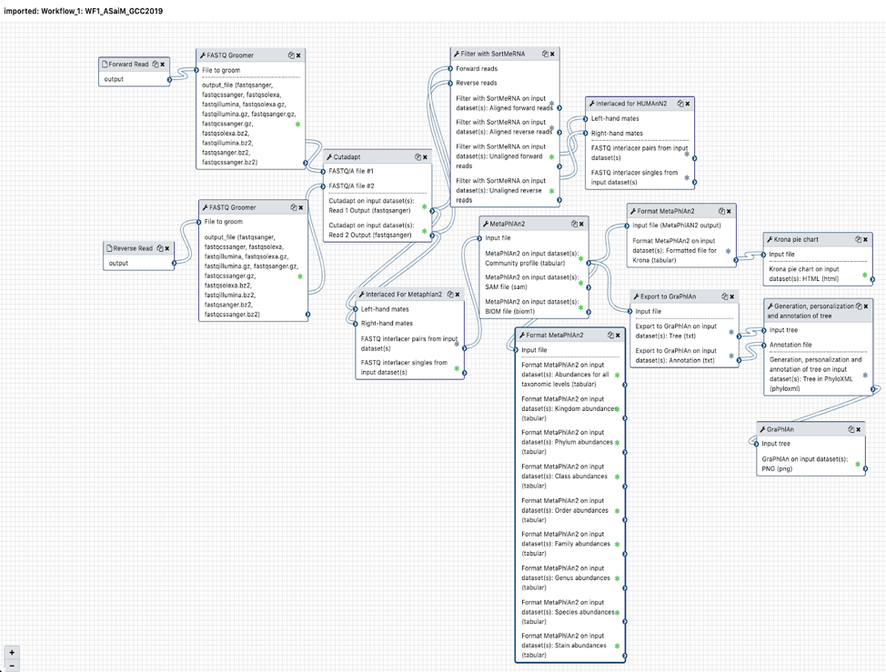
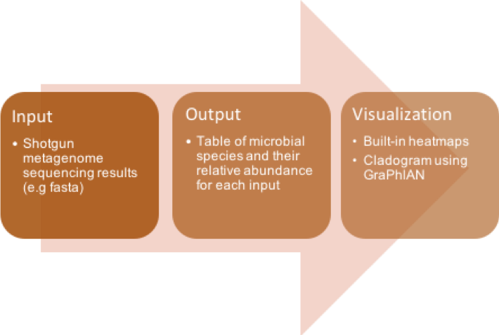
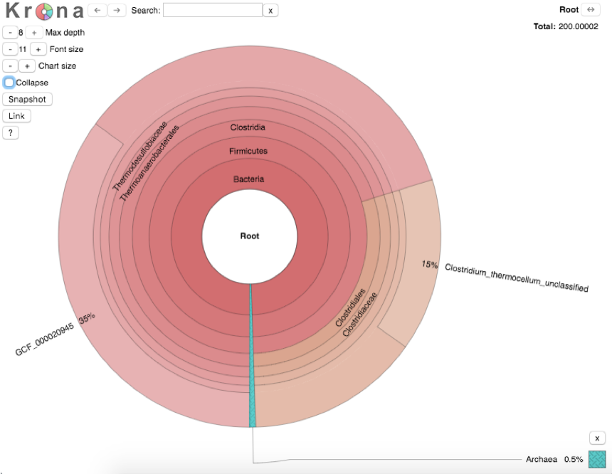
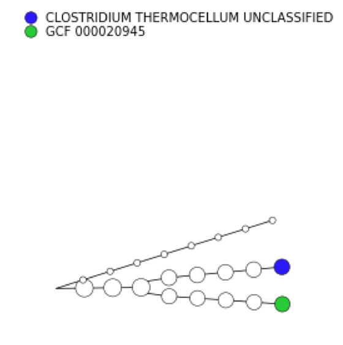

# Introduction
{:.no_toc}

This tutorial is an updated version of the ASaiM workflow developed by the **GalaxyP** team (University of Minnesota) to perform metatranscriptomics analysis of large microbial datasets. The datasets used in this tutorial are the trimmed versions of the original file. 

> ### Agenda
>
> In this tutorial, we will cover:
>
> 1. Hands on training on using metatranscriptomics tools.
> 2. Visualization of the data
> {:toc}
>
{: .agenda}

# Metatranscriptomics for characterizing microbial communities

###  Multi-omics
A multi-omic approach to studying microbiomes can cover the various taxa and functions in a system.


Here is an exhaustive picture of taxonomy and functional pathways and their dynamics. It provides users with the confirmation of predicted open‐reading frames (ORFs) and potential identification novel sites of transcription and/or translation from microbial genomes. Metatranscriptomics can enable more complete generation of protein sequences databases for metaproteomics.


## Get data

> ###  Hands-on: Data upload
>
> 1. Create a new history for this tutorial
> 2. Import the files from [Zenodo]() or from the shared data library
>
>    ```
>    https://zenodo.org/api/files/84d7d6c9-2b7b-4569-87f6-dabc5ee42bc2/FORWARD_T4A_F.fastqsanger
>    https://zenodo.org/api/files/84d7d6c9-2b7b-4569-87f6-dabc5ee42bc2/REVERSE_T4A_R.fastqsanger
>    ```
>
> 3. Rename the datasets
>
>    > ###  TIP
>    >
>    > The files can also be imported through shared Data libraries in usegalaxy.eu. The files will be labelled as Metatranscriptomics_GTN_input.
>    {: .tip}
{: .hands_on}

# ASaiM Workflow

Microbiomes play a critical role in host health, disease, and the environment. Microbiome dynamics, especially at the taxonomy and functional level requires studying the DNA content (metagenomics), RNA expression (metatranscriptomics), protein expression (metaproteomics) or small molecules (metabolomics). Metatranscriptomics analysis enables understanding of how the microbiome responds to the environment by studying the functional analysis of genes expressed by the microbiome. It can also estimate the taxonomic composition of the microbial population.

Batut ​et al.​(​10.1093/gigascience/giy057​) developed ASaiM (Auvergne Sequence analysis of intestinal Microbiota) an open-source Galaxy-based workflow that enables microbiome analyses. ASaiM workflow offers a streamlined Galaxy workflow for users to explore metagenomic/metatranscriptomic data in a reproducible and transparent environment. In this tutorial, we demonstrate the use of an updated version of the ASaiM workflow. This workflow takes in paired-end datasets of raw shotgun sequences (in FastQ format) as an input; preprocess it; extract taxonomic and functional information and combines them to offer insights into taxonomic contribution to a function or functions expressed by a particular taxonomy.

In this ASaiM metatranscriptomics tutorial, the fastqsanger files are used as input dataset. We have used a trimmed version of the original fastq file in this tutorial for the purpose of saving time and resources.
Here we are providing users with step by step ASaiM workflow to analyze metatranscriptomics data.




Please follow these steps once you have uploaded the files from zenodo to your galaxy instance. 


## **FASTQ Groomer**

> ###  Hands-on: The FASTQ Groomer tool provides the user with several formatting options related to the input FASTQ file. In the Default option, the output will be sanger formatted (i.e. file.fastqsanger). If you choose the Advanced option, the user has the capability to choose between any format and force quality scoring i.e. if the score falls outside the target score range, it will be converted to the closest available value.
>
> 1. **FASTQ Groomer**  with the following parameters:
>    -  *"File to groom”*: `T4A_F`
>    -  *"Input FASTQ quality scores type"*:`Sanger & Illumina 1.8+`
>    - *"Advanced Options"*: `Hide Advanced Options`
>   
> 2. **Execute**
>
>    > ###  Comment
>    >
>    > Perform this action on both the files (**Forward and Reverse(T4_R)**)
>    {: .comment}
>
{: .hands_on}


## **Cutadapt**

> ###  Hands-on: Cutadapt helps finding and removing adapter sequences, primers, poly-A tails or other unwanted sequences from the input FASTQ files. It trims the input reads by finding the adapter or primer sequences in an error-tolerant way. It also has additional features of modifying and filtering reads.
>
> 1. **Cutadapt**  with the following parameters:
>  -  *"Single-end or Paired-end reads?"*: `Paired-end`
>  -  *”FASTQ/A file #1 ”*: `FASTQ groomer on data 1` 
>  -  *”FASTQ/A file #2 ”*:`FASTQ groomer on data 2`
>  -  *”Adapter options ”*: `Default`
>  -  *”Filter options ”*: `Default`
>  -  *”Read Modifications options ”*: `Default`
>  -  *”Output options ”*: `Default`
>
> 2. **Execute**
>
>    > ###  Comment
>    >
>    > Keep all the other parameters default
>    {: .comment}
>
{: .hands_on}
>
> ###  Questions
>
> 1. Are there any other tool which can perform similar functions?
> 2. Reason behind selecting Cutadapt??
>
> > ###  Solution
> >
> > 1.Yes, there are many tools such as Trimmomatic, Trim Galore, Clip, trim putative adapter sequences. etc.
> > 2. The reason for choosing Cutadapt for this function is because it is error tolerant and the version is pretty stable.
> {: .solution}
>
{: .question}

## **Filter with SortMeRNA**

> ###  Hands-on: SortMeRNA is a tool used to filter ribosomal RNA fragments from metatranscriptomic data produced by next-generation sequencers. It is capable of handling large RNA databases and sorting out all fragments matching to the database with high accuracy and specificity. It can take paired-end reads as well as single-end reads.

>
> 1. **Filter with SortMeRNA**  with the following parameters:
>
>   -  *”Sequencing type”*: `Reads are paired`
>   -  *”Forward reads”*: `Read 1: trimmed`
>   -  *”Reverse reads”*: `Read 2: trimmed`
>   -  *”If one of the paired-end reads aligns and the other one does not”*: `Output both reads to rejected file (--paired_out)`
>   -  *”Which strands to search”*: `Search both strands`
>   -  *”Databases to query”*: `Public pre-indexed ribosomal databases`
>   -  *”rRNA databases”*: ‘Select all’
>   -  *”Include aligned reads in FASTA/FASTQ format?”*: `Yes (--fastx)`
>   -  *”Include rejected reads file?”*: `Yes`
>   -  *”Generate statistics file”*: `No`
>   -  *”Alignment report”*: `Do not report alignments`
>   -  *”E-value threshold”*: `1`
>   -  *”SW score for a match”*: `2`
>   -  *”SW penalty for a mismatch”*: `-3`
>   -  *”SW penalty for introducing a gap”*: `5`
>   -  *”SW penalty for extending a gap”*: `2`
>   -  *”SW penalty for ambiguous letters (N’s)”*: `-3`
>
> 2. **Execute**
>
>    > ###  Comment
>    >
>    > We used the Galaxy Version 2.1b.6 for our research as it was the most stable and latest version.
>    {: .comment}
>
{: .hands_on}

The next step is the interlacing step wherein we join the two separate files (forward and reverse) to create a single output.There are two FASTQ interlacers in this workflow. The first one is for MetaPhlAn2 input and the other for HUMANn2 input.

>    > ###  Comment
>    > Please pay attention to which interlacing step you are performing. Provide appropriate inputs.
>    > 
>    {: .comment}

## **FASTQ interlacer**

> ###  Hands-on: This tool joins paired-end FASTQ reads from two separate files, one with the forward reads and one with the reverse reads, into a single files where forward alternate with their reverse reads. The join is performed using sequence identifiers (headers), allowing the two files to contain differing ordering. If a sequence identifier does not appear in both files, it provides a separate file.

>
> 1. **FASTQ interlacer**  with the following parameters: For MetaPhlAn2
>    - *"Type of paired-end datasets"*: `2 separate datasets`
>
>    ***TODO***: *Check parameter descriptions*
>   -  *”Type of paired-end datasets”*: ‘2 separate datasets’
>   -  *”Left-hand mates”*: `Cutadapt on data 4 and data 3: Read 1 Output`
>   -  *”Right-hand mates”*:`Cutadapt on data 4 and data 3: Read 2 Output`
>
> 2. **Execute**
> 3. Rename the output to MetaPhlAn2 input.
>
>    > ###  Comment
>    >
>    > The FASTQ joiner tool was not used in this workflow as the format of the output was not suitable for our analysis.
>    {: .comment}
>
{: .hands_on}


## **FASTQ interlacer**

> ###  Hands-on: 
>
> 1. **FASTQ interlacer**  with the following parameters: For HUMANn2
>    - *"Type of paired-end datasets"*: `2 separate datasets`
>   -  *”Type of paired-end datasets”*: ‘2 separate datasets’
>   -  *”Left-hand mates”*: `Filter with sortmeRNA: Unaligned Forward reads`
>   -  *”Right-hand mates”*: `Filter with sortmeRNA: Unaligned Reverse reads`
>
> 2. **Execute**
>
> 3. Rename the output to HUMANn2 input
{: .hands_on}

## **MetaPhlAn2**

> ###  Hands-on: MetaPhlAn2 is a computational tool used to profile the structure and the composition of microbial communities (Bacteria, Archaea, Eukaryotes and Viruses) from metagenomic shotgun sequencing data with species level resolution. MetaPhlAn2 takes as input a sequence file, in this case the FASTQ interlacer output. The output is a tab-separated file with the predicted taxon relative abundances.

>
> 1. **MetaPhlAn2**  with the following parameters:
>   -  *”Input file”*: `MetaPhlAn2 input`
>   -  *”Database with clade-specific marker genes”*: `Locally cached`
>   -  *”Cached database with clade-specific marker genes”*: `MetaPhlAn2 clade-specific marker genes`
>   -  *”Type of analysis to perform”*: `Profiling a metagenomes in terms of relative abundances`
>   -  *”Taxonomic level for the relative abundance output”*: `All taxonomic levels`
>   -  *”Minimum total nucleotide length for the markers in a clade for estimating the abundance without considering sub-clade abundances”*: `2000`
>   -  *”Sam records for aligned reads with the longest subalignment length smaller than this threshold will be discarded”*: `0`
>   -  *”Profile viral organisms?”*: `Yes`
>   -  *”Profile eukaryotic organisms?”*: `Yes`
>   -  *”Profile bacteria organisms?”*: `Yes`
>   -  *”Profile archea organisms?”*: `Yes`
>   -  *”Quantile value for the robust average”*: `0.1`
>
> 2. **Execute**
>
>    > ###  Comment
>    >
>    > If you want to know more about MetaPhlAn2, you can check out by clicking on this [link] (https://bitbucket.org/biobakery/metaphlan2/src/default/)
>    {: .comment}
>
{: .hands_on}


## **HUMAnN2**

> ###  Hands-on: HUMAnN2 is a pipeline developed for efficiently and accurately profiling the presence/absence and abundance of microbial pathways in a community from metagenomic or metatranscriptomic sequencing data. For creating the input for HUMAnN2, we interlaced the output from SortmeRNA into a single FASTQ file. This interlaced file and the MetaPhlAn2 output (taxonomic profile) is used as the HUMAnN2 input. For functional profiling, it uses multiple databases that are locally cached nucleotide or protein databases.
>
> 1. **HUMAnN2**  with the following parameters:
>   -  *"Input sequence file"*: `HUMANn2 input`
>   -  *"Use of a custom taxonomic profile"*: `Yes`
>   -  *"Taxonomic profile file"*: `Community profile` output of `MetaPhlAn2`
>   -  *"Nucleotide database"*: `Locally cached`
>   -  *"Nucleotide database"*: `Full`
>   -  *"Protein database"*: `Locally cached`
>   -  *"Protein database"*: `Full UniRef50`
>   -  *"Search for uniref50 or uniref90 gene families?"*: `uniref50`
>   -  *"Database to use for pathway computations"*: `MetaCyc`
>   -  *"Advanced Options"*:`Default`
>   -  *"Remove stratification from output"*: `Yes`
>
> 2. **Execute**
>
>    > ###  Comment
>    > This step might take some time. Please have patience or get take a coffee/tea break!!!
>    > 
>    {: .comment}
>
{: .hands_on}


##  **Export to GraPhlAn**

> ###  Hands-on: export2graphlan is a conversion software tool to produce both annotation and tree file for GraPhlAn. It can convert MetaPhlAn, LEfSe, and/or HUMAnN output to GraPhlAn input format.

In particular, the annotation file tries to highlight specific sub-trees deriving automatically from input file what nodes are important.
>
> 1. **Export to GraPhlAn**  with the following parameters:
>   -  *”Input file”*: `MetaPhlAn2 Community file`
>   -  *”Use a LEfSe output file as input?”*: `No`
>   -  *”List which levels should be annotated in the tree”*: `blank`
>   -  *”List which levels should use the external legend for the annotation”*: `blank`
>   -  *”List which levels should be highlight with a shaded background”*: `blank`
>   -  *”List which of the clades that should be highlight with a shaded background”*: `blank`
>   -  *”List of color to use for the shaded background”*: `blank`
>   -  *”Title of the GraPhlAn plot”*: `blank`
>   -  *”Title font size”*: `15`
>   -  *”Default size  for clades that are not found as biomarkers”*: `10`
>   -  *”Minimum value of clades that are biomarkers”*: `20`
>   -  *”Maximum value of clades that are biomarkers”*: `200`
>   -  *”Default font size”*: `10`
>   -  *”Minimum font size”*: `8`
>   -  *”Maximum font size”*: `12`
>   -  *”Font size for the annotation legend”*: `10`
>   -  *”Minimum abundance value for a clade to be annotated”*: `20.0`
>   -  *”Number of clades to highlight”*: `blank`
>   -  *”Minimum number of biomarkers to extract”*: `blank`
>   -  *”Row number containing the names of the features”*: `0`
>   -  *”Row containing the names of the samples”*: `0`
>   -  *”Row number to use as metadata”*: `blank`
>   -  *”Row number to skip from the input file”*: `blank`
>   -  *”Percentile of sample value distribution for sample selection”*: `blank`
>   -  *”Percentile of feature value distribution for sample selection”*: ‘’
>   -  *”Number of top samples to select”*: `blank`
>   -  *”Number of top features to select”*: `blank`
>
> 2. **Execute**
>
>    > ###  Comment
>    >
>    > It is a conversion tool to produce both annotation and tree file that can serve as an input to GraPhlAn.
>    {: .comment}
>
{: .hands_on}

 ## **Format MetaPhlAn2 output** 
> ###  Hands-on: This step provides tabular output per taxonomic level with its abundance.
>

> 1. **Format MetaPhlAn2 output**  with the following parameters:
>   -  *”Input file (MetaPhlAN2 output)”*: ‘MetaPhlAn2 Community File’
> 2. **Execute**
{: .hands_on}
> ###  Questions
>
> 1. What does Format MetaPhlAn2 do??
> 2. What is the need for formatting the data?
>
> > ###  Solution
> >
> > 1. This tool format output file of MetaPhlan2 containing community content (abundance) at all taxonomic levels (from kingdom to strains).9 files are generated: one file per taxonomic levels with abundance for corresponding clades and one file combining all taxonomic levels and corresponding abundances.
> >
> > 2. This tool helps in simplifying the data for easy interpretation.
> >
> {: .solution}
>
{: .question}


 ## **Format MetaPhlAn2 output for Krona** 
> ###  Hands-on:This step just creates a tabular output that is easily readable by Krona (visualization).
>
> 1.**Format MetaPhlAn2 output for Krona**  with the following parameters:
>   -  *”Input file (MetaPhlAN2 output)”*: ‘MetaPhlAn2 Community File’
>
> 2. **Execute**
>
{: .hands_on}

> ###  Questions
>
> 1. What does Format MetaPhlAn2 do??
>
> > ###  Solution
> > 1. This tool formats MetaPhlAn2 output to be ready for Krona.
> >
> {: .solution}
>
{: .question}

## **Krona Pie chart** 

> ###  Hands-on: This tool renders results of a metagenomic profiling as a zoomable pie chart using Krona.

>
> 1. **Krona pie chart**  with the following parameters:
>   -  *”What is the type of your input data”*: `Tabular`
>   -  *”Input file”*: `Format MetaPhlAn2 Krona output`
>   -  *”Provide a name for the basal rank”*: `Root`
>   -  *”Combine data from multiple datasets”*: `No`
>
> 2. **Execute**
{: .hands_on}


## **Group abundances**

> ###  Hands-on: This tool groups and converts UniRef50 gene family abundances generated with HUMAnN2 into GO slim terms. Custom databases can be provided: a custom Gene Ontology file with the core ontology, a custom slim Gene Ontology with description of slim GO terms to use, and a custom mapping file for mapping UniRef50 gene families to GO terms.

>
> 1. **Group abundances**  with the following parameters:
>   -  *”HUMAnN2 output with UniRef 50 gene family abundance”*: `HUMAnN2 Gene families and their abundance file`
>   -  *”Use a custom Gene Ontology file?”*: `No`
>   -  *”Use a custom slim Gene Ontology file?”*: `No`
>   -  *”Use a custom correspondence between UniReg50 and precise GO?”*: `No`  
>
> 2. **Execute**
>
>    > ###  Comment
>    >
>    > 3 outputs are generated from executing this tool : abundances of GO slim terms grouped in 3 groups (molecular functions, biological processes and cellular components).Each file is a tabular file with 3 columns: GO slim term id, name and abundance.
>    {: .comment}
>
{: .hands_on}


## **Create a genus level gene families file**

> ###  Hands-on: The gene families and pathways output files from HUMAnN2 are species level by default. This tool generates genus level gene families

>
> 1. **Create a genus level gene families file**  with the following parameters:
>   -  *”Gene families input table”*: `HUMAnN2 Gene families and their abundance file`
> 2. **Execute**
>
{: .hands_on}


## **Combine MetaPhlAn2 and HUMAnN2 outputs**

> ###  Hands-on: This tool combine MetaPhlAn2 outputs and HUMANnN2 outputs.

For each gene families/pathways and the corresponding taxonomic stratification, you get relative abundance of this gene family/pathway and the relative abundance of corresponding species and genus.

>
> 1. **Combine MetaPhlAn2 and HUMAnN2 outputs**  with the following parameters:
>   -  *”Input file corresponding to MetaPhlAN2 output”*: `MetaPhlAn2 Community File`
>   -  *”Input file corresponding HUMAnN2 output”*: `HUMAnN2 Gene families and their abundance file`
>   -  *”Type of characteristics in HUMAnN2 file”*: `Gene families`
>
> 2. **Execute**
>

{: .hands_on}


## Sub-step with **Combine MetaPhlAn2 and HUMAnN2 outputs**

> ###  Hands-on: Task description
>
> 1. **Combine MetaPhlAn2 and HUMAnN2 outputs**  with the following parameters:
>   -  *”Input file corresponding to MetaPhlAN2 output”*: `MetaPhlAn2 Community File`
>   -  *”Input file corresponding HUMAnN2 output”*: `HUMAnN2 Pathways and their abundance file`
>   -  *”Type of characteristics in HUMAnN2 file”*: `Gene families`
> 2. **Execute**
{: .hands_on}


##**Generation, personalization and annotation of tree**

> ###  Hands-on: This tool takes the Export to GraphlAn output ( tree and annotation ) and creates a phylogenetic tree (format: phyloxml).
>
> 1. **Generation, personalization and annotation of tree**  with the following parameters:
>   -  *”Input tree”*: `Export to GraPhlAn Tree output`
>   -  *”Annotation file”*: `Export to GraPhlAn Annotation output`
> 2. **Execute**
>    > ###  Comment
>    >
>    > A comment about the tool or something else. This box can also be in the main text
>    {: .comment}
>
{: .hands_on}

## **GraPhlAn**

> ###  Hands-on: GraPhlAn is a software tool for producing high-quality circular representations of taxonomic and phylogenetic trees. It takes the input from the Generation, personalization and annotation of tree for Graphlan tool to create these .png images.

>
> 1. **GraPhlAn**  with the following parameters:
>   -  *”Input tree”*: `Generation, personalization and annotation of tree output`
>   -  *”Output format”*: `PNG`
>   -  *”Dpi of the output image”*: `blank`
>   -  *”Size of the output image”*: `7`
>   -  *”Distance between the most external graphical element and the border of the image”*: `blank`
>

{: .hands_on}


# Conclusion
{:.no_toc}

")

Congratulations, you have now successfully completed the ASaiM tutorial modified for metatranscriptomics analysis.
