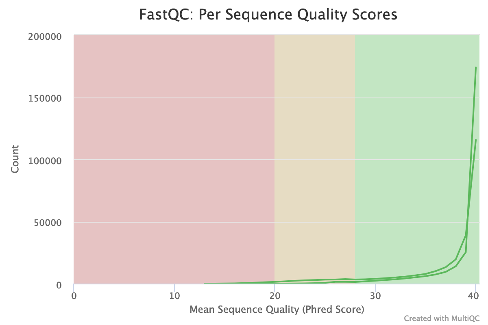

# Introduction
{:.no_toc}

Microbiomes play a critical role in host health, disease, and the environment. The study of microbiota and microbial communities has been facilitated by the evolution of technologies, specifically the sequencing techniques. We can now study the microbiome dynamics by investigating the DNA content (metagenomics), RNA expression (metatranscriptomics), protein expression (metaproteomics) or small molecules (metabolomics):


New generations of sequencing platforms coupled to numerous bioinformatics tools have led to a spectacular technological progress in metagenomics and metatranscriptomics to investigate complex microorganism communities. These techniques are giving insight into taxonomic profiles and genomic components of microbial communities. Metagenomics is packed with information about the present taxonomies in a microbiome, but do not tell much about important functions. That is where metatranscriptomics and metaproteomics play a big part.


In this tutorial, we will focus on **metatranscriptomics**. 

Metatranscriptomics analysis enables understanding of how the microbiome responds to the environment by studying the functional analysis of genes expressed by the microbiome. It can also estimate the taxonomic composition of the microbial population. It provides scientists with the confirmation of predicted open‐reading frames (ORFs) and potential identification novel sites of transcription and/or translation from microbial genomes. Metatranscriptomics can enable more complete generation of protein sequences databases for metaproteomics.

To illustrate how to analyze metatranscriptomics data, we will use data from time-serie analysis of a microbial community inside a bioreactor (). They generated metatranscriptomics data for 3 replicates over 8 time points. RNAs were enriched by rRNA depletion and treated with DNAse and library was prepared with the TruSeq stranded RNA sample preparation, which included the production of a cDNA library. 

Here, we focus on biological replicate A and the 2nd time point. The input files used here were trimmend out the original file for the purpose of saving time and resources. 

To analyze the data, we will follow the ASaiM workflow and explain it step by step. ASaiM () is an open-source Galaxy-based workflow that enables microbiome analyses. Its workflow offers a streamlined Galaxy workflow for users to explore metagenomic/metatranscriptomic data in a reproducible and transparent environment. The ASaiM workflow has been updated by the **GalaxyP** team (University of Minnesota) to perform metatranscriptomics analysis of large microbial datasets.

This workflow takes in paired-end datasets of raw shotgun sequences (in FastQ format) as an input and:
1. preprocess
2. extract and analyze the community structure (taxonomic information)
2. extract and analyze the community functions (functional information)
3. combine taxonomic and functional information to offer insights into taxonomic contribution to a function or functions expressed by a particular taxonomy.

> ### Agenda
>
> In this tutorial, we will cover:
>
> 1. TOC
> {:toc}
>
{: .agenda}

# Data upload

> ###  Hands-on: Data upload
>
> 1. Create a new history for this tutorial and give it a proper name
>
>    
>    
>
> 2. Import `FORWARD_T4A_F` and `REVERSE_T4A_R` from [Zenodo](https://zenodo.org/record/3269404) or from the data library (ask your instructor)
>
>    ```
>    https://zenodo.org/api/files/84d7d6c9-2b7b-4569-87f6-dabc5ee42bc2/FORWARD_T4A_F.fastqsanger
>    https://zenodo.org/api/files/84d7d6c9-2b7b-4569-87f6-dabc5ee42bc2/REVERSE_T4A_R.fastqsanger
>    ```
>
>    
>    
>
>    As default, Galaxy takes the link as name, so rename them.
>
> 3. Rename the file to `FORWARD_T4A_F` and `REVERSE_T4A_R`
>
>    
>
> 4. Check that the datatype is `fastqsanger` (e.g. **not** `fastq`). If it is not, please change the datatype to `fastqsanger`.
>
>    
>
{: .hands_on}

# Pretreatments

## Quality control

During sequencing, errors are introduced, such as incorrect nucleotides being called. These are due to the technical limitations of each sequencing platform. Sequencing errors might bias the analysis and can lead to a misinterpretation of the data.

Sequence quality control is therefore an essential first step in your analysis. We will use similar tools as described in the ["Quality control" training]({{site.baseurl}}): [FastQC](https://www.bioinformatics.babraham.ac.uk/projects/fastqc/) and [Cutadapt](https://cutadapt.readthedocs.io/en/stable/guide.html).

> ###  Hands-on: Quality control
>
> 1. **FastQC**  with the following parameters:
>       -  *"Short read data from your current history"*: both `FORWARD_T4A_F` and `REVERSE_T4A_R` datasets selected with **Multiple datasets**
>
>    
>
> 2. Inspect the webpage output of **FastQC**  for the `FORWARD_T4A_F` dataset
>
>    > ###  Questions
>    >
>    > What is the read length?
>    >
>    > > ###  Solution
>    > >
>    > > The read length is 151 bp.
>    > >
>    > {: .solution}
>    >
>    {: .question}
>
> 3. **MultiQC**  with the following parameters to aggregate the FastQC reports:
>      - In *"Results"*
>        - *"Which tool was used generate logs?"*: `FastQC`
>        - In *"FastQC output"*
>           - *"Type of FastQC output?"*: `Raw data`
>           -  *"FastQC output"*: `Raw data` files (output of **FastQC** )
>
> 4. Inspect the webpage output from MultiQC for each FASTQ
>
{: .hands_on}

> ###  Questions
>
> 1. How many sequences have the files?
> 2. How is the quality score over the reads? And the mean score?
> 3. Is there any bias in base content?
> 4. How is the GC content?
> 5. Is there any unindentified bases?
> 6. Is there duplicated sequences?
> 7. Is there over-represented sequences?
> 8. Is there still some adapters left?
> 9. What should we do?
>
> > ###  Solution
> >
> > 1. Both files have 5,000 sequences
> > 2. The "Per base sequence quality" is globally good for the forward reads: the quality stays around 40 over the reads, with just a slight decrease at the end (but still higher than 35)
> >
> >    
> >
> >    On the contrary, the reverse reads have a bad quality: the quality varies a lot with a value at the end around 20 and a high variability between the reads.
> >
> >    As a result, the distribution of the mean quality score is almost at the maximum for the forward. But for the reverse reads, we can see a wider distribution with a peak 38.
> >
> >    
> >
> > 3. For both forward and reverse reads, the base content per base is biased. As for any RNA-seq data or more generally libraries produced by priming using random hexamers, the first 10-12 bases have an intrinsic bias.
> >
> >    
> >
> >    
> >
> >    We could also see that after these first based the distinction between C-G and A-T groups is not clear. It explains the error raised by FastQC.
> >
> > 4. Forward reads are quite following a normal distribution of GC content. The distribution is on the other hand not so good for the reverse reads with several peaks, probably biaised by the bad quality reads.
> >
> >    
> >
> > 5. Almost no N were found in the reads: so almost no unindentified bases
> >
> >    
> >
> > 6. The forward reads seem to have more duplicated reads than the reverse reads with a rate up to 30%, with some reads found more the 10 times. 
> >
> >    
> >    
> >
> >    In data from RNA as in metatranscriptomics data, duplicated reads are expected. The lower rate in reverse reads is maybe due to their bad quality: some nucleotides may have been wrongly called, changing then the reads and reducing the duplication.
> >
> > 7. The high rate of overrepresented sequences in the forward reads is linked to the high rate of a duplication there.
> >
> >    
> > 
> > 8. Illumina universal adapters are still present in the reads, specially at the 3' end.
> >
> >    
> >
> > 10. After checking what is wrong, we should think about the errors reported by FastQC: they may come from the type of sequencing or what we sequenced (check the ["Quality control" training]({{site.baseurl}}): [FastQC](https://www.bioinformatics.babraham.ac.uk/projects/fastqc/) for more details). Here, some like the duplication rate or the base content biais are due to the RNA sequencing. But the bad quality of the reverse reads or the left adapters could be improved to get better sequences for the downstream analyses.
> {: .solution} 
{: .question}

We should trim sequenced read to get rid of bases that were sequenced with high uncertainty (= low quality bases) at the read ends but also remove the reads of overall bad quality, using [**Cutadapt**](https://cutadapt.readthedocs.io/en/stable/) 

**Cutadapt** helps also finding and removing adapter sequences, primers, poly-A tails or other unwanted sequences from the input FASTQ files. It trims the input reads by finding the adapter or primer sequences in an error-tolerant way. It also has additional features of modifying and filtering reads.

> ###  Questions
>
> Are there any other tool which can perform similar functions?
>
>   > ###  Solution
>   >
>   > Yes, there are many tools such as Trimmomatic, Trim Galore, Clip, trim putative adapter sequences. etc. We choose Cutadapt here because it is error tolerant, it is fast and the version is pretty stable.
>   {: .solution}
>
{: .question}

> ###  Hands-on: Quality control
>
> 1. **Cutadapt**  with the following parameters to trim low quality sequences:
>    - *"Single-end or Paired-end reads?"*: `Paired-end`
>       -  *"FASTQ/A file #1"*: `FORWARD_T4A_F`
>       -  *"FASTQ/A file #2"*: `REVERSE_T4A_F`
>
>      The order is important here!
>
>    - In *"Filter Options"*
>       - *"Minimum length"*: `150`
>    - In *"Read Modification Options"*
>       - *"Quality cutoff"*: `20`
>    - In *"Output Options"*
>       - *"Report"*: `Yes`
>
>      
>
> 2. Inspect the generated txt files (`Report`)
>
>    > ###  Questions
>    >
>    > 1. How many basepairs has been removed from the forwards reads because of bad quality? And from the reverse reads?
>    > 2. How many sequence pairs have been removed because at least one read was shorter than the length cutoff?
>    >
>    > > ###  Solution
>    > > 1. 3,480 bp has been trimmed for the forward read and 62,236 bp bp on the reverse (read 2). It is not a surprise: we saw that at the end of the sequences the quality was dropping more for the reverse reads than for the forward reads.
>    > > 2. 195 (3.9%) reads were too short after trimming and then filtered.
>    > {: .solution }
>    {: .question}
{: .hands_on}

## Ribosomal RNA fragments filtering

Metatranscriptomics sequencing targets any RNA in a pool of micro-organisms. The vast majority of RNA will be ribosomal RNAs. These rRNAs are useful for the taxonomic assignation, i.e. which organisms are found, but they do not provide any functional informations, i.e. which genes are expressed. To make the downstream functional annotation faster, we will remove the rRNA sequences using **SortMeRNA** (). It can handle large RNA databases and sort out all fragments matching to the database with high accuracy and specificity:


> ###  Hands-on: Ribosomal RNA fragments filtering
>
> 1. **Filter with SortMeRNA**  with the following parameters:
>    - *"Sequencing type"*: `Reads are paired`
>       -  *"Forward reads"*: the `Read 1 Output` (outputs of **Cutadapt** )
>       -  *"Reverse reads"*: the `Read 2 Output` (outputs of **Cutadapt** )
>       - *"If one of the paired-end reads aligns and the other one does not"*: `Output both reads to rejected file (--paired_out)`
>    - *"Which strands to search"*: `Search both strands`
>    - *"Databases to query"*: `Public pre-indexed ribosomal databases`
>       - *"rRNA databases"*: all (`rfam-5s-database-id98`, `silva-arc-23s-id98`, `silva-euk-28s-id98`, `silva-bac-23s-id98`, `silva-euk-18s-id95`, `silva-bac-16s-id90`, `rfam-5.8s-database-id98`, `silva-arc-16s-id95`)
>    - *"Include aligned reads in FASTA/FASTQ format?"*: `Yes (--fastx)`
>       - *"Include rejected reads file?"*: `Yes`
>    - *"Generate statistics file"*: `Yes`
>    - *"Alignment report"*: `Do not report alignments`
>    - *"E-value threshold"*: `1`
>    - *"SW score for a match"*: `2`
>    - *"SW penalty for a mismatch"*: `-3`
>    - *"SW penalty for introducing a gap"*: `5`
>    - *"SW penalty for extending a gap"*: `2`
>    - *"SW penalty for ambiguous letters (N’s)"”*: `-3`
>
> 2. Expand the aligned and unaligned forward reads
>
>    > ###  Questions
>    >
>    > How many sequences have been identified as rRNA and non rRNA?
>    >
>    > > ###  Solution
>    > > 
>    > > Aligned forward read file has 1,947 sequences and the unaligned 2,858 sequences. Then 1,947 reads have been identified as rRNA and 2,858 as non rRNA. The numbers are the same for the reverse reads. 
>    > > The proportion of rRNA sequences is then quite high (around 40%), compared to metagenomics data where usually they represent < 1% of the sequences. Indeed there are only few copies of rRNA genes in genomes, but they are expressed a lot for the cells.
>    > {: .solution }
>    {: .question}
>
> 2. Inspect the log file (`Log`)
>
>    > ###  Questions
>    >
>    > 1. How many reads have been processed?
>    > 2. How many reads have been identified as rRNA given the log file? 
>    > 3. Which type of rRNA are identified?
>    >
>    > > ###  Solution
>    > > 1. 9,610 reads are processed: 4,805 for forward and 4,805 for reverse (given the **Cutadapt** report)
>    > > 2. 3,969 have passed the e-value threshold and are identified as rRNA. But we saw that 1,947 are in the aligned read files and 3,969 / 2 = 1984.5 > 1,947. Some of the aligned reads are  forward (resp. reverse) reads but the corresponding reverse (resp. forward) reads are not aligned. As we choose *"If one of the paired-end reads aligns and the other one does not"*: `Output both reads to rejected file (--paired_out)`, if one read in a pair does not align, both go to unaligned.
>    > > 3. The rRNA reads are mostly 23S and 16S bacterial rRNA (highest percentages per database)
>    > {: .solution }
>    {: .question}
>
{: .hands_on}

## Interlace forward and reverse reads

The tools for taxonomic and functional annotations need one file as input, even with paired-end data. We then need to join the two separate files (forward and reverse) to create a single interleace file, using **FASTQ interlacer**. The join is performed using sequence identifiers (headers), allowing the two files to contain differing ordering. If a sequence identifier does not appear in both files, it provides a separate file.

We will run it on the outputs of **Cutadapt** but also on the unaligned reads from **SortMeRNA**.

> ###  Hands-on: 
>
> 1. **FASTQ interlacer**  with the following parameters:
>    - *"Type of paired-end datasets"*: `2 separate datasets`
>       -  *"Left-hand mates"*: `Read 1 Output` (outputs of **Cutadapt** )
>       -  *"Right-hand mates"*: `Read 2 Output` (outputs of **Cutadapt** )
>
> 2. Rename the pair output to `Interlaced QC controled reads` 
>
>    
>
> 3. Change the datatype to `fastq`
>
>    
>
> 4. **FASTQ interlacer**  with the following parameters:
>   - *"Type of paired-end datasets”*: `2 separate datasets`
>      -  *"Left-hand mates"*: `Unaligned Forward reads` (output of **SortMeRNA** )
>      -  *"Right-hand mates"*: `Unaligned Reverse reads` (output of **SortMeRNA** )
>
> 5. Rename the pair output to `Interlaced non rRNA reads`
{: .hands_on}

# Extraction of the community profile

The first important information to get from microbiome data is the community structure: which organisms are present and in which abundance. It is called taxonomic profiling. Different approaches can be used:

- Same approach as for amplicon data with identification and classification of OTUs

    Such an approach requires a first step of sequence sorting to extract only the 16S and 18S sequences, then using the same tools as for amplicon data. However, rRNA sequences represent a low proportion (< 1%) of the shotgun sequences so such an approach is not the most statistically supported

- Assignation of taxonomy on the whole sequences using databases with marker genes

In this tutorial, we use the second approach using **MetaPhlAn2** (). This tools is using a database of ~1M unique clade-specific marker genes (not only the rRNA genes) identified from ~17,000 reference (bacterial, archeal, viral and eukaryotic) genomes. We will use the `Interlaced QC controled reads` file with all reads (not only the non rRNAs) because the rRNAs reads are good marker genes.

> ###  Hands-on: Extract the community structure
>
> 1. **MetaPhlAn2**  with the following parameters:
>    -  *"Input file"*: `Interlaced QC controled reads` 
>    - *"Database with clade-specific marker genes"*: `Locally cached`
>      - *"Cached database with clade-specific marker genes"*: `MetaPhlAn2 clade-specific marker genes`
>    - *"Type of analysis to perform"*: `Profiling a metagenomes in terms of relative abundances`
>      - *"Taxonomic level for the relative abundance output"*: `All taxonomic levels`
>    - *"Profile viral organisms?"*: `Yes`
>    - *"Profile eukaryotic organisms?"*: `Yes`
>    - *"Profile bacteria organisms?"*: `Yes`
>    - *"Profile archea organisms?"*: `Yes`
>
{: .hands_on}

This step may take a couple of minutes as each sequence is compare to the full database with ~1 million reference sequences.

3 files are generated:

- A tabular file with the community structure

    ```
    #SampleID   Metaphlan2_Analysis
    k__Bacteria 100.0
    k__Bacteria|p__Proteobacteria   86.20712
    k__Bacteria|p__Actinobacteria   13.79288
    k__Bacteria|p__Proteobacteria|c__Gammaproteobacteria    86.20712
    k__Bacteria|p__Actinobacteria|c__Actinobacteria 13.79288
    ```

    Each line contains a taxa and its relative abundance found for our sample. The file starts with high level taxa (kingdom: `k__`) and go to more precise taxa.

- A BIOM file with the same information as the previous file but in BIOM format

    BIOM format is quite spread in microbiomics. This standard is for example the input for tools like mothur or QIIME.

- A SAM file with the results of the mapping of the sequences on the reference database

> ###  Questions
>
> 1. What is the most precise level we have access to with MetaPhlAn2?
> 2. What is the order found in our sample?
>
> > ###  Solution
> > 1. We have access to strain level
> > 2. Clostridiales is found in our sample
> {: .solution }
{: .question}

> ###  Hands-on: Format MetaPhlAn2 output
>
> 1. **Format MetaPhlAn2 output**  with the following parameters:
>    -  *"Input file (MetaPhlAN2 output)"*: `Community profile` (output of **MetaPhlAn2**)
>
{: .hands_on}

> ###  Questions
>
> 1. What does Format MetaPhlAn2 do?
> 2. What is the need for formatting the data?
>
>    > ###  Solution
>    >
>    > 1. This tool format output file of MetaPhlan2 containing community content (abundance) at all taxonomic levels (from kingdom to strains).
>    >    9 files are generated: one file per taxonomic levels with abundance for corresponding clades and one file combining all taxonomic levels and corresponding abundances.
>    >
>    > 2. This tool helps in simplifying the data for easy interpretation.
>    >
>    {: .solution}
{: .question}

## Community structure visualization

Even if the output of MetaPhlAn2 can be easy to parse, we want to visualize and explore the community structure. 2 tools can be used there:

- **KRONA** for an interactive HTML output
- **Graphlan** for a publication ready visualization

> ###  Hands-on: Interactive community structure visualization with KRONA
>
> 1. **Format MetaPhlAn2 output for Krona**  with
>    -  *"Input file (MetaPhlAN2 output)"*: `Community profile` (output of **MetaPhlAn2**)
>
> 2. **Krona pie chart**  with
>    - *"What is the type of your input data"*: `Tabular`
>       -  *"Input file"*: output of **Format MetaPhlAn2 output for Krona**
>
> 3. Inspect the Krona output
{: .hands_on}

**TODO: add output of KRONA**

> ###  Questions
>
> 1. **TODO: add a question related to KRONA output**
>
>    > ###  Solution
>    >
>    > 1. 
>    >
>    {: .solution}
{: .question}

**GraPhlAn** is a software tool for producing high-quality circular representations of taxonomic and phylogenetic trees. It takes the input a tree. We first need to convert the **MetaPhlAn2** output using **export2graphlan**. This conversion software tool produces both annotation and tree file for GraPhlAn. It can also convert LEfSe, and/or HUMAnN output to GraPhlAn input format. In particular, the annotation file tries to highlight specific sub-trees deriving automatically from input file what nodes are important.

> ###  Hands-on: Publication-ready community structure visualization with KRONA
>
> 1. **Export to GraPhlAn**  with the following parameters:
>    -  *"Input file"*: `Community profile` (output of **MetaPhlAn2**)
> 
> 2. **Generation, personalization and annotation of tree**  with the following parameters:
>    -  *"Input tree"*: `Tree` (output of **Export to GraPhlAn**)
>    -  *"Annotation file"*: `Annotation` (output of **Export to GraPhlAn**)
>
> 3. **GraPhlAn**  with the following parameters:
>    -  *"Input tree"*: `Tree in PhyloXML`
>    - *"Output format"*: `PNG`
>
> 4. Inspect **GraPhlAn** output
{: .hands_on}

**TODO: add output of Graphlan**

> ###  Questions
>
> 1. **TODO: add a question related to Graphlan output**
>
>    > ###  Solution
>    >
>    > 1. 
>    >
>    {: .solution}
{: .question}

# Extract the functional information

We would now like to answer the question "What are the micro-organisms doing?" or "Which functions are performed by the micro-organisms in the environment?".

In the metatranscriptomics data, we have access to the genes that are expressed by the community. We use that to identify the genes, associate them with a function, build pathways, etc., to investigate the functional part of the community, using **HUMAnN2** (). **HUMAnN2** is a pipeline developed for efficiently and accurately profiling the presence/absence and abundance of microbial pathways in a community from metagenomic or metatranscriptomic sequencing data.

To identify the functions made by the community, we do not need the rRNA sequences, specially because they had noise and will slow the run. We will then use the output of **SortMeRNA**, but also the identified community profile from **MetaPhlAn2**. This will help **HUMAnN2** to focus on the know sequences for the identified organisms.

> ###  Hands-on: Extract the functional information
> 1. **HUMAnN2**  with the following parameters:
>    -  *"Input sequence file"*: `Interlaced non rRNA reads`
>    - *"Use of a custom taxonomic profile"*: `Yes`
>       - *"Taxonomic profile file"*: `Community profile` (output of **MetaPhlAn2**)
>    - *"Nucleotide database"*: `Locally cached`
>      - *"Nucleotide database"*: `Full`
>    - *"Software to use for translated alignment"*: `Diamond`
>    - *"Protein database"*: `Locally cached`
>      - *"Protein database"*: `Full UniRef50`
>    - *"Search for uniref50 or uniref90 gene families?"*: `uniref50`
>    - *"Database to use for pathway computations"*: `MetaCyc`
>
>    This step might take some time. Please have patience or we generated the output for you: so upload them
>
> 2. Import the 3 files whose the name is starting with "humann2"
>
>    ```
>    https://zenodo.org/record/815875/files/humann2_gene_families_abundance.tsv
>    https://zenodo.org/record/815875/files/humann2_pathways_abundance.tsv
>    https://zenodo.org/record/815875/files/humann2_pathways_coverage.tsv
>    ```
{: .hands_on}

HUMAnN2 generates 3 files

- A file with the abundance of gene families

    Gene family abundance is reported in RPK (reads per kilobase) units to normalize for gene length. It reflects the relative gene (or transcript) copy number in the community.

    The "UNMAPPED" value is the total number of reads which remain unmapped after both alignment steps (nucleotide and translated search). Since other gene features in the table are quantified in RPK units, "UNMAPPED" can be interpreted as a single unknown gene of length 1 kilobase recruiting all reads that failed to map to known sequences.

- A file with the coverage of pathways

    Pathway coverage provides an alternative description of the presence (1) and absence (0) of pathways in a community, independent of their quantitative abundance.

- A file with the abundance of pathways

> ###  Questions
>
> How many gene families and pathways have been identified?
>
> > ###  Solution
> > **TODO** gene families but **TODO** pathways are identified
> {: .solution }
{: .question}

## Normalize the abundances

The RPK for the gene families are quite difficult to interpret in term of relative abundance. We decide then to normalize the values

> ###  Hands-on: Normalize the gene family abundances
>
> 1. **Renormalize a HUMAnN2 generated table**  with
>    - *"Gene/pathway table"*: `Gene families and their abundance` (output of **HUMAnN2**)
>    - *"Normalization scheme"*: `Relative abundance`
>    - *"Normalization level"*: `Normalization of all levels by community total`
>
> 2. Inspect the generated file
{: .hands_on}

> ###  Questions
>
> 1. What percentage of sequences has not be assigned to a gene family?
> 2. What is the most abundant gene family?
>
> > ###  Solution
> > 1. **TODO** of the sequences have not be assigned to a gene family
> > 2. The most abundant gene family with **TODO** of sequences is a **TODO**
> {: .solution }
{: .question}

It is possible to apply the same normalization to the pathways.

## Create a genus level gene families file

**TODO**

The gene families and pathways output files from HUMAnN2 are species level by default.

> ###  Hands-on: 
>
> 1. **Create a genus level gene families file**  with the following parameters:
>    -  *"Gene families input table"*: `Gene families and their abundance` (output of **HUMAnN2**)
>
> 2. Inspect the generated file
{: .hands_on}

> ###  Questions
>
> 1. **TODO: add a question related to Group abundances output**
>
>    > ###  Solution
>    >
>    > 1. 
>    >
>    {: .solution}
{: .question}

It is possible to apply the same tool to the pathways.

## Group abundances into GO slim terms

The gene families can be a long list of ids and going through the gene families one by one to identify the interesting ones can be cumbersome. To help building a big picture, we could identify some categories of genes from the gene families. [Gene Ontology (GO)](http://www.geneontology.org/) analysis is widely used to reduce complexity and highlight biological processes in genome-wide expression studies. There is a dedicated tool which groups and converts UniRef50 gene family abundances generated with HUMAnN2 into GO slim terms. 

> ###  Hands-on: Group abundances into GO slim terms
>
> 1. **Group abundances**  with the following parameters:
>    -  *"HUMAnN2 output with UniRef 50 gene family abundance"*: `Gene families and their abundance` (output of **HUMAnN2**)
>
> 2. Inspect the generated file
{: .hands_on}

3 outputs are generated from executing this tool: the abundances of GO slim terms grouped in 3 groups (molecular functions, biological processes and cellular components). Each file is a tabular file with 3 columns: GO slim term id, name and abundance.

> ###  Questions
>
> 1. **TODO: add a question related to Group abundances output**
>
>    > ###  Solution
>    >
>    > 1. 
>    >
>    {: .solution}
{: .question}

# Combine taxonomic and functional information

With the previous analyses, we investigate "Which micro-organims are present in my sample?" and "What function are performed by the micro-organisms in my sample?". We can go further in these analyses (for example, with a combination of functional and taxonomic results). We did not detail that in this tutorial but you can find more analyses in our tutorials on shotgun metagenomic data analyses.

In the HUMAnN2 output, gene families and pathways and their abundance may be related to a species. But the relative abundance of the species is not indicated. We would like now to extract for each gene families/pathways and the corresponding taxonomic stratification, the relative abundance of this gene family/pathway and the relative abundance of corresponding species and genus. 

> ###  Hands-on: Combine taxonomic and functional information
>
> 1. **Combine MetaPhlAn2 and HUMAnN2 outputs**  with the following parameters:
>   -  *"Input file corresponding to MetaPhlAN2 output"*: `Community profile` (output of **MetaPhlAn2**)
>   -  *"Input file corresponding HUMAnN2 output"*: `Gene families and their abundance` (output of **HUMAnN2**)
>   - *"Type of characteristics in HUMAnN2 file"*: `Gene families`
>
> 2. Inspect the generated file
{: .hands_on}

> ###  Questions
>
> 1. **TODO: add a question related to Combine MetaPhlAn2 and HUMAnN2 outputs**
>
>    > ###  Solution
>    >
>    > 1. 
>    >
>    {: .solution}
{: .question}

It is possible to apply the same tool to the pathways.

# Conclusion
{:.no_toc}

**TODO: relate to the original question**


