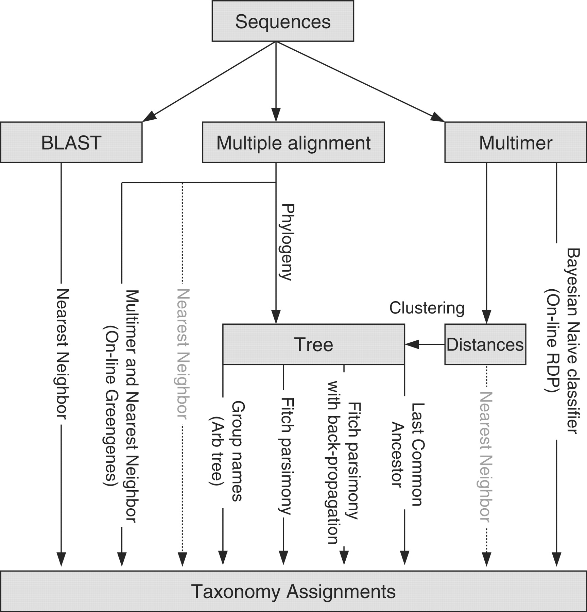

> <comment-title>Background: Taxonomic assignment</comment-title>
>
> In this tutorial we will use the RDP classifier and reference taxonomy for classification, but there are several different taxonomic
> assignment algorithms and reference databases available for this purpose.
>
> An overview of different methods is given by  and shown below:
>
> {:width="50%"}
>
> The most commonly used reference taxonomies are:
>
>  - SILVA ()
>  - GreenGenes ()
>  - RDP ()
>  - NCBI Taxonomy Database ()
>
> The choice of taxonomic classifier and reference taxonomy can impact downstream results. The figure from 
> given below shows the taxonomic composition determined when using different classifiers and reference taxonomies, for different primer sets (16S regions).
>
>  Guerrero Negro mat, (b) Human gut and (c) Mouse gut, using a range of different methods (separate subpanels within each group). The x-axis of each graph shows region sequenced. The y-axis shows abundance as a fraction of the total number of sequences in the community. The legend shows colors for phyla (consistent across graphs)."){:width="75%"}
>
> <!-- figure captions not working in includes, hardcode html til fixed -->
> <figure><figcaption>Figure: Compositions at the phylum level for each of the three datasets: (a) Guerrero Negro mat, (b) Human gut and (c) Mouse gut, using a range of different methods (separate subpanels within each group). The x-axis of each graph shows region sequenced. The y-axis shows abundance as a fraction of the total number of sequences in the community. The legend shows colors for phyla (consistent across graphs). </figcaption></figure>
>
> Which reference taxonomy is best for your experiments depends on a number of factors such as the type of sample and variable region sequenced.
>
> Another discussion about how these different databases compare was described by .
>
{: .comment}

