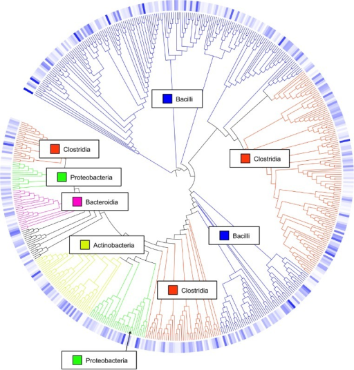
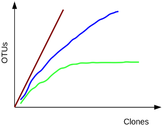

# Overview
{:.no_toc}

In this tutorial we will perform the
[Standard Operating Procedure (SOP) for MiSeq data](https://www.mothur.org/wiki/MiSeq_SOP), developed by the
creators of the Mothur software package, the [Schloss lab](http://www.schlosslab.org/), within Galaxy.

> ### Agenda
>
> In this tutorial, we will:
>
> 1. TOC
> {:toc}
>
{: .agenda}




# Obtaining and preparing data

In this tutorial we use 16S rRNA data, but similar pipelines can be used for WGS data.

> ###  Background: The 16S ribosomal RNA gene
>  <br><br>
>
> The 16S rRNA gene has several properties that make it ideally suited for our purposes
>
> 1. Present in all prokaryotes
> 2. Highly conserved + highly variable regions
> 3. Huge reference databases
>
> 
>
> The highly conserved regions make it easy to target the gene across different organisms,
> while the highly variable regions allow us to distinguish between different species.
>
> (slide credit [https://www.slideshare.net/beiko/ccbc-tutorial-beiko ](https://www.slideshare.net/beiko/ccbc-tutorial-beiko ))
{: .tip}

## Understanding our input data
In this tutorial we are interested in understanding the effect of normal variation in the gut microbiome on host health.
To that end, fresh feces from mice were collected on a daily basis for 365 days post weaning. During the first 150 days
post weaning (dpw), nothing was done to our mice except allow them to eat, get fat, and be merry. We were curious whether
the rapid change in weight observed during the first 10 dpw affected the stability microbiome compared to the microbiome
observed between days 140 and 150. We will address this question in this tutorial using a combination of OTU, phylotype,
and phylogenetic methods.


To make this tutorial easier to execute, we are providing only part of the data - you are given the flow files for one
animal at 10 time points (5 early and 5 late). In order to assess the error rate of our analysis pipeline and experimental
setup, we additionally resequenced a mock community composed of genomic DNA from 21 bacterial strains.

> ###  Dataset details
> Because of the large size of the original dataset (3.9 GB) you are given 20 of the 362 pairs of fastq
> files. For example, you will see two files: `F3D0_S188_L001_R1_001.fastq`, and
> `F3D0_S188_L001_R2_001.fastq`
> <br><br>
> These two files correspond to Female 3 on Day 0 (F3D0) (i.e. the day of weaning). The first file
> (and all those with R1 in the name) correspond to the forward reads, while the second (and all
> those with R2 in the name) correspond to the reverse reads.
> <br><br>
> These sequences are 250 bp and overlap in the V4 region of the 16S rRNA gene; this region is about
> 253 bp long. Looking at the datasets, you will see 22 fastq files, representing 10 time points from
> Female 3 and 1 mock community. You will also see `HMP_MOCK.v35.fasta` which contains the sequences used
> in the mock community that were sequenced in fasta format.
{: .comment}

<!-- note: mothur seems to have forgotten day 4 in their SOP example data, therefore this description and results
in this document differ slightly from the description on their website -->


## Importing the data into Galaxy

Now that we know what our input data is, let's get it into our Galaxy history:

All data required for this tutorial has been made available from Zenodo [](https://doi.org/10.5281/zenodo.800651)

> ###  Hands-on: Obtaining our data
>
> 1. Make sure you have an empty analysis history. Give it a name.
>
>    
>
> 2. **Import Sample Data.**
>       - Import the sample FASTQ files to your history, either from a shared data library (if available), or from Zenodo:
>
>       > ###  List of Zenodo URLs
>       > ```
>       > https://zenodo.org/record/800651/files/F3D0_R1.fastq
>       > https://zenodo.org/record/800651/files/F3D0_R2.fastq
>       > https://zenodo.org/record/800651/files/F3D141_R1.fastq
>       > https://zenodo.org/record/800651/files/F3D141_R2.fastq
>       > https://zenodo.org/record/800651/files/F3D142_R1.fastq
>       > https://zenodo.org/record/800651/files/F3D142_R2.fastq
>       > https://zenodo.org/record/800651/files/F3D143_R1.fastq
>       > https://zenodo.org/record/800651/files/F3D143_R2.fastq
>       > https://zenodo.org/record/800651/files/F3D144_R1.fastq
>       > https://zenodo.org/record/800651/files/F3D144_R2.fastq
>       > https://zenodo.org/record/800651/files/F3D145_R1.fastq
>       > https://zenodo.org/record/800651/files/F3D145_R2.fastq
>       > https://zenodo.org/record/800651/files/F3D146_R1.fastq
>       > https://zenodo.org/record/800651/files/F3D146_R2.fastq
>       > https://zenodo.org/record/800651/files/F3D147_R1.fastq
>       > https://zenodo.org/record/800651/files/F3D147_R2.fastq
>       > https://zenodo.org/record/800651/files/F3D148_R1.fastq
>       > https://zenodo.org/record/800651/files/F3D148_R2.fastq
>       > https://zenodo.org/record/800651/files/F3D149_R1.fastq
>       > https://zenodo.org/record/800651/files/F3D149_R2.fastq
>       > https://zenodo.org/record/800651/files/F3D150_R1.fastq
>       > https://zenodo.org/record/800651/files/F3D150_R2.fastq
>       > https://zenodo.org/record/800651/files/F3D1_R1.fastq
>       > https://zenodo.org/record/800651/files/F3D1_R2.fastq
>       > https://zenodo.org/record/800651/files/F3D2_R1.fastq
>       > https://zenodo.org/record/800651/files/F3D2_R2.fastq
>       > https://zenodo.org/record/800651/files/F3D3_R1.fastq
>       > https://zenodo.org/record/800651/files/F3D3_R2.fastq
>       > https://zenodo.org/record/800651/files/F3D5_R1.fastq
>       > https://zenodo.org/record/800651/files/F3D5_R2.fastq
>       > https://zenodo.org/record/800651/files/F3D6_R1.fastq
>       > https://zenodo.org/record/800651/files/F3D6_R2.fastq
>       > https://zenodo.org/record/800651/files/F3D7_R1.fastq
>       > https://zenodo.org/record/800651/files/F3D7_R2.fastq
>       > https://zenodo.org/record/800651/files/F3D8_R1.fastq
>       > https://zenodo.org/record/800651/files/F3D8_R2.fastq
>       > https://zenodo.org/record/800651/files/F3D9_R1.fastq
>       > https://zenodo.org/record/800651/files/F3D9_R2.fastq
>       > https://zenodo.org/record/800651/files/Mock_R1.fastq
>       > https://zenodo.org/record/800651/files/Mock_R2.fastq
>       > ```
>       {: .solution }
>
>       
>
>       
>
> 3. **Import Reference Data**
>    - Import the following reference datasets
>      - `silva.v4.fasta`
>      - `HMP_MOCK.v35.fasta`
>      - `mouse.dpw.metadata`
>      - `mouse.time.design`
>      - `trainset9_032012.pds.fasta`
>      - `trainset9_032012.pds.tax`
>
>
>    > ###  List of Zenodo URLs
>    > ```
>    > https://zenodo.org/record/800651/files/HMP_MOCK.v35.fasta
>    > https://zenodo.org/record/800651/files/mouse.dpw.metadata
>    > https://zenodo.org/record/800651/files/mouse.time.design
>    > https://zenodo.org/record/800651/files/silva.v4.fasta
>    > https://zenodo.org/record/800651/files/trainset9_032012.pds.fasta
>    > https://zenodo.org/record/800651/files/trainset9_032012.pds.tax
>    > ```
>    {: .solution }
{: .hands_on}

Now that's a lot of files to manage. Luckily Galaxy can make life a bit easier by allowing us to create
**dataset collections**. This enables us to easily run tools on multiple datasets at once.

Since we have **paired-end** data, each sample consist of two separate fastq files, one containing the
forward reads, and one containing the reverse reads. We can recognize the pairing from the file names,
which will differ only by `_R1` or `_R2` in the filename. We can tell Galaxy about this paired naming
convention, so that our tools will know which files belong together. We do this by building a **List of Dataset Pairs**


> ###  Hands-on: Organizing our data into a paired collection
>
> 1. Click on the **checkmark icon**  at top of your history.
>
> 2. Select all the FASTQ files (40 in total)
>    - Click on **for all selected..**
>    - Select **Build List of Dataset Pairs** from the dropdown menu
>
>    In the next dialog window you can create the list of pairs. By default Galaxy will look for pairs
>    of files that differ only by a `_1` and `_2` part in their names. In our case however, these
>    should be `_R1` and `_R2`.
>
> 3. Change these values accordingly
>    - Change `_1` to `_R1` in the text field on the top left
>    - Change `_2` to `_R2` om the text field on the top right
>
>    You should now see a list of pairs suggested by Galaxy:
>     <br><br>
>
> 4. Examine the pairings and make sure they are correct.
>    - Click on **auto-pair** to create the suggested pairs.
>
>       <br><br>
>
>    The middle segment is the name for each pair. You can change these names by clicking on them.
>    These names will be used as sample names in the downstream analysis so always make sure they are informative!
>
> 5. Name the pairs.
>    - Make sure the pair names are like the image above (`F3D0`, `F3D5` etc)
>      - If the files will imported via url, they may have the full url as sample name, please remove everything but the sample name for each pair
>
> 6. **Name your collection** at the bottom right of the screen
> 7. Click the **Create List** button. A new dataset collection item will now appear in your history
{: .hands_on}


# Quality Control

## Reducing sequencing and PCR errors

The first thing we want to do is combine our forward and reverse reads for each sample. This is done
using the `make.contigs` command, which requires the paired collection as input. This command will extract
the sequence and quality score data from your fastq files, create the reverse complement of the reverse
read and then join the reads into contigs. Then we will combine all samples into a single fasta file,
remembering which reads came from which samples using a *group* file.

> ###  Algorithm details
> We have a very simple algorithm to do this. First, we align the pairs of sequences. Next, we look
> across the alignment and identify any positions where the two reads disagree. If one sequence has a
> base and the other has a gap, the quality score of the base must be over 25 to be considered real. If
> both sequences have a base at that position, then we require one of the bases to have a quality score
> 6 or more points better than the other. If it is less than 6 points better, then we set the consensus
> base to an N.
{: .comment}

### Merging our data

#### Make contigs from paired-end reads

In this experiment we used paired-end sequencing, this means sequencing was done from both ends of each
fragment, resulting in an overlap in the middle. We will now combine these pairs of reads into *contigs*.


> ###  Hands-on: Combine forward and reverse reads into contigs
>
> - **Make.contigs**  with the following parameters
>   -  *"Way to provide files"*: `Multiple pairs - Combo mode`
>   -  *"Fastq pairs"*: the collection you just created
>   - Leave all other parameters to the default settings <br><br>
>
{: .hands_on}

This step merges the forward and reverse reads into contigs for each pair, and
then combines the results into a single fasta file. To retain information about
which reads originated from which samples, it also made a group file. View that
file now, it should look something like this:

```
M00967_43_000000000-A3JHG_1_1101_10011_3881     F3D0
M00967_43_000000000-A3JHG_1_1101_10050_15564    F3D0
M00967_43_000000000-A3JHG_1_1101_10051_26098    F3D0
```

Here the first column contains the read name, and the second column contains the sample name.


### Data Cleaning

For more information on the topic of quality control, please see our training materials
[here]({{site.baseurl}}/topics/sequence-analysis/)

Next we want to improve the quality of our data. But first, let's get a feel of our data

> ###  Hands-on: Summarize data
>
> - **Summary.seqs**  with the following parameters
>   -  *"fasta"*: the `trim.contigs.fasta` file created by **Make.contigs** 
>   - *"Output logfile?"*: `yes`
>
{: .hands_on}

The `summary` output files give information per read. The `logfile` outputs also contain some summary
statistics:

```
             Start    End        NBases     Ambigs   Polymer  NumSeqs
Minimum:     1        248        248        0        3        1
2.5%-tile:   1        252        252        0        3        3810
25%-tile:    1        252        252        0        4        38091
Median:      1        252        252        0        4        76181
75%-tile:    1        253        253        0        5        114271
97.5%-tile:  1        253        253        6        6        148552
Maximum:     1        502        502        249      243      152360
Mean:        1        252.811    252.811    0.70063  4.44854
# of Seqs:   152360
```

This tells us that we have 152,360 sequences that for the most part vary between 248 and 253 bases.
Interestingly, the longest read in the dataset is 502 bp. Be suspicious of this. Recall that the reads
are supposed to be 251 bp each. This read clearly didn't assemble well (or at all). Also, note that at
least 2.5% of our sequences had some ambiguous base calls. We'll take care of these issues in the next
step when we run `screen.seqs`.

The following tool will remove any sequences with ambiguous bases (`maxambig` parameter) and anything longer than 275 bp (`maxlength` parameter).

> ###  Hands-on: Filter reads based on quality and length
>
> - **Screen.seqs**  with the following parameters
>   -  *"fasta"*: the `trim.contigs.fasta` file created by **Make.contigs** 
>   -  *"group"*: the group file created in the **Make.contigs**  step
>   - *"maxlength"*: `275`
>   - *"maxambig"*: `0`
>
> > ###  Question
> >
> > How many reads were removed in this screening step? (Hint: run the summary.seqs tool again)
> >
> > > ###  Solution
> > > 23,488.
> > >
> > > This can be determined by looking at the number of lines in bad.accnos output of screen.seqs
> > > or by comparing the total number of seqs between of the summary log before and after this screening
> > > step
> > {: .solution }
> {: .question}
{: .hands_on}

## Processing improved sequences

### Optimize files for computation
Because we are sequencing many of the same organisms, we anticipate that many of our sequences are
duplicates of each other. Because it's computationally wasteful to align the same thing a bazillion
times, we'll unique our sequences using the `unique.seqs` command:

> ###  Hands-on: Remove duplicate sequences
>
> - **Unique.seqs**  with the following parameters
>   -  *"fasta"*: the `good.fasta` output from **Screen.seqs** 
>   - *"output format"*: `Name File`
>
> > ###  Question
> >
> > How many sequences were unique? how many duplicates were removed?
> >
> > > ###  Solution
> > > 16,426 unique sequences and 112,446 duplicates.
> > >
> > > This can be determined from the number of lines in the fasta (or names) output, compared to the
> > > number of lines in the fasta file before this step.
> > {: .solution}
> {: .question}
{: .hands_on}

This tool outputs two files, one is a fasta file containing only the unique sequences, and a *names files*.
The names file consists of two columns, the first contains the sequence names for each of the unique
sequences, and the second column contains all other sequence names that are identical to the representative
sequence in the first column.

```
name          representatives
read_name1    read_name2,read_name,read_name5,read_name11
read_name4    read_name6,read_name,read_name10
read_name7    read_name8
...
```

To reduce file sizes further and streamline analysis, we can now summarize the data in a *count table*.

> ###  Hands-on: Generate count table
>
> - **Count.seqs**  with the following parameters
>   -  *"name"*: the `names` output from **Unique.seqs** 
>   - *"Use a Group file"*: `yes`
>   -  *"group"*: the `group file` we created using the **Screen.seqs** 
{: .hands_on}

The *count_table* output will look something like this:

```
Representative_Sequence                      total   F3D0   F3D1  F3D141  F3D142  ...
M00967_43_000000000-A3JHG_1_1101_14069_1827  4402    370    29    257     142
M00967_43_000000000-A3JHG_1_1101_18044_1900  28      1      0     1       0
M00967_43_000000000-A3JHG_1_1101_13234_1983  10522   425    281   340     205
...
```

The first column contains the read names of the representative sequence, and the subsequent columns contain
the number of duplicates of this sequence observed in each sample.

### Sequence Alignment

For more information on the topic of alignment, please see our training materials
[here]({{site.baseurl}}/topics/sequence-analysis/)

We are now ready to align our sequences to the reference. This step is an important
step to perform to improve the clustering of your OTUs [[Schloss 2013]](https://doi.org/10.1038/ismej.2012.102)

> ###  Hands-on: Align sequences
>
> 1. **Align.seqs**  with the following parameters
>   -  *"fasta"*: the `fasta` output from **Unique.seqs** 
>   -  *"reference"*: `silva.v4.fasta` reference file from your history
> <br><br>
> 2. **Summary.seqs**  with the following parameters
>   -  *"fasta"*: the aligned output from **Align.seqs** 
>   -  *"count"*: `count_table` output from **Count.seqs** 
>   - *"Output logfile?"*: `yes`
>
{: .hands_on}

Have a look at the summary output (log file):

```
            Start    End      NBases  Ambigs   Polymer  NumSeqs
Minimum:    1250     10693    250     0        3        1
2.5%-tile:  1968     11550    252     0        3        3222
25%-tile:   1968     11550    252     0        4        32219
Median:     1968     11550    252     0        4        64437
75%-tile:   1968     11550    253     0        5        96655
97.5%-tile: 1968     11550    253     0        6        125651
Maximum:    1982     13400    270     0        12       128872
Mean:       1967.99  11550    252.462 0        4.36693
# of unique seqs:   16426
total # of seqs:    128872
```

So what does this mean? You'll see that the bulk of the sequences start at position 1968 and end at position 11550.
Some sequences start at position 1250 or 1982 and end at 10693 or 13400. These deviants from the mode positions
are likely due to an insertion or deletion at the terminal ends of the alignments. Sometimes you'll see sequences
that start and end at the same position indicating a very poor alignment, which is generally due to non-specific
amplification.

### More Data Cleaning

To make sure that everything overlaps the same region we'll re-run screen.seqs to get sequences that
start at or before position 1968 and end at or after position 11550. We'll also set the maximum
homopolymer length to 8 (`maxhomop` parameter) since there's nothing in the database with a stretch of 9 or more of the same
base in a row (this also could have been done in the first execution of `screen.seqs` above).

> ###  Hands-on: Remove poorly aligned sequences
>
> - **Screen.seqs**  with the following parameters
>   -  *"fasta"*: the aligned fasta file from **Align.seqs** 
>   - *"start"*: `1968`
>   - *"end"*: `11550`
>   - *"maxhomop"*: `8`
>   -  *"count"*: the `count table` file from **Count.seqs** 
>
> **Note:** we supply the count table so that it can be updated for the sequences we're removing.
>
> > ###  Question
> >
> >  How many sequences were removed in this step?
> > > ###  Solution
> > > 128 sequences were removed. This is the number of lines in the bad.accnos output.
> > {: .solution }
> {: .question}
{: .hands_on}


Now we know our sequences overlap the same alignment coordinates, we want to make sure they *only* overlap
that region. So we'll filter the sequences to remove the overhangs at both ends. Since we've done
paired-end sequencing, this shouldn't be much of an issue. In addition, there are many
columns in the alignment that only contain gap characters (i.e. "."). These can be pulled out without
losing any information. We'll do all this with filter.seqs:

> ###  Hands-on: Filter sequences
>
> - **Filter.seqs**  with the following parameters
>   -  *"fasta"*: `good.fasta` output from the lastest **Screen.seqs** 
>   - *"trump"*: `.`
>   - *"Output logfile"*: `yes`
{: .hands_on}

In the log file we see the following information:

```
Length of filtered alignment: 376
Number of columns removed: 13049
Length of the original alignment: 13425
Number of sequences used to construct filter: 16298
```

This means that our initial alignment was 13425 columns wide and that we were able to remove 13049 terminal gap
characters using `trump=.` and vertical gap characters using `vertical=yes`. The final alignment length is 376
columns. Because we've perhaps created some redundancy across our sequences by trimming the ends, we can re-run
`unique.seqs`:

> ###  Hands-on: Re-obtain unique sequences
>
> - **Unique.seqs**  with the following parameters
>   -  *"fasta"*: the `filtered fasta` output from **Filter.seqs** 
>   -  *"name file or count table"*: the `count table` from the last **Screen.seqs** 
>
> > ###  Question
> >
> >  How many duplicate sequences did our filter step produce?
> >
> > > ###  Solution
> > > 3: The number of unique sequences was reduced from 16298 to 16295
> > {: .solution }
> {: .question}
{: .hands_on}


### Pre-clustering
The next thing we want to do to further de-noise our sequences, is to pre-cluster the sequences using the
`pre.cluster` command, allowing for up to 2 differences between sequences. This command will split the
sequences by group and then sort them by abundance and go from most abundant to least and identify
sequences that differ no more than 2 nucleotides from on another. If this is the case, then they get
merged. We generally recommend allowing 1 difference for every 100 basepairs of sequence:

> ###  Hands-on: Perform preliminary clustering of sequences
>
> - **Pre.cluster**  with the following parameters
>   -  *"fasta"*: the `fasta` output from the last **Unique.seqs**  run
>   -  *"name file or count table"*: the `count table` from the last **Unique.seqs** 
>   - *"diffs"*: `2`
>
> > ###  Question
> >
> >  How many unique sequences are we left with after this clustering of highly similar sequences?
> > > ###  Solution
> > > 5720: This is the number of lines in the fasta output
> > {: .solution }
> {: .question}
{: .hands_on}


### Chimera Removal
At this point we have removed as much sequencing error as we can, and it is time to turn our attention to
removing sequencing artefacts known as chimeras.

> ###  Background: Chimeras
> 
> (slide credit: [http://slideplayer.com/slide/4559004/ ](http://slideplayer.com/slide/4559004/ ))
{: .tip}

We'll do this chimera removal using the `VSEARCH` algorithm that is called within Mothur, using the
`chimera.vsearch` command. This command will split the data by sample and check for chimeras.

Our preferred way of doing this is to use the abundant sequences as our reference. In addition, if a sequence
is flagged as chimeric in one sample, the default (`dereplicate=No`) is to remove it from all samples. Our
experience suggests that this is a bit aggressive since we've seen rare sequences get flagged as chimeric
when they're the most abundant sequence in another sample. This is how we do it:

> ###  Hands-on: Remove chimeric sequences
>
> - **Chimera.vsearch**  with the following parameters
>   -  *"fasta"*: the `fasta` output from **Pre.cluster** 
>   -  *"Select Reference Template from"*: `Self`
>   -  *"count"*: the `count table` from the last **Pre.cluster** 
>   -  "dereplicate" to Yes
>
> Running chimera.vsearch with the count file will remove the chimeric sequences from the count table, but we
> still need to remove those sequences from the fasta file as well. We do this using remove.seqs:
>
> - **Remove.seqs**  with the following parameters
>   -  *"accnos"*: the `vsearch.accnos` file from **Chimera.vsearch** 
>   -  *"fasta"*: the `fasta` output from **Pre.cluster** 
>   -  *"count"*: the `count table` from **Chimera.vsearch** 
>
> > ###  Question
> >
> >  How many sequences were flagged as chimeric? what is the percentage? (Hint: summary.seqs)
> > > ###  Solution
> > > If we run summary.seqs on the resulting fasta file and count table, we see that we went from 128,655
> > > sequences down to 118,091 sequences in this step, for a reduction of 8.2%. This is a reasonable number of
> > > sequences to be flagged as chimeric.
> > {: .solution }
> {: .question}
{: .hands_on}


### Removal of non-bacterial sequences

As a final quality control step, we need to see if there are any "undesirables" in our dataset. Sometimes when
we pick a primer set they will amplify other stuff that survives to this point in the pipeline, such as
18S rRNA gene fragments or 16S rRNA from Archaea, chloroplasts, and mitochondria. There's also just the
random stuff that we want to get rid of.

Now you may say, "But wait I want that stuff". Fine. But, the primers we use, are only supposed to amplify
members of the Bacteria and if they're hitting Eukaryota or Archaea, then it is a mistake. Also, realize
that chloroplasts and mitochondria have no functional role in a microbial community.

Let's go ahead and classify those sequences using the Bayesian classifier with the `classify.seqs` command:

> ###  Hands-on: Remove undesired sequences
>
> - **Classify.seqs**  with the following parameters
>   -  *"fasta"*: the `fasta` output from **Remove.seqs** 
>   -  *"reference"*: `trainset9032012.pds.fasta` from your history
>   -  *"taxonomy"*: `trainset9032012.pds.tax` from your history
>   -  *"count"*: the `count table` file from **Remove.seqs** 
>
> Have a look at the taxonomy output. You will see that every read now has a classification.
>
> Now that everything is classified we want to remove our undesirables. We do this with the remove.lineage
> command:
>
> - **Remove.lineage**  with the following parameters
>   -  *"taxonomy"*: the taxonomy output from **Classify.seqs** 
>   -  *"taxon - Manually select taxons for filtering"*: `Chloroplast-Mitochondria-unknown-Archaea-Eukaryota`
>   -  *"fasta"*: the `fasta` output from **Remove.seqs** 
>   -  *"count"*: the `count table` from **Remove.seqs** 
>
> > ###  Questions
> >
> > 1. How many unique (representative) sequences were removed in this step?
> > 2. How many sequences in total?
> >
> > > ###  Solution
> > > 20 representative sequences were removed.
> > >
> > > The fasta file output from Remove.seqs had 2281 sequences while the fasta output from Remove.lineages
> > > contained 2261 sequences.
> > >
> > > 162 total sequences were removed.
> > >
> > > If you run summary.seqs with the count table, you will see that we now have 2261 unique sequences
> > > representing a total of 117,929 total sequences (down from 118,091 before). This means 162 of our
> > > sequences were in represented by these 20 representative sequences.
> > {: .solution }
> {: .question}
{: .hands_on}

Also of note is that *unknown* only pops up as a classification if the classifier cannot classify your
sequence to one of the domains.

At this point we have curated our data as far as possible and we're ready to see what our error rate is.


## Optional: Assessing error rates based on our mock community


> ###  Tip: Skipping the mock community analysis
>
> The mock community analysis is optional. If you are low on time or want to skip ahead, you can jump straight to [the next section](#preparing-for-analysis)
> where we will cluster our sequences into OTUs, classify them and perform some visualisations.
>
{: .tip}

Measuring the error rate of your sequences is something you can only do if you have co-sequenced a mock
community, that is, a sample of which you know the exact composition. This is something we include for
every 95 samples we sequence. You should too because it will help you gauge your error rates and allow
you to see how well your curation is going, and whether something is wrong with your sequencing setup.

> ###  Background: Mock communities
>
> **What is a mock community?**
>
> A mock community is an artificially constructed sample; a defined mixture of microbial cells and/or
> viruses or nucleic acid molecules created *in vitro* to simulate the composition of a microbiome
> sample or the nucleic acid isolated therefrom.
>
> **Why sequence a mock community?**
>
> In a mock community, we know exactly which sequences/organisms we expect to find, and at which proportions.
> Therefore, we can use such an artificial sample to assess the error rates of our sequencing and
> analysis pipeline.
>   - Did we miss any of the sequences we know to be present in the sample (false negatives)?
>   - Do we find any sequences that were not present in the sample (false positives)?
>   - Were we able to accurately detect their relative abundances?
>
> If our workflow performed well on the mock sample, we have more confidence in the accuracy of the
> results on the rest of our samples.
>
> **Example**
>
> As an example, consider the following image from [Fouhy et al.](https://dx.doi.org/10.1186%2Fs12866-016-0738-z).
> A mock community sample was sequenced for different combinations of sequencer and primer sets (V-regions).
> Since we know the expected outcome, we can assess the accuracy of each pipeline. A similar approach can be used to
> assess different parameter settings of the *in-silico*  analysis pipline.
>
> ")
>
>
> **Further reading**
>
> - [Next generation sequencing data of a defined microbial mock community](https://dx.doi.org/10.1038%2Fsdata.2016.81)
> - [16S rRNA gene sequencing of mock microbial populations- impact of DNA extraction method, primer choice and sequencing platform](https://dx.doi.org/10.1186%2Fs12866-016-0738-z)
>
{: .tip}

Our mock community is composed of genomic DNA from 21 bacterial strains. So in a perfect world, this is
exactly what we would expect the analysis to produce as a result.

First, let's extract the sequences belonging to our mock samples from our data:

> ###  Hands-on: extract mock sample from our dataset
>
>
>
> 1. **Get.groups**  with the following parameters
>   -  *"group file or count table"*: the `count table` from **Remove.lineage** 
>   -  *"groups"*: `Mock`
>   - *"fasta"*: `fasta` output from **Remove.lineage** 
>   -  *"output logfile?"*: `yes`
>
{: .hands_on}

In the log file we see the following:

```
Selected 58 sequences from your fasta file.
Selected 4046 sequences from your count file
```

This tells us that we had 58 unique sequences and a total of 4,046 total sequences in our Mock sample. We
can now use the `seq.error` command to measure the error rates based on our mock reference. Here we align
the reads from our mock sample back to their known sequences, to see how many fail to match.

> ###  Hands-on: Assess error rates based on a mock community
> - **Seq.error**  with the following parameters
>   -  *"fasta"*: the `fasta` output from **Get.groups** 
>   -  *"reference"*: `HMP_MOCK.v35.fasta` file from your history
>   -  *"count"*: the `count table` from **Get.groups** 
>   -  *"output log?"*: `yes`
>
{: .hands_on}

 In the log file we see something like this:

```
Overall error rate:    6.5108e-05
Errors    Sequences
0    3998
1    3
2    0
3    2
4    1
[..]
```

That rocks, eh? Our error rate is 0.0065%!


### Cluster mock sequences into OTUs

We can now cluster the mock sequences into OTUs to see how many spurious OTUs we have:

> ###  Background: Operational Taxonomic Units (OTUs)
>
> In 16S metagenomics approaches, OTUs are clusters of similar sequence variants of the 16S rDNA marker gene
> sequence. Each of these clusters is intended to represent a taxonomic unit of a bacteria species or genus
> depending on the sequence similarity threshold. Typically, OTU cluster are defined by a 97% identity
> threshold of the 16S gene sequence variants at species level. 98% or 99% identity is suggested for strain
> separation.
>
> 
>
> (Image credit: Danzeisen et al. 2013, 10.7717/peerj.237)
{: .tip}


> ###  Hands-on: Cluster mock sequences into OTUs
>
> First we calculate the pairwise distances between our sequences
>
> - **Dist.seqs**  with the following parameters
>   -  *"fasta"*: the `fasta` from **Get.groups** 
>   - *"cutoff"*: `0.20`
>
> Next we group sequences into OTUs
>
> - **Cluster**  with the following parameters
>   -  *"column"*: the `dist` output from **Dist.seqs** 
>   -  *"count"*: the `count table` from **Get.groups** 
>
> Now we make a *shared* file that summarizes all our data into one handy table
>
> - **Make.shared**  with the following parameters
>     -  *"list"*: the `OTU list` from **Cluster** 
>     -  *"count"*: the `count table` from **Get.groups** 
>     - *"label"*: `0.03` (this indicates we are interested in the clustering at a 97% identity threshold)
>
> And now we generate intra-sample rarefaction curves
>
> - **Rarefaction.single**  with the following parameters
>   -  *"shared"*: the `shared` file from **Make.shared** 
>
> > ###  Question
> >
> >  How many OTUs were identified in our mock community?
> > > ###  Solution
> > > 34: Open the shared file or OTU list and look at the header line. You will see a column for each OTU
> > {: .solution }
> {: .question}
{: .hands_on}


Open the rarefaction output (dataset named `sobs` inside the `rarefaction curves` output collection).
You'll see that for 4060 sequences, we'd have 34 OTUs from the Mock community. This number of course
includes some stealthy chimeras that escaped our detection methods. If we used 3000 sequences, we would
have about 31 OTUs. In a perfect world with no chimeras and no sequencing errors, we'd have 20 OTUs.
This is not a perfect world. But this is pretty darn good!

> ###  Background: Rarefaction
>
> To estimate the fraction of species sequenced, rarefaction curves are typically used. A rarefaction curve
> plots the number of species as a function of the number of individuals sampled. The curve usually begins
> with a steep slope, which at some point begins to flatten as fewer species are being discovered per sample:
> the gentler the slope, the less contribution of the sampling to the total number of operational taxonomic
> units or OTUs.
>
> 
>
> Green, most or all species have been sampled; blue, this habitat has not been exhaustively sampled; red,
> species rich habitat, only a small fraction has been sampled.
>
> (*A Primer on Metagenomics*, Wooley et al. 2010, https://doi.org/10.1371/journal.pcbi.1000667)
{: .tip}

Now that we have assessed our error rates we are ready for some real analysis.

## Preparing for analysis

### Removing Mock sample
We're almost to the point where you can have some fun with your data (I'm already having fun, aren't you?).
Next, we would assign sequences to OTUs, but first, we should remove the Mock sample from our dataset, it has
served its purpose by allowing us to estimate our error rate, but in subsequent steps we only want to use
our real samples.

using
the `remove.groups` command:

> ###  Hands-on: Remove Mock community from our dataset
>
> - **Remove.groups**  with the following parameters
>   - *"Select input type"*: `fasta , name, taxonomy, or list with a group file or count table`
>   - *"groups"*: `Mock`
>   -  *"count table"*, *"fasta"*, and *"taxonomy"* to the respective outputs from **Remove.lineage** 
>
{: .hands_on}


### Clustering sequences into OTUs

Now, we have a couple of options for clustering sequences into OTUs. For a small dataset like this, we could
do the traditional approach using `dist.seqs` and `cluster` as we did with the Mock sample.

The alternative is to use the `cluster.split` command. In this approach, we use the taxonomic information to
split the sequences into bins and then cluster within each bin. The Schloss lab have published results
showing that if you split at the level of Order or Family, and cluster to a 0.03 cutoff, you'll get just as
good of clustering as you would with the "traditional" approach.

The advantage of the `cluster.split` approach is that it should be faster, use less memory, and can be run on
multiple processors. In an ideal world we would prefer the traditional route because "Trad is rad", but we
also think that kind of humor is funny.... In this command we use `taxlevel=4`, which corresponds to the level
of *Order*. This is the approach that we  generally use in the Schloss lab.

> ###  Hands-on: Cluster our data into OTUs
>
> - **Cluster.split**  with the following parameters
>   - *"Split by"*: `Classification using fasta`
>   -  *"fasta"*: the `fasta` output from **Remove.groups** 
>   -  *"taxonomy"*: the `taxonomy` output from **Remove.groups** 
>   -  *"name file or count table"*: the `count table` output from **Remove.groups** 
>   - *"taxlevel"*: `4`
>   - *"cutoff"*: `0.03`
>
> Next we want to know how many sequences are in each OTU from each group and we can do this using the
> `Make.shared` command. Here we tell Mothur that we're really only interested in the 0.03 cutoff level:
>
> - **Make.shared**  with the following parameters
>   -  *"list"*: the `list` output from **Cluster.split** 
>   -  *"count"*: the `count table` from **Remove.groups** 
>   - *"label"*: `0.03`
>
> We probably also want to know the taxonomy for each of our OTUs. We can get the consensus taxonomy for each
> OTU using the `Classify.otu` command:
>
> - **Classify.otu**  with the following parameters
>   -  *"list"*: the `list` output from **Cluster.split** 
>   -  *"count"*: the `count table` from **Remove.groups** 
>   -  *"taxonomy"*: the `taxonomy` output from **Remove.groups** 
>   - *"label"*: `0.03`
>
{: .hands_on}

Opening the taxonomy output for level 0.03 shows a file structured like the following:

```
OTU       Size    Taxonomy
..
Otu0008	5260	Bacteria(100);"Bacteroidetes"(100);"Bacteroidia"(100);"Bacteroidales"(100);"Rikenellaceae"(100);Alistipes(100);
Otu0009	3613	Bacteria(100);"Bacteroidetes"(100);"Bacteroidia"(100);"Bacteroidales"(100);"Porphyromonadaceae"(100);"Porphyromonadaceae"_unclassified(100);
Otu0010	3058	Bacteria(100);Firmicutes(100);Bacilli(100);Lactobacillales(100);Lactobacillaceae(100);Lactobacillus(100);
Otu0011	2958	Bacteria(100);"Bacteroidetes"(100);"Bacteroidia"(100);"Bacteroidales"(100);"Porphyromonadaceae"(100);"Porphyromonadaceae"_unclassified(100);
Otu0012	2134	Bacteria(100);"Bacteroidetes"(100);"Bacteroidia"(100);"Bacteroidales"(100);"Porphyromonadaceae"(100);"Porphyromonadaceae"_unclassified(100);
Otu0013	1856	Bacteria(100);Firmicutes(100);Bacilli(100);Lactobacillales(100);Lactobacillaceae(100);Lactobacillus(100);
..
```

This file tells you that Otu008 was observed 5260 times in your samples and that all of the
sequences (100%) were classified as being members of the Alistipes.

> ###  Question
>
> Which samples contained sequences belonging to an OTU classified as Staphylococcus?
>
> > ###  Solution
> > Examine the tax.summary file.
> >
> > Samples F3D141, F3D142,  F3D144, F3D145, F3D2. This answer can be found by
> > examining the tax.summary output and finding the columns with nonzero
> > values for the line of Staphylococcus
> {: .solution }
{: .question}


In this tutorial we will continue with this otu-based approach, for the phylotype and phylogenic
approaches, please refer to the [Mothur wiki page](https://www.mothur.org/wiki/MiSeq_SOP).

# OTU-based Analysis

Let's do something more interesting and actually analyze our data. We'll focus on the OTU-based dataset. The
phylotype-based analysis is essentially the same. Also, remember that our initial question had to do with the
stability and change in community structure in these samples when comparing early and late samples.

Keep in mind that the group names have either a F or M (sex of animal) followed by a number (number of
animal) followed by a D and a three digit number (number of days post weaning).

> ###  Hands-on: Subsampling
>
> What we now want to do is see how many sequences we have in each sample. We'll do this with the
> `Count.groups` command:
>
> - **Count.groups**  with the following parameters
>   -  *"shared"*: the `shared` file from **Make.shared** 
>
> Take a look at the output. We see that our smallest sample had 2389 sequences in it. That is a reasonable
> number. Despite what some say, subsampling and rarefying your data is an important thing to do.
>
> We'll generate a subsampled file for our analyses with the `Sub.sample` command:
>
> - **Sub.sample**  with the following parameters
>   - *"Select type of data to subsample"*: `OTU Shared`
>   -  *"shared"*: the `shared` file from **Make.shared** 
>   - *"size"*: `2389`
>
> > ###  Question
> >
> >  What would you exect the result of `count.groups` on this new shared output collection to be? Check if you are correct.
> > > ###  Solution
> > > all groups (samples) should now have 2440 sequences. Run count.groups again on the shared output collection by the sub.sample
> > > tool to confirm that this is indeed what happened.
> > {: .solution }
> {: .question}
>
> **Note:** since subsampling is a stochastic process, your results from any tools using this subsampled data
> will deviate from the ones presented here.
{: .hands_on}

## Calculate Species Diversity

Diversity indices provide valuable mathematical tools to describe the ecological complexity of a single sample
(*alpha diversity*) or to detect species differences between samples (*beta diversity*). However, diversity
is not a determined physical quantity for which a consensus definition and unit of measure have been established,
and several diversity indices are currently available [Finotello et al. 2016].

### Alpha diversity

Let's start our analysis by analyzing the alpha diversity of the samples. First we will generate rarefaction
curves describing the number of OTUs observed as a function of sampling effort. We'll do this with the
`Rarefaction.single` command:

> ###  Hands-on: Calculate Rarefaction
> - **Rarefaction.single**  with the following parameters
>   -  *"shared"*: the `shared file` from **Make.shared** 
{: .hands_on}

Note that we used the default diversity measure here (*sobs*; observed species richness), but there are many
more options available under the *calc* parameter. The mothur wiki describes some of these calculators
[here](https://mothur.org/wiki/Calculators).

Examine the rarefaction curve output.

```
numsampled    0.03-F3D0    lci-F3D0    hci-F3D0    0.03-F3D1   ...
1              1.0000       1.0000      1.0000      1.0000
100           41.6560      35.0000     48.0000     45.0560
200           59.0330      51.0000     67.0000     61.5740
300           70.5640      62.0000     79.0000     71.4700
400           78.8320      71.0000     87.0000     78.4730
500           85.3650      77.0000     94.0000     83.9990
...
```

This file displays the number of OTUs identified per amount of sequences used (numsampled). What we would like
to see is the number of additional OTUs identified when adding more sequences reaching a plateau. Then we know
we have covered our full diversity. This information would be easier to interpret in the form of a graph.
Let's plot the rarefaction curve for a couple of our sequences:

> ###  Hands-on: Plot Rarefaction
>
> - **Plotting tool**  with the following parameters
>   - *"Plot Title"*: `Rarefaction`
>   - *"Label for x axis"*: `Number of Sequences`
>   - *"Label for y axis"*: `Number of OTUs`
>   - *"Output File Type"*: `PNG`
>   -  Click on **Insert Series**,
>     -  *"Dataset"*: rarefaction curve collection
>     - *"Header in first line?"*: `Yes`
>     - *"Column for x axis"*: `Column 1`
>     - *"Column for y-axis"*: `Column 2` and `Column 5` and every third column until the end (we are
>       skipping the low confidence and high confidence interval columns)
>
{: .hands_on}

From the resulting image we can see that the rarefaction curves for all samples have started to level
off so we are confident we cover a large part of our sample diversity.


Alas, rarefaction is not a measure of richness, but a measure of diversity. If you consider two communities
with the same richness, but different evenness then after sampling a large number of individuals their
rarefaction curves will asymptote to the same value. Since they have different evennesses the shapes of
the curves will differ. Therefore, selecting a number of individuals to cutoff the rarefaction curve isn't
allowing a researcher to compare samples based on richness, but their diversity.

Finally, let's get a table containing the number of sequences, the sample coverage, the number of observed
OTUs, and the Inverse Simpson diversity estimate using the `Summary.single` command. To standardize everything,
let's randomly select 2440 sequences from each sample 1000 times and calculate the average:

> ###  Hands-on: Summary.single
>
> - **Summary.single**  with the following parameters
>   -  *"share"*: the `shared` file from **Make.shared** 
>   - *"calc"*: `nseqs,coverage,sobs,invsimpson`
>   - *"size"*: `2389`
{: .hands_on}

The data will be outputted to a table called the *summary file*:

```
label   group   sobs          coverage    invsimpson   invsimpson_lci   invsimpson_hci  nseqs
0.03    F3D0    167.000000    0.994697    25.686387    24.648040        26.816067       6223.000000
0.03    F3D1    145.000000    0.994030    34.598470    33.062155        36.284520       4690.000000
0.03    F3D141  154.000000    0.991060    19.571632    18.839994        20.362390       4698.000000
0.03    F3D142  141.000000    0.978367    17.029921    16.196090        17.954269       2450.000000
0.03    F3D143  135.000000    0.980738    18.643635    17.593785        19.826728       2440.000000
0.03    F3D144  161.000000    0.980841    15.296728    14.669208        15.980336       3497.000000
0.03    F3D145  169.000000    0.991222    14.927279    14.494740        15.386427       5582.000000
0.03    F3D146  161.000000    0.989167    22.266620    21.201364        23.444586       3877.000000
0.03    F3D147  210.000000    0.995645    15.894802    15.535594        16.271013       12628.000000
0.03    F3D148  176.000000    0.995725    17.788205    17.303206        18.301177       9590.000000
0.03    F3D149  194.000000    0.994957    21.841083    21.280343        22.432174       10114.000000
0.03    F3D150  164.000000    0.989446    23.553161    22.462533        24.755101       4169.000000
0.03    F3D2    179.000000    0.998162    15.186238    14.703161        15.702137       15774.000000
0.03    F3D3    127.000000    0.994167    14.730640    14.180453        15.325243       5315.000000
0.03    F3D5    138.000000    0.990523    29.415378    28.004777        30.975621       3482.000000
0.03    F3D6    155.000000    0.995339    17.732145    17.056822        18.463148       6437.000000
0.03    F3D7    126.000000    0.991916    13.343631    12.831289        13.898588       4082.000000
0.03    F3D8    158.000000    0.992536    23.063894    21.843396        24.428855       4287.000000
0.03    F3D9    162.000000    0.994803    24.120541    23.105499        25.228865       5773.000000
```

Interestingly, the sample coverages were all above 97%, indicating that we did a pretty good job of sampling
the communities. Plotting the richness or diversity of the samples would show that there was little difference
between the different animals or between the early and late time points. You could follow this up with a
repeated-measures ANOVA and find that there was no significant difference based on sex or early vs. late.

### Beta diversity

Beta diversity is a measure of the similarity of the membership and structure found between *different* samples.
The default calculator in the following section is *thetaYC*, which is the [Yue & Clayton theta similarity
coefficient](http://csyue.nccu.edu.tw/2005communicationindex.pdf)

> ###  Hands-on: Beta diversity
>
> Let's calculate. We'll do this
> with the `Dist.shared` command that will allow us to rarefy our data to a common number of sequences.
>
> - **Dist.shared**  with the following parameters
>   -  *"shared"*: to the `shared` file from **Make.shared** 
>   - *"calc"*: `thetayc,jclass`
>   - *"subsample"*: `2389`
>
> Let's visualize our data in a Heatmap
>
> - **Heatmap.sim**  with the following parameters
>   - *"Generate Heatmap for"*: `phylip`
>   -  *"phylip"*: the output of **Dist.shared**  (this is a collection input)
>
> <!-- TODO: way to view the SVGs inside Galaxy? -->
{: .hands_on}

Look at some of the resulting heatmaps (you may have to download the SVG images first). In all of these
heatmaps the red colors indicate communities that are more similar than those with black colors.

For example this is the heatmap for the `thetayc` calculator (output `thetayc.0.03.lt.ave`):


and the jclass calulator (output `jclass.0.03.lt.ave`):


When generating Venn diagrams we are limited by the number of samples that we can analyze simultaneously.
Let's take a look at the Venn diagrams for the first 4 time points of female 3 using the `venn` command:

> ###  Hands-on: Venn diagram
>
> After the tool has finished, rename the output to `Subsample.shared` to make it easier to recognize in
> further analysis
>
> - **Venn**  with the following parameters
>   -  *"OTU Shared"*: output from **Subsample.shared**  (collection)
>   - *"groups"*: `F3D0,F3D1,F3D2,F3D3`
{: .hands_on}

This generates a 4-way Venn diagram and a table listing the shared OTUs.


This shows that there were a total of 180 OTUs observed between the 4 time points. Only 76 of those OTUs were
shared by all four time points. We could look deeper at the shared file to see whether those OTUs were
umerically rare or just had a low incidence.

Next, let's generate a dendrogram to describe the similarity of the samples to each other. We will generate a
dendrogram using the jclass and thetayc calculators within the `tree.shared` command:

> ###  Tree
>
> 1. **Tree.shared**  with the following parameters
>   - *"Select input format"*: `Phylip Distance Matrix`
>   -  *"phylip"*: the `distance files` output from **Dist.shared** 
>
> 2. **Newick display**  with the following parameters
>  -  *"Newick file"*: output from **Tree.shared** 
{: .hands_on}

Inspection of the the tree shows that the early and late communities cluster with themselves to the exclusion
of the others.

`thetayc.0.03.lt.ave`:


`jclass.0.03.lt.ave`:


# Visualisations

Mothur does not have a lot of visualization tools built in, but external tools may be used for this. For
instance we can convert our shared file to the more widely used `biom` format and view it in a platform like
[Phinch](http://www.phinch.org/).

## Phinch

> ###  Hands-on: Phinch
>
> - **Make.biom**  with the following parameters
>   -  *"shared"*: the output from **Subsample.shared** 
>   -  *"constaxonomy"*: the `taxonomy` output from **Classify.otu** 
>   -  *"metadata"*: the `mouse.dpw.metadata` file you uploaded at the start of this tutorial
>
> The Galaxy project runs an instance of Phinch, and if you look at the output biom file, you will see a link
> to view the file at Phinch:
>
> 
>
> Clicking on this link will lead you to the Phinch website, which will automatically load in your file, and
> where you can several interactive visualisations:
>
> 
>
> > ###  Comment
> >
> > If this link is not present on your Galaxy, you can download the generated BIOM file and upload directly to Phinch server at [http://phinch.org](http://phinch.org).
> {: .comment}
{: .hands_on}

## Krona

A second tool we can use to visualize our data, is [Krona]()

> ###  Hands-on: Krona
>
>  First we convert our mothur taxonomy file to a format compatible with Krona
>
> - **Taxonomy-to-Krona**  with the following parameters
>   -  *"Taxonomy file"*: the `taxonomy` output from **Classify.otu**
>
> - **Krona pie chart**  with the following parameters
>   - *"Type of input"*: `Tabular`
>   -  *"Input file"*: the `taxonomy` output from **Taxonomy-to-Krona** 
{: .hands_on}

The resulting file is an HTML file containing an interactive visualization. For instance try double-clicking the
innermost ring labeled "Bacteria"


> ###  Question
>
>  What percentage of your sample was labelled `Lactobacillus`?
>
> > ###  Solution
> > Explore the Krona plot, double click on Firmicutes, here you should see Lactobacillus
> > clearly (16% in our case), click on this segment and the right-hand side will show you the percentages at
> > any point in the hierarchy (here 5% of all)
> >
> > 
> {: .solution }
{: .question}


# Conclusion
{:.no_toc}

Well done!  You have completed the basics of the Schloss lab's Standard Operating Procedure for Illumina MiSeq data. You have worked your way through the following pipeline:

{:width="50%"}


### Can't get enough?

Below are some more exercises for those who wish to go into more detail about statistical significance testing and population-level analysis.

Or, click [here](#wrap-up) to jump to the end and skip this extra credit section.


# Extra Credit

## Determine statistical significance of clusterings

We can perform a test to determine whether the clustering within the tree is statistically significant or not
using by choosing from the `parsimony`, `unifrac.unweighted`, or `unifrac.weighted` commands. To run these we
will first need to create a design file that indicates which treatment each sample belongs to.

> ###  Hands-on: Obtain design file
>
> - Find the file `mouse.time.design` in your history (you imported this file at the start of this tutorial)
> - Make sure the datatype is set to `mothur.design`.
>
> > ###  Changing datatype of a datasets
> >  - Click on the **pencil icon** of the dataset
> >  - Click on the **Datatypes** tab
> >  - Select the new datatype from dropdown menu
> >  - Click **Save**
> {: .tip}
{: .hands_on}


The design file look something like this:

```
group    time
F3D0     Early
F3D1     Early
F3D141   Late
F3D142   Late
F3D143   Late
F3D144   Late
F3D145   Late
F3D146   Late
F3D147   Late
F3D148   Late
F3D149   Late
F3D150   Late
F3D2     Early
F3D3     Early
F3D5     Early
F3D6     Early
F3D7     Early
F3D8     Early
F3D9     Early
```

Using the `parsimony` command let's look at the pairwise comparisons. Specifically, let's focus on the
early vs. late comparisons for each mouse:

> ###  Hands-on: Compare Early-vs-Late
> - **Parsimony**  with the following parameters
>   - "tree" to the `tre` output from Tree.Shared (collection)
>   - "group" to the design file described above
>   - "output logfile?" to `yes`
{: .hands_on}

In the logfile for `thetayc.0.03.lt.ave` we see

```
Tree#   Groups      ParsScore   ParsSig
1       Early-Late  1           <0.001
```

There was clearly a significant difference between the clustering of the early and late time points.
Recall that this method ignores the branch length.

The two distance matrices that we generated earlier (i.e. `jclass.0.03.lt.ave.dist` and
    `thetayc.0.03.lt.ave.dist`) can then be visualized using the pcoa or nmds plots.

Principal Coordinates (PCoA) uses an eigenvector-based approach to represent multidimensional
data in as few dimensions as possible. Our data is highly dimensional (~9 dimensions).

> ###  Hands-on: PCoA
>
> - **Pcoa**  with the following parameters
>   - "phylip" to dist files from Dist.shared (collection)
{: .hands_on}

The loadings files will tell you what fraction of the total variance in the data are represented
by each of the axes. For instance the loading file for `thetayc.0.03.lt.ave` looks something like:

```
axis  loading
1     45.354207
2     13.526582
3     11.791424
4     4.493544
5     4.012474
...
```

In this case the first and second axis represent about 45 and 14% of the variation (59% of the total)
for the thetaYC distances. The output to the logfile:

```
Processing...
Rsq 1 axis: 0.736369
Rsq 2 axis: 0.882025
Rsq 3 axis: 0.978093
```

indicates that the R-squared between the original distance matrix and the distance between the points in 2D
PCoA space was 0.88, but that if you add a third dimension the R-squared value increases to 0.98. All in all,
not bad.

Alternatively, non-metric multidimensional scaling (NMDS) tries to preserve the distance between samples using
a user defined number of dimensions. We can run our data through NMDS with 2 dimensions with the following
tool:

> ###  Hands-on: Nmds
>
> - **Nmds**  with the following parameters
>   - "phylip" to dist files from Dist.shared (collection)
>   - "output logfile?" to `yes`
>
> Opening the `stress` file for `thetayc.0.03.lt.ave` we can inspect the stress and R^2 values, which describe
> the quality of the ordination. Each line in this file represents a different iteration and the configuration
> obtained in the iteration with the lowest stress is reported in the `axes` file. In the logfile:
>
> ```
> Number of dimensions:           2
> Lowest stress :                 0.113657
> R-squared for configuration:    0.947622
> ```
>
> We find that the lowest stress value was 0.11 with an R-squared value of 0.95; that stress level is
> actually pretty good. You can test what happens with three dimensions in the following way:
>
> - **Nmds**  with the following parameters
>   - "phylip" to dist files collection from Dist.shared
>   - "mindim" to `3`
>   - "maxdim" to `3`
>   - "output logfile?" to `yes`
>
> > ###  Question
> >
> > What are stress and R-squared values when using 3 dimensions?
> >
> > > ###  Solution
> > > The stress value drops to 0.05 and the R2 value goes up to 0.99 (see logfile). Not bad.
> > {: .solution }
> {: .question}
{: .hands_on}


In general, we would like a stress value below 0.20 and a value below 0.10 is even better. Thus, we can conclude that,
NMDS is better than PCoA. We can plot the three dimensions of the NMDS data by plotting the contents of the `axes`
file. <!-- TODO: tool for 3D plots in Galaxy? -->

Again, it is clear that the early and late samples cluster separately from each other. Ultimately, ordination
is a data visualization tool. We might ask if the spatial separation that we see between the early and late
plots in the NMDS plot is statistically significant. To do this we have two statistical tools at our disposal.
The first analysis of molecular variance (AMOVA), tests whether the centers of the clouds representing a group
are more separated than the variation among samples of the same treatment. This is done using the distance
matrices we created earlier and does not actually use ordination.

> ###  Hands-on: Amova
>
> - **Amova**  with the following parameters
>   - "phylip" to dist files from Dist.shared (collection)
>   - "design" to mouse.time.design file from your history
>   - "output logfile?" to `yes`
{: .hands_on}

in logfile for thetaYC we find:

```
Early-Late    Among       Within     Total
SS            0.628379    0.552221   1.1806
df            1           17         18
MS    0.628379    0.0324836

Fs:    19.3445
p-value: <0.001*
```

Here we see from the AMOVA that the "cloud" early and late time points has a significantly different centroid
for this mouse. Thus, the observed separation in early and late samples is statistically significant. We can
also see whether the variation in the early samples is significantly different from the variation in the late
samples using the `Homova` command:

> ###  Hands-on: Homova
>
> - **Homova**  with the following parameters
>   - "phylip" to dist files from Dist.shared (collection)
>   - "design" to mouse.time.design file from your history
>   - "output logfile?" to `yes`
{: .hands_on}

```
HOMOVA        BValue     P-value    SSwithin/(Ni-1)_values
Early-Late    7.51408    <0.001*    0.0603208    0.00773943
```

We see that there is a significant difference in the variation with the early samples having a larger amount
of variation (0.061) than the late samples (0.008). This was what we found in the original study - the early
samples were less stable than the late samples.

Next, we might ask which OTUs are responsible for shifting the samples along the two axes. We can determine
this by measuring the correlation of the relative abundance of each OTU with the two axes in the NMDS dataset.
We do this with the `corr.axes` tool:

> ###  Hands-on: Correlation
>
> - **Corr.axes**  with the following parameters
>   - "axes" to axes output from Nmds in 3 dimension (collection)
>   - "shared" to shared output from collapse collection on Sub.sample
>   - "method" to `Spearman`
>   - "numaxes" to `3`
{: .hands_on}

Examining the axes output, we see the data for the first five OTUs look something like this..

```
OTU         axis1       p-value      axis2       p-value     axis3       p-value     length
Otu0001     0.285213    0.226258    -0.742431    0.000272    0.676613    0.001466    1.044201
Otu0002     0.283582    0.228923    -0.636524    0.003387    0.873574    0.000001    1.117458
Otu0003     0.461270    0.046828    -0.586271    0.008337    0.767610    0.000125    1.070378
Otu0004    -0.131579    0.576679    -0.240351    0.307860    0.408772    0.082266    0.492114
Otu0005    -0.315327    0.180955     0.046553    0.843432    0.097497    0.679135    0.333323
...
```

What these results show is that OTUs 1 and 2 are responsible for moving points in a negative direction along
axis 2. Recalling that we classified each OTU earlier (see taxonomy output from `Classify.otu`), we can see
that these first five OTUs are mainly members of the Porphyromonadaceae:

```
OTU        Size   Taxonomy
Otu0001    12329   Bacteria(100);"Bacteroidetes"(100);"Bacteroidia"(100);"Bacteroidales"(100);"Porphyromonadaceae"(100);unclassified(100);
Otu0002    8912    Bacteria(100);"Bacteroidetes"(100);"Bacteroidia"(100);"Bacteroidales"(100);"Porphyromonadaceae"(100);unclassified(100);
Otu0003    7857    Bacteria(100);"Bacteroidetes"(100);"Bacteroidia"(100);"Bacteroidales"(100);"Porphyromonadaceae"(100);unclassified(100);
Otu0004    7483    Bacteria(100);"Bacteroidetes"(100);"Bacteroidia"(100);"Bacteroidales"(100);"Porphyromonadaceae"(100);Barnesiella(100);
Otu0005    7479    Bacteria(100);"Bacteroidetes"(100);"Bacteroidia"(100);"Bacteroidales"(100);"Porphyromonadaceae"(100);unclassified(100);
...
```

This helps to illustrate the power of OTUs over phylotypes since each of these OTUs is behaving differently.
These data can be plotted in what's known as a biplot where lines radiating from the origin (axis1=0, axis2=0,
axis3=0) to the correlation values with each axis are mapped on top of the PCoA or NMDS plots.
<!-- TODO: make this plot? -->

Later, using the metastats command, we will see another method for describing which populations are
responsible for differences seen between specific treatments.

An alternative approach to building a biplot would be to provide data indicating metadata about each sample.
For example, we may know the weight, height, blood pressure, etc. of the subjects in these samples. For
discussion purposes the file `mouse.dpw.metadata` is provided and looks something like this:

```
group    dpw
F3D0     0
F3D1     1
F3D141   141
F3D142   142
F3D143   143
F3D144   144
F3D145   145
F3D146   146
F3D147   147
F3D148   148
F3D149   149
F3D150   150
F3D2     2
F3D3     3
F3D5     5
F3D6     6
F3D7     7
F3D8     8
F3D9     9
```

> ###  Hands-on
>
> - **Corr.axes**  with the following parameters
>   - "axes" to axes output from Nmds in 3 dimension
>   - "Generate Collector Curvers for" to Metadata table
>   - "metadata table" to `mouse.dpw.metadata`
>   - "method" to `Spearman`
>   - "numaxes" to `3`
>
> This will output a file like the following:
>
> ```
> Feature    axis1       p-value      axis2       p-value     axis3       p-value     length
> dpw        0.205263    0.383832    -0.292982    0.213861    0.821053    0.000016    0.895600
> ```
>
> Indicating that as the dpw increases, the communities shift to in the positive direction along axis 3.
>
> Another tool we can use is `get.communitytype` to see whether our data can be partitioned in to separate
> community types
>
> <!-- TODO: add this tool to mothur suite -->
> - **Get.communitytype**  with the following parameters
>   - "shared" to Subsample.shared file
>   - "output logfile?" to `yes`
>
{: .hands_on}

In logfile we find the following output:

```
K    NLE        logDet    BIC         AIC         Laplace
1    9612.15    522.97    10070.01    9923.15     9587.84
2    9688.76    464.05    10605.95    10311.76    9348.28
3    10329.39   329.18    11705.91    11264.39    9634.77
4    11026.12   97.78     12861.98    12273.12    9929.10
5    11662.52  -250.61    13957.71    13221.52    10104.59
```

We see that the minimum Laplace value is for a K value of 2 (9348.28). This indicates that our samples
belonged to two community types. Opening the `design` output we see that all of the late samples and the Day 0
sample belonged to Partition_1 and the other early samples belonged to Partition_2. We can look at the
`summary` output to see which OTUs were most responsible for separating the communities:

```
OTU        P0.mean  P1.mean  P1.lci  P1.uci  P2.mean  P2.lci  P2.uci  Difference   CumFraction
Otu0006    3.36     10.48    9.17    11.97   0.46     0.28    0.78    10.01        0.15
Otu0014    6.17     8.45     7.35    9.72    3.76     2.98    4.73    4.70         0.22
Otu0002    5.63     7.14     6.17    8.25    3.83     3.05    4.81    3.31         0.27
Otu0008    4.01     2.92     2.41    3.54    5.85     4.80    7.12    2.92         0.31
Otu0019    2.07     3.48     2.90    4.18    0.94     0.63    1.40    2.54         0.35
...
```

Again we can cross reference these OTU labels with the consensus classifications in the taxonomy file to get
the names of these organisms.

> ###  Question
>
> What organisms were the top 5 contributing OTUs classified as?
>
> > ###  Solution
> > Note down the names of the top 5 OTUs as output by thesummary output of get.communitytype.
> > Then look at the taxonomy file output by Classify.otu.
> >
> > In our example these top 5 OTUs were classified
> > as belonging to Porphyromonadaceae (top 3 OTUs), Alistipes and Lactobacillus.
> {: .solution }
{: .question}

## Population-level Analysis

In addition to the use of `corr.axes` and `get.communitytype` we have several tools to differentiate between
different groupings of samples. The first we'll demonstrate is `metastats`, which is a non-parametric T-test
that determines whether there are any OTUs that are differentially represented between the samples from early and late in this study.

> ###  Hands-on: T-test
>
> - **Metastats**  with the following parameters
>   - "shared" to Subsample.shared
>   - "design" to `mouse.time.design`
{: .hands_on}

Looking at the first 5 OTUs from `Late-Early` output file we see the following:

```
OTU        mean(group1)  variance(group1)  stderr(group1)  mean(group2)  variance(group2)  stderr(group2)  p-value
Otu0001    0.026104      0.000079          0.002807        0.011304      0.000031          0.001856        0.000999
Otu0002    0.072869      0.000101          0.003176        0.041946      0.000208          0.004805        0.000999
Otu0003    0.015261      0.000023          0.001531        0.002182      0.000003          0.000539        0.000999
Otu0004    0.029451      0.000064          0.002536        0.020427      0.000140          0.003947        0.074925
Otu0005    0.068139      0.000087          0.002957        0.070058      0.000163          0.004254        0.729271
```

These data tell us that OTUs 1, 2, and 3 was significantly different between the early and late samples.

> ###  Question
>
>  Which of the top 10 OTUs in your output were significantly different between early and late samples?
>
> > ###  Solution
> > Looking at the p-value cut-off and using your favorite cutoff threshold (say 0.01).
> > Answer to the question is all OTUs with a value lower than this threshold. Note that these OTU labels may
> > be different for you and may very between one repetition of this tutorial to the next, and therefore may
> > vary between you and your neighbour as well.
> {: .solution }
{: .question}

Another non-parametric tool we can use as an alternative to metastats is lefse:

> ###  Hands-on: Lefse
>
> - **Lefse**  with the following parameters
>   - "shared" to Subsample.shared
>   - "design" to `mouse.time.design`
{: .hands_on}

Looking at the top of the lefse summary file we see:

```
OTU        LogMaxMean  Class   LDA         pValue
Otu0001    4.41671     Late    3.91585    0.000601825
Otu0002    4.86254     Late    4.20329    0.000695271
Otu0003    4.18358     Late    3.82749    0.00022674
Otu0004    4.4691      -
Otu0005    4.84546     -
```

Again, OTUs 1, 2, and 3 are significantly different between the two groups and are significantly elevated in the
late samples

Finally, Mothur has an implementation of the random forest algorithm build into her as classify.rf. This will tell
us which features (i.e. OTUs) are useful in discriminating between the two groups of samples:

> ###  Hands-on: Classify.rf
>
> - **Classify.rf**  with the following parameters
>   - "shared" to Subsample.shared
>   - "design" to `mouse.time.design`
{: .hands_on}

in the logfile we see:

```
Creating 100 (th) Decision tree
numCorrect = 19
forrestErrorRate = 0
confusion matrix:
        Early    Late    time
Early   9        0       0
Late    0        10      0
time    0        0       0
```

We can ignore the time row and column and see that our samples were all correctly assigned to the proper groups.
Looking at `summary` output, we see the top 10 OTUs that resulted in the greatest mean decrease in activity were:

```
OTU        Mean decrease accuracy
Otu0038    0.21
Otu0003    0.15
Otu0091    0.14
Otu0096    0.13
Otu0024    0.12
Otu0006    0.1
Otu0011    0.1
Otu0015    0.09
Otu0082    0.08
Otu0042    0.07
```

# Wrap-up
{:.no_toc}

Well done! You have now seen how to perform the complete Schloss lab's Standard Operating Procedure (SOP) for MiSeq data.

