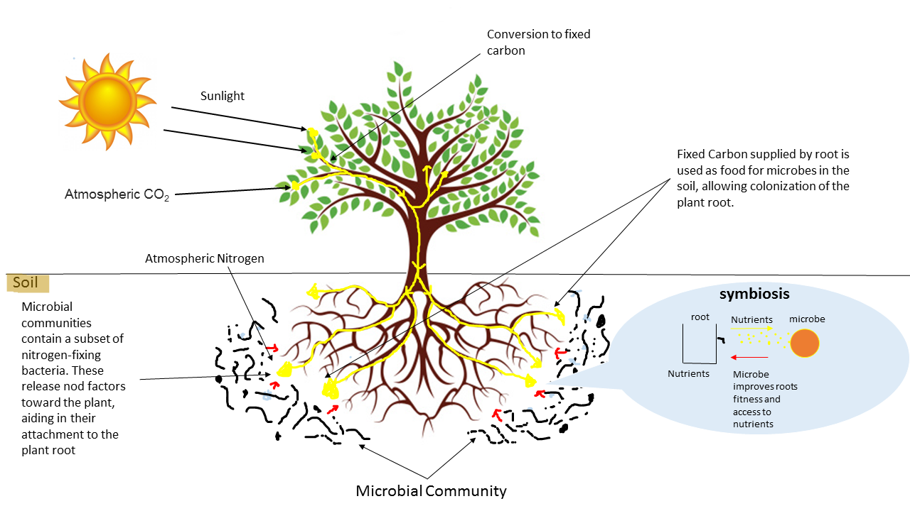
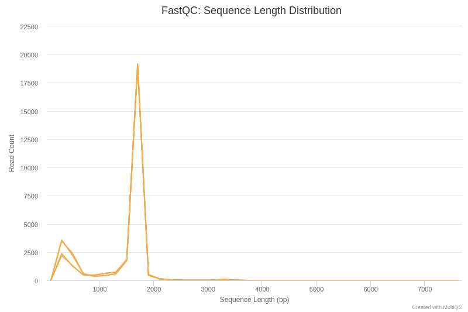
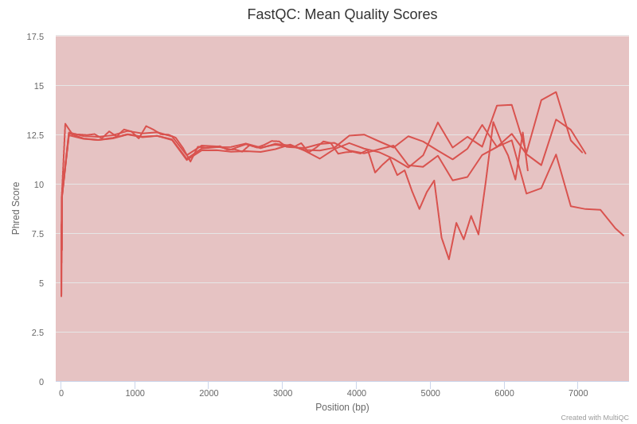
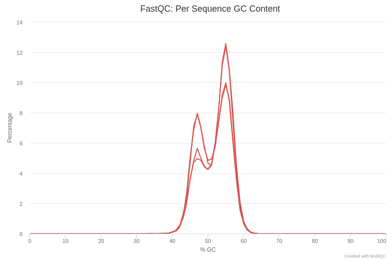
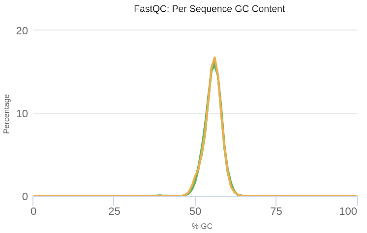
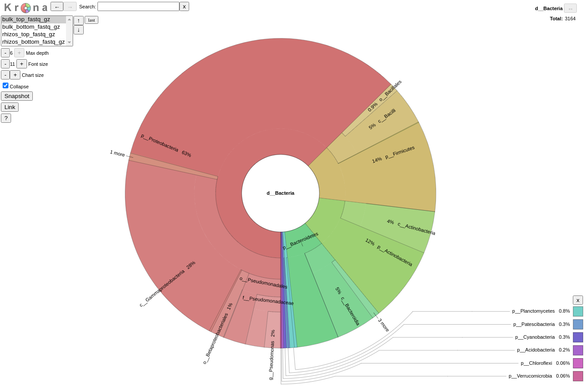

# Introduction
{:.no_toc}

<!-- This is a comment. -->


__Healthy soils__ are an essential element in maintaining the planet’s ecological balance. That is why their protection must be considered a priority in order to guarantee the well-being of humanity. The alteration of microbial populations often precedes changes in the physical and chemical properties of soils, so monitoring their condition can serve to predict their future evolution, allowing to develop strategies to __mitigate ecosystem damage__.

Advances in sequencing technologies have opened up the possibility of using the study of taxa present in bacterial communities as indicators of soil condition. For such an approach to be possible, variations in microbial populations need to be less affected by spatial factors than by human-derived alterations, which has been confirmed by various investigations (, ).

Among the environmental variables that have shown the greatest correlation with alterations in the composition of bacterial communities are soil pH, the carbon-nitrogen ratio (C:N), and the co-concentrations of Olsen P (a measure of plant available phosphorus), aluminium and copper (Fig. 1).


 to least abundant (bottom). Image published originally in .")


On the other hand, many species of microorganisms establish complex __symbiotic relationships__ with plant organisms. The fraction of the substrate that is directly influenced by root secretions and associated microorganism is known as __rhizosphere__. Thus, for example, bacteria of the genus _Bacillus_, _Pseudomonas_ or _Burkholderia_ appear associated with the plant roots, protecting them from pathogenic microorganisms.



In this tutorial, we will use sequencing data obtained through the __MinION sequencer__ (Oxford Nanopore Technologies) with two objectives: 1) evaluate the health status of soil samples and 2) study how microbial populations are modified by their interaction with plant roots. This example was inspired by .

> ### Agenda
>
> In this tutorial, we will cover:
>
> 1. TOC
> {:toc}
>
{: .agenda}

# Background on data

Next, we will introduce some details about the datasets that we are going to use to perform the analysis.

## The datasets

In this example, we will use a dataset originally hosted in the __NCBI SRA database__, with the accession number [SRP194577](https://www.ncbi.nlm.nih.gov/sra?term=SRP194577). To obtain the samples, the DNA was extracted using the Zymo Research Kit, followed by __PCR amplification of 16S rRNA genes__. Sequencing was carried out on a Nanopore Minion device. We are going to use four datasets, corresponding to two experimental conditions:

- Soil:
	- Surface sample (0-5 cm): `bulk_top.fastq.gz`
	- Deep sample (10-15 cm): `bulk_bottom.fastq.gz`
- Rhizosphere:
	- Surface sample (0-5 cm): `rhizosphere_top.fastq.gz`
	- Deep sample (10-15 cm): `rhizosphere_bottom.fastq.gz`

>
> ###  Question
>
>  Why do we sequence the 16S rRNA genes for analyzing microbial communities?
>
> > ###  Solution
> > There are several reasons to use these genes as taxonomic markers. First, they are constituent parts of ribosomes, a piece of highly-conserved biological machinery, which makes them universally distributed. On the other hand, these genes present regions with varying degrees of sequence variability, which allows them to be used as a species-specific signature.
> {: .solution}
{: .question}


# Get data

> ###  Hands-on: Data upload
>
> 1. Create a new history for this tutorial
> 2. Import the files from Zenodo:
>
>    - Open the file  __upload__ menu
>    - Click on __Collection__ tab
>    - Click of the **Paste/Fetch** button
>    - Paste the Zenodo links and press <kbd>Start</kbd> and <kbd>Build</kbd>
>
>     ```
>     https://zenodo.org/record/4274812/files/bulk_bottom.fastq.gz
>     https://zenodo.org/record/4274812/files/bulk_top.fastq.gz
>     https://zenodo.org/record/4274812/files/rhizosphere_bottom.fastq.gz
>     https://zenodo.org/record/4274812/files/rhizosphere_top.fastq.gz
>     ```
>     - Assign a name to the new collection: `soil collection`
>
>    
>    
>
>
{: .hands_on}

# Assess datasets quality

Before starting to work on our datasets, it is necessary to assess their quality. This is an essential step if we aim to obtain a __meaningful downstream analysis__.


> ###  FASTQ sequence quality format
>
> FASTQ format is a text-based format for storing both a biological sequence and its corresponding quality scores. Both the sequence letter and the quality score are encoded with a single ASCII character for brevity. You can find more info in the [Wikipedia article](https://en.wikipedia.org/wiki/FASTQ_format).
>
{: .details}

## Quality control using FastQC and MultiQC

__FastQC__ is one of the most widely used tools to __check the quality__ of the samples generated by High Throughput Sequencing (HTS) technologies.

> ###  Hands-on: Quality check
>
> 1.  with the following parameters:
>    -  *"Dataset collection"*: `soil collection`
>
> 2. Rename the outputs as `FastQC unprocessed: Raw` and `FastQC unprocessed: Web`
> 3.  with the following parameters:
>    - In *"Results"*:
>      - *"Which tool was used generate logs?"*: `FastQC`
>      -  *"Dataset collection"*:
>
>		- `FastQC unprocessed: Raw`
> 4. Click on the  (eye) icon and inspect the generated HTML file
>
>
{: .hands_on}

__FastQC__ provides information on various parameters, such as the range of quality values across all bases at each position. __MultiQC__ allows summarizing the output of different outputs from __FastQC__.



In the first place, we are going to analyse the sequence length distribution of the different datasets.

> ###  Question
>
> 1. Can you explain the sequence length distribution plot?
>
> > ###  Solution
> >
> > The main peak, around 1700 bp, corresponds approximately to the length of the gene coding for 16S rRNA. There is also a secondary peak around 200 bp, which may be due to __truncated amplifications__, or as a result of __non-specific hybridization of primers__ used for PCR.
> >
> {: .solution}
{: .question}





If we examine figure 3, we can see that up to 3000 bp the quality of our sequencing data is around a __Phred score__ of 12, which is a relatively low value compared to other sequencing technologies. This is explained because Nanopore reads poses __high error rates in the basecalled reads__ (10% as compared to 1% for Illumina). However, Nanopore sequencing generates __very long reads__ (in theory only limited by the mechanisms of extraction of the genetic material), enabling the sequencing of the complete 16S rRNA gene, which makes it possible to identify bacterial taxa at higher resolution.



Let's have a look at figure 4, which shows the content of the GC by sequence.

>
> ###  Questions
>
> What can cause GC content to show a bimodal peak?
>
> > ###  Solution
> >
> > There are several possible causes for the presence of twin peaks in the GC content. One possible explanation is the presence of adapters in the sequence. Another possible cause is some kind of contamination, such as chimeras.
> >
> {: .solution}
>
{: .question}

> ###  Comments
> For more information on the topic of quality control, please see our training materials [here](https://training.galaxyproject.org/training-material/topics/sequence-analysis/tutorials/quality-control/tutorial.html).
{: .comment}


# Improve the dataset quality

In order to improve the quality of our data, we will use two tools presented above, __porechop__ and __fastp__.

## Adapter and chimera removal with porechop

Nanopore sequencing technology requires to ligate adapters to both ends of genomic material to facilitate the strand capture and loading of a processive enzyme at the 5'end, boosting the effectiveness of the sequencing process. Adapter sequences should be removed because they __can interfere with aligment of reads__ to 16S rRNA gene reference database, for which we will use the __porechop__ tool ().

> ###  Comment
> If you are interested in Nanopore sequecing technology, you can find more information in .
>
{: .comment}


On the other hand, __chimeric sequences__ are considered a contaminant and should be removed because they can result in artificial inflation of the microbial diversity. With __Porechop__ you can eliminate them.

> ###  Hands-on: Remove adapters with porechop
>
> 1.  with the following parameters:
>    - *"Input FASTA/FASTQ"*:  `soil collection`
>    - *"Output format for the reads"*: `fastq`
> 2. Rename the output as `soil collection trimmed`
>
{: .hands_on}

## Filter sequences with fastp

To increase the specificity of the analysis, we will select the reads with lengths between 1000 bp and 2000 bp, which are more informative from a taxonomic point of view, because they include both preserved and hypervariable regions of the 16S rRNA gene. In addition, sequences will be filtered on a minimum average read quality score of 9, according to the recommendations from . This stage will be carried out through the use of __fastp__ (), an open-source tool designed to process FASTQ files.

> ###  Hands-on: Filter sequence with fastp
>
> 1.  with the following parameters:
>    - *"Single-end or paired reads"*: `Single-end`
     -  *"Dataset collection"*: `soil collection trimmed`
>        - In *"Adapter Trimming Options"*:
>            - *"Disable adapter trimming"*: `Yes`
>    - In *"Filter Options"*:
>        - In *"Quality filtering options"*:
>            - *"Qualified quality phred"*: `9`
>        - In *"Length filtering options"*:
>            - *"Length required"*: `1000`
>            - *"Maximum length"*: `2000`
>    - In *"Read Modification Options"*:
>        - *"PolyG tail trimming"*: `Disable polyG tail trimming`
>
> 2. Rename the output as `soil collection processed`
>
>
{: .hands_on}

# Re-evaluate datasets quality

After processing the sequences, we are going to analyze them again using __FastQC__ and __MultiQC__ to see if we have managed to correct the anomalies that we had detected.

> ###  Hands-on: Quality check
>
> 1.  with the following parameters:
>    -  *"Dataset collection"*: `soil collection processed`
>
> 4. Rename the outputs as `FastQC processed: Raw` and `FastQC processed: Web`
> 3.  with the following parameters:
>    - In *"Results"*:
>      - *"Which tool was used generate logs?"*: `FastQC`
>      -  *"Dataset collection"*:
>
>		- `FastQC processed: Raw`
> 4. Click on the  (eye) icon and inspect the generated HTML file
>
>
{: .hands_on}

We can verify that after processing the samples, the GC content presents a unimodal distribution, which indicates that the anomalies in the sequences have been successfully eliminated (Figure 6).



# Assign taxonomic classifications

One of the key steps in metagenomic data analysis is to identify the taxon to which the individual reads belong. Taxonomic classification tools are based on microbial genome databases to identify the origin of each sequence.

## Taxonomic classification with Kraken2

To perform the taxonomic classification we will use __Kraken2__ (). This tool uses the minimizer method to sample the k-mers (all the read's subsequences of length _k_) in a deterministic fashion in order to reduce memory constumption and processing time. In addition, it masks low-complexity sequences from reference sequences by using __dustmasker__.


> ###  Comments
> __Kraken2__ uses a compact hash table, a probabilistic data structure that allows for faster queries and lower memory requirements. It applies a spaced seed mask of _s_ spaces to the minimizer and calculates a compact hash code, which is then used as a search query in its compact hash table; the lowest common ancestor (LCA) taxon associated with the compact hash code is then assigned to the k-mer.
> You can find more information about the __Kraken2__ algorithm in the paper [_Improved metagenomic analysis with Kraken 2_](https://genomebiology.biomedcentral.com/articles/10.1186/s13059-019-1891-0).
{: .comment}

 of the genomes that contain that l-mer in a database. In the classification tree, each node has a weight equal to the number of l-mers in the sequence associated with the node’s taxon. Image originally published in .")

For this tutorial, we will use the __SILVA database__ (). It includes over 3.2 million 16S rRNA sequences from the _Bacteria_, _Archaea_ and _Eukaryota_ domains.

> ###  Hands-on: Assign taxonomic labels with Kraken2
>
> 1.  with the following parameters:
>    - *"Single or paired reads"*: `Single`
>    -  *"Dataset collection"*: `soil collection processed`
>    - *"Print scientific names instead of just taxids"*: `Yes`
>    - *"Confidence"*: `0.1`
>    - In *"Create Report"*:
>        - *"Print a report with aggregrate counts/clade to file"*: `Yes`
>        - *"Format report output like Kraken 1's kraken-mpa-report"*: `Yes`
>    - *"Select a Kraken2 database"*: `Silva (Created: 2020-06-24T164526Z, kmer-len=35, minimizer-len=31, minimizer-spaces=6)`
>
>    > ###  Comment
>    >
>    > A confidence score of 0.1 means that at least 10% of the k-mers should match entries in the database. This value can be reduced if a less restrictive taxonomic assignation is desired.
>    {: .comment}
>
{: .hands_on}


# Analyze taxonomic assigment

Once we have assigned the corresponding taxa to each sequence, the next step is to properly visualize the data, for which we will use the __Krona pie chart__ tool (). But before that, we need to adjust the format of the data output from __Kraken2__.

> ###  Hands-on: Adjust dataset format
>
> 1.  with the following parameters:
>    -  *"Dataset collection"*: `Report: Kraken2 on collection`
>
> 2.  with the following parameters:
>    -  *"Dataset collection"*: `Reverse on collection`
>    - In *"Replacement"*:
>        -  *"Insert Replacement"*
>            - *"Find pattern"*: `\|`
>            - *"Replace with"*: `\t`
>
> 3.  with the following parameters:
>    -  *"Dataset collection"*: `Replace Text on collection`
>
{: .hands_on}

## Visualize the taxonomical classification with Krona

__Krona__ allows hierarchical data to be explored with zooming, multi-layered pie charts. With this tool, we can easily visualize the composition of the bacterial communities and compare how the populations of microorganisms are modified according to the conditions of the environment.

> ###  Hands-on: Visualize metagenomics analysis results
>
> 1.  with the following parameters:
>    - *"What is the type of your input data"*: `Tabular`
>    -  *"Dataset collection"*: `Remove beginning on collection`
>    - *"Provide a name for the basal rank"*: `Bacteria`
>
{: .hands_on}

Let's take a look at the result. Using the search bar we can check if certain taxa are present.

<iframe id="krona" src="krona_all.html" frameBorder="0" width="100%" height="900px">  </iframe>

> ###  Questions
>
> 1. What can we say about the health status of the soil samples?
> 2. Are there significant differences in the bacterial population structure between soil samples and rhizosphere samples?
>
> > ###  Solution
> >
> > 1. The low presence of _Alphaproteobacteria_ (including members of the order _Rhizobiales_), as well as the abundance of _Bacteroidetes_ and _Gammaproteobacteria_, suggest that the soil is highly exposed to phosphorus. This mineral is strongly associated with the anthropogenic activity as it is an important component of agrochemicals.
> > 2. We can observe that there are important differences in the structure of the bacterial populations between the soil and rhizosphere samples. Particularly significant is the increase in phylum _Planctomycetes_, which are usually abundant in the rhizosphere.
> >
> {: .solution}
>
{: .question}

# Conclusion

In this tutorial we used MinION Nanopore sequencing data to study the health status of soil samples and the structure of bacterial populations. The results indicate that the soil suffers some degree of erosion as a result of their exposure to agrochemicals. We have also been able to study how the composition of microbial communities is modified in presence of plant organisms.
