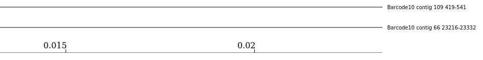
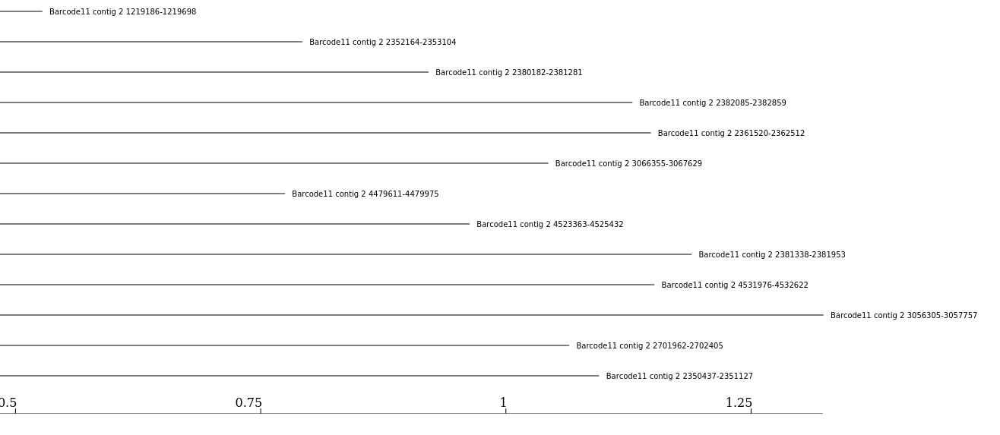
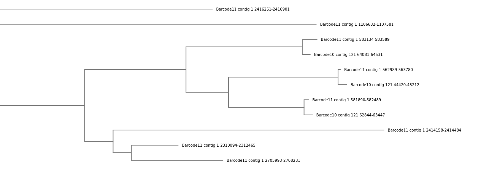

# Introduction

Food contamination with pathogens is a major burden on our society. In the year 2019, foodborne pathogens caused 137 hospitalisations in Germany [(BVL 2019)](https://www.bvl.bund.de/SharedDocs/Berichte/10_BELA_lebensmittelbed_Krankheitsausbruechen_Dtl/Jahresbericht2019.pdf?__blob=publicationFile&v=4). Globally, they affect an estimated 600 million people a year and impact socioeconomic development at different levels. These outbreaks are mainly due to _Salmonella spp._ followed by _Campylobacter spp._ and Noroviruses, as studied by the [__Food safety - World Health Organization (WHO)__](https://www.who.int/publications/i/item/9789241565165).

During the investigation of a foodborne outbreak, a microbiological analysis of the potentially responsible food vehicle is performed in order to detect the responsible pathogens and identify the contamination source. By default, the [__European Regulation (EC)__](https://eur-lex.europa.eu/LexUriServ/LexUriServ.do?uri=OJ:L:2005:338:0001:0026:EN:PDF) follows ISO standards to detect bacterial pathogens in food: pathogens are detected and identified by **stepwise cultures** on selective media and/or **targeting specific genes with real-time PCRs**. The current gold standard is Pulsed-field Gel Electrophoresis (PFGE) or Multiple-Locus Variable Number Tandem Repeat Analysis (MLVA) to characterize the detected strains. These techniques have some disadvantages.

**Whole Genome Sequencing** (WGS) has been proposed as an alternative. With just one sequencing run, we can:
- detect all genes
- run phylogenetic analysis to link cases
- get information on antimicrobial resistance genes, virulence, serotype, resistance to sanitizers, root cause, and other critical factors in one assay, including historical reference to pathogen emergence.

WGS is more than a surveillance tool and was recommended by the European Centre for Disease Prevention and Control (ECDC) and the European Food Safety Authority (EFSA) for surveillance and outbreak investigation. WGS still requires isolation of the targeted pathogen, which is a time-consuming process, the execution is not always straightforward, nor the success is guaranteed. **Sequencing methods without prior isolation could solve this issue**.

The evolution of sequencing techniques in the last decades has made the development of shotgun metagenomic sequencing possible, *i.e.* the **direct sequencing of all DNA present in a sample**. This approach gives an overview of the genomic composition of all cells in the sample, including the food source itself, the microbial community, and any possible pathogens and their complete genetic information without the need for prior isolation. Several studies have demonstrated the potential of shotgun metagenomics to identify and characterize pathogens and their functional characteristics (*e.g.* virulence genes) in naturally contaminated or purposefully spiked food samples.

The currently available studies used Illumina sequencing, generating short reads. Longer read lengths, generated by third-generation sequencing platforms such as Pacific Biosciences (PacBio) and Oxford Nanopore Technologies (ONT), make it **easier and more practical to identify strains with fewer reads**. MinION (from Oxford Nanopore) is a portable, real-time device for ONT sequencing. Several proof-of-principle studies have shown the **utility of ONT long-read sequencing from metagenomic samples for pathogen identification** ().



To identify and track foodborne pathogens using long-read metagenomic sequencing, different samples of potentially contaminated food (at different time points or different locations) are prepared, DNA is extracted and sequenced using MinION (ONT). The generated sequencing data then need to be processed using bioinformatics tools.

In this tutorial, we will be presenting a series of Galaxy workflows whose main goals are to:
1. **agnostically detect pathogens** (What exactly is this pathogen and what virulence factors does it carry?) from data extracted directly (without prior cultivation) from a potentially contaminated sample (e.g. food like chicken, beef, etc.) and sequenced using Nanopore
2. **compare different samples to trace** the possible source of contamination

To illustrate how to process such data, we will use datasets generated by [Biolytix](https://www.biolytix.ch/) with the following approach:


Food samples, here chicken, are spiked with known pathogens, here:
- _Salmonella enterica subsp. enterica_  in the sample named `Barcode 10 Spike 2`
- _Salmonella enterica subsp. houtenae_ in the sample named `Barcode 11 Spike 2b`

DNA in the samples is extracted, analyzed with qPCR, and sequenced via Nanopore. We start the tutorial from raw data generated by Nanopore.

> <agenda-title></agenda-title>
>
> In this tutorial, we will deal with:
>
> 1. TOC
> {:toc}
>
{: .agenda}


# Prepare Galaxy and data
Any analysis should get its own Galaxy history. So let's start by creating a new one:

> <hands-on-title>Data upload</hands-on-title>
>
> 1. Create a new history for this analysis
>
>    
>
> 2. Rename the history
>
>    
>
{: .hands_on}

Before we can begin any Galaxy analysis, we need to upload the input data: FASTQ files with the sequenced samples.

> <hands-on-title>Import datasets</hands-on-title>
>
> 1. Import the following samples via link from [Zenodo]({{ page.zenodo_link }}) or Galaxy shared data libraries:
>
>    ```text
>    {{ page.zenodo_link }}/files/Barcode10_Spike2.fastq.gz
>    {{ page.zenodo_link }}/files/Barcode11_Spike2b.fastq.gz
>    ```
>
>    
>    
>
> 2. Add a tag to each dataset (one with `#Barcode10` and the other `#Barcode11`)
>
>    
>
{: .hands_on}

In this tutorial, we can offer 2 versions:
- A short version, running prebuilt workflows
- A long version, going step-by-step




# Pre-Processing

Before starting any analysis, it is always a good idea to assess the quality of your input data and to discard poor quality base content by trimming and filtering reads.

<div class="Short-Version" markdown="1">

In this section we will run a Galaxy workflow that performs the following tasks with the following tools:
1. Assess the reads quality before and after preprocessing it using [__FastQC__](https://www.bioinformatics.babraham.ac.uk/projects/fastqc/), [__NanoPlot__](https://github.com/wdecoster/NanoPlot) and  [__MultiQC__](https://multiqc.info/) ()
2. Trimming and filtering reads by length and quality using [__Porechop__](https://github.com/rrwick/Porechop) and **Fastp** ()
3. Remove all possible hosts sequences e.g. chicken, cow, etc. using [__Kraken2__](https://ccb.jhu.edu/software/kraken2/) () with the [__Kalamari__](https://github.com/lskatz/Kalamari) database, and table manipulation tools, which are **Filter Tabular** () and **Filter Sequence By ID** () to separate the sequences into host and non-host sequences before moving on, in the next section, with the non-host sequences.

We will run all these steps using a single workflow, then discuss each step and the results in more detail.

> <hands-on-title>Pre-Processing</hands-on-title>
>
> 1. **Import the workflow** into Galaxy
>    - Copy the URL (e.g. via right-click) of [this workflow]({{ site.baseurl }}{{ page.dir }}workflows/nanopore_preprocessing.ga) or download it to your computer.
>    - Import the workflow into Galaxy
>
>    
>
> 2. Run **Workflow 1:  Nanopore Datasets - Pre-Processing**  using the following parameters
>
>    
>
>    -  *"1: Nanopore reads of a sample"*: FastQ files
>
>      
>
>    - *"2: Host to Remove Specifier"*: `^.*Gallus|Homo|Bos.*$`
>
>      We specify here the taxonomic names of the hosts so we can filter reads assigned to these hosts. To be generic, we remove here:
>      - Human (`Homo`)
>      - Chicken (`Gallus`)
>      - Beef (`Bos`)
>
>      If the contaminated food would be known to come from a different source and may, thus, include other host genomes, you could change the value here.
>
{: .hands_on}

The workflow will take a little while to complete. Once tools have completed, the results will be available in your history for viewing. Note that only the most important outputs will be visible; intermediate files are hidden by default.

While you are waiting for the workflow to complete, please continue reading in the next section(s) where we will go into a bit more detail about what happens at each step of the workflow we launched and examine the results.
</div>

## Quality Control and preprocessing

During sequencing, errors are introduced, such as incorrect nucleotides being called. These are due to the technical limitations of each sequencing platform. Sequencing errors might bias the analysis and can lead to a misinterpretation of the data. **Sequence quality control is therefore an essential first step in your analysis.**

In this tutorial we use similar tools as described in the tutorial ["Quality control"](), but more specific to Nanopore data:

- Quality control with
    - [__FastQC__](https://www.bioinformatics.babraham.ac.uk/projects/fastqc/) generates a web report that will aid you in assessing the quality of your data
    - [__NanoPlot__](https://github.com/wdecoster/NanoPlot) plotting tool for long read sequencing data and alignments

    <div class="Long-Version" markdown="1">

    > <hands-on-title> Initial quality assessment </hands-on-title>
    > 1.  with the following parameters:
    >    -  *"Raw read data from your current history"*: both FastQ file
    >
    >      
    >
    > 2.  with the following parameters:
    >    - *"Select multifile mode"*: `batch`
    >        - *"Type of the file(s) to work on"*: `fastq`
    >            -  *"Data input files"*: both FastQ file
    >
    >    > <comment-title></comment-title>
    >    > This step, as it does not require the results of FastQC to run, can be launched even if FastQC is not ready
    >    {: .comment}
    >
    {: .hands_on}

    </div>


- Read trimming and filtering with [__Porechop__](https://github.com/rrwick/Porechop) and **Fastp** ()

    <div class="Long-Version" markdown="1">

    > <hands-on-title> Read trimming and filtering </hands-on-title>
    >
    > 1.  with the following parameters:
    >    -  *"Input FASTA/FASTQ"*: both FastQ file
    >    - *"Output format for the reads"*: `fastq.gz`
    >
    > 2.  with the following parameters:
    >    - *"Single-end or paired reads"*: `Single-end`
    >        -  *"Input 1"*: outputs of **Porechop** 
    >    - In *Output Options*
    >        - *"Output JSON report"*: `Yes`
    >
    >    > <comment-title></comment-title>
    >    > This step can be launched even if **Porechop** is not done. It will be scheduled and wait until **Porechop** is done to start.
    >    {: .comment}
    {: .hands_on}

    </div>

- Quality recheck after read trimming and filtering with **FastQC** and **Nanoplot** and report aggregation with [__MultiQC__](https://multiqc.info/)

    <div class="Long-Version" markdown="1">

    > <hands-on-title> Final quality checks </hands-on-title>
    > 1.  with the following parameters:
    >    -  *"Raw read data from your current history"*: outputs of **fastp** 
    >
    > 2.  with the following parameters:
    >    - *"Select multifile mode"*: `batch`
    >        - *"Type of the file(s) to work on"*: `fastq`
    >            -  *"files"*: outputs of **fastp** 
    >
    > 3.  with the following parameters:
    >    - In *"Results"*:
    >        -  *"Insert Results"*
    >            - *"Which tool was used generate logs?"*: `FastQC`
    >                - In *"FastQC output"*:
    >                    -  *"Insert FastQC output"*
    >                        - *"Type of FastQC output?"*: `Raw data`
    >                        -  *"FastQC output"*: 4 `Raw data` outputs of **FastQC** 
    >        -  *"Insert Results"*
    >            - *"Which tool was used generate logs?"*: `fastp`
    >                -  *"Output of fastp"*: `JSON report` outputs of **fastp** 
    {: .hands_on}

    </div>

> <question-title></question-title>
>
> Inspect the HTML output of **MultiQC** for `Barcode10`
>
> 1. How many sequences does `Barcode10` contain before and after trimming?
> 2. What is the quality score over the reads before and after trimming? And the mean score?
> 3. What is the importance of **FastQC**?
>
> > <solution-title></solution-title>
> >
> > 1. Before trimming the file has 114,986 sequences and After trimming the file has 91,434 sequences
> > 2. The "Per base sequence quality" is globally medium: the quality score stays above 20 over the entire length of reads after trimming, while quality below 20 could be seen before trimming specially at the beginning and the end of the reads.
> >
> >    
> >
> > 3. After checking what is wrong, e.g. before trimming, we should think about the errors reported by **FastQC**: they may come from the type of sequencing or what we sequenced (check the ["Quality control" training](): [FastQC](https://www.bioinformatics.babraham.ac.uk/projects/fastqc/) for more details). However, despite these challenges, we can already see sequences getting slightly better after the trimming and filtering, so now we can proceed with our analyses.
> {: .solution}
{: .question}

> <comment-title></comment-title>
> For more information about how to interpret the plots generated by **FastQC** and **MultiQC**, please see our dedicated ["Quality control"]() Tutorial.
{: .comment}

## Host read filtering

Generally, we are not interested in the food (host) sequences, rather only those originating from the pathogen itself. It is an important to get rid of all host sequences and to only retain sequences that might include a pathogen, both in order to speed up further steps and to avoid host sequences compromising the analysis.

In this tutorial, we know the samples come from __chicken__ meat spiked with **_Salmonella_** so we already know what will we get as the host and the main pathogen.

In this tutorial we use:
1. Assign reads to taxa using **Kraken2** () and **Kalamari**, a database of completed assemblies for metagenomics-related tasks used widely in contamination and host filtering

    <div class="Long-Version" markdown="1">

    > <hands-on-title>Read taxonomic classification for host filtering </hands-on-title>
    >
    > 1.  with the following parameters:
    >    - *"Single or paired reads"*: `Single`
    >        -  *"Input sequences"*: outputs of **fastp** 
    >
    >    - *"Print scientific names instead of just taxids"*: `Yes`
    >    - In *"Create Report"*:
    >        - *"Print a report with aggregrate counts/clade to file"*: `Yes`
    >        - *"Format report output like Kraken 1's kraken-mpa-report"*: `Yes`
    >        - *"Report counts for ALL taxa, even if counts are zero"*: `Yes`
    >        - *"Report minimizer data"*: `Yes`
    >    - *"Select a Kraken2 database"*: `kalamari`
    >
    {: .hands_on}

    </div>

    > <question-title></question-title>
    >
    > Inspect the report of **Kraken2** for `Barcode10`
    >
    > 1. What is the species of the host?
    > 2. How many sequences of this host was found?
    >
    > > <solution-title></solution-title>
    > >
    > > 1. _Gallus gallus_ (taxid 9031), which is chicken
    > > 2. 836
    > >
    > {: .solution}
    {: .question}

2. Filter host assigned reads based on **Kraken2** assignments
    1. Manipulate **Kraken2** classification to extract the sequence ids of all hosts sequences identified with **Kraken2**
    2. Filter the FASTQ files to get 1 ouput with the host-assigned sequences and 1 output without the host-assigned reads

    <div class="Long-Version" markdown="1">

    > <hands-on-title> Host read filtering </hands-on-title>
    >
    > 1.  with the following parameters:
    >    -  *"Tabular Dataset to filter"*: `Classification` outputs of **Kraken2** 
    >    - In *"Filter Tabular Input Lines"*:
    >        -  *"Insert Filter Tabular Input Lines"*
    >            - *"Filter By"*: `by regex expression matching`
    >                - *"regex pattern"*: `^.*Gallus|Homo|Bos.*$`
    >
    >                  We specify here the taxonomic names of the hosts so we can filter reads assigned to these hosts. To be generic, we remove here:
    >                  - Human (`Homo`)
    >                  - Chicken (`Gallus`)
    >                  - Beef (`Bos`)
    >
    >                  If the contaminated food comes from and may include other animals, you can change the value here.
    >
    >                - *"action for regex match"*: `include line if pattern found`
    >
    > 2.  with the following parameters:
    >    -  *"Sequence file to be filtered"*: outputs of **fastp** 
    >    - *"Filter using the ID list from"*: `tabular file`
    >        -  *"Tabular file containing sequence identifiers"*: outputs of **Filter Tabular** 
    >        - *"Column(s) containing sequence identifiers"*: `Column: 2`
    >    - *"Output positive matches, negative matches, or both?"*: `Both positive matches (ID on list) and negative matches (ID not on list), as two files`
    >
    {: .hands_on}

    </div>


> <comment-title></comment-title>
>
> We will need the outputs from this section in the next one.  If yours is still running or you get an error you can go on and upload it so you can start the next workflow, the next hands-on is optional.
>
> > <hands-on-title>Optional Data upload</hands-on-title>
> >
> > 1. Import the quality processed samples fastqsanger files via link from [Zenodo]({{ page.zenodo_link }}) or the Shared Data library:
> >
> >    ```text
> >    {{ page.zenodo_link }}/files/Nanopore_processed_sequenced_reads_Barcode10_Spike2.fastqsanger
> >    {{ page.zenodo_link }}/files/Nanopore_processed_sequenced_reads_Barcode11_Spike2b.fastqsanger
> >    ```
> >
> > 2. Add tags to the datasets
> >
> {: .hands_on}
{: .comment}


# Taxonomy Profiling

In this section we would like to identify the different organisms found in our samples by assigning taxonomy levels to the reads starting from the kingdom level down to the species level and visualize the result. It's important to check what might be the species of a possible pathogen to be found, it gets us closer to the investigation as well as discovering possible multiple food infections if any existed.



In the previous section we ran **Kraken2** along with the **Kalamari** database, which is also a kind of taxonomy profiling but the database used is designed to include all possible host sequences. In the following part, we run **Kraken2** again; but this time with one of its built-in databases, **Standard PlusPF**, which can give us more insight into pathogen candidate species than **Kalamari**. You can test this yourself by comparing reports of both **Kraken2** runs.

> <details-title>Kraken2 and the k-mer approach for taxonomy classification</details-title>
>
> In the $$k$$-mer approach for taxonomy classification, we use a database containing DNA sequences of genomes whose taxonomy we already know. On a computer, the genome sequences are broken into short pieces of length $$k$$ (called $$k$$-mers), usually 30bp.
>
> **Kraken** examines the $$k$$-mers within the query sequence, searches for them in the database, looks for where these are placed within the taxonomy tree inside the database, makes the classification with the most probable position, then maps $$k$$-mers to the lowest common ancestor (LCA) of all genomes known to contain the given $$k$$-mer.
>
>  of the genomes that contain that k-mer in the database. The taxa associated with the sequence's k-mers, as well as the taxa's ancestors, form a pruned subtree of the general taxonomy tree, which is used for classification. In the classification tree, each node has a weight equal to the number of k-mers in the sequence associated with the node's taxon. Each root-to-leaf (RTL) path in the classification tree is scored by adding all weights in the path, and the maximal RTL path in the classification tree is the classification path (nodes highlighted in yellow). The leaf of this classification path (the orange, leftmost leaf in the classification tree) is the classification used for the query sequence. Source: ")
>
{: .details}

<div class="Short-Version" markdown="1">

> <hands-on-title>Taxonomy Profiling and visualisation</hands-on-title>
>
> 1. **Import the workflow** into Galaxy
>    - Copy the URL (e.g. via right-click) of [this workflow]({{ site.baseurl }}{{ page.dir }}workflows/nanopore_taxonomy_profiling_and_visualization.ga) or download it to your computer.
>    - Import the workflow into Galaxy
>
> 2. Run **Workflow 2: Nanopore Datasets - Taxonomy Profiling and Visualization**  using the following parameters:
>    - *"Send results to a new history"*: `No`
>    -  *"Nanopore preprocessed reads"*: `Nanopore processed sequenced reads` files for both tags
>    - *"Sample Metadata"*: Leave empty
>
>    
>
{: .hands_on}

</div>

To assign reads to taxons, we use **Kraken2** with **Standard PlusPF** database.

<div class="Long-Version" markdown="1">

> <hands-on-title> Taxonomy Profiling </hands-on-title>
>
> 1.  with the following parameters:
>    - *"Single or paired reads"*: `Single`
>        -  *"Input sequences"*: Outputs without matched ID of **Filter sequences by ID** 
>    - In *"Create Report"*:
>        - *"Print a report with aggregrate counts/clade to file"*: `Yes`
>    - *"Select a Kraken2 database"*: `Prebuilt Refseq indexes:  PlusPF (Standard plus protozoa and fungi) (Version:  2022-06-07 - Downloaded: 2022-09-04T165121Z)`
{: .hands_on}

</div>

> <question-title></question-title>
>
> Inspect the **Kraken2** report for `Barcode10` tag
>
> 1. What is the most commonly found species?
> 2. What is the second most commonly found species?
> 3. How many sequences are classified and how many are unclassified?
> 4. What are the differences between **Kraken2** tool's report with **Kalamari** database and **Kraken2** tool's report with **Standard PlusPF** database regarding the previous 3 questions?
>
> > <solution-title></solution-title>
> >
> > 1. _Escherichia coli_ with 10,243 sequences
> > 2. _Salmonella enterica_ with 7,458 sequences
> > 3. 40,143 sequences are classified and 50,455 are unclassified
> > 4. With **Kalamari** database the most found species is _Escherichia coli_ with 12,577 sequences and the second most found species is _Salmonella enterica_ with 10,632 sequences. The number of classified sequences are 32,020 sequences and the unclassified sequences are 59,414. In conclusion, both databases are able to show the same results of the most common species. However, the number of the classified sequences with **Standard PlusPF** database is higher than **Kalamari** database and it would be even higher since all chicken sequences were removed before testing the **Standard PlusPF** database.
> {: .solution}
{: .question}

In order to view the taxonomy profiling produced by **Kraken2** tool, there are a lot of tools to be used afterwards such as **Krona pie chart**, however too many species were detected to be shown by this tool. For that reason, we have chosen the **Phinch visualization** interactive tool as it contains multiple visualization plots, it is interactive alowing you to choose between different parameters, you can visualize each taxonomic level on its own, you can have the metadata of the samples represented along with the taxonomic visualization, download all plots for publications and a lot of other benefits. For later, you can check out [__Pavian__](https://academic.oup.com/bioinformatics/article/36/4/1303/5573755) tool as well it can replace **Phinch visualization** with similar outputs.

**Phinch visualization** needs a **BIOM** file format as an input, and for that we need the [__Kraken-Biom__](https://github.com/smdabdoub/kraken-biom)  tool to convert the **Kraken2** tabular output into a Biom file.

<div class="Long-Version" markdown="1">

> <hands-on-title> BIOM generation </hands-on-title>
>
> 1.  with the following parameters:
>    -  *"Input files to Kraken-biom: Kraken report output file(s)"*: Report outputs of **Kraken2** 
>    -  *"Sample metadata file"*: Leave empty
>    - *"Do you want to create an OTU IDs file"*: `Yes`
>    - *"Output Format"*: `JSON`
>
{: .hands_on}

</div>

Once the BIOM file has been generated, we launch the interactive visualisation tool called [__Phinch visualization__](https://www.phinch.org/):

<div class="Long-Version" markdown="1">

> <hands-on-title> Visualisation with Phinch </hands-on-title>
>
> 1.  with the following parameters:
>    -  *"Biom1 dataset"*: output of **Kraken-biom** 
>
{: .hands_on}

</div>

Now let's now explore the **Phinch visulization** tool running for `Barcode11` tag

> <hands-on-title>Explore data interactively</hands-on-title>
>
> 1. Open Phinch interactive tool
>
>    
>
> 2. Click on **Proceed to Gallery** button on the top right of the opened webpage to see all the plots
>
{: .hands_on}

> <question-title></question-title>
>
> 1. What is the most commonly found species?
> 2. What is the second most commonly found species?
> 3. What's your favorite visualization plot?
>
> > <solution-title></solution-title>
> >
> > 1. *Salmonella enterica* with 17,309 sequences
> > 2. *Pseudomonas lundensis* with 13,227 sequences
> > 3. All of them are good visualization of the data but for us to answer these questions, we used the **Taxonomy Bar Chart**
> >
> >    
> >
> {: .solution}
{: .question}

> <comment-title></comment-title>
> While these steps are running, you can move on to the next section **Gene based pathogenic identification** and run the steps there, as well. Both analyses can execute in parallel.
{: .comment}

# Gene based pathogenic identification

With taxonomy profiling, we identified some bacterial species. But we want to be sure they are pathogenic, by **looking for genes known to be linked to pathogenicity or to the pathogenecity character** of the organim:

- [**Virulence Factor (VF)**](https://www.sciencedirect.com/topics/immunology-and-microbiology/virulence-factor): gene products, usually proteins, involved in pathogenicity. By identifiying them we can call a pathogen and its severity level
- [**Antimicrobial Resistance genes (AMR)**](https://www.sciencedirect.com/topics/engineering/antibiotic-resistance-genes).

    These type of genes have three fundamental mechanisms of antimicrobial resistance that are enzymatic degradation of antibacterial drugs, alteration of bacterial proteins that are antimicrobial targets, and changes in membrane permeability to antibiotics, which will lead to not altering the target site and spread throughput the pathogenic bacteria decreasing the overall fitness of the host.

To look for these genes and determine the strain of the bacteria we are testing for pathogenicity we use **Multilocus Sequence Typing** approach and dedicated [pubMLST datases](https://pubmlst.org/) database:

1. Genome assembly to get contigs, i.e. longer sequences, using **metaflye** ()  then assembly polishing using [__medaka consensus pipeline__](https://github.com/nanoporetech/medaka) and visualizing the assembly graph using **Bandage Image** ()
2. Generate an **MLST** report with **MLST** tool that scans genomes against PubMLST schemes
3. Generate reports with **AMR** genes and **VF** using [__ABRicate__](https://github.com/tseemann/abricate) 

As outputs, we will get our **FASTA** and **Tabular** files to track genes and visualize our pathogenic identification. For that we will need one more file to create a report and we can upload it directly:

> <hands-on-title>Data upload</hands-on-title>
>
> 1. Import a tabular file via link from [Zenodo]({{ page.zenodo_link }}) or shared data libraries
>
>    ```text
>    {{ page.zenodo_link }}/files/MLST_Report_Header.tabular
>    ```
>
> 2. Check that the datatype is `Tabular`
{: .hands_on}


<div class="Short-Version" markdown="1">

> <hands-on-title>Gene based Pathogenic Identification</hands-on-title>
>
> 1. **Import the workflow** into Galaxy
>    - Copy the URL (e.g. via right-click) of [this workflow]({{ site.baseurl }}{{ page.dir }}workflows/Nanopore_Datasets_Gene_based_pathogenic_Identification.ga) or download it to your computer.
>    - Import the workflow into Galaxy
>
>    
>
> 2. Run **Workflow 3: Nanopore Datasets - Gene based Pathogenic Identification**  using the following parameters:
>    -  *"Nanopore Preprocessed reads"*: `Nanopore processed sequenced reads` for `Barcode10`
>    - *"Sample ID"*: `Barcode10_Spike2`
>    -  *"MLST Report Header"*: `MLST Report with Header`
>
>    
>
> 3. Repeat step 2 and run the same **workflow** again for the second tag
>    -  *"Nanopore Preprocessed reads"*: `Nanopore processed sequenced reads` for `Barcode11`
>    - *"Sample ID"*: `Barcode11_Spike2b`
>    -  *"MLST Report Header"*: `MLST Report with Header`
>
>    
>
{: .hands_on}

</div>

## Assembly

To identify VF or AMR genes, it is better to assemble reads into longer seuqences or contigs, that can be then used to search databases for the presence of any pathogenic gene:

- Assembly of long-read metagenomic data using **metaflye** or **Flye**.

    <div class="Long-Version" markdown="1">

    > <hands-on-title> Assembly with Flye </hands-on-title>
    >
    > 1.  with the following parameters:
    >    -  *"Input reads"*: Outputs without matched ID of **Filter sequences by ID**  for `Barcode10`
    >
    >      > <comment-title></comment-title>
    >      > We need to run **Flye** individually on each sample otherwise **Flye** runs by default a co-assembly mode, *i.e.* it combines read of both samples together before running the assembly.
    >      {: .comment}
    >
    >    - *"Mode"*: `Nanopore HQ (--nano-hq)`
    >    - *"Perform metagenomic assembly"*: `Yes`
    >    - *"Reduced contig assembly coverage"*: `Disable reduced coverage for initial disjointing assembly`
    >
    > 2.  with the following parameters:
    >    -  *"Input reads"*: Outputs without matched ID of **Filter sequences by ID**  for `Barcode11`
    >    - *"Mode"*: `Nanopore HQ (--nano-hq)`
    >    - *"Perform metagenomic assembly"*: `Yes`
    >    - *"Reduced contig assembly coverage"*: `Disable reduced coverage for initial disjointing assembly`
    {: .hands-on}

    </div>

- For the visualization of the assembly graph output from **Flye** we have chosen **Bandage Image**.

    <div class="Long-Version" markdown="1">

    > <hands-on-title> Visualization of the assembly grap </hands-on-title>
    > 4.  with the following parameters:
    >    -  *"Graphical Fragment Assembly"*: Assembly graph outputs of **Flye** 
    {: .hands-on}

    </div>

- Contig polishing using **medaka** to correct the long, error-prone Nanopore reads

    <div class="Long-Version" markdown="1">

    > <hands-on-title> Contig polishing </hands-on-title>
    >
    > 3.  with the following parameters:
    >    -  *"Select basecalls"*: Outputs without matched ID of **Filter sequences by ID** 
    >    -  *"Select assembly"*: Output of **Flye** 
    >    - *"Select model"*: `r941_min_hac_g507`
    >    - *"Select output file(s)"*: `select all`
    {: .hands-on}

    To keep information about the provenance of the contigs, we can rename them to add contig information to them.

    > <hands-on-title> Contig renaming to add sample names </hands-on-title>
    > 1.  with the following parameters:
    >    -  *"Convert these sequences"*: output of **medaka consensus pipeline** 
    >
    > 2.  with the following parameters:
    >    -  *"File to process"*: output of **FASTA-to-Tabular**  for `Barcode10`
    >    - In *"Find and Replace"*:
    >        -  *"Insert Find and Replace"*
    >            - *"Find pattern"*: `^(.+)$`
    >            - *"Replace with"*: `Barcode10_$1`
    >            - *"Find-Pattern is a regular expression"*: `Yes`
    >            - *"Replace all occurences of the pattern"*: `Yes`
    >            - *"Find and Replace text in"*: `specific column`
    >                - *"in column"*: `Column: 1`
    >
    > 3. Rename the output to `Contigs Table - Barcode10`
    >
    >    
    >
    > 4.  with the following parameters:
    >    -  *"File to process"*: output of **FASTA-to-Tabular**  for `Barcode11`
    >    - In *"Find and Replace"*:
    >        -  *"Insert Find and Replace"*
    >            - *"Find pattern"*: `^(.+)$`
    >            - *"Replace with"*: `Barcode11_$1`
    >            - *"Find-Pattern is a regular expression"*: `Yes`
    >            - *"Replace all occurences of the pattern"*: `Yes`
    >            - *"Find and Replace text in"*: `specific column`
    >                - *"in column"*: `Column: 1`
    >
    > 5. Rename the output to `Contigs Table - Barcode11`
    >
    >    
    >
    > 8.  with the following parameters:
    >    -  *"Tab-delimited file"*: outputs of **Replace** 
    >    - *"Title column(s)"*: `Column: 1`
    >    - *"Sequence column"*: `Column: 2`
    >
    > 9. Rename the outputs to `Contigs - Barcode10` and `Contigs - Barcode11`
    {: .hands-on}

    </div>

> <question-title></question-title>
>
> Inspect **Flye** and **Medaka consensus pipeline** output results for `Barcode10`
>
> 1. How many different contigs did you get after **Flye**?
> 2. How many were left after **Medaka consensus pipeline**, and what does that mean?
> 2. What is the result of your **Bandage Image**?
>
> > <solution-title></solution-title>
> >
> > 1. After **Flye** we have got 137 contigs
> > 2. After **Medaka consensus pipeline** all 137 contigs were kept, which means that the quality of the **Flye** run was high, and as a result the polishing did not remove any of the contigs.
> > 3. The graph looks like:
> >
> >    
> >
> {: .solution}
{: .question}

## Multilocus Sequence Typing

**MLST** tool is used to scan the [pubMLST](https://pubmlst.org/) database against PubMLST typing schemes. It's one of the analyses that you can perform on your dataset to determine the allele IDs, you can also detect novel alleles. This step is not essential to identify pathogens and track them in the remainder of this tutorial, however we wanted to show some of the analysis that one can use Galaxy in to understand more about the dataset, as well as identifying the strain that might be a pathogen or not.

<div class="Long-Version" markdown="1">

> <hands-on-title> Multilocus Sequence Typing </hands-on-title>
>
> 1.  with the following parameters:
>    -  *"input_files"*:  Sample Specific `Contigs-BarcodeXX` FASTA files with contigs
>    - *"Specify advanced parameters"*: `Yes, see full parameter list`
>        - *"Output novel alleles"*: `Yes`
>        - *"Automatically set MLST scheme"*: `Automatic MLST scheme detection`
>
{: .hands-on}

</div>

The output file of the **MLST** tool is a tab-separated output file which contains:
- the filename
- the closest PubMLST scheme name
- the ST (sequence type)
- the allele IDs

> <question-title></question-title>
>
> Inspect **MLST**  results
>
> 1. What is the the closest PubMLST typing scheme name detected by the tool for  `Barcode11`?
>
> > <solution-title></solution-title>
> >
> > 1. senterica_achtman_2 ()
> >
> {: .solution}
{: .question}


## Antimicrobial Resistance Genes

Now, to search **AMR** genes among our samples' contigs, we run **ABRicate** and choose the [__NCBI Bacterial Antimicrobial Resistance Gene Database (AMRFinderPlus)__](https://www.ncbi.nlm.nih.gov/pmc/articles/PMC6811410/) from the advanced options of the tool. The tool checks if there is an AMR found or not, if found then in which contig it is, its location on the contig, what the name of the exact product is, what substance it provides resistance against and a lot of other information regarding the found **AMR**.

<div class="Long-Version" markdown="1">

> <hands-on-title> Antimicrobial Resistance Genes Identification </hands-on-title>
>
> 1.  with the following parameters:
>    -  *"Input file (Fasta, Genbank or EMBL file)"*: Sample Specific `Contigs-BarcodeXX` FASTA files with contigs
>    - In *"Advanced options"*:
>        - *"Database to use - default is 'resfinder'"*: `NCBI Bacterial Antimicrobial Resistance Reference Gene Database`
> 2. Rename the generated files `AMR - Barcode10` and `AMR - Barcode11`
{: .hands-on}

</div>

The outputs of **ABRicate** is a tabular file with different columns:
1. `FILE`: The filename this hit came from
2. `SEQUENCE`: The sequence in the filename
3. `START`: Start coordinate in the sequence
4. `END`: End coordinate
5. `STRAND`: AMR gene
6. `GENE`: AMR gene
7. `COVERAGE`: What proportion of the gene is in our sequence
8. `COVERAGE_MA`: A visual represenation
9. `GAPS`: Was there any gaps in the alignment - possible pseudogene?
10. `%COVERAGE`: Proportion of gene covered
11. `%IDENTITY`: Proportion of exact nucleotide matches
12. `DATABASE`: The database this sequence comes from
13. `ACCESSION`: The genomic source of the sequence
14. `PRODUCT`
15. `RESISTANCE`

<!--<div class="Long-Version" markdown="1">

> <hands-on-title> Antimicrobial Resistance Genes Identification </hands-on-title>
> 2.  with the following parameters:
>    - *"Cut columns"*: `c13`
>    -  *"From"*: `report` (output of the **ABRicate**  run)
>
> 3.  with the following parameters:
>    - *"text to add"*: `Spike2Barcode10` or `Spike2bBarcode11` respectively to the tag chosen for the first parameter (the sample ID)
>    -  *"input file"*: `out_file1` (output of the **Cut** )
{: .hands-on}

</div>-->

> <question-title></question-title>
>
> Inspect **ABRicate** output files from `Barcode10`and `Barcode11` tags
>
> 1. How many **AMR** genes found in `Barcode10` sample, what are they? Give more details about them.
> 2. How many **AMR** genes found in `Barcode11` sample, what are they? Give more details about them.
>
> > <solution-title></solution-title>
> >
> > 1. 5 **AMR** genes were found:
> >    1. Tet(C), which resists [TETRACYCLINE](https://medlineplus.gov/druginfo/meds/a682098.html). It was found in contig 158 from the position 1633 till 2808, with 100% coverage, so 100% of gene is covered in this contig.
> >    2. 2 genes with sulfonamide-resistant dihydropteroate synthase Sul1 products
> >    3. 2 genes with oxacillin-hydrolyzing class D beta-lactamase OXA-2 products
> > 2. No **AMR** genes were found by the database in `Barcode11_Spike2b` sample.
> >
> {: .solution}
{: .question}

## Virulence Factor identification

In this step we return back to the main goal of the tutorial where we want to identify the pathogens: **identify if the bacteria found in our samples are pathogenic bacteria or not**. One of the ways to do that is to identify if the sequences include genes with a [Virulence Facor](https://www.ncbi.nlm.nih.gov/pmc/articles/PMC2646308/) or not, such that if the samples include gene(s) with a Virulence Factor then it for sure is a pathogen.

> <comment-title>Definitions</comment-title>
>
> **Bacterial Pathogen**: A bacterial pathogen is usually defined as any bacterium that has the capacity to cause disease. Its ability to cause disease is called pathogenicity.
>
> **Virulence**: Virulence provides a quantitative measure of the pathogenicity or the likelihood of causing a disease.
>
> **Virulence Factors**: Virulence factors refer to the properties (i.e., gene products) that enable a microorganism to establish itself on or within a host of a particular species and enhance its potential to cause disease. Virulence factors include bacterial toxins, cell surface proteins that mediate bacterial attachment, cell surface carbohydrates and proteins that protect a bacterium, and hydrolytic enzymes that may contribute to the pathogenicity of the bacterium.
>
{: .comment}

To identifly VFs, we use again **ABRicate** but this time with the [__VFDB__](https://pubmed.ncbi.nlm.nih.gov/26578559/) from the advanced options of the tool.

<div class="Long-Version" markdown="1">

> <hands-on-title> Virulence Factor identification </hands-on-title>
>
> 1.  with the following parameters:
>    -  *"Input file (Fasta, Genbank or EMBL file)"*:   Sample Specific `Contigs-BarcodeXX` FASTA files with contigs
>    - In *"Advanced options"*:
>        - *"Database to use - default is 'resfinder'"*: `VFDB`
> 2. Rename the generated files `VFs - Barcode10` and `VFs - Barcode11`
{: .hands-on}

</div>

> <question-title></question-title>
>
> Inspect **VFs of genes Identified by VFDB** output file from`Barcode10`and `Barcode11` tags
>
> 1. How many different **VFs** gene products were found in `Barcode10_Spike2` sample?
> 2. How many different **VFs** gene products were found in `Barcode11_Spike2b` sample?
>
> > <solution-title></solution-title>
> >
> > 1. 123
> > 2. 97
> >
> {: .solution}
{: .question}


<div class="Long-Version" markdown="1">

> <hands-on-title> Formatting </hands-on-title>
> 1.  with the following parameters:
>    - *"Cut columns"*: `c13`
>    -  *"From"*: outputs of **ABRicate** 
> 2. Rename the outputs `VFs accessions - Barcode10` and `VFs accessions - Barcode11`
>
> 2.  with the following parameters:
>    - *"text to add"*: `Barcode10`
>    -  *"input file"*: `VFs accessions - Barcode10`
>
> 3. Rename the output `VFs accessions with SampleID as a header- Barcode10`
>
> 4.  with the following parameters:
>    - *"text to add"*: `Barcode11`
>    -  *"input file"*: `VFs accessions - Barcode11`
>
> 5. Rename the output `VFs accessions with SampleID as a header- Barcode11`
{: .hands-on}

</div>


# SNP based pathogenic identification

Now we would like to identify pathogens with a third approach based on variant and [single nucleotide polymorphisms (SNPs) calling](https://genome.sph.umich.edu/w/images/e/e6/Seqshop_may_2015_day2_snp_lecture_v2.pdf): comparison of reads to a targeted reference genome, and call the differences between sample reads and reference genomes to identify variants.

For example, if we want to check whether our samples include [_Campylobacter_ pathogenic strains](https://www.cdc.gov/campylobacter/index.html) or not, we will map our samples against the reference genome of the _Campylobacter_ species. Variants in specific positions on the genome are queried to judge if these variations would indicate a pathogen or not.

This approach also allows identification of novel alleles and possible **new variants of the pathogen**.

Using this approach, we also build the consensus genome of each sample, so we can later build a phylogenetic tree of all samples' full genomes and have an insight into events that occurred during the evolution of same or different species in the samples.

In this training, we are testing _Salmonella enterica_, with different strains of which our samples were spiked. So we will now upload to our history the reference genome of [_S. enterica_](https://www.ncbi.nlm.nih.gov/genome/?term=txid99287[Organism:exp]) we originally obtained from the [National Center for Biotechnology Information (NCBI) database](https://www.ncbi.nlm.nih.gov/).

> <hands-on-title>Data upload</hands-on-title>
>
> 1. Import a reference genome FASTA file via link from [Zenodo]({{ page.zenodo_link }}) or Galaxy shared data libraries
>
>    ```text
>    {{ page.zenodo_link }}/files/Salmonella_Ref_genome.fna.gz
>    ```
>
{: .hands_on}


<div class="Short-Version" markdown="1">

> <hands-on-title>SNP based Pathogenic Identification</hands-on-title>
>
> 1. **Import the workflow** into Galaxy
>    - Copy the URL (e.g. via right-click) of [this workflow]({{ site.baseurl }}{{ page.dir }}workflows/nanopore_snp_based_pathogenetic_identification.ga) or download it to your computer.
>    - Import the workflow into Galaxy
>
>    
>
> 2. Run **Workflow 4: Nanopore Datasets - SNP based Pathogenic Identification**  using the following parameters:
>    - *"Send results to a new history"*: `No`
>    -  *"Nanopore Preprocessed reads"*: `Nanopore processed sequenced reads`
>    -  *"Reference Genome of Tested Strain/Pathogen"*: `Salmonella_Ref_genome.fna.gz`
>
{: .hands_on}

</div>

## Variant Calling or SNP Calling

To identify variants, we

1. **Map reads to the reference genome** of the species of the pathogen we want to test our samples against using **Minimap2** () as our datasets are from a Nanopore:

    <div class="Long-Version" markdown="1">

    > <hands-on-title> Mapping to reference genome </hands-on-title>
    > 1.  with the following parameters:
    >    - *"Will you select a reference genome from your history or use a built-in index?"*: `Use a genome from history and build index`
    >        -  *"Use the following dataset as the reference sequence"*: `Salmonella_Ref_genome.fna.gz`
    >    - *"Single or Paired-end reads"*: `Single`
    >        -  *"Select fastq dataset"*: Outputs without matched ID of **Filter sequences by ID**  for `Barcode10` and `Barcode11`
    {: .hands-on}

    </div>

2. **Identify variants and single nucleotide variants** using **Clair3** (), which is designed specifically for Nanopore datasets and giving better results than other variant calling tools, as well as being new and up-to-date.

    > <comment-title></comment-title>
    > [__Medaka consensus tool__ and __medaka variant tool__](https://github.com/nanoporetech/medaka) can be also used instead of **Clair3**, they give similar results but they are much slower then **Clair3** and offer fewer options.
    {: .comment-on}

    <div class="Long-Version" markdown="1">

    > <hands-on-title> Variant or SNP Calling </hands-on-title>
    > 1.  with the following parameters:
    >    -  *"BAM/CRAM file input"*: Outputs of **Map with minimap2** 
    >    - *"Reference genome source"*: `History`
    >        -  *"Reference genome"*: `Salmonella_Ref_genome.fna.gz`
    >    - *"Clair3 model"*: `Built-in`
    >        - *"Built-in model"*: `r941_prom_hac_g360+g422`
    >    - In *"Advanced parameters"*:
    >        - *"Call with the following ploidy model"*: `haploid precise (--haploid_precise)`
    {: .hands-on}

    </div>

3. **Left-align and normalize indels** using **bcftools norm** ()

    This step:
    - checks REF alleles in the output match the reference;
    - splits multiallelic sites into multiple rows;
    - recovers multiallelics from multiple rows

    <div class="Long-Version" markdown="1">

    > <hands-on-title>Left-align and normalize indels</hands-on-title>
    > 1.  with the following parameters:
    >    -  *"VCF/BCF Data"*: Outputs of **Clair3** 
    >    - *"Choose the source for the reference genome"*: `Use a genome from the history`
    >        -  *"Reference genome"*: `Salmonella_Ref_genome.fna.gz`
    >    - *"output_type"*: `uncompressed VCF`
    {: .hands-on}

    </div>

4. **Filter variants** to keep only the pass and good quality variants using **SnpSift Filter** () 

    > <comment-title></comment-title>
    > [__LoFreq filter__](https://csb5.github.io/lofreq/) can be also used instead, both tools performs equal and fast results.
    {: .comment-on}

    <div class="Long-Version" markdown="1">

    > <hands-on-title>Filter variants</hands-on-title>
    > 1.  with the following parameters:
    >    -  *"Input variant list in VCF format"*: Outputs of **bcftools norm** 
    >    - *"Type of filter expression"*: `Simple expression`
    >        - *"Filter criteria"*: `(QUAL > 2)`
    >    - *"Filter mode"*: `Retain selected variants, remove others`
    {: .hands-on}

    </div>

    The output is a VCF file. VCF is the standard file format for storing variation data, with different columns:
    - `#CHROM`: Chromosome
    - `POS`: Co-ordinate - The start coordinate of the variant.
    - `ID`: Identifier
    - `REF`: Reference allele - The reference allele is whatever is found in the reference genome. It is not necessarily the major allele.
    - `ALT`: Alternative allele - The alternative allele is the allele found in the sample you are studying.
    - `QUAL`: Score - Quality score out of 100.
    - `FILTER`: Pass/fail - If it passed quality filters.
    - `INFO`: Further information - Allows you to provide further information on the variants. Keys in the INFO field can be defined in header lines above thetable.
    - `FORMAT`: Information about the following columns - The GT in the FORMAT column tells us to expect genotypes in the following columns.
    - `Individual identifier (optional)` - The previous column told us to expect to see genotypes here. The genotype is in the form "0\|1", where 0 indicates the reference allele and 1 indicates the alternative allele, i.e it is heterozygous. The vertical pipe "\|" indicates that the genotype is phased, and is used to indicate which chromosome the alleles are on. If this is a slash (/) rather than a vertical pipe, it means we dont know which chromosome they are on.

5. **Extract a tabular report** with Chromosome, Position, Identifier, Reference allele, Alternative allele and Filter from the VCF files using [__SnpSift Extract Fields__](http://pcingola.github.io/SnpEff/)

    <div class="Long-Version" markdown="1">

    > <hands-on-title>Extract a tabular report</hands-on-title>
    > 1.  with the following parameters:
    >    -  *"Variant input file in VCF format"*: Outputs of **SnpSift Filter**
    >    - *"Fields to extract"*: `CHROM POS ID REF ALT FILTER`
    {: .hands-on}

    </div>


> <question-title></question-title>
>
> Now let's inspect the outputs for `Barcode10` tag:
>
> 1. How many variants were found by **Clair3**?
> 2. How many variants were found after quality filtering?
> 2. What is the Strain identified by the NCBI for the sample?
>
> > <solution-title></solution-title>
> >
> > 1. Before filtering: 2,652
> > 2. After filtering 2,489
> > 2. Strain [LT2](https://bacdive.dsmz.de/strain/5117), can be inferred searching the Chroms. NCBI Reference Sequence: NC_003197.2
> {: .solution}
{: .question}


## Consensus Genome Building

For further anaylsis we have included one more step in this section, where we build the full genome of our samples.

This consensus genome can be used later to compare and relate samples together based on their full genome. In cases such as SARS-CoV2, it is important to do so in order to discover new outbreaks. In this example of the training, it is not really important to draw a tree of the full genomes of the samples as _Salmonella_ does not have such a speedy outbreak as SARS-CoV2 does. However, we decided to include it in the workflow for any further analysis of the users, if needed.

For this step we run [__bcftools consensus__](https://samtools.github.io/bcftools/bcftools.html) ().

<div class="Long-Version" markdown="1">

> <hands-on-title> Consensus Genome Building </hands-on-title>
> 1.  with the following parameters:
>    -  *"VCF/BCF Data"*: Outputs of **SnpSift Filter** 
>    - *"Choose the source for the reference genome"*: `Use a genome from the history`
>        -  *"Reference genome"*: `Salmonella_Ref_genome.fna.gz`
{: .hands-on}

</div>


> <question-title></question-title>
>
> Inspect the **bcftools consensus** output for `Barcode11` tag
>
> 1. How many sequences did we get for the sample? What are they?
> 2. Why?
>
> > <solution-title></solution-title>
> >
> > 1. We got 2 sequences: the complete genome and the complete [plasmid](https://www.genome.gov/genetics-glossary/Plasmid) genome.
> > 2. The tool uses the reference genome and the variants found to build the consensus genome of the sample, and the reference genome FASTA file we use includes two sequences a complete one and a plasmid complete one. So the tool constructed both sequences for us to choose from, based on our further analysis.
> {: .solution}
{: .question}

# Pathogen Tracking among all samples

> <comment-title></comment-title>
>
> If you did not get your **Gene based pathogenic identification** section output files needed yet or you got an error for some reason, you can go on and download them all or the ones missing from Zenodo so you can start this workflow, please don't forget to create the collections for them as explained in the pervious hands-on.
>
> > <hands-on-title>Optional Data upload</hands-on-title>
> >
> > 1. Import all tabular and FASTA files needed for this section via link from [Zenodo]({{ page.zenodo_link }}) to the new created history:
> >
> >    ```text
> >    {{ page.zenodo_link }}/files/VFs_Barcode10.tabular
> >    {{ page.zenodo_link }}/files/VFs_Barcode11.tabular
> >    {{ page.zenodo_link }}/files/VFs_accessions_with_SampleID_Barcode10.tabular
> >    {{ page.zenodo_link }}/files/VFs_accessions_with_SampleID_Barcode11.tabular
> >    {{ page.zenodo_link }}/files/VFs_accessions_Barcode10.tabular
> >    {{ page.zenodo_link }}/files/VFs_accessions_Barcode11.tabular
> >    {{ page.zenodo_link }}/files/Contigs_Barcode10.fasta
> >    {{ page.zenodo_link }}/files/Contigs_Barcode11.fasta
> >    ```
> >
> >    
> >
> {: .hands_on}
{: .comment}

In this last section, we would like to show how to aggregate results and use the results to help tracking pathogenes among samples by:

1. Drawing a presence-absence heatmap of the identified **VF** genes within all samples to visualize in which samples these genes can be found.
2. Drawing a [phylogenetic tree](https://www.sciencedirect.com/topics/medicine-and-dentistry/phylogenetic-tree) for each pathogenic gene detected, where we will relate the contigs of the samples together where this gene is found.

With these two types of visualizations we can have an overview of all samples and the genes, but also how samples are related to each other, which common pathogenic genes they share. Given the time of the sampling and the location one can easily identify using these graphs, where and when the contamination has occurred among the different samples.

> <hands-on-title>Organize data</hands-on-title>
>
> 1. Create a collection named `VFs` with `VFs` files for both tags
>
>    
>
> 2. Create a collection named `VFs accessions` with `VFs accessions` files for both tags
>
> 3. Create a collection named `VFs accessions with SampleID` with `VFs accessions with SampleID` files
>
> 4. Create a collection named `Contigs` with `Contigs` files
>
{: .hands_on}


<div class="Short-Version" markdown="1">

> <hands-on-title>All Samples Analysis</hands-on-title>
>
> 1. **Import the workflow** into Galaxy
>    - Copy the URL (e.g. via right-click) of [this workflow]({{ site.baseurl }}{{ page.dir }}workflows/Nanopore_Datasets_Pathogen_Tracking_among_all_samples.ga) or download it to your computer.
>    - Import the workflow into Galaxy
>
>    
>
> 2. Run **Workflow 5: Nanopore Datasets - Reports of All Samples along with Full genomes and VF genes Phylogenetic trees**  using the following parameters:
>    - *"Send results to a new history"*: `No`
>    -  *"Contigs"*: `Contigs`
>    -  *"VFs"*: `VFs`
>    -  *"VFs accessions with SampleID"*: `VFs accessions with SampleID`
>    -  *"VFs accessions"*: `VFs accessions`
>
>    
>
{: .hands_on}

</div>

## Heatmap

A heatmap is one of the visualization techniques that can give you a complete overview of all the samples together and whether or not a certain value exists. In this tutorial, we use the heatmap to visualize all samples aside and check which common bacteria pathogen genes are found in samples and which is only found in one of them.

We use **Heatmap w ggplot** tool along with other tabular manipulating tools to prepare the tabular files.

<div class="Long-Version" markdown="1">


1. Combine VFs accessions for samples into a table and get 0 or 1 for absence / presence

    > <hands-on-title> Heatmap </hands-on-title>
    >
    > 1.  with the following parameters:
    >    -  *"File to join"*: `VFs accessions with SampleID - Barcode10`
    >    -  *"add additional file"*: `VFs accessions with SampleID - Barcode11`
    >    - *"Common key column"*: `1`
    >    - *"Column with values to preserve"*: `Column: 1`
    >    - *"Add header line to the output file"*: `Yes`
    >    - *"Input files contain a header line (as first line)"*: `Yes`
    >    - *"Ignore duplicated keys"*: `Yes`
    >
    > 2.  with the following parameters:
    >    -  *"File to process"*: output of **Multi-Join** 
    >    - In *"Find and Replace"*:
    >        -  *"Insert Find and Replace"*
    >            - *"Find pattern"*: `^[^0]\w+`
    >            - *"Replace with"*: `1`
    >            - *"Find-Pattern is a regular expression"*: `Yes`
    >            - *"Replace all occurences of the pattern"*: `Yes`
    >            - *"Ignore first line"*: `Yes`
    >            - *"Find and Replace text in"*: `specific column`
    >              - *"in column*": `Column: 2`
    > 3.  with the following parameters:
    >    -  *"File to process"*: output of **Replace** 
    >    - In *"Find and Replace"*:
    >        -  *"Insert Find and Replace"*
    >            - *"Find pattern"*: `^[^0]\w+`
    >            - *"Replace with"*: `1`
    >            - *"Find-Pattern is a regular expression"*: `Yes`
    >            - *"Replace all occurences of the pattern"*: `Yes`
    >            - *"Ignore first line"*: `Yes`
    >            - *"Find and Replace text in"*: `specific column`
    >              - *"in column*": `Column: 3`
    {: .hands_on}

2. Draw heatmap

    > <hands-on-title> Heatmap </hands-on-title>
    > 1.  with the following parameters:
    >    -  *"Input tabular dataset"*: output of **Replace** 
    >
    > 1.  with the following parameters:
    >    -  *"Select table"*: output of **Transpose** 
    >    - *"Select input dataset options"*: `Dataset with header and row names`
    >        - *"Select column, for row names"*: `Column: 1`
    >        - *"Sample names orientation"*: `horizontal`
    >    - *"Plot title"*: `All Samples Common VFs Heatmap`
    >    - In *"Output Options"*:
    >        - *"width of output"*: `15.0`
    >        - *"height of output"*: `17.0`
    {: .hands-on}

</div>

> <question-title></question-title>
>
> Now let's see how your heatmap looks like, you can zoom-in and out in your Galaxy history.
>
> 
>
> 1. Mention three of the common bacterial pathogen genes found in both samples.
> 3. How can the differences in the found **VF** bacteria pathogen genes between the two samples be interpreted?
>
> > <solution-title></solution-title>
> >
> > 1. A lot of bacteria pathogen **VF** gene products identified by the **VFDB** are common in both samples, three of them are with the following accession number: **NP_461810**, **NP_461809** and **NP_459541**
> > 2. **AAG03023** is only found in `Barcode10` sample and **NP_460360** is only found in `Barcode11` sample
> > 3. Both samples were spiked with the same pathogen species, _S. enterica_, but not the same strain:
> >
> >    - `Barcode10_Spike2` sample is spiked with _S. enterica subsp. enterica_ strain
> >    - `Barcode11_Spike2b` sample is spiked with _S. enterica subsp. houtenae_ strain. 
> > 
> >    This can be the main cause of the big similarities and the few differences of the bacteria pathogen **VF** gene products found between both of the two samples. 
> >    Other factors such as the **time** and **location** of the sampling may cause other differences. By knowing the metadata of the samples inputted for the workflows in real life we can understand what actually happened. We can have samples with no pathogen found then we start detecting genes from the 7th or 8th sample, then we can identify where and when the pathogen entered the host, and stop the cause of that
> >
> {: .solution}
{: .question}

## Phylogenetic Tree building

Phylogenetic trees are nice ways to track all the bacterial pathogen genes one by one in all samples. So we will have a tree for every found gene, this tree will indicate which contigs the gene is found in all samples and relating these contigs together based on their topology. With such trees we can identify on which location of the sequences from the sample genome the pathogentic gene is found and whether it is at the same or a different location as the other samples. We can also see how many samples have these genes in common and accordingly track our contamination.

For the phylogenetic trees, for each bacteria pathogen gene found in the samples we use **ClustalW** () for [Multiple Sequence Alignment (MSA)](https://www.sciencedirect.com/topics/medicine-and-dentistry/multiple-sequence-alignment) needed before constructing a phylogenetic tree, for the tree itself we use **FASTTREE** and **Newick Display** () to visualize it.

<div class="Long-Version" markdown="1">

To get the sequence to align, we need to extract the sequences of the VFs in the contigs:

> <hands-on-title> Extract the sequences of the VFs </hands-on-title>
> 1.  with the following parameters:
>    -  *"Collection of files to collapse into single dataset"*: `Contigs`
>    - *"Prepend File name"*: `Yes`
>
> 2.  with the following parameters:
>    -  *"Collection of files to collapse into single dataset"*: `VFs`
>    - *"Keep one header line"*: `Yes`
>    - *"Prepend File name"*: `Yes`
>
> 3.  with the following parameters:
>    -  *"from"*: output of 2nd **Collapse Collection** 
>
> 4.  with the following parameters:
>    -  *"File to split"*: output of **Remove beginning** 
>    - *"on column"*: `Column: 13`
>    - *"Include header in splits?"*: `Yes`
>
> 5.  with the following parameters:
>    -  *"Sequence file to be filtered"*: output of 1st **Collapse Collection** 
>    - *"Filter using the ID list from"*: `tabular file`
>        -  *"Tabular file containing sequence identifiers"*: output of **Split by group** 
>        - *"Column(s) containing sequence identifiers"*: `Column: 2`
>    - *"Output positive matches, negative matches, or both?"*: `Just positive matches (ID on list), as a single file`
>
{: .hands-on}

We can now run multiple sequence alignment, build the trees for each VF and display them.

> <hands-on-title> Phylogenetic Tree building </hands-on-title>
>
> 1.  with the following parameters:
>    -  *"FASTA file"*: output of **Filter sequences by ID** 
>    - *"Data type"*: `DNA nucleotide sequences`
>    - *"Output alignment format"*: `FASTA format`
>    - *"Output complete alignment (or specify part to output)"*: `Complete alignment`
>
> 2.  with the following parameters:
>    - *"Aligned sequences file (FASTA or Phylip format)"*: `fasta`
>        -  *"FASTA file"*: output of **ClustalW** 
>        - *"Set starting tree(s)"*: `No starting trees`
>    - *"Protein or nucleotide alignment"*: `Nucleotide`
>
> 3.  with the following parameters:
>    -  *"Newick file"*: output of **FASTTREE** 
>    - *"Branch support"*: `Hide branch support`
>    - *"Branch length"*: `Hide branch length`
>    - *"Image width"*: `2000`
{: .hands-on}

</div>

> <question-title></question-title>
>
> Now let's see how your trees for the bacteria pathogen gene with accession IDs: **AAF98391**, **NP_249099** and **NP_460111** look like. To access that go to the output of Newick
>
>
> 1. In which samples and contigs is gene **BAA94855** found?
> 2. In which samples and contigs is gene **NP_249099** found?
> 3. In which samples and contigs is gene **NP_461819** found?
>
> > <solution-title></solution-title>
> >
> > 1. In the `Barcode10` sample only: Contigs 109 and 66
> >
> >    
> >
> > 2. In the `Barcode11` sample only: Contig 2
> >
> >    
> >
> > 3. In both samples; Contig 121 of `Barcode10` and Contig 1 of `Barcode11`
> >
> >    
> >
> {: .solution}
{: .question}

# Conclusion

In this tutorial, we have tried the workflow designed to detect and track pathogens in our food and drinks. Through out the full workflow we used our Nanopore sequenced datasets from Biolytix and analyzed it, found the pathogens and tracked it. This approach can be summarized with the following scheme:


